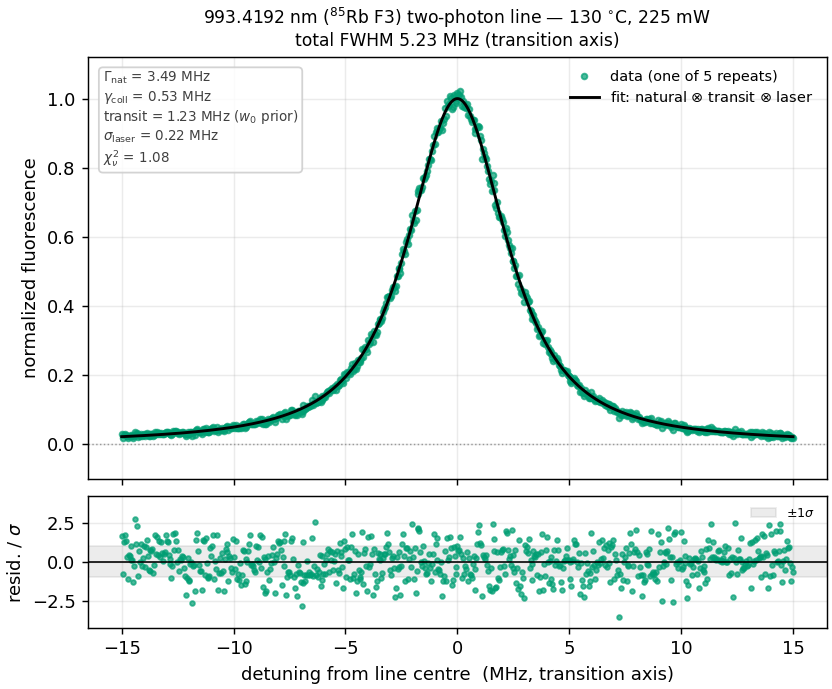
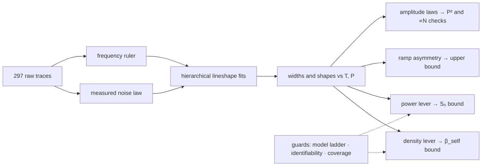
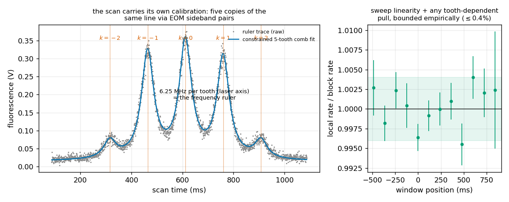
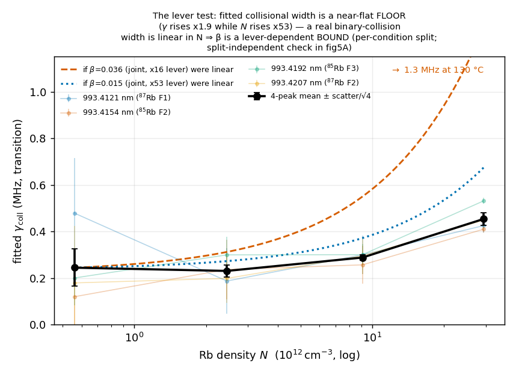
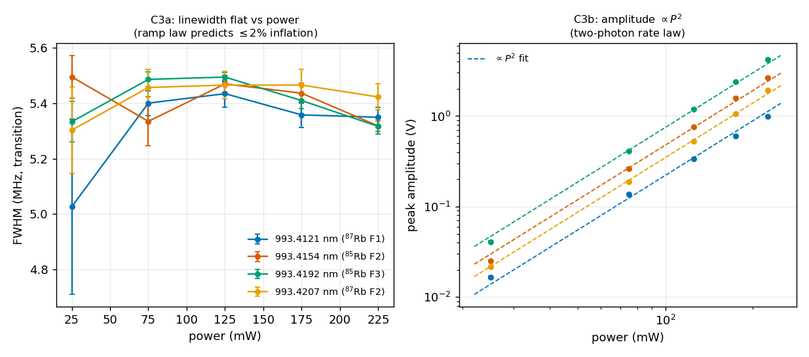
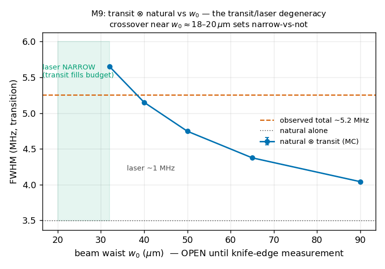

# Rb 5S→6S two-photon lineshape analysis

[](https://github.com/MichelangeloDondi/Rb-5S-6S-analysis/actions/workflows/tests.yml)
[](https://github.com/MichelangeloDondi/Rb-5S-6S-analysis/releases)
[](LICENSE)

A physics-based forward-model analysis of the rubidium **5S₁/₂ → 6S₁/₂** two-photon
transition at **993 nm** — Doppler-free spectroscopy in a hot vapour cell. Data taken at OIST
in 2025; a fixed-lock follow-up session is proposed and specified in
[`docs/PLAN.md`](docs/PLAN.md).

<p align="center">
  
</p>

*One 993.4192 nm (⁸⁵Rb) line at 130 °C and 225 mW, with the composite fit and its
residuals. The total width is ≈ 5.2 MHz and the residuals sit at the noise floor
(reduced χ² ≈ 1.1) — this is the raw material everything below is built from.*

> **In one sentence:** from a 2025 dataset taken with a drifting laser lock, we
> extract what lives in the *shape* of the line — collisional
> broadening, laser width, the power-dependent light shift — as **bounds**,
> and lay out a proposed set of fixed-lock measurements that would turn each
> bound into a number.

**Where to go next:** the big picture (goals, prior art, what each future
measurement adds) → [`docs/BIG_PICTURE.md`](docs/BIG_PICTURE.md) ·
full derivations and statistics → [`docs/methods.md`](docs/methods.md) ·
results table (auto-generated) → [`docs/RESULTS.md`](docs/RESULTS.md) ·
measurement plan → [`docs/PLAN.md`](docs/PLAN.md) ·
prior work → [`docs/LITERATURE.md`](docs/LITERATURE.md).

---

## The experiment in one paragraph

A 993 nm beam is retro-reflected through a hot Rb cell. An atom absorbs one photon
from each direction and climbs 5S₁/₂ → 6S₁/₂; because the two photons come from
opposite directions, the first-order Doppler shift **cancels for every atom**,
collapsing the ~500 MHz thermal smear to a line a few MHz wide:

$$\nu\left(1 + \tfrac{v}{c}\right) + \nu\left(1 - \tfrac{v}{c}\right) = 2\nu$$

The 6S₁/₂ population is read out through the 795 nm fluorescence of the
6S₁/₂ → 5P₁/₂ → 5S₁/₂ cascade. Four hyperfine components are recorded across a
temperature sweep (70–130 °C at 225 mW) and a power sweep (25–225 mW at 130 °C) —
297 traces in all: 159 composite-line traces and 105 frequency-ruler calibration
traces, plus 33 quarantined or discarded (full census in
[`docs/DATA.md`](docs/DATA.md)).

## Shapes without centres

The 2025 data were taken with a **slowly drifting lock** (~MHz/min), which has
one consequence:

- absolute line **centres are lost** (drift moves them scan to scan), but
- line **shapes are preserved**.

So the archive reports what the *shape* of a line carries — widths, power-law
scalings, asymmetry — as **bounds, nulls, and confirmed scaling laws**, while
the absolute shifts wait
for a stable lock. This split determines the structure of the results below:
bounds now, with a proposed fixed-lock follow-up (below) to convert each into
a number.

An upper bound is a genuine result: it excludes every model that predicts
more, and each bound here would set the sensitivity target a follow-up
session needs to beat. The width data are already sensitive at the physical
scale (the AC-Stark bound sits just above its prediction), and the 95%
constructions are validated by injection-recovery
([methods §4.11](docs/methods/06_the_statistics.md)), not assumed.

The chain from raw trace to quoted bound — each stage a runnable script, each
output a committed CSV:



Every scan carries its own frequency ruler — an EOM comb that excites five
copies of the line, exactly 6.25 MHz apart on the laser axis — so the
frequency axis is self-calibrated per block even as the lock drifts, and the
ruler *rate* is a differential across identical lines, immune to the light
shift and to the lineshape asymmetry (methods §3):

<p align="center">
  
</p>

## Results at a glance

Every absolute number is limited by a single systematic — the beam waist **w₀** —
so each is reported as a bound together with the measurement that would lift it.

| Quantity | 2025 result | Type | Lifted by |
|---|---|---|---|
| Collisional self-broadening **β_self** | ≲ 0.2–0.4 MHz per 10¹² cm⁻³ (95% per peak) | bound | same-session 150–170 °C points |
| 2025 laser linewidth **σ_laser** | ≈ 0.8 MHz at the w₀ prior (0.4–1.1 over the open w₀) | bound | beam-profile w₀ |
| AC-Stark coefficient **S₀(225 mW)** | < 0.63 MHz (95%, profile likelihood; predicted 0.59) | bound | fixed lock + tighter focus |
| Power scaling | width: no power trend (3–8% block scatter); amplitude consistent with P² | null + consistency check | — |
| Beam waist **w₀** | ≈ 50 µm (prior; Nieddu 2019 measured 64 µm directly on the same-lineage apparatus) | open | beam-profile measurement |

**The fitted collisional width behaves like a floor, not a measurement.** It
barely grows with density (below), while a real binary-collision width must
grow *linearly*. So the fitted width is a residual floor rather than resolved
collisions, and reporting it as a "detection" would misread a floor as a
signal — which is why β_self is quoted as a bound.

<p align="center">
  
</p>

**The power sweep bears out the ramp's power-law predictions.** At fixed
temperature only the AC-Stark shift varies with power, and both hold: the
linewidth stays flat (the shift broadens the line only as S₀², negligible here)
and the amplitude follows the two-photon rate law, ∝ P². These are *consistent
with* the light-shift model, not proof of it — a flat width is equally what zero
shift would give; the ramp's *distinctive* signature, the skew ∝ S₀³, is below
detection in the archive (a bound), which is why the coefficient itself waits
for a fixed-lock session. The S₀ bound and its prediction are independent by
construction: the bound uses only the width-vs-power data (no w₀ enters),
while the predicted 0.59 MHz is the computed polarizability at the beam
geometry's w₀ prior, with the retro ratio ρ=1 asserted (its in-situ measurement
is a fixed-lock-session task) — fixed before the fit and never an input to it.

<p align="center">
  
</p>

## The lineshape, mechanism by mechanism

The measured line is a convolution (⊗) of independent broadening mechanisms:

$$I(\nu) = A\left[ L_{\Gamma_\mathrm{nat}+\gamma_\mathrm{coll}} \otimes G_{\sigma_\mathrm{laser}} \otimes K_\mathrm{transit} \otimes R_{S_0} \right] + \text{background}$$

| Mechanism | Physical origin | Size (transition axis) | Shape |
|---|---|---|---|
| Natural width **Γ_nat** | finite 6S lifetime | 3.49 MHz (fixed, known) | Lorentzian |
| Collisional **γ_coll** | Rb–Rb collisions | ≲ 0.5 MHz | Lorentzian (adds to natural) |
| Laser **σ_laser** | laser frequency jitter | ≲ 1 MHz | Gaussian |
| Transit | finite time an atom spends in the beam | ~1.2 MHz at w₀ ≈ 50 µm | cusp kernel (Biraben–Cagnac / Lehmann) |
| AC-Stark **R(S₀)** | intensity-dependent light shift across the focus | ~0.6 MHz at 225 mW | triangular "ramp" |

The AC-Stark **ramp** is the analysis's novel core: because the beam is focused,
the light shift runs from zero at the dim edge to a maximum S₀ on the bright axis,
and for a two-photon (intensity-squared) signal that distribution is a closed-form
triangle. Its skew is a light-shift readout that survives a drifting lock — the
derivation is in [`docs/methods/03_the_ac_stark_ramp.md`](docs/methods/03_the_ac_stark_ramp.md) and
[`docs/THEORY_NOTE.md`](docs/THEORY_NOTE.md).

## The dominant systematic: the beam waist w₀

The transit width and the laser width both depend on the beam waist, and the
archive cannot separate them — a tighter waist means more transit broadening and
less room for laser width, and vice versa. The observed ≈ 5.2 MHz line is
reproduced anywhere from w₀ ≈ 20 µm (laser width → 0) up to ≈ 65 µm (laser ~1.1 MHz).
Only a direct beam-profile measurement (a knife-edge scan, a camera beam
profiler, or both) collapses this — which is why every absolute number above
is w₀-conditional, and why it is the first thing a proposed fixed-lock session
would fix. What each assumption moves, quantity by quantity, is
tabulated live from the result CSVs in [`docs/RESULTS.md`](docs/RESULTS.md)
("Sensitivity at a glance").

<p align="center">
  
</p>

## What a follow-up session would add

- **A proposed fixed-lock session** A stable lock would return the
  absolute centres, and a direct beam-profile measurement (knife-edge and/or
  camera) would pin w₀ — turning the bounds above into the first measured
  5S–6S AC-Stark and collisional self-shift coefficients. With power capped at
  225 mW, the intensity axis would come from the waist instead (a telescope
  gives two working waists spanning a ×16 intensity range), and a same-session
  150–170 °C extension would give β_self a real density lever. Full
  specification: [`docs/PLAN.md`](docs/PLAN.md) §8.
- **Optical nanofibre (Paper 2).** The same ramp law tested in the evanescent field
  at a fibre surface, where an atom–surface potential and the "pushing dip"
  (Gokhroo et al., 2022) ride on the lineshape.

## Reproduce

```bash
python3 -m venv .venv && source .venv/bin/activate
pip install -e ".[dev]"
pytest -q                 # fast test suite (~35 s)
pytest -q --runslow       # full suite incl. high-statistics closure tests (what CI runs)
```

The 2025 dataset is already in `data_raw/`, so the pipeline runs directly. Each
stage reads the previous stages' output in `results/`:

```bash
bash scripts/run_all.sh   # every stage in dependency order, then the figures,
                          # docs/RESULTS.md, and the CSV status column
```

Re-running any stage reproduces its committed CSV in `results/` byte-for-byte.

The headline numbers (the AC-Stark and collisional bounds, the beam-waist prior)
are cited across many documents. `tests/test_docs_canonical.py` holds each in a
single registry, reads its true value from the committed CSV, and checks that
every document quotes *that* value — so a re-analysis that moves a number can
never leave a stale copy behind unnoticed. To change a headline number: re-run
its producer, then run the suite; it names any document still out of step.

The **figures** follow the same rule: `make_figures.py` stamps a fingerprint
of the results CSVs into each PNG's metadata, and `tests/test_figures_fresh.py`
fails if a committed figure was drawn from stale results (the fix is to re-run
`make_figures.py`). The check reads a hash in the PNG, not pixels, so it is
independent of the matplotlib version that drew the figure.

## Repository map

```
rb5s6s/     the library: ingest, quality control, noise model, frequency ruler,
            lineshape + fitting, density, collisional/global/AC-Stark fits,
            transit Monte-Carlo, amplitude analyses, shared utilities
scripts/    one runnable per analysis stage, plus make_figures / make_results_ledger
data_raw/   the frozen 2025 dataset (297 unique traces) + MANIFEST.csv
results/    committed output CSVs (the documented run)
figures/    publication figures produced by make_figures.py
tests/      full test battery; CI runs it on the minimum and latest numpy
docs/       methods.md (index) + methods/ (8 ordered chapters: the full
            derivations) · PLAN.md (measurement plan) ·
            RESULTS.md (auto-generated results table) · DATA.md (data provenance) ·
            APPARATUS.md (hardware of record + provenance) ·
            THEORY_NOTE.md (AC-Stark ramp theory) · LITERATURE.md (prior work) ·
            PAPER1_SKELETON.md (manuscript outline)
```

## Conventions

- **Transition-frequency axis everywhere** — the two-photon sum frequency, i.e.
  twice the laser frequency. Per-photon quantities carry a `_LASER` suffix in code.
- **Every number carries a provenance tag** (measured here / calculated /
  established / open) so nothing reads as more certain than it is; the same tags
  drive the machine-readable `status` column on every results CSV.
- **Physics constants and analysis choices are separated** (`constants.py` vs
  `config.py`); repeat counts are read from `MANIFEST.csv` rather than
  inferred from filenames, and data-quality cuts are fixed before fitting
  rather than chosen afterward.

## About

I am Michelangelo Dondi, a PhD candidate in experimental cold-atom physics at
the University of Bologna (EU H2020 project CRYST³), working on the transport
and cooling of cold ⁸⁷Rb atoms inside hollow-core photonic-crystal fibers —
a platform where the inhomogeneous light shifts of a structured optical field
govern cooling and coherence. This repository reads the same distribution
physics from a different observable: the shape of a two-photon line in a
focused standing wave.

The dataset was taken during a six-month research visit to OIST (Japan) in
2025, as an independent project alongside my main work there on
atom–nanofiber interfaces; the analysis package was developed after the
campaign. A manuscript based on it is in preparation
([`docs/PAPERS_PORTFOLIO.md`](docs/PAPERS_PORTFOLIO.md)).

Contact: michelangelo.dondi@unibo.it ·
[ORCID 0009-0006-9050-2881](https://orcid.org/0009-0006-9050-2881) ·
citation metadata in [`CITATION.cff`](CITATION.cff) · MIT license.
