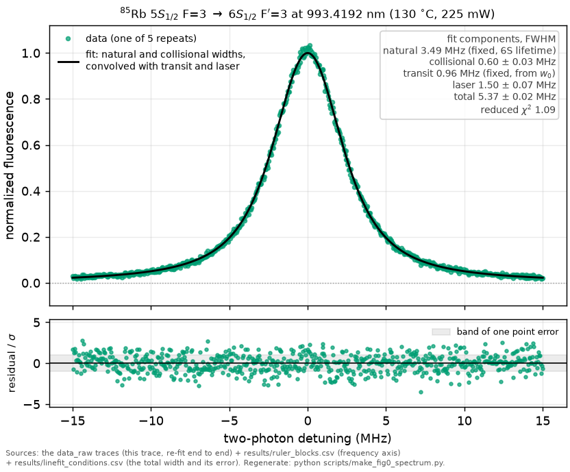
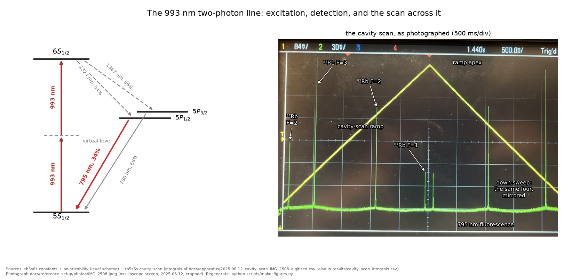
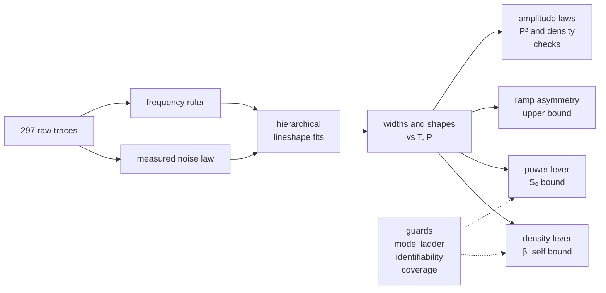
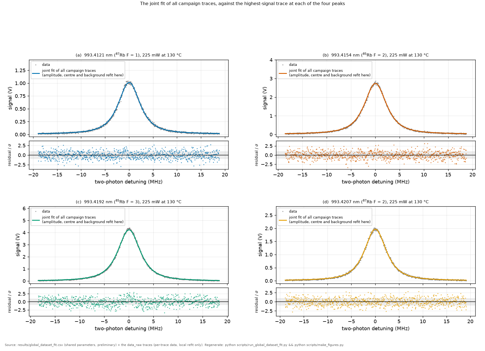
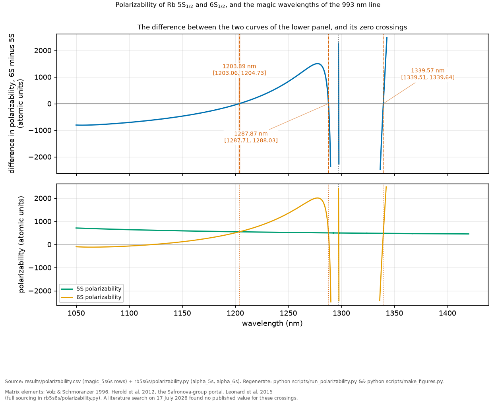

# Rb 5S→6S two-photon lineshape analysis

[](https://github.com/MichelangeloDondi/Rb-5S-6S-analysis/actions/workflows/tests.yml)
[](https://github.com/MichelangeloDondi/Rb-5S-6S-analysis/releases)
[](LICENSE)

> **The result in ten minutes: [docs/plan/00_the-case.md](docs/plan/00_the-case.md)**
> states what was measured, what is not identified and why, the one
> measurement that removes each ambiguity, what a next campaign is projected
> to achieve, and which of this record's claims its own instruments refuted.
>
> **New here? [START_HERE.md](START_HERE.md)** is the short front door: a
> working setup in five minutes, then a reading order that depends on why you
> came. This page is the full account. If the vocabulary is unfamiliar,
> [docs/GLOSSARY.md](docs/GLOSSARY.md) explains the measurement in six
> sentences and then defines every term and symbol used anywhere here.

A physics-based forward-model analysis of the rubidium **5S₁/₂ → 6S₁/₂**
two-photon transition at **993 nm**, from Doppler-free spectroscopy in a hot
vapour cell. The data were taken at OIST in 2025.

The physics is the one that limits cold atoms in structured light. When a
field varies across the atoms that sample it, every atom shifts by a
different amount and the line carries that whole distribution rather than one
number. The same object sets what can be cooled inside a hollow-core fibre,
and for how long it stays coherent, which is the apparatus work this analysis
sits beside (see [About](#about)). A fixed-lock follow-up session is
proposed and specified in [`docs/PLAN.md`](docs/PLAN.md), and the machinery is
written to be pointed at other transitions
([`docs/ADAPTING.md`](docs/ADAPTING.md) names the seams).

> **In one sentence:** when the lock drifts, the position of a line is lost but
> its shape is not, so this record reads collisional broadening, laser width
> and the power-dependent light shift out of the *shape* as **bounds**, and
> specifies the fixed-lock measurements that would turn each bound into a
> number.

The scope and the headline numbers, up front. Four hyperfine components, 264
fitted traces across 70–130 °C and 25–225 mW, three bounds at 95%:
collisional self-broadening β_self < 0.03-0.05 MHz per 10¹² cm⁻³ across the
four peaks (holding across the waist band the data allow), the 2025 laser
width below 2.4 MHz on the two-photon transition axis, which is the axis the
analysis works on, equivalently 1.2 MHz per photon, and the AC-Stark
coefficient S₀(225 mW) < 0.26 MHz against 0.35 predicted (95%, current primary
construction). The last two ride the beam waist, which
is 64 µm from Rajasree's direct measurement in the same conditions, same
optical table, laser and lenses, and not re-measured in this campaign: the prediction rides it directly, the bound only
weakly through its transit kernel, and it is the largest open systematic in
the record.

Two robustness questions were raised about the light-shift bound, and
[`docs/RESULTS.md`](docs/RESULTS.md) records both. The louder one is closed:
independent optimisations appeared to disagree about the bound by a factor of
two, the disagreement was diagnosed as the diagnostic's own display
normalisation, and anchoring the curves to absolute chi-square puts all five
independent starts 4.66 to 26.29 above the production optimum at every
coefficient tested, none of them inside the confidence region. The second,
whether the construction is stable under later code versions, has its cause
identified: a commit sweep traced the movement to one commit that regenerated
the committed ruler CSVs while renaming a vocabulary, which shifts a discrete
trim boundary and changes the fit's point count by five in 248000. How much
of the reported movement that accounts for is being measured.
The full claim ledger, including what is deliberately not claimed, is
[`docs/CLAIMS.md`](docs/CLAIMS.md).

<p align="center">
  
</p>

*One ⁸⁵Rb 5S₁/₂ F=3 → 6S₁/₂ F′=3 line at 130 °C and 225 mW, with the
composite fit and its residuals: total FWHM 5.37 ± 0.03 MHz, reduced χ² 1.09.
This is the raw material everything below is built from. Fitted widths in the
panel carry the one-sigma error of this condition's fit, and the two marked
fixed are inputs: the natural width from the measured 6S lifetime, and the
transit width computed from the beam waist, 64 µm, measured on this apparatus
lineage in Rajasree's 2020 OIST thesis. In the lower strip, σ is each point's own error from
the fit's signal-dependent noise model, which is why the ±1 band is flat.*

**Why the line is worth the difficulty.** The environmental coefficients of the
993 nm 5S→6S line have only ever been bounded, and coarsely. Those
coefficients set how tightly an environment must be controlled to reach any
given stability, so they are worth knowing for a line nobody has measured them
on. This is not a claim that 993 nm beats the 778 nm 5S→5D reference the
compact-clock community already uses. On natural linewidth it starts behind
it, by about an order of magnitude, and nothing here suggests otherwise
([`docs/BIG_PICTURE.md`](docs/BIG_PICTURE.md) §1).

**What each piece would buy.** A beam-profile measurement of the waist would sharpen
every bound already in the record, with no new physics run. A fixed-lock cell session
turns the light-shift and collisional bounds into measurements. A nanofibre
session reads the same ramp law in an evanescent field, against the cell as
its reference. The dependency map is the first thing in
[`docs/BIG_PICTURE.md`](docs/BIG_PICTURE.md).

<p align="center">
  
</p>

*The bench, components numbered 1–13 as in the annotated photograph. Every
element is established in [`docs/APPARATUS.md`](docs/APPARATUS.md), which
also carries the dated photographs behind each box.*

**On this page**, in order, so you can jump rather than scroll:
[how the measurement works](#how-the-measurement-works) ·
[shapes without centres](#shapes-without-centres), the limitation everything
else follows from ·
[results at a glance](#results-at-a-glance) ·
[the lineshape, mechanism by mechanism](#the-lineshape-mechanism-by-mechanism) ·
[the dominant systematic](#the-dominant-systematic-the-beam-waist-w₀) ·
[what a follow-up session would add](#what-a-follow-up-session-would-add) ·
[**reproduce it**](#reproduce), which is the section to start from if you would
rather run the thing than read about it ·
[repository map](#repository-map) ·
[conventions](#conventions) ·
[about](#about).

**Where to go next:** the big picture (goals, prior art, what each future
measurement adds) → [`docs/BIG_PICTURE.md`](docs/BIG_PICTURE.md) ·
when pooling measurements adds information and when it only adds freedom, with
six questions to ask of any joint fit →
[`docs/big_picture/08`](docs/big_picture/08_when-a-joint-fit-is-legitimate.md) ·
one page per concept, method, effect and technique, each with a worked example
that runs → [`docs/wiki/`](docs/wiki/README.md) ·
one page per physical quantity, with what the literature has reached, what this
dataset establishes, why not more, and what a next campaign would buy →
[`docs/quantities/`](docs/quantities/README.md) ·
full derivations and statistics → [`docs/methods.md`](docs/methods.md) ·
results table (auto-generated) → [`docs/RESULTS.md`](docs/RESULTS.md) ·
measurement plan → [`docs/PLAN.md`](docs/PLAN.md) ·
prior work → [`docs/LITERATURE.md`](docs/LITERATURE.md) ·
adapting it to your line → [`docs/ADAPTING.md`](docs/ADAPTING.md).

---

## How the measurement works

A 993 nm beam is retro-reflected through a hot Rb cell. An atom with axial
velocity $v_z$ sees the two beams Doppler-shifted in opposite senses, so
absorbing one photon from each direction drives 5S₁/₂ → 6S₁/₂ at

$$\nu\left(1 + \tfrac{v_z}{c}\right) + \nu\left(1 - \tfrac{v_z}{c}\right) = 2\nu$$

with the first-order Doppler shift cancelling for every atom at once. The
thermal smear, roughly half a GHz per photon, collapses to a line a few MHz
wide. The surviving second-order term is of order 0.4 kHz here, four orders
below the linewidth.

<p align="center">
  
</p>

*Left: two 993 nm photons, one from each direction, drive 5S₁/₂ → 6S₁/₂
through a virtual level that lies below the real 5P₁/₂. The atom returns by
the 6S → 5P → 5S cascade and the bench detects the 795 nm arm. Right: the
cavity scan's up-sweep carries the laser across all four hyperfine
components, two per isotope, all F → F. Their spike integrals track the
ground-state populations, abundance × (2F+1)/G_iso: the up-sweep ⁸⁵Rb ratio
reads 1.42 against the predicted 7/5 = 1.40, and the isotope pairs 2.45
against the abundance ratio 2.59, from the digitised record
(`rb5s6s/cavity_scan.py` and [`docs/APPARATUS.md`](docs/APPARATUS.md)
section 6).*

The 6S₁/₂ population is read out through the 795 nm fluorescence of the
6S₁/₂ → 5P₁/₂ → 5S₁/₂ cascade. Four hyperfine components are recorded across
a temperature sweep (70–130 °C at 225 mW, spanning N = 0.56–29 × 10¹² cm⁻³)
and a power sweep (25–225 mW at 130 °C). The dataset holds 297 traces:
159 composite-line traces and 105 frequency-ruler calibration traces enter
the fits, and the remaining 33 files from the same nights are excluded before
any fit. Those 33 are an aborted first attempt at one power sweep, its
calibration brackets, and four individually excluded shots (one with a
measured defect, one a duplicate save, two held out by pre-registration),
each exclusion with its stated reason in [`docs/DATA.md`](docs/DATA.md).

## Shapes without centres

The 2025 data were taken with a drifting, hand-re-centred lock, with MHz-scale
re-centrings between blocks (a block is one set of back-to-back repeats at a
fixed condition, [APPARATUS §6](docs/APPARATUS.md)). The consequence:

- absolute line **centres are lost** (drift moves them scan to scan), but
- line **shapes are preserved**.

<p align="center">
  
</p>

*The whole constraint. Top: the problem as photographed on a preliminary
session, a wavemeter record of cavity re-locks and relaxations. Middle: the
campaign reconstructed from its own traces. Each vertical stroke is one
trace's own scan ramp, offsets are comparable only between traces taken at
the same scope setting, and the held lock's drift is bounded at order
0.02 MHz/min over three hours, with its sign undetermined. Shapes survive, centres do not. Bottom: what each drift
regime licenses, from the 2025 bounds to the fixed-lock session that would
convert them.*

The numbers behind the figure were recovered, not recorded: the exports carry
no acquisition time, and a backup that did was audited under a
pre-registration written before it was opened. The held-lock drift is bounded
at order 0.02 MHz/min on the laser axis (per-photon frequency, half the
transition axis every linewidth here is quoted on), with the sign
undetermined once the scope offsets are accounted for. The megahertz motion
was the hand re-centring after lock dropouts, not the drift. The full trail,
including the retraction of a drift headline that turned out to track the
oscilloscope's own window setting rather than the laser, is in
[`docs/PREREGISTRATION_RESULTS.md`](docs/PREREGISTRATION_RESULTS.md).

The record therefore reports what the *shape* of a line carries (widths,
power-law scalings, asymmetry) as bounds, nulls and consistency checks, while
the absolute shifts wait for a stable lock. Each bound sets the sensitivity
target a follow-up session would need to beat. The width-only AC-Stark bound
brackets its prediction rather than resolving it (the predicted effect is
about one block's width scatter, so the bound rests on averaging), while the
joint three-session fit lands below the predicted band, the tension the
results table quotes. The width-channel 95% construction is validated by
injection-recovery ([methods §4.11](docs/methods/06_the_statistics.md)), not
assumed, and its profile-bound coverage is measured in
[a dedicated study](docs/notes/stark_coverage_postscript.md). The joint
three-session construction has no coverage run of its own, and its profile
passes disagree about the bound by a factor of two, a convergence question
examined in [chapter 8](docs/big_picture/08_when-a-joint-fit-is-legitimate.md).

The chain from raw trace to quoted bound, each stage a runnable script, each
output a committed CSV:


```mermaid
flowchart LR
    T["297 raw traces"] --> N["measured noise law"]
    T --> K["frequency ruler"]
    N --> F["hierarchical<br/>lineshape fits"]
    K --> F
    F --> W["widths and shapes<br/>vs T, P"]
    W --> D["density lever<br/>β_self bound"]
    W --> P["power lever<br/>S₀ bound"]
    W --> S["ramp asymmetry<br/>upper bound"]
    W --> A["amplitude laws<br/>P² and density<br/>checks"]
    G["guards<br/>model ladder<br/>identifiability<br/>coverage"] -.-> D
    G -.-> P
```

A lever is the spread of conditions a fit uses to pin down a slope: the wider
the temperature or power range, the tighter the bound. The fits are
hierarchical in the plain sense that some parameters are shared across a
peak's traces while others stay free per trace. The dashed **guards** are the
three validation analyses that gate the headline bounds
([methods §4](docs/methods/06_the_statistics.md)):

- **Model ladder.** Every lineshape component must earn its place against
  nested alternatives (ΔBIC), so nothing is over- or under-fitted.
- **Identifiability.** Profile likelihoods establish which parameters the
  data can actually separate. Where transit and laser width are degenerate,
  the bound carries that degeneracy as an explicit band.
- **Coverage.** The quoted 95% intervals are re-run on campaign-like
  synthetic data with known truth, and must cover that truth at the stated
  rate.

The **amplitude checks** are the two-photon rate laws: peak amplitude must
scale as P² at fixed density and linearly with N at fixed power. The density
law holds (log-log slopes 0.85–1.02). **The power law does not hold exactly,
and this was corrected in 2026-08-18 after the slopes were tested against 2
rather than read as a band.** Three of the four exclude 2 under a block
bootstrap, the departure replicates in an independent session with opposite
ladder directions and is invariant under that direction, and its ordering
across the lines follows their brightness rather than any atomic quantity,
which makes it a signature of the detection rather than of the transition
([the note](docs/notes/amplitude_departure_from_p2.md)).

Every scan carries its own frequency ruler: the 12.5 MHz EOM's sideband pairs
excite copies of the line every 12.5 MHz on the transition axis, 6.25 MHz
apart in laser tuning, up to seven per scan. The frequency axis is therefore
self-calibrated per block even as the lock drifts, and the ruler *rate* is a
differential across identical lines, immune to the light shift and to the
lineshape asymmetry ([methods §3](docs/methods/05_the_frequency_ruler.md)):

<p align="center">
  
</p>

*Left: one ruler trace with its seven-tooth comb fit, six teeth standing above
the trace's own fit residual. The panel states why the seventh is below it: at
this modulation depth the third-order pair carries about 2% of the first-order
power, and the scan end clips the outermost window, as on every recorded ruler
([pre-registration amendment 4](docs/notes/ruler_validity_and_trim_prereg.md)).
The strip below is the
residual in units of each point's own error, the same convention as the fit
above, and the climb at the scan end is that clipped window. Right: the
sweep-linearity check, local rate against block rate, flat to within 0.3% in
the well-sampled windows.*

## Results at a glance

The model these numbers rest on, shown against one representative trace per
line: the global dataset fit at its best-fit parameters, residuals below each
panel. The sub-unity reduced χ² reflect the conservative per-block noise
inflation (1.2–2.2×), not an over-fit. The antisymmetric near-centre residual
structure is shot noise (it falls as amplitude^-0.5 on both the power and
temperature axes). One feature remains unattributed: a symmetric centre
excess reaching 1.4% of peak on the brightest line, 3.7σ against the
uninflated errors and absorbed by the inflation. It changes none of the
reported values.

<p align="center">
  
</p>

The dominant shared systematic for every absolute number is the beam waist
**w₀** (density scale, model form and block scatter contribute at a lower
level, see RESULTS), so each is reported as a bound together with the
measurement that would lift it.

| Quantity | 2025 result | Type | Lifted by |
|---|---|---|---|
| Collisional self-broadening **β_self** | ≲ 0.03-0.05 MHz per 10¹² cm⁻³ (95% per peak, four-point 70/90/110/130 °C density lever) | bound | partly delivered already by folding the dataset's 130 °C point into the density lever (2026-08-02). Same-session 150–170 °C points and a lower between-block scatter are still needed for a measurement |
| 2025 laser linewidth **σ_laser** | 1.75–2.15 MHz across the four temperature blocks (transition axis, so 0.88–1.08 MHz per photon). 95% bound 1.2 MHz per photon, equivalently 2.4 MHz on the transition axis, at the accepted lineage waist, rising with w₀ | bound | beam-profile w₀ |
| AC-Stark coefficient **S₀(225 mW)** | < 0.26 MHz (95%, joint three-session profile likelihood at the unscaled 2.706 threshold. Below the 0.35 predicted at the accepted lineage waist, see [RESULTS](docs/RESULTS.md). Two robustness questions were raised. The multi-start alarm is CLOSED, diagnosed as the diagnostic's own display normalisation and settled by anchoring to absolute chi-square, where the five independent starts sit 4.66 to 26.29 above the production optimum and none enters the confidence region. The code-version question has its cause identified as of 2026-08-20, and its size is being measured. A commit sweep found the fit's point count changing at exactly one commit, which renamed a vocabulary across the tree and regenerated the committed ruler CSVs as a side effect, shifting fitted rates in their eleventh digit. A shift that small still moves a discrete trim boundary and admits five more samples, so the inputs were never byte-identical and no arithmetic is defective. Whether five samples account for the whole reported movement is the open half, and the primary bound above is unaffected either way. Loose by a factor 2.21, because atomic saturation broadens with the same power signature and is deliberately absent from the model behind it. That factor comes from a companion note that no producer regenerates, so it is weaker evidence than the bound it qualifies) | bound | fixed lock + tighter focus |
| Power scaling | width: no power trend (3–8% block scatter); amplitude departs from P², replicated and brightness-ordered | null + a measured departure | — |
| Beam waist **w₀** | 64 µm, Rajasree's direct measurement in the same conditions (same optical table, laser and lenses), not re-measured in this campaign. Rajasree's 2020 OIST thesis recorded a 128 µm 1/e² diameter on a profiler, through the same 150 mm lens, at 130 °C, in the same retro geometry, on the same laser model. Nieddu 2019 quotes the identical 128 µm on the previous laser | measured (lineage) | a knife-edge scan on this bench would confirm it here |
| Differential polarizability **Δα(993 nm)** | recomputed −1145 a.u.; \|Δα\| within ~5% of Orson 2021's 1093 but opposite sign. Orson's side is verified from the typeset PDF (convention stated in words, value repeated in SI, his own worked −0.66 MHz reproduced here at −0.653), so the disagreement is real rather than a units artifact ([THEORY_NOTE §5](docs/THEORY_NOTE.md)); this work's sign is anchored to the measured static α and tune-out | calculated | external sign adjudication |
| First **5S–6S magic wavelengths** (scalar) | ≈ 1203.9 / 1287.9 / 1339.6 nm, a trap there would hold both states without pulling the 993 nm line. The 1204 nm crossing sits on the smooth part of the curve and is the practical one, and the other two lie hard against 6S→nP resonances, where trap-photon scattering is high. No published values found to the depth searched (2026-07-17) | calculated (envelope) | vector term under circular polarization, and a trapped-atom experiment |

The last row of the table, drawn. The lower panel shows why the crossings
exist where they do: the flat 5S polarizability threads the 6S curve's
nearby resonances.

<p align="center">
  
</p>

**The fitted collisional width behaves like a floor, not a measurement.** It
barely grows with density (below), while a real binary-collision width must
grow *linearly*, so β_self is quoted as a bound. A density-independent floor
is also what an unresolved instrumental component would produce, or a fixed
foreign-gas broadening from an undocumented cell fill
([APPARATUS §5](docs/APPARATUS.md) records that the cell's fill history is
not on record).

<p align="center">
  
</p>

**The power sweep bears out the ramp's power-law predictions.** At fixed
temperature only the AC-Stark shift varies with power, and both predictions
hold: the linewidth stays flat (the shift broadens the line only as S₀²,
negligible here) and the amplitude follows the two-photon rate law, ∝ P².
These are *consistent with* the light-shift model, not proof of it. A flat
width is equally what zero shift would give, and the ramp's *distinctive*
signature, the skew ∝ S₀³, is below detection in the dataset (a bound). The
coefficient itself waits for a fixed-lock session. The S₀ bound and its
prediction are independent by construction: the bound uses only the
width-vs-power data (no w₀ enters), while the predicted 0.35 MHz is the
computed polarizability at the beam geometry's w₀ prior, with the retro
ratio ρ=0.94±0.04 (its in-situ measurement is a fixed-lock-session task),
fixed before the fit and never an input to it.

<p align="center">
  
</p>

## The lineshape, mechanism by mechanism

The measured line is a convolution (⊗) of independent broadening mechanisms:

$$I(\nu) = A\left[ L_{\Gamma_\mathrm{nat}+\gamma_\mathrm{coll}} \otimes G_{\sigma_\mathrm{laser}} \otimes K_\mathrm{transit} \otimes R_{S_0} \right] + \text{background}$$

| Mechanism | Physical origin | FWHM (transition axis) | Shape |
|---|---|---|---|
| Natural width **Γ_nat** | finite 6S lifetime | 3.49 MHz (fixed, known) | Lorentzian |
| Collisional **γ_coll** | Rb–Rb collisions | 0.19–0.93 MHz across the 32 fitted conditions | Lorentzian (adds to natural) |
| Laser **σ_laser** | laser frequency jitter | 1.75–2.15 MHz across temperature blocks | Gaussian |
| Transit | finite time an atom spends in the beam | ~0.93 MHz at w₀ ≈ 64 µm | cusp kernel (Biraben–Cagnac / Lehmann) |
| AC-Stark **R(S₀)** | intensity-dependent light shift across the focus | ~0.35 MHz at 225 mW | triangular "ramp" |

Every width in the table is a FWHM. σ_laser names the Gaussian laser kernel's
FWHM, already doubled for the two photons. The background is flat over the
scan window: the same-beam absorption pedestal is about a GHz wide, so it
enters as a constant.

The AC-Stark **ramp** is what the rest of the analysis is built on: because
the beam is focused, the light shift runs from zero at the dim edge to a
maximum S₀ on the bright axis, and for a two-photon (intensity-squared)
signal that distribution is a closed-form triangle. Its skew is a
light-shift readout that survives a drifting lock. The derivation is in
[`docs/methods/03_the_ac_stark_ramp.md`](docs/methods/03_the_ac_stark_ramp.md)
and [`docs/THEORY_NOTE.md`](docs/THEORY_NOTE.md).

## The dominant systematic: the beam waist w₀

The transit width and the laser width both depend on the beam waist, and the
dataset cannot separate them: a tighter waist means more transit broadening
and less room for laser width, and vice versa. The observed ≈ 5.3 MHz line is
reproduced anywhere from w₀ ≈ 38 µm (the hard floor, where the laser width
goes to zero) upward, and the data alone set no ceiling. The 64 µm working
value is a prior from two direct profile measurements on the same-lineage
beamline (Nieddu 2019, and Rajasree's 2020 OIST thesis), not a fit result. Only a direct
beam-profile measurement (a knife-edge scan, a camera profiler, or both)
collapses the degeneracy. Every absolute number above is w₀-conditional, and
the beam profile is the first thing a proposed fixed-lock session would fix.
What each assumption moves, quantity by quantity, is tabulated live from the
result CSVs in [`docs/RESULTS.md`](docs/RESULTS.md) ("Sensitivity at a
glance").

<p align="center">
  
</p>

## What a follow-up session would add

- **A proposed fixed-lock session.** A stable lock returns the absolute
  centres, and a direct beam-profile measurement pins w₀, turning the bounds
  above into the first measured 5S–6S AC-Stark and collisional self-shift
  coefficients. With power capped at 225 mW, the intensity axis would come
  from the waist instead: a telescope gives two working waists spanning a
  ×16 intensity range. Points at 150–170 °C in the same session would give
  β_self a density lever without borrowing a temperature point from another
  epoch. The dataset's own 130 °C point already stretches the lever to
  ×52.5, but reach alone is not enough while the between-block scatter is
  co-limiting. Full specification: [`docs/PLAN.md`](docs/PLAN.md) §8.
- **Optical nanofibre.** The same ramp law tested in the evanescent field at
  a fibre surface, where an atom–surface potential and the "pushing dip"
  (Gokhroo et al., 2022) ride on the lineshape.

## Reproduce

```bash
python3 -m venv .venv && source .venv/bin/activate
pip install -e ".[dev]"
pytest -q                 # fast test suite (~2 min)
pytest -q --runslow       # full suite incl. high-statistics closure tests (what CI runs)
```

The 2025 dataset is already in `data_raw/`, so the pipeline runs directly.
The analysis is a library with its physics, apparatus, and statistics kept
behind separate seams. [docs/ADAPTING.md](docs/ADAPTING.md) names them for
anyone pointing the machinery at a different transition, species, or light
geometry, and [examples/your_line.ipynb](examples/your_line.ipynb) lets you
try it on your own line by editing one dictionary. Each stage reads the
previous stages' output in `results/`:

```bash
bash scripts/run_all.sh   # 29 analysis stages in dependency order, then the
                          # figures, docs/RESULTS.md, and the CSV status column
```

Re-running any stage reproduces its committed CSV in `results/` within the
tolerance `scripts/verify_results_fresh.py` states, and to the printed digit
in the environment [`results/ENVIRONMENT_OF_RECORD.md`](results/ENVIRONMENT_OF_RECORD.md)
records. The runner writes the core subset of the 69 committed CSVs, and
the rest have their own scripts, several needing raw trees that stay
outside the repository. The lock-drift measurement and its audit trail reproduce from
a clone with no raw traces at all, off the committed acquisition clock.
[`docs/REPRODUCING.md`](docs/REPRODUCING.md) says which script writes what,
and how each quoted number is held to the file that produces it.

## Framework or result: which part of this is reusable

This repository holds two things with different lifetimes, and telling them
apart is worth one paragraph before the map.

**The framework** is the analysis machinery: line shapes, fitting, the noise
model, the frequency ruler, the diagnostics. It is a release candidate. It
imports and runs with no raw data present, and `examples/synthetic_recovery.py`
demonstrates it end to end on synthetic data whose answer is known, reporting
the recovery against the fit's own uncertainty rather than asserting the fit
looks reasonable. Run it first:

```
python examples/synthetic_recovery.py
```

**The framework is a digital twin of an experiment.** The same forward model
that fits real data also generates it, so an experiment that has not been
built yet can be run in software first: choose a line and an apparatus,
synthesise the traces the real instrument would record, fit them back with
the fitter the real data would meet, and read the achievable precision off
the fit's own covariance. [docs/TUTORIAL.md](docs/TUTORIAL.md) walks that
loop for a line of your choosing, and its every code block runs as

```
python examples/tutorial_forecast.py
```

The worked case is this project's own next campaign.
`examples/campaign_twin.py` builds the dataset that campaign aims to collect,
with the hyperfine amplitudes and cascade depletion, the saturation
companions, the AC-Stark ramp, the blackbody shift, the measured noise law
and the planned acquisition design all present, fits it back, and reports
what the campaign would establish. It runs two worlds, one with the predicted
light shift injected and one with nothing injected, because a design that
finds what was put in has demonstrated only half of what matters.

The expert layer is a second step, deliberately not the first. Cascade
populations under repeated excitation, blackbody as a temperature boundary,
and model comparison as an evidence vector are exercised end to end by

```
python examples/full_model_tour.py
```

which also reads from no repository data. Meeting the core architecture before
those modules is the intended order, and the whole route is
`synthetic_recovery.py`, then [the tutorial](docs/TUTORIAL.md), then
`your_line.ipynb` for forward modelling, then `full_model_tour.py`.

**The rubidium result** is experiment-specific and still under scientific
adjudication. Every number in `results/` carries a status label (BOUND,
PRELIM, DIAGNOSTIC, CALIB, ENVELOPE) and those labels are load-bearing: a
PRELIM is not a result, and a BOUND is not a value. `docs/HISTORY.md` is the
one place a retired number is licensed to appear, so a figure or a sentence
anywhere else states the current position only.

**Releasing the framework is not an endorsement of the result.** The two can
move independently, and they do. Nothing in `rb5s6s/` asserts that the
collisional coefficient or the light-shift bound is settled, and the framework
would be equally correct if both changed tomorrow.

What is not yet true: no independent scientist has installed this and applied
it to a dataset that is not ours, so this is a release candidate rather than a
community release. What the release act itself requires, and which of those
requirements have already been verified, is
[the release checklist](docs/RELEASE_CHECKLIST.md).

## Repository map

```
rb5s6s/     the library: ingest, quality control, noise model, frequency ruler,
            lineshape + fitting, density, collisional/global/AC-Stark fits,
            transit Monte-Carlo, amplitude analyses, shared utilities.
            `import rb5s6s` exposes an eighteen-name core, the names a first
            analysis needs. The expert layers stay in submodules and are
            imported by path, for instance
            `from rb5s6s.forecast import forecast_precision` for the
            design and identifiability engine the tutorial's forecast section
            runs on, and likewise `rb5s6s.cascade`, `rb5s6s.blackbody` and
            `rb5s6s.identifiability`
scripts/    one runnable per analysis stage, plus make_figures / make_results_ledger
examples/   synthetic_recovery.py, the package's own known-truth check on
            data it generates itself; tutorial_forecast.py, every code block
            of docs/TUTORIAL.md in order; campaign_twin.py, the digital twin
            of this project's next campaign with its full physics, run against
            an injected truth and against a null; full_model_tour.py, the
            expert modules (cascade depletion, blackbody boundary, model
            comparison) end to end; your_line.ipynb, the pipeline pointed at a
            different line by editing one dictionary
data_raw/   the frozen 2025 dataset (297 unique traces) + MANIFEST.csv
data_recovered/  the backup-recovered layer: the acquisition clock
            (CLOCK.csv), backup-only discards, degradation lineage
results/    the committed output CSVs (the documented run)
figures/    publication figures produced by make_figures.py
tests/      full test battery, run by CI on the minimum and latest numpy
docs/       the documentation tree. The ones to read first:
            CLAIMS.md (the claim ledger) · BIG_PICTURE.md (goals, prior art,
            what each future measurement would add) · ADAPTING.md (the seams
            for another line) · methods.md (index) + methods/ (8 ordered
            chapters: the full derivations) · wiki/ (one page per concept,
            method, effect and technique) · PLAN.md (measurement plan) ·
            RESULTS.md (auto-generated results table) · DATA.md (data provenance) ·
            REPRODUCING.md (what runs from a clone, and what does not) ·
            APPARATUS.md (hardware of record + provenance) + apparatus/
            (the dated photographs and the bench schematic) ·
            THEORY_NOTE.md (AC-Stark ramp theory) · LITERATURE.md (prior work)
            + LITERATURE_INDEX.md (generated index of the per-paper notes)
            + lit/ (one note per paper) + references.bib ·
            PREREGISTRATION_timestamps.md + PREREGISTRATION_RESULTS.md
            (the timestamp audit: frozen predictions, results, dated addenda) ·
            RESEARCH_DECISIONS.md (why the analysis stops where it does) ·
            notes/ (the pre-registrations of record, and working notes) · STYLE.md
private/    local working folder, excluded by .gitignore and enforced by
            tests/test_repo_hygiene.py
```

The map above is a picture, so the documents that appear only in it are linked
here: [`RESEARCH_DECISIONS.md`](docs/RESEARCH_DECISIONS.md),
[`STYLE.md`](docs/STYLE.md),
[`LITERATURE_INDEX.md`](docs/LITERATURE_INDEX.md),
[`PREREGISTRATION_timestamps.md`](docs/PREREGISTRATION_timestamps.md), and the
two pre-registrations of record under `docs/notes/`: the ruler fit validity and
residual-tail trimming
[specification](docs/notes/ruler_validity_and_trim_prereg.md), whose opening
table carries the current state of every ruler rule, and the
[full-dataset fit specification](docs/notes/full_dataset_fit_prereg.md).

## Conventions

- **Transition-frequency axis everywhere**, meaning the two-photon sum
  frequency, which is twice the laser frequency. Per-photon quantities carry a `_LASER` suffix in code.
- **Every number carries a provenance tag**, one of measured here, calculated,
  established or open. The same tags drive the status field on every results
  CSV.
- **Physics constants and analysis choices are separated** (`constants.py`
  against `config.py`). Repeat counts are read from `MANIFEST.csv` rather than
  inferred from filenames, and data-quality cuts are fixed before fitting
  rather than chosen afterward.

## About

I am Michelangelo Dondi, a PhD candidate in experimental cold-atom physics at
the University of Bologna, on the EU project cryst³. My work there is the
transport and cooling of cold ⁸⁷Rb atoms inside hollow-core photonic-crystal
fibres, where the light shifts of the guided mode vary across the atoms and
set what can be cooled and how long it stays coherent. This repository looks
at the same physics through a different observable: the shape a two-photon
line takes when a focused standing wave shifts each atom differently.

The dataset was taken during a six-month research visit to OIST (Japan) in
2025, an independent project alongside my work there on atom-nanofibre
interfaces. The analysis was written after the campaign. A manuscript is in
preparation.

Contact: michelangelo.dondi@unibo.it ·
[ORCID 0009-0006-9050-2881](https://orcid.org/0009-0006-9050-2881) ·
citation metadata in [`CITATION.cff`](CITATION.cff) · mit license.
