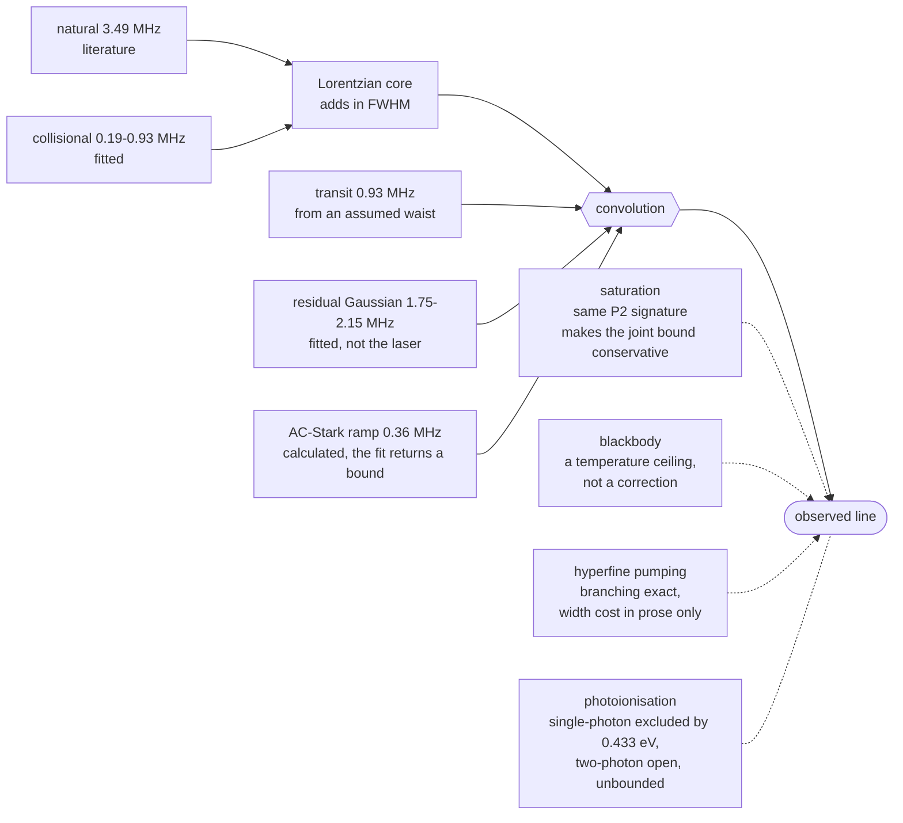

# Rb 5S→6S two-photon lineshape analysis

A forward-model analysis of the rubidium **5S₁/₂ → 6S₁/₂** two-photon
transition at **993 nm**, from Doppler-free spectroscopy in a hot vapour cell.
The data were taken at OIST in 2025.

**The line is used as an instrument, not as a reference.** Its width is a sum
of mechanisms that respond differently to the two knobs a cell gives you,
temperature and power, and separating them is the measurement. The 2025
campaign bounds three and measures none: the cavity lock drifted, so absolute
centres were lost and shapes survived.

  

**The dataset holds 297 traces**: 159 composite-line traces across four peaks,
105 frequency-ruler traces, and 33 files excluded before
fitting ([how each exclusion was made](docs/DATA.md)).

**Everything here is reproducible** from the committed producers.
[docs/RESULTS.md](docs/RESULTS.md) reads every headline from its producing row.

---

## About

I am Michelangelo Dondi, a PhD candidate in experimental cold-atom physics at
the University of Bologna, on the EU project CRYST³, working on the transport
and cooling of cold ⁸⁷Rb atoms inside hollow-core photonic-crystal fibres.

These data were taken during a six-month research visit to OIST in 2025, an
independent project alongside my work there on atom–nanofibre interfaces. A
manuscript is in preparation.

**Why this line is worth the difficulty.** The physics here limits cold atoms
in structured light. When a field varies across the atoms that sample it, each
shifts by a different amount and the line carries the whole distribution. The
same object sets what can be cooled inside a hollow-core fibre and for how
long it stays coherent, which is the apparatus work this sits beside.

**Why it is hard.** Four mechanisms of comparable size overlap inside the
line, and a fit that frees them all determines only their total. The work is
finding levers that separate them, and saying which separations the data do
not support.

→ [why this transition](docs/big_picture/01_why-this-line.md) ·
[the case in ten minutes](docs/plan/00_the-case.md) ·
[prior art](docs/big_picture/03_goals-and-prior-art.md)

<!-- term-of-art: the assistant is named because the disclosure is the point -->
> This repository was developed with the assistance of Claude Code for coding,
> documentation and workflow support. The experiment, data analysis, and
> scientific decisions are my own.

---

## The model

$$I(\nu) = A\left[L_{\Gamma_\mathrm{nat}+\gamma_\mathrm{coll}} \otimes G_{\sigma} \otimes K_\mathrm{transit} \otimes R_{S_0}\right] + b$$

A Lorentzian core, a Gaussian residual, the transit cusp and the light-shift
ramp, convolved. Solid arrows below enter that convolution. Dashed ones act on
the observation without being part of the profile.

```mermaid
flowchart LR
    NAT["natural 3.49 MHz<br/>literature"] --> CORE
    COL["collisional 0.19-0.93 MHz<br/>fitted"] --> CORE
    CORE["Lorentzian core<br/>adds in FWHM"] --> CONV
    TRA["transit 0.93 MHz<br/>from an assumed waist"] --> CONV
    LAS["residual Gaussian 1.75-2.15 MHz<br/>fitted, not the laser"] --> CONV
    RAM["AC-Stark ramp 0.36 MHz<br/>calculated, the fit returns a bound"] --> CONV
    CONV{{"convolution"}} --> OBS(["observed line"])
    SAT["saturation<br/>same P2 signature<br/>makes the joint bound conservative"] -.-> OBS
    BBR["blackbody<br/>a temperature ceiling,<br/>not a correction"] -.-> OBS
    HFP["hyperfine pumping<br/>branching exact,<br/>width cost in prose only"] -.-> OBS
    PHI["photoionisation<br/>single-photon excluded by 0.433 eV,<br/>two-photon open, unbounded"] -.- OBS
```

**Each term is derived, not assumed.** The transit kernel is a cusp and not a
Gaussian. The light shift is a *distribution* and not a shift: for a
two-photon transition the rate goes as $I^2$ while the shift goes as $I$, so

$$f(s) \propto |s| \quad \text{across the shifts the beam applies}$$

running from zero at the dim edge to a depth $S_0$ on axis: a closed-form
ramp with no free shape parameter, whose skew is the one channel a drifting
lock cannot reach. Which side it sits on follows the sign of $\Delta\alpha$
and changes no bound. The
[derivation](docs/methods/03_the_ac_stark_ramp.md) states it.

  

→ [the composite model, term by term](docs/methods/04_the_composite_model.md) ·
[kernels derived](docs/methods/02_the_lineshape.md) ·
[the AC-Stark ramp](docs/methods/03_the_ac_stark_ramp.md) ·
[the same model in a guided geometry](docs/methods/09_the_guided_geometry.md)

**Four quantities, and confusing them is the most expensive mistake here.**

| symbol | is | dossier |
|---|---|---|
| **β_self** | self-broadening per unit density, MHz per 10¹² cm⁻³ | [quantity](docs/quantities/self-broadening.md) · [concept](docs/wiki/self-broadening.md) |
| **S₀** | the peak light shift, at a stated power **and** geometry | [quantity](docs/quantities/ac-stark-light-shift.md) |
| **κ = S₀/P** | the coefficient the fit constrains, and **it still carries the geometry** | [concept](docs/wiki/the-inhomogeneous-light-shift.md) |
| **Δα = α(6S) − α(5S)** | atomic, and **the only one that transports between apparatuses** | [concept](docs/wiki/ac-stark-shift.md) |

---

## Results

**The three bounds ride one shared systematic**, the beam waist **w₀**, and
each names what would lift it. The calculated rows do not.

| quantity | 2025 result | type | lifted by |
|---|---|---|---|
| **β_self** | ≲ 0.03–0.05 MHz per 10¹² cm⁻³ | bound | same-session 150–170 °C points |
| **σ_laser** | ≤ 2.4 MHz on the transition axis at the lineage waist, half that per photon | bound | a beam profile |
| **S₀(225 mW)** | < 0.26 MHz, below the predicted 0.36 MHz at the measured waist | bound | fixed lock, tighter focus |
| power scaling | no width trend, and an amplitude departure from P² | null + a departure | not applicable |
| **w₀** | 64 µm, measured in the same conditions by an earlier thesis | measured (lineage) | a knife-edge scan here |
| **Δα(993 nm)** | −1145 a.u., within 5 % of the cited magnitude but **opposite in sign**. The sign is adjudicated, not measured | calculated | the fixed-lock pull direction, unrun |
| **magic wavelengths** | ≈ 1203.9 / 1287.9 / 1339.6 nm, where a trap holds both states without pulling the line | calculated (envelope) | a trapped-atom experiment |

  

One representative trace per line at the best-fit parameters, residuals below.
Reduced chi-square runs 0.78 to 1.09 across the 32 fitted conditions.

→ [every headline read from its producing CSV](docs/RESULTS.md) ·
[what is and is not claimed](docs/CLAIMS.md) ·
[what the record refuted in itself](docs/HISTORY.md)

---

## The next campaign

A fixed-lock session would convert the light-shift and collisional bounds
into measurements, absolute centres becoming available once the lock repaired
in August 2026 is characterised. The plan is scheduled day by day with the instrument named for
each, and says what is cut when a day is lost.

**Both scenarios are forecast through the twin**, which simulates traces,
analyses them with this repository's own code, and reads the covariance. For
the cell it recovers the collisional width to
[0.015](results/campaign_twin_forecast.csv "ref:campaign_twin_forecast:cell:gamma_coll_5traces_err") MHz
from five traces. It finds the fibre does **not** break the degeneracy
limiting both, and what a fibre trace costs in time is in
[the campaign cases](docs/big_picture/09_the-campaign-cases.md).

**The nanofibre arm is an addendum**, not assumed better. What exposure costs
the fibre is an open item.

→ [the campaign proposal](docs/PLAN.md) ·
[cell alone against cell plus fibre](docs/big_picture/09_the-campaign-cases.md) ·
[the open apparatus numbers nobody has](docs/plan/12_open-apparatus-items.md)

---

## Everything else

| you want | go to |
|---|---|
| a working setup and a reading order | [START_HERE.md](START_HERE.md) |
| to run it | [docs/REPRODUCING.md](docs/REPRODUCING.md) |
| the concepts, one page each | [the wiki](docs/wiki/README.md), 55 pages |
| every term and symbol | [docs/GLOSSARY.md](docs/GLOSSARY.md) |
| to point it at another transition | [docs/ADAPTING.md](docs/ADAPTING.md) |
| the apparatus | [docs/APPARATUS.md](docs/APPARATUS.md) |
| what the data are | [docs/DATA.md](docs/DATA.md) |
| no interest in nanofibres | the fibre thread is named in [docs/BIG_PICTURE.md](docs/BIG_PICTURE.md). Skip those surfaces and lose nothing |

**Conventions.** Every frequency is on the transition axis, twice the laser
axis. Every number carries a provenance tag and uncertainties two significant
digits. Physics first, mathematics where physics is not enough, simulation
where neither is, and each term says which it rests on.

## Contact

Contact: michelangelo.dondi@unibo.it ·
[ORCID 0009-0006-9050-2881](https://orcid.org/0009-0006-9050-2881) ·
citation in [`CITATION.cff`](CITATION.cff) · MIT.
