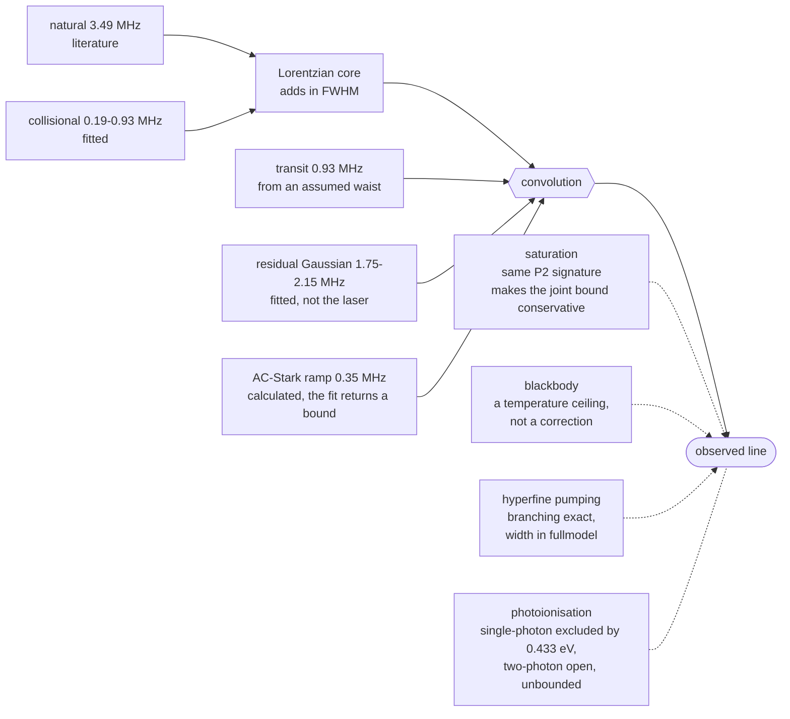

# Rb 5S→6S two-photon lineshape analysis

A forward-model analysis of the rubidium **5S₁/₂ → 6S₁/₂** two-photon transition
at **993 nm**, from Doppler-free spectroscopy in a hot vapour cell, OIST 2025.
Two Lorentzian widths convolve to their sum exactly, so no fit splits them at
any signal-to-noise: only a changed experiment does. Sweeping temperature,
power and waist pins each term by a different power of a different knob. Orders
and windows turn one trace into many rows, and every invariance is enumerated,
never assumed. This bounds every absolute result and measures none.

  

## Scope and dataset

The dataset holds 297 traces: 159 composite-line traces across four peaks, 105
frequency-ruler traces, and 33 files excluded before fitting ([how each
exclusion was made](docs/DATA.md)). Every result is reproducible from the
committed producers, and [docs/RESULTS.md](docs/RESULTS.md) reads each headline
from its producing row.

## Motivation

This line limits cold atoms in structured light. Where a field varies across
the atoms that sample it, each atom shifts by a different amount and the line
carries the whole distribution. The same object sets what can be cooled inside
a hollow-core fibre and how long it stays coherent.

Four mechanisms of comparable size overlap inside the line, so a fit that frees
them all determines only their total. The work is to find levers that separate
them, and to state which separations the data do not support.

Further reading: [the case for this transition](docs/big_picture/01_why-this-line.md) ·
[the campaign proposal in brief](docs/plan/00_the-case.md) ·
[prior art](docs/big_picture/03_goals-and-prior-art.md)

## Author and provenance

Michelangelo Dondi, PhD candidate in experimental cold-atom physics at the
University of Bologna, on the EU project CRYST³, working on the transport and
cooling of cold ⁸⁷Rb atoms in hollow-core photonic-crystal fibres.

<!-- term-of-art: the disclosure names the tool deliberately, on owner instruction -->
These data were taken during a six-month research visit to OIST in 2025, an
independent project alongside work there on atom–nanofibre interfaces. The
analysis was written after the campaign. This repository was developed with the
assistance of Claude Code for coding, documentation and workflow support. The
experiment, the data analysis and the scientific decisions are the author's own.
A manuscript is in preparation.

## The composite model

$$I(\nu) = A\left[L_{\Gamma_\mathrm{nat}+\gamma_\mathrm{coll}} \otimes G_{\sigma} \otimes K_\mathrm{transit} \otimes R_{S_0}\right] + b$$

A Lorentzian core, a Gaussian residual, the transit cusp and the light-shift
ramp, convolved. Solid arrows below enter that convolution. Dashed arrows act on
the observation without belonging to the profile.

```mermaid
flowchart LR
    NAT["natural 3.49 MHz<br/>literature"] --> CORE
    COL["collisional 0.19-0.93 MHz<br/>fitted"] --> CORE
    CORE["Lorentzian core<br/>adds in FWHM"] --> CONV
    TRA["transit 0.93 MHz<br/>from an assumed waist"] --> CONV
    LAS["residual Gaussian 1.75-2.15 MHz<br/>fitted, not the laser"] --> CONV
    RAM["AC-Stark ramp 0.35 MHz<br/>calculated, the fit returns a bound"] --> CONV
    CONV{{"convolution"}} --> OBS(["observed line"])
    SAT["saturation<br/>same P2 signature<br/>makes the joint bound conservative"] -.-> OBS
    BBR["blackbody<br/>a temperature ceiling,<br/>not a correction"] -.-> OBS
    HFP["hyperfine pumping<br/>branching exact,<br/>width in fullmodel"] -.-> OBS
    PHI["photoionisation<br/>single-photon excluded by 0.433 eV,<br/>two-photon open, unbounded"] -.- OBS
```

Each term is derived, not assumed. The transit kernel is a cusp and not a
Gaussian. The light shift is a distribution, not a shift: for a
two-photon transition the rate goes as $I^2$ while the shift goes as $I$, so

$$f(s) \propto |s| \quad \text{across the shifts the beam applies}$$

running from zero at the dim edge to a depth $S_0$ on axis, a closed-form ramp
with no free shape parameter, whose skew is the one channel a drifting lock
cannot reach. Which side it sits on follows the sign of $\Delta\alpha$ and
changes no bound. The [derivation](docs/methods/03_the_ac_stark_ramp.md) states it.

  

Further reading: [the composite model, term by term](docs/methods/04_the_composite_model.md) ·
[the kernels derived](docs/methods/02_the_lineshape.md) ·
[the AC-Stark ramp](docs/methods/03_the_ac_stark_ramp.md) ·
[the same model in a guided geometry](docs/methods/09_the_guided_geometry.md)

### Four quantities and their distinctions

Confusing these four is the most consequential error available here.

| symbol | is | dossier |
|---|---|---|
| **β_self** | self-broadening per unit density, MHz per 10¹² cm⁻³ | [quantity](docs/quantities/self-broadening.md) · [concept](docs/wiki/self-broadening.md) |
| **S₀** | the peak light shift, at a stated power **and** geometry | [quantity](docs/quantities/ac-stark-light-shift.md) |
| **κ = S₀/P** | the coefficient the fit constrains, and **it still carries the geometry** | [concept](docs/wiki/the-inhomogeneous-light-shift.md) |
| **Δα = α(6S) − α(5S)** | atomic, and **the only one that transports between apparatuses** | [concept](docs/wiki/ac-stark-shift.md) |

## Results

The three bounds share one systematic, the beam waist $w_0$, and each row names
what would lift it. The calculated rows do not share it.

| quantity | 2025 result | type | lifted by |
|---|---|---|---|
| **β_self** | ≲ 0.02–0.04 MHz per 10¹² cm⁻³ | bound | same-session 150–170 °C points |
| **σ_laser** | ≤ 2.4 MHz on the transition axis at the lineage waist, half that per photon | bound | a beam profile |
| **S₀(225 mW)** | < 0.26 MHz, below the predicted 0.35 MHz at the waist convention | bound | fixed lock, tighter focus |
| power scaling | no width trend, and an amplitude departure from P² | null + a departure | not applicable |
| **w₀** | 64 µm (prior), not a measurement of this beam: the lineage was profiled on the previous laser, and this beam passes a 3 mm modulator aperture that one did not. A Gaussian fit of the line returns 42.0 ± 1.7 µm. **The closure recovers the injected waist at zero noise, but an offset grows once noise is added and its fitted interval under-covers**, so the bar and not the centre is still open | carried, OPEN | a knife-edge scan here |
| **Δα(993 nm)** | [-1131.8](results/polarizability_deep.csv "ref:polarizability_deep:delta_alpha:at_drive") ± [5.9](results/polarizability_deep.csv "ref:polarizability_deep:delta_alpha:at_drive:err") a.u. with the dynamic tail, [+6.5](results/polarizability_deep.csv "ref:polarizability_deep:delta_alpha_vs_orson:at_drive") σ from the cited magnitude on this derivation's bar alone (the cited value states none), **opposite in sign**, adjudicated not measured | calculated | the fixed-lock pull direction, unrun |
| **twin trust** | the twin's wing noise against the real traces': [0.00494](results/twin_completeness.csv "ref:twin_completeness:measured_sigma:") ± [0.00054](results/twin_completeness.csv "ref:twin_completeness:measured_sigma::err") against [0.00510](results/twin_completeness.csv "ref:twin_completeness:twin_at_measured_tau_sigma:") ± [0.00055](results/twin_completeness.csv "ref:twin_completeness:twin_at_measured_tau_sigma::err"). **The sizes agree; the shapes do not**, and the twin's Gaussian draw leaves its fourth-cumulant bar [4.9](results/residual_resampling.csv "ref:residual_resampling:sd_k4_over_gaussian_corrected:real")x too tight | measured vs envelope | the tail shape, sized |
| **magic wavelengths** | ≈ 1203.9 / 1287.9 / 1339.6 nm, where a trap holds both states without pulling the line | calculated (envelope) | a trapped-atom experiment |

  

One trace per line at the best-fit parameters, with residuals below. Reduced
chi-square runs 0.78 to 1.09 across the 32 fitted conditions.

Further reading: [every headline read from its producing table](docs/RESULTS.md) ·
[what is and is not claimed](docs/CLAIMS.md)

## The planned campaign

A fixed-lock session would convert the light-shift and collisional bounds into
measurements, with absolute centres available once the lock repaired in August
2026 is characterised. The plan is scheduled day by day, names the instrument
for each day, and states what is cut when a day is lost.

Both scenarios are forecast through the digital twin, which simulates traces,
analyses them with this repository's own code and reads the covariance. For the
cell it recovers the collisional width to
[0.015](results/campaign_twin_forecast.csv "ref:campaign_twin_forecast:cell:gamma_coll_5traces_err") MHz
from five traces. It finds that the fibre does not break the degeneracy limiting both
arms, and [the campaign cases](docs/big_picture/09_the-campaign-cases.md) give
the time cost of a fibre trace. The nanofibre arm is an
addendum and not an assumed improvement, and the cost of exposure to the
fibre remains an open item.

Further reading: [the campaign proposal](docs/PLAN.md) ·
[cell alone against cell plus fibre](docs/big_picture/09_the-campaign-cases.md) ·
[the open apparatus quantities](docs/plan/12_open-apparatus-items.md)

## Documentation

| subject | page |
|---|---|
| installation and a reading order | [START_HERE.md](START_HERE.md) |
| running the analysis | [docs/REPRODUCING.md](docs/REPRODUCING.md) |
| the concepts, one page each | [the wiki](docs/wiki/README.md), 55 pages |
| terms and symbols | [docs/GLOSSARY.md](docs/GLOSSARY.md) |
| adapting it to another transition | [docs/ADAPTING.md](docs/ADAPTING.md) |
| the apparatus | [docs/APPARATUS.md](docs/APPARATUS.md) |
| the dataset | [docs/DATA.md](docs/DATA.md) |
| trace naming, and the meaning of RF on and off | [data_raw/README.md](data_raw/README.md) |
| the nanofibre thread, declared so it can be skipped | [docs/BIG_PICTURE.md](docs/BIG_PICTURE.md) |

## Conventions

Every frequency is on the transition axis, twice the laser axis. Every number
carries a provenance tag, and uncertainties carry two significant digits. The
order of evidence is physics first, mathematics where physics is not enough and
simulation where neither suffices, and each term states which of the three it
rests on. A temperature here is a thermocouple reading on the cell and never an
oven dial, two archive labels being dials that read like temperatures.

## Contact and citation

michelangelo.dondi@unibo.it ·
[ORCID 0009-0006-9050-2881](https://orcid.org/0009-0006-9050-2881) ·
citation in [`CITATION.cff`](CITATION.cff) · MIT licence.
