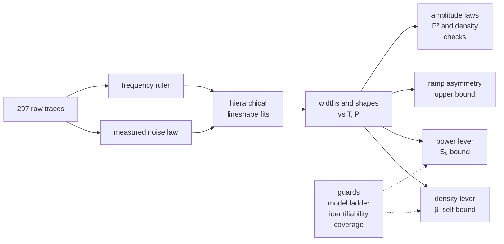

# Rb 5S→6S two-photon lineshape analysis

[](https://github.com/MichelangeloDondi/Rb-5S-6S-analysis/actions/workflows/tests.yml)
[](https://github.com/MichelangeloDondi/Rb-5S-6S-analysis/releases)
[](LICENSE)

A physics-based forward-model analysis of the rubidium **5S₁/₂ → 6S₁/₂**
two-photon transition at **993 nm**, from Doppler-free spectroscopy in a hot
vapour cell. The data were taken at OIST in 2025. A fixed-lock follow-up
session is proposed and specified in [`docs/PLAN.md`](docs/PLAN.md), and the
machinery is written to be pointed at other transitions
([`docs/ADAPTING.md`](docs/ADAPTING.md) names the seams).

> **In one sentence:** when the lock drifts, the position of a line is lost but
> its shape is not, so this archive reads collisional broadening, laser width
> and the power-dependent light shift out of the *shape* as **bounds**, and
> specifies the fixed-lock measurements that would turn each bound into a
> number.

The scope and the headline numbers, up front. Four hyperfine components, 159 line traces and 105 ruler traces across 70–130 °C and 25–225 mW, three bounds at 95%:
collisional self-broadening β_self < 0.03-0.05 MHz per 10¹² cm⁻³ across the
four peaks (holding across the waist band the data allow), the 2025 laser width below 1.2 MHz per photon
at the 64 µm waist prior, and the AC-Stark coefficient
S₀(225 mW) < 0.26 MHz against 0.35 predicted at the adopted waist (the
prediction rides the prior directly, the bound only weakly, through its
transit kernel).
The full claim ledger, including what is deliberately not claimed, is
[`docs/CLAIMS.md`](docs/CLAIMS.md).

<p align="center">
  
</p>

*One 993.4192 nm (⁸⁵Rb) line at 130 °C and 225 mW, with the composite fit and
its residuals: total FWHM 5.37 ± 0.02 MHz, reduced χ² 1.09. This is the raw material
everything below is built from.*

**Why the line is worth the trouble.** The environmental coefficients of the
993 nm 5S→6S line have only ever been bounded, and coarsely. Those
coefficients set how tightly an environment must be controlled to reach any
given stability, so they are worth knowing for a line nobody has measured them
on. This is not a claim that 993 nm beats the 778 nm 5S→5D reference the
compact-clock community already uses. On natural linewidth it starts behind
it, by about an order of magnitude, and nothing here suggests otherwise
([`docs/BIG_PICTURE.md`](docs/BIG_PICTURE.md) §1).

**What each piece would buy.** A beam-profile measurement of the waist would sharpen
every archival bound with no new physics run. A fixed-lock cell session
would turn the light-shift and collisional bounds into measurements. A
nanofibre session would test the same light-shift law in an evanescent field,
against the cell as its reference. The dependency map is the first thing in
[`docs/BIG_PICTURE.md`](docs/BIG_PICTURE.md).

<p align="center">
  
</p>

*The bench, components numbered 1–13 as in the annotated photograph. Every
element is established in [`docs/APPARATUS.md`](docs/APPARATUS.md), which
also carries the dated photographs behind each box.*

**Where to go next:** the big picture (goals, prior art, what each future
measurement adds) → [`docs/BIG_PICTURE.md`](docs/BIG_PICTURE.md) ·
full derivations and statistics → [`docs/methods.md`](docs/methods.md) ·
results table (auto-generated) → [`docs/RESULTS.md`](docs/RESULTS.md) ·
measurement plan → [`docs/PLAN.md`](docs/PLAN.md) ·
prior work → [`docs/LITERATURE.md`](docs/LITERATURE.md) ·
adapting it to your line → [`docs/ADAPTING.md`](docs/ADAPTING.md).

---

## How the measurement works

A 993 nm beam is retro-reflected through a hot Rb cell, and an atom absorbs
one photon from each direction, cancelling the first-order Doppler shift for
every atom at once: the half-GHz thermal smear collapses to a line a few MHz
wide. The surviving second-order term, of order 0.4 kHz here, sits four
orders below the linewidth.

<p align="center">
  
</p>

*Left: two 993 nm photons, one from each direction, drive 5S₁/₂ → 6S₁/₂
through a virtual level that lies below the real 5P₁/₂. The atom returns by
the 6S → 5P → 5S cascade and the bench detects the 795 nm arm. Right: the
cavity scan's up-sweep carries the laser across all four hyperfine
components, two per isotope, all F → F. Their spike integrals track the
ground-state populations, (2F+1) × isotope abundance: ⁸⁵Rb ratio 1.31
measured against 1.40 predicted, from the digitised record.*

The 6S₁/₂ population is read out through the 795 nm fluorescence of the
6S₁/₂ → 5P₁/₂ → 5S₁/₂ cascade. Four hyperfine components are recorded across
a temperature sweep (70–130 °C at 225 mW, spanning N = 0.56–29 × 10¹² cm⁻³)
and a power sweep (25–225 mW at 130 °C). The archive holds 297 traces:
159 composite-line traces and 105 frequency-ruler calibration traces enter
the fits, and the remaining 33 files from the same nights are excluded before
any fit. Those 33 are an aborted first attempt at one power sweep, its
calibration brackets, and four individually excluded shots (one with a
measured defect, one a duplicate save, two held out by pre-registration),
each exclusion with its stated reason in [`docs/DATA.md`](docs/DATA.md).

## Shapes without centres

The 2025 data were taken with a drifting, hand-re-centred lock, with MHz-scale
re-centrings between blocks (a block is one set of back-to-back repeats at a
fixed condition; [APPARATUS §6](docs/APPARATUS.md)). The consequence:

- absolute line **centres are lost** (drift moves them scan to scan), but
- line **shapes are preserved**.

<p align="center">
  
</p>

*The whole constraint. Top: the problem as photographed on a preliminary
session, a wavemeter record of cavity re-locks and relaxations. Middle: the
campaign reconstructed from its own traces. Each vertical stroke is one
trace's own frequency sweep, offsets are comparable only between traces taken at
the same scope setting, and the held lock's drift is bounded at order
0.02 MHz/min over three hours, sign undetermined. Shapes survive, centres do
not. Bottom: what each drift
regime licenses, from the 2025 bounds to the fixed-lock session that would
convert them.*

The numbers behind the figure were recovered, not recorded: the exports carry
no acquisition time, and a backup that did was audited under a
pre-registration written before it was opened. The held-lock drift is bounded
at order 0.02 MHz/min on the laser axis (per-photon frequency, half the
transition axis every linewidth here is quoted on), with the sign
undetermined once the scope offsets are accounted for. The megahertz motion
was the hand re-centring after lock dropouts, not the drift. The full trail,
including the retraction of a headline that turned out to be the knob, is in
[`docs/PREREGISTRATION_RESULTS.md`](docs/PREREGISTRATION_RESULTS.md).

The archive therefore reports what the *shape* of a line carries (widths,
power-law scalings, asymmetry) as bounds, nulls and consistency checks, while
the absolute shifts wait for a stable lock. Each bound sets the sensitivity
target a follow-up session would need to beat. The width-only AC-Stark bound
brackets its prediction rather than resolving it (the predicted effect is
about one block's width scatter, so the bound rests on averaging), while the
joint three-session fit lands below the predicted band, the tension the
results table quotes. The 95% constructions are checked by
injection-recovery ([methods §4.11](docs/methods/06_the_statistics.md)).

The chain from raw trace to quoted bound, each stage a runnable script, each
output a committed CSV:


```mermaid
flowchart LR
    T["297 raw traces"] --> N["measured noise law"]
    T --> K["frequency ruler"]
    N --> F["hierarchical<br/>lineshape fits"]
    K --> F
    F --> W["widths and shapes<br/>vs T, P"]
    W --> D["density lever<br/>β_self bound"]
    W --> P["power lever<br/>S₀ bound"]
    W --> S["ramp asymmetry<br/>upper bound"]
    W --> A["amplitude laws<br/>P² and density<br/>checks"]
    G["guards<br/>model ladder<br/>identifiability<br/>coverage"] -.-> D
    G -.-> P
```

A lever is the spread of conditions a fit uses to pin down a slope: the wider
the temperature or power range, the tighter the bound. The fits are
hierarchical in the plain sense that some parameters are shared across a
peak's traces while others stay free per trace. The dashed **guards** are the
three validation analyses that gate the headline bounds
([methods §4](docs/methods/06_the_statistics.md)):

- **Model ladder.** Every lineshape component must earn its place against
  nested alternatives (ΔBIC), so nothing is over- or under-fitted.
- **Identifiability.** Profile likelihoods establish which parameters the
  data can actually separate. Where transit and laser width are degenerate,
  the bound carries that degeneracy as an explicit band.
- **Coverage.** The quoted 95% intervals are re-run on campaign-like
  synthetic data with known truth, and must cover that truth at the stated
  rate.

The **amplitude checks** are the two-photon rate laws: peak amplitude must
scale as P² at fixed density and linearly with N at fixed power. Both hold
(log-log slopes 1.83–2.12 and 0.85–1.02).

Every scan carries its own frequency ruler: the 12.5 MHz EOM's sideband pairs
excite copies of the line every 12.5 MHz on the transition axis, 6.25 MHz
apart in laser tuning, up to seven per scan. The frequency axis is therefore
self-calibrated per block even as the lock drifts, and the ruler *rate* is a
differential across identical lines, immune to the light shift and to the
lineshape asymmetry ([methods §3](docs/methods/05_the_frequency_ruler.md)):

<p align="center">
  
</p>

*Left: one ruler trace with its seven-tooth comb fit, six teeth standing above
the trace's own fit residual. The panel states why the seventh is below it: at
this modulation depth the third-order pair carries about 2% of the first-order
power, and the scan end clips the outermost window. Right: the sweep-linearity
check, local rate against block rate, flat to within 0.3% in the well-sampled
windows.*

## Results at a glance

The model these numbers rest on, shown against one representative trace per
line: the global archive fit at its best-fit parameters, residuals below each
panel. The sub-unity reduced χ² reflect the conservative per-block noise
inflation (1.2–2.2×), not an over-fit. The antisymmetric near-centre residual
structure is shot noise (it falls as amplitude^-0.5 on both the power and
temperature axes). One feature remains unattributed: a symmetric centre
excess reaching 1.4% of peak on the brightest line, 3.7σ against the
uninflated errors and absorbed by the inflation. It changes none of the
reported values.

<p align="center">
  
</p>

The dominant shared systematic for every absolute number is the beam waist
**w₀** (density scale, model form and block scatter contribute at a lower
level, see RESULTS), so each is reported as a bound together with the
measurement that would lift it.

| Quantity | 2025 result | Type | Lifted by |
|---|---|---|---|
| Collisional self-broadening **β_self** | ≲ 0.03-0.05 MHz per 10¹² cm⁻³ (95% per peak, four-point 70/90/110/130 °C density lever) | bound | partly delivered already by folding the archival 130 °C point into the density lever (2026-08-02). Same-session 150–170 °C points and a lower between-block scatter are still needed for a measurement |
| 2025 laser linewidth **σ_laser** | 1.75–2.15 MHz across the four temperature blocks (transition axis, so 0.88–1.08 MHz per photon). 95% bound 1.2 MHz per photon at the waist prior, rising with w₀ | bound | beam-profile w₀ |
| AC-Stark coefficient **S₀(225 mW)** | < 0.26 MHz (95%, joint three-session profile likelihood at the unscaled 2.706 threshold. Below the 0.35 predicted at the adopted waist, see [RESULTS](docs/RESULTS.md)) | bound | fixed lock + tighter focus |
| Power scaling | width: no power trend (3–8% block scatter); amplitude consistent with P² | null + consistency check | — |
| Beam waist **w₀** | 64 µm (prior, adopted from Rajasree 2020 on the same-lineage apparatus; not measured on this bench) | open | beam-profile measurement |

**The fitted collisional width behaves like a floor, not a measurement.** It
barely grows with density (below), while a real binary-collision width must
grow *linearly*, so β_self is quoted as a bound. A density-independent floor
is also what an unresolved instrumental component would produce, or a fixed
foreign-gas broadening from an undocumented cell fill
([APPARATUS §5](docs/APPARATUS.md) records that the cell's fill history is
not on record).

<p align="center">
  
</p>

**The power sweep bears out the ramp's power-law predictions.** At fixed
temperature only the AC-Stark shift varies with power, and both predictions
hold: the linewidth stays flat (the shift broadens the line only as S₀²,
negligible here) and the amplitude follows the two-photon rate law, ∝ P².
These are *consistent with* the light-shift model, not proof of it. A flat
width is equally what zero shift would give, and the ramp's *distinctive*
signature, the skew ∝ S₀³, is below detection in the archive (a bound). The
coefficient itself waits for a fixed-lock session. The S₀ bound and its
prediction are independent by construction: the bound uses only the
width-vs-power data (no w₀ enters), while the predicted 0.35 MHz is the
computed polarizability at the beam geometry's w₀ prior, with the retro
ratio ρ=0.94±0.04 (its in-situ measurement is a fixed-lock-session task),
fixed before the fit and never an input to it.

<p align="center">
  
</p>

## The lineshape, mechanism by mechanism

The measured line is a convolution (⊗) of independent broadening mechanisms:

$$I(\nu) = A\left[ L_{\Gamma_\mathrm{nat}+\gamma_\mathrm{coll}} \otimes G_{\sigma_\mathrm{laser}} \otimes K_\mathrm{transit} \otimes R_{S_0} \right] + \text{background}$$

| Mechanism | Physical origin | FWHM (transition axis) | Shape |
|---|---|---|---|
| Natural width **Γ_nat** | finite 6S lifetime | 3.49 MHz (fixed, known) | Lorentzian |
| Collisional **γ_coll** | Rb–Rb collisions | 0.19–0.93 MHz across the 32 fitted conditions | Lorentzian (adds to natural) |
| Laser **σ_laser** | laser frequency jitter | 1.75–2.15 MHz across temperature blocks | Gaussian |
| Transit | finite time an atom spends in the beam | ~0.93 MHz at w₀ ≈ 64 µm | cusp kernel (Biraben–Cagnac / Lehmann) |
| AC-Stark **R(S₀)** | intensity-dependent light shift across the focus | ~0.35 MHz at 225 mW | triangular "ramp" |

Every width in the table is a FWHM. σ_laser names the Gaussian laser kernel's
FWHM, already doubled for the two photons. The background is flat over the
scan window: the same-beam absorption pedestal is about a GHz wide, so it
enters as a constant.

The AC-Stark **ramp** is what the rest of the analysis is built on: because
the beam is focused, the light shift runs from zero at the dim edge to a
maximum S₀ on the bright axis, and for a two-photon (intensity-squared)
signal that distribution is a closed-form triangle. Its skew is a
light-shift readout that survives a drifting lock. The derivation is in
[`docs/methods/03_the_ac_stark_ramp.md`](docs/methods/03_the_ac_stark_ramp.md)
and [`docs/THEORY_NOTE.md`](docs/THEORY_NOTE.md).

## The dominant systematic: the beam waist w₀

The transit width and the laser width both depend on the beam waist, and the
archive cannot separate them: a tighter waist means more transit broadening
and less room for laser width, and vice versa. The observed ≈ 5.3 MHz line is
reproduced anywhere from w₀ ≈ 38 µm (the hard floor, where the laser width
goes to zero) upward, and the data alone set no ceiling. The 64 µm working
value is a prior from two direct profile measurements on the same-lineage
beamline (Nieddu 2019, Rajasree 2020), not a fit result. Only a direct
beam-profile measurement (a knife-edge scan, a camera profiler, or both)
collapses the degeneracy. Every absolute number above is w₀-conditional, and
the beam profile is the first thing a proposed fixed-lock session would fix.
What each assumption moves, quantity by quantity, is tabulated live from the
result CSVs in [`docs/RESULTS.md`](docs/RESULTS.md) ("Sensitivity at a
glance").

<p align="center">
  
</p>

## What a follow-up session would add

- **A proposed fixed-lock session.** A stable lock would return the absolute
  centres, and a direct beam-profile measurement would pin w₀, turning the
  bounds above into the first measured 5S–6S AC-Stark and collisional self-shift
  coefficients. With power capped at 225 mW, the intensity axis would come
  from the waist instead: a telescope gives two working waists spanning a
  ×16 intensity range. Points at 150–170 °C in the same session would give
  β_self a density lever without borrowing a temperature point from another
  epoch. The archive's own 130 °C point already stretches the lever to
  ×52.5, but reach alone is not enough while the between-block scatter is
  co-limiting. Full specification: [`docs/PLAN.md`](docs/PLAN.md) §8.
- **Optical nanofibre.** The same ramp law tested in the evanescent field at
  a fibre surface, where an atom–surface potential and the "pushing dip"
  (Gokhroo et al., 2022) ride on the lineshape.

## Calculated quantities

Two numbers in this archive are computed, not measured, and they sit
here rather than in the results table so the table stays a record of
what the data itself established.

| quantity | value and status | provenance | what would settle it |
|---|---|---|---|
| Differential polarizability **Δα(993 nm)** | recomputed −1145 a.u.; \|Δα\| within ~5% of Orson 2021's 1093 but opposite sign. Orson's side is verified from the typeset PDF (convention stated in words, value repeated in SI, his own worked −0.66 MHz reproduced here at −0.653), so the disagreement is real rather than a units artifact ([THEORY_NOTE §5](docs/THEORY_NOTE.md)); this work's sign is anchored to the measured static α and tune-out | calculated | external sign adjudication |
| First **5S–6S magic wavelengths** (scalar) | ≈ 1203.9 / 1287.9 / 1339.6 nm — a trap there would hold both states without pulling the 993 nm line. The 1204 nm crossing sits on the smooth part of the curve and is the practical one; the other two lie hard against 6S→nP resonances, where trap-photon scattering is high. No published values found to the depth searched (2026-07-17) | calculated (envelope) | vector term under circular polarization; a trapped-atom experiment |

The second row, drawn. The lower panel shows why the crossings exist
where they do: the flat 5S polarizability threads the 6S curve's
nearby resonances.

<p align="center">
  
</p>

## Reproduce

```bash
python3 -m venv .venv && source .venv/bin/activate
pip install -e ".[dev]"
pytest -q                 # fast test suite (~2 min)
pytest -q --runslow       # full suite incl. high-statistics closure tests (what CI runs)
```

The dataset's manifest is committed
([`data_raw/MANIFEST.csv`](data_raw/MANIFEST.csv)). The 297 raw traces are
held privately, and **On the raw traces**, below, says exactly what that
leaves runnable from a clone (the certification suite and the
clock-dependent results, which is the bulk of the battery). With the traces
in place, each stage reads the previous stages' output in `results/`:

```bash
bash scripts/run_all.sh   # every stage in dependency order, then the figures,
                          # docs/RESULTS.md, and the CSV status column
```

Re-running any stage reproduces its committed CSV in `results/`
byte-for-byte. One committed number sits outside `run_all.sh`: the joint
three-session AC-Stark bound is a long profile-likelihood run with its own
script, `python scripts/run_stark_joint.py`, and it also needs the raw
rehearsal and pilot trees, which stay outside the repository.

The **clock-dependent results** (the lock-drift measurement and its audit
trail, [`docs/PREREGISTRATION_RESULTS.md`](docs/PREREGISTRATION_RESULTS.md)
addenda 4–7) also reproduce from a clone: the acquisition clock is committed
as [`data_recovered/CLOCK.csv`](data_recovered/CLOCK.csv), and

```bash
python scripts/run_drift_settling.py  # the drift analysis, off the committed clock
python scripts/run_laser_history.py   # laser frequency, within each display epoch
```

print the full report with no raw traces and no private folder required,
because the per-trace QC metrics they read (`results/qc_metrics.csv`) are
committed. The complete timestamped raw backup behind the clock is preserved
verbatim in the raw-data archive held with the traces (sha256 recorded in
the audit report).

The headline numbers are cited across many documents.
`tests/test_docs_canonical.py` holds each in a single registry, reads its
true value from the committed CSV, and checks that every document quotes
*that* value, so a re-analysis that moves a number can never leave a stale
copy behind unnoticed. The **figures** follow the same rule:
`make_figures.py` stamps a fingerprint of the results CSVs into each PNG,
and `tests/test_figures_fresh.py` fails if a committed figure was drawn from
stale results. The check reads a hash in the PNG, not pixels, so it is
independent of the matplotlib version that drew the figure.

## Repository map

```
rb5s6s/     the library: ingest, quality control, noise model, frequency ruler,
            lineshape + fitting, density, collisional/global/AC-Stark fits,
            transit Monte-Carlo, amplitude analyses, shared utilities
scripts/    one runnable per analysis stage, plus make_figures / make_results_ledger
examples/   your_line.ipynb, the pipeline pointed at a different line by
            editing one dictionary
data_raw/   the frozen 2025 dataset (297 unique traces) + MANIFEST.csv
data_recovered/  the backup-recovered layer: the acquisition clock
            (CLOCK.csv), backup-only discards, degradation lineage
results/    the committed output CSVs (the documented run)
figures/    publication figures produced by make_figures.py
tests/      full test battery, run by CI on the minimum and latest numpy
docs/       the documentation tree, indexed by its own README. Read first:
            CLAIMS.md (the claim ledger) · BIG_PICTURE.md (goals, prior art,
            what each future measurement would add) · methods/ (8 ordered
            chapters, the full derivations)
private/    local working folder, excluded by .gitignore and enforced by
            tests/test_repo_hygiene.py
```

## Conventions

- **Transition-frequency axis everywhere** — the two-photon sum frequency, i.e.
  twice the laser frequency. Per-photon quantities carry a `_LASER` suffix in code.
- **Every number carries a provenance tag** (measured here / calculated /
  established / open); the same tags drive the machine-readable `status`
  column on every results CSV.
- **Physics constants and analysis choices are separated** (`constants.py` vs
  `config.py`); repeat counts are read from `MANIFEST.csv` rather than
  inferred from filenames, and data-quality cuts are fixed before fitting
  rather than chosen afterward.

## About

I am Michelangelo Dondi, a PhD candidate in experimental cold-atom physics at
the University of Bologna, on the EU project CRYST³. My work there is the
transport and cooling of cold ⁸⁷Rb atoms inside hollow-core photonic-crystal
fibres, where the light shifts of the guided mode vary across the atoms and
set what can be cooled and how long it stays coherent. This repository looks
at the same physics through a different observable: the shape a two-photon
line takes when a focused standing wave shifts each atom differently.

The dataset is from a six-month research visit to OIST in 2025, an
independent project alongside my work there on atom-nanofibre interfaces.
The analysis was written after the campaign.

Contact: michelangelo.dondi@unibo.it ·
[ORCID 0009-0006-9050-2881](https://orcid.org/0009-0006-9050-2881) ·
citation metadata in [`CITATION.cff`](CITATION.cff) · MIT license.

**On the raw traces.** This repository ships the analysis, the committed
results, the figures, and the dataset's manifest
([`data_raw/MANIFEST.csv`](data_raw/MANIFEST.csv) — every trace's filename,
condition, role and MD5), but **not the 297 raw traces themselves**. They were
taken at OIST and are held privately; they are available on request
(michelangelo.dondi@unibo.it). What that means concretely:

- **Everything that certifies the analysis runs here.** The injection-recovery
  closures, the coverage study and minimum-detectable-effect, the transit-kernel
  asymptotics, the identifiability and model-comparison machinery — all of it is
  synthetic and needs no archive. That is the bulk of the suite.
- **The clock-dependent results also reproduce from a clone**, because the
  acquisition clock is committed as
  [`data_recovered/CLOCK.csv`](data_recovered/CLOCK.csv) (hashes → timestamps,
  not measurement data).
- **What cannot run here** is the raw→results pipeline itself, and the four
  tests that re-hash the traces against the manifest; those skip with a stated
  reason rather than failing. With the traces in place they all run, and each
  stage reproduces its committed CSV byte-for-byte (the `run_all.sh` command
  under **Reproduce**).

**Adapting it to your own line.** The analysis is a library with its
physics, apparatus, and statistics kept behind separate seams.
[docs/ADAPTING.md](docs/ADAPTING.md) names them for anyone pointing the
machinery at a different transition, species, or light geometry, and
[examples/your_line.ipynb](examples/your_line.ipynb) lets you try it on
your own line by editing one dictionary. Neither needs the raw traces.
