# Apparatus: hardware of record and its provenance

*What the 2025 measurement was actually made with, and how each item is known.
Compiled 2026-07-23 from dated setup photographs (2025-06-07 → 2025-07-29).
A curated, metadata-stripped subset is published in [`apparatus/`](apparatus/)
and embedded below (2026-07-24). The remainder stays private, since some frames
carry equipment serials and a purchaser's name, and this page still records
every technical fact and its date in text.*

**The question.** What was the 2025 measurement made with, and how is each
piece of that known?
**Takes.** Nothing.
**Gives.** Every hardware fact with a provenance tag and a date, from the laser
to the oven to the detector, including the ones that are experimenter
recollection rather than photograph and are labelled as such.
**Skip if.** You are working on the analysis rather than the bench. The one
section worth reading anyway is the lock, because its misconfiguration is what
shapes every result in this repository.

> **Unfamiliar with the vocabulary?** [GLOSSARY.md](GLOSSARY.md)
> explains the measurement in six sentences, then defines every term
> and symbol used anywhere in this repository.

*The bench in one drawing, components numbered 1–13 following the annotated
bench photograph (defense presentation, slide 9), which also fixes the
drawing's handedness.
Every box is established below with its provenance, and the photographs embedded
through this page show the same elements in the flesh.*

Provenance tags: **PHOTO** (read off a dated setup photograph), **DATA**
(established from the dataset files), **ASSUMED** (inherited from a citation,
not verified for this bench), **EXPERIMENTER** (recollection).

---

## 1. Source chain

| item | value | provenance |
|---|---|---|
| Pump | Coherent Verdi V-18, 18.50 W set, 50.37 A | PHOTO 2025-07-29 |
| Ti:Sapph | M-Squared SolsTiS (unit 196010) | PHOTO 2025-06-10 |
| Pump chiller | 18.02 °C (set 18.0), stable to ~0.03 °C | PHOTO 2025-07-29 |
| Ti:Sapph chiller | 20.00 °C (set 20.0), stable to ~0.01 °C | PHOTO 2025-07-29 |
| SolsTiS internal temperature | 40.000 °C | PHOTO 2025-06-10/11 |
| Scan mode | **"Cavity triangular"**, continuous | PHOTO 2025-06-10/11, 07-29 |

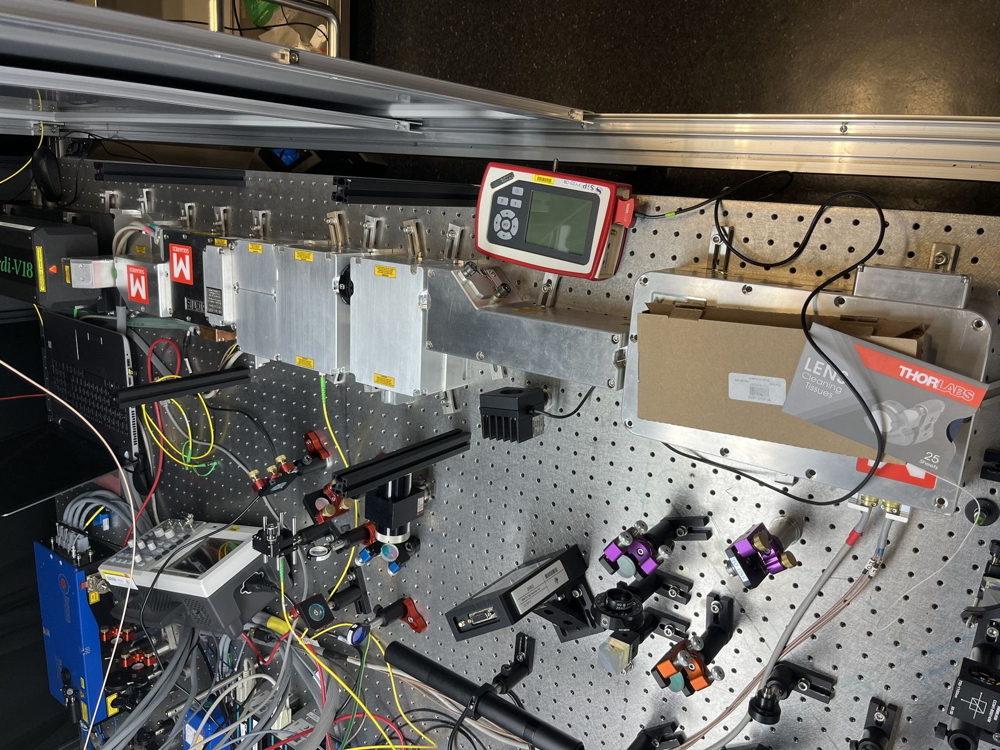 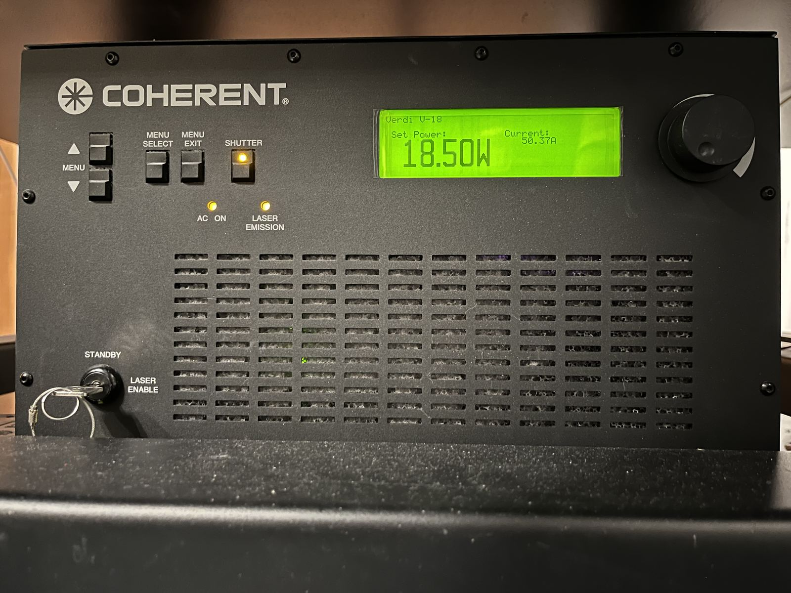

*The source chain (2025-07-29): the Verdi V-18 pump feeding the M Squared
SolsTiS modules (left), and the Verdi front panel at its campaign set point,
18.50 W / 50.37 A (right).*

The scan-mode reading matters: `DATA.md` §5 *infers* a triangular sweep with a
fold from the traces themselves. The SolsTiS control page states it directly.

### 1.1 Lock configuration: the concrete candidate for "misconfigured"

`DATA.md` §1 says only that "the 2025 lock was misconfigured". Three dated
photographs of the SolsTiS control page show which locks were engaged:

| date | etalon lock | ref-cav lock | ECD lock |
|---|---|---|---|
| 2025-06-10 | Locked | **Not Locked** | **Not Locked** |
| 2025-06-11 | Locked | Locked | **Not Locked** |
| 2025-07-29 (teardown) | Not Locked | Not Locked | Not Locked |

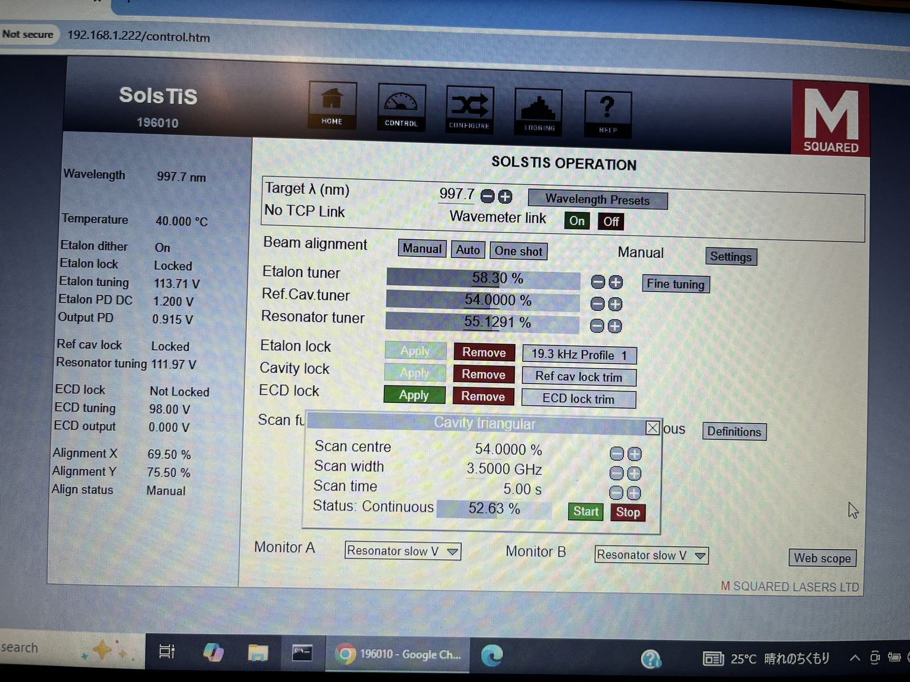

*The SolsTiS control page (2025-06-11, 23:33): **Etalon Locked, Ref cav
Locked, ECD Not Locked**, scan "Cavity triangular". Two locks hold the
laser short-term, which is why shapes survive.*

> **Correction, 2026-07-25, on what "ECD" is.** This section previously read
> the ECD row as the laser's *absolute* reference lock and called checking it
> "the cheapest highest-leverage test a future session could open with".
> **That was wrong.** On the M Squared system **ECD is the External Cavity
> Doubler**, the resonant second-harmonic stage, and its lock is the
> doubling cavity's, not a frequency reference (a laser-side colleague, via
> the experimenter, 2026-07-25: *"ECD is for second harmonic generation"*).
> It reads *Not Locked* in every photograph for the simple reason that this
> experiment uses the **993 nm fundamental** and never needed the doubler.
> Nothing about the dataset's limitation changes, since the frequency axis still
> has no absolute zero, for the reasons below, but the *remedy* named here
> was the wrong hardware. **The actual outer loop available on this system is
> the wavemeter link**: the same colleague reports that the improved locking
> of the later period came from coupling the laser output directly to the
> wavemeter. That, not the doubler, is what a future session should
> engage and characterise.

**For the campaign itself** the experimenter confirms (2026-07-23) that the
**reference cavity was locked**, with its **set point moved from time to time
to follow the drift**,
which is what `DATA.md` §2 records as "cavity-reference recenters". A further
recollection (EXPERIMENTER, 2026-07-23, given *after* the state-space fit
below was already committed): **the cavity lock was dropping out on its own,
typically within a few tens of minutes, especially while the etalon
temperature transient, about 2 h of lock-on after at least 3 h of lock-off, had not
yet passed.** So the between-block steps are not only deliberate re-centrings:
many are drop-and-recapture events, small when the recapture returns to an
unchanged set point, MHz-large when the drop happens mid-transient with the
etalon still walking.

That completes the account of "misconfigured". Etalon + reference cavity hold
the laser *short-term*, which is why shapes survive and intra-block positions
are stable. What is missing is any **outer loop against an absolute
reference**, and because the cavity set point was re-defined by hand
whenever drift pushed the line out of the window, the zero of the frequency
axis is re-chosen arbitrarily between blocks. Hence: centres carry no
metrological meaning, shapes do. The two halves of the dataset's central
limitation fall out of the lock configuration exactly.

**The reference cavity is an excellent ruler and a poor origin**: it is a
piece of glass whose length wanders, so "locked to fringe N" is stable only
relative to something drifting. Closing that outer loop is what would convert
the dataset's shape-only limitation into an absolute-frequency capability,
and on this system the instrument for it is the **HighFinesse wavemeter link**
(the control page's `Wavemeter link: On`) and not the doubler, per the
correction above. **Characterising that link, meaning how tightly the laser can be
held to a wavemeter set point and with what long-term calibration drift, is
the cheapest high-leverage test a future session could open with**, since it
needs no new hardware and decides whether AC-Stark pulls and collisional
shifts become measurable at all.

---

## 1.2 The optical isolator before the cell

| item | value | provenance |
|---|---|---|
| Optical isolator | ISOWAVE **I-98T-5L** | EXPERIMENTER, 2026-08-01 |
| Clear aperture | **5 mm** | manufacturer datasheet (ISOWAVE DS9010-012010, 900–1000 nm series) |
| Design wavelength | centred at 980 nm standard, orderable anywhere 900–1000 nm | manufacturer datasheet |
| Isolation / insertion loss | 35 dB min (38 typical) / 0.3 dB typical, 0.5 dB max | manufacturer datasheet |
| Tunable | yes (input polarizer rotates to maximize isolation) | manufacturer datasheet |
| Housing diameter / length | 34.9 mm / 102 mm | manufacturer datasheet |

On the bench the delivery runs: laser, then a λ/2 + PBS pair that sets the
power sent to the cell (working in reflection, the PBS's reflected port
feeding the cell path and providing the turn onto the arm), then the fold
mirror, with the optical isolator standing on the vertical cell axis just
after the fold, before the polarizing filter (EXPERIMENTER, 2026-08-03).
A fibre runs directly from the laser head to the WS-8 wavemeter. The
isolator-before-the-focusing-lens order matches the
[Nieddu 2019](lit/nieddu2019.md) /
[Rajasree 2020 thesis](lit/rajasree2020thesis.md) description ("An optical
isolator is placed ... before the vapor cell ... A plano-convex lens (L1)
... is placed after the optical isolator to focus the beam"). The 993 nm
focus sits near the cell's lower corner on the detection side, at the
f = 18 mm lens's object plane, so the collection lens re-images the
fluorescence spot onto the PMT (EXPERIMENTER, 2026-08-03).

**The beam path order and the EOM aperture, now sourced (2026-08-01).**
EXPERIMENTER: no lens or telescope sits between the SolsTiS output and the
EOM, so the isolator and the EOM both see the raw SolsTiS beam. The isolator's
5 mm clear aperture is wider than that beam and does not obviously clip it.
The EOM does: the experimenter recalls an IR viewer card showing clipping at
the EOM aperture (recollection, over a year old, not a contemporaneous
measurement). That aperture is now a sourced number rather than an
assumption. The manufacturer's own "Standard Characteristics" table for the
EOM-01/EOM-02 series (Photonics Technologies, `photonicstechnologies.com`,
confirmed 2026-08-01) states **Aperture Diameter 3 mm** for both crystal
variants, so it applies to our EOM-02-12.5-V. This is the same 3 mm the
naive Gaussian-optics $w_0\approx32\ \mu\mathrm{m}$ estimate in `constants.py` used.
It was previously carried as an inferred number chosen to make the clipping
story work, and is now grounded in a manufacturer spec plus an experimenter recollection
of the clipping itself. See `constants.py`'s `W0_MEASURED_M` docstring and
`docs/notes/transit_width_resolved.md` for the full waist reasoning, and the
[Rajasree 2020 thesis](lit/rajasree2020thesis.md)'s directly measured 128 µm
($w_0=64\ \mu\mathrm{m}$) on the same lens and the same-model SolsTiS laser, which
remains the better-evidenced comparison since a recollected clipping event
does not by itself fix how much of the beam was clipped.

**The cell-axis optics ahead of and behind the cell** (the schematic's
numbered components, established here so the README's "every element" claim
holds on this page): the polarizing filter (1) and half-wave plate (2) set
the polarization the EOM (3) sees. The first f = 150 mm lens (4) focuses
the beam into the cell and its twin (8) re-collimates it toward the
flip-in power meter and the retro mirror (9). All six are visible and
numbered on the annotated bench photograph (defense presentation, slide 9),
and the f = 150 mm value is the same lens the Rajasree lineage measurement
above rides on. PHOTO. The pipes (5 and 7) reach inside the oven's foil
wrap. EXPERIMENTER, 2026-08-03.

---

## 2. Frequency ruler: the EOM chain

The comb ruler underwrites the whole frequency axis, and its history is
now dated: first trials 2025-07-04, 03:37 JST (four scans, verbose
filenames, 80 °C). Final commissioning came on the morning of the campaign
(2025-07-17, 04:18–06:33 JST, `Initial attempts` → adjusted → `Def`), with
the `Def` configuration bracketing a campaign-morning power sweep
twenty-one minutes later (results report, addendum 9). Assumption 1 of
[methods §6](methods/08_assumptions_and_outlook.md) records that everything
scales ×2 if the tooth spacing is Ω rather than Ω/2. Both halves are now
documented in hardware:

| item | value | provenance |
|---|---|---|
| RF source | Tektronix **AFG31021**, 25 MHz / 250 MS/s | PHOTO 2025-07-29 |
| RF setting | **12.500 000 000 0 MHz**, sine, continuous, **10.00 Vpp**, 0 offset | PHOTO 2025-07-29 |
| EOM | Photonics Technologies **EOM-02-12.5-V**, ×2 units | PHOTO (certificates) |
| EOM resonance | **12.5 MHz** (both units) | PHOTO |
| EOM 3 dB bandwidth | 550 kHz / 546 kHz | PHOTO |
| EOM AR coating | **650–1000 nm**, covers 993.4 nm | PHOTO |
| EOM impedance / SWR | 52 Ω, 1.29:1 / 50 Ω, 1.09:1 | PHOTO |
| EOM clear aperture | **3 mm** (both crystal variants, EOM-01 and EOM-02) | manufacturer's "Standard Characteristics" table, `photonicstechnologies.com`, confirmed 2026-08-01, not on the test certificates §1.2 |
| Drive for 100% modulation | 15.4 V / 16.0 V pk-pk | PHOTO |

So Ω = 12.5 MHz is set to 0.1 Hz resolution on the generator *and* is the
EOM's designed resonance, independently. The 6.25 MHz laser-axis tooth spacing
follows as Ω/2 by the two-photon selection rules ([`DATA.md`](DATA.md) §1), and the
certificates' own 100%-modulation traces show the same comb pattern the
dataset rulers show.

**Modulation headroom.** The campaign ran at 10.00 Vpp, which the certificates
place at **≈54–60% of full modulation**, and full scale is ≈1.6× higher in drive
voltage. `PLAN.md` §7 asks whether the 12.5 MHz tank can reach β ≈ 1.2, and that
headroom is the first quantitative input to the question. Note the certificates
were taken at 780 nm, and phase-modulation index scales as 1/λ, so the index at
993 nm is ≈0.79× the 780 nm figure at equal drive.

**A constraint on the upgrade path.** The AFG31021 tops out at **25 MHz**, so
the "higher-frequency EOM" fallback in `PLAN.md` §7 needs a different
generator as well as a different tank.

---

## 3. Detection

| item | value | provenance |
|---|---|---|
| Cell fluorescence detector | Hamamatsu **R636-10** side-on PMT, housed in a **Thorlabs PXT1/M** module | PHOTO 2025-07-18 (in campaign) + EXPERIMENTER |
| Photocathode spectral response | GaAs, roughly 300 to 900 nm. DATASHEET, not read off the sheet here, and the tube attribution is itself assumed (see the resolved note below). It became load-bearing on 2026-08-10: it is the red edge, and not the 50 dB of 795 nm filtering, that blocks the cell's own 9.1 µm thermal peak from the detector. Nothing rests on the exact figure, since no photocathode of any kind responds at 9 µm | DATASHEET + ASSUMED |
| Cathode geometry | 3 × 12 mm rectangle | datasheet TPMS1016E |
| Cathode orientation (2025) | **landscape**, 12 mm axis along the beam | EXPERIMENTER |
| Filter stack | ~50 dB of 795 nm passband (not a short-pass) | DATA / EXPERIMENTER |
| Collection optics | f = 18 mm lens and the 795 nm filter, mounted in a tube fastened to the PMT holder | EXPERIMENTER 2026-08-03 |
| Focus position in the cell | **not the cell's mid-plane**. The 993 nm waist was placed close to the collection lens deliberately, to raise the collected solid angle. The standoff from the near window is not recorded | EXPERIMENTER 2026-08-09 |
| Signal chain | PMT → **pre-amplifier, G = 10⁶** → scope | DATA, the 4 July evening session's filenames record `G=10^6` (addendum 9), the only known record of the gain |
| IR receiver on the bench | **New Focus 2153 IR femtowatt photoreceiver**, gain to 2×10¹¹ V/A, DC–750 Hz | PHOTO 2025-07-29 |

**OPEN: the PMT's high-voltage supply and setting are not on record**
(2026-08-03 audit). No photograph or note names the supply that biased the
R636-10 or its voltage. A bench fact only the experimenter can assert.

**The off-centre focus is not a detail, and it moves two numbers the analysis
uses** (added 2026-08-09 when the experimenter stated it). Both follow from the
same geometry, that the source sits close to the collection lens rather than at
the cell's mid-plane.

*The collected axial half-length $Z_c$ is smaller than the record assumes, and
that is good for the skew.* $Z_c = L_\parallel/2M$ with the cathode's 12 mm axis
along the beam, and $M$ rises steeply as the source approaches the f = 18 mm
lens. At an object distance of 25.2 mm, $M = 2.5$ and $Z_c = 2.4$ mm, which is
the estimate the record carries. At 21 mm, $M = 6$ and $Z_c = 1.0$ mm, with 1.44
times the solid angle. At 19.5 mm, $M = 12$ and $Z_c = 0.50$ mm at 1.67 times the
solid angle. So the same choice that was made for signal also shrinks the axial
average that suppresses the ramp skew, and the two gains are not independent
knobs but one.

*And it puts the small-waist configuration's own zero inside the achievable
range, which is a trap worth naming.* The axial-averaged skew changes sign at
$Z_c/z_R = 1.12$. At $w_0 = 16$ µm that is $Z_c = 0.90$ mm, squarely inside the
0.5 to 2.4 mm band above. The skew there runs $-0.386$ at $Z_c = 2.4$ mm, $-0.071$
at 1.0 mm, $+0.062$ at 0.83 mm and $+0.402$ at 0.50 mm. So a small-waist session
that lands near $Z_c = 0.9$ mm measures **nothing**, whichever sign it expected.
The way out is not to aim for a sign but to aim away from the crossing: at
$Z_c \lesssim 0.7$ mm the skew is positive and close to its intrinsic $+0.566$ at
every waist from 64 down to 16 µm, so a tight collection region buys the
small-waist shift without the axial penalty. That makes the standoff distance,
and hence $u$, a quantity the session has to set on purpose and record.
[notes/running_wave_and_waist_design.md](notes/running_wave_and_waist_design.md)
carries the tables.

> **Resolved 2026-07-23.** `config.py` attributed the detector to an R636-10
> citing *Nieddu 2019, the nanofibre experiment and not this bench*, and the only
> in-campaign photograph shows a Thorlabs PXT1/M module, which looked like a
> contradiction. The experimenter confirms the PXT1/M **houses** the R636-10, so
> the attribution was right by luck rather than by sourcing. The 3 × 12 mm
> cathode and the landscape-vs-portrait install decision in `PLAN.md` §6 #4
> therefore stand. One practical rider: the tube sits in a commercial housing,
> so orientation is set by rotating the *module*, worth checking its mounting
> before assuming both orientations are equally easy to realise.

The IR receiver is the instrument [BIG_PICTURE](BIG_PICTURE.md) refers to as
"an IR receiver already on the bench" for the trapping-free 6S→5P 1.3 µm
cascade option ([FUTURE_TRANSITIONS](FUTURE_TRANSITIONS_titsapph.md)). Its
DC–750 Hz bandwidth is comfortable against a 1 s scan.

---

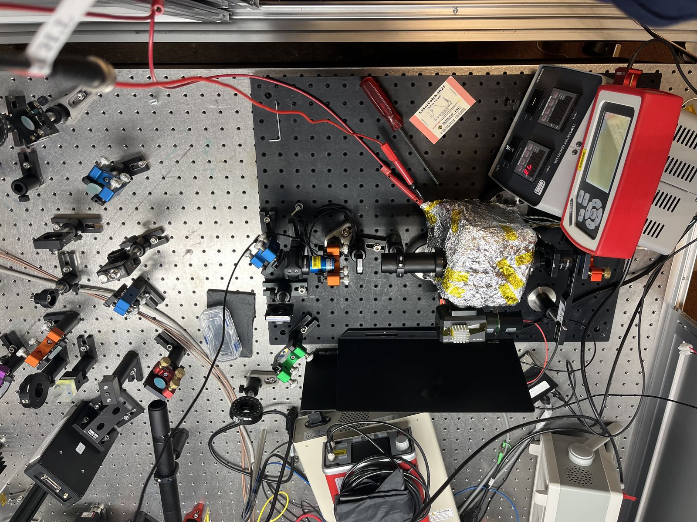

*The detection region as it ran (2025-07-18, in campaign): the foil-wrapped
cell at centre-right, the Thorlabs PXT1/M module housing the R636-10 below
it, lens tube toward the cell, and the MTCD dual-channel temperature
controller top-right.*

## 4. Acquisition

| item | value | provenance |
|---|---|---|
| **Scope of record** | Agilent/Keysight **InfiniiVision DSO-X 3054A**, 500 MHz, 4 GSa/s | PHOTO 2025-06-10 + **DATA** (CSV signature) + EXPERIMENTER |
| Also on the bench (not used for the dataset) | LeCroy **WaveSurfer 3104z** (1 GHz, 4 GS/s); LeCroy **WaveSurfer 10** (1 GHz, 10 GS/s) | PHOTO 2025-07-29 |
| Trace format | 2000 points, 0.5 ms step, 1.000 s window | DATA |

**OPEN, and it matters more than its size suggests: the acquisition MODE of
the archived traces is unresolved, and no per-trace instrument setting was
ever stored.**

  * The one photographed acquisition mode on this page reads **Averaging 32,
    12.5 kSa/s**, while the experimenter's recollection (2026-08-19) is that
    the campaign ran in **High Resolution** mode. On this instrument the two
    are mutually exclusive. The photographed rate also disagrees with the
    archive's own 2 kSa/s trace format, so the photograph may record a
    different configuration entirely, which is the likeliest reading and is
    not established.
  * The distinction is not cosmetic. High Resolution averages ADJACENT
    SAMPLES, which smooths and correlates them. Averaging combines SUCCESSIVE
    SWEEPS, which would mean the stored traces are already averages and the
    repeat scatter is not what the analysis takes it to be. The committed
    integrated autocorrelation of 3.79 samples, about 1.9 ms, was read for two
    days as the detection chain's response time and is consistent with the
    high-resolution reading rather than with the chain.
  * **The chain's own response time therefore remains unknown**, and a
    measured detector response curve is what would settle it, along with the
    mode question, in one afternoon.
  * **The vertical range is not recorded anywhere either**, and it was changed
    at every rung of every power ladder, by up to a factor of 596 in
    quantisation step against a signal spanning about 80. The gain appears
    exactly once in the whole programme, as the `G=10^6` token in the 4 July
    filenames. Every correlation length, effective sample count and
    design-effect correction downstream rests on settings that were never
    written down, which is a record gap rather than a measurement one and is
    fixed for the next session by storing scale, offset, coupling and mode
    with every trace.
| Wavemeter | HighFinesse **Ångstrom WS-8** (WS/8L, unit 4039) | PHOTO |
| Wavemeter autocal | every 8 minutes | PHOTO 2025-06-08 |
| Wavemeter feed | fibre directly from the laser head | EXPERIMENTER 2026-08-03 |
| Wavemeter short-term StdDev | 100 kHz (floating, 10 measurements) | PHOTO 2025-07-18 |

**OPEN: the WS-8's pickoff point is not on record** (2026-08-03 audit). The
wavemeter is documented as an instrument, but where its fibre taps the beam
is not.

### 4.1 Why the Agilent, and how we know

The dataset was taken on the Agilent, not either LeCroy: the LeCroy would not
trigger reliably (experimenter, 2026-07-23). That is independently confirmed
by the files. Every CSV in the dataset opens `x-axis,N` / `second,Volt`, the
Keysight InfiniiVision export signature (398 of 400 sampled, and the other
two carry a corrupted first line already tracked as `header_variant`).
LeCroy writes a different header block entirely, so the format alone
settles it.

This matters beyond attribution: `PLAN.md` §7's advice for recovering
per-scan timestamps was written for LeCroy `.trc`/WAVEDESC files, which this
scope does not produce. Rewritten for InfiniiVision `.h5`, and integrity gate
T6 of the [timestamp pre-registration](PREREGISTRATION_timestamps.md) corrected
the same way, before the backup was opened.

### 4.2 The ramp-monitor channel: available, not saved, and not worth much

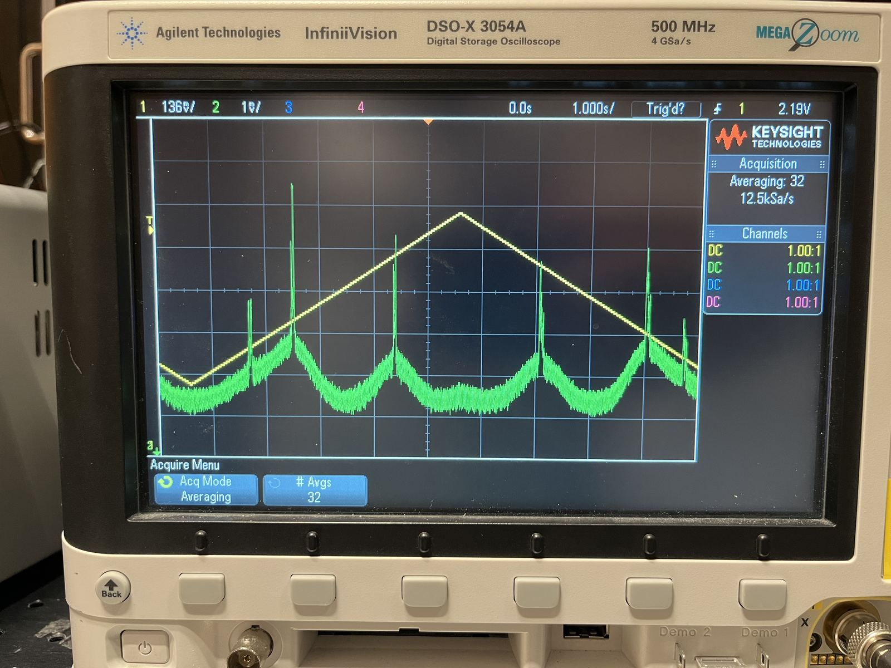

*The acquisition in one frame (2025-06-10): the Agilent DSO-X 3054A of
record, channel 1 the cavity triangle, channel 2 the fluorescence, so four
hyperfine peaks riding Doppler pedestals, and their mirror images folding at
the ramp apex, the very effect the analysis's adaptive fit window exists to
handle. Averaging 32, 12.5 kSa/s.*

A 2025-06-10 photograph of the Agilent shows **two channels**: a clean
triangular sweep-ramp monitor on Ch1 and the fluorescence on Ch2, with the
fluorescence peaks mirrored about the ramp apex, which is the fold made directly visible.
It was **not saved** with the dataset's traces (experimenter, 2026-07-23).

**OPEN: which output fed Ch1, and the Agilent's trigger settings, are not
on record** (2026-08-03 audit). The photographs show the ramp arriving at
the scope, not the cable's far end. The natural candidate is the laser
controller's scan-monitor output, but that is an inference, not a record,
and the trigger source, level and slope of the acquisition are likewise
unrecorded.

**Verdict for a future session: low priority.** The EOM comb already carries
the frequency axis per trace, RF-exact, which a ramp voltage cannot improve on
so the ramp channel buys nothing for calibration. Its one real use is that
`DATA.md` §5 has to *infer* where each window sits on the triangle, and records
that "window ≈ one up-ramp" holds **for most blocks, not all**, with fits
masking the retrace region. A recorded ramp would make the apex position a
measured per-trace quantity instead of an inference, and would retire
assumption A1 outright rather than leaving it as a stated assumption.

That is worth one spare channel and nothing more. If channels are contended,
this is the first thing to drop.

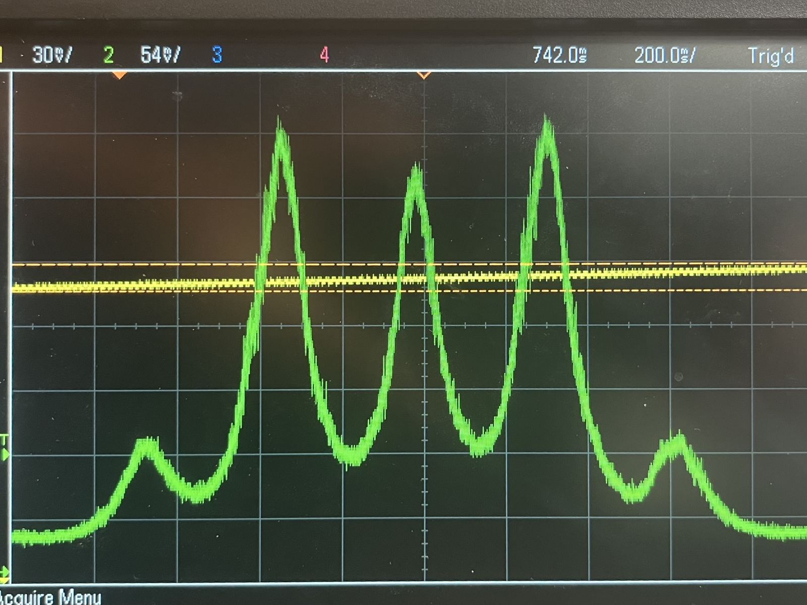

*The frequency ruler in the flesh (2025-07-15): the two-photon comb at
200 ms/div, with carrier, first sidebands and faint outer teeth. Five teeth
are visible here. The comb actually runs to ±3 orders and the fit models
seven, because the sixth and seventh rise above the noise only on the
brighter traces, and truncating at five biases the spacing (addendum 19).
Tooth spacing is Ω/2 = 6.25 MHz on the laser axis, and a pattern like this
calibrates every block's sweep.*

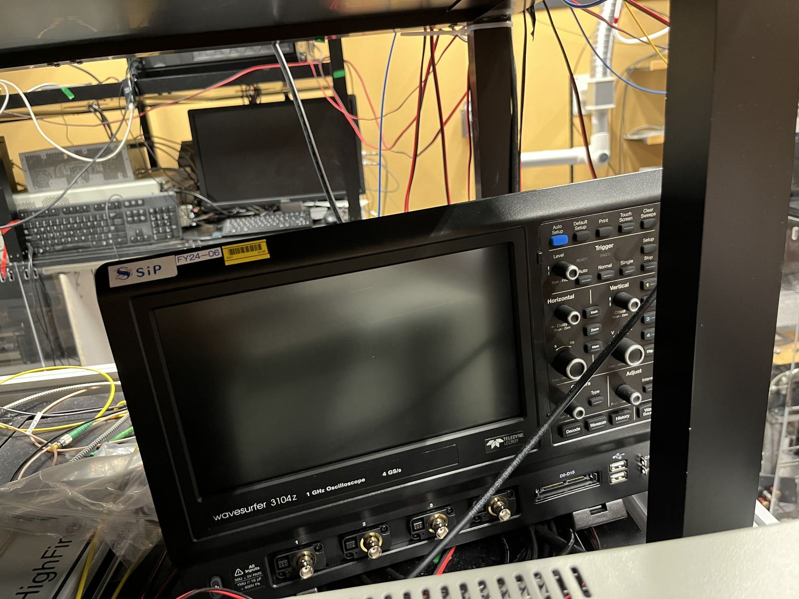

*The LeCroy WaveSurfer 3104z (2025-07-29), the scope of the 4 July evening
session (addendum 9) and not of the dataset. Both attributions rest on
file signatures.*

A 2025-07-15 photograph shows the five-tooth comb on the **LeCroy** reading
"Trig'd", three days before the campaign, consistent with the LeCroy being
tried and then abandoned for the Agilent. It says nothing about A1, since it
is not the scope the dataset came from. An earlier version of this page cited
it as weak A1 evidence, which was wrong. The LeCroy's role is now
instrument-native fact, not inference: the 4 July evening session (50
traces, results report addendum 9) carries `LECROYWS3104z` headers, so that
session ran on the LeCroy and the campaign did **not**. The recollection
this page corrected was a memory of that session's epoch, and both
attributions now rest on file signatures.

Three more instrument facts surfaced when M23 put that session's traces into
a fit (2026-08-01). The LeCroy **auto-triggered**: repeat traces of one
condition place the line up to 0.45 s apart within 84 s. As laser drift that
would be ~4 MHz/min, ten times the campaign's worst, so it is the triangle
phase falling at random against the trigger, and that session's absolute
peak positions carry no frequency. Its scan ran **~4× slower** than the
campaign's: the same line spans ~490 ms against ~140 ms, and the fitted
rates are 0.0103 to 0.0108 MHz/ms per peak against the campaign's 0.0426,
so nothing transfers between the two time axes without a per-peak rate fit.
And each file embeds a wall-clock `TrigTime` per segment. Those are the only
instrument-stamped acquisition times anywhere in this programme's data. The
campaign has only FAT mtimes at 2 s granularity.

---

## 5. Cell and thermal environment

| item | value | provenance |
|---|---|---|
| Cell | glass vapour cell in a copper block, Kapton-taped, foil-wrapped in operation | PHOTO 2025-07-01, 07-18 |
| Cell dimensions | about **25 mm diameter, 100 mm long**. Approximate and recalled, not read off a datasheet or a purchase record, so treat both figures as ±10% until the primary record surfaces | EXPERIMENTER 2026-08-09 |
| Temperature controller | 2-channel. The 4 July evening session's filenames pair the thermocouple reading with the variac set point, `130C(90C-0.65A)` (results report addendum 15). Which positions each channel drives is not established here, and the term "two-zone oven" is retired (2026-08-03: EXPERIMENTER did not recognise it) | PHOTO 2025-07-18 |
| Operating range | 70–130 °C across the campaign's condition grid | DATA (MANIFEST) |
| Thermocouple/heater positions | **four**, marked 1, 2 (one end) and 3, 4 (the other) | PHOTO 2025-07-01 |
| Rb condensation | visible on the cell windows when unwrapped | PHOTO 2025-07-01 |
| Oven tilt | about 3° off the beam normal, keeping window back-reflections out of the retro path | EXPERIMENTER 2026-08-03 |

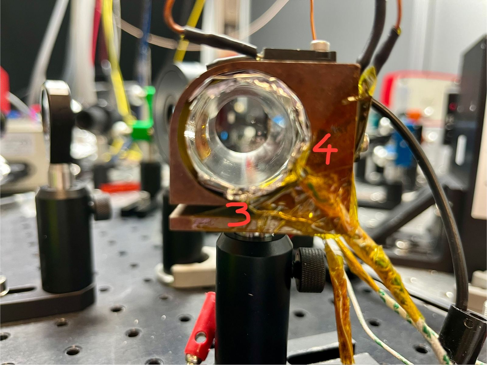

*The cell unwrapped (2025-07-01): copper block, Kapton-taped thermocouples,
with positions 3 and 4 annotated on the frame itself, and Rb condensation
visible on the window. In operation the assembly is foil-wrapped.*

Assumption 7 of [methods §6](methods/08_assumptions_and_outlook.md) allows for
"a possible cell cold spot". Four monitored positions along the cell is the
instrumentation you would add to characterise exactly that gradient, and the
visible window condensation shows where Rb collects. Whether the four channels
were logged during the campaign is not established here.

**OPEN: cell glass type and seal/fill date are not on record.** Helium
permeation through borosilicate glass is a documented long-term drift
mechanism in exactly this class of two-photon vapour-cell experiment:
[Feng et al. 2026](lit/feng2026.md) bake their own borosilicate cell for
over 300 days (~37 permeation time constants) specifically to equilibrate it
away. Whether that mechanism matters for our cell is genuinely open, not
ruled out: the glass composition and seal date are undocumented, so an old,
sealed cell could in principle be carrying an undocumented He collisional
component alongside the Rb-Rb self-broadening this programme fits. Not the
same physics as β_self (foreign-gas shift vs. Rb-Rb self-broadening) and not
evidence of a problem, just a record gap worth closing if the cell's
paperwork ever surfaces.

---

## 6. Laser drift: ten wavemeter records, and what the cavity lock buys

None of the long-term wavemeter logs were saved to disk, so these are read off
dated screen photographs (±20%, and the band centre of a swept trace is an
eyeball estimate). **Two fall inside the 17–18 July campaign**, and the second
was added on 2026-08-16 when the owner pointed at three photographs this
register had never taken in. The earlier count is in
[HISTORY.md](HISTORY.md).

Lock state is recorded on six of the ten records,
across four separate dates, which turns the table from a list
into a comparison:

| date | span | lock state | reading |
|---|---|---|---|
| 2025-06-16 | 1 h 50 min | — | **~85 GHz of settling** after a tuning change, asymptoting to StdDev 400 kHz |
| 2025-06-11 | 53 min | etalon **+ reference cavity** | **±0.19 MHz/min** |
| 2025-06-18 | 2 min, unswept | **cavity error** (scan stopped) | RMS 0.05 MHz, drift −0.05 MHz/min (digitised, see below) |
| 2025-06-19 | 11 min, unswept | **etalon only** (cavity lock off) | **+1.0 MHz/min** |
| 2025-06-19 | 27 min | etalon only | ~0.4 MHz/min |
| 2025-06-19 | 6 min | etalon only | +0.5 MHz/min |
| 2025-07-02 | 5.5 min, unswept | **cavity error** (scan stopped) | RMS 0.04 MHz, drift −0.005 MHz/min (digitised, see below) |
| **2025-07-18 02:37** | **24 min** | not recorded | **in campaign, mid-acquisition.** StdDev 100 kHz, min-to-max 2 MHz over the whole record |
| **2025-07-18 17:03** | **8.5 min** | — | **~4.35 MHz/min avg**, **in campaign**, a settling tail (local slope 9.0 → 2.4 MHz/min) |
| 2025-07-23 | 3 h 30 min | — | −0.17 MHz/min |

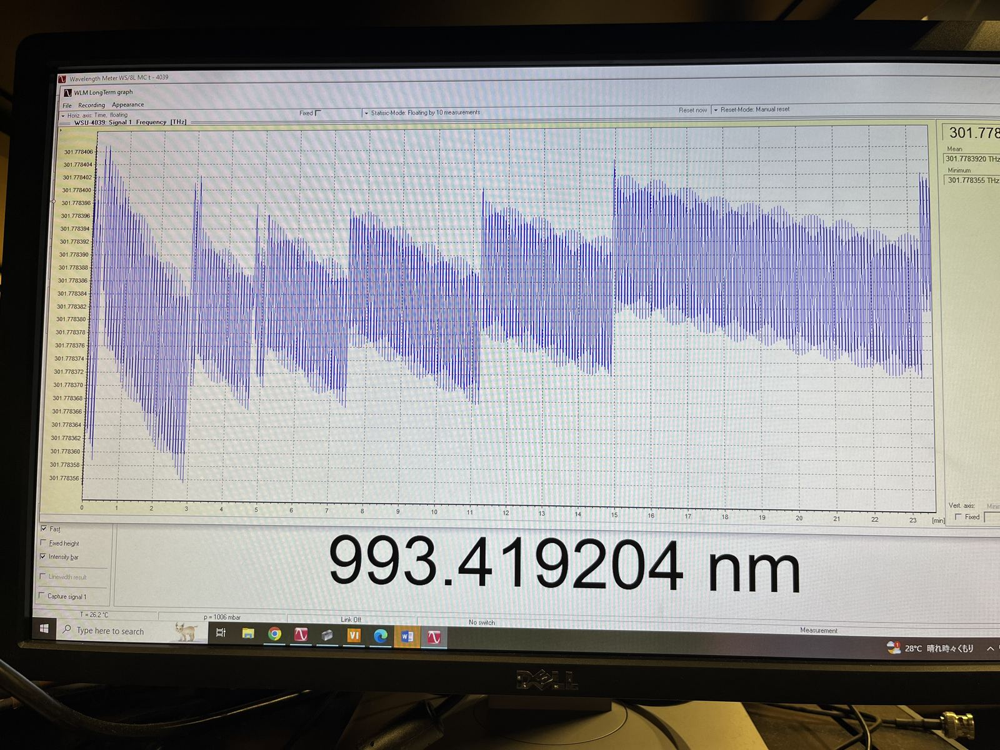 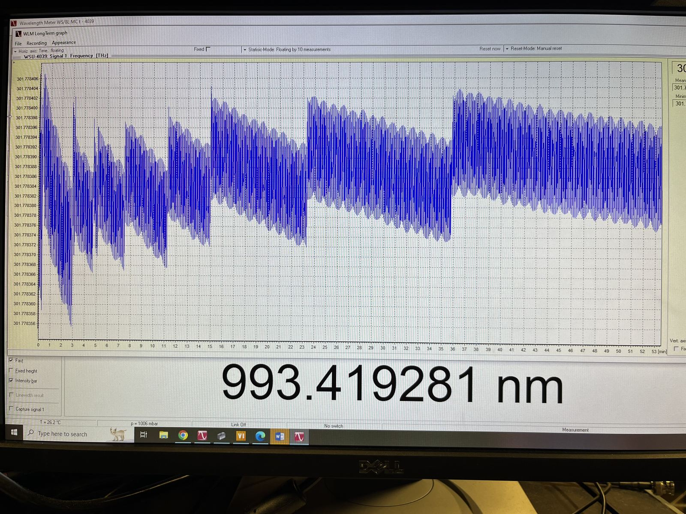

*The two 2025-06-11 records (22:52 and 23:22): scan-modulated bands whose
envelope drift reads ±0.19 MHz/min, the cavity-locked figure the dataset's
within-block bound independently matches.*

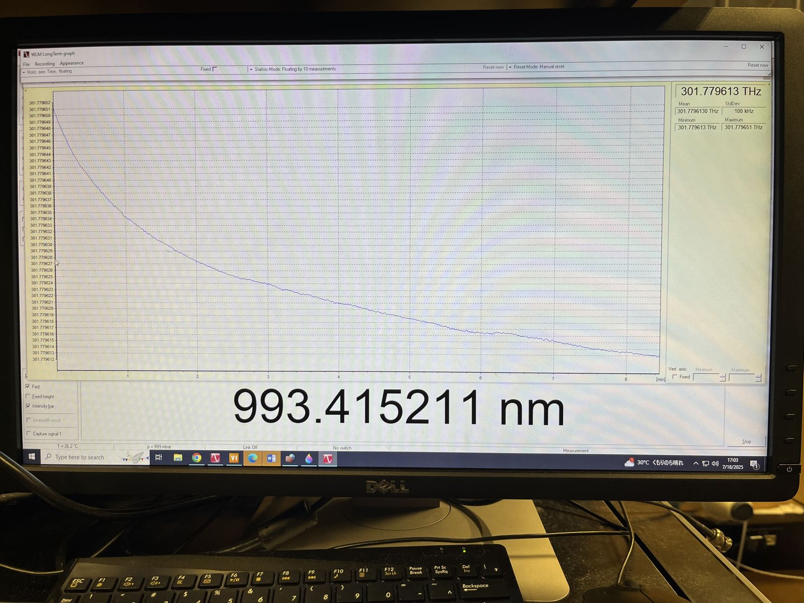

*The later of the two in-campaign records, and its taskbar clock reads
**17:03, 7/18/2025**: eighteen minutes before the 90 °C dwell resumed. This is the
re-lock transient after the daytime break (addenda 4–7), settling toward the
100 kHz short-term StdDev visible in the statistics panel, and not steady
acquisition drift, which the dataset puts two orders below.*

> **The 2025-06-11 record has since been digitised, and it measures something
> the table does not (2026-07-31).** That photograph is from a preliminary
> session five weeks before the campaign, so it says nothing about the campaign
> laser. What it supports is a measurement, because the plot is legible enough
> to extract: `scripts/run_wavemeter_reconstruction.py` pulls the trace out by
> colour and calibrates against the plot's own ticks.
>
> The record is not a drift. It is a sawtooth. Between two re-locks the servo
> holds the laser onto a reference that is still settling thermally, so the
> frequency ramps steadily through the whole interval, and a re-lock ends the
> ramp with a step that takes about 2.6 s to complete. The 0.19 MHz/min in the
> table is a straight line through that sawtooth rather than a rate the laser
> holds. The fitted ramp rates fall in magnitude across the record, from
> −8.9 MHz/min in the first fitted interval to −0.4 MHz/min in the last, which
> is the thermal settle itself.
>
> **The result is the settled floor: 0.62 +/- 0.03 MHz.** That is the laser
> motion left once the re-lock steps and the per-interval ramps are removed.
> It is the one number that survived the 2026-08-03 replacement of the model,
> which moved the point estimate only from 0.63 to 0.62 while retiring
> everything else the module reported. The error is a residual bootstrap,
> added 2026-08-10: four hundred replicates resample the fit's own
> standardized residuals through the fitted heteroscedastic noise shape and
> refit, since the four-parameter profiled likelihood is only piecewise
> smooth and a numeric Hessian would be unreliable on it. The scatter settles
> on a timescale near 1.3 min, so the floor is a settled-state number and the
> first minute of the record is several times worse. Against the campaign's
> AC-Stark bounds carried to the laser axis
> (0.13 MHz from the joint fit, 0.32 MHz from the width-only construction)
> the floor sits above both, which says single-block centres cannot beat the
> averaged bounds. See `figures/fig14_wavemeter_reconstruction.png`.
>
> **The event census.** The kick finder flags 12 candidates. The first falls
> inside the opening 0.4 min the likelihood excludes, so 11 are testable. Of
> those, 8 step the frequency up by more than 1 MHz and are re-locks proper,
> 1 steps it **down** by 1.1 MHz, and 2 do not step at all within 0.2 MHz.
> The two null events are the end of a steep ramp, which the finder reads as a
> jump. So the record supports roughly ten re-locks, one every five to seven
> minutes, which is what the apparatus record describes.
>
> **What this record does not measure.** No relaxation time constant, of any
> kind. The earlier reading had every re-lock relaxing back on one shared
> 353 min constant, and it was replaced on 2026-08-03 when its residual failed
> a whiteness test that the sawtooth passes (preregistration addendum 25). The
> two published relaxation constants, 88 min and then 353 min, are both
> withdrawn, and so is any agreement with the 97 min the timestamp audit fitted
> to the traces. The event count is good to an order of magnitude only. An
> earlier version of this module reported 42 events, an artifact of fitting
> with the noise held constant.
>
> **A visually apparent sub-minute envelope on the 06-11 LongTerm screenshots
> is not evidence of laser modulation (2026-08-02).** IMG_2504 (23 min) and
> the 53-minute sibling both show what reads by eye as a roughly 50 s
> breathing of the scan band. Digitised and tested, the band centre carries
> no significant sinusoid near 50 s once re-lock kicks, relaxation and
> background drift are removed (amplitude 0.26 to 0.36 MHz, 0.6 to 0.7 sigma
> above a spectrum-matched noise surrogate, phase incoherent), and the
> campaign's own held-lock trace record shows the same null under a stacked
> Lomb-Scargle test. A same-night scope and controller screenshot documents
> a 5.00 s triangular cavity scan running that evening, and beating a ramp
> near that period against a plausible wavemeter display rate (1 to 5 Hz)
> reaches a 30 to 90 s Moire period for about 1 in 12 of that range, needing
> only 2 to 5% detuning between independently clocked hardware. Band-envelope
> structure on a photographed LongTerm screenshot is not licensed as evidence
> of real laser motion unless it also survives in trace-level data at
> matching amplitude and phase, which this record does not.
>
> **HighFinesse AutoCal (every 8 minutes) is not resolvable in the 06-11
> 23-minute record.** A phase-grid search for a step common to two or more
> candidate times 480 s apart, on the kick-and-relaxation residual, finds no
> pair of mutually consistent steps anywhere in the record. The largest
> un-repeated local fluctuation is about 1 MHz, which sets a loose upper
> bound: any genuine common AutoCal step is below roughly 1 MHz, consistent
> with the prior expectation of a sub-MHz seam (AutoCal recalibrates the
> wavemeter's own reference, not the laser). The digitisation noise floor
> (residual RMS 2.4 to 3.0 MHz) is too coarse to measure the expected
> sub-MHz scale directly, so this bound is consistent with the expectation
> rather than competitive with it.
>
> **The 17:03 in-campaign record needs no digitising.** The photograph has
> the wavemeter's own statistics panel in shot: mean 301.7796130 THz, standard
> deviation 100 kHz, a 38 MHz excursion across 8.5 minutes. It is one smooth
> relaxation with no re-locks, a different regime from the June record.
>
> **The 2025-06-12 cavity-scan photograph now carries a physical reading
> (2026-08-03, integrals under a committed rule since 2026-08-05).**
> IMG_2508's two channels are digitised in
> [`2025-06-12_cavity_scan_IMG_2508_digitised.csv`](apparatus/2025-06-12_cavity_scan_IMG_2508_digitised.csv),
> and every number in this paragraph is computed from that file by
> `rb5s6s/cavity_scan.py` (`python scripts/run_cavity_scan.py` writes them to
> `results/cavity_scan_integrals.csv`). The rules are module constants: a
> spike is a run of samples more than 5 channel-2 median absolute deviations
> above the channel-2 median, its integral the trapezoid over the run, and
> the ramp apex comes from iterative straight-line fits to the channel-1
> flanks. Channel 1 is the 5.00 s triangular cavity ramp, apex at t = 2.62 s
> by sample argmax (52% of the period), 2.59 s by the flank fit, which masks
> 70 of 547 flank points as trace cross-talk. Channel 2, unlabelled on the
> scope, reads as the four 5S→6S hyperfine components crossed once per sweep
> direction. Three computed facts license that reading. The eight narrow
> spikes form four mirror pairs about the ramp apex, pair midpoints 2.58 to
> 2.65 s. The up-sweep integrals come out in the order the ground-state
> populations predict. The population of level F is
> abundance × (2F+1)/G_iso with G₈₇ = 8 and G₈₅ = 12 (the M10 law,
> `rb5s6s/amplitudes.py`), predicting relative weights
> 1.00 / 1.67 / 2.88 / 4.03 for ⁸⁷ F=1 / ⁸⁷ F=2 / ⁸⁵ F=2 / ⁸⁵ F=3, and the
> measured integrals rank in exactly that order, the two apex-straddling
> ⁸⁷ F=1 crossings weakest. And the two ratios the record can carry come back
> at the prediction: the up-sweep ⁸⁵ pair integrates to 1.42 times against
> the predicted 7/5 = 1.40 (moving 1.34 to 1.42 as the spike threshold
> varies over 5 to 8 MAD), and the up-sweep ⁸⁵ pair carries 2.45 times the
> ⁸⁷ pair's area (2.43 to 2.64 across the same rules) against the predicted
> abundance ratio 2.59. The (2F+1) sum to G_iso within each isotope, so the
> pair ratio predicts the bare abundance ratio rather than the 3.9 that
> abundance × (2F+1) without the normalisation would give. The individual
> weights are not quantitatively recovered, and the causes are in the
> record: the display compresses the tallest spikes (the two ⁸⁵ up-sweep
> peaks read equal heights to about 1% where the populations put them 1.4
> apart), the ⁸⁷ F=1 crossings span only three samples each at the 7 ms
> digitisation pitch (its up-sweep integral reads 1/5 of ⁸⁷ F=2's against a
> predicted 0.6), and the down-sweep is compressed outright, its ⁸⁵ ratio
> reading 0.65. That is why the level-scheme figure
> (`figures/fig13_level_scheme.png`) draws the photograph with the up-sweep
> annotated and quotes only the up-sweep ratios, computed by the same module
> at draw time. Until 2026-08-05 this paragraph quoted an up-sweep ⁸⁵ ratio
> of 1.31 from a rule that was never committed, and stated the law as
> abundance × (2F+1) while the weights beside it carried the /G_iso
> normalisation. The committed rule and the stated law replace both. The
> component sequence remains fixed only up to the scan's frequency direction
> (the observed order matches an up-sweep running from ⁸⁷ F=2 to ⁸⁷ F=1).
>
> **Still open.** The 06-19 etalon-only records are not digitised, so the factor
> 2 to 5 below rests on eye-read numbers on both sides.

> **Two cavity-error records digitised (2026-08-01), and they refine the
> comparison.** Both photographs show the WLM with the scan stopped by a
> reference-cavity error, the state in which the spectroscopy signal on the
> scope goes flat. Both were digitised by the M22 colour-extraction method,
> and the calibration is self-validating: mapping the two labelled 1 MHz
> gridlines to pixels reproduces the panel's own displayed mean to 2 kHz on
> one record and 4 kHz on the other. The dates come from the photographs'
> EXIF, and the 06-18 record's EXIF matches the taskbar clock in shot.
>
> The numbers, laser axis. 2025-06-18 (21:13, 2 min at 993.4191 nm):
> RMS 0.052 MHz, peak-to-peak 0.33 MHz, drift −0.049 MHz/min. 2025-07-02
> (16:39, 5.5 min at 993.4165 nm, two days before the 4 July evening session):
> RMS 0.037 MHz, peak-to-peak 0.23 MHz, drift −0.005 MHz/min. Both records
> sit at an autocorrelation time near the wavemeter's own second-scale
> cadence, so the fast component is at or below the instrument's time
> resolution and these numbers bound the slow component only. They say
> nothing about the millisecond-scale laser kernel that sets
> $\sigma_\text{laser}$ in the fits, where the C2 bound remains the
> operative number.
>
> What they add to the comparison: the scan-off laser can also sit
> essentially still, tens of kHz RMS with negligible drift for minutes at
> a time. The 06-19 etalon-only drifts of 0.4 to 1.0 MHz/min are therefore
> not a floor of that lock state but one of its behaviours, and the
> within-block centre scatter the dataset measures from repeats
> (~0.08 MHz laser) is consistent with these direct records as an upper
> bound. The cavity-error state also documents the failure mode itself:
> when the cavity errors, the sweep stops, and an acquisition saved in that
> state would show a flat trace. No canonical trace in the dataset shows this
> signature. The 4 July evening session's four unusable files are disk
> corruption, a different failure.

**The reference-cavity lock is worth roughly a factor 2–5.** With it engaged the
laser holds ±0.19 MHz/min, and on etalon lock alone it drifts 0.4–1.0 MHz/min. The
06-11 attribution rests on timing rather than a caption: the two drift records
were photographed at 22:52 and 23:22 and the control page showing *etalon
Locked, reference cavity Locked, ECD Not Locked* at 23:33, eleven minutes
after the second. Circumstantial, but tight. The 06-19 state
(etalon on, cavity off, thermally settled) is experimenter-confirmed and
matches the configuration photographed on 06-10.

**A within-record control.** The 06-19 record runs unswept for its first
~11 minutes and then with the scan active, under one unchanged lock state.
which is exactly the comparison needed to separate genuine laser drift from any
apparent drift introduced by scanning. Reading it off a photograph is not
precise enough to settle the question, but the measurement exists and the
design is right, and a repeat with the log saved would answer it outright.

**Synthesis.** After a tuning change the laser settles through tens of GHz over
roughly 1.5 h (the 06-16 curve). Thermally settled, it drifts at ~1 MHz/min on
etalon lock alone and ~0.2 MHz/min with the reference cavity added, with a sign
that varies between sessions. The two in-campaign records say different things
and neither is a steady acquisition rate: the 17:03 one is a settling tail, and
the 02:37 one, taken mid-acquisition, holds StdDev 100 kHz across 24 minutes. `constants.DRIFT_RATE_LASER_HZ_PER_MIN = 4 MHz/min`
therefore holds as a genuine **envelope**, bounding every record here,
while the settled rate is several times smaller.

**The dataset's own numbers, recovered 2026-07-23.** Differencing block
positions against the recovered clock (estimator: experimenter,
`scripts/run_drift_settling.py`, results report addendum 4) gives the
campaign's in-situ figures, resting on a clock reading that is now
instrument-validated: the LeCroy files from the 4 July evening session embed
wall-clock trigger times, and mtime(JST) − TrigTime = +4…+9 s across 47
files (results report, addendum 11). The held-lock drift is **bounded at
order 0.02 MHz/min on the laser axis** across the five-hour power session
the fit sees (the earlier one-constant +0.016 reading did not survive the
window-reference audit, where two of three estimators change sign,
results report addendum 4 and its retraction postscript). The T-session
yields bounds that contain it.
Persisting, ~20 MHz over the 20.5 hours, with the drop-and-recapture
excursions being the scale that forced the all-night re-centring, well inside the first-hour within-block bound (≲0.17 MHz/min,
itself matching the photographed cavity-locked ±0.19 MHz/min independently).
A drift-settling term adds nothing (ΔAIC +4). **What settles is the
operator**, with per-gap re-centring RMS ~1–4 MHz laser in hour 1 decaying with
τ ≈ 1–2.5 h to ≲0.2 MHz, plus two large scan-window repositionings.
*Corrected 2026-07-30:* those two were quoted here as "~25–50 MHz", which is the
window travel multiplied by the EOM rate, the retracted arithmetic (M20). A
repositioning moves the scope's horizontal setting, not the laser, and the
exported time axis is referenced to that setting, so it carries no
frequency content at all. The two events are **+564 ms and −1151 ms of
`window_start_ms`**. The second is the 1134 ms move inside a single 175 mW block
during which the line's position *within the display* moved 6 ms (0.26 MHz). The
per-gap re-centring figures above are also not clean: the >100 ms threshold that
freed "repositionings" in that fit catches only 19 of the 58 recorded window
moves, and the remaining 39 (median 42 ms ≈ 1.8 MHz apparent) are absorbed into
exactly the ~1–4 MHz they are compared against.
That operator settling is what matches the post-retune photographs' scale,
as it should: re-lock transients are when the re-centring works hardest. The
mechanism arrived after the fit, in the right order to count as
corroboration: the model found τ ≈ 86 [70, 104] min blind, and the
experimenter then independently recalled the ~2 h etalon thermal transient,
same scale. Fitting the disturbance as a transient that **restarts at each
re-lock** (results report addendum 12) sharpens both numbers and beats a
single session-long decay by ΔAIC +16: **B = 103 [78, 139] ms = 4.4 MHz
laser, τ = 97 [87, 118] min**, one amplitude for every epoch (per-epoch
amplitudes are consistent with equal, p = 0.29). One thermal transient,
re-armed by every re-acquisition. The timeline agrees in detail: the P session opened inside a
transient (hour-1 chaos, 4 of 10 blocks stepped), its late ladders sat past
one (quiet), and after the 9.6 h daytime break the re-lock at ~17:03
(IMG_2896) restarted the clock, so **both evening dwells ran inside or at the
edge of that fresh transient**, which is why the 70 °C dwell (118–195 min
after re-lock) never calmed to late-P quietness. σ_gap(t) then reads
physically: the typical frequency excursion per drop-and-recapture cycle,
decaying as the etalon thermalises. Individual steps stay unresolvable into
drop vs deliberate move from mtimes alone. The clock also
explains the 17:03 in-campaign wavemeter record: IMG_2896 was shot
eighteen minutes before the 90 °C dwell resumed (17:21), i.e. during the
re-lock after the daytime break, and its ~4.35 MHz/min is the re-tune transient
the envelope exists to bound, not the acquisition-time drift, which the
dataset puts two orders below.

**What this implies for the campaign.** The campaign ran with the reference
cavity locked (experimenter, 2026-07-23), i.e. the 06-11 regime, so the settled
expectation is **≈0.2 MHz/min**, not the ~1 MHz/min of etalon-only operation.
The Ti:Sapph ran continuously through the 24 h ([DATA.md](DATA.md) §2), so most
acquisition sat in the settled regime, and each manual set-point move re-zeroed the
accumulated offset rather than restarting a thermal transient, since the laser
was neither retuned nor restarted.

**A bound this yields, for free.** The intra-block positions show *no* trend
with repeat index (§[PREREGISTRATION](PREREGISTRATION_timestamps.md) §8.4,
p = 0.33). At ≈0.2 MHz/min, drift would reach the observed 0.08 MHz scatter
only after ~70 s, so its absence bounds the block:

> **The MEDIAN 5-repeat block spans less than ~70 s** (under ~14 s per saved
> trace). **Scored 2026-07-23: PASS**, median 34 s, range 20–148 s
> ([PREREGISTRATION_RESULTS.md](PREREGISTRATION_RESULTS.md)).

That replaces the voided D4 and inverts its logic: D4 divided the scatter *by*
a drift rate, assuming the scatter *was* drift. This uses the **absence** of
drift, together with a drift rate now known from the lock state, as an upper
bound. It was a genuine pre-data prediction about the recovered timestamps, and it held.

---

*Nothing on this page changes a result already in the record. It records
what the measurement was made with, which of those facts are verified, and
which are inherited assumptions still to be checked.*

[← DATA.md](DATA.md) · [PLAN.md](PLAN.md) · [methods index](methods.md)
