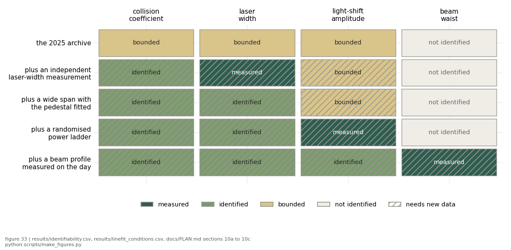
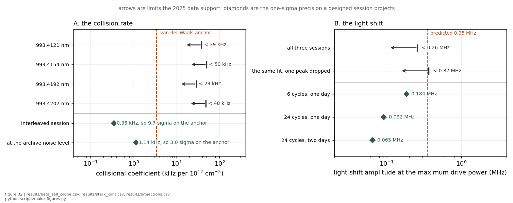
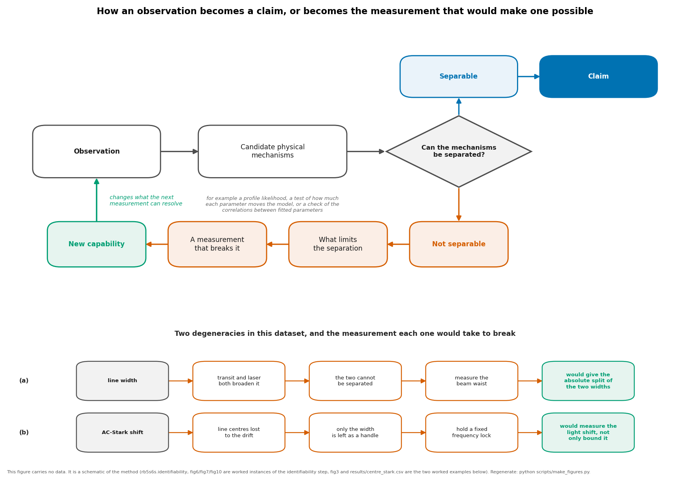

# The big picture

**The question.** What is this line, what did the 2025 measurement actually
establish, what does it still not determine, and what would a further session
convert?
**Takes.** Nothing.
**Gives.** The epistemic map of the experiment, quantity by quantity, and the
route into the chapters that argue each part of it.
**Skip if.** You want the numbers rather than the map, in which case
[RESULTS.md](RESULTS.md) is the ledger and [CLAIMS.md](CLAIMS.md) the register.
If you arrived holding ONE quantity and want its literature benchmark, its
constructions, its limiting mechanism and the recipes that would improve it,
that is [quantities/](quantities/README.md).

> **Unfamiliar with the vocabulary?** [GLOSSARY.md](GLOSSARY.md)
> explains the measurement in six sentences, then defines every term
> and symbol used anywhere in this repository.

This page is the information structure of one experiment. A Doppler-free
two-photon measurement of the rubidium 5S to 6S line at 993 nm, taken in 2025
under a lock that drifted, is analysed for what its lineshapes determine. The
tables below say which quantities that fixes, which it only bounds, which it
leaves undetermined and why, and what a designed session would change about
each. Everything quantitative traces to [RESULTS.md](RESULTS.md) and the files
it carries provenance for.

---

## Part I. What the 2025 measurement established

The headline is not a number. IT IS THAT THE DATA CONSTRAIN THE LIGHT SHIFT AND
THE COLLISION RATE WITHOUT IDENTIFYING EITHER INDEPENDENTLY OF THE OTHER
BROADENING MECHANISMS. The numbers follow from that, and each one carries the
construction it was measured under, because a bound quoted without its
construction reads as model-independent and none of these are.

| question | quantity | what is observed | what is inferred | parameter status | 2025 result | construction it depends on | what limits it |
|---|---|---|---|---|---|---|---|
| **Q-MODEL-01** Does one lineshape model describe every condition? | the composite profile | 32 conditions of a temperature and power sweep | natural, transit, laser and collisional widths convolved | described | reduced chi-square 0.78 to 1.09, mean 0.89 | the adopted transit kernel and the adopted waist | model |
| **Q-WIDTH-01** Can the collisional and laser widths be separated? | the width split | one total width per condition, to 0.0032 MHz | the split into its parts | **not identified** | the split direction is constrained only to 0.0624 MHz, a factor of twenty worse, at a condition number of 390 | the joint fit over the shared-width structure | identifiability |
| **Q-BETA-01** How fast do collisions broaden the line? | the collisional coefficient | widths across four densities | a rate per unit density | **bounded** | below 0.03 to 0.05 MHz per 1e12 per cubic centimetre, 95 per cent, per peak | the four-temperature construction, on a density scale from vapour-pressure curves | experimental, the density scale |
| **Q-S0-01** How large is the light shift at full power? | the light-shift amplitude | line shapes across a power ladder | the shift amplitude through the shape | **bounded** | below 0.26 MHz at 225 mW, against 0.35 MHz predicted | the joint three-session fit, conditional on the adopted waist | experimental, the waist, AND identifiability if the three pooled sessions do not share it, since the coefficient goes as one over the waist squared. See [chapter 8](big_picture/08_when-a-joint-fit-is-legitimate.md) |
| **Q-LASER-01** How narrow was the laser? | the laser width | the total width and its trend | the laser part of it | **bounded** | below about 1.2 MHz on the laser axis, median 1.74 MHz across conditions | the same split as Q-WIDTH-01, so conditional on it | identifiability |
| **Q-GEOM-01** What is the beam waist? | the waist | nothing on this bench | adopted from the apparatus lineage | **not measured here** | taken as 64 micrometres, band 62 to 68 | the lineage, and a transit-width consistency argument | experimental, and it is the largest open systematic |
| **Q-BAND-01** What is the excess outside the fit window? | the out-of-window residual | a real structured excess, 0.10 to 0.29 per cent of peak | a candidate mechanism, the lineshape rather than the atom | **unattributed, with a candidate** | survives per-trace cubic baselines, and tracks the model's own in-band profile height while vapour density is a null predictor | the production baseline and window | model, and see [the finding](notes/band_excess_is_model_form.md) |

**How to read the parameter status.** *Described* means the data are consistent
with the model and no parameter claim is being made. *Bounded* means one side
of the parameter is excluded and the other is not, under the stated
construction. *Not identified* means the data determine a combination of
parameters but not the parameters themselves, which is a stronger and more
useful statement than a wide error bar. The counts across the whole record are
122 bounds, 55 measured values, 21 nulls and 149 design envelopes, which is the
honest shape of a dataset taken under a drifting lock.

---

## Part II. What remains undetermined, and why

Three things are undetermined for three different reasons, and the distinction
decides what a further measurement has to do.

**The width split is undetermined by DEGENERACY.** The collisional and laser
widths enter the profile almost interchangeably, so the fit determines the
total width fifty times better than it determines how the total divides. No
amount of the same data fixes this, because the information is not in the
lineshape at all. Only an independent measurement of one of the two, or a
lever that moves one without the other, can break it.

Both halves of that sentence are measured rather than argued. Varying the span
by a factor of five and the trace count by a factor of ten moves the
correlation between the two widths from -0.9177 to -0.9166 and -0.881, which
is no movement, so no acquisition setting is the asymmetric lever. Measuring
one of them elsewhere buys the other a factor of one over the square root of
one minus the correlation squared, between 2.3 and 3.2 across the conditions
this record covers, and
[chapter 7](big_picture/07_limitations-and-identifiability.md) carries the
constructions, together with the second limitation hiding inside this one:
the fit assigns the laser a KERNEL SHAPE the record has never measured, and
the wrong shape biases the collisional width rather than widening its error
bar.

**The absolute frequency axis is undetermined by CONSTRUCTION.** The lock
drifted and the wavemeter was photographed rather than logged, so every axis in
the archive is differential. Line shapes survive this and line positions do
not, which is why the analysis reads shapes.

**The waist is undetermined by ABSENCE.** It was never measured on this bench.
Every intensity-denominated quantity is conditional on it, which is why the
light-shift row above is a bound with a condition attached rather than a
measurement.

### The identifiability map

Which quantities each configuration determines. A cell says the status that
configuration would reach for that quantity, GIVEN the documented assumptions
and the projected machinery, and the hatch marks the ones that need the new
measurement rather than a reanalysis. Nothing in the added rows is a result.



---

## Part III. What a further session would change

Each row is one ambiguity, the measurement that removes it, and the outcome
that measurement targets. THE OUTCOME COLUMN IS A TARGET AND NOT A RESULT, and
the failure column is what the record would say if the design did not work,
which is the part that makes the design testable rather than hopeful.

| ambiguity now | why the present data cannot resolve it | the new measurement | ambiguity removed | target outcome | validation basis | what would say it failed |
|---|---|---|---|---|---|---|
| the width split | two kernels trade inside one profile | an independent laser-width measurement, which the repaired lock makes possible | the width ridge | the collisional width becomes separately identifiable | design simulation, [PLAN §10c](PLAN.md) | the pinned fit's residual scatter does not fall, which would place the limitation beyond the laser width |
| the absolute axis | no logged frequency reference | two same-isotope pairs inside one sweep, plus a logged wavemeter | absolute-frequency ambiguity | the axis becomes calibratable to the accuracy of the hyperfine constants | design simulation, [PLAN §10c](PLAN.md) | the two rulers disagree beyond the projected nonlinearity, which would mean the axis model is wrong rather than imprecise |
| the baseline | the pedestal is flat across the archive's window and a free baseline absorbs it | a span wide enough to curve the pedestal, with the pedestal fitted as a pedestal | baseline against signal | the baseline becomes measured rather than chosen | design simulation, tested by injection ([PLAN §10a](PLAN.md)) | the wide fit does not recover an injected pedestal, which would mean the span is still too narrow |
| the transit kernel | the waist is adopted and the cusp form is untested here | a beam profile measured on the day, plus one cold and dim condition | the geometry systematic | the transit model becomes directly testable | design simulation, [PLAN §10c](PLAN.md) | the model comparison stays inconclusive at the achieved precision |
| the light shift | one power cannot separate the shift from other broadening, and one trace has too little signal in the asymmetry | a randomised power ladder with more rungs and per-sweep normalisation | shift against broadening | measured rather than bounded | design projection, from the projections file | the per-sweep normalisation scatter exceeds the pull it is meant to resolve |
| the band excess | no candidate mechanism, and the pedestal is excluded as its source | polarisation isolation blocks, which separate line from pedestal in hardware | signal against contaminant | the anomaly becomes attributable | design simulation, [PLAN §10c](PLAN.md) | the isolated blocks show the same excess, which would move it from the optics into the detection chain |

Each chain is argued in full, with its evidence, in
[limitations and identifiability](big_picture/07_limitations-and-identifiability.md).

---

## Part IV. The projections, quantitatively



*The two panels put what the archive supports on the same axis as what a
designed session projects. A projected precision is drawn as a LENGTH in the
panel's own unit rather than as an interval around an assumed centre, because
it is the size of a future error bar and not a claim about where the answer
falls. Panel A puts the four per-peak limits an order of magnitude above the
rate the van der Waals anchor predicts, while the projected precisions sit an
order of magnitude below it, which is what a detection at 9.7 sigma for an
interleaved session and 3.0 at the archive's own noise level means. Panel B
carries a genuine tension rather than a gap: the primary bound on the light
shift sits BELOW the predicted value, an exclusion at about the two-sigma
level, and the robustness fit that drops one peak does not sit below it, so
the exclusion is marginal and subset-dependent. Both bounds are drawn for that
reason.*

A PROJECTION IS NOT A RESULT. The values drawn above are envelope calculations
attached to specific session designs, and they are reported so the cost of a
session can be weighed against what it would buy. The design simulations behind
the acquisition settings are argued in [PLAN.md](PLAN.md) sections 10a to 10c
and are cited there rather than restated here.

---

## Part V. Where to read further

| # | chapter | what it adds |
|---|---|---|
| 1 | [Why this line](big_picture/01_why-this-line.md) | what makes 5S to 6S worth the work, and the trap and clock physics that depends on it |
| 2 | [The method and its limits](big_picture/02_the-method-and-its-limits.md) | the drift-immune method itself, the shape channels it reads, and the size the coefficients should have |
| 3 | [Goals and prior art](big_picture/03_goals-and-prior-art.md) | what is already published on this line, and the gap this work fills |
| 4 | [What the 2025 dataset delivered](big_picture/04_what-2025-delivered.md) | the results of Part I in full, with their derivations linked |
| 5 | [The next vapour-cell session](big_picture/05_next-vapour-cell.md) | the cell measurements ranked by leverage, with costs |
| 6 | [The next nanofibre session](big_picture/06_next-nanofibre.md) | what a guided-atom platform adds that a cell structurally cannot |
| 7 | [Limitations and identifiability](big_picture/07_limitations-and-identifiability.md) | the six chains of Part III, argued from the diagnostics |
| 8 | [When a joint fit is legitimate](big_picture/08_when-a-joint-fit-is-legitimate.md) | the two sharing decisions this record makes, across peaks and across sessions, and six questions to ask of any pooled fit |

For the derivations, [methods.md](methods.md) owns every one. For the general
concepts, the [wiki](wiki/README.md) explains each technique on its own page.
For the proposed session, [PLAN.md](PLAN.md) is the measurement plan.

### What each piece buys

```
  2025 dataset (done)          model + bounds + method, w0-conditional
        │
        ├── beam-profile w0 ───────► every intensity-denominated bound
        │                            sharpens (no new physics run)
        │
        ├── absorption channel ────► the density scale the collisional
        │   for N(T)                 bound rides on becomes measured
        │
        ├── hot points 150-170 C, ─► beta_self would be measured
        │   peaks interleaved
        │
        ├── fixed-lock cell session ► the pull comes alive, so the
        │         │                   polarizability and the self-shift
        │         │                   would be measured (if run)
        │         │
        │         ├── ramp monitor ► a time axis independent of the scope
        │         │   on a spare     knob, which is what the centre
        │         │   scope channel  channel lost
        │         │
        │         ├── small waist ──► shape-based readout demonstrated vs the pull
        │         │
        │         └── O-band diode at 1297.5 nm ► the 6S-7P matrix element by a
        │                                         differential null, plus the
        │                                         asymmetry sign-flip test
        │
        └── nanofibre session ──────► pushing-dip model + surface shift,
                                      read against the cell reference
```

*Each arrow is independently valuable, and nothing below the 2025 dataset is
required for the 2025 dataset's own results to stand.* [The next vapour-cell
session](big_picture/05_next-vapour-cell.md) ranks four of these arrows by
leverage and quantifies three acquisition changes on the same points. Two
arrows sit outside that ranking on purpose: the ramp monitor is an instrument
repair rather than new physics, which is why [PLAN.md](PLAN.md) §3 puts it at
the top of its own order, and the O-band diode is ranked against the other
candidate lines in
[FUTURE_TRANSITIONS_titsapph.md](FUTURE_TRANSITIONS_titsapph.md) §4.1 instead.
The nanofibre arrow is [chapter 6](big_picture/06_next-nanofibre.md).



*How the parts of this page connect. The bounds and the limitations are not two
lists but one loop: what the apparatus could not do sets which observable
survives, the surviving observable sets which model can be fitted, and the
fit's own failures name the next measurement. That is why Part III exists, and
why it reads downward from the dataset rather than upward from a result.*
