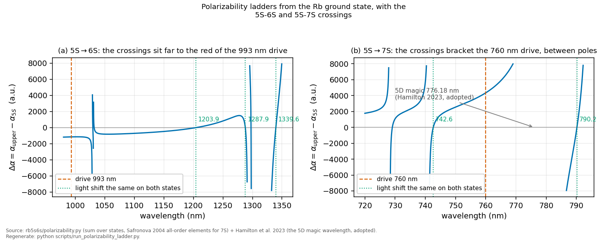
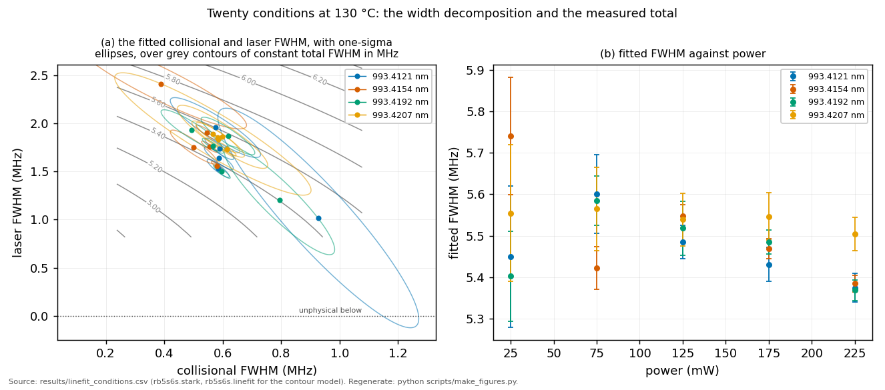

# The big picture

*Three readers act on this page, and each should start somewhere different. A
reader weighing whether a further measurement earns its bench time reads the
dependency map below, then §5 and §6 for what each one would
convert. A reader judging what has actually been delivered reads §4, where the
results are collected, and follows the chapter links there into
[`methods.md`](methods.md), which owns every derivation behind them. A researcher with their own transition reads §1
for why this class of line repays the effort, §3 for what is already published
on 5S–6S, §1.3 for the method, and §4 for what of the method is new. Everything
quantitative below traces to [`RESULTS.md`](RESULTS.md) and the CSVs it carries
provenance for.*

## What each piece buys

```
  2025 archive (done)          model + bounds + method, w0-conditional
        │
        ├── beam-profile w0 ───────► every intensity-denominated bound
        │                            sharpens (no new physics run)
        │
        ├── absorption channel ────► the density scale the collisional
        │   for N(T)                 bound rides on becomes measured
        │
        ├── hot points 150-170 C, ─► beta_self would be measured
        │   peaks interleaved
        │
        ├── fixed-lock cell session ► the pull comes alive, so Δα and
        │         │                   the self-shift would be measured
        │         │                   (if run)
        │         │
        │         ├── ramp monitor ► a time axis independent of the scope
        │         │   on a spare     knob, which is what the centre
        │         │   scope channel  channel lost
        │         │
        │         ├── small waist ──► shape-based readout demonstrated vs the pull
        │         │
        │         └── O-band diode at 1297.5 nm ► the 6S-7P matrix element by a
        │                                         differential null, plus the
        │                                         asymmetry sign-flip test
        │                                         (FUTURE_TRANSITIONS §5.1)
        │
        └── nanofibre session ──────► pushing-dip model + surface shift,
                                      read against the cell reference
```

Each arrow is independently valuable, and nothing below the archive is
required for the archive's own results to stand. §5 ranks four of these arrows
by leverage on the physics: the beam profile, the pull that a fixed lock brings
alive, the hot points, and the small waist. It then prices three acquisition
changes on the same four points. One of those is the absorption channel drawn
above, and another, reading the 6S→5P 1.3 µm cascade, rides any cell session
rather than standing as an arrow of its own. Two arrows drawn above are
deliberately outside the ranking. The ramp monitor is absent from it, together
with the retro ratio, because they are instrument repairs rather than new
physics, which is exactly why [`PLAN.md`](PLAN.md) §3 puts them at the top of
its own order. The O-band diode is absent for a different reason: it is
costed in §1.2 and ranked against the other candidate lines in
[`FUTURE_TRANSITIONS_titsapph.md`](FUTURE_TRANSITIONS_titsapph.md) §4.1 rather
than against the cell arrows. The nanofibre arrow is §6. [`PLAN.md`](PLAN.md) prices each of them as a
block, with its cost and its empty case, and ranks them again by what a
shrinking budget should cut.

---

## 1. Why the line is worth characterising at all

*Status, plainly. 993 nm is not put forward as a better clock line. On
natural linewidth it is worse than the 778 nm standard. The
magic wavelengths are calculated and unvalidated. The method is demonstrated
on this dataset as a bound. What has actually been delivered is in §4.*

Stated at the size the evidence supports, in four parts. §1.1 is the case for
the line. §1.2 is the trapped-atom route, and the one O-band crossing that is a
lever rather than a trap. §1.3 is the method. §1.4 is the size the collisional
coefficient should have. Sections 5 and 6 say what the next measurements would
add.

### 1.1 An uncharacterised line in a well-motivated class, but not a better clock line

The 778 nm 5S→5D two-photon transition is an established optical
frequency reference, and the reason is structural: two-photon Doppler-free
excitation kills the first-order Doppler width without a beam-geometry trick,
so the apparatus is a cell, a laser and a detector. That compactness is the
documented draw of the whole class ([Martin 2018](lit/martin2018.md),
[Newman 2021](lit/newman2021.md)).

993 nm 5S→6S shares that structure. It does **not** share the linewidth
advantage: the 6S₁/₂ upper state lives 45.57 ns
([Gomez 2005](lit/gomez2005.md)), giving the 3.49 MHz natural width every fit
here carries, whereas 5D₅/₂ is far longer-lived: [Bandi 2025](lit/bandi2025.md)
quotes the 5S→5D two-photon working linewidth as **≈330 kHz**, about an order of
magnitude narrower. On natural quality factor alone, 993 nm starts *behind* the
line the compact-clock community already uses, and that
community is at 6×10⁻¹⁴/√τ ([Ahern 2025](lit/ahern2025.md)). Nothing in this
archive suggests 993 nm would overtake it, and this page should not be read as
claiming so.

What is true is narrower and worth stating on its own: the environmental
coefficients of 993 nm have only ever been bounded, and coarsely
([Orson 2021](lit/orson2021.md)'s nulls at ~6 MHz). Those coefficients decide
how well an environment must be controlled for any target stability, so they
are worth knowing for a line nobody has measured them on, and they are the
entry the 5D/7S self-broadening series is missing. That is the case: an
uncharacterised line in a practically-motivated class, not a challenger.

The rungs either side of it are now measured, by one group and one method,
which makes the gap concrete rather than rhetorical. Both drive a
Doppler-free two-photon line in a pure Rb cell and read the cascade
fluorescence, and both infer density from cell temperature rather than
measuring it:

| line | self-broadening | in MHz per 10¹² cm⁻³ | convention |
|---|---|---|---|
| 5S→5D₃/₂ ([Cao 2025](lit/cao2025.md)) | 40 ± 0.54 kHz/mTorr | ≈ 0.0018 | FWHM, stated |
| 5S→7S ([Wang 2025](lit/wang2025.md)) | 0.32 ± 0.01 MHz/mTorr | ≈ 0.014 | not stated |
| **5S→6S, this work** | — | **bound 0.03–0.05** | FWHM |

Converted at 423 K, the temperature both papers use. The 7S paper never says
whether its linewidth is a half width or a full width, so the factor of eight
between the two rungs carries a factor-of-two caveat until someone settles it.
The 7S row is also not the 7S number §1.4 anchors on. Zameroski 2014 measured
the same 760 nm line at 129 ± 11 kHz/mTorr, about 0.0054 in the units of the
third column, a factor of 2.6 below Wang's, and §1.4 converts it at 403 K
rather than 423 K, which is a difference of a few percent and none of the
factor of 2.6
([FUTURE_TRANSITIONS_titsapph.md](FUTURE_TRANSITIONS_titsapph.md) §3.2). The
one quantity the expectation in §1.4 rides on therefore has two published
values and no adjudication.

This archive's bound sits 2.1 to 3.6 times above the 7S
entry, so it is consistent with the neighbouring rung without yet reaching
it. The per-peak *fitted* values here, 0.013 to 0.018, straddle
the 7S rung: three of the four are above 0.014 and the fourth just under it, even
though 6S is the more compact state. That is independent
support, from outside this archive, for the reading its own lever test already
forces: those fitted widths are a floor, not resolved collisions. Inside the
archive the evidence is that the width rises only ×1.47 across a ×52.5 density
span. The neighbouring rung says the same thing from the other direction.

[Wang 2025](lit/wang2025.md) closes by
proposing 5S→7S as the basis for an optical frequency standard. The 5S→6S line
is not being characterised in an empty field.

### 1.2 Magic wavelengths would let it be done on trapped atoms

The awkwardness of a cell reference is that the atoms are hot, colliding and
moving through the beam. Those are the transit and collisional terms this
archive spends its effort bounding. Trapping fixes that, but a trap normally
shifts the very line you are measuring. A *magic* wavelength does not: both states shift equally, and
the transition frequency is untouched. That is the trick behind lattice
clocks (Sr at 813 nm). The polarizability recompute here gives the **first
5S–6S magic wavelengths**, ≈ 1203.9 / 1287.9 / 1339.6 nm, all trapping (α > 0 for
both states), with a 16 to 84 percent band of 1203.06 to 1204.73 nm on the
1203.9 nm crossing, so the
trapped-atom version of this measurement has candidate wavelengths where
before it had none. The state pair has to be said out loud: Zang *et al.* 2012
report six magic wavelengths between 1200 and 1600 nm for the **6s–5p₁/₂,₃/₂**
pairs of a four-level active clock, two of which (1336 and 1342 nm) bracket the
1339.6 here. They are a different state pair and a different magic condition,
and the crowding is expected: between the 5p₁/₂–6s₁/₂ and 5p₃/₂–6s₁/₂
resonances at 1323.88 and 1366.87 nm the 6S polarizability runs from one pole
to the other through every value, so any pair built on 6S tends to put a root
somewhere in that 43 nm window, theirs at 1336 and 1342 nm and this archive's
at 1339.6 nm included. These are an envelope, and scalar only, which for
these states is less of a caveat than it sounds: the tensor polarizability
vanishes identically for $J=1/2$
(triangle rule), so with linear polarization the scalar term is exact, not an
approximation. None of the three crossings has been measured. The list is also
deliberately incomplete: three more crossings exist hard against poles, one at
1297.5 nm sitting 0.7 nm from the 6s₁/₂–7p₁/₂ resonance at 1298.3 nm and two
hugging the 6s–8p doublet near 1029.7 and 1031.9 nm, and the 1.5 nm pole guard
in `magic_wavelengths()` drops them by construction. That close to a resonance,
photon scattering and the sensitivity to trap-laser frequency make a crossing
magic in name only. `rb5s6s/hyperpolarizability.py` puts numbers on all six crossings, the
pole-hugging ones included, pricing three trap-design quantities at each, the
two shifts to within a factor of two. The fourth-order differential shift, the hyperpolarizability term, is
+0.87 Hz per megahertz squared of trap depth at the 1203.9 nm crossing, where a
depth of h × 1 MHz is 48 µK, so a trap half a millikelvin deep moves the line
by somewhere between fifty and two hundred hertz against the transition's
3.49 MHz natural width. The vector shift is the
sharper requirement: at that same depth a stretched-state atom sees 280 kHz per
megahertz of depth per unit circularity of the trap light, so holding the trap
shift under a kilohertz needs the circularity below about 3 × 10⁻⁴. At the 1297.5 and 1339.6 nm
crossings the same coefficient is nearly ninety times larger, so those two are
usable only in strictly linear light. Trap photons scatter off the 6S state a few times per second per
megahertz of depth at 1203.9 nm and ten to sixty times faster at the 1287.9,
1297.5 and 1339.6 nm crossings. The pair near 1030 nm shows lower rates on
this line list, but there the module flags its upward entries as several-fold
understatements, and holding a trap wavelength against the adjacent 6s–8p
doublet would put the trap laser's own stability into the error budget. That
leaves 1203.9 nm as the one practical operating point. The crossings also read backwards. Where one sits is fixed by
the matrix elements that build the two polarizabilities, so measuring a
crossing constrains them, which is how the 5S–5D magic wavelength was turned
into a 5P–5D matrix element by [Hamilton 2023](lit/hamilton2023.md). The lever
is best where the trap is worst, but the quantity that decides whether a
measurement is worth making is what the element is already known to.
`lever_table()` in the same module ranks all six on all three counts, and
exactly one crossing, the steep root at 1297.5 nm, would improve on the present
state of knowledge at all, by three per cent. [FUTURE_TRANSITIONS_titsapph.md](FUTURE_TRANSITIONS_titsapph.md)
§5.1.1 carries the table and the reason steepness turned out to be the right
thing to have selected on.



*Where the magic wavelengths come from: the 5S and 6S dynamic polarizabilities
cross three times between 1200 and 1340 nm, and each crossing is a wavelength
where a trap would hold both states without pulling the 993 nm line.*

Where they landed was not designed for. **Two of the three sit inside the
telecom O-band** (1260–1360 nm, ITU), 1287.9 and
1339.6 nm, so a trap at either could in principle be built from datacom-grade
diodes, which are cheap, fibre-coupled by default and available space-qualified.
Those two are not the practical pair, though, and the reason is not the diode.
Both lie hard against 6S→nP resonances, where trap-photon scattering is high,
so the 1203.9 nm crossing, which sits on the smooth part of the curve, is the
usable one ([README.md](../README.md)'s results table and
[CLAIMS.md](CLAIMS.md) §1 both say so). The O-band also has no erbium
amplifier, so reaching trap power there is harder than in the C-band, but that
is the soluble half of the objection. Recorded as an observation about the
numbers, not a design: they remain unvalidated, scalar-only envelopes, and the
band edges are an external convention rather than anything this repo computes.

**A third O-band crossing is a lever rather than a trap, and it is the map's
cheapest arrow.** The three above cleared the pole guard. The same differential
polarizability also crosses zero on a steep root at 1297.5 nm, 0.745 nm from
the 6S to 7P resonance, trapping in sign like the other five but priced out as
a trap by that proximity, and the proximity that ruins it as a trap is what
makes it precise for metrology: an auxiliary diode scanned across it while
the 993 nm lineshape is read locates the root, and the root's position gives
the 6S to 7P reduced dipole matrix elements with no intensity calibration and
no absolute frequency reference in the chain. The same beam is a sign-reversal
test of the asymmetry channel and a calibrated shift injector. It rides any
cell session on one commodity diode and no new laser time, which is why
[FUTURE_TRANSITIONS_titsapph.md](FUTURE_TRANSITIONS_titsapph.md) §4.1 ranks it
first of four candidate papers on risk-adjusted distinctiveness per unit bench
cost, and §5.1 there carries the design and its envelope numbers. It is deliberately absent from the
magic-wavelength list above, whose criterion is usability as a trap.

### 1.3 The method outlives the line

In any structured field the light shift is not one number but a distribution
over where the atoms sit, and because a two-photon signal goes as intensity
*squared*, that distribution has a closed form with a calculable asymmetry
that survives in the line *shape* even when the absolute frequency is
unusable.

The neighbouring field handles the same problem from the other
end. On the 778 nm 5S→5D line the AC-Stark shift is *the* limiting
systematic. [Ahern 2025](lit/ahern2025.md) is explicitly light-shift-limited
at 6×10⁻¹⁴/√τ, and [Bandi 2025](lit/bandi2025.md)'s review states that light-shift
variations "and vapor-cell temperature variations predominantly limit
performance for medium- to long-term averaging", against a field target of
better than 10⁻¹⁵ at a day. Note *both* halves of that pair: the light shift is
what the shape method reads, and the cell-temperature term is the
density-coefficient territory this archive bounds. The effort goes into suppressing it: shift cancellation
([Gerginov 2018](lit/gerginov2018.md)), active power modulation at ×1000
(Yudin 2020, [Andeweg 2026](lit/andeweg2026.md)), magic
wavelengths ([Hamilton 2023](lit/hamilton2023.md)). Every one of those
suppresses the **mean** shift.



*The method in one picture: which physical parameters each lineshape
observable responds to. The mean shift, the width and the asymmetry read
different projections of the same shift distribution, which is why nulling
the mean leaves the spread untouched. At the twenty conditions drawn, all at
130 °C, the total width is measured but its decomposition into components is not.
In the left panel the split between the two components slides freely along a grey
line of constant total width in MHz, the two are anticorrelated with a median
correlation coefficient of −0.90, and several of the one-sigma ellipses reach
negative Gaussian width. In the right panel the quantity actually measured, the
fitted total, is known to 1.0 per cent within a condition, and no trend with
laser power survives the scatter between measurement blocks, which is several
times larger than those bars.*

But the mean is not the distribution. [Hamilton 2023](lit/hamilton2023.md)
builds the very same focus-average integral this analysis does and then
collapses it to a single spatially-averaged number, so the distribution is
set up and discarded. Nulling a mean leaves the *spread*, and a spread over atoms
does not average away: it dephases them. Whenever atoms are held long enough
for that to matter, whether an evanescent field around a nanofibre (§6), an
optical lattice or a hollow-core fibre mode, what limits coherence is the width of the
shift distribution, not its centre. This method reads that width from
lineshape, without needing the absolute frequency a drifting or structured
environment takes away.

None of the ingredients of that paragraph is new. Keeping the shift
distribution rather than its mean, reading a lineshape as a map of that
distribution, the I² weighting, and the closed form itself all appear in a 1980
review, and because that is a review they were established before it. §5 of
[LITERATURE.md](LITERATURE.md) fixes what
is claimable after that concession, and §4 below states what survives it, at
the size it will survive.

The cell is simply where that is cheap to validate, which is why it was built
here first. **What is demonstrated so far is a bound, on one line, in one
geometry.** The claim is that the observable exists and is drift-immune, not
that it has yet beaten anything.

### 1.4 The expected size of the collisional coefficient

Self-broadening coefficients are published for the 5D and 7S states, and 6S is
the missing entry. A measured β_self(6S) closes that series.

**The expected size is now computed rather than borrowed**
(`rb5s6s/vanderwaals.py`). Both 5S and 6S are S states, so there is no resonant
dipole-dipole term and the leading interaction is van der Waals, which means
the coefficient follows from the same matrix elements that produced Δα(993),
continued to imaginary frequency: C₆ = (3/π)∫α_5S(iω)α_6S(iω)dω. That gives
**C₆(5S+6S) ≈ 2.9×10⁴ a.u.**

That absolute value should not be used on its own, and the reason is worth
stating. Run on 7S, the one nS state in Rb whose self-broadening has been
measured at all, the same code returns 4.40 kHz per 10¹² cm⁻³ against
Zameroski 2014's measured 5.4 (129 ± 11 kHz/mTorr, converted at 403 K), 18%
low. That is close to (a bit past) the
±10–15% the valence-only truncation and the mean-speed approximation explain
(addendum 23 of [PREREGISTRATION_RESULTS.md](PREREGISTRATION_RESULTS.md)
records an earlier, larger gap and the coding error behind it). The
(C₆/ħ)^0.4 v^0.6 scaling itself is [Lewis 1980](lit/lewis1980.md)'s
(*Phys. Rep.* **58**, 1 (1980)) primary phase-shift derivation for an n=6
potential, specialised from his eq. (4.15)–(4.18). His own quoted ~4%
Lindholm-Foley error bound is for a different comparison (a J=1 excited-state
angular average our S–S pair does not have) and is far too small to be the
18% seen here, so it rules that approximation out as the cause of the
residual gap.

The input to the phase shift is the difference potential, not the pair
coefficient: what dephases the line is ΔC₆ = C₆(5S+nS) − C₆(5S+5S), the
excited pair against the ground pair (a 2026-08-04 referee point the
archive adopted, [notes/vdw_difference_potential_and_4d_channel.md](notes/vdw_difference_potential_and_4d_channel.md)).
The Lindholm-Foley prefactor, the mean-speed step and the dropped core
and tail are common to the 6S and 7S rungs and divide out of the ratio.
The ground-pair subtraction is not that kind of error and does not
cancel, which is why the adopted ratio is a ratio of differences: with
ΔC₆(6S) = 24728 and ΔC₆(7S) = 79048 a.u., the ratio 0.3128 enters
through the (ΔC₆/ħ)^0.4 scaling and scales the *measured* 7S rate of
5.386 kHz per 10¹² cm⁻³ by 0.3128^0.4 = 0.628, giving

**β_self(6S) = 3.4 kHz per 10¹² cm⁻³** (±0.29 from the anchor
measurement alone, envelope ±10–15% overall),

an expectation anchored on a measurement of the same observable on the
neighbouring state. That anchor is contested, and the number above is the
Zameroski branch of it. [Wang 2025](lit/wang2025.md) measure the same 760 nm
line at 0.32 ± 0.01 MHz/mTorr, about 0.014 in these units against Zameroski's
0.0054, a factor of 2.6, with no half-width or full-width convention stated on
either side ([FUTURE_TRANSITIONS_titsapph.md](FUTURE_TRANSITIONS_titsapph.md)
§3.2). On Wang's value the anchor is near 9 kHz instead, and every standoff
quoted from it loosens by that factor. The archival bound of 0.03–0.05 MHz per 10¹² cm⁻³
(four-point, 70/90/110/130 °C) sits **8–15× above it** on the Zameroski anchor
and about 3 to 6 times above it on Wang's, tighter
than the earlier three-point bound (was 0.2–0.4 MHz, 57–113× above), because
folding the 130 °C point into the headline extends the density lever from
×16.2 to ×52.5 (`scripts/run_beta_self.py`).

The identical machinery gives C₆(5S+5S) = 4180 a.u. against the literature
Rb₂ value of ~4691, 11% low, in
the direction and roughly the size the deliberately-dropped core predicts.
Everything in this subsection is an envelope, good to 10–15%, and the
±0.29 above is the anchor measurement's error alone, not a total. The
same note records the two open items larger than anything inside that
envelope: an R⁻⁶ exchange contribution estimated at a substantial
fraction of the direct term, which is not obviously common to the two
rungs and could move the ratio, and the 6S→4D inelastic channel, which
sits above the elastic anchor and never below, making the expectation
one-sided upward. The impact
prefactor is quoted from the pressure-broadening literature rather than derived.

That expectation also has an upper anchor from measurement. [Weller 2011](lit/weller2011.md) measures the Rb **D1**
self-broadening coefficient at β/2π = (0.69 ± 0.04)×10⁻⁷ Hz cm³, or **69 kHz per
10¹² cm⁻³**. D1 is the *resonant* dipole-dipole case, the largest such
mechanism, because its two states are dipole-coupled to each other. 5S–6S
cannot work that way: both states are S, so there is no resonant dipole
coupling and the interaction is van der Waals, which should sit well below
that figure. So 69 kHz is a ceiling the 6S coefficient should fall far
under, consistent with the ~kHz expectation, and it makes the archival bound
above loose by a factor one can now name rather than guess. The archive already
has the design for this one, and it needs only the higher-density points of §5.

## 2. What we would like to do

The rubidium 5S₁/₂ → 6S₁/₂ two-photon transition at 993 nm is a narrow,
Doppler-free line that has been remarkably little studied. The field's
two-photon effort sits almost entirely on the neighbouring 778 nm 5S → 5D
clock line. The long-term goal is to turn 993 nm into a properly
characterised metrological line by measuring the coefficients that couple its
shape and position to the environment:

- the **AC-Stark (light-shift) coefficient** Δα, how the line moves and
  distorts with laser intensity
- the **collisional self-broadening and self-shift** β, how it responds to
  Rb density, completing the published 5D/7S series with the missing 6S
  entry
- the **lineshape itself**, natural, transit, laser and light-shift
  contributions, each pinned by an independent handle.

Alongside the coefficients there is a methodological goal that grew out of
this dataset's main defect: a shape-based, reference-free light-shift readout,
insensitive to the lock drift that prevents centre-based measurements. §1.3
gives the method and §4 states what of it is new.

## 3. What others have already done

**On this line.** Precision work on 5S–6S is essentially one group: the USAF
Academy measured the absolute frequencies and hyperfine constants ([Orson
2021](lit/orson2021.md) to MHz, [Ayachitula 2024](lit/ayachitula2024.md) to kHz, with a lock stable to <0.5 kHz over
50 minutes). [Orson 2021](lit/orson2021.md) also reports two null results at ~6 MHz resolution,
no observable light shift and no density shift, and computes the
differential polarizability Δα = 1093 a.u. An independent in-repo recompute
(`rb5s6s/polarizability.py`) reproduces that magnitude to ~5% at −1145 a.u. but finds the
opposite sign. Both sides are now verified from the typeset PDFs: Orson states
the convention in words, repeats the value in SI, and works a −0.66 MHz red
shift that this repo's unit chain returns as −0.653, so the disagreement is
real rather than a convention or units artifact, while this work's sign is anchored
to two measurements it does not fit, the static α and the tune-out. And the disagreement is **not symmetric**: reaching Orson's sign would need
the 6S–5P dipole elements ×2.15, which drives the 6S lifetime from 45.4 ns to
9.9 ns against the measured 45.57(17) ns (Gomez 2005), roughly 210σ. The upward
6S–6P group cannot supply it instead, because at 993 nm the drive sits above
that resonance and those terms are negative by construction. So one side is
anchored to a measured lifetime and the other is not
([THEORY_NOTE §5](THEORY_NOTE.md), which also records a candidate mechanism as
a hypothesis). Every archival result here uses |Δα| and is sign-immune. So on this line the *constants* are measured, but
the *environmental coefficients* are only bounded, coarsely.

**In the group.** OIST has its own 993 nm lineage. [Nieddu 2019](lit/nieddu2019.md) demonstrated
the cell line as a frequency reference. [Rajasree 2020](lit/rajasree2020spin.md) excited 5S–6S in cold
atoms through an optical nanofibre's evanescent field (tens of counts per
millisecond, the feasibility number for everything in §6). [Gokhroo 2022](lit/gokhroo2022.md)
drove the same transition on cold atoms around a nanofibre and observed a
two-peak profile, a dip where resonance-scattering pushes atoms out of the
evanescent field, explained at the level of a stated hypothesis, with no
fitted model. A citation audit (2026-07, in `LITERATURE.md`) confirms nobody
has modelled that dip since.

**Method precedents.** The transit lineshape theory is textbook
([Biraben–Cagnac](lit/biraben1979.md), [Lehmann 2021](lit/lehmann2021.md)). Extracting a polarizability from an
asymmetric line has one clear precedent ([Stalnaker 2006](lit/stalnaker2006.md): one-photon,
standing wave, stable reference, numerical model). So the *idea* of reading
physics from asymmetry is not new, and neither is the two-photon case of it.
[Wall 2014](lit/wall2014.md) is single-colour two-photon, so the I² weighting
is present there too. [Lee 2010](lit/lee2010.md) is not an adjacent geometry
but the same experiment in Cs, a two-photon nS→n'S alkali line in a hot vapour
cell, Doppler-free with a retro-reflected beam and cascade-fluorescence
detection, with the intensity-dependent broadening already attributed to the
transverse profile. That phenomenon is theirs, sixteen years ago, and no
wording here should imply otherwise. The closed form is not new either, being
Delone's Eq. (5.3) evaluated for the intensity distribution of a focused
Gaussian beam ([delone1980](lit/delone1980.md)). What is open is what §4
states and no more: the evaluation for the geometry that actually occurs, its
cumulants in closed form, and the third cumulant used as a measurement channel
*because* no reference is available. The 778 nm clock community suppresses the light shift actively
and does not use shape information at all. With a good reference the centre
is strictly better, which is precisely why the shape route matters only in
the reference-free regime.

## 4. What the 2025 dataset delivered

The 2025 campaign (297 traces: four hyperfine peaks, 70–130 °C, 25–225 mW)
was taken with a drifting, hand-re-centred lock (MHz-scale line motion
between blocks, with the held-lock rate itself bounded at order 0.02 MHz/min,
`APPARATUS.md` §6). That one fact organises
everything: **absolute centres are lost, line shapes survive**. The analysis
therefore extracts what shapes alone can support, and states everything else
as a bound. Concretely:

- **A validated lineshape model.** Natural (3.49 MHz) ⊗ transit ⊗ laser
  reproduces every line at reduced χ² between 0.78 and 1.09 across the 32
  fitted conditions, mean 0.89. Why those sit below one is stated once,
  beside the fit gallery in the README. The per-condition fits hold the
  ramp at zero, and the shared ramp coefficient of the width-versus-power
  fit rails at zero, so the ramp is a component the archive bounds rather
  than one these fits resolve. The beam waist
  is **adopted, not measured here**: 64 µm (prior), the value
  [Rajasree 2020](lit/rajasree2020thesis.md) measured on the same laser model,
  the same f = 150 mm lens and the same retro geometry. The 32 µm figure this
  work started from was a Gaussian-optics estimate that cannot account for how
  much of the beam the 3 mm EOM aperture removed, and transit physics excludes
  it. Residual clipping and imperfect retro overlap both push the *effective*
  waist above 64 µm, so the working band is 60–70 µm and ρ = 0.94 ± 0.04.
  Derived in [the lineshape chapter](methods/02_the_lineshape.md) and
  assembled in [the composite model](methods/04_the_composite_model.md).
- **The light-shift bound sits just below its own prediction.** S₀(225 mW)
  < 0.26 MHz (95%, from a joint full-profile fit of three sessions, every
  trace with a free centre so the drifting laser costs nothing. An earlier,
  tighter figure was basin-inflated and is retracted, preregistration
  addendum 24). The predicted 0.35 MHz at the adopted geometry puts the
  bound **1.3× below it**, equivalently Δα ≲ 810 a.u. against the 1093 a.u.
  the prediction is built on, which is [Orson 2021](lit/orson2021.md)'s
  computed value and the repository's `DELTA_ALPHA_AU`. That bracket is
  derived rather than typed, the constant scaled by the bound over the
  prediction, so it moves whenever either of them does, and both of them are
  read from `results/stark_joint.csv` and `results/stark_sweep.csv`. The
  in-repo recompute of §3 is a different number, −1145 a.u., and it is not
  what the prediction uses. The tension is modest, and the most conservative
  data subset (dropping the peak that carries the pilot session) reaches
  the prediction itself. Either the intensity sits slightly lower than
  the adopted geometry implies, or |Δα| is slightly smaller than
  computed. A beam-profile measurement decides which. More than twenty times
  below Orson's ~6 MHz null, from shape alone.
  Derived in [the AC-Stark ramp chapter](methods/03_the_ac_stark_ramp.md) and
  reported in [what we found](methods/07_what_we_found.md) §5.4.
- **β_self is bounded, and the bound's necessity is demonstrated.** The
  fitted collisional width rises ×1.47 while the density rises ×52.5, a
  residual floor rather than resolved collisions, so a naive fit's "4–10σ
  detection" would be an artifact. The headline construction folds that same
  ×52.5-lever 130 °C point into the density-slope fit itself
  (`scripts/run_beta_self.py`), the apparatus having been confirmed unchanged
  across it. The per-peak bound is
  ≲ 0.03–0.05 MHz per 10¹² cm⁻³ (95%, four points on two degrees of freedom,
  with the small-sample scatter and the vapour-pressure density scale both
  propagated). That is an order of magnitude tighter than the three-point
  reading used earlier, which gave ≲0.2–0.4 MHz on one degree of freedom.
  Showing that the two-epoch design was *required* is reported as a
  vapour-cell result. The rule that decides bound against measurement is
  [the statistics chapter](methods/06_the_statistics.md) §4.5, and the
  result is [what we found](methods/07_what_we_found.md) §5.1.
- **The ramp's power laws hold.** The width shows no power trend, a null
  under 3–8% block scatter, and the amplitude is consistent with P². The
  laser width is bounded at ≲1.2 MHz on the laser axis, with a central value
  of 1.088 MHz at the adopted waist, against the sub-MHz figure quoted for the
  same laser in [Gokhroo 2022](lit/gokhroo2022.md). The drift-immune skew
  observable is derived and bounded, and detecting it requires a tighter
  focus. The premise
  the whole method rests on, that the line *shape* outlives the drift, is now
  **supported by a synthetic closure test**, not only by the timescale
  argument. Between-scan drift is absorbed exactly by the
  per-scan free centres, and a synthetic closure test
  (`tests/test_intrascan_drift.py`) bounds the leftover *within*-scan effect at
  well under a fifth of the statistical error on the recovered asymmetry at the
  archival envelope rate of 4 MHz/min on the laser axis, which is far above any
  rate the campaign itself showed. It reaches order-S₀ only at tens of times
  the envelope. The power laws come from
  [the AC-Stark ramp chapter](methods/03_the_ac_stark_ramp.md), and the laser
  bound from [the lineshape chapter](methods/02_the_lineshape.md) §2.3.
- **A reproducible pipeline.** Every number regenerates byte-for-byte from
  the frozen raw data. Every CSV row carries a status tag (bound, null,
  measured and so on), and the documentation is written to be picked up by
  whoever works on this next. The pipeline itself is walked through in
  [`methods.md`](methods.md).

**What of the method is actually new, stated at the size it will survive.** The
relation the analysis rests on, that the signal-weighted shift distribution goes
as $|s|^{n-1}$, is **not new**. It reduces exactly to Eq. (5.3) of the 1980
review of Delone, Kovarskii, Masalov and Perel'man, checked against the
shipped implementation to
$7\times10^{-12}$, and that review already carries the lineshape as a map of the
shift distribution and the $k$-photon intensity weighting
([delone1980](lit/delone1980.md), and §5 of [LITERATURE.md](LITERATURE.md) for
the full concession).

Three things survive it, and they are the list §5.2a of
[LITERATURE.md](LITERATURE.md) leaves standing. In Delone's setting the shift
distribution is the statistics of a fluctuating field, unknown in advance, so
their integral stays formal. In a focused beam that distribution is fixed by
**geometry**, so the integral closes. The closure gives **analytic cumulants**
on bounded support, and in particular the intrinsic $g_1 = +0.566$ at $n = 2$,
which is a number and not a fit. And the third of those cumulants is a
**drift-immune channel**, which is
what makes a dataset with no usable line centres say anything at all.

§5 claim 1 of the same document still enumerates four rather than three. The
two it adds are the fringe-averaged treatment, with the M19 result that a
retro standing wave does not move the mean, and the evanescent-geometry
invariance of the dA ∝ dI/I step. §5.2a asks for claim 1 to be reworded to the
narrower three and that request is still open, so the count here follows
§5.2a. The invariance is the bridge §6 below is built on, and dropping it from
this list drops it as a novelty claim, not as a result.

This work turned a drifted-lock dataset into a validated model, one
near-prediction bound, one demonstrated-necessary bound, and a method, but no
coefficients.

## 5. What new vapour-cell measurements would add

A cell session with a stable lock (the laser's locking has since been
improved) would convert the bounds into the first measured environmental
coefficients for this line. None of it is scheduled or agreed. Every item
below opens with the same four things, so that the pricing lives in one place:
what it would convert, what it would cost, how it could come back empty, and
which block of [`PLAN.md`](PLAN.md) runs it. In order of leverage on the
physics:

1. **A direct beam-waist measurement**, knife-edge and camera profiler.
   Converts every waist-conditional absolute number in the archive into a
   measured one, for an afternoon per configuration and no atoms. It could
   come back describing the present bench rather than the 2025 one. Runs as
   the beam-profile block, [`PLAN.md`](PLAN.md) §4.2.

   No physics run at all, but w₀ is the dominant shared systematic under every
   number denominated in intensity. The light shift goes as 1/w₀², and the
   transit and laser widths are degenerate through it, so measuring it
   retroactively sharpens all of them at once. It is not the systematic under
   the collisional number, which rides on the density scale instead.
2. **Line centre vs power (the "pull").**
   Converts the AC-Stark bound into the first measured light shift on this
   line, for one morning of randomized power cycling. It could come back empty
   if the lock will not hold minutes-scale stability. Runs as
   [`PLAN.md`](PLAN.md) §6 item 1.

   With centres alive, the first-order light shift (−⅔S₀, the strong handle)
   becomes measurable as a *differential* quantity, centre against power within
   a scan series, needing only minutes-scale lock stability. That would be the
   first measured AC-Stark coefficient of the line, and it would validate the
   shape-based method against the same data.
3. **Same-session high-density points (150–170 °C).**
   Converts reach on the density lever, rather than combinability, which the
   archive has already settled. It rides the temperature-grid days if the oven
   allows, and could come back empty if the oven will not reach or hold the
   top of the range. Runs as [`PLAN.md`](PLAN.md) §7c.

   Folding the archive's own 130 °C point into the headline already stretched
   the 2025 lever from ×16.2 to ×52.5 and tightened the bound an order of
   magnitude (was 0.2–0.4, now 0.03–0.05 MHz per 10¹² cm⁻³). Even at ×52.5 the
   bound sits only 8–15× above the ~3.5 kHz expectation of §1.4, on the
   contested anchor §1.4 records, closer than
   before, but a same-session 150–170 °C extension is still the cleaner route.
   It removes the cross-epoch calibration step that folding the 130 °C point in
   relies on, and the higher temperatures make the collisional width move by
   0.07–0.25 MHz, against a ~20 kHz signal in 2025. **The hot points are
   necessary and not sufficient**: measured against the block-to-block width
   reproducibility that actually limits the comparison, they reach only
   0.9–3.0σ per block (`results/resolving_power.csv`). Interleaving the peaks
   and logging the power per trace would cut that floor, and would take the
   same signal to 3.4–12.2σ. The two halves are co-limiting, not a headline and
   a refinement. Interleaving also fixes a second problem: in 2025 temperature
   ran monotonically down with elapsed time, so slow drift and density trends
   are confounded.
4. **A tighter focus (~16 µm).**
   Converts the bound on the third cumulant into a detection, or into a
   meaningful bound, on the deep-integration day. It is sized for the
   pessimistic end and is not a promised result. Runs as
   [`PLAN.md`](PLAN.md) §6 items 3 and 4.

   S₀ grows ~16× over the archival 64 µm waist (×14 against the planned 60 µm
   configuration), and the third cumulant grows
   faster still, though not by the naive $S_0^3$ cube of that gain, a reading
   that [THEORY_NOTE.md](THEORY_NOTE.md) §3 and [RESULTS.md](RESULTS.md) C3c
   both record as superseded. The axial average over the
   collection window changes both its size and, if the window is long enough,
   its sign ([`PLAN.md`](PLAN.md) §6 item 4: the sign flip is secured by the
   landscape cathode for any plausible magnification, while its size still
   rides on the unmeasured lens conjugates). The intrinsic asymmetry would
   become detectable, turning the drift-immune shape readout from a bound into
   a demonstration, cross-checked against the simultaneously measured pull.

Three acquisition changes would make those four *trustworthy*, not merely
*possible*. Each closes a gap the 2025 archive could only bound around, and
each is stated on the same four points as the items above.

**Interleaving the four peaks within minutes, with a logged per-scan
timestamp**, which the analysed exports do not carry. It converts cross-peak
systematics from something assumed into something checked, rides inside every
dwell at no cost of its own, and fails only if the scope will not export
per-trace times, in which case an external log carries it
([`PLAN.md`](PLAN.md) §7f and §7g). A recovered backup supplied file timestamps
after the fact, and that dating exposed the gap: the four peaks at one
temperature were acquired **54–76 minutes apart**, so the sharing assumption
behind the tighter β was never close-in-time to begin with
([PREREGISTRATION_RESULTS.md](PREREGISTRATION_RESULTS.md),
[RESULTS.md](RESULTS.md)). A logged timestamp would turn that assumption from
untested into a checked fact. The HighFinesse wavemeter's own long-term log,
running alongside, is an independent drift diary for free.

**An absorption channel for the rubidium density N(T).** It converts an
adopted vapour density into a measured one, needs a weak D-line probe and a
photodiode of its own, neither of which the apparatus record lists, and could
come back empty if the cold spot will not flatten enough at the high end to be
read ([`PLAN.md`](PLAN.md) §8 item 3). The infrared receiver named below is on
the bench and is not that detector. The collisional bound is denominated in a
density the archive takes from a vapour-pressure
curve rather than measures, and the cold-spot audit puts that scale at ×1.4 to
×7 leverage on the headline collisional number, which is plausibly a larger
systematic than the beam waist. It also gates item 3 above, because the
high-temperature grid cannot be read until the cold-spot lag is characterised.

**Reading the 6S→5P ~1.3 µm cascade** instead of the reabsorbed 795 nm
fluorescence. It converts the degeneracy law into something measured without
the trapping confound, and could come back empty if the cascade photon rate
sits under the detector's own floor ([`PLAN.md`](PLAN.md) §8 item 5). That is
trapping-free detection, established on the sibling 5S–5D line
([Hassanin 2023](lit/hassanin2023.md),
[Beard 2024](lit/beard2024.md)) and plausibly feasible with the IR receiver
already on the bench, a New Focus 2153 femtowatt photoreceiver with gain to
2×10¹¹ V/A over DC–750 Hz ([APPARATUS.md](APPARATUS.md) §3). It would support
the density and amplitude work at the higher temperatures item 3 needs.

None of the three is new physics, and each removes a systematic the archive had
to live with. None of it is scheduled or assigned. The specification
([`PLAN.md`](PLAN.md)) is written so that any prefix of it can be run, whenever
that becomes possible.
[`FUTURE_TRANSITIONS_titsapph.md`](FUTURE_TRANSITIONS_titsapph.md) §4 ranks the
papers these items would produce against the other candidate lines, by
risk-adjusted distinctiveness per unit bench cost rather than by leverage, and
puts the O-band null of §1.2 first of the four.

## 6. What new nanofibre measurements would add

> The signal, readout and feasibility budget for running this measurement in a
> guided mode is
> [notes/guided_mode_two_photon_design.md](notes/guided_mode_two_photon_design.md),
> written for a hollow-core fibre holding either a warm fill or a trapped
> sample, and it is mostly a record of what does not carry over. The
> near-surface programme below is not budgeted anywhere yet.

The evanescent field of an optical nanofibre is, in one sense, the natural
home of the ramp physics: the intensity gradient is steep and exponential,
so the local light-shift distribution is large and strongly shaped. What
carries over is the operation the archive is built on, mapping a known
intensity geometry onto a shift distribution and reading its cumulants. The
closed-form ramp weight itself does not. It is derived for atoms **crossing** a
focused beam, and a trapped sample sits concentrated where the intensity is
highest, so its shift distribution has no hard edge and carries the opposite
sign of skewness (section 1.2 of the design note, which computes both).
Carrying the ramp over unchanged would get the sign of the line's asymmetry
wrong, and the third cumulant is the drift-immune channel this programme
relies on.

The group has already demonstrated the hard part. 5S–6S excitation in the
evanescent field of a nanofibre works on cold atoms
([Rajasree 2020](lit/rajasree2020spin.md)'s count rates are the existence
proof). What does not exist, anywhere, is a **quantitative near-surface
lineshape program**:

- a fitted model of [Gokhroo 2022](lit/gokhroo2022.md)'s pushing dip (its position, width and
  power dependence), which needs the force and density dynamics *plus* the
  lineshape pieces this repo provides, and the ramp is one ingredient, not
  the whole model
- the atom–surface (Casimir–Polder) shift and distortion that rides on the
  line for atoms within ~100 nm of the glass
- optionally, distance-resolved spectroscopy in a two-colour trap, where
  the red/blue power ratio tunes the atom–surface distance. That is the
  trapped case, so it needs the trapped shift distribution rather than the
  ramp. It is ambitious, and the per-distance signal budget is an open
  question.

The cell line of §4–5 is the in-vacuo reference against which every
near-surface effect would be read. That is the connection between
the two halves of the program: the cell work is what makes the nanofibre
lineshapes *interpretable*.
