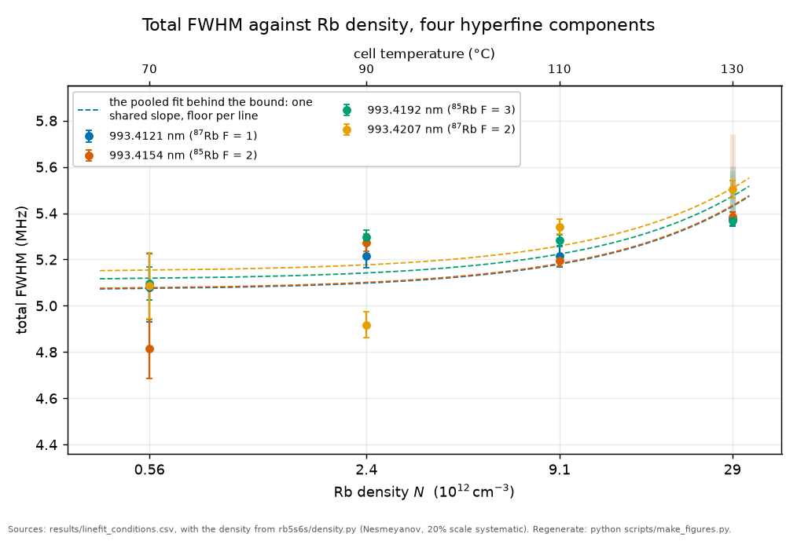
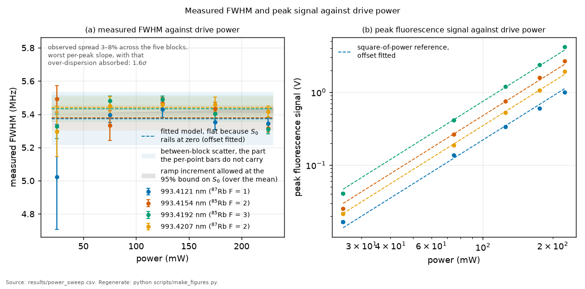
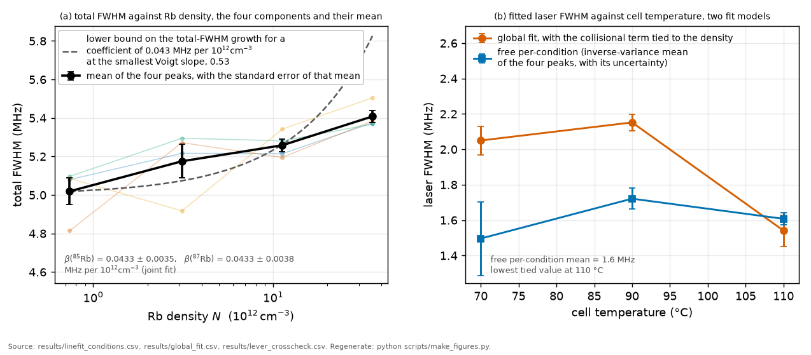

# Claims

What this record establishes, what it deliberately does not claim, and what
a further measurement campaign would convert or add. The bound values quoted
here sit under the same canonical-number guard that checks the front door
against the committed CSVs. Details and derivations:
[RESULTS.md](RESULTS.md) for the numbers, [BIG_PICTURE.md](BIG_PICTURE.md)
for context, [PLAN.md](PLAN.md) for the proposed session,
[PREREGISTRATION_RESULTS.md](PREREGISTRATION_RESULTS.md) for everything
that was withdrawn along the way and why.

**The question.** What does this record claim, what does it refuse to claim,
and what would a further campaign convert?
**Takes.** Nothing, though [BIG_PICTURE.md](BIG_PICTURE.md) supplies the
context each claim sits in.
**Gives.** Every claim with its status and its conditionality, then a section
of things deliberately not claimed, which is the more useful half.
**Skip if.** You are checking one number rather than the claim set, in which
case [RESULTS.md](RESULTS.md) reads it from its producing CSV.

> **Unfamiliar with the vocabulary?** [GLOSSARY.md](GLOSSARY.md)
> explains the measurement in six sentences, then defines every term
> and symbol used anywhere in this repository.

Terms used throughout: S₀ is the peak light shift on the beam axis at a
stated power, the "ramp" is the closed-form distribution of light shifts a
focused beam imprints on a two-photon line, and the transition axis is the
two-photon sum frequency, twice the laser frequency.

## 1. What the 2025 record establishes

**Bounds** (95%, each with its own conditionality stated):

- Collisional self-broadening of the 993 nm line:
  β_self < 0.03-0.05 MHz per 10¹² cm⁻³ across the four hyperfine
  components, from a 52.5-fold density lever at four temperatures. This is
  the model-independent construction: it does not lean
  on the beam waist, and the 20% density-scale systematic is applied in
  the direction that raises the bound, since the cold-spot direction of
  the vapour-pressure spread makes the fitted β an underestimate. The
  fitted collisional width grows only 1.47
  times across that 52.5-fold span, so it is read as a floor, not as
  resolved collisions, and that observation is what licenses the bound
  framing. The hierarchical cross-check quoted beside it carries a measured
  model-form systematic the section-2 kernel entry states: the laser-kernel
  choice moves the hierarchical coefficient by 45 to 67 per cent, while this
  slope construction does not lean on the kernel.
- Light shift at the campaign maximum of 225 mW:
  S₀(225 mW) < 0.26 MHz, from a joint three-session fit of every point
  of every power profile, minimum consistent with zero shift. **The
  disposition of a subset of this bound had been under review** because
  rerunning the construction on 2026-08-14 moved a subset bound by about a
  third, and the cause was identified on 2026-08-20: the inputs were not
  byte-identical, since one commit regenerated the committed ruler CSVs while
  renaming a vocabulary, shifting fitted rates in their eleventh digit and
  moving a discrete trim boundary so that five more samples enter the fit.
  The primary bound above is unaffected, and how much of the reported
  movement five samples account for is being measured. [RESULTS.md](RESULTS.md) carries the
  measurement and the open options. The bound
  depends on the waist only weakly, through the transit kernel in its
  lineshape. The prediction it is compared against rides the waist
  measurement directly: 0.36 MHz
  central, with a 0.32-0.40 MHz band over the waist measurement band and the
  retro ratio (the values under this record's own differential
  polarizability, taken as the package's on 2026-08-25. Under the cited
  Orson figure they were 0.35 and 0.30-0.38, and the exclusion holds
  either way). The predicted coefficient lies above the 95% limit at
  roughly the two-sigma level (delta chi-square about 4), an exclusion
  with little margin, and the most conservative data subset's
  bound rises marginally above the central prediction (0.366 against
  0.348), so it excludes none of it. The constraint lands on the
  (Δα, intensity) pair, that is, on the product the light shift actually
  measures, rather than on either factor alone.
- The 2025 laser linewidth: below 1.2 MHz per photon, equivalently 2.4 MHz on
  the transition axis, at the accepted lineage waist,
  rising with the waist. The per-block fitted values, 1.75 to 2.15 MHz
  on the transition axis, are preliminary: their block-to-block
  variation is partly the collision-laser degeneracy rather than
  resolved laser physics, and they are quoted as the working range, not
  as a result.
- The ramp asymmetry: the skew channel sits below the noise floor at the
  campaign maximum of 225 mW, so what the record carries is an upper
  bound consistent with zero rather than a quoted interval. The centroid
  pull is a separate channel, and every scan carrying a free centre
  absorbs the first-order shift, which leaves the pull uninformative
  about S₀ in the 2025 data by construction.

*The evidence behind the first bound. The density rises 52.5-fold across the
four temperatures while the total width plotted here rises by at most
12 per cent on any one component. The fitted collisional part of that total
rises 1.47-fold over the same range, which fig6 draws, and between them that is
what makes the collisional coefficient a bound and a floor rather than a
resolved slope. The density axis is logarithmic, and the four oven settings happen to
fall at nearly equal spacing on it, which reads as categorical unless the scale
is stated. It also carries a 20 per cent scale systematic from the
vapour-pressure model, the largest single uncertainty on the figure, and it is
common to every point, so it slides the abscissa bodily. The 6S natural width
is 3.49 MHz, below the bottom of the ordinate, so most of the width shown here
is instrumental. The pale vertical band at 130 °C is the spread over the five
drive powers measured at that temperature. The absolute widths ride the beam
waist, a lineage measurement that this campaign did not re-measure, so a
smaller waist would lower every point together.*

*Where the light-shift bound comes from, and where it does not. No power trend
survives the between-block scatter in these summary widths, which is why the
bound is taken from a joint fit over every point of every profile instead. The
point-to-point scatter in panel (a) is 3 to 8 per cent, above the 2 per cent or
less that a light-shift gradient alone would produce, and the remainder is
scatter between blocks. The widths are measured directly off each trace, not
taken from the joint per-condition fit whose fitted totals fig10 draws, and the
two estimators are not compared point by point. In panel (b) each dashed line is
the square-of-power rate law with only its offset fitted to its own component,
so it is a reference of fixed slope rather than a fit to the amplitudes.*

*Two readings of the same fits. Panel (a) averages the four components and
prints the two isotopic coefficients, which differ by 0.0000 MHz per
10¹² cm⁻³ against a combined uncertainty of 0.0064, so this data does not
separate the isotopes. The pooled width grows with density while the individual
components scatter non-monotonically within their own uncertainties, which is
the whole reason for pooling them. The dashed line is not a fit either: it is the
smallest total-width growth there would be if the coefficient printed beside it
were linear in density, evaluated at the smallest Voigt slope, so a pooled trend
falling below it is what makes the coefficient lever-dependent. Panel (b) shows
the fitted laser width moving with the choice of model rather than with
temperature, which is why the per-block laser widths are quoted as a working
range and not as a result. Fitting each condition freely gives a flat 1.6 MHz
within the plotted uncertainties. Tying the collisional term to the density
instead forces the laser width down to its lowest value at 110 °C, and that is
the trade-off between the two widths inside the fit rather than a change in the
laser. The density axis is logarithmic and carries the same 20 per cent scale
systematic as fig1.*

**Nulls and scaling laws:**

- No power trend in the linewidth at fixed temperature, against 3-8%
  between-block scatter.
- The two-photon amplitude scales approximately as P² at fixed density
  (log-log slopes 1.83-2.12) and linearly with density at fixed power
  (slopes 0.85-1.02). **The power law is not claimed exactly: corrected
  2026-08-18.** Three of the four campaign slopes exclude 2 under a block
  bootstrap that respects this sweep's power-time collinearity, the departure
  replicates in an independent session whose ladders ran in alternating
  directions, and it is invariant under that direction, so it is not an
  artefact of acquisition order. Its ordering across lines follows their
  brightness rather than their hyperfine branching, which makes it a
  detection signature rather than a property of the transition, and its
  absolute level shifts between sessions with no attributed cause. What is
  claimed is that the amplitude follows the two-photon rate law to within a
  few per cent in the exponent, not that it follows it exactly.

**Bounded rather than assumed** (ENVELOPE, computed 2026-08-10):

- The radiation environment is audited on all three channels a photon
  can act through here, not only the detected one. Trapped light on the
  two infrared cascade legs cannot re-excite inside the driven column,
  where both lines are inverted by about five, and re-excites in the
  halo outside it at 1.07 per cent of the primary rate at 130 °C, with a
  0.49 to 1.85 band over the standoff range the record brackets, and at
  nothing by 70 °C. The cell's own thermal field drives those same legs
  at 1e-12 of that, because it peaks near 7 µm while the cascade lies
  below 3 µm, and its largest channel is a two-parts-per-million
  transfer at 2.7 µm. Both are amplitude effects rather than lineshape
  effects, so they bear on the amplitude-against-density comparisons and
  not on the widths. The thermal field also shifts the transition by
  79.9 to 161.0 Hz across the sweep, a converged principal value through
  the 6S to 6P poles, which no width-derived number can see
  ([methods 4](methods/04_the_composite_model.md),
  `results/blackbody_channels.csv`).
- The shared transit width between the isotopes costs 11.4 kHz at
  130 °C, and almost all of it is a constant offset that the free
  per-line core width absorbs. What reaches the collisional coefficient
  is 0.41 per cent of one standard error on the measured difference
  between the isotopes, so the shared width is an approximation whose
  cost is measured rather than an assumption
  ([methods 2](methods/02_the_lineshape.md)).

**Calculated** (anchored, not fitted to this data):

- Differential polarizability Δα(993 nm) recomputed at −1145 a.u.,
  opposite in sign to the published computation it is compared against,
  with the magnitudes agreeing to about 5%. The sign rests on the
  measured 6S lifetime: the published sign would require 9.9 ns against
  the measured 45.57(17) ns, an exclusion at about 210 sigma, with the
  measured static polarizability and tune-out anchoring the 5S side.
  The disagreement is established as real rather than a convention
  artifact. Which side is right remains open until an external
  adjudication.
- The first scalar magic wavelengths for the 5S-6S pair, near 1203.9,
  1287.9 and 1339.6 nm, the 1204 nm crossing being the practically
  usable one. Its 16 to 84 percent band runs 1203.06 to 1204.73 nm. No
  published values were found to the depth searched. The trap-design
  corrections at the crossings are calculated to within a factor of
  two in rb5s6s/hyperpolarizability.py: the fourth-order differential
  shift at the 1203.9 nm crossing is +0.87 Hz per megahertz squared
  of trap depth, the vector shift is 280 kHz per megahertz of depth
  per unit circularity, and trap-photon scattering disqualifies every
  pole-adjacent crossing, which fixes 1203.9 nm as the single design
  point.

**Method:**

- The lineshape-as-shift-map frame is not new: it is the 1980
  multifrequency-field review of Delone, Kovarskii, Masalov and
  Perel'man, and this record's core relation reduces exactly to their
  Eq. (5.3). What this record adds is the closure of that frame for a
  focused beam, where the shift distribution is fixed by geometry
  rather than by unknown field statistics: a closed-form distribution,
  analytic cumulants on bounded support, and a third cumulant that a
  drifting lock cannot corrupt. That channel is why a dataset with no
  usable line centres constrains anything at all.
- A self-calibrating frequency axis: an EOM comb acquired as its own
  bracketing traces in every block, so the axis is calibrated per block
  under a drifting lock, and the tooth spacing is proved exact by a
  velocity-symmetry argument.
- A validation discipline: model ladder, identifiability profiles,
  coverage tested on synthetic truth, and a preregistered audit trail
  in which thirty dated addenda record every claim that was
  withdrawn, corrected, or downgraded, including the local minimum retraction
  of this record's own headline light-shift bound.

## 2. What is not claimed

- No environmental coefficient of the 993 nm line is measured here.
  The coefficients are bounds, and the collisional floor is not read as
  a detection of Rb-Rb collisions.
- **No claim that the laser broadening is Gaussian, and the assumption is now
  MEASURED rather than unquantified** (updated 2026-08-21: the earlier form of
  this entry said the size was unquantified and that the data do not settle
  it, and both halves changed). Every lineshape in this record convolves the
  natural Lorentzian with a gaussian kernel for the laser, which is what slow
  frequency noise produces. Fast noise produces a lorentzian laser line
  instead, and a Lorentzian laser width enters the fixed-condition model only
  through its sum with the collisional width, so the kernel choice is a bias
  channel on $\beta_\text{self}$ and not only a modelling preference. Its
  size is measured: switching the kernel moves the hierarchical
  $\beta_\text{self}$ by 45 to 67 per cent, nine to eighteen sigma on the
  quoted statistical error (`results/kernel_headline.csv`). The headline
  slope bound above does not lean on the kernel and is unaffected. What the
  line itself settles, and what it does not: the pure-Lorentzian model is
  nested inside the Gaussian one, so a win-count comparison carries no
  information, and the nested likelihood ratio (median $\Delta\chi^2 = 232$
  for one parameter at its boundary, `results/laser_kernel.csv`) excludes a
  purely Lorentzian laser contribution at 26 of 32 conditions above three
  sigma while leaving the Lorentzian content between the end-members unmeasured.
  The identifiable spectroscopic object is $\Gamma_{L,\text{equiv}}$, a width
  in MHz, and a fraction would need an independent laser total. The M8 cusp
  comparison ($\Delta\text{BIC}$ of -0.1 to +3.7) is unchanged and is about
  the transit kernel, a separate question. The laser's frequency-noise
  spectrum is still measured nowhere (the M1 law is detection noise, a
  different quantity), and the M2 stage-4b limit still leans against the
  Gaussian's justification, so the kernel is tested at one end-member and open in between. Three routes to the content exist and none has been run: the lock's own
  error signal, which costs no cell time, a fast-scan comb block, where at ten
  times the 2025 sweep rate the tooth clock of M2 stage 4b samples at 68 Hz,
  inside the 24 Hz to 1.5 MHz band the ordinary-rate science blocks' widths
  integrate, so one fast block measures in situ part of the noise that
  broadened the slow blocks' lines and separates the slow-noise reading (an
  excursion near 180 kHz) from the fast-noise one (near 4 kHz) against a
  96 kHz tooth resolution
  ([plan chapter 7](plan/07_acquisition-settings.md), the menu), and an
  independent laser-shape measurement at the nanofibre
  ([the sized candidate](notes/onf_candidate.md), whose joint forecast in
  `results/kernel_identifiability.csv` computes what each route is worth to
  the coefficient).
  **What changed on 2026-08-21, and what did not.** The mixed G+L kernel is
  now shipped rather than living in a script, so the question can be put to
  the estimator directly, and two facts were measured that the entry above
  could only assert. First, at a fixed condition $\Gamma_{L,\text{equiv}}$ is
  exactly unidentifiable alongside the collisional width: over six injected
  values the recovered sum tracks the true sum to about one part in a
  thousand while the split is arbitrary. That is the continuum identity, not
  a limitation of the fit, and a well-determined split there would be the
  discretisation artefact this record removed. Second, the density ladder
  separates them, because the collisional width scales with $N(T)$ and a
  laser width does not: injecting 0.600 MHz on the narrow 110 to 130 C ladder
  the archive already has returns 0.599 with a spread of 0.013 over four
  seeds, with $\beta_\text{self}$ unbiased beside it. So the identifiable
  object is a multi-condition quantity, and its uncertainty is set by how far
  the ladder separates it from the coefficient rather than by any single
  condition's statistics.
  Five hostile worlds at 500 preregistered trials each
  (`results/kernel_worlds.csv`) then asked whether the estimator manufactures
  such a width. Against a true zero **no trial in 500 crossed the detection
  threshold**, and the same held when the data carry a quadratic baseline the
  linear model cannot absorb and when they carry a transit kernel of the wrong
  functional form. Zero events is not a rate: 0 of 500 gives a one-sided
  95 per cent upper bound near 0.6 per cent, **per world**, and the three
  zero-truth worlds are bounded separately rather than pooled. The exact-symmetry world, which tests the instrument rather than the
  model, finds the profile invariant to 0.000e+00 when a fixed total
  Lorentzian width is re-split. The interval coverage against a true mixed
  kernel is 0.7460 where 0.68 is nominal, so the intervals OVER-cover and any
  quoted interval is recalibrated against that measured number rather than
  read as nominal. None of this attributes the width to the laser: that arrow
  is licensed by the transfer triangle and by nothing here.
  **What the existing comb bound settles, and what it does not** .
  The committed 28.3 kHz limit was taken at the campaign scan rate, so its
  clock averages at 6.8 Hz, below the band the scanned widths integrate, and
  converting an excursion at one averaging time into a linewidth needs a noise
  type measured nowhere. Granting the most favourable type, that bound permits
  a width some 1800 times the one measured, so it does not constrain the kernel
  (`results/kernel_k5.csv`). That is a statement about the measurement already
  taken. It is not an argument against the fast block above, which samples a
  different band by design, and an earlier version of this entry wrongly
  generalised the one into the other.
- No claim that the light-shift bounds are tight. They are known to be
  conservative by a measured factor rather than by argument, because two
  effects carry the same square-of-power signature as the ramp and were
  absent from the forward model that produced them, atomic saturation and
  hyperfine pumping through the real cascade. Injecting the saturation
  term and re-profiling tightens the width-only bound by 2.8 and the
  joint bound by 2.21. Neither committed bound is moved, because the
  injected law is the two-level homogeneous form used with a two-photon
  Rabi frequency, which is standard practice and not a derivation for
  this level structure
  ([docs/notes/two_photon_saturation_companion.md](notes/two_photon_saturation_companion.md)).
- No bound on the size of the hyperfine-pumping companion, and none is
  obtainable from this dataset. The construction that would separate it
  from the other two, a joint fit over the four lines with the branching
  fractions held fixed and one free scale, was preregistered and run. It
  returns nothing, because that scale enters only as a multiple of the
  light shift and this record bounds the light shift rather than
  measuring it, so the fit switches the companion off and reports the
  same chi-squared at every scale. The precondition for spending the
  per-line lever is therefore a positive detection of the shift, not a
  smaller block scatter
  ([the refit's postscript](notes/companion_inclusive_refit_prereg.md)).
- No claim on the line centre. The channel that would read the shift
  directly off the peak position is closed for this dataset and the
  closure is quantified rather than asserted, because the campaign ran
  its powers in monotonic order, the campaign-morning session's own
  frame moves with power at nine times the statistical error, and the
  4 July evening session has no mirror pair to calibrate against.
  Reopening it needs a ramp-monitor export and not a better estimator
  ([docs/notes/centre_channel_cannot_be_revived.md](notes/centre_channel_cannot_be_revived.md)).
- No claim that 993 nm competes with the 778 nm two-photon reference.
  On natural linewidth it starts an order of magnitude behind.
- No claim to the lineshape frame itself, which is 1980 review
  material. The claim is the geometric closure and its cumulants.
- No claim that the projected precisions of section 3 are results. They
  are the reach of a design under assumptions stated row by row in
  [results/projections.csv](../results/projections.csv), and the largest
  of those assumptions, the cold-spot lag on the density and the
  fourfold cut in block scatter, are the ones a session would have to
  earn rather than inherit.
- No independent calculation of the 5D differential polarizability. The
  778 nm value section 3 quotes is anchored on a published magic
  wavelength and shaped by one near-resonant term, scalar only, so it
  sizes a drive-power ceiling and does not stand as a polarizability.
- No measured trap-design coefficient. At the magic crossings the
  fourth-order and vector shifts are calculated to within a factor of
  two, and the scattering rate to the same margin except at the two
  crossings near 1030 nm, where the upward channels make it a lower
  bound. The contributions from higher even-parity states and from the
  two-photon continuum are carried at order of magnitude only.
- No claim that the multi-line projections of section 3 hold at the
  dataset's own drive power on every rung. Two of the three ceil below
  it, and the delivered precisions are quoted at both readings.
- No temperature and no retro ratio measured from the Doppler pedestal
  here. The 2025 windows are a tenth of the pedestal width, so the
  dataset holds a flat offset and not a shape, and section 3's pedestal
  figures are projections for a wide scan nobody has taken.

## 3. What another campaign would convert or add

Everything in this section is proposed, not scheduled. Verbs are
conditional on the sessions happening. Each figure below is a
projection, not a result. They are computed in
[scripts/run_projections.py](../scripts/run_projections.py) from the
dataset's own measured precision and the session parameters
[PLAN.md](PLAN.md) states, and every one of them travels with its
assumption set in [results/projections.csv](../results/projections.csv).

**A beam-profile measurement alone** (knife-edge or camera, no physics
run) would collapse the transit-laser degeneracy, sharpen the
waist-conditional statements in place, and put the laser-width range on
a measured geometry. It is the cheapest single improvement to the
existing record, specified in [PLAN.md](PLAN.md). Combined with the
differential transit width of [PLAN.md](PLAN.md) §5, the projection is
an intensity axis good to about 15 percent, which is then the floor
under every absolute coefficient below, conditional on the knife-edge
and the camera agreeing with the transit difference before any
coefficient is quoted in physical units.

**A fixed-lock cell session** (the specified follow-up, [PLAN.md](PLAN.md))
would add:

- The first measured AC-Stark coefficient of the 993 nm line, from the
  centre pull that the 2025 drift erased. With the waist also measured,
  that would split the (Δα, intensity) pair and let the experiment
  adjudicate the sign-disputed polarizability. The projection, on one
  morning of randomized power cycling with the four lines interleaved,
  is 0.09 MHz on S₀(225 mW), which would detect a shift of the predicted
  size at 3.8 sigma and separate the two disputed polarizability signs at
  8 sigma if the shift is that size, conditional on the lock holding to
  the dataset's own held-lock BOUND, of order 0.02 MHz/min with the sign
  undetermined, rather than to any borrowed cavity figure. That bound is what
  the record defends: the directional 0.016 MHz/min reading was retracted on
  2026-07-30 (see [DATA.md](DATA.md)'s provenance note), so this condition is
  stated against a limit and not against a measured rate. Which sign the pull has needs no intensity calibration
  at all. How far apart the two signs sit does, since a common scale
  error moves both predictions together. One hour rather than one morning
  halves that reach to 1.9 sigma, so the morning is what the conversion
  needs.
- The first measured collisional self-shift, from the same centre
  channel across density.
- β_self as a measurement rather than a bound, from same-session
  150-170 °C points interleaved against the block scatter that
  co-limits the dataset's density lever. The projection, on five
  temperature blocks per peak reaching 170 °C with the block scatter
  cut fourfold, is the expected 3.4 kHz per 10¹² cm⁻³ rate resolved
  at about 10 sigma,
  and 3 sigma if the block scatter is not cut, so the interleaving and
  the temperature reach are co-limiting rather than one refining the
  other. Resolving the rate is not the same as knowing it: the
  20 percent density scale would leave the coefficient itself known to
  about 22 percent until the absorption channel of [PLAN.md](PLAN.md) §8
  measures the density directly.
- A demonstration of the drift-immune third-cumulant readout, under a
  named condition: the ramp asymmetry reaches detection only with the
  small-waist option (a tighter focus raises S₀ about sixteenfold over
  the dataset's 64 µm waist), which
  the plan carries as a second-stage item, and the cumulant's sign
  depends on collection geometry that would have to be measured in the
  same session. The fixed lock alone does not reach this. The size of
  the asymmetry at the tight focus is itself uncertain at the
  factor-of-three level, and for a modelling reason rather than an
  unmeasured input: the square-of-intensity weighting it rests on is a
  weak-field statement, the saturation parameter runs as the fourth
  power of the inverse waist, and re-integrating the moments with the
  saturated weight moves the predicted axial skew at 16 µm from −0.36 to
  −1.07. The sign survives that and the magnitude does not
  ([THEORY_NOTE.md](THEORY_NOTE.md) §2.0a).

  

  *Why the caveat is about the focus rather than the power. The saturation
  parameter carries the two-photon Rabi frequency squared, so it grows as the
  fourth power of the inverse waist while the shift grows only as the second,
  and the weak-field limit is left long before the shift becomes large. The
  dataset's own configuration, on the left of each panel, sits where the two
  treatments agree to a couple of per cent.*

**A tunable-drive campaign (options map, not a plan)**, mapped in
[FUTURE_TRANSITIONS_titsapph.md](FUTURE_TRANSITIONS_titsapph.md): the drive
laser is tunable, so the same machinery would reach other rubidium
two-photon lines. Running it on the 778 nm reference line, where other
groups have already measured the environmental coefficients and the magic
wavelength, would calibrate the method against known values rather than
add a coefficient. Measuring the 760 nm 7S line would re-derive on this
bench the external rate that the expected self-broadening of the 993 nm
line is currently anchored to, and would turn the computed van der Waals
ratio behind that anchor from an input into something the data test.
Across three or more rungs the per-line coefficients would become scaling
laws in the principal quantum number, which discriminate a calculation
more sharply than any single coefficient does.

Three projections size that campaign, each conditional on the dataset's
own per-block width precision and ruler axis carrying over unchanged to
the new line. Separating the two published 7S rates at five sigma needs
37 kHz per mTorr, and the same five-block design that converts β_self
would deliver about 8, so the adjudication has a fourfold margin and is
the one rung whose result is publishable whichever value wins.
Reproducing the 778 nm coefficient would catch a factor-two convention
error, which needs 13 kHz per mTorr against the same 8 delivered, and
would not reach the 2.6 kHz per mTorr a 20 percent method bias needs, so
the calibration rung would test the method's bookkeeping rather than its
accuracy. Placing the magic wavelength to Hamilton's own 5 pm would need
a scan step of 0.045 nm across the 0.18 nm of half span the neighbouring
pole leaves usable, each point good to 8 percent of the shift at the edge
of that span,
and it would need the perturbing beam mode matched to the drive before
the closed-form shift distribution applies at all.

Those three projections assume the drive can run at the dataset's own
225 mW, and on two of the three rungs it cannot. The differential
polarizability that sets the light shift is 1145 atomic units at
993 nm, 4372 at 760 nm and about 28600 at 778 nm, so the power at
which the shift stops being a correction to the width and becomes a
feature of the lineshape differs by a factor of twenty-five across the
ladder. Reading that ceiling as the power where the on-axis shift
reaches one tenth of the measured width, at the dataset's own waist
and retro ratio, gives the 993 nm ceiling of 332 mW, the 760 nm
ceiling of 87 mW and the 778 nm ceiling of 13 mW. The first sits above
the campaign maximum, so nothing above it changes. The other two do
not, and the two-photon rate falls as the square of the intensity, so
a width precision measured at the dataset's power degrades in
proportion once the drive is capped. On the 7S rung the delivered
precision goes from about 8 to about 18 kHz per mTorr and the
adjudication keeps a ceiling margin of 2.0, which needs no extra
session length, and 6.7 repeats of the five-block design would buy the
uncapped precision back. On the 778 nm rung the delivered precision
goes from about 8 to about 108 kHz per mTorr and the factor-two test
drops to a ceiling margin of 0.12, so the calibration rung loses the
one test it had power for. Recovering that power needs about
66 repeats of the design, and recovering the uncapped precision needs
about 288. All of this is envelope class, conditional on the dataset's
block scatter being signal limited at the ladder maximum, which is the
conservative reading of a scatter averaged over a whole ladder. The
ceiling goes as the square of the waist, so a looser focus raises it
and buys back signal at the cost of transit width and of the density
lever, which is the exchange the 778 nm rung would have to make and which
this projection does not quantify.

For the experimenter choosing a source rather than a line, those
ceilings decide the hardware. At 993 nm the ceiling sits above what
the bench delivers, so the titanium sapphire stays necessary, and the
diode-seeded ytterbium fibre alternative would be working at the
short-wavelength edge of its gain band with a reach this repository
cannot confirm. At 760 nm the ceiling is a third of what the bench
already delivers, so an extended-cavity diode with a tapered amplifier
is enough and the titanium sapphire is not required, although no held
source here states that amplifier's output at this wavelength. At
778 nm the compact-clock community's own architecture, a 1556 nm fibre
amplifier with second-harmonic generation, puts 30 mW on a cell in a
held demonstration, which is 2.3 times the 778 nm ceiling, so the
titanium sapphire is not required there either. Those source figures
are calibration class, conditional on the delivered powers being read
as demonstrated operating points rather than as class maxima.

**A wide-scan add-on**, which costs an acquisition setting and no
hardware. Two photons taken from the same beam drive a two-photon line
that is first-order Doppler broadened, 942 MHz wide on the transition
axis at 130 °C, sitting under the narrow line the record fits. Its
width is a thermometer for the atoms actually in the beam, and its area
against the narrow line's area is 4ρ/(1 + ρ²) in the retro power ratio,
so one wide trace carries both. For everyone using the
density-conditioned numbers, the projection is that stacking wide scans
pins the temperature in about 1.9 hours well enough that the vapour
curve's 22-fold leverage leaves the implied density inside the
20 percent scale systematic it would check, and about 31 hours if only
one hyperfine component's pedestal is fitted rather than the comb of
four. For everyone using the light-shift prediction, the same design
reaches the assumed retro ratio in about 2.1 hours on the comb and about
33 hours on one component, which converts an accepted prior into a
same-trace measurement rather than improving on one. Two conditions
travel with both. The pedestal has to be separated from the
scattered-light background, which the projection does not model, and the
area ratio peaks at ρ equal to one where its slope vanishes, so it is a
weak lever on exactly the quantity it measures. The thermometer measures
the temperature of the atoms in the beam and not the cold spot, so it
pins the temperature the density curve is evaluated at and leaves the
cold-spot lag to the absorption channel. The 2025 dataset cannot do
either measurement, because its own scan window is 85 MHz on the
transition axis, a tenth of the pedestal width, so it samples the
pedestal's flat top and its linear baseline absorbs it.

**A guided-mode extension**, sketched in
[BIG_PICTURE.md](BIG_PICTURE.md) §6 and budgeted in
[notes/guided_mode_two_photon_design.md](notes/guided_mode_two_photon_design.md),
not specified as a session: the same measurement inside a hollow-core
fibre or around a nanofibre, where the intensity distribution is set by
the guided mode rather than by a Gaussian focus. The budget note is
mostly a record of what does not carry over. The closed-form ramp
weight is derived for atoms crossing a focused beam and does not
describe trapped atoms, whose shift distribution is set by their
vibrational energies and carries the opposite skewness. Fluorescence
cannot leave along the fibre at any density that gives signal. The
light shift rather than the available power sets the usable drive. What
does carry over is the operation the record is built on, mapping a
known intensity geometry onto a shift distribution and reading its
cumulants, and one result closes analytically on the new geometry: the
trap's own inhomogeneous shift is set by the atom temperature alone,
with the trap depth and waist cancelling out of it. Two envelope figures
size it. A hot fill would deliver of order 2.8×10⁵ counts per second at
the usable drive power, subject to the note's own unclosed factor of 16
to 47 between the first-principles rate and the dataset's detected
photons, and the light shift rather than the available power would set
that drive power at about 51 mW, which is where the shift reaches the
natural width. None of this family is claimable from the 2025 data.

One further conversion needs no Ti:Sapph time at all. The differential
polarizability of the clock pair has a steep zero crossing at 1297.5 nm,
0.745 nm from the 6S to 7P resonance at the dipole computation's central
inputs (multipole terms below a hundredth of a picometre, the
dipole inputs themselves worth about 75 pm per ten per cent), in the
telecom O band where
stabilized diodes are commodity. An auxiliary beam scanned across that
crossing while the 993 nm lineshape is read gives a null measurement of
the 6S to 7P line's residue at about the 3 per cent level at the projected
campaign shift precision, which is about 1.8 per cent on the reduced
matrix element itself, a sign-reversal test of the
asymmetry channel, and a calibrated shift injector at 3.6 kHz per
picometre. The design and its envelope numbers are section 5.1 of
[FUTURE_TRANSITIONS_titsapph.md](FUTURE_TRANSITIONS_titsapph.md). Not
claimable from the 2025 data, and the crossing is deliberately absent
from the magic-wavelength list, whose criterion is usability as a trap.

The dependency map, which measurement converts which claim, is the first
section of [BIG_PICTURE.md](BIG_PICTURE.md).

## 4. Who this serves, now and after a campaign

Stating the audience is part of stating the claim, so this section names
who has a reason to read the record today and who would gain from each
possible campaign. Section 2 already concedes the complement: nobody is
blocked waiting for these bounds, and this section does not soften that.

**Today, with no new data:**

- Anyone holding a dataset taken against a drifting or absent frequency
  reference. The demonstrated claim is how much physics the lineshape
  alone supports, with the validation machinery to show the extraction
  did not fool itself. The seams for pointing the package at another
  transition are in [ADAPTING.md](ADAPTING.md).
- Atomic-structure theory. The differential-polarizability sign
  disagreement comes with a clean discriminant (the published sign would
  require a 6S lifetime the measurement excludes at about 210 sigma),
  and the scalar magic wavelengths are unpublished values a trapping
  proposal can test, now with the crossing-by-crossing comparison of
  fourth-order shift, vector shift and scattering a trap design
  would start from.
- The collision-rate literature. Two published measurements of the 7S
  self-broadening rate disagree beyond their stated errors under any
  convention reading, a comparison assembled in
  [FUTURE_TRANSITIONS_titsapph.md](FUTURE_TRANSITIONS_titsapph.md).
  Naming an open disagreement is a small contribution, and it is one.
- Guided-mode experiments. The trap-induced inhomogeneous shift closes
  to a rule that depends on atom temperature alone, with the trap depth
  and waist cancelling
  ([notes/guided_mode_two_photon_design.md](notes/guided_mode_two_photon_design.md)).

**After a campaign, by what is run.** Each entry names what the audience
would gain, and section 3 gives the projected precision they would gain
it at, with the condition attached:

- A beam profile alone would sharpen every waist-conditional statement
  in the existing record retroactively. The audience is whoever uses
  the record at all, since it upgrades the record without new physics.
- The 993 nm line under a fixed lock would yield the first measured
  AC-Stark and collisional self-shift coefficients of this transition,
  and with the waist measured it would let experiment adjudicate the
  sign dispute. The audience is the precision-spectroscopy tables and
  the theory groups on either side of that sign.
- The 760 nm 7S line would adjudicate the two conflicting published
  rates with the convention stated, and would re-anchor this record's
  own expected self-broadening from the same instrument. The audience is
  the collision series and the group advancing 7S as a frequency
  standard, and the result is publishable whichever value wins.
- The 778 nm 5D line would calibrate the passive lineshape method
  against the best-measured coefficients in the field, adding no new
  coefficient by design. The audience is anyone deciding whether to
  trust the method on a line where nothing is known. The condition is
  the one section 3 states: at this waist the light shift caps the
  drive at 13 mW, and at that power the calibration needs about seventy
  times the session length before it can catch even a convention error.
  That audience is served by a longer session or a looser focus, not by
  the design as it stands.
- The O-band null at 1297.5 nm would deliver the 6S to 7P residue
  by frequency metrology, at about the 3 per cent level at the projected
  campaign shift precision and about 1.8 per cent on the matrix element
  behind it, in a channel where no measurement exists,
  since a 7P lifetime sums its decay channels and ground-state
  absorption never reaches it. The audience is the all-order
  atomic-structure methods, which run unbenchmarked on
  excited-to-excited channels, and the same dataset would carry the
  sign-reversal test of this record's asymmetry channel. The condition
  is one commodity diode and the fixed-lock session's shift precision,
  with the design and its envelope in
  [FUTURE_TRANSITIONS_titsapph.md](FUTURE_TRANSITIONS_titsapph.md)
  section 5.1.
- Three or more rungs together would turn per-line coefficients into
  scaling laws in the principal quantum number, which discriminate a
  calculation more sharply than any single value. The audience is the
  polarizability and collision theory the single-line results can only
  poke at.
- The wide-scan pedestal rows serve everyone who uses a
  density-conditioned number in this record, which is every collisional
  coefficient and every rate quoted per 10¹² cm⁻³, and separately
  everyone who uses the light-shift prediction, since the retro ratio it
  rides on is accepted here and would become measured. The add-on rides
  on any session that runs at all, so it has no audience of its own to
  justify it.
- The guided-mode family is section 3's last entry, and none of it is
  claimable from the 2025 data.

Each audience above maps to a claim this record either makes now or
names as conditional. Where no audience could be named, the claim is not
in this ledger.
