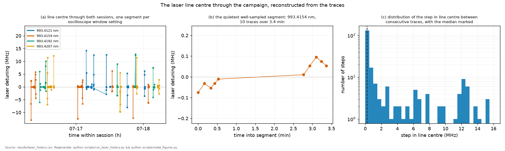

# The 2025 dataset: provenance, decoding, and exclusions

This is the provenance record for the curated traces listed in
[`data_raw/MANIFEST.csv`](../data_raw/MANIFEST.csv): what was acquired, in what
order, on which instrument, what was cut, and on whose authority. Read it
before trusting any number this repository quotes. Every one of them is
denominated in a frequency axis this file explains, and computed on a
population this file bounds.

**The question.** Where did each of the 297 traces come from, what was done to
it, and what was thrown away?
**Takes.** Nothing. This is a starting point, not a conclusion.
**Gives.** The campaign chronology, the meaning of every column of the
manifest, the exclusion register with a reason per file, the frequency ruler,
and the history of every bound that was later corrected.
**Skip if.** You are reading the physics rather than checking it. Come back
here the moment a specific number looks wrong.

> **Unfamiliar with the vocabulary?** [GLOSSARY.md](GLOSSARY.md)
> explains the measurement in six sentences, then defines every term
> and symbol used anywhere in this repository.

| what this is | |
|---|---|
| the measurement | Doppler-free two-photon spectroscopy of the rubidium 5S to 6S transition at 993.4 nm, four hyperfine components, in a hot vapour cell |
| the sessions | four, named by date in section 0: the 24 hour campaign of 17 to 18 July 2025, the campaign-morning session that commissioned the frequency ruler, and two sessions of 4 July 2025. The last three are kept outside the frozen record |
| the census | 297 curated traces in seven roles, 264 of them canonical and 33 excluded with a recorded reason, listed in `MANIFEST.csv` |
| what is in the repository | the manifest of the 297 curated traces, the acquisition clock and every fitted result, in every copy. Whether the traces themselves sit beside the manifest under `data_raw/` depends on the copy, and `data_raw/README.md` says which this one is. The trees that stay outside either copy hold the campaign-morning session and the two sessions of 4 July, and section 3a lists them |

| if you are | your question | where it is answered |
|---|---|---|
| tracing one trace | which file, which condition, which block, and what the record did to it | section 4, which lists every column of the manifest, then section 5 for anything excluded |
| auditing an exclusion | what was cut, when, by whom, under which criterion, and how many | section 5, one row per exclusion class |
| rebuilding the census from a clone | whether the counts regenerate without any private folder | section 4, and `tests/test_manifest.py`, whose file-level re-hash runs in a copy that carries the traces and skips, with a stated reason, in one that does not |
| after data products | which tables exist, what produced each one, and how far each is checked | [`results/README.md`](../results/README.md) and [`data_recovered/README.md`](../data_recovered/README.md), with the folder roles in section 3a |

*The whole record on one axis, before the census that describes it. Three
sittings, every acquisition at its recovered time, the etalon-transient windows
shaded and the 9.6 hour break marked. Section 2 walks it, and the same figure
appears there with the provenance of the clock that dates it.*

**Producers and guards.** The manifest is written by
[`scripts/import_data.py`](../scripts/import_data.py) and pinned by
`tests/test_manifest.py`. Its exclusion reasons are written by
[`scripts/annotate_manifest_qc.py`](../scripts/annotate_manifest_qc.py) and
pinned by `tests/test_manifest_qc.py`. The acquisition clock is
[`data_recovered/CLOCK.csv`](../data_recovered/CLOCK.csv). Every trace in the
dataset is drawn for the eye by
[`scripts/make_qc_gallery.py`](../scripts/make_qc_gallery.py), described in
section 4.

**The sessions, named once, by their dates.** Four measurement sessions stand
behind this repository. Each is named here for when it ran and for what it
measured, because each contributes a result and none of them is a warm-up for
another.

The *campaign* is the 24 hour run of 17 to 18 July 2025, and it is the frozen
record. It holds the 297 curated traces and every result that carries an
absolute number.

The *campaign-morning session* of 17 July 2025 ran the frequency ruler's final
commissioning at 04:18 to 06:33 and then a four-power sweep at 06:54 to 07:11, run 210 then 35, 70 and 105 mW, non-monotone in time unlike the campaign's uniform descent, which is what lets it serve as an independent check on order dependence.
The commissioning is the reason the campaign's frequency axis has a scale, and
the sweep is a second measurement of the power dependence, taken hours before
the campaign's own.

The *4 July evening session* is 50 LeCroy traces taken 22:31 to 01:38 JST,
thirteen days before the campaign, at four peaks and 90/180/270 mW with
`G=10^6`, its ladders run in alternating directions per peak rather than in the campaign's uniform descent, which is the property that makes it evidence about order dependence. It is the only session at an internal 130 °C, and its power dependence
is one of the three arms the joint AC-Stark bound fits together.

The *4 July first trials* are the earliest traces of all, at 03:37 JST that same
day, when the EOM was first put on the beam. They set the origin of the
program's recovered clock.

The three sessions other than the campaign stay outside both copies of the
repository, in two trees that section 3a locates: the campaign-morning session
in one, and the two sessions of 4 July in the other. The
aborted first attempt at the 4154 power sweep is a *preliminary attempt*, and it
sits inside the campaign rather than before it. The manifest names the campaign's
own divisions in its `session` column, in one-letter codes: `P` is the power
session (145 traces), `T` the temperature session (123), and `Q` the preliminary
attempt held in excluded (29).

*The chronology and the identities below were established on 2026-07-10 and
2026-07-11 by hash comparison against the original dataset, with the design
answered directly by the experimenter. The file has been extended since by the
recovered acquisition clock (2026-07-23), the folder consolidation
(2026-07-24), and the ruler re-adjudication of 2026-08-04 and 2026-08-05. Every
later addition carries its own date where it appears.*

## 1. The experiment in one paragraph

Doppler-free two-photon spectroscopy of Rb 5S₁/₂→6S₁/₂ at 993.4 nm in a hot
vapour cell, retro-reflected so that the first-order Doppler shift cancels for
every atom. The detected signal is the 795 nm cascade fluorescence
(6S→5P₁/₂→5S) through 50 dB of 795 nm filtering on a PMT. Four hyperfine
components are labelled by their wavelengths: 4207 (⁸⁷Rb F=2→2), 4192
(⁸⁵Rb F=3→3), 4154 (⁸⁵Rb F=2→2), 4121 (⁸⁷Rb F=1→1).

The laser (M Squared SolsTiS) was scanned slowly across each line. An EOM at
exactly 12.5 MHz was toggled on for separate "ruler" traces, whose two-photon
comb teeth sit 6.25 MHz apart on the laser axis and calibrate the sweep. The
12.5 MHz is confirmed in hardware twice, as the generator setting (Tektronix
AFG31021 at 12.500 000 000 0 MHz) and as the EOM's designed resonance on its
test certificate ([APPARATUS.md](APPARATUS.md) §2).

The 2025 lock was misconfigured. The etalon and reference cavity held, but no
outer loop against an absolute reference was engaged
([APPARATUS.md](APPARATUS.md) §1.1, including its 2026-07-25 correction on what
the control page's "ECD" row actually is. No photograph covers the campaign
itself). Line centres therefore drift between scans and carry no metrological
meaning. Line shapes survive, and they are the whole observable.

*The reason for the paragraph above, and the single most consequential fact
about this dataset. What the record holds is not a slowly wandering frequency
around a stable centre but a sawtooth: the lock is re-centred by hand between
blocks, so an offset means nothing across a step and everything within a run of
traces that share one setting. Every construction in this repository that reads
a position rather than a width is built to live inside those runs, and the ones
that could not be are withdrawn.*

Every trace is 2000 points, 0.5 ms step, 1.000 s window, taken on an
**Agilent/Keysight InfiniiVision dso-x 3054a** (500 MHz, 4 GSa/s). The LeCroy
on the same bench would not trigger reliably (experimenter, 2026-07-23), and
the export signature confirms which instrument wrote the files. Every CSV in
the dataset opens `x-axis,N` and `second,Volt`, which is the InfiniiVision
format and not LeCroy's.

The voltage grid of those files spans 11.86 bits across the signal swing,
which an eight-bit converter cannot write at any record length, so the
scope's High Resolution mode was active throughout. The vertical range that
mode was applied on changed at every rung of the power ladder, by a factor
of 347 in quantisation step across the campaign, and what that costs and
how the next session avoids it is
[the acquisition settings chapter](plan/07_acquisition-settings.md).

## 2. Campaign design and chronology (experimenter-confirmed)

**When.** The whole campaign was acquired in a single run of about **24 hours,
17–18 July 2025**, with the Ti:Sapph **left running throughout**
(experimenter-confirmed, 2026-07-22). Continuous operation matters beyond
provenance: it removes warm-up transients between blocks, and it is the
physical reason a *shared* laser-noise epoch across neighbouring blocks is
plausible at all, which is the assumption `PLAN.md` §10.1 post-mortem row 5 records. The
recovered clock has since dated it rather than settled it: within a
temperature dwell the four peak-blocks are **54–76 minutes apart**, so
"neighbouring" means an hour, and their widths track that hour no better than
chance (r = +0.18, p = 0.6, n = 12, see [RESULTS.md](RESULTS.md) C1). So the
shared-epoch assumption stays untested. The design leaves it untested, not the
missing log, which has since been found.

> **How this section was checked.** It was written from recollection and has
> been public since `9190b0b` (2026-07-13). A backup carrying acquisition
> timestamps surfaced nine days later and was audited under pre-registration,
> whose predictions are taken verbatim from the text below
> ([PREREGISTRATION_timestamps.md](PREREGISTRATION_timestamps.md)).
>
> *Standing, 2026-07-22:* recollection, not yet checked against a clock.
> *Replaced 2026-07-23:* the clock arrived. The audit opened with an
> integrity void at T1 and its predictions unscored, but the clock window was
> confirmed and the JST clock reading was later instrument-validated against
> in-file LeCroy trigger times to seconds (addendum 11,
> [PREREGISTRATION_RESULTS.md](PREREGISTRATION_RESULTS.md)). One sentence
> below is corrected as a result, and the correction is marked where it sits.
> The releases carrying this text were themselves later withdrawn, so its
> provenance rests on commit history rather than on a release object
> ([preregistration §9](PREREGISTRATION_timestamps.md)).

*The program on its recovered clock. Every acquisition in
[`data_recovered/CLOCK.csv`](../data_recovered/CLOCK.csv), drawn by
[`scripts/make_timeline_figure.py`](../scripts/make_timeline_figure.py):
the LeCroy session of 4 July (in-file trigger times), the campaign morning
(ruler commissioning → `Def` → the 0.65 A sweep), and the campaign with its
four power ladders, three temperature dwells, the 9.6 h break, and the
evidence-backed etalon-transient windows shaded (addenda 4–7 and 12, where the
last of which fits the transient itself: one universal re-kick, τ ≈ 97 min,
re-armed at every re-lock).*

Per peak, in time order, all at 130 °C: **before-rulers → 225 → 175 → 125 →
75 → 25 mW → after-rulers** (each power is 5 back-to-back RF-off repeats, and each
ruler block = ~5 back-to-back RF-on repeats). **Corrected 2026-07-23 from the
recovered timestamps: the ladder ran *descending* on all four peaks (order
4192 → 4207 → 4154 → 4121, 23:41 → 05:00 JST overnight 17→18 July). The
original recollection here said ascending, remembered exactly reversed. The
audit's post-hoc pass found the disagreement. Per the pre-registration's §6,
the clock wins and the reversal is reported, not reconciled
([PREREGISTRATION_RESULTS.md](PREREGISTRATION_RESULTS.md)).** After the whole power
session: stepwise cooling **110 → 90 → 70 °C** at 225 mW, each temperature
with its own 5-repeat RF-off block and its own ruler block.
That 225 mW is recollection, not record. The manifest's `power_mW` column is
empty for all 62 `t_sweep` rows, which
[PREREGISTRATION_RESULTS.md](PREREGISTRATION_RESULTS.md) records as never having
been logged, so the cooling blocks' drive power rests on this file alone.

Three sessions precede the campaign, surfaced 2026-07-24 and kept outside the
frozen record: the EOM first trials at 2025-07-04 03:37 JST, then the 50-trace
LeCroy session that evening, at four peaks, 90/180/270 mW, `G=10^6`,
double-temperature notation. Then on the campaign morning the ruler's final
commissioning 04:18–06:33, `Initial attempts` → `Def`, and a four-power sweep at
06:54–07:11, results report addendum 9. Its files say `91c650ma`, but that
`91 °C` is a **variac set point**, not a cell temperature comparable to the
campaign's dwell labels: the same 0.65 A is what the 4 July evening session
records as an internal 130 °C, and the morning session's amplitude agrees,
sitting ~15× above what an internal-90 °C session would give, addendum 17. Its
linewidth cannot tell the dwells apart either way, which took two attempts to
establish. **Since 2026-08-01 the 4 July evening session is no longer
analysis-untouched:**
`run_stark_joint.py` reads its traces in place from its private tree,
never copying them into the repository, because its 270 mW rung and alternating
ladder directions add leverage the campaign lacks. 46 of the 50 traces enter.
Three are 0xff-corrupted on disk and one has no line in the window. That fit
runs on **three** sessions, not two: 100 canonical campaign `p_sweep` traces,
those 46 traces of the 4 July evening, and the campaign morning's 26, which the
same script reads from a second private tree (`results/stark_joint.csv`, row
`n_traces`).
Those private copies themselves remain read-only and unmodified. The EOM
trial traces, whose folder is labelled `2025-07-03` while the clock reads
2025-07-04 03:37 JST, turned out to carry the **piezo ramp on their second
channel**, recalled by the experimenter and confirmed by the data: the
same line crossed twice near a sweep turnaround reads the same ramp
voltage to 0.1 mV on a 13 mV sweep, and a sideband satellite at a constant
voltage offset calibrates that axis at 5.24 MHz/mV, under which the line
width comes out 5.1 MHz at 80 °C, on the physical budget. The measured
EOM-day scan rate, 0.024 MHz/ms, differs 2.2× from the 4 July evening's fitted
rate, so the two days' scan configurations differ and no calibration
transfers. The full account is in `run_stark_joint.py`.

Repeats were
saved seconds apart (measured position scatter within a block: 1.8 ms ≈
0.08 MHz laser). Between saves the experimenter moved the scope's horizontal
knob and manually recentered the cavity reference **many times**, not
because the held lock drifted fast (the then-current reading was
~0.016 MHz/min, which would take tens of hours to cross the window, and the
provenance note below retracts the number while leaving this conclusion
standing)
but because the cavity lock kept
dropping out during the etalon thermal transient, each recapture landing
MHz-scale off (`APPARATUS.md` §6, results report addenda 4–7), so
**absolute trace positions carry no meaning across saves**, and each trace's comb is its own frequency axis. **Within a 5-repeat block the reference was
usually left alone**, a tendency rather than a protocol
(experimenter-confirmed, 2026-07-22), and the dataset shows the exceptions:
24 of 32 RF-off science blocks scatter about a common position (median
1.79 ms, confirming the figure quoted above), while 8 step mid-block, two of
them by ~1 s, larger than the trace window, so the axis offset itself moved.

> **Provenance note on the ~0.016 MHz/min (2026-07-30).** That figure comes from
> `run_drift_settling.py`'s state-space fit, which compares block-**median** peak
> positions **across** blocks, the same comparison the window-reference retraction showed is
> contaminated by the scope's horizontal setting, since the setting moved 58
> times and the fit frees only the 19 moves above 100 ms. So its provenance is
> exposed, and it has not been re-derived.
>
> It is not contradicted, either. Measured only *within* a display epoch, a run
> of unchanged `window_start_ms`, where the position is a frequency under either
> reading of the licensing question and so needs no correction at all. The two
> longest knob-untouched segments give −0.022 and −0.018 MHz/min, bracketing the
> quoted value. The shorter segments (3–6 min) scatter to ±1.5 MHz/min, which is
> what a 0.27 MHz per-trace scatter produces over such baselines. The dataset
> simply has no long re-centring-free stretch.
>
> *Sharpened 2026-07-30, after recomputing the whole fit in both frames.* Across
> the 16 adjacent-block steps of the power session, RMS Δ(peak position) is
> 145.2 ms while RMS Δ(window setting) is 145.9 ms and RMS Δ(difference) is
> 6.3 ms: **99.8% of the between-block excursion the fit reads as re-centring is
> the horizontal setting.** Recomputed in the other frame, two of the three
> estimators for the settled drift **change sign** (+0.55 ± 0.17 → −0.28 ± 0.16).
> So 0.016 MHz/min is not a measured rate in either direction. The defensible
> statement is a **bound of order 0.02 MHz/min on the laser axis, sign
> undetermined**, which is all the drift-immune argument ever needed, since it
> turns on the rate being small, not on its value or its sign. Full four-way
> table in [PREREGISTRATION_RESULTS](PREREGISTRATION_RESULTS.md), addendum 4.
Within the scatter-like blocks the variation shows no trend with repeat index
($p=0.33$), so it is laser **jitter**, not accumulated drift
(`scripts/run_intrablock_trend.py`,
[PREREGISTRATION_timestamps.md](PREREGISTRATION_timestamps.md) §8.4).

Consequence for the collisional analysis: temperature is monotonic with time
across the whole campaign (130 °C first … 70 °C last), so ordering alone
cannot separate density effects from slow instrument drift. The plan's
opposite-order temperature grid (PLAN.md §7a, §10.3) exists precisely for this.

## 3. What the hash comparison established

The original `data/` tree holds 722 CSVs in six directories with ~2×
duplication (367 unique basenames, fewer unique MD5s). Key identities, all
byte-exact:

1. **`temperature/*_130c{1..5}` ≡ `power*/*_225mw{1..5}`** (all 20 files):
   the temperature sweep's 130 °C point *is* the power sweep's 225 mW point.
   Fresh temperature acquisitions exist only for 70/90/110 °C.
2. **`temperature_EOM/*_eom_130c{1..12}` ≡ pooled `power_eom` brackets**
   (`after{...}` first, then `before{...}`): there are no separate 130 °C
   rulers. The pooled files are renames of the power-session bracket rulers.
   For 4154 the pooled set is the **underscore** re-take
   (`eom_before_`/`eom_after_`), which is therefore the canonical 4154
   bracket set.
3. **Double-saves, including inside the curated dirs.** Same-bytes-two-names
   pairs: `temperature/4154nm_070c1 ≡ 070c2` (so 4154@70 °C has only **4
   unique curated repeats**, and the old N=5 filename counting was
   pseudo-replication), `temperature_EOM/4192nm_eom_090c3 ≡ 090c4`,
   `power_eom/4192nm_eom_after3 ≡ after4`, `raw/4154nm_130c_225mw4 ≡ 225mw5`.
   **Rule: always count repeats from manifest rows, never from filenames.**
4. **The curated dirs are a deliberate selection, and `raw/` is everything.**
   The experimenter discarded some acquisitions at curation time because they
   "seemed quite bad" (statement, 2026-07-11) and renumbered the keepers,
   that is why `raw/`'s repeat numbering is shifted vs the curated dirs
   (e.g. `temperature/4207nm_090c1 ≡ raw/4207nm_090c6`) and why four
   raw-only traces exist. They live under `data_raw/discarded/` with
   `flag=discarded`. One of them is a 5th distinct shot for 4154@70 °C, so
   that condition runs on **N=4**. **Policy: discarded traces never enter
   headline fits.** The selection was made at curation time, blind to any
   fitted physics, so honoring it cannot bias results. The objective quality control
   is additionally run on them as a consistency check on the curation
   (reported in an appendix). **Since 2026-07-23 that check is quantitative
   and no longer rests on timing alone:** these four, plus sixteen further
   discarded acquisitions recovered from the backup (published under
   `data_recovered/discarded_backup/` since 2026-07-24), sit
   inside their conditions' kept spread in linewidth, the quantity the fits
   use, with one boundary case smaller than the width metric's own
   quantisation
   ([PREREGISTRATION_RESULTS.md](PREREGISTRATION_RESULTS.md) addendum 3). Chronology: curated indices are chronological
   among the kept traces. Where finer ordering matters, the raw-index
   aliases in `source_paths` are the better guide (small known exceptions,
   e.g. 4207@90 °C).

5. **InfiniiVision export quirks (found at first strict-parse contact, 2026-07-11).**
   (i) ~180 files contain 1–4 "time-without-voltage" rows at the window
   edges (a benign export artifact, and the loader drops and counts them).
   (ii) `rulers_t/4192nm_eom_070c3.csv` is dropout-riddled: ~950 *interior*
   empty rows, only 1047 valid samples, hard-flagged and excluded from ruler
   pooling. (iii) `p_sweep/4192nm_225mw1.csv` is a nonstandard export
   **and a recoverable one: the recovered backup holds its pristine
   full-precision original (uniform time axis, 0 duplicate timestamps vs
   799 in the analysed copy). Substituting it shifts this condition's
   γ_coll by 0.07σ and the peak's β_self slope by 0.03σ, so the handling
   below is adequate and nothing was re-issued. See
   [PREREGISTRATION_RESULTS.md](PREREGISTRATION_RESULTS.md) addendum 2.
   The full degradation lineage, from acquisition 2025-07-17, degraded
   re-export 2025-08-16 (post-campaign processing), analysed bytes = the
   2025-08-16 22:15 intermediate modulo line endings, closed with a second
   source folder on 2026-07-24 (addendum 8)**
   (stray header `jj,nj`, and a time column printed at 3 significant figures so
   0.5 ms steps alias to duplicate timestamps) whose *content* is healthy.
   the loader rebuilds its time axis from the row index and records the
   salvage. The old pipeline's `genfromtxt`+NaN-drop parsing swallowed all
   of this silently.

> **The temperature notation, resolved 2026-07-25 (experimenter).** In
> filenames of the form `130C(90C-0.65A)` the parenthetical is the **variac
> set point and current**, its thermocouple mounted on the aluminium foil on
> the *outside* of the oven. The campaign temperature is the value outside
> the parentheses, read from **four thermocouples inside the oven**. So the
> quoted temperatures are internal readings, but an internal thermocouple is
> still not the cold spot that sets the density. Results report addendum 15
> gives that offset its first empirical handle (Δ ≈ 0–30 K, face value ~20 K),
> and `PLAN.md` §8 item 3 is the measurement that would settle it.

## 3a. The folders of record (consolidated 2026-07-24)

One dataset, several folders with different jobs. Collisions between them
are real (nine names, different bytes), so identity is **always by content
hash**:

| where | what | status |
|---|---|---|
| `data_raw/` (this repo) | the frozen analysis record: MANIFEST.csv in every copy, and the 297 curated traces in the copy that carries them. Every fitted number regenerates from the traces. | **frozen**, never edited |
| `data_recovered/` (this repo) | the backup-recovered layer: `CLOCK.csv` (the acquisition clock, hash→mtime for all 438 backup files), the 16 backup-only discards, the 4-variant lineage of the one degraded trace. See its README. | additive only |
| release asset `raw-backup-2026-07-24` | the complete timestamped backup tree, verbatim (`tar.gz` preserving mtimes, sha256 in the release notes and addendum 10), covering all four sessions | preserved public record |
| Desktop `RawDataBackUp` (private) | the provenance root, as found | never touched |
| `~/Documents/*_QUARANTINE_*` (private) | read-only working copies the audit ran on, still carrying the folder names they were given in 2026-07. Two of them, the 4 July tree and the campaign-morning tree, are also read in place by `run_stark_joint.py` as the second and third sessions of the joint light-shift fit | never modified |
| `private/qc_gallery/` (this repo, untracked) | the per-condition inspection panels of §4, rebuilt on demand from `data_raw/` | regenerated, never cited |

The drift analysis (`run_drift_settling.py`) reads `CLOCK.csv`, so a clone
reproduces the clock-dependent results without any private folder.

For what each data product is and what produced it,
[`results/README.md`](../results/README.md) carries the fitted products and
[`data_recovered/README.md`](../data_recovered/README.md) carries the recovered
layer.

## 4. Roles and counts in `data_raw/`

| Folder | Content | Count |
|---|---|---|
| `t_sweep/` | RF-off lines, 70/90/110 °C × 4 peaks × 5 repeats | 59 (4154@70 °C has 4, §3) |
| `p_sweep/` | RF-off lines, 130 °C, 5 powers × 4 peaks × 5 repeats. 225 mW rows carry `serves_t130=True` | 100 |
| `rulers_t/` | RF-on comb traces per temperature block | 61 |
| `rulers_p/` | RF-on bracket blocks (`before`/`after`) per peak | 44 |
| `excluded/` | the aborted 4154 power attempt + its plausible rulers (§5) | 29 |
| `discarded/` | shots the experimenter rejected at curation (§3, item 4) | 4 |
| `review/` | anything that failed pattern classification | 0 |

Total: **297 unique traces** (from 722 dataset files). The census is pinned by
`tests/test_manifest.py`, whose file-level re-hash runs on the full battery in
a copy that carries the traces and skips, with a stated reason, in one that
does not.

The `flag` column takes values `canonical` / `discarded` / `excluded` /
`review`, and §5 is the register of every exclusion behind them.

**Every column of the manifest.** Sixteen, in file order. This is the table the
analyst tracing one trace needs.

| column | what it holds |
|---|---|
| `file` | the path inside `data_raw/` |
| `md5` | the content hash, which is the identity. Names collide across folders, bytes do not |
| `role` | the acquisition role, one of `p_sweep` (101), `t_sweep` (62), `ruler_t` (61), `ruler_p` (44), `excluded` (29). There is no `discarded` or `review` value: a discard keeps the role of the folder it came from, which is why these five counts exceed the folder counts above by exactly the four discards |
| `peak` | the hyperfine component, by its wavelength label |
| `temperature_C` | the cell temperature, read from the four thermocouples inside the oven |
| `power_mW` | the drive power where the record carries one |
| `rf_on` | whether the modulator was driven, which is what separates a ruler from a line |
| `bracket` | `before` or `after`, for the power-session ruler brackets |
| `repeat_idx` | position within the repeat block, which is the time order |
| `serves_t130` | marks the 225 mW rows that double as the 130 °C density point |
| `flag` | the status: `canonical`, `discarded`, `excluded` or `review` |
| `session` | which acquisition session the trace belongs to, `P`, `T` or `Q`, decoded in the glossary above |
| `block_seq` | the block's position within its session |
| `n_source_copies` | how many names in the original tree carry these bytes |
| `source_paths` | those names, which are the chronology aliases of §3 item 4 |
| `qc_reason` | why a non-canonical row is non-canonical, in the terms §5 sets out. Empty on canonical rows |

`file` is also the join key out of the manifest. The same path indexes
[`results/qc_metrics.csv`](../results/qc_metrics.csv), which carries each
trace's quality-control metrics, its hard flags and any trim applied to it, and
[`results/ruler_traces.csv`](../results/ruler_traces.csv), which carries each
comb's fitted spacing, its labelling verdict and any renumbering. Both are
committed, so a clone can follow one trace from its bytes to its fitted record.

**The inspection instrument.** Every trace in the dataset is drawn once by
[`scripts/make_qc_gallery.py`](../scripts/make_qc_gallery.py), regenerated with
`python scripts/make_qc_gallery.py`. The unit of presentation is the condition:
one page per condition, every repeat of it as a row, on one shared vertical
scale for the whole page. That shared scale is the point, because the job the
gallery does is judging whether repeats agree, and a page whose rows each
auto-scale cannot answer it. Each row carries the signal with the drawn model
and the residual standardised by the error the fit weighted each sample with.
Since 2026-08-05 each page also marks the fitted window with a dashed vertical
at each edge, so a reader can see which samples the fit was asked about. Comb
pages add a tooth-order axis and that trace's fitted tooth heights.

The gallery exists because the tooth-indexing defect of §7 was found by looking
at a picture rather than by reading a number, and nothing else in this pipeline
draws the other 296 traces. It is an audit instrument, not a citable figure
set: it carries no data fingerprint and it gates nothing.

The panels themselves are not committed. They are written under
`private/qc_gallery/`, which is untracked and absent from a clone, because they
are an audit surface rather than a citable product and because they are bulky.
Rebuilding them takes nothing private.
[`scripts/make_qc_gallery.py`](../scripts/make_qc_gallery.py) reads the tracked
`data_raw/`, so a clone regenerates the whole gallery from the repository alone.

## 5. The exclusion register

Every exclusion in this dataset is recorded here the same way: what was cut and
how many, when the decision was taken, on whose authority, under which named
criterion, and what it changes downstream. Counts trace to one of three places:
`MANIFEST.csv`, which is machine-readable, the amendment of
[the ruler specification](notes/ruler_validity_and_trim_prereg.md) named in the
row, or
[`data_recovered/RECOVERED_MANIFEST.csv`](../data_recovered/RECOVERED_MANIFEST.csv)
for the backup-only discards, which are not in the frozen record at all.
**Only `canonical` rows may enter headline fits.**

| what | count | decided | by whom | criterion | effect |
|---|---|---|---|---|---|
| curation discards, `data_raw/discarded/` | 4 | 2026-07-11, audited 2026-07-12 and re-audited 2026-07-23 | the experimenter at curation time, blind to any fitted physics | acquisitions that "seemed quite bad" at the bench, then held out by pre-registration | none on any headline. All four sit inside their conditions' kept linewidth spread. One condition drops to four repeats (§3 item 4) |
| session excluded, `data_raw/excluded/` | 29 | 2026-07-12, re-examined the same day | pre-registration, on a curation fact rather than a per-trace defect | the aborted first 4154 130 °C power attempt and its ten ruler brackets, redundant against a complete retake | none on any headline. Folding it into the power fit moves the light-shift bound within that bound's own scatter (below) |
| backup-only discards, `data_recovered/discarded_backup/` | 16 | discarded at curation, recovered from the backup and assessed 2026-07-23, published here 2026-07-24 | the experimenter at curation time | discarded at the bench and absent from the frozen record, published for inspection only | none. They enter no fit |
| hard-flagged ruler export | 1 | 2026-07-11 | mechanical rule, at first strict-parse contact | interior dropouts leaving 1047 valid samples (§3 item 5(ii)) | the fitted ruler population is 104 rather than 105 |
| 4 July evening traces not entering the joint light-shift fit | 4 of 50 | 2026-08-01 | mechanical rule | three are 0xff-corrupted on disk and one has no line in the window (§2) | 46 of the 50 enter |
| ruler traces removed by the spacing outlier rule | 3 | 2026-08-04 | pre-registered rule, threshold calibrated against nulls rather than a quantile | median and median absolute deviation against the calibrated threshold (amendment 3 §C6) | three temperature-block combs leave the frequency calibration |
| line traces removed by the spacing outlier rule | 0 | 2026-08-04 | the same rule | the same | none |
| residual-tail trims, ruler ladder | 2 trimmed, 2 refused, 100 untouched | 2026-08-04 | pre-registered trimmer | one-sided cumulative sum on signed smoothed residuals, with a hard core guard and a refusal that routes to excluded rather than eating signal (amendment B5.2) | two ruler spacings move up, in the direction removing contamination predicts |
| residual-tail trims, line fits | 0 trimmed, 1 refused, 158 untouched of 159 canonical lines | 2026-08-04 | the same trimmer | the same | none. Read §7 before reading this row, because it is a fact about the guards and not about the data |
| residual-tail trims, quality pass | 34 of 182 non-ruler traces | 2026-08-04 | the same trimmer, diagnostic only | the same | none. This stage acts on no number and exists to be read beside the trace in the gallery |
| retrace masking at fit time | 8 canonical traces | 2026-07-11 | mechanical rule, applied per trace | the down-ramp re-crosses the line inside the acquisition window, so the fit window adapts to exclude the mirror (§7) | it un-pinned one condition's collisional width and removed the one cross-peak consistency outlier |

Every non-canonical row carries its own reason in the manifest's `qc_reason`
column. What the column holds is the criterion and the standing decision, not
the date, the count or the downstream effect, which are the table above's job.
The nineteen lines of the aborted attempt read, in part, "session excluded:
aborted first 4154 130 C power attempt, redone in full ... Kept excluded by
pre-registration". Canonical rows leave the column empty.

One row of the table is invisible in the manifest.
`rulers_t/4192nm_eom_070c3.csv` carries `flag=canonical` with an empty
`qc_reason`, because that exclusion happens in the loader at parse time rather
than at curation, and the trace is simply absent from
`results/ruler_traces.csv`. The table row above is its only register entry.

The two rows that need argument rather than a criterion are the aborted session
and its brackets, and they are set out below.

- **`4154nm_130c_{025,125,225}mw*`** (19 unique traces): a preliminary attempt
  at the power sweep, taken 22:48 to 23:16 JST on 17 July, twenty-five minutes
  before the campaign proper began on a different peak. Excluded as a matter of
  course: it is a preliminary attempt, it covers three power levels rather than
  five, and the campaign retook the point it was meant to measure. Kept in the record
  because it is a same-condition, different-hour probe if one is ever wanted.

  It was stopped because the baseline would not stay flat, and the traces show
  it. The 225 mW block has a mean off-peak slope of 0.074 V/s against 0.0009
  in the canonical retake, a factor of eighty, while the 25 and 125 mW blocks
  match the retake to within a factor of two. The defect is confined to the
  highest power, which is the signature of a drift that grows with it. At the
  line level the set is unremarkable, with height, width and signal-to-noise
  matching the retake to better than two per cent, which is why it passes
  mechanical quality control and has to be excluded by judgement instead. The
  re-examination two entries below confirmed the exclusion does not matter
  either way: folding these traces into the power fit moves the AC-Stark bound
  by a few per cent, within its own scatter.
- **`4154nm_eom_before{1..5}` / `after{1..5}` (non-underscore)**: the ruler
  brackets of that same preliminary attempt, and 4154 is the only peak with two
  bracket sets because of it. The clock settles which is which. These run at
  22:48 and 23:14, bracketing the preliminary sweep. The underscore set pooled
  into the canonical rulers runs at 03:25 and 03:53, bracketing the campaign's
  own 4154 block. Excluded with the sweep they belong to.

- **Re-examined the 4154 130 °C excluded on request (2026-07-12), and kept
  excluded.** The question was whether the aborted
  first attempt is usable. Findings, all verified: (a) it is **redundant**, since the
  canonical p_sweep already covers all five powers (25/75/125/175/225 mW), the
  aborted retry only 25/125/225 (stopped partway) and carries no `serves_t130`
  flag, so it is not a density-lever anchor. (b) At the **line level it is fine**,
  height, width and SNR match the redo to <2%, which is why it clears the
  mechanical QC. (c) But the **225 mW set has a baseline slope ~80× steeper**
  than the redo (mean ~0.07 vs 0.0009 V/s), a high-power drift signature, the
  plausible abort cause. **Hard proof it does not matter:** folding the aborted
  traces into the power/Stark fit shifts the AC-Stark bound only at the
  few-% level (it *tightens* slightly, well within the bound's own scatter),
  leaves $\kappa$
  unchanged, and cannot touch $\beta$ (the headline uses the 70/90/110 cooling
  sweep, never this session). **Decision: keep excluded.** Re-admitting
  previously-cut, drift-flagged data *because* it tightens a bound is the mirror
  image of cherry-picking (both are results-driven exclusion calls, which the
  pre-registration exists to prevent). The tightening is marginal and the
  conclusion (S₀ below about 2 MHz) is unchanged, so nothing is lost by holding the
  clean decision. That 2 MHz is this re-examination's own 2026-07-12 value,
  recorded in `qc_reason` as 2.04 tightening to 1.92. It is not a row of §8's
  bound history, which starts at 3.1 MHz and runs to 0.14. The `qc_reason`
  column now records this concretely.

## 6. What changed after the first pass, and why

In July 2026, before this pipeline existed, a short first-pass summary of
this dataset circulated with preliminary numbers, and other people saw it.
Several of its numbers were wrong. This section records which ones, so a
reader who met them first knows what moved and why.

The error: the summary read the frequency ruler by eye, took noise
substructure for comb teeth, and seeded a scan rate of 0.49 MHz/ms. Every
absolute width it quoted inherited that rate.

How it was found: when this pipeline's constrained comb fit read the same
rulers (methods §3), the teeth came out about 147 ms apart, 0.043 MHz/ms,
eleven times slower.

What was learned, now structural: the frequency axis is never seeded by
eye. Every block's rate comes from its own fitted comb, with the fit's
error propagated into every width that uses it.

Two later corrections moved headline numbers after this pipeline existed, and
neither came from new data or a refitted model. Both were interval
construction. They are the two entries below marked as such.

**Error-handling round (2026-07-16).** Five review items closed, none moving a
headline number: the block-coherent ruler-rate error is now folded into every
width-type error in `linefit_conditions.csv`. The `noise_floor_limited` and
`*_at_bound` flags travel with the fits, so a parameter pinned at a rail no
longer wears a symmetric error silently. The transit-MC FWHM is read with
sub-grid interpolation, which turned out to matter because the committed "MC
errors" had been the 0.01 MHz grid quantum in disguise. The noise-law floor
rose to the dark-noise level, verified zero-churn, and tests were added for
both. Detail is in the commits.
**The phrase dark-noise level was a numeric regression target rather than a
physical attribution, and 2026-08-19 established that it is not dark noise.**
The floor rises with laser power on every line and agrees with the directly
measured off-line noise at a ratio of 0.953, so it is shot noise on an
optical background, and the law unifies as one shot term over signal plus
background.

**The collisional bound, 0.07–0.15 → 0.2–0.4 MHz per 10¹² cm⁻³
(2026-07-16).**

*What was wrong.* The interval used a hard-coded 2σ multiplier.

*How it surfaced.* The between-block scatter that dominates the slope error is
estimated on **one residual degree of freedom**, three density points against
two parameters. With one degree of freedom the one-sided 95% multiplier is the
Student-t quantile $t(0.95,1) = 6.31$, not 2. The old interval therefore
under-covered, which its own prose flag had been admitting in words ("~factor-2
own uncertainty") without acting on it.

*What it taught.* Two things. A hard-coded multiplier hides its own assumption
about degrees of freedom, so the quantile must be computed from the fit. And
because β scales as 1/N, the ~20% spread between published vapour-pressure
correlations moves every β by the same fraction (`density.py`,
`N_SCALE_FRAC_SYST`). The cold-spot direction makes the fitted β an
underestimate, so the bound inflates on the + side by ×1.2. The selection rule
flips with it: the *loosest* peak is the conservative single-number floor,
because the minimum of noisy one-degree-of-freedom estimates is the
down-fluctuated one.

The 130 °C lever variant (dof = 2) barely moves, 0.03 to 0.05, and keeps a
caveat, promoted to the sole headline 2026-08-02 (Michelangelo, firsthand:
the 130 °C session shares the same apparatus/optical configuration as the
T-sweep, and see the four-point entry below and [RESEARCH_DECISIONS.md](RESEARCH_DECISIONS.md) §9). The clock puts it 2.3 h from the 110 °C dwell inside the same campaign,
so the objection is not a session boundary but that it is an extreme lever
point, with T confounded against elapsed time across the whole campaign. The
hierarchical global-fit β gains a `beta_nscale_syst` row at ±20%. A constant
cold-spot offset also tilts the N(T) lever by ~2.3%/K of offset, which is a
slope effect rather than a scale one, quantified in `density.py` and recorded
but not propagated as second order.

**The AC-Stark bound, 3.1 → 0.63 MHz (2026-07-16), then 0.63 → 0.14 MHz
(2026-08-01, a construction change rather than a correction: the joint fit uses
every point of every profile across all three sessions where the earlier
width-only fit used 20 summary widths.
Both bounds stand, the tighter one is quoted).** 95% limit on $S_0$ at
225 mW.

*What was wrong.* The interval was built by linearising at the best fit. The
best fit rails at $\kappa = 0$, and the width handle there goes as $S_0^2$, so
its gradient vanishes. A Wald interval $\kappa + 1.645\sigma$ evaluated at that
point has no valid coverage, and its $\sigma$ was a finite-difference artifact
that happened to be large.

*How it surfaced.* Rebuilding the limit by profile likelihood: scan $\kappa$,
re-minimise the per-peak cores at each step, one-sided $\Delta\chi^2 = 2.706$
scaled by $\chi^2_{\rm red} \approx 4.3$ for over-dispersion. That crosses at
0.63 MHz, checked smooth and stable to 0.1 MHz at half the frequency-grid step.

*What it taught.* At a boundary, a linearised interval reports the curvature of
the fitter rather than the constraint from the data. The physical reading also
changed with it, and became weaker rather than stronger: the bound brackets the
predicted coefficient (0.59 MHz at the 50 µm prior, which is not the prior in
force, §8) instead of demonstrating
sensitivity to it. The predicted effect is ~0.09 MHz against 0.088 MHz of
single-block width scatter, so the bound comes entirely from averaging, an
assumption the width-sharing check finds untested. Anything far above the prediction is excluded,
while the prediction itself and zero both remain allowed.

The replaced Wald rows stay in `stark_sweep.csv` as labelled diagnostics.
Downstream, the $\Delta\alpha$ bracket tightens from ~5800 to ~1200 a.u.

**Cross-check against the earlier analysis of this dataset (2026-07-16).** Per the
ground rule this analysis ran under (old *code* is never read, and old *outputs* serve only as
external cross-check targets), the previous attempt's committed report and summary
CSVs, not its source, were reviewed after this analysis was complete. The
comparison is worth recording because it explains the two analyses' different
conclusions:

- **The earlier analysis modelled the line as an ordinary Doppler-broadened
  absorption profile.** Its report contains no mention of *two-photon*,
  *counter-propagating*, *retro-reflected*, *transit-time*, or *AC-Stark*, and it
  interprets the fitted Gaussian width as "a direct measurement of the atomic
  velocity distribution … compared to the Maxwell–Boltzmann distribution".
- **Its own numbers refute that reading.** At 70–130 °C the first-order Doppler
  FWHM on this line would be 430–466 MHz, whereas the Gaussian it fits is
  σ ≈ 0.81–0.88 MHz, so an FWHM of ≈1.9–2.1 MHz, **~220× narrower than Doppler**.
  The ~220x narrowing is the expected consequence of the Doppler-free geometry
  as designed (`methods/01_the_measurement.md`): the first-order shift cancels for every atom,
  which is the entire purpose of retro-reflecting the beam. A Gaussian of ~2 MHz on
  this line therefore cannot be the velocity distribution.
- **What that Gaussian was actually absorbing.** With no transit-time kernel in the
  model, the single free Gaussian is the only component able to take up the transit
  width. Suggestively, its mean rises 8.4% from 70→130 °C where the √T transit law
  predicts 8.4%, though with ~0.07 MHz of peak-to-peak scatter and a *fall* from
  70→90 °C, four points do not establish this. Read it as consistent with transit +
  laser being absorbed into one Gaussian, not as a measurement of either.
- **Consequences for us:** the earlier per-condition widths remain usable as
  order-of-magnitude cross-check targets (their total widths are in the same few-MHz
  range as ours), but none of their *physical interpretations* transfer, and their
  reduced χ² of 2–5 is consistent with a missing model component. The disagreement traces to which
  mechanisms are in the model at all, not to fitting quality. That is what
  motivated the from-scratch re-derivation.

### The brief's numbers, item by item

- **Scan rate**: the brief's "two triplets 270–280 ms apart" were the two
  strong ±6.25 MHz sidebands. The corrected axis is the last entry below.
- **Absolute widths**: e.g. 4154 at 110 °C/225 mW is ≈ 60.6 ms ≈ 5.2 MHz
  FWHM on the transition axis (finally consistent with the physics budget:
  3.49 natural + ~1.2 transit + collisions + laser). All absolute σ/γ values
  from the old pipeline are void (wrong axis scale, and a Lorentzian part below the
  natural floor). Its *trends* may survive a single global rescale.
- **Power dependence**: the record's "FWHM null vs power" is the *predicted*
  behaviour (ramp-law inflation ≤2% across 25→225 mW). The third-moment and skew
  observable proposed in the brief is unmeasurable (≈1×10⁻⁴ vs noise floor
  ≈1×10⁻³), so power-shift physics moves to the fixed-lock session.
- Traces are 1.000 s / 2000 pts (the brief said 840 ms, which is wrong).
- The sweep turnaround can sit **inside** the acquisition window: in the
  4207 nm 25 mW block the triangle folds at t ≈ 432 ms and the retrace
  re-crosses the line near the window edge (in 3 of 5 keepers and the
  discarded shot, verified independently from raw traces). "One window ≈ one
  up-ramp" holds for most blocks and not all, and fits mask the retrace region.
- **Frequency axis (corrected 2026-08-01)**: laser-axis sweep rate
  **0.042524 ± 0.000051 MHz/ms** (transition axis 0.085049, mean tooth spacing
  147.0 ms), ~11× slower than the initial brief's 0.49 MHz/ms seed, which
  misread noise substructure as teeth. Blocks are not all consistent with a
  single rate (campaign χ²/block 8.0, 0.6% RMS spread) ⇒ the condition fits use
  **per-block rates**, and `rate_model.py` now also carries a time-resolved rate(t)
  per session and peak, read where the recovered clocks license it. The
  4207 nm power session shows a coherent 3.7σ before→after spacing shift
  (146.4 → 144.8 ms), a real ~1.1% in-session rate change, its own
  calibration systematic for 4207 power points. The fine-scan sweep is
  **linear to <0.3% across the well-sampled windows** (the bound is the
  well-sampled-window family's value, gate-dependent outside it, see the
  ruler specification, amendment 8, and no piezo nonlinearity: the
  ruler-in-fine-scan design worked). Cold 70 °C rulers calibrate fine with
  correctly inflated errors (~2.5 ms vs ~0.3 ms warm).
- **β_self (2026-07-11). The dataset's temperature sweep bounds it, it does not
  measure it.** Model-independent raw line widths (smoothed half-max × the
  verified per-block rate, no fitting) rise only ~0.2–0.4 MHz across 70→110 °C
  and are **non-monotonic in density for 3 of 4 peaks** (e.g. 4207: 5.11→4.87→
  5.28 MHz, narrower at higher density, impossible for collisions). The
  within-block repeat scatter is tiny (~0.05 MHz), so each block is internally
  precise. The blocks simply disagree with a monotonic density trend. The
  culprit is **laser-width (σ_laser) drift between the cooling-session blocks
  (~0.06–0.16 MHz)**, comparable to the whole collisional trend. Result:
  β_self < 0.21–0.44 MHz per 10¹² cm⁻³ (95%, per peak, headline ≲0.2–0.4). A clean measurement
  needs a fixed-lock session, which is this dataset itself showing that the
  two-epoch design was necessary. Note: the
  global Voigt fit (rb5s6s/beta.py) reports 4–10σ "detections" but those σ are
  overconfident. They assume one shared σ_laser across blocks and so omit the
  between-block drift the model-independent probe exposes.
  **Replaced 2026-08-02 (Michelangelo, firsthand apparatus authority):** the
  three-point 70–110 °C headline above is retired. The 130 °C power-sweep
  session's 225 mW block ran in the same optical/cell configuration as this
  T-sweep, so the "different configuration" reason for excluding it no
  longer holds, and the two sessions differ only by acquisition epoch and axis
  calibration, and the calibration is already handled per session
  (`load_t_rates`). The headline is now the four-point 70/90/110/130 °C
  construction (dof=2, ×52.5 lever): β_self ≲0.03–0.05 MHz per 10¹² cm⁻³
  (95%, per peak), non-monotonic in density for 2 of 4 peaks, an order of
  magnitude tighter than the retired three-point reading. See
  `scripts/run_beta_self.py`'s module docstring and
  [RESEARCH_DECISIONS.md §9](RESEARCH_DECISIONS.md).
### Audit and curation decisions

Kept because each one settles a question a reader of `MANIFEST.csv` could
otherwise reopen. They are decisions about the dataset, not corrections to
the brief, and they moved no headline number.

- Curation audit outcome (objective quality control plus the systematic curation audit, 2026-07-11,
  extended to the fitted observable and to 20 discards, 2026-07-23):
  of the four raw-only discarded shots, only `4154nm_070c4` shows an objective
  signature (~27% dimmer than siblings, structurally clean). `4192nm_090c3`
  is fully clean (a supernumerary 6th repeat), and the two 4207 discards are
  indistinguishable from their kept siblings (the flagged features, a retrace
  crossing and a slow baseline bow, are block-wide). All four stay excluded by
  pre-registration. The 2026-07-23 extension re-ran these four on *linewidth*
  rather than brightness, the quantity the fits use, and all four sit inside
  their conditions' kept spread, `4154nm_070c4`'s brightness deficit included.
  On the keeper side no exclusion-worthy trace was found:
  the flags that survive are fit-time instructions (retrace masking, cold
  rulers → per-trace bright-tooth fits), and RF labels verified 297/297.
- **The lever test, in which the fitted γ_coll is a floor and β_self is lever-dependent,
  hence a *bound* (2026-07-12).** The figures in this entry are as MEASURED on
  its own date and the pipeline has been refit since, so read the current
  values from `results/lever_crosscheck.csv` rather than from here. As of
  2026-08-14 that file gives the 4-peak mean γ_coll as 0.404 / 0.390 / 0.444 /
  0.594 MHz and the rise as ×1.47 over a density ratio of ×52.5, and the joint
  β as 0.0198 (⁸⁵Rb) and 0.0219 (⁸⁷Rb) against a headline 0.0534. The direction
  and the conclusion are unchanged, which is why the entry stands: ×1.47 across
  ×52.5 is still far sub-linear. What follows is the 2026-07-12 record.
  Per-condition fits (linefit_conditions):
  the 4-peak mean γ_coll is 0.245 / 0.231 / 0.289 / 0.454 MHz at 70/90/110/130 °C
  while the density rises ×52, a ×1.85 rise where a real binary-collision
  width must be *linear* in N. Consistently, the joint hierarchical β collapses
  0.036 → 0.014 when the ×53 130 °C anchor (`serves_t130`, 225 mW) is folded
  in (lever_crosscheck.csv: beta_lever_probe_130), and the 130 °C widths sit on
  the near-flat trend, not a session outlier. Split-independent check: the
  pooled total FWHM grows only ~0.38 MHz across the span, below the
  ≥0.55 MHz minimum a linear β=0.036 demands (Voigt slope ≥0.5346). See
  fig5 panel A and fig6. ⇒ the fitted "collisional" width is a residual floor
  (transit/laser model + block scatter), the apparent β shrinks as the lever
  lengthens, and this record's β is a *bound*, which reinforces rather than adds to the
  model-independent headline. A fixed-lock session: the 150–170 °C points must be taken
  inside *one* locked session (PLAN §7). RETRACTED framings (do not
  re-litigate): (i) "between-session systematic, the sessions cannot be
  combined" as the *primary* story (commit d711950), since the 130 °C widths lie
  on-trend, so leverage on a near-flat γ, not a session jump, drives the β
  drop (the session difference stays a secondary, unseparable caveat).
  (ii) A corr(γ, log N) > corr(γ, N) argument, which is fragile (993.4121 nm is
  non-monotonic and the pooled means reverse it). The robust metric is the
  rise factor ×1.85 over ×52 (lever_crosscheck.csv: gamma_rise_factor).
- **Discard/excluded audit adjudicated + `qc_reason` column added (2026-07-12).**
  An external audit of the excluded traces was verified against the
  repo, and its two central factual claims did not survive, in opposite directions
  (do not re-litigate either):
  (i) *"the four discards are MD5-replaced duplicate exports, not real
  discards"*. False for 3 of 4: `4154nm_070c4`, `4192nm_090c3`,
  `4207nm_070c2` have no same-name canonical twin (their same-repeat matches
  are EOM *ruler* files, a role collision rather than a duplicate), and e.g.
  4154 70 °C has only 4 canonical repeats *because* 070c4 was excluded as a
  shot. Only `4207nm_025mw2` is a genuine duplicate-name save replaced by a
  canonical twin (md5 26bf… vs 7ec1…). The committed curation audit
  (above) stands: four real excluded shots, one objective defect
  (070c4, zsib_height=−3.1), three kept-excluded by pre-registration.
  (ii) *"the 29 excluded traces fail hard, 'peak cut by window
  (margin 0 ms)', snr=inf, independently confirmed"* does not reproduce:
  recomputing `hard_flags` on all 29 gives zero flags (spot: edge_margin
  333 ms, snr=61), agreeing with the committed `qc_metrics.csv`. The
  excluded is legitimate but session-grain (the aborted first 4154 130 °C
  power attempt, redone in full, plus its 10 EOM ruler brackets), a curation
  fact, not a per-trace mechanical defect, and therefore not recomputable
  from the data. That is exactly why the audit's one *procedural* point was
  right and is now implemented: `MANIFEST.csv` carries a **`qc_reason`
  column** (`scripts/annotate_manifest_qc.py`, idempotent, self-checking: it
  re-verifies the discard map and the excluded cleanliness before writing,
  guarded by `tests/test_manifest_qc.py`). Canonical rows are empty, and all 33
  non-canonical rows carry their recorded reason. Also for the record: the
  manifest has no `status` column and never did (`flag` is the status). The
  audit's "status reads `?`" was its own parse artifact.

- **Transit-MC flux bug fixed and w₀ re-pinned 32 → 50 µm (2026-07-13, full detail
  in `docs/notes/transit_width_resolved.md`).** The transit Monte Carlo was missing
  the atom-crossing flux factor and ran ~2× too narrow. The corrected transit
  (validated against Lehmann's 41.2 kHz NNO example) excludes the 32 µm nominal
  and re-centres w₀ to ~50 µm. Every w₀-conditional fit was re-run, and the
  model-independent headlines (the C1 width-slope bound, the power-sweep FWHM/amp)
  are unchanged. An earlier "w₀ ≈ 90 µm" note was a spurious factor-of-2,
  retracted.

- **Literature provenance dig (2026-07-13).** The Nieddu 2019 /
  Rajasree-KP 2020 direct beam-waist measurement (w₀ = 64 µm, in force since
  2026-08-01 as the working prior) and the resolution
  of a since-debunked "Nieddu 2.5 MHz" note are documented in full in
  `docs/LITERATURE.md` §6a, both external corroborations of the record's w₀ re-pin
  and the observed line width, not raised here to avoid duplicating that entry.
  **N(T) chain confirmed:** `rb5s6s/density.py` uses the Steck/Nesmeyanov liquid-Rb correlation
  + ideal gas, exactly the T→P→N chain the theses use (Rajasree cites Steck). No
  change. The June-2025 `Lab_plan` is a 4-week project-management doc (planned
  40–80 °C, while the campaign actually went to 130 °C) and does not pin the beam
  geometry. So the w₀ prior legitimately rests on the Gaussian estimate +
  Nieddu's measurement, not the plan.

- **The RF-off/on/off bracket structure, tested for extra statistics
  (2026-07-17).** Each power-session block is bracketed by an EOM ruler *before*
  and *after* (RF-on), around the RF-off science lines. The clean quantity to
  exploit is the *(after − before)* ruler-width difference: because both brackets
  share the same rotated-HWP setting, the polarization/power offset that sinks the
  absolute ruler-width monitor cancels in the difference, leaving only the
  within-session σ_laser drift. Measured per peak (from `results/ruler_traces.csv`,
  transition axis): 4121 −0.17 MHz (2.5σ, the only resolvable one), 4154 +0.13
  (0.9σ), 4192 −0.05 (1.1σ), 4207 +0.06 (0.5σ). So the difference does remove the
  HWP bias, but inherits √2× the ruler-width noise (per-difference error
  0.05–0.14 MHz), comparable to the ~0.12 MHz drift it would monitor, so reliability
  ≈ 0, the same wall as the absolute control variate. It is therefore a legitimate
  **stationarity bound** (within-power-session σ_laser drift ≤ ~0.17 MHz . The
  stationarity probe with a measured value), **not** a block-by-block correction: at
  reliability ≈ 0 a correction can only widen the bounds, never earn a measurement
  (the asymmetry rule). The T-sweep (the β_self density axis) has per-block rulers
  and no before/after brackets, so it cannot benefit at all. Where the idea pays is
  the fixed-lock session's matched-PM, interleaved ruler (PLAN §7 / §10.5),
  where the tooth widths become clean and well-sampled and the control variate
  crosses reliability ≈ 0 → useful.

## 7. The frequency ruler and the fitting window

Every megahertz this repository quotes is denominated in an axis the comb
traces set, so how those combs are labelled and how the line fits are windowed
are provenance facts rather than fitting details. Both were re-adjudicated on
2026-08-04 and 2026-08-05 under
[the ruler specification](notes/ruler_validity_and_trim_prereg.md), which is
the specification of record and carries every count below in its amendments.

### The tooth numbering, and the displaced grids

The comb fit places seven tooth centres on a rigid grid and assigns each an
order by proximity to the window centre alone. Nothing in that assignment
checks that the peak sitting in a slot is the tooth that belongs there, and in
this dataset many of them are not.

The population is 104 fitted combs: the 105 ruler traces of §4, less the one
hard-flagged export of §3 item 5(ii). A tooth height is a two-photon signal, so
it follows the square of a Bessel weight, and inverting the second-to-first
height ratio through that law gives a drive depth of 2β = 1.569 as the median
over the 41 correctly numbered, well-resolved combs, holding to four per cent
across them. The radio-frequency drive power was fixed for the whole campaign,
so one depth for the whole campaign is what the bench predicts, and the
measurement agrees.

Below the crossing at 2β = 2.630, a second-order tooth standing taller than a
first-order tooth is impossible for any reason internal to the modulation.
Applied to the tooth heights persisted in
[`results/ruler_traces.csv`](../results/ruler_traces.csv), that test identifies
**54 displaced grids among the 104**. The same table's `verdict` column marks
only 52, because two of the 54 are recorded there as marginal passes, and the
renumbering is gated on the height test rather than on the verdict string
(amendment 5 §E5). On 44 of the 54 the calibration record already carries the
slot offset, and on the remaining 10 it is read off the tooth heights. Twenty-six of twenty-six suspect traces were
rescued by exactly a one-slot phase shift in the direction of their own
anomaly, which is a mechanism rather than a fitted correction.

A proposed renumbering is accepted on a ratio test and not on the carrier: the
correction stands when the corrected numbering brings the second-to-first
height ratio into the band the campaign measured, 0.159 to 0.249, carried with
the scatter of that comb's own fit. The carrier height plays no part in either
direction, because it runs from 0.360 to 1.188 of the first order and that
variation is residual amplitude modulation, which identifies nothing.

The gallery of §4 draws 115 combs, the same 104 plus ten from the aborted first
session and one whose export is too short for a table row, so its printed
census reads 55 flagged where this section reads 54. Same test, wider
population.

Eligibility for the published ruler figure was relaxed to six of the seven
teeth standing above the fit residual, from the seven the specification first
demanded, after the original clause selected the empty set. Two measured causes
were found rather than one. The ramp is short enough that one third-order tooth
window is always clipped, on every one of the 104 combs, and the drive is
shallow enough that a fully covered third-order tooth still sits below the
residual.

*The bullet below is preserved as it was recorded on 2026-07-11, the six-tooth
correction of amendments 4 to 7 revisits its premise, and its disposition lands
with the recompute's addendum.*

### Fold robustness of the ruler fits

- **Replaced 2026-08-05 by addendum 26, corrected reading first.** The
  structural argument below is true of the ramp and false of a rigid-grid
  fit, whose window assignment is exactly what a fold displaces. The
  bounded form survives: an apex landing on a tooth (or, immaterially, on
  a half-tooth) is the benign case, and the validity layer's tests pin it.
  The original bullet is preserved beneath for the record.
- **RF-on rulers are fold-robust (checked 2026-07-11, replaced above).**
  The rulers were taken with the same sweeps as their blocks, so one might
  worry the off-center-sweep fold (below) also corrupts the tooth-spacing
  fits. It does not, for a structural reason. The sweep is a symmetric
  triangle, so the up-ramp and down-ramp have the *same rate magnitude*, and a
  fold therefore preserves the tooth *spacing* (6.25 MHz → ~146 ms on either
  ramp) and only scrambles which tooth is which index n, never the spacing
  that sets the rate. Empirically the 4207 ruler combs march at a uniform
  ~146 ms with no compression/reversal, and the 4207 ruler-fit χ² (mean 0.91)
  is no worse than any peak. So the 4207 before/after rate shift is a real
  in-session effect, not a fold artifact, and the ruler rates need no window.
  (Contrast: a single RF-off *line* has no such protection, and simply
  appears twice, which is why only the RF-off fits get a window.)

### The fitting window and the retrace crossing

- **Off-center-sweep mirror crossings (noted during curation, 2026-07-11).** When the
  triangular sweep is not centered on the transition, the down-ramp re-crosses
  the line, leaving a mirror ~40 MHz from the main peak inside the window.
  Whole-dataset scan: 8 canonical RF-off traces, almost all in **4207** (the
  edge peak, since the sweep centered on the quartet middle put it off-center):
  4207@25 mW has a **79%-of-peak** mirror in 4/5 traces, 4207@225 mW ~18% in
  3/5, plus one 4121@70 °C at 15%. Fits now use an *adaptive* window (±3.5×
  the trace's own FWHM, clipped to [9, 25] MHz, in `linefit.adaptive_halfwidth`)
  to exclude the ~40 MHz mirror while keeping a fixed fraction of the
  Lorentzian wings regardless of line width. The raw-width probe was already
  retrace-safe. This was corrupting the 4207 fits specifically (χ² 6.7→1.0 at
  225 mW, with γ_coll un-pinned from 0 at 25 mW) and was the sole cause of 4207's
  cross-peak-consistency outlier (χ²/dof 7.4→3.0 after the fix). Headline
  β_self bound unaffected (model-independent raw widths).

The counts for that 4207 nm 25 mW block do not agree across the record. The
brief-numbers entry in §6, the whole-dataset scan above, and amendment 7 of the
ruler specification each give a different one. They are measured on different
observables, an in-window mirror height against a rising residual tail beyond
the window edge, and over populations that differ by the discarded shot. Which
of them a caption should quote is open and belongs to the author.

### What the trim census means

The register in §5 records that the residual-tail trimmer acted on two
calibration traces and on no line fit. That line is a fact about the order of
the guards, not a fact about the data. The line fit sets its own window per
trace, at three and a half times that trace's own measured width, capped so
that the retrace crossing about 40 MHz away stays outside it. A rising tail
beyond that edge is already excluded before the trimmer is asked, and the
trimmer walks outward only within the fitted samples. Line traces with such a
tail exist. On the five repeats of the 993.4207 nm line at 130 °C and 25 mW,
three carry an unmistakable one.

Read the other way, the same census line would say that no line carries a tail.
That is false, and the specification records that it was one sentence away from
being written that way (amendment 7 §G2). The window and the trimmer are two
guards against the same contamination, and the window gets there first, which
is the order they should act in.

Whether the window sits in the right place was a separate question, left open
here because the cap that excludes the retrace is a fixed number of megahertz
while the retrace crossing moves with the sweep rate, which the ruler
re-adjudication had just re-measured. It is now measured (RT10 of
the ruler specification, amendment 8, 2026-08-06). Neither clip is
active on the dataset: the 25 MHz cap binds on 0 of 159 canonical traces and
the 9 MHz floor on 0 of 159, so every canonical window is the plain 3.5 fitted
widths. The recorded crossing separations run 39.2 to 43.0 MHz, that is 7.64 to
8.54 fitted widths against a window edge at 3.50, a minimum clearance of 4.14
widths. The cap cannot be active and unsafe at the same rate calibration, since
being capped needs a rate high enough to push 3.5 widths past 25 MHz while
being unsafe needs one low enough to pull 7.64 widths inside it, so the element
that is sensitive to the rate in the widening direction is the 9 MHz floor and
not the 25 MHz cap. Reaching the floor takes a rate 78% below the measured one.
What clearance in widths does not capture is the mirror's Lorentzian wing:
it leaks into the fitted window at +0.0048 ± 0.0023 of line height on
mirror-bearing traces, against -0.0010 ± 0.0063 on the rest, matching a
Lorentzian at 4.2 widths standoff.

## 8. The bound history

Moved to [HISTORY.md](HISTORY.md), the one file in this repository licensed to
print a value the record no longer holds. This page, like every other, now
states only what is live.

