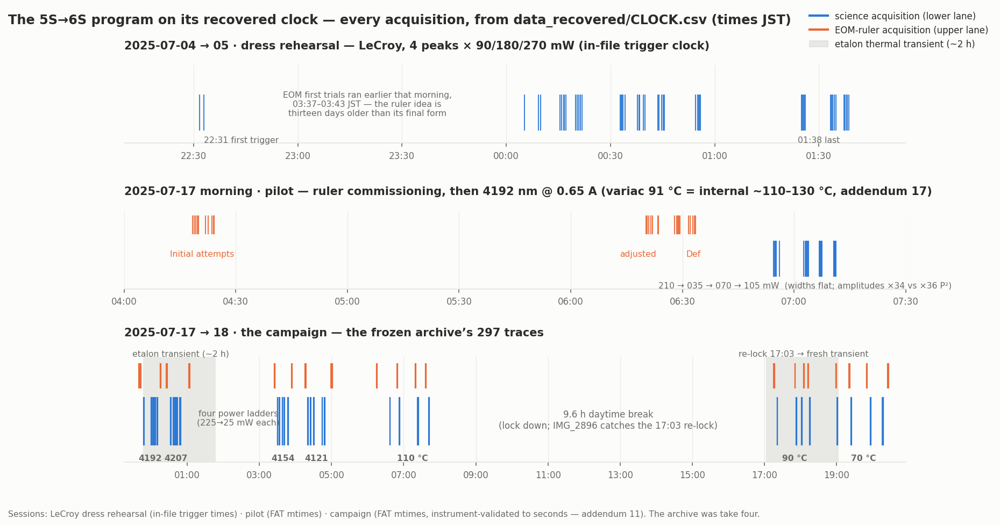

# The 2025 archive: provenance, decoding, and quarantine

*Everything in this file was established on 2026-07-10/11 by hash comparison
of the original archive plus direct answers from the experimenter
(Michelangelo). It is the background you need to trust `data_raw/MANIFEST.csv`.*

## 1. The experiment in one paragraph

Doppler-free two-photon spectroscopy of Rb 5S₁/₂→6S₁/₂ at 993.4 nm in a hot
vapor cell (retro-reflected geometry), detecting the 795 nm cascade
fluorescence (6S→5P₁/₂→5S) through 50 dB of 795 nm filtering on a PMT. Four
hyperfine components, labelled by their wavelengths: 4207 (⁸⁷Rb F=2→2), 4192
(⁸⁵Rb F=3→3), 4154 (⁸⁵Rb F=2→2), 4121 (⁸⁷Rb F=1→1). The laser (M Squared
SolsTiS) was scanned slowly across each line; an EOM at exactly 12.5 MHz —
confirmed in hardware, both as the generator setting (Tektronix AFG31021 at
12.500 000 000 0 MHz) and as the EOM's designed resonance on its test
certificate ([APPARATUS.md](APPARATUS.md) §2) — was
toggled ON for separate "ruler" traces, whose two-photon comb teeth (6.25 MHz
apart on the laser axis) calibrate the sweep. The 2025 lock was misconfigured (etalon and reference cavity held, but no
outer loop against an absolute reference was engaged —
[APPARATUS.md](APPARATUS.md) §1.1, incl. its 2026-07-25 correction on what
the control page's "ECD" row actually is; no photograph covers the campaign
itself):
line CENTERS drift between scans and carry no metrological meaning; SHAPES
survive. Scope: **Agilent/Keysight InfiniiVision DSO-X 3054A** (500 MHz,
4 GSa/s) — the LeCroy on the same bench would not trigger reliably
(experimenter, 2026-07-23), and the CSV export signature confirms it: every
archival file opens `x-axis,N` / `second,Volt`, which is the InfiniiVision
format, not LeCroy's. Every trace is 2000 points, 0.5 ms
step, 1.000 s window.

## 2. Campaign design and chronology (experimenter-confirmed)

**When.** The whole archive was acquired in a single run of about **24 hours,
17–18 July 2025**, with the Ti:Sapph **left running throughout**
(experimenter-confirmed, 2026-07-22). Continuous operation matters beyond
provenance: it removes warm-up transients between blocks, and it is the
physical reason a *shared* laser-noise epoch across neighbouring blocks is
plausible at all — the assumption `PLAN.md` §10.1 post-mortem row 5 records. The
recovered clock has since dated it rather than settled it: within a
temperature dwell the four peak-blocks are **54–76 minutes apart**, so
"neighbouring" means an hour, and their widths track that hour no better than
chance (r = +0.18, p = 0.6, n = 12 — [RESULTS.md](RESULTS.md) C1). Untested,
now for a stated reason: the design, not the missing log.

> Standing as of 2026-07-22: **recollection, not yet checked against a
> clock.** This section has been public and unchanged in substance since
> `9190b0b` (2026-07-13; its original release was later withdrawn —
> [PREREGISTRATION §9](PREREGISTRATION_timestamps.md)); a backup carrying acquisition
> timestamps surfaced nine days later and was audited under pre-registration
> (opened 2026-07-23; **integrity void at T1**, predictions unscored, clock
> window confirmed, and the JST clock reading itself later instrument-validated
> by in-file LeCroy trigger times to seconds (addendum 11) —
> [PREREGISTRATION_RESULTS.md](PREREGISTRATION_RESULTS.md))
> ([PREREGISTRATION_timestamps.md](PREREGISTRATION_timestamps.md)) whose
> predictions are taken verbatim from the text below.

*The program on its recovered clock — every acquisition in
[`data_recovered/CLOCK.csv`](../data_recovered/CLOCK.csv), drawn by
[`scripts/make_timeline_figure.py`](../scripts/make_timeline_figure.py):
the LeCroy dress rehearsal (in-file trigger times), the pilot morning
(ruler commissioning → `Def` → the 0.65 A sweep), and the campaign with its
four power ladders, three temperature dwells, the 9.6 h break, and the
evidence-backed etalon-transient windows shaded (addenda 4–7, 12 — the
last of which fits the transient itself: one universal re-kick, τ ≈ 97 min,
re-armed at every re-lock).*

Per peak, in time order, all at 130 °C: **before-rulers → 225 → 175 → 125 →
75 → 25 mW → after-rulers** (each power = 5 back-to-back RF-off repeats; each
ruler block = ~5 back-to-back RF-on repeats). **Corrected 2026-07-23 from the
recovered timestamps: the ladder ran DESCENDING on all four peaks (order
4192 → 4207 → 4154 → 4121, 23:41 → 05:00 JST overnight 17→18 July); the
original recollection here said ascending — remembered exactly reversed. The
audit's post-hoc pass found the disagreement; per the pre-registration's §6,
the clock wins and the reversal is reported, not reconciled
([PREREGISTRATION_RESULTS.md](PREREGISTRATION_RESULTS.md)).** After the whole power
session: stepwise cooling **110 → 90 → 70 °C** at 225 mW, each temperature
with its own 5-repeat RF-off block and its own ruler block. (The campaign
had a prehistory, surfaced 2026-07-24 and kept outside the frozen archive:
EOM first trials 2025-07-04 03:37 JST; a 50-trace LeCroy dress rehearsal
that evening — four peaks, 90/180/270 mW, `G=10^6`, two-zone temperature
notation; then on the campaign morning the ruler's final commissioning
04:18–06:33, `Initial attempts` → `Def`, and a four-power pilot sweep at
06:54–07:11; results report addendum 9. Its files say `91c650ma`, but that
`91 °C` is a **variac set point**, not a cell temperature comparable to the
campaign's dwell labels: the same 0.65 A is what the rehearsal records as an
internal 130 °C, and the pilot's amplitude agrees, sitting ~15× above what an
internal-90 °C pilot would give — addendum 17. Its linewidth cannot tell the
dwells apart either way, which took two attempts to establish. **Since
2026-08-01 the rehearsal is no longer analysis-untouched:** M23
(`run_stark_joint`) reads its traces in place from the quarantine tree,
never copying them into the repository, as the second session of the joint
light-shift fit, because its 270 mW rung and alternating ladder directions
add leverage the campaign lacks. 46 of the 50 traces enter. Three are
0xff-corrupted on disk and one has no line in the window. The quarantine
copies themselves remain read-only and unmodified. The 2025-07-03 EOM
trial traces turned out to carry the **piezo ramp on their second
channel**, recalled by the experimenter and confirmed by the data: the
same line crossed twice near a sweep turnaround reads the same ramp
voltage to 0.1 mV on a 13 mV sweep, and a sideband satellite at a constant
voltage offset calibrates that axis at 5.24 MHz/mV, under which the line
width comes out 5.1 MHz at 80 °C, on the physical budget. The measured
EOM-day scan rate, 0.024 MHz/ms, differs 2.2× from the rehearsal's fitted
rate, so the two days' scan configurations differ and no calibration
transfers. The full account is in `run_stark_joint.py`.) Repeats were
saved seconds apart (measured position scatter within a block: 1.8 ms ≈
0.08 MHz laser). Between saves the experimenter moved the scope's horizontal
knob and manually recentered the cavity reference **many times** — not
because the held lock drifted fast (measured: ~0.016 MHz/min, which would
take tens of hours to cross the window — but see the provenance note below)
but because the cavity lock kept
dropping out during the etalon thermal transient, each recapture landing
MHz-scale off (`APPARATUS.md` §6; results report addenda 4–7) — so
**absolute trace positions carry no meaning across saves**; each trace's comb is its own frequency axis. **Within a 5-repeat block the reference was
usually left alone** — a tendency rather than a protocol
(experimenter-confirmed, 2026-07-22), and the archive shows the exceptions:
24 of 32 RF-off science blocks scatter about a common position (median
1.79 ms, confirming the figure quoted above), while 8 step mid-block, two of
them by ~1 s — larger than the trace window, so the axis offset itself moved.

> **Provenance note on the ~0.016 MHz/min (2026-07-30).** That figure comes from
> `run_drift_settling.py`'s state-space fit, which compares block-**median** peak
> positions **across** blocks — the same comparison the M20 retraction showed is
> contaminated by the scope's horizontal setting, since the setting moved 58
> times and the fit frees only the 19 moves above 100 ms. So its provenance is
> exposed, and it has not been re-derived.
>
> It is not contradicted, either. Measured only *within* a display epoch — a run
> of unchanged `window_start_ms`, where the position is a frequency under either
> reading of the licensing question and so needs no correction at all — the two
> longest knob-untouched segments give −0.022 and −0.018 MHz/min, bracketing the
> quoted value. The shorter segments (3–6 min) scatter to ±1.5 MHz/min, which is
> what a 0.27 MHz per-trace scatter produces over such baselines; the archive
> simply has no long intervention-free stretch.
>
> *Sharpened 2026-07-30, after recomputing the whole fit in both frames.* Across
> the 16 adjacent-block steps of the power session, RMS Δ(peak position) is
> 145.2 ms while RMS Δ(window setting) is 145.9 ms and RMS Δ(difference) is
> 6.3 ms: **99.8% of the between-block excursion the fit reads as re-centring is
> the horizontal setting.** Recomputed in the other frame, two of the three
> estimators for the settled drift **change sign** (+0.55 ± 0.17 → −0.28 ± 0.16).
> So 0.016 MHz/min is not a measured rate in either direction. The defensible
> statement is a **bound of order 0.02 MHz/min on the laser axis, sign
> undetermined** — which is all the drift-immune argument ever needed, since it
> turns on the rate being small, not on its value or its sign. Full four-way
> table in [PREREGISTRATION_RESULTS](PREREGISTRATION_RESULTS.md), addendum 4.
Within the scatter-like blocks the variation shows no trend with repeat index
($p=0.33$), so it is laser **jitter**, not accumulated drift
(`scripts/run_intrablock_trend.py`;
[PREREGISTRATION_timestamps.md](PREREGISTRATION_timestamps.md) §8.4).

Consequence for the collisional analysis: temperature is monotonic with time
across the whole campaign (130 °C first … 70 °C last), so ordering alone
cannot separate density effects from slow instrument drift — the plan's
stationarity probes (PLAN.md, M4) exist precisely for this.

## 3. What the hash comparison established

The original `data/` tree holds 722 CSVs in six directories with ~2×
duplication (367 unique basenames; fewer unique MD5s). Key identities, all
byte-exact:

1. **`temperature/*_130c{1..5}` ≡ `power*/*_225mw{1..5}`** (all 20 files):
   the temperature sweep's 130 °C point *is* the power sweep's 225 mW point.
   Fresh temperature acquisitions exist only for 70/90/110 °C.
2. **`temperature_EOM/*_eom_130c{1..12}` ≡ pooled `power_eom` brackets**
   (`after{...}` first, then `before{...}`): there are no separate 130 °C
   rulers; the pooled files are renames of the power-session bracket rulers.
   For 4154 the pooled set is the **underscore** re-take
   (`eom_before_`/`eom_after_`), which is therefore the canonical 4154
   bracket set.
3. **Double-saves — including inside the curated dirs.** Same-bytes-two-names
   pairs: `temperature/4154nm_070c1 ≡ 070c2` (so 4154@70 °C has only **4
   unique curated repeats** — the old N=5 filename counting was
   pseudo-replication), `temperature_EOM/4192nm_eom_090c3 ≡ 090c4`,
   `power_eom/4192nm_eom_after3 ≡ after4`, `raw/4154nm_130c_225mw4 ≡ 225mw5`.
   **Rule: always count repeats from manifest rows, never from filenames.**
4. **The curated dirs are a deliberate selection; `raw/` is everything.**
   The experimenter discarded some acquisitions at curation time because they
   "seemed quite bad" (statement, 2026-07-11) and renumbered the keepers —
   that is why `raw/`'s repeat numbering is shifted vs the curated dirs
   (e.g. `temperature/4207nm_090c1 ≡ raw/4207nm_090c6`) and why four
   raw-only traces exist. They live under `data_raw/discarded/` with
   `flag=discarded`; one of them is a 5th distinct shot for 4154@70 °C, so
   that condition runs on **N=4**. **Policy: discarded traces never enter
   headline fits.** The selection was made at curation time, blind to any
   fitted physics, so honoring it cannot bias results; the M0 objective QC
   is additionally run on them as a consistency check on the curation
   (reported in an appendix). **Since 2026-07-23 that check is quantitative
   and no longer rests on timing alone:** these four, plus sixteen further
   discarded acquisitions recovered from the backup (published under
   `data_recovered/discarded_backup/` since 2026-07-24), sit
   inside their conditions' kept spread in linewidth — the quantity the fits
   use — with one boundary case smaller than the width metric's own
   quantisation
   ([PREREGISTRATION_RESULTS.md](PREREGISTRATION_RESULTS.md) addendum 3). Chronology: curated indices are chronological
   among the kept traces; where finer ordering matters, the raw-index
   aliases in `source_paths` are the better guide (small known exceptions,
   e.g. 4207@90 °C).

5. **InfiniiVision export quirks (found at first strict-parse contact, 2026-07-11).**
   (i) ~180 files contain 1–4 "time-without-voltage" rows at the window
   edges (a benign export artifact; the loader drops and counts them).
   (ii) `rulers_t/4192nm_eom_070c3.csv` is dropout-riddled: ~950 *interior*
   empty rows, only 1047 valid samples — hard-flagged, excluded from ruler
   pooling. (iii) `p_sweep/4192nm_225mw1.csv` is a nonstandard export
   — **and a recoverable one: the recovered backup holds its pristine
   full-precision original (uniform time axis, 0 duplicate timestamps vs
   799 in the analysed copy). Substituting it shifts this condition's
   γ_coll by 0.07σ and the peak's β_self slope by 0.03σ, so the handling
   below is adequate and nothing was re-issued; see
   [PREREGISTRATION_RESULTS.md](PREREGISTRATION_RESULTS.md) addendum 2.
   The full degradation lineage — acquisition 2025-07-17, degraded
   re-export 2025-08-16 (post-campaign processing), analysed bytes = the
   2025-08-16 22:15 intermediate modulo line endings — closed with a second
   source folder on 2026-07-24 (addendum 8)** —
   (stray header `jj,nj`; time column printed at 3 significant figures so
   0.5 ms steps alias to duplicate timestamps) whose *content* is healthy —
   the loader rebuilds its time axis from the row index and records the
   salvage. The old pipeline's `genfromtxt`+NaN-drop parsing swallowed all
   of this silently.

> **The temperature notation, resolved 2026-07-25 (experimenter).** In
> filenames of the form `130C(90C-0.65A)` the parenthetical is the **variac
> set point and current**, its thermocouple mounted on the aluminium foil on
> the *outside* of the oven. The campaign temperature is the value outside
> the parentheses, read from **four thermocouples inside the oven**. So the
> quoted temperatures are internal readings — but an internal thermocouple is
> still not the cold spot that sets the density; results report addendum 15
> gives that offset its first empirical handle (Δ ≈ 0–30 K, face value ~20 K),
> and `PLAN.md` §8 item 3 is the measurement that would settle it.

## 3a. The folders of record (consolidated 2026-07-24)

One dataset, several folders with different jobs — collisions between them
are real (nine names, different bytes), so identity is **always by content
hash**:

| where | what | status |
|---|---|---|
| `data_raw/` (this repo) | `MANIFEST.csv` only — every trace's filename, condition, role and MD5. The 297 traces are held privately (available on request); every fitted number regenerates from them. | **frozen** — never edited |
| `data_recovered/` (this repo) | `CLOCK.csv` (the acquisition clock, hash→mtime for all 438 backup files) and `RECOVERED_MANIFEST.csv`. The recovered traces — the 16 backup-only discards and the degraded-trace lineage — are held with the archive. See its README. | additive only |
| `raw-backup-2026-07-24` (held privately) | the complete timestamped backup tree, verbatim (`tar.gz` preserving mtimes; sha256 in addendum 10) — campaign, pilot, prehistory, LeCroy rehearsal | preserved archive, on request |
| Desktop `RawDataBackUp` (private) | the provenance root, as found | never touched |
| `~/Documents/*_QUARANTINE_*` (private) | read-only working copies the audit ran on | never modified |

The drift analysis (`run_drift_settling.py`) reads `CLOCK.csv`, so a clone
reproduces the clock-dependent results without any private folder.

## 4. Roles in `data_raw/`

| Folder | Content | Count |
|---|---|---|
| `t_sweep/` | RF-off lines, 70/90/110 °C × 4 peaks × 5 repeats | 59 (4154@70 °C has 4 — §3) |
| `p_sweep/` | RF-off lines, 130 °C, 5 powers × 4 peaks × 5 repeats; 225 mW rows carry `serves_t130=True` | 100 |
| `rulers_t/` | RF-on comb traces per temperature block | 61 |
| `rulers_p/` | RF-on bracket blocks (`before`/`after`) per peak | 44 |
| `quarantine/` | the aborted 4154 power attempt + its plausible rulers (§5) | 29 |
| `discarded/` | shots the experimenter rejected at curation (§3, item 4) | 4 |
| `review/` | anything that failed pattern classification | 0 |

Total: **297 unique traces** (from 722 archive files). The census is pinned by
`tests/test_manifest.py`; CI re-hashes every file on every push.

The `flag` column takes values `canonical` / `discarded` / `quarantined` /
`review`. **Only `canonical` rows may enter headline fits.**

## 5. Quarantine (pre-registered; never in headline fits)

- **`4154nm_130c_{025,125,225}mw*`** (19 unique traces): a preliminary attempt
  at the power sweep, taken 22:48 to 23:16 JST on 17 July, twenty-five minutes
  before the campaign proper began on a different peak. Excluded as a matter of
  course: it is a rehearsal, it covers three power levels rather than five, and
  the campaign retook the point it was meant to measure. Kept in the archive
  because it is a same-condition, different-hour probe if one is ever wanted.

  It was stopped because the baseline would not stay flat, and the traces show
  it. The 225 mW block has a mean off-peak slope of 0.074 V/s against 0.0009
  in the canonical retake, a factor of eighty, while the 25 and 125 mW blocks
  match the retake to within a factor of two. The defect is confined to the
  highest power, which is the signature of a drift that grows with it. At the
  line level the set is unremarkable, with height, width and signal-to-noise
  matching the retake to better than two per cent, which is why it passes
  mechanical quality control and has to be excluded by judgement instead. The
  re-examination in §6 confirmed the exclusion does not matter either way:
  folding these traces into the power fit moves the AC-Stark bound by a few
  per cent, within its own scatter.
- **`4154nm_eom_before{1..5}` / `after{1..5}` (non-underscore)**: the ruler
  brackets of that same preliminary attempt, and 4154 is the only peak with two
  bracket sets because of it. The clock settles which is which. These run at
  22:48 and 23:14, bracketing the preliminary sweep; the underscore set pooled
  into the canonical rulers runs at 03:25 and 03:53, bracketing the campaign's
  own 4154 block. Excluded with the sweep they belong to.

## 6. What changed after the first pass, and why

In July 2026, before this pipeline existed, a first-pass brief circulated with
preliminary numbers from this dataset. Several were wrong. They are recorded
here because they were seen by other people, so a reader who met them first
needs to know which ones moved and what caused each error.

The brief's central mistake was reading the frequency ruler. It seeded a scan
rate of 0.49 MHz/ms by taking noise substructure for comb teeth, and read the
two strong 6.25 MHz sidebands as "two triplets 270 to 280 ms apart". The comb
teeth are actually about 147 ms apart, which is 0.043 MHz/ms, eleven times
slower. Every absolute width in the brief inherited that factor.

Two later corrections moved headline numbers after this pipeline existed, and
neither came from new data or a refitted model. Both were interval
construction. They are the two entries below marked as such.

**Error-plumbing round (2026-07-16).** Five review items closed, none moving a
headline number: the block-coherent ruler-rate error is now folded into every
width-type error in `linefit_conditions.csv`; `noise_floor_limited` and
`*_at_bound` flags travel with the fits, so a parameter pinned at a rail no
longer wears a symmetric error silently; the transit-MC FWHM is read with
sub-grid interpolation, which turned out to matter because the committed "MC
errors" had been the 0.01 MHz grid quantum in disguise; the noise-law floor
rose to the dark-noise level, verified zero-churn; and tests were added for
both. Detail is in the commits.

**The collisional bound, 0.07–0.15 → 0.2–0.4 MHz per 10¹² cm⁻³
(2026-07-16).**

*What was wrong.* The interval used a hard-coded 2σ multiplier.

*How it surfaced.* The between-block scatter that dominates the slope error is
estimated on **one residual degree of freedom**, three density points against
two parameters. With one degree of freedom the one-sided 95% multiplier is the
Student-t quantile $t(0.95,1) = 6.31$, not 2. The old interval therefore
under-covered, which its own prose flag had been admitting in words ("~factor-2
own uncertainty") without acting on it.

*What it taught.* Two things. A hard-coded multiplier hides its own assumption
about degrees of freedom, so the quantile must be computed from the fit. And
because β scales as 1/N, the ~20% spread between published vapour-pressure
correlations moves every β by the same fraction (`density.py`,
`N_SCALE_FRAC_SYST`); the cold-spot direction makes the fitted β an
underestimate, so the bound inflates on the + side by ×1.2. The selection rule
flips with it: the *loosest* peak is the conservative single-number floor,
because the minimum of noisy one-degree-of-freedom estimates is the
down-fluctuated one.

The 130 °C lever variant (dof = 2) barely moves, 0.03 to 0.05, and keeps a
caveat. The clock puts it 2.3 h from the 110 °C dwell inside the same campaign,
so the objection is not a session boundary but that it is an extreme lever
point, with T confounded against elapsed time across the whole campaign. The
hierarchical global-fit β gains a `beta_nscale_syst` row at ±20%. A constant
cold-spot offset also tilts the N(T) lever by ~2.3%/K of offset, which is a
slope effect rather than a scale one, quantified in `density.py` and recorded
but not propagated as second order.

**The AC-Stark bound, 3.1 → 0.63 MHz (2026-07-16), then 0.63 → 0.14 MHz
(2026-08-01, a construction change rather than a correction: M23 fits every
point of every profile across both sessions where M4e fit 20 summary widths.
Both bounds stand, the tighter one is quoted).** 95% limit on $S_0$ at
225 mW.

*What was wrong.* The interval was built by linearising at the best fit. The
best fit rails at $\kappa = 0$, and the width handle there goes as $S_0^2$, so
its gradient vanishes. A Wald interval $\kappa + 1.645\sigma$ evaluated at that
point has no valid coverage, and its $\sigma$ was a finite-difference artifact
that happened to be large.

*How it surfaced.* Rebuilding the limit by profile likelihood: scan $\kappa$,
re-minimise the per-peak cores at each step, one-sided $\Delta\chi^2 = 2.706$
scaled by $\chi^2_{\rm red} \approx 4.3$ for over-dispersion. That crosses at
0.63 MHz, checked smooth and stable to 0.1 MHz at half the frequency-grid step.

*What it taught.* At a boundary, a linearised interval reports the curvature of
the fitter rather than the constraint from the data. The physical reading also
changed with it, and became weaker rather than stronger: the bound brackets the
predicted coefficient (0.59 MHz at the 50 µm prior) instead of demonstrating
sensitivity to it. The predicted effect is ~0.09 MHz against 0.088 MHz of
single-block width scatter, so the bound comes entirely from averaging, an
assumption M17 finds untested. Anything far above the prediction is excluded,
while the prediction itself and zero both remain allowed.

The superseded Wald rows stay in `stark_sweep.csv` as labelled diagnostics.
Downstream, the $\Delta\alpha$ bracket tightens from ~5800 to ~1200 a.u.

**Cross-check against the earlier analysis of this dataset (2026-07-16).** Per the
ground rule in `PLAN.md` (old *code* is never read; old *outputs* serve only as
external cross-check targets), the previous attempt's committed report and summary
CSVs — not its source — were reviewed after this analysis was complete. The
comparison is worth recording because it explains the two analyses' different
conclusions:

- **The earlier analysis modelled the line as an ordinary Doppler-broadened
  absorption profile.** Its report contains no mention of *two-photon*,
  *counter-propagating*, *retro-reflected*, *transit-time*, or *AC-Stark*, and it
  interprets the fitted Gaussian width as "a direct measurement of the atomic
  velocity distribution … compared to the Maxwell–Boltzmann distribution".
- **Its own numbers refute that reading.** At 70–130 °C the first-order Doppler
  FWHM on this line would be 430–466 MHz, whereas the Gaussian it fits is
  σ ≈ 0.81–0.88 MHz, i.e. an FWHM of ≈1.9–2.1 MHz — **~220× narrower than Doppler**.
  The ~220x narrowing is the expected consequence of the Doppler-free geometry
  as designed (`methods/01_the_measurement.md`): the first-order shift cancels for every atom,
  which is the entire purpose of retro-reflecting the beam. A Gaussian of ~2 MHz on
  this line therefore cannot be the velocity distribution.
- **What that Gaussian was actually absorbing.** With no transit-time kernel in the
  model, the single free Gaussian is the only component able to take up the transit
  width. Suggestively, its mean rises 8.4% from 70→130 °C where the √T transit law
  predicts 8.4% — though with ~0.07 MHz of peak-to-peak scatter and a *fall* from
  70→90 °C, four points do not establish this. Read it as consistent with transit +
  laser being absorbed into one Gaussian, not as a measurement of either.
- **Consequences for us:** the earlier per-condition widths remain usable as
  order-of-magnitude cross-check targets (their total widths are in the same few-MHz
  range as ours), but none of their *physical interpretations* transfer, and their
  reduced χ² of 2–5 is consistent with a missing model component. The disagreement traces to which
  mechanisms are in the model at all, not to fitting quality — which is what
  motivated the from-scratch re-derivation.

### The brief's numbers, item by item

- **Scan rate**: comb teeth are ~147 ms apart ⇒ ≈ 0.043 MHz/ms on the laser
  axis (preliminary, finder-level) — ~11× slower than the brief's
  0.49 MHz/ms seed, which misread noise substructure as teeth. The brief's
  "two triplets 270–280 ms apart" were the two strong ±6.25 MHz sidebands.
- **Absolute widths**: e.g. 4154 at 110 °C/225 mW is ≈ 60.6 ms ≈ 5.2 MHz
  FWHM on the transition axis (finally consistent with the physics budget:
  3.49 natural + ~1.2 transit + collisions + laser). All absolute σ/γ values
  from the old pipeline are void (wrong axis scale; Lorentzian part below the
  natural floor); its *trends* may survive a single global rescale.
- **Power dependence**: the archival "FWHM null vs power" is the *predicted*
  behaviour (ramp-law inflation ≤2% across 25→225 mW); the third-moment/skew
  observable proposed in the brief is unmeasurable (≈1×10⁻⁴ vs noise floor
  ≈1×10⁻³) — power-shift physics moves to the fixed-lock session.
- Traces are 1.000 s / 2000 pts (brief said 840 ms — wrong).
- The sweep turnaround can sit **inside** the acquisition window: in the
  4207 nm 25 mW block the triangle folds at t ≈ 432 ms and the retrace
  re-crosses the line near the window edge (in 3 of 5 keepers and the
  discarded shot; verified independently from raw traces). "One window ≈ one
  up-ramp" holds for most blocks, not all — fits mask the retrace region.
- **Frequency axis (M2, corrected 2026-08-01)**: laser-axis sweep rate
  **0.042526 ± 0.000051 MHz/ms** (transition axis 0.085053; mean tooth spacing
  147.0 ms) — ~11× slower than the initial brief's 0.49 MHz/ms seed, which
  misread noise substructure as teeth. Blocks are NOT all consistent with a
  single rate (campaign χ²/block 8.1, 0.6% RMS spread) ⇒ M3 uses **per-block
  rates**, and `rate_model.py` (M2b) now also carries a time-resolved rate(t)
  per session and peak, read where the recovered clocks license it. The
  4207 nm power session shows a coherent 3.7σ before→after spacing shift
  (146.4 → 144.8 ms) — a real ~1.1% in-session rate change, its own
  calibration systematic for 4207 power points. The fine-scan sweep is
  **linear to <0.3% across the window** (no piezo nonlinearity — the
  ruler-in-fine-scan design worked). Cold 70 °C rulers calibrate fine with
  correctly inflated errors (~2.5 ms vs ~0.3 ms warm).
- **β_self (M4, 2026-07-11) — the archival T-sweep BOUNDS it, does not
  measure it.** Model-independent raw line widths (smoothed half-max × the
  verified per-block rate, no fitting) rise only ~0.2–0.4 MHz across 70→110 °C
  and are **non-monotonic in density for 3 of 4 peaks** (e.g. 4207: 5.11→4.87→
  5.28 MHz — narrower at higher density, impossible for collisions). The
  within-block repeat scatter is tiny (~0.05 MHz), so each block is internally
  precise; the blocks simply disagree with a monotonic density trend. The
  culprit is **laser-width (σ_laser) drift between the cooling-session blocks
  (~0.06–0.16 MHz)**, comparable to the whole collisional trend. Result:
  β_self < 0.21–0.44 MHz per 10¹² cm⁻³ (95%, per peak; headline ≲0.2–0.4); a clean measurement
  needs a fixed-lock session — this is the archival data showing
  the two-epoch design was necessary. NOTE: the
  global Voigt fit (rb5s6s/beta.py) reports 4–10σ "detections" but those σ are
  OVERCONFIDENT — they assume one shared σ_laser across blocks and so omit the
  between-block drift the model-independent probe exposes.
### Audit and curation decisions

Kept because each one settles a question a reader of `MANIFEST.csv` could
otherwise reopen. They are decisions about the archive, not corrections to
the brief, and they moved no headline number.

- **RF-on rulers are fold-robust (checked 2026-07-11, do not re-litigate).**
  The rulers were taken with the same sweeps as their blocks, so one might
  worry the off-center-sweep fold (below) also corrupts the tooth-spacing
  fits — it does not, for a structural reason. The sweep is a symmetric
  triangle, so the up-ramp and down-ramp have the *same rate magnitude*; a
  fold therefore preserves the tooth *spacing* (6.25 MHz → ~146 ms on either
  ramp) and only scrambles which tooth is which index n, never the spacing
  that sets the rate. Empirically the 4207 ruler combs march at a uniform
  ~146 ms with no compression/reversal, and the 4207 ruler-fit χ² (mean 0.91)
  is no worse than any peak. So the 4207 before/after rate shift is a real
  in-session effect, not a fold artifact, and the ruler rates need no window.
  (Contrast: a single RF-off *line* has no such protection — it simply
  appears twice, which is why only the RF-off fits get a window.)
- **Off-center-sweep mirror crossings (noted during curation, 2026-07-11).** When the
  triangular sweep is not centered on the transition, the down-ramp re-crosses
  the line, leaving a mirror ~40 MHz from the main peak inside the window.
  Whole-dataset scan: 8 canonical RF-off traces, almost all in **4207** (the
  edge peak — the sweep centered on the quartet middle put it off-center):
  4207@25 mW has a **79%-of-peak** mirror in 4/5 traces, 4207@225 mW ~18% in
  3/5, plus one 4121@70 °C at 15%. Fits now use an ADAPTIVE window (±3.5×
  the trace's own FWHM, clipped to [9, 25] MHz — `linefit.adaptive_halfwidth`)
  to exclude the ~40 MHz mirror while keeping a fixed fraction of the
  Lorentzian wings regardless of line width; the raw-width probe was already
  retrace-safe. This was corrupting the 4207 fits specifically (χ² 6.7→1.0 at
  225 mW; γ_coll un-pinned from 0 at 25 mW) and was the sole cause of 4207's
  cross-peak-consistency outlier (χ²/dof 7.4→3.0 after the fix). Headline
  β_self bound unaffected (model-independent raw widths).
- Curation audit outcome (M0 + systematic curation audit, 2026-07-11;
  extended to the fitted observable and to 20 discards, 2026-07-23):
  of the four raw-only discarded shots, only `4154nm_070c4` shows an objective
  signature (~27% dimmer than siblings, structurally clean); `4192nm_090c3`
  is fully clean (a supernumerary 6th repeat); the two 4207 discards are
  indistinguishable from their kept siblings (the flagged features — retrace
  crossing, slow baseline bow — are block-wide). All four stay excluded by
  pre-registration. The 2026-07-23 extension re-ran these four on *linewidth*
  rather than brightness — the quantity the fits use — and all four sit inside
  their conditions' kept spread, `4154nm_070c4`'s brightness deficit included.
  On the keeper side no exclusion-worthy trace was found:
  the flags that survive are fit-time instructions (retrace masking; cold
  rulers → per-trace bright-tooth fits), and RF labels verified 297/297.
- **The lever test — the fitted γ_coll is a FLOOR; β_self is lever-dependent,
  hence a BOUND (M4d, 2026-07-12).** Per-condition fits (linefit_conditions):
  the 4-peak mean γ_coll is 0.245 / 0.231 / 0.289 / 0.454 MHz at 70/90/110/130 °C
  while the density rises ×52 — a ×1.85 rise where a real binary-collision
  width must be LINEAR in N. Consistently, the joint hierarchical β collapses
  0.036 → 0.014 when the ×53 130 °C anchor (`serves_t130`, 225 mW) is folded
  in (lever_crosscheck.csv: beta_lever_probe_130), and the 130 °C widths sit ON
  the near-flat trend — not a session outlier. Split-independent check: the
  pooled total FWHM grows only ~0.38 MHz across the span, below the
  ≥0.55 MHz minimum a linear β=0.036 demands (Voigt slope ≥0.5346) — see
  fig5 panel A and fig6. ⇒ the fitted "collisional" width is a residual floor
  (transit/laser model + block scatter), the apparent β shrinks as the lever
  lengthens, and the archival β is a BOUND — reinforcing, not adding to, the
  model-independent headline. A fixed-lock session: the 150–170 °C points must be taken
  inside ONE locked session (PLAN §7). RETRACTED framings (do not
  re-litigate): (i) "between-session systematic — the sessions cannot be
  combined" as the PRIMARY story (commit d711950) — the 130 °C widths lie
  on-trend, so leverage on a near-flat γ, not a session jump, drives the β
  drop (the session difference stays a secondary, unseparable caveat);
  (ii) a corr(γ, log N) > corr(γ, N) argument — fragile (993.4121 nm is
  non-monotonic and the pooled means reverse it); the robust metric is the
  rise factor ×1.85 over ×52 (lever_crosscheck.csv: gamma_rise_factor).
- **Discard/quarantine audit adjudicated + `qc_reason` column added (2026-07-12).**
  An external audit of the excluded traces was verified against the
  repo; its two central factual claims did NOT survive, in opposite directions
  (do not re-litigate either):
  (i) *"the four discards are MD5-superseded duplicate exports, not real
  discards"* — FALSE for 3 of 4: `4154nm_070c4`, `4192nm_090c3`,
  `4207nm_070c2` have no same-name canonical twin (their same-repeat matches
  are EOM *ruler* files — a role collision, not a duplicate), and e.g.
  4154 70 °C has only 4 canonical repeats *because* 070c4 was excluded as a
  shot. Only `4207nm_025mw2` is a genuine duplicate-name save superseded by a
  canonical twin (md5 26bf… vs 7ec1…). The committed curation audit
  (above) stands: four real excluded shots, one objective defect
  (070c4, zsib_height=−3.1), three kept-excluded by pre-registration.
  (ii) *"the 29 quarantined traces fail hard — 'peak cut by window
  (margin 0 ms)', snr=inf — independently confirmed"* — does NOT reproduce:
  recomputing `hard_flags` on all 29 gives ZERO flags (spot: edge_margin
  333 ms, snr=61), agreeing with the committed `qc_metrics.csv`. The
  quarantine is legitimate but SESSION-GRAIN (the aborted first 4154 130 °C
  power attempt, redone in full, plus its 10 EOM ruler brackets) — a curation
  fact, not a per-trace mechanical defect, and therefore NOT recomputable
  from the data. That is exactly why the audit's one *procedural* point was
  right and is now implemented: `MANIFEST.csv` carries a **`qc_reason`
  column** (`scripts/annotate_manifest_qc.py`, idempotent, self-checking: it
  re-verifies the discard map and the quarantine cleanliness before writing;
  guarded by `tests/test_manifest_qc.py`). Canonical rows are empty; all 33
  non-canonical rows carry their recorded reason. Also for the record: the
  manifest has no `status` column and never did (`flag` is the status) — the
  audit's "status reads `?`" was its own parse artifact.
- **Re-examined the 4154 130 °C quarantine on request (2026-07-12) — kept
  excluded, now for a concrete reason.** The question was whether the aborted
  first attempt is usable. Findings, all verified: (a) it is **redundant** — the
  canonical p_sweep already covers all five powers (25/75/125/175/225 mW), the
  aborted retry only 25/125/225 (stopped partway) and carries no `serves_t130`
  flag, so it is not a density-lever anchor; (b) at the **line level it is fine**
  — height, width and SNR match the redo to <2%, which is why it clears the
  mechanical QC; (c) but the **225 mW set has a baseline slope ~80× steeper**
  than the redo (mean ~0.07 vs 0.0009 V/s) — a high-power drift signature, the
  plausible abort cause. **Hard proof it does not matter:** folding the aborted
  traces into the power/Stark fit shifts the AC-Stark bound only at the
  few-% level (it *tightens* slightly, well within the bound's own scatter),
  leaves $\kappa$
  unchanged, and cannot touch $\beta$ (the headline uses the 70/90/110 cooling
  sweep, never this session). **Decision: keep quarantined.** Re-admitting
  previously-cut, drift-flagged data *because* it tightens a bound is the mirror
  image of cherry-picking (both are results-driven exclusion calls, which the
  pre-registration exists to prevent); the tightening is marginal and the
  conclusion ($S_0 < \sim2$ MHz) is unchanged, so nothing is lost by holding the
  clean decision. The `qc_reason` column now records this concretely.

- **Transit-MC flux bug fixed + w₀ re-pinned 32 → 50 µm (2026-07-13; full detail
  in `docs/notes/transit_width_resolved.md`).** The M9 transit Monte-Carlo was missing
  the atom-crossing flux factor and ran ~2× too narrow; the corrected transit
  (validated against Lehmann's 41.2 kHz NNO example) excludes the 32 µm nominal
  and re-centres w₀ to ~50 µm. Every w₀-conditional fit was re-run; the
  model-independent headlines (the C1 width-slope bound, the power-sweep FWHM/amp)
  are unchanged. An earlier "w₀ ≈ 90 µm" note was a spurious factor-of-2 —
  retracted.

- **Literature provenance dig (2026-07-13).** The Nieddu 2019 /
  Rajasree-KP 2020 direct beam-waist measurement (w₀ = 64 µm) and the resolution
  of a since-debunked "Nieddu 2.5 MHz" note are documented in full in
  `docs/LITERATURE.md` §6a — both external corroborations of the archival w₀ re-pin
  and the observed line width, not raised here to avoid duplicating that entry.
  **N(T) chain confirmed:** `rb5s6s/density.py` uses the Steck/Nesmeyanov liquid-Rb correlation
  + ideal gas — exactly the T→P→N chain the theses use (Rajasree cites Steck); no
  change. The June-2025 `Lab_plan` is a 4-week project-management doc (planned
  40–80 °C; the campaign actually went to 130 °C) and does NOT pin the beam
  geometry — so the w₀ prior legitimately rests on the Gaussian estimate +
  Nieddu's measurement, not the plan.

- **The RF-off/on/off bracket structure, tested for extra statistics
  (2026-07-17).** Each power-session block is bracketed by an EOM ruler *before*
  and *after* (RF-on), around the RF-off science lines. The clean quantity to
  exploit is the *(after − before)* ruler-width difference: because both brackets
  share the same rotated-HWP setting, the polarization/power offset that sinks the
  absolute ruler-width monitor cancels in the difference, leaving only the
  within-session σ_laser drift. Measured per peak (from `results/ruler_traces.csv`,
  transition axis): 4121 −0.17 MHz (2.5σ, the only resolvable one), 4154 +0.13
  (0.9σ), 4192 −0.05 (1.1σ), 4207 +0.06 (0.5σ). So the difference does remove the
  HWP bias, but inherits √2× the ruler-width noise (per-difference error
  0.05–0.14 MHz), comparable to the ~0.12 MHz drift it would monitor — reliability
  ≈ 0, the same wall as the absolute control variate. It is therefore a legitimate
  **stationarity bound** (within-power-session σ_laser drift ≤ ~0.17 MHz — the
  M4(ii) probe with a measured value), **not** a block-by-block correction: at
  reliability ≈ 0 a correction can only widen the bounds, never earn a measurement
  (the asymmetry rule). The T-sweep (the β_self density axis) has per-block rulers
  and no before/after brackets, so it cannot benefit at all. Where the idea pays is
  the fixed-lock session's matched-PM, interleaved ruler (PLAN §7 / §10.5),
  where the tooth widths become clean and well-sampled and the control variate
  crosses reliability ≈ 0 → useful.
