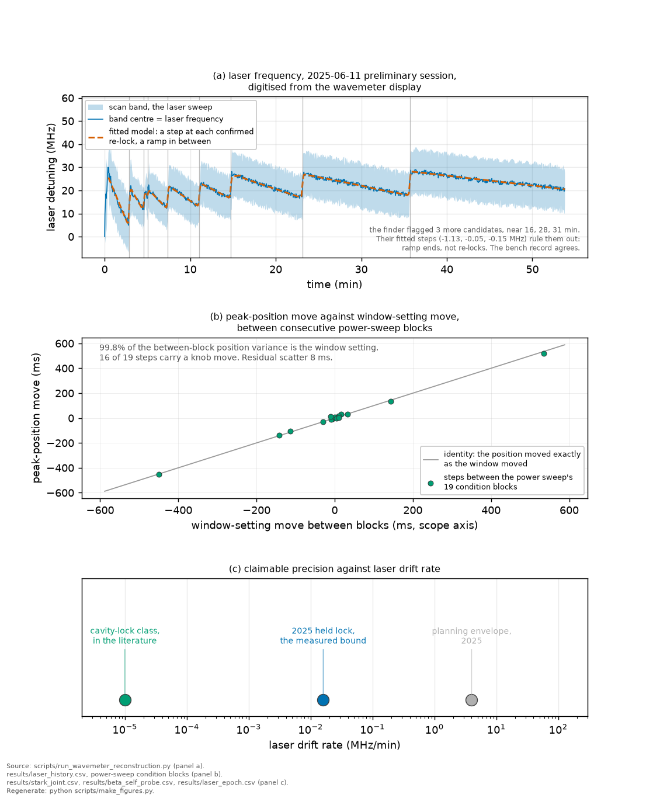
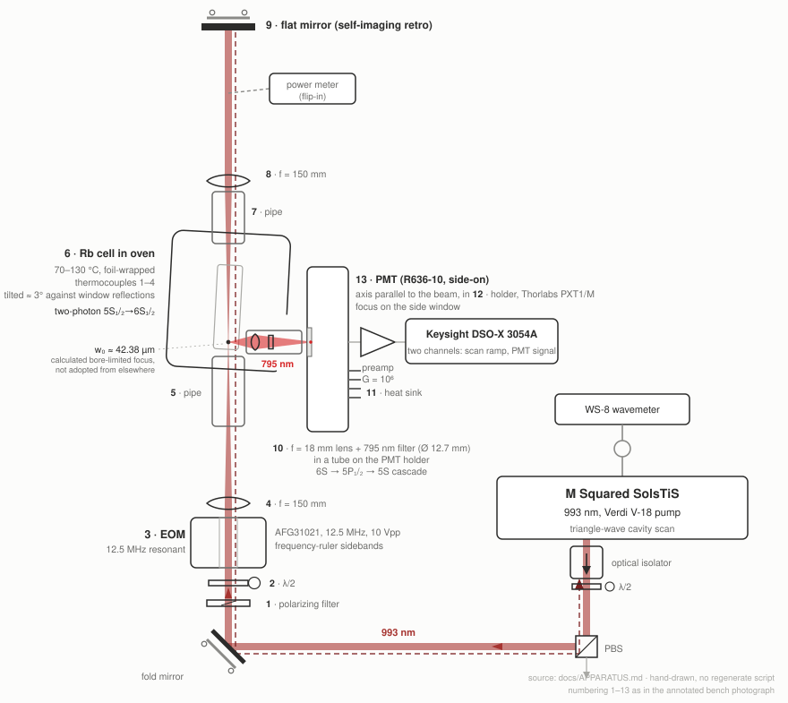
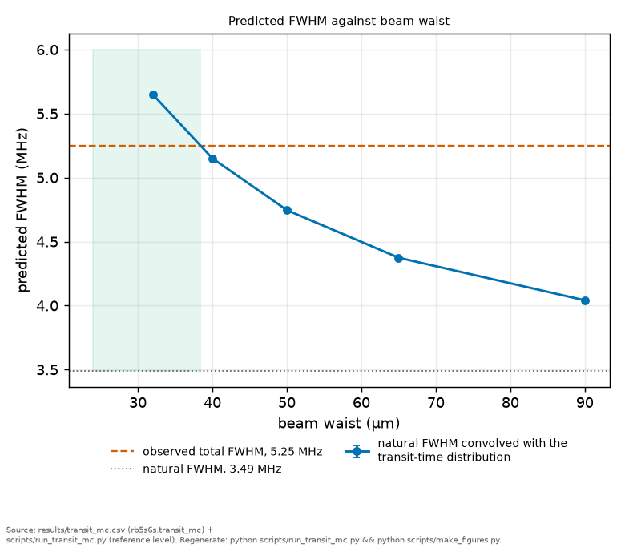
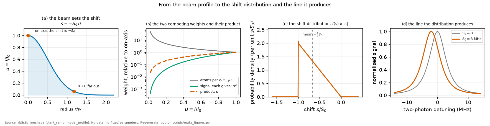
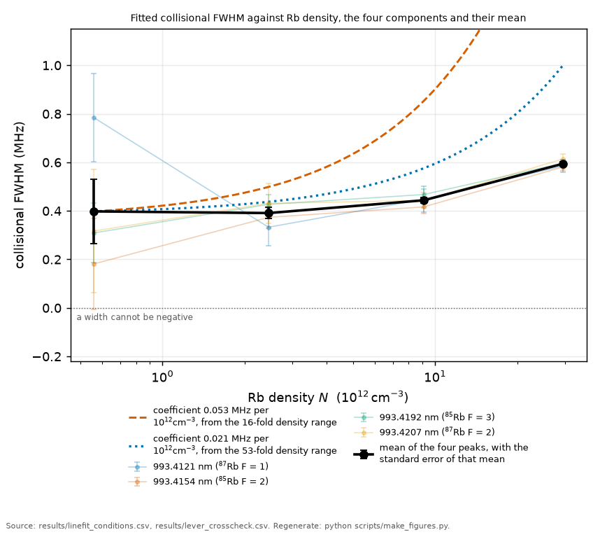
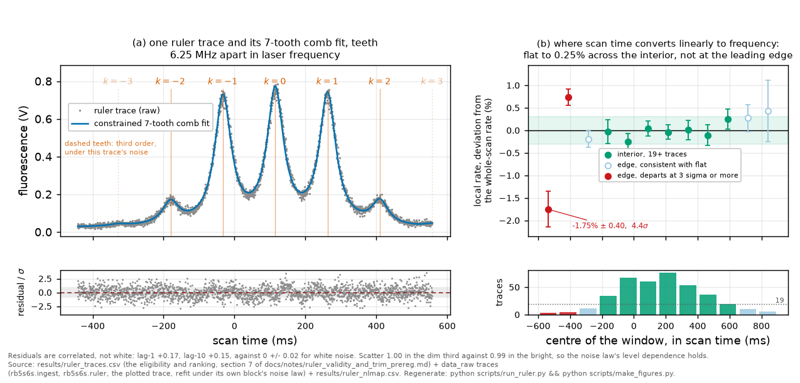

# A fixed-lock session for Rb 5S₁/₂→6S₁/₂: proposal and measurement protocol

**What this document is.** It specifies a vapour-cell
session that would convert three bounds on the 993 nm two-photon line
into measured coefficients, and it is written for two readers: one weighing
whether the session earns its bench time, who reads section 3 and
the block register below, and one running it, who reads
sections 4 to 11 as the protocol. Nothing here is scheduled, no date is
assumed, and the specification names no operator. It is a specification, not a
booking.

**The question.** What would a next session measure, what would it cost, and
what does each block return if the effect is not there?
**Takes.** [CLAIMS.md](CLAIMS.md), for what is bounded rather than measured
today.
**Gives.** The session blocks with their instruments, their durations and their
empty cases, ranked again by what a shrinking budget should cut.
**Skip if.** You want what has been delivered rather than what is proposed.
Every verb here is conditional on a session that is not scheduled.

> **Unfamiliar with the vocabulary?** [GLOSSARY.md](GLOSSARY.md)
> explains the measurement in six sentences, then defines every term
> and symbol used anywhere in this repository.

**Roles, so that four documents do not have to be reconciled by the reader.**
This file owns procedure: what would be set up, in what order, against which
go/no-go criteria. [`FUTURE_TRANSITIONS_titsapph.md`](FUTURE_TRANSITIONS_titsapph.md)
owns the cost, yield and risk table across all candidate lines,
[`BIG_PICTURE.md`](BIG_PICTURE.md) owns the map of what each measurement would
add, and [`APPARATUS.md`](APPARATUS.md) owns the hardware of record and its
provenance. Where a number in this file disagrees with the table or the map,
the table and the map win on numbers and this file wins on procedure. Where it
disagrees with `APPARATUS.md` the split is by kind rather than by number:
hardware facts are APPARATUS's and priorities are PLAN's, so a channel that
document records as available and costs low can still sit in stage 0 here, and
a session that wanted the priority changed would have to argue it in this file.
Projected precisions
are not restated here beyond two headline figures: they live in
[`results/projections.csv`](../results/projections.csv), which is computed
from the archive's own measured precision and the session parameters this
document states.

*The reason this document exists, before any of its procedure. The 2025 lock
was re-centred by hand between blocks, so the line's absolute position carries
no meaning across a step and every result here is a bound read out of the line
SHAPE. The bottom panel is what a fixed lock converts, and each block below
is costed against exactly that. The same figure appears again in §2 with the
drift analysis it comes from.*

**The schema, applied to every costed block below.** Each block states, in
this order and in these words: **Needs** (its prerequisites, with hardware
facts cited to [`APPARATUS.md`](APPARATUS.md) rather than restated), **Shots**
(what to acquire, or the section that holds the list of record), **Go/no-go**
(the criterion that decides whether the block proceeds or aborts, frozen before
data), **Empty** (what it looks like if the block returns nothing), and
**Record** (what leaves the bench). An open item inside a block is written into
the block rather than left to the author's memory.

**What becomes reusable regardless of these sessions.** The analysis pipeline
ingests session data unchanged as long as the export keeps the 2025 shape, a
two-column InfiniiVision CSV of exactly 2000 rows, which `rb5s6s/ingest.py`
requires and rejects anything else against. On that path a session buys shots
and not software. Two of the blocks below deliberately leave it: the native
`.h5` export of §7g, which carries the per-scan timestamp and which no reader
in this package reads today, and any segmented or longer acquisition. Each of
those costs a loader, which is costed with the block that asks for it and is
not a hidden cost of the session.

The adaptation seams for another line or species are named in
[`ADAPTING.md`](ADAPTING.md), the archival data products and their provenance
tags in [`RESULTS.md`](RESULTS.md) and [`results/README.md`](../results/README.md),
and the register below marks which blocks would produce a community-facing
number (a coefficient, a table, a magic point) rather than a calibration
internal to this programme.

*Producers this document depends on:
[`scripts/run_ramp_geometry.py`](../scripts/run_ramp_geometry.py) for the
section 6 geometry tables,
[`scripts/run_resolving_power.py`](../scripts/run_resolving_power.py) for the
signal-against-noise verdicts, and
[`scripts/run_projections.py`](../scripts/run_projections.py), which reads
eleven session parameters from the sections named in its own header and writes
[`results/projections.csv`](../results/projections.csv). Changing a parameter
this document states moves that table, so the two are edited together. The
executed archival analysis plan is summarised in Appendix A and documented in
[`methods.md`](methods.md).*

## The block register

Every block this document costs, with its address, what it converts, its cost,
its empty case, and whether its output is community-facing. Durations are this
document's own where a block is costed and are marked otherwise. Sections 5 to
8 and 12 hold the blocks. Section 3 ranks them for a shrinking budget, and each
of its items points at the block that executes it.

| block | address | what it converts | bench cost | could come back empty | output |
|---|---|---|---|---|---|
| the fixed lock | §3 stage 0 lead, run first in §9 D1 | a shape-only epoch into one whose centres carry metrological meaning | half an hour before the first science block, no new hardware | no empty case, the held-drift record selects which protocol the day runs under | internal |
| ramp-monitor export | §3 item 0, run in §9 D1 | the dead centre channel into a time axis independent of the scope knob | one spare channel, no bench time of its own | nothing, the column is either saved or it is not | internal |
| beam profile w₀ | §3 item 1, §4.2, run in §9 D1 and D4 | every w₀-conditional absolute number into a measured one | an afternoon per configuration, no atoms | the number may describe the present bench rather than the 2025 one | community |
| retro ratio ρ in situ | §3 item 2, §4.2, run in §9 D1 and D4 | an assumed ρ into a measured one, per configuration and per temperature | inside the metrology afternoon | a pick-off that does not separate outgoing from returning light | internal |
| transit-difference anchor and model-form closure | §5, run in §9 D6 | a knife-edge-conditional intensity axis into one anchored on thermal physics, and an assumed transit kernel into a tested one | one cold, low-power day at S and L | the cusp may sit under the detection bandwidth, leaving the model comparison without a preference | community |
| wide-scan Doppler pedestal | §5 | an adopted gas temperature and retro ratio into in-situ measurements | a wider scan setting on dwells already costed, no new hardware and no lock quality | the pedestal may not separate from scattered light, and the area ratio is flat in ρ near one | community |
| mean pull against P | §6 item 1 | the AC-Stark bound into the first measured light shift on this line | one morning of randomized power cycling | the lock may not hold minutes-scale stability | community |
| excess variance against P² | §6 item 2 | a second, independent functional of the same S₀ | rides the same blocks as item 1 | the second moment may stay under its own floor | community |
| skew hunt at S | §6 item 3 | a bound on the third cumulant into a detection, or a meaningful bound | the deep-integration day, §9 D5 | not a promised result, sized for the pessimistic end | community |
| geometry sign flip | §6 item 4 | a parameter-free prediction into a test, through the axial window Z_c | the slit scan inside §9 D5 | the flip is secured by the landscape cathode, so the exposure is magnitude and not sign | community |
| collection rebuild | §6, the two-lens relay | field of view decoupled from collection, and Z_c set as hardware | inside §9 D1 | the slit image plane may not be reachable with the available focal lengths | internal |
| opposite-order T grid | §7a | a drift-confounded density slope into a measured residual | two days, §9 D2 and D3 | the residual may exceed the physics, which would be the result rather than a failure | community |
| five T blocks per peak | §7b | one residual degree of freedom into three | inside D2 and D3 | nothing, the blocks either run or they do not | internal |
| same-session 150–170 °C | §7c | reach, not combinability, on the density lever | inside D2 and D3 if the oven allows | the oven may not reach or hold the top of the range | community |
| matched-PM ruler | §7d | a monitor that was uncorrelated with the science light into a drift compensator | interleaved with science blocks, unpriced separately | the tank may not reach the modulation index the null needs, which is an open item | community |
| returned-to block | §7e | an assumption that block scatter averages down into a test of it | one short block per day | one block settles the direction, not the magnitude | internal |
| interleaved peaks and timestamps | §7f, §7g | cross-peak systematics of 30–50% into 2–4%, and block order into a clock | inside every dwell | the scope may not export per-trace times, in which case the external log carries it | internal |
| etalon thermal discipline | §7h | dropouts inside the thermal transient into a bounded held-lock drift | two hours before first data, and again after any long pause | the transient may be longer on the day than the archive measured | internal |
| σ_laser at L | §7i | a drifting-lock bound into a fixed-lock measurement, with the collision prior stated | falls out of the T grid | it stays a bound if the collision prior cannot be tightened | community |
| width-to-shift ratio | §7j | a van der Waals anchor into an independent test | needs the centre channel, so it rides the fixed lock | the pressure shift may stay under the block scatter | community |
| degeneracy-law test | §8 item 1 | area ratios into a parameter-free check at the interleaved floor | inside every interleaved block | PMT nonlinearity may swamp the 1–3% floor | community |
| four-line common-slope Δα | §8 item 2 | four line-specific pulls into one over-determined coefficient | rides the §6 item 1 blocks | admissible at L only, since S is saturated | community |
| absorption channel for N(T) | §8 item 3 | an adopted vapour density into a measured one, with the cold-spot lag | a weak D-line probe and a photodiode, new hardware | the cold spot may not flatten enough at the high end to be read | community |
| fluorescence over absorption | §8 item 4 | a trapping confound into a measured collection efficiency | rides the same blocks as item 3 | needs item 3 to run at all | community |
| 1.3 µm cascade channel | §8 item 5 | the degeneracy law measured without the trapping confound | an InGaAs detector, new hardware | the cascade photon rate may sit under the detector's own floor | community |
| O-band null rider | §12 | a computed polarizability zero into a 6S to 7P matrix element | one telecom-band diode and its wavemeter, riding any cell session | the delivered perturber intensity at the cell could undershoot | community |

## 1. Aim

The 2025 archive delivers a method and bounds: the drift-immune lineshape
framework, the self-calibrating EOM ruler, the identifiability and coverage
analyses, and the computed 5S–6S dynamic polarizabilities and magic
wavelengths ([`THEORY_NOTE.md`](THEORY_NOTE.md) §5). That result stands on its
own and depends on no further data. A session is an upgrade, not a rescue. It
would convert three named bounds into measured coefficients:

1. **The AC-Stark coefficient Δα.** The strongest observable: under a fixed
   lock the pull (∝ S₀) comes alive, and a small waist raises S₀ several-fold.
   This is where the intensity effort points.
2. **β_self and the collisional self-shift.** Intrinsically ~kHz per
   10¹² cm⁻³, so the deliverable is a modest first measurement or a much
   tighter bound, completing the 5D/7S self-broadening series
   ([BIG_PICTURE §1](BIG_PICTURE.md)). Do not over-invest expecting headline
   precision.
3. **σ_laser of the new epoch**, with the transit term removed by geometry
   instead of assumed.

The smallest tranche that converts even one bound is the configuration-L width
program: the setup and metrology day plus the two opposite-order temperature
grid days (§9, D1–D3). D1 is that setup day in full, and it holds the fixed-lock
go/no-go, the ramp-monitor export, the wavemeter-link characterisation, the telescope and
collection rebuild, the configuration-L metrology afternoon, and the block that
freezes the RF cadence. D1 to D3 alone yields β_self, or a much tighter bound,
plus the fixed-lock σ_laser. A single same-direction day does not: the
bound-to-measurement guarantee needs the opposite-order pair (§7a). Value is
monotone in shots. A session truncated at any point still leaves the
higher-priority conversions done (§3), and if no session is ever run the
archival result stands unchanged.

## 2. Risks a referee would raise

**"Orson (2021) already published nulls on this line. Your bounds say 'we also
saw nothing', slower."** True as pure numbers: the archival bounds are
confirmatory of Orson's nulls, same direction, tighter. The increment is by
channel. The method (a closed-form two-photon ramp lineshape law plus a
reference-free moment readout) is not pursued elsewhere. The S₀ bound
(< 0.26 MHz, ~23× below Orson's ~6 MHz null) was extracted from shape alone
under a drifting lock. And a fixed-lock session would give the first measured
light shift on this line, plus the collisional self-shift: positive
observables, not sharper nulls.

**"The lock drifted MHz-scale all night in 2025. What stops a repeat?"** The
root cause is cavity-lock dropouts during the ~2 h etalon thermal transient,
with held-lock drift only ~0.02 MHz/min ([`APPARATUS.md`](APPARATUS.md) §6).
The etalon discipline in §7h is the procedural fix, and what remains asserted
is that it would be followed. The session also degrades gracefully. The pull is
a differential measurement needing minutes of stability. The pre-registered
bracket veto (§7a) cuts drift-jump blocks instead of averaging them. The
sentinel condition (§10.6) monitors residual drift directly. Ayachitula (2024)
held a lock on this same transition to < 0.5 kHz over 50 min, an existence
proof from a high-finesse cavity apparatus rather than from this bench, and
the plan's own thresholds rest on the archive's measured held-lock rate
rather than on that borrowed figure. Worst case, the D1 beam-profile and ρ
measurements retroactively sharpen the 2025 archive and stand alone.

The strongest argument against the observable this plan ranks first sits in the
same apparatus record, and belongs here rather than only there. With the
re-lock steps and the per-interval ramps removed, the 2025-06-11 reconstruction
leaves a **settled floor of 0.62 +/- 0.03 MHz** of unmodelled laser motion, the
error a residual bootstrap over 400 replicates
(`results/wavemeter_reconstruction.csv`, [`APPARATUS.md`](APPARATUS.md) §6).
That floor sits above both of this archive's light-shift bounds carried to the
laser axis, 0.13 MHz from the joint fit and 0.32 MHz from the width-only
construction, so a single block's centre cannot beat what the averaged shape
bounds already deliver. Averaging reaches it only in numbers: about 24 blocks
to bring 0.62 MHz below the joint-fit pull and about 4 to bring it below the
width-only one, and only if the residual is independent from block to block.
The floor is what a fixed lock has to beat, and it is the number the go/no-go
of stage 0 should be read against, not the 0.19 MHz/min straight line the same
record was once read as.

*The whole argument in one figure. Top: the drift problem as photographed on
a preliminary session, a wavemeter record read as a sawtooth of per-interval
levels and ramps with one shared 2.6 s rise at each re-lock, the laser holding
a reference that is itself still settling (no such log survives from the
campaign itself), with its twelve confirmed re-locks and the three candidates
the finder rejected. Middle: peak-position move against window-setting move
between consecutive power-sweep blocks, which is where the frame problem is
visible: 99.8 per cent of the between-block position variance is the window
setting, so line offsets are meaningful only within one scope-knob epoch. The
held-lock drift is bounded at order 0.02 MHz/min on the laser axis with the
sign undetermined, which is why shapes survive and centres do not. Bottom: the
three lock regimes, three decades apart. At the 2025 held lock the line shapes
stay usable and the coefficients are therefore upper bounds (S₀ < 0.26 MHz, β
between 0.03 and 0.05 MHz per 10¹² cm⁻³). In the cavity-lock class shown on this
transition in the literature, line centres become usable and those same
coefficients would turn into measurements. The oscilloscope window was moved 58 times over the campaign and each move
re-zeroes the offset axis, so only the widths and shapes of the individual traces
carry information. Each vertical stroke is that trace's own scan ramp drawn to
scale, which is a sweep extent and not an uncertainty. The inset is drawn for
scale rather than as a measurement, and because the sign is not established it
draws both directions. Bottom: what each drift regime licenses. The 2025 lock supported the
shape-only bounds reported here. A fixed lock of the class already
demonstrated on this transition would make the centre channel usable,
converting the bounds into the measured pull, the collisional self-shift, and a
3–12σ β_self.*

**"Drift does not stay out of the shape. It skews the line within a scan, and
skew is your observable."** Right in principle, answered by timescale. A scan
is ~1 s, and even the drift envelope is ~0.017 MHz/s, so within-scan drift is
~0.01 MHz against a ~5.25 MHz line (`results/power_sweep.csv`), and each block
carries its own EOM ruler. Drift acts between blocks, which is exactly why
β_self is a bound today. The closure test (inject a within-scan ramp, confirm
unbiased moments) is committed: `tests/test_intrascan_drift.py`.

**"A Δα bracket that wide discriminates nothing."** Partly answered by the
joint three-session bound: S₀(225 mW) < 0.26 MHz sits below the predicted
0.35 MHz at the adopted geometry (`results/stark_joint.csv`,
`results/stark_sweep.csv`), so the archive constrains the (Δα, intensity)
pair. What it cannot do is split the pair: either the intensity or |Δα| sits
modestly below the adopted values, and the most conservative data subset
reaches the prediction itself and needs no headroom at all. A beam-profile
measurement decides which. The measured coefficient needs the session.

**"That bound is looser than you think."** Correct, and by a measured factor
rather than by argument. Two effects broaden the line with the ramp's own
square-of-power signature and are absent from the forward model behind both
bounds: atomic saturation, and hyperfine pumping through the real 5P cascade,
whose decay does not preserve F, so an atom that decays in flight can land in
the other ground state and leave the line
([fig23](../figures/fig23_hyperfine_pumping.png),
[notes/two_photon_saturation_companion.md](notes/two_photon_saturation_companion.md)).
Injecting the saturation term and re-profiling tightens the width-only bound by
2.8 and the joint one by 2.21, which would widen the tension above rather than
relieve it. Neither number moves in the record, because the injected law is the
two-level homogeneous form used with a two-photon Rabi frequency, which is
standard practice and not a derivation for this level structure. For this plan
the consequence is a session requirement rather than a caveat, and it points at
the same item this plan already ranks first. The three terms are degenerate in
every knob the width channel has: all three grow as the square of the power,
and all three grow as the inverse fourth power of the waist, the ramp because
its increment goes as the square of a shift that goes as the inverse square,
and the companions because the saturation parameter carries the two-photon Rabi
frequency squared. So neither a power sweep nor a change of focus separates
them. Two things do. The centroid pull, on which the companions do not act at
all because they broaden the line without moving it, and that needs the fixed
lock. And the LINE INDEX, found 2026-08-10: the ramp and the saturation are
identical on all four lines while the pumping is not, since its branching runs
0.223 to 0.372 across the four (a two-step cascade product, not a degeneracy
weight, because the scalar two-photon operator leaves 6S in one hyperfine
level). That is a lever of 1.67 on the pumping term, 3.1 kHz of width at the
committed $S_0$ bound and 7.8 kHz at the predicted one, against an
88 kHz single-block scatter, so it is real and this archive cannot spend it. A session that controls the block scatter gets a second
separation without needing a lock.
Until then the width channel yields a bound with a known direction of error,
which is what it is quoted as.

**"Your own recompute flips the sign of Δα against the published computation.
Bug?"** Not a bug. The recompute is validated on anchors it does not fit (the
measured 5S tune-out to ~2 pm, the static polarizabilities) and agrees with
Orson's magnitude within 5%. The sign disagreement has an identified mechanism,
every archival result is sign-immune (bounds and the asymmetry null use |Δα|),
and the item is flagged for external theory adjudication
([`THEORY_NOTE.md`](THEORY_NOTE.md) §5). It blocks nothing.

**"Put a student on this and it strands them with un-analysed shots."** The
handover is a project commitment and belongs in a direct conversation. What the
document can put against the risk: the pipeline is built to a bus-test standard
with a documented ingest path, it ingests session data unchanged, and the
smallest tranche has a defined standalone deliverable, so a truncated session
yields a finished result rather than orphaned data. An adaptation guide
([`ADAPTING.md`](ADAPTING.md)) names the seams for other lines and species.

**"The numbers keep moving. How do I know they are frozen?"** Every headline is
generated from the committed CSVs, a registry test forces every quoted copy to
match its source, and releases are tagged. The audit report logs every revision
with its cause ([`PREREGISTRATION_RESULTS.md`](PREREGISTRATION_RESULTS.md)).

## 3. Priorities if the budget shrinks

The session's job is bounds to measurements. Rank effort by which bound becomes
a measurement and how absolute. If a day is lost, cut from the bottom, never
the top. This section ranks observables and points each item at the block that
runs it. §10 costs the sampling currencies against the measured 2025 failure
modes.

[`BIG_PICTURE.md`](BIG_PICTURE.md) §5 also ranks new vapour-cell measurements,
by leverage on the physics rather than by what a shrinking budget cuts, and its
order is beam waist, the pull, same-session high temperature, tighter focus.
The two orders differ because the criteria differ, and the items are the same
items. The ramp-monitor export and the retro ratio are absent from that list
because they are instrument repairs rather than new physics, which is exactly
why they sit at the top of this one.

**stage 0, the systematic floor. Protect first. None of these is a
more-data knob.**

**The fixed lock, the epoch condition, which the cut rule cannot reach.** Every
item ranked below assumes a laser held to an absolute reference for the length
of a block, so the lock is the premise of the session rather than a line in it,
and cutting from the bottom can never reach it: cutting removes days, while
removing this removes the epoch and with it every item above. `APPARATUS.md`
§1.1 is the record of what was engaged in 2025. Three dated photographs of the
SolsTiS control page show the etalon and reference-cavity locks holding the
laser short-term and the ECD row reading Not Locked in all three, and that
section's 2026-07-25 correction identifies ECD as the external cavity doubler
rather than a frequency reference. So the deficiency those photographs
establish, and the one this session exists to fix, is the missing outer loop:
no lock against an absolute reference was ever closed, and the cavity set point
was moved by hand whenever drift walked the line out of the window, which is
why archival centres carry no metrological meaning. The instrument for closing
that loop on this system is the wavemeter link.
**Needs.** The etalon and reference-cavity locks engaged and past the thermal
transient of §7h, the wavemeter link engaged, and a spare channel carrying the
lock state. No new hardware (`APPARATUS.md` §1.1). **Shots.** No science shots.
One continuous wavemeter record at a fixed set point before the first science
block, and another after any pause long enough to reopen the transient.
**Go/no-go.** Engage the lock chain and hold it thirty minutes. It passes if
the held drift magnitude over that half hour stays below 0.025 MHz per minute,
the upper edge of the archive's own held-lock band. The fig15 record puts that
band at 0.016 MHz per minute in magnitude, 0.007 to 0.025, fitted across the
campaign's five-hour power session with the sign undetermined, so the criterion
asks the new epoch to be no worse than the old one at its worst. On fail the
session falls back to the drifting-lock protocol and every block keeps its
per-block ruler calibration, which is the archive's own licensed mode, so the
day is degraded and not lost. **Empty.** No empty case. The half-hour record
either meets the criterion or it does not, and either way it selects which of
the two protocols the day runs under. **Record.** The half-hour wavemeter
record with its fitted drift magnitude and sign, the lock states engaged, and
the protocol selected. Runs first in §9 D1, ahead of the export below.

0. **Export the ramp monitor.** The triangle drive was on scope CH1 in 2025 and
   only CH2 was saved. Without it the exported time axis is referenced to the
   scope's horizontal setting, which is how a reconstructed "laser history"
   turned out to be the knob and why the centre channel is dead. The size of
   that loss is recorded rather than estimated: fitting a shared pull against
   three drift forms leaves the light shift bounded only at 9.49, 14.57 and
   17.65 MHz, and its sign flips between the first two, which is
   unidentifiability and not imprecision ([`RESULTS.md`](RESULTS.md) C3e). One
   extra column fixes the time origin independently of both knob and laser.
   Rahaman & Dutta (2022)
   co-record exactly this on the sister Cs line. Two design rules travel with
   it, both learned on the archive. Cycle or randomise the power ordering so
   that drift is orthogonal to the pull, which in particular rules out putting
   the lowest power last in a descending ladder, where it is the most drifted,
   lowest-SNR rung and the only one whose sweep retrace re-crosses the line. And
   leave the horizontal position alone, or log it, because every move severs the
   centre record.
   **Needs.** One spare scope channel, and the ramp monitor already available on
   the bench. `APPARATUS.md` §4.2 records that channel as present and costs it
   low, calling it the first thing to drop if channels are contended, and this
   plan disagrees with that priority rather than with the hardware fact. The
   verdict there was written before the window-reference retraction and weighs
   the ramp against the EOM comb, which is the wrong comparison: the comb fixes
   the scale and the ramp export fixes the origin, and the origin is what the
   centre channel lost. That is what lifts it to stage 0 here. **Shots.** The
   triangle drive co-recorded on
   every science trace, not sampled. **Go/no-go.** Confirm on the first exported
   file that the ramp column is present and that its apex times reconstruct the
   sweep direction. If it is absent, the session still runs and the centre
   channel stays dead, which is the 2025 outcome. **Empty.** No empty case, the
   column is either saved or it is not. **Record.** The ramp column in every
   export, and the horizontal-position log. Producers:
   `scripts/run_laser_history.py` and `scripts/run_stark_centres.py` are the two
   modules whose 2025 failures this repairs.
1. **Beam-profile w₀ per configuration, knife-edge plus camera (§4.2).**
   S₀ ∝ 1/w₀² and transit rides on w₀, so w₀ sets the systematic on every
   absolute number (a 10% w₀ error is 20% on Δα) and collapses the
   transit-against-σ_laser degeneracy. This is the difference between a
   w₀-conditional bracket and an absolute measurement. Run as the metrology
   block of §4.2, an afternoon per configuration, which is the allocation the
   decision-maker table carries.
2. **Retro ratio ρ in situ, per configuration, and it drifts with
   temperature.** S₀ ∝ (1+ρ). The retro leg is exit-window → lens → mirror →
   lens → exit-window, so ρ = T_win² T_lens² R_mirror, and the exit window films
   with Rb as the cell cools. A film taking per-pass transmission from 0.99 to
   0.90 takes ρ from ~0.90 to ~0.75 across 130→70 °C: an ~8% drift in S₀ from
   optics alone, which uncorrected reads as a temperature-dependent light shift.
   Measure the stable part (lens²·mirror, once, before the campaign) and the
   drifting part (window transmission before AND after the cell, at every
   condition). A pick-off reading both the outgoing and returning beam gives ρ
   directly with no symmetry assumption. The wide-scan pedestal of §5 would give
   a second, in-situ ρ on the same traces, by a route that shares no optic with
   the pick-off.
   **Added 2026-08-09.** A third route exists and it measures a better quantity.
   Offsetting the retro arm in frequency makes the two arms beat, and the beat
   amplitude reads the MODE-OVERLAP-WEIGHTED ρ, which is what enters S₀, where a
   pick-off reads power. It also makes the fringe mean exact for every velocity
   class instead of the fast ones, which is the fringe-resolved tail's only
   remedy. It is not cheap: the offset has to outrun the axial thermal spread
   rather than the linewidth, so it is 800 MHz and above, and the present
   self-imaging retro would have to be rebuilt double-pass.
   [notes/running_wave_and_waist_design.md](notes/running_wave_and_waist_design.md)
   has the criterion, the numbers and the costs.

**stage 1, enablers. The measurement does not exist without them.**

3. **150–170 °C, same session, interleaved T order.** 70–130 °C gives
   Δγ ≈ 20 kHz (invisible), while 150–170 °C gives 0.07–0.25 MHz. In 2025
   temperature ran monotonically down with elapsed time, so T and drift were
   confounded, and that is what turned β into a bound. The hot points alone are
   not sufficient: at the archival block-noise floor they reach only ~1–3σ per
   block, and cutting that floor 4× (interleaving plus per-trace power logging)
   takes the same signal to ~3–12σ (`results/resolving_power.csv`). Both halves
   are load-bearing. Runs as §7c.

   **What the hot end costs, added 2026-08-10 and not previously carried.** The
   infrared halo of [methods 4](methods/04_the_composite_model.md) re-excites
   5P to 6S at 1.1 per cent of the primary rate at 130 °C, **8.9 at 150 and
   30.6 at 170** (`scripts/run_campaign_conditions.py`, and it is ENVELOPE with
   a standoff band of 21 to 34 per cent at the top). **β_self is read from
   widths and none of this reaches it.** What it reaches is every amplitude
   comparison taken in the same session, which is where M7 and M10 live, and at
   a third of the primary rate the argument that the halo merely rescales the
   amplitude is being asked to hold well past where it was derived. Two
   consequences for the session plan, neither of which costs drive time: take
   the **amplitude** work at the cold end and the **width** work at the hot end,
   and **vary the standoff deliberately at one hot condition**, since that is
   the measurement that turns this envelope into a number and it costs one
   translation stage. Blackbody over the same extension stays negligible: the
   6S to 6P transfer runs 2.0 to 6.5 parts per million and the thermal shift
   161 to 245 Hz, neither of which a width measurement can see.
4. **The pull the fixed lock resurrects.** The lock itself is the epoch
   condition above, not a ranked item. What the ranking contains is the
   observable it brings back, the line centre against power, which is the
   first-order light shift, the strongest handle in the programme and the one
   [`BIG_PICTURE.md`](BIG_PICTURE.md) §5 ranks second overall. It needs
   minutes-scale stability rather than all-night stability, which makes it the
   least exposed of the three conversions. Runs as §6 item 1.
5. **An absorption channel for N(T).** The collisional bound is denominated in
   a density the archive adopts rather than measures, and the audit that
   quantified the cold spot puts it at ×1.4 to ×7 leverage on the headline C1
   number, plausibly a larger systematic than the beam waist and cheap to bound
   in the same session, which is why it recommends moving this item near the top
   of this ranking ([`PREREGISTRATION_RESULTS.md`](PREREGISTRATION_RESULTS.md)
   addendum 15). It sits in stage 1 rather than lower because §7c cannot run the
   high-temperature grid until the lag is characterised, so it enables rather
   than refines. Runs as §8 item 3.

**stage 2, handle strength (S₀ ∝ (1+ρ)P/w₀²), served by two waists.**

6. **Small waist (16 µm), the Stark, skew and lineshape-form configuration**:
   ~14× more S₀ than 60 µm, so the skew (∝ S₀³) becomes measurable, and at the
   cliff (S₀ ≫ linewidth) the triangular ramp is directly visible. The skew's
   sign-flip test rides on the collection geometry: the flip happens where the
   axial window Z_c crosses 1.12 z_R, which the small waist puts within reach
   (§6 item 4). **60 µm is the clean-κ width workhorse.**
   **Added 2026-08-09, and it bears on the number this item quotes.** Item 7
   below already notes that 16 µm is saturated at 225 mW and treats that as a
   statement about power headroom. It is also a statement about the SKEW, which
   this item does not make. The ramp weights each shift by the signal it
   produces, and that weighting is the intensity squared only while the drive is
   weak, so at a saturation parameter of 8.5 the effective exponent falls and the
   predicted skew at 16 µm moves from −0.36 to −1.07, a factor of three, in the
   same direction as the sign flip rather than against it. The committed axial
   machinery cannot see this, since it takes an integer photon exponent. So the
   sign-flip test stands and the magnitude does not, and the middle of the range
   is worth costing: 32 µm keeps the sign positive at a saturation of 0.5 and
   carries a shot-noise figure of merit 24 times the present waist.
   [notes/running_wave_and_waist_design.md](notes/running_wave_and_waist_design.md)
   has the table, the identity that a smaller waist buys no shift at matched
   intensity, and what the machinery needs before 16 µm is chosen deliberately.
7. **Power.** The 2025 ceiling of 225 mW is almost certainly an assumption, not
   physics. Photoionization is excluded (993 nm, 1.25 eV, is below the 6S
   threshold at 1.68 eV). Two-photon saturation at 50–60 µm leaves 1–2 W of
   headroom. The predicted on-axis shift at 225 mW is 0.35 MHz at the adopted
   measured waist, with a band of 0.285 to 0.404 MHz across the waist and retro
   priors (`results/stark_sweep.csv`), against Γ = 3.49 MHz, and the archival
   amplitude ∝ P² to 225 mW confirms the headroom. At 16 µm the line is already
   saturated at 225 mW, so power is not the knob there. The one in-beam part
   with a plausible sub-watt limit is the EOM: check its damage rating before
   lifting the ceiling, and watch the P² bend at 60 µm rather than assuming 1 W
   is clean. There is also a physics ceiling on drive power that is not a damage
   limit, the point at which the light shift itself exceeds a tenth of the line
   width, and the projections table carries it per rung.

**stage 3, sampling and precision. Refines, does not enable.**

8. More power points: a 6–8 point log grid into the cliff plus a linearity
   check beats crowded points.
9. More days: the value is earning the day-to-day systematic error bar, plus
   the archival-waist epoch bridge. Budget 1–2 days. Never trade the high-T
   lever or the beam profile for averaging days.

## 4. Configurations and optics protocol

### 4.1 The three configurations

Two working waists plus one continuity check (a third full waist is dropped
by design):

- **L (w₀ ≈ 60 µm, z_R ≈ 11 mm).** The width workhorse. Transit ~1.0 MHz,
  collection inside z_R, clean geometry. Runs the full two-day T grid.
- **S (w₀ ≈ 15–16 µm, z_R ≈ 0.8 mm).** The Stark, skew and cusp configuration,
  where the cusp is the discontinuous slope the transit-limit lineshape predicts
  at exact resonance and the Voigt does not, reachable only cold and at low
  drive power (§5).
  One model caveat is specific to it: the composite lineshape convolves transit
  with the natural Lorentzian, which is rigorous when the crossing time is long
  against the 6S lifetime (45 ns). At the archival waist the ratio is ~4. At
  16 µm it is ~1.3, so this is where a referee should ask for the convolution's
  validity range and where a Bloch-equation cross-check earns its time. A caveat
  to state and test, not a reason to retreat.
- **M (the archival geometry, 64 µm, measured, band 62 to 68 µm).** Half-day spot
  check: knife-edge, camera, P grid, one 130 °C point, for direct 2025-epoch
  continuity.

*The 2025 bench the session modifies, at its three touch points: a telescope
before the EOM sets the configuration waist, the retro leg (lens, mirror, exit
window) is where ρ is measured, and the collection arm is rebuilt as the relay
plus slit of §6.*

Size the telescope so the beam enters the EOM at ≤ 1 mm waist (the 3 mm
aperture then clips nothing). Per configuration, before science: knife-edge
w(z) at five or more z positions in two orientations, camera z-scan through the
same focus (§4.2), lens separations calipered at setup and teardown (§4.3), ρ in
situ (both directions), collection geometry measured (u, v, and the detector
aperture. The PMT of record is the side-on R636-10 with a 3 × 12 mm cathode,
mounted landscape), and polarization defined at the cell with a polarizer,
not merely logged (§4.4).

### 4.2 Two instruments for the waist

w₀ is the dominant systematic of the whole analysis, and the one thing you do
not do to a dominant systematic is measure it once with an instrument that has
a single failure mode. The knife-edge gives absolute size in true power units,
down to the smallest waist, but integrates away the 2D shape: a clipped or
structured profile fits an error function acceptably and returns the wrong
waist. The camera gives shape (ellipticity, astigmatism, M², the
forward-against-retro overlap that backs ρ), but under-samples a 16 µm spot and
its saturation corrupts exactly the wings a power measurement needs. Each is
strongest where the other is blind. Run the camera first to find the focus and
validate the Gaussian the analysis integrates over, then size it with the
knife-edge. The camera pixel scale is also a third independent length ruler
beside the knife stage and z_R = πw₀²/λ, so a scale error must fool three
unrelated instruments to pass.

**Needs.** Knife-edge stage, camera, and the configuration's telescope already
installed. No atoms and no lock. **Shots.** Knife-edge w(z) at five or more z
positions in two orientations, and a camera z-scan through the same focus.
**Go/no-go.** The knife-edge waist, the camera waist and z_R = πw₀²/λ must agree
to better than the 10% that sets a 20% systematic on Δα. Disagreement beyond
that aborts the science blocks that quote absolute units, not the session.
**Empty.** A knife-edge returns a number, so the exposure is not failure but
transfer: the number describes the present bench, and carrying it back to 2025
needs the configuration-M spot check of §4.1. **Record.** Both waists, the
ellipticity and M² from the camera, the pixel scale, and the disagreement
between the three length rulers.

**The retro ratio ρ, measured in the same afternoon.** §3 item 2 states why ρ
matters and how it drifts. This is the block that delivers it, costed inside the
metrology afternoon above because it uses the same access to the beam path.
**Needs.** A pick-off that reads the outgoing and the returning beam separately,
so no symmetry between the two passes has to be assumed, and a power meter good
enough to hold the two readings to better than the ~8% drift the window filming
produces across the temperature range. The retro leg as installed
(`APPARATUS.md`). **Shots.** The stable part, lens² times mirror, once per
configuration before science. The drifting part, window transmission before and
after the cell, at every temperature condition. Where the wide-scan pedestal of
§5 runs, its area ratio gives a second ρ on the same traces. **Go/no-go.** The
pick-off ρ and the pedestal ρ must agree within the pedestal route's own weak
sensitivity, and the pick-off must resolve the outgoing from the returning beam
at all, which is the thing the geometry can refuse. **Empty.** A pick-off that
does not separate the two directions returns the product rather than the ratio,
in which case ρ stays a computed quantity from component transmissions and only
its drift is measured. **Record.** ρ per configuration and per temperature
condition, the window transmission before and after the cell at each, the
stable lens and mirror term, and the pedestal ρ beside the pick-off ρ where both
exist.

### 4.3 Lens separations as a creep detector

Caliper the two lens separations bracketing the cell at every setup and
teardown. Absolute accuracy (~1–2 mm) does not pin w₀, but it catches gross
mispositioning where it bites hardest: at configuration S a 1 mm placement
error costs over 2× in on-axis intensity (z_R ≈ 0.8 mm), directly an S₀ error.
Repeatability on fiducial marks is < 0.1 mm, so a setup-against-teardown change
flags mechanical drift of the focus or the retro overlap during the run. A
configuration whose lenses moved is a configuration whose w₀ and ρ are suspect.

### 4.4 Polarization

For S→S lines the strong ΔF = 0 components are driven by the scalar part of
the two-photon operator, with amplitude ∝ ε_f·ε_b. Rajasree (2020) measured
on this line that the rate scales as the squared degree of linear
polarization and vanishes for circular. The configuration table (Nieddu 2019,
verified from the paper): parallel linear (π–π) gives the Doppler-free peak
on a Doppler pedestal and is the archival default. Crossed linear kills the
peak, same-handed circular is forbidden, and opposite-circular (σ–σ′, quarter
waveplates before both the cell and the mirror) gives a background-free peak
at half height.

Prescriptions:

- **Default π–π, polarization defined by a polarizer at the cell**, with a
  per-configuration extinction null: the forbidden settings must read zero, and
  any residual calibrates the impurity.
- **Characterize the retro-path retardance** by Stokes tomography of the
  returning beam. Double-passed birefringence in window, lens and mirror
  pulls ε_f·ε_b below 1 and lets it drift as optics warm: a concrete
  candidate for the archival 30–50% amplitude wander.
- **Fit removable QWP slots before the lens and before the mirror**, so σ–σ′
  is available on demand. It is valuable as a diagnostic, never as the
  default: it removes the Doppler pedestal (a pedestal-subtraction
  cross-check) and it switches off the intensity standing wave, so comparing
  π–π with σ–σ′ at matched power measures the fringe contribution the
  analysis otherwise only models. It stays off the precision path because it
  halves the signal, runs on the vector channel (a computable coupling
  change), and is B-sensitive.
- **One deliberate B block, a bound not a scan.** The line itself is
  m_F-blind (pure scalar operator, J = ½ has zero tensor polarizability) and
  nearly B-blind (Δg_J only, sub-kHz per Gauss). What can bite is the heater:
  its stray field tracks T, and with any circular impurity it opens vector
  satellites that mimic a T-dependent shift. Kill it with bifilar winding or
  bound it with a magnetometer, and measure dν/dB at one condition with a
  known applied field.

## 5. The intensity axis

The shift-against-(P/w₀²) collapse across configurations catches only relative
waist errors. A common scale error passes silently. The orthogonal absolute
anchor is the differential transit width: width(S) − width(L) in the same
session is ~2.7 MHz of pure transit (σ_laser, collisions and natural width
cancel in the difference), and transit ∝ v̄/w₀ is thermal physics with no
knife-edge involved. Measured to ±5–7% it anchors the intensity axis to ~15%,
independent of the stage. Knife-edge, w(z) self-consistency, calipered geometry
and the transit difference must agree before any Stark coefficient is quoted in
physical units. The ramp-law form tests never need the absolute axis. Only Δα
does.

*The physics behind the anchor: the Monte-Carlo transit width against waist,
in the THIN single-waist limit only. The producer filters
`results/transit_mc.csv` to its `thin` rows, so the collection-geometry
dependence that file also carries is not on this canvas, and it runs the
direction that would soften the exclusion shaded here: at the one waist where
that file computes it, 50 µm, the added transit falls from 1.254 MHz in the
thin limit to 1.134 MHz over a 6 mm collection column. The file computes no
collection variants at the small waists this figure excludes, so how far the
boundary would move there is not settled by it. The S−L width difference reads
~2.7 MHz off the
steep part of this curve, which is what makes it an intensity calibration
independent of the knife-edge stage. The abscissa is not a measured quantity:
the beam waist has not been measured and the knife-edge scan is pending, which
is what this section's anchor exists to work around. The shaded region is
excluded, because waists below about 40 µm would put the transit and natural
widths together above the observed total on their own. The laser and collisional
contributions are not in the curve, so the true waist is higher still.*

**The block that delivers the anchor, and the corner it runs in.** The anchor
and the composite model's transit-kernel choice come off the same data, taken
cold and at low drive power at the small waist. That corner is where transit
dominates the core, which is what makes the S minus L difference large against
everything that cancels in it, and it is also where the transit kernel the
composite model uses, the closed-form transit-limit lineshape of
[Lehmann 2021](lit/lehmann2021.md), parts company with the Voigt profile a
referee would reach for. Lehmann's form predicts a **cusp**, a discontinuous
slope at exact resonance, which the Voigt does not have and which needs a
transit-dominated core to show at all. Every mention of the cusp in this
document means that feature. Running the anchor and the model-form
comparison on one set of blocks is not a saving of convenience: the comparison
decides which kernel the width difference is read through, so reading the anchor
through an untested kernel would leave the absolute intensity axis conditional
on the thing the same data can test.
**Needs.** Configuration S with its metrology done and configuration L already
measured, so the difference exists. The cell at the bottom of the temperature
grid, and drive power low enough that the ramp does not broaden the core, which
puts this block below the power ceiling §3 item 7 discusses rather than near it.
**Shots.** Matched low-power blocks at S and at L at one cold condition, deep
enough that the core width is photon-limited rather than block-limited. Runs as
§9 D6. **Go/no-go.** The S minus L width difference must be resolved to the
±5–7% the ~15% intensity axis above needs, and the two kernels must be separated
by the BIC of [`methods/06_the_statistics.md`](methods/06_the_statistics.md)
§4.7 rather than by eye. **Empty.** The cusp may sit under the detection
bandwidth, in which case the comparison returns no preference between the two
kernels, and the transit difference still anchors the intensity axis with the
kernel left as a stated assumption. **Record.** The two core widths and their
difference, the implied intensity scale beside the knife-edge one, and the BIC
between the transit kernel and the Voigt.

**The wide-scan Doppler pedestal, an in-situ thermometer and an in-situ ρ.**
The retro-reflected drive makes two kinds of two-photon event. One photon from
each beam gives the Doppler-free line every archival number is fitted to. Two
photons from the same beam give a line broadened at the full 2kv, which sits
under the narrow line as a pedestal. Its width goes as the square root of the
temperature and its area against the narrow line's area is 4ρ/(1 + ρ²), so one
wide trace measures the gas temperature and the retro power ratio together.
Both are quantities the archive adopts rather than measures, and both are
quantities this session otherwise spends stage 0 effort on by other routes
(§3 item 2 for ρ) or adopts outright (temperature). The 2025 windows span a
tenth of the pedestal, so every archival trace samples its flat top and the
linear baseline absorbs it as an offset. The archive can therefore bound ρ
through that offset and can say nothing about the width, which needs the
session.

**Needs.** Nothing new. A gigahertz-wide feature does not care about a
megahertz of lock drift, so the block needs no lock quality, no new source and
no new detection path (`FUTURE_TRANSITIONS_titsapph.md`, the decision-maker
table). As a rider it costs only the wider scan setting on dwells this document
already costs, which is what the register row means by no bench time of its
own, and the dedicated four-pedestal thermometry comb the same document costs
at about 1.9 plus 2.1 hours is that document's own standalone design rather than
this block. **Shots.** Wide scans over several GHz on the laser axis, stacked, run
as an acquisition setting on whatever else the session is doing. **Go/no-go.**
The pedestal must separate from the scattered-light background, which is not
modelled. If it does not, the block yields nothing and costs no bench time that
was not already being spent. **Empty.** The area ratio peaks at ρ = 1 where its
slope in ρ vanishes and is symmetric under ρ → 1/ρ, so it is a weak lever near
the adopted value and could return no useful constraint on ρ even with a clean
pedestal. **Record.** The stacked wide traces, the fitted pedestal width and
area, and the implied temperature and ρ against the adopted values. Stacking
times to reach the density-scale systematic and the adopted ρ prior are in
[`results/projections.csv`](../results/projections.csv), on the four-component
hyperfine comb and on a single component.

## 6. The light-shift program

The triangular ramp predicts a parameter-free moment hierarchy: mean pull
−(2/3)S₀, variance/mean² = 1/8, standardized skew ≈ 0.566. The one-photon
case predicts zero skew, so the skew exists at all only because the signal
goes as I².

*The object under test: the intensity distribution of a focused Gaussian
beam, weighted by the I² two-photon rate, maps to the triangular shift
distribution f(s) ∝ |s| whose moments the session measures. A focused beam does
not apply one light shift, it applies a distribution of them, and that is the
whole content of the construction. Radius is in units of the beam radius w, where
the intensity has fallen to 1/e² of its on-axis value. In (b) the number of atoms
diverges towards low intensity while the two-photon rate suppresses them faster,
and the product is linear in intensity. The density in (c) is normalised to unit
area and its standardized skew is +0.566, which exists at all because of the I²
weighting. Panel (d) is drawn at a light shift of 3 MHz so the asymmetry is
visible. Every item below is a functional of this one construction.*

The four items are tested in order of statistical cost. All four share one
prerequisite that is not itself an item: the collection rebuild at the end of
this section, which has to be in place before any of them runs.

1. **Mean pull against P** (configuration M or L). First order in S₀, the
   workhorse form test, alive only under the fixed lock.
   **Needs.** The fixed lock, the ramp-monitor export of §3 item 0, and the
   randomized power ordering it prescribes. **Shots.** Randomized power cycles
   of about 10 minutes each with the four lines interleaved, on a log grid of
   about 8 rungs over the archive's own 25 to 225 mW ladder, run as the morning
   block of §9 D4. **Go/no-go.** The sentinel condition of §10.6 must reproduce
   within the day's own scatter, and a bracket tooth moving more than 0.2 MHz
   within a block excludes the block (§7a). **Empty.** If the lock does not hold
   minutes-scale stability the centres stay unusable and the block returns the
   2025 outcome. **Record.** Per-trace centres with their acquisition times, the
   per-rung power log, and the fitted pull. One morning of this would give
   0.09 MHz on S₀(225 mW), against a prediction of 0.35 MHz, at the archive's own
   measured per-trace centre precision and its bounded held-lock drift rate
   ([`results/projections.csv`](../results/projections.csv)).
2. **Excess variance against P²** (configuration L or M). Second order in S₀,
   and an independent functional of the same fitted amplitude.
   **Needs.** The same blocks as item 1. **Shots.** No additional shots, the
   second moment is read off the same traces. **Go/no-go.** The moment is
   reported as the measurement only where it sits above its own floor, decided
   by the pre-registration below rather than after the fit. **Empty.** The second
   moment may stay under its floor at every power, in which case item 1 carries
   the section alone. **Record.** The excess variance per condition with its
   floor, beside the pull.
3. **Skew hunt at S.** Not a promised result: sized for the pessimistic end
   (≥ 15× the 2025-equivalent trace count at one condition), which turns even
   the worst-case per-block significance into ≥ 3σ, detection or meaningful
   bound either way. The fringe-resolved tail suppresses the small-waist skew
   by ~26–28% (THEORY_NOTE §5), and the field-amplitude convention is pinned in
   `constants.py`.
   **Needs.** Configuration S with its metrology done, the collection rebuild,
   and RF-off traces only, since tooth overlap contaminates the centered moments
   (§10.5). **Shots.** The deep-integration day, §9 D5, at one condition.
   **Go/no-go.** Convergence of the bounded wing amplitude from a spread of
   starting values, checked before any outlier is interpreted. **Empty.** A bound
   rather than a detection is the designed-for outcome, and the sizing above is
   what makes that bound meaningful. **Record.** The third cumulant with its
   floor, the starting-value spread, and the trace count actually achieved.
4. **The geometry sign flip, the cleanest test in the program.** The z-average
   over the collection window has the closed form
   f(s) ∝ |s|^(n−1)·[ζₘ + ζₘ³/3] with ζₘ = min(Z_c/z_R, √(S₀/|s|−1))
   (`lineshape.stark_ramp_axial`). At configuration L the ramp stays clean
   (g₁ ≈ +0.56), and the archival M geometry carries only a few-percent
   correction (g1 +0.558). At configuration S the skew flips sign, with the
   crossover at Z_c/z_R ≈ 1.12. The flip condition is Z_c > 1.12 z_R ≈ 0.9 mm at
   S, while at L it would need Z_c > 12.7 mm, beyond any achievable field of
   view. With the cathode landscape (L∥ = 12 mm, the 2025 orientation)
   Z_c = 6/M mm, and the flip holds for every M < 6.6: secured by hardware,
   not tuning. Numbers from `scripts/run_ramp_geometry.py`:

   | orientation | M | Z_c | g₁ @ L (60 µm) | g₁ @ S (16 µm) | flip |
   |---|---|---|---|---|---|
   | landscape (12 mm) | 1.9 | 3.16 mm | +0.555 | **−0.421** | yes |
   | landscape (12 mm) | 2.8 | 2.14 mm | +0.563 | **−0.367** | yes |
   | portrait (3 mm) | 1.9 | 0.79 mm | +0.566 | +0.103 | no |
   | portrait (3 mm) | 2.8 | 0.54 mm | +0.566 | +0.367 | no |

   Portrait removes the test at every plausible M. Keep landscape.

   **Needs.** The two-lens relay and its slit, configuration S, and the cathode
   in landscape orientation (`APPARATUS.md`). **Shots.** The slit scan at four or
   five settings inside §9 D5, with atoms, power, lock and waist all held fixed.
   **Go/no-go.** The magnification M measured from the conjugates rather than
   assumed, since Z_c = L∥/2M is what places the configuration relative to the
   crossover. **Empty.** The sign is secured by hardware for every plausible M,
   so what could come back empty is the magnitude, which rides on the unmeasured
   lens conjugates. **Record.** M, u and v, the slit setting per point, and
   g₁ against Z_c.

**Collection rebuild: a two-lens relay.** Keep the f = 18 mm as L1 (it sets
the collection NA), add L2 (f₂ ≈ 35–50 mm, 2 inch) focusing onto the PMT,
the 795 nm bandpass in the collimated segment, and an adjustable slit at the
image plane. Then M = f₂/f₁ decouples field of view from collection, the
slit sets Z_c as hardware, and scanning the slit measures the collection
profile, an input the imaging formula cannot supply. The slit scan doubles
as a skew observable: at S alone, g₁ walks from +0.40 through zero
(Z_c ≈ 0.90 mm) to −0.42 on the slit, with atoms, power, lock and waist all
fixed. No instrumental asymmetry, blind to z_R, can mimic either flip.

   | slit → Z_c | g₁ @ L | g₁ @ S | signal @ S |
   |---|---|---|---|
   | 0.5 mm | +0.566 | **+0.402** | 35% |
   | 1.0 mm | +0.566 | −0.071 | 57% |
   | 2.0 mm | +0.564 | −0.354 | 76% |
   | 3.0 mm | +0.557 | −0.416 | 83% |

**Needs.** The f = 18 mm L1 in place, an L2 in the stated range, the 795 nm
bandpass, and an adjustable slit with a readable setting. **Shots.** No science
shots of its own. It is a §9 D1 build. **Go/no-go.** The image plane must be
reachable with the available focal lengths, and the slit setting must be
readable to better than the step the scan uses. **Empty.** If the relay cannot
be built, §6 item 4 loses its instrument and items 1 to 3 run at the 2025
collection geometry with Z_c unknown. **Record.** f₁, f₂, the measured
conjugates u and v, M, and the slit calibration.

**One fit, pre-registered.** The four items are one fit, not four: per
condition, fit a single ramp amplitude S₀ and compare the pull, excess
variance and third cumulant as three analytic functionals of it
(`lineshape.ramp_moment_contributions`), with a χ² for their mutual
consistency. Pre-register which moment is primary at each (P, w₀): the
lowest-order moment above its own floor. Report the primary as the
measurement and the others as consistency checks. Choosing post hoc which
moment "worked" is rejected, as is hybridizing extraction methods for one
moment: one estimator per observable, the hierarchy across moments only.
Any bounded amplitude that can trade against the core is fitted from a spread
of starting values, and convergence is checked before an outlier is
interpreted. A single zero start once parked a wing amplitude at twenty times
the true optimum's χ² and read as physics for two days
([audit addendum 20](PREREGISTRATION_RESULTS.md)). At S the sign is the robust
observable, since saturation bends the n = 2 magnitudes. The magnitudes belong
to L and M.

### The per-line lever, and the waist that makes it spendable

Three effects broaden the line with the same square-of-power signature: the
AC-Stark ramp, atomic saturation, and hyperfine pumping. They are degenerate in
**both** continuous knobs, since all three go as $P^2$ and all three go as
$w_0^{-4}$, so neither a power sweep nor a change of focus separates them. Only
one of the three differs between the four hyperfine lines, because the two-photon
operator is scalar and the ramp and saturation are therefore $F$-independent
while the pumping branching is not. A joint fit over the four peaks with those
branchings held fixed and one free scale is the only separation this method
admits **without a stable frequency reference**.

On the 2025 archive that lever is 3.1 kHz at the committed $S_0(225)$ bound of
0.217 MHz, against an 88 kHz block scatter, short by
a factor of thirty, which is why it is stated and not spent
([the refit's preregistration](notes/companion_inclusive_refit_prereg.md)). It
grows as the saturation width, so it grows as $P^2/w_0^{-4}$, and
`scripts/run_campaign_conditions.py` projects it:

| $w_0$ | P | saturation width | lever | vs 88 kHz | vs the same *fractional* stability |
|---|---|---|---|---|---|
| 64 µm | 225 mW | 53 kHz | 8 kHz | 0.09 | 0.09 |
| 40 µm | 500 mW | 1.42 MHz | 212 kHz | 2.4 | 1.7 |
| 32 µm | 500 mW | 2.94 MHz | 438 kHz | 5.0 | 2.6 |
| **16 µm** | **225 mW** | **6.84 MHz** | **1.02 MHz** | **11.6** | **3.5** |

The last column is the one to plan against: 88 kHz is 1.68 per cent of the
5.25 MHz line it was measured on, and a wider line will not hold 88 kHz, so the
lever is scored against the same fractional stability applied to the width each
condition actually produces. It still clears three at 16 µm **and at today's
power**. So the separation this archive misses by thirty is bought by the waist
rather than by the laser, and that is a second and independent reason for the
small-waist configuration, alongside the shift gain §5 argues from.

The catch is the one the skew already has: the lever is spendable exactly where
the weak-field ramp law is least valid, since the saturation parameter reaches
1.0 at 16 µm. A session that intends to spend it must fit the saturation term
rather than carry it as a companion, which is the construction the refit
preregisters.

**There is a second catch, and it is a precondition rather than a caution.** The
refit ran, and it found that the per-line scale is not merely poorly determined
on this archive but *unidentifiable*
([postscript](notes/companion_inclusive_refit_prereg.md)). The pumping companion
enters the model only as a multiple of the saturation width, which is itself
proportional to $S_0=\kappa P$, and this archive **bounds $\kappa$ from above
rather than measuring it**. Profiling over $\kappa$ instead of holding it, the
fit sets $\hat\kappa=0$ for every nonzero scale, the companion vanishes
identically, and $\chi^2$ comes back the same to four decimals across a factor
of thirty in the scale. There is no bound to quote.

So the ordering the plan needs is explicit: **a positive detection of $\kappa$
comes first, and the per-line lever is spendable only afterwards.** The 16 µm
row above satisfies that on its own, since $S_0$ there is 5.56 MHz against a
natural width of 3.49 and cannot be confused with zero. The point is that the
factor of thirty in the table is not the whole requirement, and a session
designed to close only that factor would return the same empty profile this one
did. The general form is worth carrying into any future separation of this kind:
a term entering only as a multiple of another constrains nothing until the term
it multiplies is measured.

## 7. The width and collision program

**7a. Temperature grid at L only, twice, on different days, in opposite
directions.** Cancels every drift component monotonic in time in the mean, and
the difference measures the residual. Jump-like drift does not average out. It
gets cut.
**Needs.** The fixed lock, configuration L metrology complete, and the oven
settled. **Shots.** The full T grid ascending on one day and descending on the
next, four peaks interleaved per dwell, with RF-off brackets before and after
plus an EOM ruler per block. **Go/no-go.** A pre-registered bracket veto: a
bracket tooth moving more than 0.2 MHz within a block excludes the block.
**Empty.** The residual between the two directions may exceed the physics. That
outcome is the deliverable rather than a failure, since the residual is the
systematic error bar the 2025 archive had to assume. **Record.** Both grids
with their directions, the veto census, and the difference.

*The archival floor this program upgrades: the mean of the four fitted
collisional widths rises only ×1.47 while the density rises ×52.5, so the 2025
slope is a bound. A binary-collision width would be proportional to density, so
these four points bound the coefficient rather than measure it, and the bound
moves with the density range used, which is why the figure draws two of them.
Neither straight line is a fit: each is what the width would do if the
coefficient took the value fitted over the range named beside it. The dashed one
reaches 1.9 MHz at the highest density shown, where the measured mean of the four
peaks is 0.59 MHz. The density axis is logarithmic and carries the vapour-pressure
model's 20 per cent scale systematic, common to every point. The session's levers
are the two the figure lacks: densities at 150–170 °C, and block noise cut 4× by
interleaving.*

**7b. At least five temperature blocks per peak.** The archival headline runs
on four points and two residual degrees of freedom, so its error multiplier is
t(0.95,2) = 2.92 (the three-point construction it replaced paid ×6.31 on one).
Five blocks give t(0.95,3) = 2.35, a further tightening before any drift
compensation, and the cheapest statistical buy on the page.
**Needs.** Nothing beyond 7a. **Shots.** Five conditions per peak on the grid
rather than four. **Go/no-go.** None of its own. **Empty.** No empty case, the
blocks either run or they do not. **Record.** The block census per peak.
**Open item for this block.** The archival headline fits the four lines
separately. A pooled estimator with one shared slope and per-line floors is
pre-registered in
[`docs/notes/beta_self_pooling_prereg.md`](notes/beta_self_pooling_prereg.md),
which brackets its own net gain at 1.1 to 1.8 because the between-block scatter
that dominates the error is strongly shared across the four lines. Whether the
session sizing changes under that estimator is not settled here, and it should
be settled before the shot list is frozen, since a pooled slope changes what a
fifth block buys.

**7c. 150–170 °C in the same locked session, interleaved.** Wanted for a
narrower reason than the 2025 post-mortem gave it. The archival lever test
shows the joint β collapses 0.036 → 0.014 when the ×53 anchor (the 130 °C
block) is folded in. That collapse is not a session artifact. It is the correct
least-squares response to a line that barely moves across a 52.5× density span
(gamma_coll rises only ×1.47–1.9), which is what makes "residual floor, not
resolved collisions" a demonstrated conclusion rather than an assumption. The
2026-08-02 decision that promoted the four-point fold-in to the archival
headline, and the reasoning behind it, are recorded in
[`PREREGISTRATION_RESULTS.md`](PREREGISTRATION_RESULTS.md). What a same-session
150–170 °C extension still buys, on top of that fold-in: it removes the
cross-epoch calibration step entirely rather than relying on it being handled
correctly after the fact, and it is the only route to densities where a genuine
~kHz collisional effect could clear the block-noise floor. The archive's
four-point bound (≲0.03–0.05 MHz per 10¹² cm⁻³) is still roughly an order of
magnitude above the ~3.5 kHz expectation (§1,
[`BIG_PICTURE.md`](BIG_PICTURE.md) §1), so the case for the session is about
reach, not about combining points at all.
**Needs.** An oven that reaches and holds 170 °C, and the cold-spot lag
characterised (§8 item 3). **Shots.** The top of the grid taken inside the same
locked session as the rest of it, in interleaved temperature order. **Go/no-go.**
The oven must hold each set point long enough for the dwell without the cold
spot lagging outside the band §8 item 3 measures. **Empty.** The oven may not
reach or hold the top of the range, in which case the grid stops where it stops
and the bound stays where the archive has it. **Record.** Set point, measured
cell temperature, and the cold-spot offset per condition.

*The ruler as it worked in 2025: line replicas 6.25 MHz apart on the laser
axis, and the empirical sweep-linearity map they stitch. Six of the seven
labelled slots carry a tooth standing above the fit residual. The seventh does
not, because the third-order pair carries about 2% of the first-order power at
this drive depth and the scan clips an outer window, which is the case on every
recorded ruler and is why the seven-standing clause was relaxed to six
([the ruler specification](notes/ruler_validity_and_trim_prereg.md) amendment 4).
The trace drawn is the one that clears every clause of §7 of the same note, with
the weakest of its seven heights at 0.63 of the fit residual and a reduced χ² of
1.01 against the ceiling of 2.0. In the right panel the sweep non-linearity and
any tooth-dependent pull together stay within 0.3%, and that bound is set by the
well-sampled windows alone. The open markers at the scan edges have an
uncertainty larger than the bound, so they do not constrain it. The session keeps
the comb and fixes its two hardware mismatches, below.*

**7d. The matched-PM ruler, and the two knobs a seven-tooth comb needs.** In
2025 the ruler light differed from the science light (the half-wave-plate
carrier-suppression trick), so tooth widths could not serve as a drift
compensator. The fix is to drive the EOM at modulation index β ≈ 1.202, where
the two-photon comb's central tooth nulls by pair interference (A_k ∝ J_k(2β)²)
and the ruler runs at science polarization and power. Interleave rulers with
science blocks rather than only bracketing, so that the time-resolved rate model
now standard in the pipeline is tested within a session rather than assumed
across one. The campaign rate carries a 0.2046 per cent error from an
eight-member estimator family, and the per-block relative rate errors run from
0.32 to 1.69 per cent with a median of 0.49 per cent
([`ruler_validity_and_trim_prereg.md`](notes/ruler_validity_and_trim_prereg.md)),
which is the spread an interleaved ruler would resolve rather than carry.

The archive also settles what the current settings can and cannot deliver, and
this block asks for the two changes that would lift them. The measured drive
depth across the campaign is 2β ≈ 1.57 median, so β ≈ 0.79, against the β ≈ 1.202
this block prescribes. `APPARATUS.md` §6 places the campaign drive at 54 to 60
per cent of full modulation, with the index scaling as 1/λ from the 780 nm
certificates, and it records that the generator's 25 MHz ceiling constrains any
higher-frequency tank. Whether the 12.5 MHz tank reaches β ≈ 1.2 is therefore an
open item for this block and is the first thing to test on the bench. Second,
the ramp is too short: no recorded ruler covers both outer tooth windows, the
k = −3 window is clipped on 52 of the 104 fitted combs and the k = +3 window on
36, and at the measured depth a fully covered third-order tooth still stands at
0.63 of the per-trace fit residual. Widening the scan by about one tooth spacing
per side and deepening the drive until the third-order pair clears the residual
is what would give every calibration trace seven standing teeth instead of six.
**Needs.** An EOM tank able to reach the prescribed index at 993 nm, a generator
inside its own frequency ceiling, and a ramp about one tooth spacing wider per
side. **Shots.** Ruler blocks interleaved with science blocks at the cadence
§10.5 measures, at science polarization and power. **Go/no-go.** Monitor
modulation purity live through the A₊ₖ = A₋ₖ symmetry. Fit the comb to ±3 orders
where the scan covers them, since truncating at five biased the archival rate by
0.1% ([audit addendum 19](PREREGISTRATION_RESULTS.md)), and record the coverage
per trace rather than assuming it. Calibrate any control-variate coefficient on
dedicated dither data, and freeze all decision rules before first data. A
correction may widen a bound. It may never, by itself, flip a bound into a
measurement. **Empty.** If the tank cannot reach the index, the ruler still runs
as a bracket and the drift-compensator role is lost, which is the 2025 outcome.
**Record.** The achieved index per session, the tooth coverage per trace, and
the interleaved rate series.

**7e. A returned-to block.** Re-measure one earlier condition later in the
session. Every bound that averages block scatter assumes the scatter averages
down. A systematic common to all peaks at a setting does not, and the 2025
design cannot tell the two apart: the permutation test against the independence
null returns p = 0.21 (`results/resolving_power.csv`), neither established nor
excluded. One block settles it. This is load-bearing for S₀, whose predicted
effect is about one block scatter.
**Needs.** An earlier condition recorded well enough to reproduce exactly.
**Shots.** One repeat block at that condition, later the same session.
**Go/no-go.** The condition must be reproduced identically, since a
near-repetition tests nothing. **Empty.** One block settles the direction and
not the magnitude, so a null here is weak evidence rather than a clean answer.
**Record.** The repeat block beside its original, and the difference.

**7f. Four peaks interleaved within every block**, minutes apart, with
per-trace power logging. Cross-peak systematics drop from 30–50% to 2–4% and
the amplitude discriminators (§8) become possible. Amplitude-ratio blocks get
12–16 repeats (gain-limited), width blocks 8, with the power order randomized.
**Needs.** Nothing beyond the fixed lock. **Shots.** All four lines inside each
dwell. **Go/no-go.** None of its own. **Empty.** No empty case. **Record.**
Per-trace power beside every trace.

**7g. Per-scan timestamps in hardware metadata, not just the notebook.** The
2025 exports carried no acquisition time, which is the single reason the
σ_laser-sharing behind the hierarchical β is untestable. The recovered clock
later showed the four peaks of a dwell sat 54–76 min apart. A wall-clock on
every scan makes the sharing a tested fact, reconstructs the drift diary, and
time-orders the interleaved blocks.
**Needs.** The scope of record. On the Agilent, save the native `.h5`, whose
metadata carries the time, or take repeats as segmented acquisitions with
per-segment trigger times (`APPARATUS.md` §4.1 identifies the export signature).
Either path also needs a loader, since `rb5s6s/ingest.py` reads only the
two-column 2000-row CSV export and has no `.h5` reader. That is the one place
this programme knowingly buys software as well as shots.
**Shots.** Every science trace. **Go/no-go.** Set the scope clock at session
start and note block starts independently, so that the external log can
reconstruct the order if the metadata path fails. **Empty.** If neither path
works the block order is again the only time coordinate, which is the 2025
outcome. **Record.** A wall-clock per trace. The LeCroy's per-trace
TRIGGER_TIME is demonstrated on the 2025 rehearsal files, but its ~250× file
weight buys nothing for a 60 ms feature, so choose it only if the external time
log fails in practice.

**7h. Etalon-lock thermal discipline.** The 2025 disturbance was not drift but
dropouts inside the ~2 h etalon transient (re-kick amplitude 4.4 MHz, recapture
τ = 97 [87, 118] min, validated out of sample, `APPARATUS.md` §6). Engage the
etalon lock at least 2 h before first data, budget the transient again after any
pause of 3 h or more, and once past it keep hands off the reference. At the
held-lock rate a 43 MHz window lasts ~40 h.
**Needs.** The etalon lock engaged early enough, and a spare channel for the
lock state. **Shots.** One long off-resonance capture for the noise spectrum.
**Go/no-go.** No science block starts inside the transient. **Empty.** The
transient may run longer on the day than the archive measured, which costs
setup time rather than data. **Record.** The lock state on its spare channel,
and the noise spectrum. The 2025 chain carried a 61 Hz line at 0.2% of peak,
harmless on a 60 ms line and not harmless on the narrower lines this session is
for.

**7i. σ_laser at L.** Transit removed by geometry, collisions bounded
externally at tens of kHz by the literature scale. Quote it with that prior
stated, or as a bound. Never as an assumption-free measurement.
**Needs.** The configuration-L waist measured (§4.2), so that transit is
removed by geometry rather than by fit. **Shots.** Falls out of the T grid.
**Go/no-go.** The three length rulers of §4.2 must agree before the transit
term is subtracted. **Empty.** It stays a bound if the external collision prior
cannot be tightened. **Record.** The fitted core width, the subtracted transit
term, and the prior with its source.

**7j. The width-to-shift ratio, a fixed-lock-only check.** A drifting lock
cannot measure a pressure *shift*. Only widths survive the 2025 archive, so the
session's centre channel is what would let this run. Lewis (1980, Table 4.1)
predicts $2\gamma/\beta = 2.75$ for a pure $n=6$ van der Waals potential, a
second and independent test of the van der Waals anchor beyond the $T^{0.3}$
width-scaling check of
[`methods/06_the_statistics.md`](methods/06_the_statistics.md) §4.2, and one the
archive has no route to at all.
**Needs.** The fixed lock and the density lever of 7c. **Shots.** Rides the T
grid, with centres retained. **Go/no-go.** The centre channel must survive the
§10.6 sentinel at the densities in question. **Empty.** The pressure shift may
stay under the block scatter across the whole grid, leaving the ratio a bound.
**Record.** Width and shift against density, and their ratio against the
predicted 2.75.

## 8. The amplitude program

Amplitudes were useless in 2025 for one measured reason: within-block
statistics of 1–3% under a between-block gain, power and polarization wander
of 30–50%. Every exploit below is a ratio, a within-block slope, or a
monitored quantity, so the wander cancels identically. All five share the
prerequisite of §7f, four peaks interleaved with per-trace power logging,
without which none of them clears the wander.

1. **The degeneracy-law test.** The S→S operator is pure scalar, so line areas
   are pure initial population: within one isotope the area ratios are
   parameter-free, 5/3 for ⁸⁷Rb and 7/5 for ⁸⁵Rb, and on interleaved lines the
   test runs at the 1–3% floor. The cross-isotope total-area ratio is the flat
   abundance ratio 2.59, constant in T, whose curvature onset flags PMT
   nonlinearity.
   **Needs.** §7f. **Shots.** No shots of its own, it reads the interleaved
   blocks. **Go/no-go.** The PMT-linearity certificate of the defensive set
   below, with its ceiling pre-registered. **Empty.** PMT nonlinearity may
   swamp the 1–3% floor, which the cross-isotope curvature is there to reveal.
   **Record.** Areas per line per block, and the cross-isotope ratio against T.
2. **The four-line common-slope Δα fit.** Δα is electronic and scalar, so all
   four lines share one Stark slope: a fourfold over-determined Δα with
   line-specific pulls isolated as residuals. Since area ∝ I², √area is a
   per-trace intensity proxy that soaks up alignment wander.
   **Needs.** §7f and the §6 item 1 power blocks. **Shots.** Rides §6 item 1.
   **Go/no-go.** A pre-registered admissibility gate restricting the √area proxy
   to configuration L, since S is saturated. **Empty.** The line-specific
   residuals may not separate from the shared slope at the achieved precision.
   **Record.** The shared slope, the four residuals, and the proxy against the
   logged power.
3. **An absorption channel for N(T).** A weak D-line probe plus photodiode:
   transmission is immune to PMT gain, and its log-slope against 1/T returns the
   vapour-pressure curve. A cold spot flattens the high-T end, so the offset
   measures the cold-spot lag directly. The archive prefers ΔT_cs ≈ 20 K at face
   value (0–30 K unexcluded), and at 1.4× to 7× leverage on the collisional bound
   the cold spot is plausibly a larger systematic than w₀. This is the single
   highest-value hardware addition of the session.
   **Needs.** A weak D-line probe source and a photodiode, neither on the bench
   today. The one non-PMT detector the apparatus record does list, the New Focus
   2153 infrared receiver (`APPARATUS.md` §3), is item 5's cascade detector and
   does not serve this block. **Shots.** Transmission against 1/T across the full grid, including
   the 150–170 °C points of 7c. **Go/no-go.** The probe must be weak enough not
   to perturb the ground-state population that the two-photon rate reads.
   **Empty.** The cold spot may not flatten enough at the high end for the offset
   to be read, leaving the lag where the archive has it. **Record.** Transmission
   against 1/T, the fitted vapour curve, and the cold-spot offset. This is the
   measurement that would replace the density-scale systematic the archival
   bound currently carries.
4. **Fluorescence over absorption.** Absorption sees true N, fluorescence the
   trapping-distorted emission. Their within-block ratio cancels N and isolates
   the trapping-modified collection efficiency, sharpest at 150–170 °C. Real
   trapping is smooth in density. Drift is not.
   **Needs.** Item 3 running. **Shots.** Rides items 1 and 3. **Go/no-go.** The
   ratio must be formed within a block, since between-block gain wander is what
   it exists to cancel. **Empty.** Without item 3 it does not run at all.
   **Record.** The within-block ratio against density.
5. **The 1.3 µm cascade channel.** The 6S decays via 5P (1324/1367 nm) before
   the detected D-line photons, and the 1.3 µm photon is resonant with nothing
   populated, so it escapes trapping-free. Detecting it measures the degeneracy
   law without the trapping confound, and running 795 nm and 1.3 µm at the same
   condition turns any off-ratio into a verdict. The technique is proven on the
   sibling 5D lines (Hassanin 2023, Beard 2024). Only its use on this test is
   new.
   **Needs.** An InGaAs detector covering 1.32–1.37 µm. The bench already
   carries an IR receiver whose specification is in `APPARATUS.md` §3.
   **Shots.** Simultaneous 795 nm and 1.3 µm at one high-density condition.
   **Go/no-go.** The cascade rate must clear the detector's own noise floor at
   the achievable density. **Empty.** If it does not, item 1 keeps the trapping
   confound and item 4 remains the only handle on it. **Record.** Both channels
   at matched conditions, and the area ratio in each.

Defensive set, all cheap: the forbidden-polarization extinction null (§4.4),
a pre-registered radiation-trapping sentinel fencing the high-T points, area
rather than peak height as the drift-robust observable, and a PMT-linearity
certificate spanning the full fluorescence range with a pre-registered
ceiling.

## 9. Session sizing

Sized to about eight days at the cell. An ordering, not a booking: run in
this order and a truncation at any point leaves the higher-priority
conversions done.

| day | content | deliverable |
|---|---|---|
| D1 | Setup and metrology at configuration L, in the order given below the table, because the first item selects which protocol the rest of the session runs under. | the held-drift record and the protocol it selects, a time axis independent of the scope knob, the outer-loop characterisation, the measured w₀ and ρ at L, and a frozen bracket cadence |
| D2 | Temperature grid day A at L, ascending, four peaks interleaved plus a mini-P excursion per dwell, sentinel three times, 150/170 °C if the oven allows. | the ascending grid |
| D3 | Temperature grid day B at L, descending, sentinel three times. | with D2: β_self or a tighter bound, the fixed-lock σ_laser, and the measured drift residual |
| D4 | Power grid at L, randomized, about 8 powers, morning. Reconfigure to S, an afternoon: knife-edge, camera, ρ. | the mean pull and the excess variance, the four-line common slope, and the measured w₀ and ρ at S |
| D5 | Skew deep-integration at S. The slit scan g₁(Z_c) at four or five settings, the sign walk of §6 item 4. Power grid at S. Overnight, cool for the cusp. | S₀ at the small waist, the third cumulant or its bound, and the geometry sign flip |
| D6 | The cold, low-power blocks at S and L specified in §5: the transit kernel of Lehmann 2021 against a Voigt, on the same data that anchor the differential-transit intensity calibration. | the model-form closure and the absolute intensity axis, hence Δα in physical units |
| D7 | Configuration M spot check, half a day: knife-edge, camera, power grid, one 130 °C point. Wavemeter GHz-linearity shots (§11). | the 2025-epoch bridge, and the wavemeter's own frequency scale |
| D8 | Contingency: re-run whatever the bracket veto excluded. | the recovered blocks, or unused |

**D1 in order.** The sequence matters, so it is a list rather than a cell:

1. The fixed lock of §3 stage 0, engaged and held thirty minutes against its
   go/no-go, before anything else. It selects which protocol the rest of the
   session runs under, so nothing else can start until it has passed or failed.
2. The ramp-monitor export of §3 item 0, configured before any data is taken.
3. Wavemeter-link characterisation: how tightly the laser holds a set point,
   and its calibration drift. This is the system's only outer loop, it needs no
   new hardware, and it decides whether shifts are measurable at all.
4. Telescope install.
5. Collection rebuild, the relay and slit of §6, landscape.
6. Configuration L metrology, an afternoon: knife-edge, camera, calipers, ρ,
   and polarization with tomography and the extinction null.
7. While the oven settles, the drift-characterization block that freezes the RF
   cadence (§10.5).

The interleaved blocks of §7f run inside D2 to D5 and carry the degeneracy-law
and trapping tests of §8. The wide-scan pedestal of §5 rides whichever of these
days runs.

## 10. Spending rules from the 2025 post-mortem

### 10.1 The 2025 failure modes

Seven of the ten sizes below are measured on the archive. The three that are
not say so in the cell, with the assumption they rest on, because a reader who
takes row 8 for a measurement of these cell windows would be reading a worked
example as a bench fact.

| # | what bit | size, measured unless the cell says otherwise | consequence | cure |
|---|---|---|---|---|
| 1 | between-block width scatter (drifting lock) | σ_B ≈ 0.12 MHz vs within-block SEM ≈ 0.05 | widths drift-limited, σ_laser a bound | fixed lock, brackets and veto (§7a) |
| 2 | only 3 densities, 1 residual DOF | t(0.95,1) = 6.31 | β_self a bound | folding in the 130 °C point gives dof=2, t=2.92 (the 2026-08-02 headline), and five or more T blocks tighten further (§7b) |
| 3 | T monotonic in time | density slope collinear with drift | a guard had to carry the claim | opposite-order days (§7a) |
| 4 | archival lever short at ×16.2 (three T points) | joint β collapses 0.036 → 0.014 once the ×52.5 (130 °C) anchor is folded in | the fitted floor responding correctly to a near-flat gamma_coll(T), folded into the headline 2026-08-02 | same-session 150–170 °C (§7c), to reach densities where a ~kHz effect could clear the block-noise floor |
| 5 | no acquisition clock in the analysed exports | block order was the only time coordinate, and not even the acquisition order | σ_laser-sharing untestable, and the recovered clock later dated the peaks 54–76 min apart | interleave the peaks in minutes plus hardware timestamps (§7f, §7g) |
| 6 | ruler light differed from science light (HWP trick) | monitor reliability ≈ 0 | no drift compensator | matched-PM ruler (§7d) |
| 7 | w₀ never measured | *not measured*, a tens-of-% prior, from the 64 µm beamline-lineage value | every absolute number conditional | beam profile first (§3 item 1) |
| 8 | ρ(T) never measured | *not measured*, ~8% S₀ drift, computed in §3 item 2 for an assumed film taking per-pass transmission 0.99 to 0.90, not observed on these windows | optics drift reads as physics | T_win before and after, per condition (§3 item 2), with the pedestal cross-check of §5 |
| 9 | P sweep at a single T | *not measured*, the trapping immunity is untested across density, so this row is a gap rather than a size | discriminators data-starved | mini-P excursion per dwell (§10.4) |
| 10 | between-block amplitude wander | 30–50% | amplitude observables dead | polarization defined plus tomography (§4.4), 12–16 repeats (§7f) |

Items 1 to 3 share one root cause: 2025 spent statistics against a
systematics-limited experiment. Within-block noise was already 2.4× below the
block scatter, and the campaign kept buying the cheap term.

The audit trail behind rows 2 and 4, including the reading each replaced, is in
[`PREREGISTRATION_RESULTS.md`](PREREGISTRATION_RESULTS.md). This table carries
the design consequence only.

### 10.2 The variance budget, and a stopping rule

Var(mean) = σ_w²/n + σ_B², and repetition divides only the first term. At the
archive numbers, doubling the repeats buys 4% for 100% more time. The same
hour on one more T block divides σ_B by √N and buys a residual degree of
freedom, and the t ladder is where the archive bled: 6.31, 2.92, 2.35, 2.13,
2.02 for one to five DOF. Freeze the stopping rule in the run notebook:
repeat a condition until σ_w/√n < σ_B/2, then stop, since past that point
infinite repeats recover at most 12%. With 2025-like noise that is n ≈ 4–5.
Repetition is the right currency only where the observable is genuinely
photon- or gain-limited: the skew integration, the amplitude ratios, the
ruler-width monitor.

### 10.3 What ordering buys and repetition cannot

Within one sweep direction, drift monotonic in time is exactly collinear with
physics monotonic in T. That is a rank problem, and no number of repetitions
touches it. One ascending day plus one descending day cancels every
time-linear drift component in the mean and measures the residual in the
difference: a systematic error bar earned, not assumed. Full T randomization
would pay marginally more but costs thermal settling at every reversal. The
single reversal buys most of the protection free. Randomize the free knobs
instead, the power order and the peak order.

### 10.4 Loop structure

T is the only slow knob, so it is the outer loop, and each dwell extracts
everything cheap while the cell sits there: four peaks interleaved, a
randomized 2–3 point mini-P excursion (~10 min, which turns the single-T
power sweep of 2025 into width-against-P at every temperature), matched-PM
ruler interleaves, and the window-transmission reading. Never the converse:
re-thermalizing per power point multiplies dead time for nothing.

### 10.5 The RF cadence, measured on the day

Strict on-off alternation halves science time for monitor information that
saturates within a few brackets. With the matched-PM ruler an RF-on trace is
no longer dead time, but tooth overlap still contaminates the moment
observables, so skew and centered moments come from RF-off traces only.
Spend the first ~30–45 min of D1, while the oven settles, alternating on and
off at one fixed condition. Compute the Allan deviation of tooth width and
sweep rate against lag, set the bracket cadence where drift crosses the
few-trace SEM, and freeze it before the first science block.

### 10.6 The sentinel condition

Pick one condition (say 90 °C, 125 mW, peak 4192, configuration L) and
re-measure it at the start, middle and end of every day, identically. Three
short blocks a day buy a within-day drift series at fixed physics, the
day-to-day reproducibility number that §3 stage 3 demands before days are
averaged, and the common level that ties the two opposite-order grids together.
Every 2025 drift statement is an inference through the lineshape model because
no condition was ever revisited. The sentinel makes drift a direct observable.

### 10.7 The currency table

| currency | attacks | marginal value at archive numbers | verdict |
|---|---|---|---|
| beam profile, ρ, same-session high T | the systematic floor | converts bounds to absolute measurements | never cut |
| second day, opposite T order | time-monotone bias | removes what no averaging can, and measures the residual | mandatory |
| more T blocks (to ~6) | DOF and σ_B averaging | ~2.7× from the t quantile alone | best statistical buy |
| interleaves (peaks, mini-P, rulers) | cross-condition systematics | 30–50% → 2–4% at near-zero cost | always on |
| more repeats, same condition | photon noise only | 4% for 2× time | only for skew, amplitudes, ruler monitor |
| strict RF alternation | monitor variance | saturates, and halves science time | no, use the measured cadence (§10.5) |

Spend structure before statistics: orders before days, blocks before repeats,
interleaves before points, and one measured cadence instead of a guessed
alternation.

## 11. Wavemeter calibration shots

The accuracy hierarchy is atoms (kHz, Ayachitula 2024) ≫ EOM comb (RF-exact
6.25 MHz teeth) ≫ wavemeter (~10 MHz), so the data calibrate the instrument,
never the reverse, and absolute calibration is a free byproduct rather than
the critical path. The session's targets are shifts, which ignore the
absolute offset. Three shots:

1. **Absolute offset**: wavemeter reading against an identified peak, once
   per session (the wavemeter has its own drift, and the atoms are in every
   scan).
2. **GHz-baseline linearity**: readings at all four peaks against the known
   hyperfine intervals.
3. **MHz transfer check during the shift grids**: log the wavemeter
   continuously and compare its reported shifts to the comb, which wins.

The comb calibrates the scan axis, not the wavemeter, so the wavemeter's own
scale must come from shot 2.

## 12. Beyond 993 nm, and the one rider that costs no drive time

The drive laser is a tunable Ti:Sapphire, so future sessions are not locked to
this line. The reachable Rb two-photon lines and the papers they enable are
worked out in
[`FUTURE_TRANSITIONS_titsapph.md`](FUTURE_TRANSITIONS_titsapph.md), which is
also where the cost, yield and risk comparison across all of them lives. The
most distinctive candidate on the Ti:Sapph itself: the 778 nm clock line is the
most actively worked AC-Stark system, all of it active suppression, and the
passive asymmetry method plus the Ti:Sapph tunability could give a
reference-free magic-wavelength determination, through the asymmetry sign
reversal across Hamilton 2023's 776 nm magic wavelength.

**The O-band null at 1297.5 nm, an optional rider on any cell session.** The
computed differential polarizability of the 5S and 6S clock states has a steep
zero crossing at 1297.5 nm, useless as a trap and precise as a lever. One
auxiliary telecom-band beam, scanned across the crossing while the light shift
it induces is read out through the lineshape channel this archive already
extracts, would locate the crossing and thereby measure the 6S to 7P matrix
element by frequency metrology rather than by intensity calibration. The same
scan drives the induced shift through zero and out the other side, which is a
sign-reversal test of the asymmetry channel with every instrumental confound
held still, and off the crossing it is a calibrated shift injector for
rehearsing the §6 analysis on data with a known light shift. It needs no
Ti:Sapph time, because it rides whatever the session is already doing on the
993 nm line.
**Needs.** One stabilized O-band diode and a calibrated wavemeter, both
commodity items at this wavelength, plus a way to overlap the auxiliary beam
with the drive at the cell. No change to the 993 nm path. **Shots.** A
wavelength scan of the auxiliary beam across the crossing, with the 993 nm
lineshape read at each point, run alongside the §6 power blocks. **Go/no-go.**
The delivered perturber intensity at the cell must be enough to move the 993 nm
line by more than the achieved shift precision. Measure it before committing
scan time. **Empty.** The delivered intensity could undershoot, which stretches
the localization beyond the useful range and returns a bound on the crossing
position rather than a measurement. **Record.** The induced shift and the
asymmetry against auxiliary wavelength, and the crossing position with its
error. The full specification, the localization it would reach at the campaign's
projected shift precision, about 26 pm and a 6S to 7P residue near 3 per cent,
and the multipole scrutiny behind the predicted position are in
[`FUTURE_TRANSITIONS_titsapph.md`](FUTURE_TRANSITIONS_titsapph.md) §5.1.

## Appendix A. The archival analysis plan (executed)

The from-scratch analysis plan that produced the current results was versioned
here until 2026-08-02 and lives in git history. Its content is now where a
reader needs it: the module map and derivations in [`methods.md`](methods.md),
the data census, chronology and exclusion policy in [`DATA.md`](DATA.md), the
per-trace table in `data_raw/MANIFEST.csv`, the verification battery in
`tests/` (synthetic closure before real data, end-to-end injected-truth
recovery), and the results with provenance tags in [`RESULTS.md`](RESULTS.md).
Two of its ground rules bind every future session too: the transition (sum)
frequency axis everywhere, and nothing numeric hard-coded outside
`constants.py` and `config.py`.
