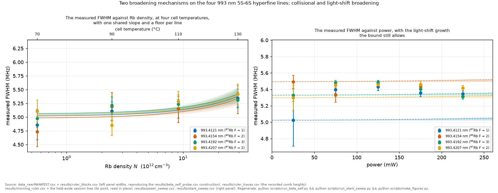

# Results ledger (generated, do not edit by hand)

Generated by `scripts/make_results_ledger.py` from the committed `results/*.csv`. Regenerate it after the pipeline. Every result value here is read from an output file or computed from one in this generator, so it cannot go stale against the code (approximate narrative scales carry a ~). Absolute numbers are preliminary where noted, because they ride on the beam waist $w_0$, which this dataset does not itself re-measure. Frequencies are transition-axis unless a `_LASER` note says otherwise.

> **The dominant systematic is the beam waist $w_0$. It is a measured value on this apparatus lineage, and what this dataset cannot do is re-measure it, because the transit width and the laser width are degenerate through it. A fresh beam profile (knife-edge and/or camera) in a fixed-lock session would confirm it, and that session is proposed rather than scheduled.** At the old 32 µm nominal the natural width convolved with the transit kernel alone already exceeds the observed ~5.25 MHz line in the thin single-waist limit, though over a realistic multi-mm collection column that margin narrows and the line alone no longer decides it. The independent 64 µm waist measurement (Nieddu/Rajasree) is what makes the exclusion safe. Since v3.0.0 the analysis uses it: $w_0$ is **64 µm** (band 62–68), taken from the lineage measurement rather than inferred from our own line, and the retro ratio is assumed at $\rho=0.94\pm0.04$. Every $w_0$-conditional number below (the $\beta_\text{self}$ and $\sigma_\text{laser}$ bounds, $S_0$, the $w_0$-band) has been re-run at the measured value. They stay preliminary and $w_0$-conditional because the transit versus $\sigma_\text{laser}$ degeneracy means the line in the dataset cannot pin $w_0$ itself, which is the beam-profile measurement's job. An earlier note inferred $w_0\approx90$ µm from a second (spurious) factor-of-2. It is retracted, see [docs/notes/transit_width_resolved.md](notes/transit_width_resolved.md) and [docs/literature_food_for_thought.md](literature_food_for_thought.md).

## C1. Collisional self-broadening $\beta_\text{self}$

*Every width this bound is built from, on one pair of axes. The density lever runs 52.5-fold across the plot while the widths move by very little, and the scatter within one density is between blocks rather than within them. That relation, not any single fit, is what makes the coefficient below a bound and a floor rather than a resolved slope.*

**The headline bound is the pooled one: below [0.030](../results/beta_self_probe.csv "ref:beta_self_probe:pooled_slope::bound95_nscale") MHz per 10¹² cm⁻³ at 95%**, one shared slope across the four lines with per-line floors, a construction preregistered before computation and accepted on its adjudication ([the prereg](notes/beta_self_pooling_prereg.md), with the pooled-first headline fixed by that decision). The physics licence: the four lines are hyperfine components of one parity-forbidden transition seeing the same R⁻⁶ collision physics, and the data agree (per-line vs shared ≤ 1.1σ, isotope split null).
**The per-peak range 0.03–0.05, floored at the loosest (below 0.05), stands beside it as the geometry-robust floor.** Three fitted estimators of the same quantity under different $\sigma_\text{laser}$ treatments span a **factor ~4** (0.01–0.05). That model-dependence is larger than any single fit's error bar, and the fits are preliminary cross-checks pending a fixed-lock session.

| estimator | value (MHz per 10¹² cm⁻³) | status |
|---|---|---|
| pooled shared slope, per-line floors (95% bound, preregistered) | below 0.030 | **headline bound** |
| model-independent width-slope (95% bound, per peak: $t(2)=2.92$ × syst, then ×1.2 density-scale) | 993.4121 nm below 0.04, 993.4154 nm below 0.05, 993.4192 nm below 0.03, 993.4207 nm below 0.05 | per-peak floor (geometry-robust) |

> Bound construction (corrected 2026-07-16 with two coverage fixes, headline promoted to the four-point 70/90/110/130 °C construction 2026-08-02, see below). (i) **Student-t, not 2σ:** the between-block scatter that dominates the slope error is estimated on only **2 residual degrees of freedom** (4 density points, 2 fit parameters), so a one-sided 95% needs $t(0.95, 2) = 2.92$, not the Gaussian-asymptotic 2 used before. The old “≈2σ” bounds (0.07–0.15) under-covered, which is why they were always flagged with a ~factor-2 own-uncertainty, and the t-quantile formalizes exactly that. (ii) **Density scale:** $\beta \propto 1/N$, so the ~20% spread between published vapor-pressure correlations moves every $\beta$ by 20%. The cold-spot direction makes the fitted $\beta$ an underestimate, so the bound is inflated on the + side (×1.2, `density.py`). **The per-peak spread is systematics, not physics:** the bounds track each peak's `resid_rms` (0.16/0.25/0.14/0.18), not a physical rate, and all four have SNR below 2 (none resolves collisions). Because the minimum of noisy low-information estimates is the down-fluctuated one, the **loosest** peak is the single-number floor to quote, and taking the tightest would be selection bias. Quote the range, floor at the loosest. (iii) **What the 95% conditions on:** the t-quantile covers *exchangeable* between-block scatter. A *monotone* session drift aliased onto the monotone T-vs-time acquisition would bias the slope with a sign no scatter quantile covers, and the per-peak `monotonic` flags (2/4 peaks non-monotonic) cannot discriminate that confound. It is held by reporting a bound at all, not by the quantile (`beta.collisional_slope` docstring). **The 130 °C point is now in the headline (2026-08-02).** Earlier releases kept the 70–110 °C three-point construction as the headline and folded 130 °C in only as a separate, non-headline probe variant, reasoning it might be a different apparatus configuration (a power sweep, calibrated off before/after modulator brackets rather than the temperature session's own per-block ruler). Confirmed from recollection (RECOLLECTION, no contemporaneous record) that the 130 °C power-sweep session ran in the same optical and cell configuration as the temperature sweep. What differs is the acquisition epoch and the axis calibration, and `load_t_rates` already calibrates each session from its own rate source before the two are combined onto one density axis. The recovered clock also places 130 °C 2.3 h before the 110 °C dwell, inside the same continuous campaign, while the 9.6 h break falls *between* 110 °C and 90 °C, so the 130 °C point was never the outlier in elapsed time either. Folding it in stretches the lever from ×16.2 to ×52.5 and tightens the bound roughly an order of magnitude. There is no separate three-point construction kept alongside it (`scripts/run_beta_self.py`, module docstring, and `docs/RESEARCH_DECISIONS.md`).

| per-peak fits ($\sigma_\text{laser}$ free per peak) | 993.4121 nm 0.016(1), 993.4154 nm 0.018(1), 993.4192 nm 0.013(1), 993.4207 nm 0.018(1) | preliminary (993.4207 nm ~1.6σ above 993.4121 nm) |
| hierarchical ($\sigma_\text{laser}$ shared per temperature across peaks, $\beta$ per isotope) | 85Rb 0.053(4), 87Rb 0.053(5) | preliminary. The (·) is **statistical only**, and the dominant systematic (the unverifiable per-temperature timing assumption, below) is unquantified, so this is not a percent-precise measurement |

> Why the hierarchical $\beta$ can exceed both per-peak values (not a contradiction): it is not a pooling of them. Sharing one $\sigma_\text{laser}(T)$ across the four peaks pins the laser width lower at high density (110 °C), so more width is assigned to collisions than when each peak floats its own $\sigma_\text{laser}$. But that per-temperature sharing **assumes the four peaks at a given temperature saw the same laser width**. Its usual justification, that they were acquired close in time, is measurably false. The recovered clock (`data_recovered/CLOCK.csv`) dates the four peak-blocks of each dwell **54–76 minutes apart** (76 min at 70 °C, 54 min at 90 °C, 65 min at 110 °C), not minutes apart. What the clock also shows is that the widths do not track that elapsed time. The pooled dwell-centred correlation of block FWHM with acquisition time is $r=+0.18$ ($p=0.6$, n=12), and of the position jitter $r=+0.19$ ($p=0.6$), so sharing is not *refuted* either. It is simply **untested by a design that spread the peaks over an hour**, on 12 points with no power to resolve a slow width wander. So the hierarchical 0.053 stays conditional on an **acquisition-timing assumption the record can now date but not validate**, which is the real reason it is a cross-check while the pooled bound heads the table with the per-peak floor beside it, rather than merely that it is optimistic. (A fixed-lock session's fix is cheap and already in the plan: interleave the four peaks within minutes, not across an hour.) All fit errors are marginal (full covariance), folding in the $\beta \leftrightarrow \sigma_\text{laser}$ anticorrelation, and the estimator spread is the additional model systematic.

> **The lever cross-check (`run_lever_crosscheck`) is a lever-limited cross-check estimator, not the headline $\beta$.** *(Renamed from the misleading `definitive_fit`. It is a cross-check, so do not grab `lever_crosscheck.csv` as the headline. That is `beta_self_probe.csv`.)* The pooled bound (top row) is the headline, the width-slope floor beneath it. This row is the internally-consistent **70/90/110 °C cooling-sweep** joint fit (one session), whose central value the lever test below shows to be a *bound*, not a measurement. It uses the Lehmann-cusp transit, the **established** Biraben–Cagnac kernel (Appendix B), so a physics choice rather than a coin flip. The Gaussian/Voigt alternative is the deliberate cusp-free *null*, and its $\beta$ spread is the model-form bar. Sharing is per-temperature $\sigma_\text{laser}$, which the sharing check (C2) finds consistent in sample. Its statistical precision and audited systematics per isotope:

| isotope | $\beta$ | statistical | model-form (transit / sharing) | $w_0$-band | drop-a-peak |
|---|---|---|---|---|---|
| 85Rb | 0.0534 | ±0.0043 | ±0.014 (0.014 / 0.001) | [0.052, 0.056] | 0.0070 (peak 4192) |
| 87Rb | 0.0534 | ±0.0047 | ±0.016 (0.014 / 0.002) | [0.052, 0.056] | 0.0040 (peak 4207) |
> **Read the $\pm0.005$ as this estimator's precision, not $\beta$'s.** It is the cooling-sweep joint-fit covariance, but $\beta$ rides on only **three density points**, so the slope lever is fragile (few effective degrees of freedom, heavy-tailed, the same ~factor-2 own-uncertainty the model-independent bound carries), and the **lever test below moves this central value by $\sim8\sigma$**. So 0.053 is a bound wearing an estimator's error budget. Treat it as the short-lever end of a lever-dependent range (per-condition ~0.01 rising to 0.053 on the cooling sweep), and the $\pm0.005$, model-form and $w_0$ bars as the precision and systematics *of this estimator*, which do not span the bound. The headline number stays the top-row width-slope bound.

> Per-drop detail is committed (`beta_loo_drop` and `sigma_loo_drop` rows). Dropping the 993.4207 nm suspect moves $\beta_{87}$ by -0.0040 (below its statistical error) and leaves the $\sigma_\text{laser}(T)$ pattern intact ( against  with all peaks). The suspect drives **neither** the coefficient **nor** the $\sigma_\text{laser}$ trend, whose 110 °C dip the sharing check already attributes to the $\beta\leftrightarrow\sigma_\text{laser}$ degeneracy. The same holds for every other single-peak drop.

> The **$w_0$-band is the largest systematic** (the waist band, which the beam-profile measurement collapses), then the transit model-form (Lehmann cusp against Voigt). The $\sigma_\text{laser}$ A-against-B *sharing* choice is minor: per-block (Model B) gives $\beta_{87}=0.051$ against per-temperature 0.053, agreeing to ~0.002, so the per-temperature headline (the physically motivated choice, and the one the sharing check finds consistent) is *robust to the sharing choice*. **Drop-a-peak is small.** No single peak, including the 993.4207 nm suspect, drives $\beta$. (Drop-a-*temperature* is large, up to 0.13 if present, but that is expected **lever leverage**: removing one of only three temperatures shortens the density arm, so it is a sensitivity diagnostic rather than a robustness failure.) A synthetic-injection closure (`tests/test_lever_crosscheck`) confirms the 20-trace machinery recovers a known $\beta$.

> **Lever test. $\beta$ is reported as a bound because $\gamma_\text{coll}$ barely grows with density.** Adding the curated 130 °C anchor (`serves_t130`, 225 mW, density lever $\times16\to\times53$) pulls the joint $\beta$ to [85Rb 0.020, 87Rb 0.022], well below the cooling-sweep 0.053 and larger than every error bar above. This is **not** one bad block. The per-condition $\gamma_\text{coll}$ rises only ×1.5 across the ×52 density span (70→130 °C), and the 130 °C widths sit *on* that near-flat trend, whereas a real binary-collision width is **linear** in $N$. So the fitted $\gamma_\text{coll}$ is a residual **floor**, not resolved collisions, and the apparent $\beta$ shrinks as the lever lengthens (per-condition $\beta$ is only ~0.01, and the joint 0.053 is inflated by the $\sigma_\text{laser}$ sharing). That is precisely why $\beta$ is quoted as a bound. The 130 °C block is not a separate session, since the recovered clock puts it 2.3 h from the 110 °C dwell inside one campaign, but it *is* the extreme end of the lever, so folding it in moves the answer by leverage. A fixed-lock session needs *interleaved* high-density points to resolve any real collisional slope.

*Lifted by:* a fixed lock (which removes between-block laser drift) plus a beam-profile $w_0$ (knife-edge and/or camera, which sets the transit subtraction), giving a clean measurement.

## C1b. The laser kernel, and what freeing it costs $\beta_\text{self}$

The kernel is a **model form**, and on this dataset it is also a measurement. Freeing a Lorentzian-equivalent laser width alongside the Gaussian one is preferred at every peak by a nested likelihood ratio with one parameter on its boundary, and the inverse-variance mean across peaks is $\Gamma_{L,\text{equiv}} = 0.398352$ MHz, and that mean is never quoted alone: the four per-peak values span **0.315 to 0.449 MHz** and a common scalar is neither rejected nor established, at **p = 0.097** (`results/kernel_k3.csv`, `results/kernel_budget.csv`). At a fixed condition this parameter is exactly degenerate with the collisional width, because both are Lorentzian and Lorentzians add, so it is identified only across the density ladder.

- $U_\text{statistical}$ = 0.001398, $U_\text{kernel}$ = 0.004530, both in MHz per density unit and on the same one-sigma-like footing, giving **$R_\text{kernel}$ = 3.2398**. The kernel systematic dominates the statistical error, so repetitions of the current construction no longer buy the coefficient.

- Freeing the kernel moves $\beta_\text{self}$ by 42 to 66 per cent across the four peaks, which reproduces from a freeing construction the 45 to 67 per cent this record already carried from a switching one.

- **The origin is not settled by any of this.** A non-Gaussian homogeneous component is present. Calling it the laser is a separate arrow, and the transfer that would carry it is classified `NOT_ESTABLISHED` for the measurements already taken (`results/kernel_k5.csv`). The routes that would close it are ranked in `results/kernel_k7.csv`.

## C2. The 2025 laser-epoch Gaussian width $\sigma_\text{laser}$

**What this bounds, and what it does not.** The parameter carries the name `sigma_laser` in the code and the fit, and what it measures is the GAUSSIAN WIDTH LEFT OVER once transit is removed at the measured waist. It is not a laser measurement. Three independent pieces of bench evidence put the laser far below this bound: a wavemeter record taken mid-acquisition holds a 100 kHz standard deviation over 24 minutes, the comb read as a clock bounds the non-repeating excursion below 28.3 kHz on the transition axis, and the previous generation of this laser at about 100 kHz produced a line of 4.9 to 5.2 MHz on the TRANSITION axis, 2.4 to 2.6 per photon, where the 2025 line sits at about 5.25 and where a 2.4 MHz line would be narrower than the 3.49 MHz natural width and so impossible. So roughly a megahertz of Gaussian width is unaccounted for, the record's leading candidate is residual Doppler from a retro tilt of 3.2 to 3.5 mrad, and the independent laser measurement that would separate them is the top-ranked lever of the next campaign.

- **< [1.2](../results/laser_epoch.csv "ref:laser_epoch:sigma_laser_bound:over_w0_band") MHz (laser axis)**. One-sided upper limit, so the value is the limit itself and carries no plus-or-minus. Taken over the measured w0 band (62-68um) and rising with w0, reaching zero near w0=16um, so it is formally unconstrained below and quoted to one significant figure for that reason. Conditional on w0=64um, which is measured on this apparatus lineage but not re-measured by this archive
- Degenerate with $w_0$ through the transit kernel: the transit adds ~2.1 MHz at $w_0=32$ µm (which overshoots the observed line, so 32 µm is excluded) and ~0.93 MHz at the 64 µm measured waist. More transit leaves less width for the laser.
*Lifted by:* a beam-profile $w_0$ (knife-edge and/or camera) plus a direct linewidth measurement in a fixed-lock session.

## C3. Power sweep, tested against the ramp-law predictions

- **C3a linewidth, no power trend:** inflation 3–8% across 25–225 mW, non-monotonic (block scatter, not power broadening). **Tested 2026-08-18 and it holds.** A concave curvature fitted to the same widths reaches 4.8 standard deviations on within-cell errors and falls to **1.4** under the between-block treatment this record's own width channel uses, and neither independent power ladder confirms it: the 2025-07-17 pilot's non-monotone ladder gives the same sign at 1.2, and in the 2025-07-04 rehearsal a width trend appears on the descending ladder while both ascending ladders show none, which is an order-dependence signature rather than a power dependence. The concavity is therefore provisional and is not an established physical effect. Both sessions sit outside the frozen archive for epoch and instrument reasons rather than any data defect.
- **C3b amplitude near $P^2$, and three of the four slopes are not consistent with 2:** log-log slopes 1.83–2.12 (the two-photon rate law). **Corrected 2026-08-18**: these were narrated as a band and never tested against 2. Under a block bootstrap over the power cells that respects this sweep's power-time collinearity, 993.4121 nm at 1.831 excludes 2 from below while 993.4154 nm at 2.121 and 993.4192 nm at 2.116 exclude it from above, and 993.4207 nm at 2.100 becomes consistent with 2 once the block treatment replaces the within-cell error. **The departure Replicates and is invariant under acquisition order**: the 2025-07-04 rehearsal ran its ladders in alternating directions on one scope at one gain, and its three exponents of 2.244 descending against 2.228 and 2.070 ascending place the descending peak inside the ascending spread. Across the two sessions the peak ordering is identical at a rank correlation of 1.00, and that ordering follows line brightness rather than hyperfine branching, so the departure is a signature of the detection rather than of the transition. Reading the raw files directly found the mechanism candidate: the vertical range was changed at every rung of every ladder, by up to a factor of 596 in quantisation step against an 80-fold signal span, so a power ladder here is five measurements on five instrument ranges. See [the amplitude departure note](notes/amplitude_departure_from_p2.md). The power slope is immune to radiation trapping (even at the thick τ/cm ≈ 160), because the trapping optical depth is set by the ground-state density, which the weak two-photon excitation does not deplete, so the trapping factor is power-independent at fixed temperature and rescales the amplitude without bending the log-log slope. (Ground-state non-depletion is the operative condition, not a linear-reabsorption assumption.) That immunity is an argument rather than a test: the dataset's sweep is single-temperature (130 °C, one $\tau$), so the slope against $\tau$ cannot be checked, and multi-temperature power sweeps in a fixed-lock session would check it. The low slope on 993.4121 nm (1.83) is unresolved: dim-line SNR bias at 25 mW, genuine saturation, or a weak power-dependence of trapping at the thick end are not separable from one single-temperature sweep.
- **C3c. The ramp asymmetry is a bound, and the significant low-power skew in `power_sweep.csv` is shot noise rather than the ramp.** These are two distinct quantities, and conflating them is a trap. (i) The **ramp** skew (the asymmetry coefficient of the fitted ramp⊗core profile, $\propto S_0^3$) is below the SNR floor at ≤225 mW, so it is an **upper bound**, consistent with zero, as the corrected physics requires (the ramp's first-order shift is absorbed by the per-scan free centre, see `docs/THEORY_NOTE.md`). (ii) The committed `resid_skew` column is a *different* thing, the residual skewness of a **symmetric**-model fit. It is large and positive at low power (up to **9.8σ** at 25 mW on 993.4154 nm, 0.346±0.035) and **falls** with amplitude as $\sim \mathrm{amp}^{-0.5}$. That is the Poisson **shot-noise skewness** (the noise is right-skewed $\propto 1/\sqrt{\text{counts}}$, positive, vanishing as the line brightens), a statistical artifact of the noise rather than a physical line asymmetry, and it carries the *opposite* power dependence to the ramp ($\propto P^3$ growth). So the excursion is real but identified: `resid_skew` is a shot-noise-dominated diagnostic, not a ramp signal, and it is why the dataset's skew cannot serve as a ramp measurement. (Measured across the four lines, the amplitude exponent is $-0.404 \pm 0.091$ with a line-to-line scatter of 0.181, `results/skew_scaling.csv`. Testing each hypothesis by simulation rather than from the fit covariance, which describes the spread at the fitted exponent and not at the excluded one, shot noise ($-0.5$) is consistent at $p = 0.083$ while a fixed-absolute-amplitude term ($-1$) is disfavoured at $p = 0.011$. So shot noise remains the leading reading and the alternative the measurement plan carried is the one the data argues against) A fixed-lock session would lift the real observable two ways: the fixed lock un-absorbs the large first-order pull, and the small waist ($S_0$ 0.36 → 5.8 MHz at 225 mW, 16 times larger at the 16 µm configuration than at the measured 64 µm) makes the ramp asymmetry a detection. The naive $S_0^3$ reading is replaced, because the axial average changes the third cumulant's magnitude and, past $Z_c/z_R\approx1.12$, its sign (see `docs/PLAN.md`). Which side of that crossover each configuration sits on is set by $Z_c = L_\parallel/2M$, and that is now largely pinned: the cathode sits long axis along the beam, so $L_\parallel = 12$ mm and $Z_c = 6/M$ mm, and the detector is not re-oriented between configurations. The two-waist sign flip then holds for every $M$ from 0.5 to 6, so it no longer waits on measuring the geometry, and only its magnitude does ($u$ and $v$ are still unmeasured, and $M\approx2.5$–3 by estimate puts the record at $Z_c\approx2.0$–2.4 mm, below the crossover, with the small-waist configuration above it). It is conditional also on **two** same-sign small-waist corrections that suppress the skew and must be fit jointly, the beam-divergence axial average (the larger, sign-flipping one) and the standing-wave fringe-resolved tail (~26-28% of the intrinsic +0.566 ramp skew at 16 µm, `results/fringe_tail.csv`). **And on a third, found 2026-08-10, which is the largest of them at the small waist:** the $\propto I^2$ signal weighting the whole ramp law rests on is a weak-field statement, and the saturation parameter scales as the fourth power of the inverse waist, so it runs from 0.033 at the measured 64 µm to 8.5 at 16 µm. Re-integrating the moments with the saturated weight moves the predicted axial skew at 16 µm from $-0.36$ to $-1.07$. The sign flip survives that, and the magnitude does not, so the small-waist prediction is uncertain at the factor-of-three level for a reason that is a modelling assumption rather than an unmeasured input. See `docs/THEORY_NOTE.md` §2.0a and `docs/notes/running_wave_and_waist_design.md`.

- **C3d. The AC-Stark coefficient from the power lever is an upper bound, $S_0$(225 mW) below 0.63 MHz (95%, over-dispersion-adjusted profile likelihood, the C3f construction), sitting above the predicted band 0.32–0.40 MHz** (`run_stark_sweep`, the power-lever twin of the $\beta$ fit). One shared $\kappa$ ($S_0=\kappa P$) is fit to the four peaks' FWHM-against-power (each floating its core width). The ramp broadens the line as $\sim S_0^2$, the only live handle since the *shift* (pull $\sim S_0$) is dead in the 2025 drift. The fit ($S_0(225) = 0.00$, $\kappa$ consistent with zero) is **not** a measurement. It **brackets** the prediction. The bound and the prediction are independent by construction: the bound uses only the width-against-power data (no $w_0$ enters), while the prediction is the computed polarizability at the measured $w_0$, fixed before the fit and never an input to it, so their agreement is a genuine consistency check. That independence is from the density lever and the polarizability, **not** from the lineshape model. Like the $\beta$ *fit* (rather than the model-independent width-slope bound that heads C1), the $\kappa$ fit forward-models each line through `model_profile`, so this bound is conditional on that spectral model. The prediction is not a point but a **band**: the 0.32–0.40 MHz spread is $S_0$ over the measured $w_0$ band 62–68 µm ($\propto 1/w_0^2$, central 0.36 at the measured 64 µm) folded with $\rho=0.94\pm0.04$, the assumed retro ratio ($S_0\propto(1+\rho)$, measured in situ in the next campaign, see `docs/PLAN.md`), under the field-intensity convention pinned in `docs/THEORY_NOTE.md`. **The construction of the 95% is load-bearing and documented:** the best fit rails at $\kappa=0$, where the width handle ($\propto S_0^2$) has zero gradient, so a linearized (Wald) $\kappa+1.645\sigma$ bound has no valid coverage there, its $\sigma$ being a finite-difference artifact (the replaced Wald numbers, 1.1 raw and 2.2 inflated MHz, stay in the CSV as diagnostics). The quoted bound is instead a **profile-likelihood** limit: $\kappa$ is scanned upward with the per-peak cores re-minimized at each point, and the limit sits where $\chi^2$ rises by $2.706\times\chi^2_\text{red}$. That threshold scaling carries the over-dispersion ($\chi^2_\text{red}\approx3.7$, block-to-block width scatter) into the bound conservatively, though as one global factor: it treats the over-dispersion as homogeneous across the width points, while the scatter is block-level. A preregistered 1000-resample block bootstrap scored this construction (notes/s0_block_bootstrap_prereg.md, 2026-08-07): the percentile bound of the resampled minimizers lands 2.4x below, and the median raw-profile bound under resampling reproduces the committed value, so the global factor is conservative against the sharper estimator and calibrated at its median. **That 2.4 is a literal in this generator and no `results/` row holds it**: the bootstrap producer writes one row per resample to a run log outside `results/`, by its own design, which was DIAGNOSTIC until the postscript adjudicated and was never promoted afterwards. So the factor is reproducible from retained data and is not checked by the freshness machinery that guards every other number on this page. The result says the bound sits above the whole prediction band, so this power-lever construction excludes none of it and zero remains allowed. Read that as a bracket, not a sensitivity claim: the predicted effect at 225 mW is ~0.09 MHz against a single-block width scatter of 0.088 MHz, so the bound is produced entirely by averaging over blocks, and the resolving-power check finds that averaging assumption untested (permutation p = 0.21, neither established nor excluded). **The bound is also known to be conservative by a measured factor, not by argument:** two effects carry the same $P^2$ signature as the ramp and were absent from this forward model, atomic saturation (the larger, about 3.7 times the ramp at the predicted $S_0$) and hyperfine pumping by the real cascade. Injecting the saturation term and re-profiling moves this bound from 0.6325 to about 0.23 MHz, a factor 2.8, and the joint C3f bound by 2.21. **The 2.8 now has rows** in `results/saturation_companion.csv`, which carries the reproduced committed bound, both saturated bounds and the factor at both saturation arms (2.75 at each), regenerated and checked like any number here. **The 2.21 does not, and cannot from this repository**: the joint fit reads two data trees held outside it, so that factor comes from a run on 2026-08-10 where they were present and is recorded as a classification rather than as a computed row. It is not withdrawn and is not known to be wrong. Neither committed bound moves, because the injected law is the two-level homogeneous form used with a two-photon Rabi frequency, which is standard but an approximation rather than a derivation here (`docs/notes/two_photon_saturation_companion.md`). *Lifted by:* a fixed lock would measure the pull $\sim S_0$ directly, and the small waist would make $S_0$ several-fold larger, turning this bound into the coefficient.

- **C3e. The centre channel cannot measure the pull, and the failure is unidentifiability rather than imprecision** (`run_stark_centres`). The AC-Stark shift moves the line centre as $\propto S_0$, which is a stronger dependence than the width's $\propto S_0^2$, so the centres ought to be the better channel. They are not, for a reason that is a design fault and not a statistical shortfall. Peak positions are only frequencies within a *display epoch* (a run of unchanged scope horizontal position, see `run_laser_history`'s retraction), so each epoch carries a free offset. Of the 26 epochs covering the power sweep only **three** contrast two powers at all, each a 50 mW step, and no epoch spans two lines. Inside those three, power still descends with time, exactly as the campaign was run. Fitting a shared pull against three drift forms therefore gives $|S_0(225\ \mathrm{mW})|$ below 9.49, below 14.57 and below 17.65 MHz for linear, one-exponential and two-exponential drift, and the pull's **sign flips** between the first two (+3.4 against -3.3 MHz/W) while the bound degrades monotonically as the drift model gains freedom. A merely imprecise parameter does neither. The best of the three is 15× weaker than C3d's width bound, so the width channel carries the light-shift information and the centres carry none. It is tagged a null, not a bound. **The design consequence is the deliverable:** cycle or randomise the power ordering so drift is orthogonal to the pull, *and* leave the horizontal position alone, or log it, because every move severs the centre record. A replaced version of this bound, below 7.3 MHz, was tighter only because it differenced positions across those moves. (That retracted bound is unrelated to the dimensionless drift-freedom factor [7.3](../results/centre_fisher.csv "ref:centre_fisher:inflation_linear_over_constant:measured"), which shares its digits by coincidence.) **A second, stronger attempt failed on the signal's own shape.** Referencing each centre to its own display window (the peak position minus the window start) is immune to the horizontal-position moves and collapses the campaign scatter from 7.75 to 0.28 MHz. Fitting a pull on it returns $S_0(225) = +0.89\pm0.27$ MHz, apparently $3.3\sigma$. It is not one. An AC-Stark pull is **linear in $P$ by construction**, and free per-rung offsets reject linearity at $F(3,91) = 4.49$, $p = 0.0055$: the rung means are non-monotone (+0.243 MHz at 25 mW against −0.137 at 225 mW, so the highest power sits above the middle ones). Dropping the 25 mW rung leaves $+0.10\pm0.22$ MHz over a threefold power range. That rung is also the worst to lean on: SNR 18 against 193, scatter 4.6× larger, and the only level where the sweep retrace makes a second above-half-max region (8 of 20 traces, against 0 of 79). The apparent significance is inflated besides. The 99 traces are 20 conditions of ~5 repeats, intraclass correlation 0.38, and a block bootstrap gives $[-0.31, +1.86]$. This is not the estimator's fault, since five independent centre estimators agree to ±0.02 MHz.

- **C3f. The joint three-session fit puts the light-shift bound at $S_0(225\ \mathrm{mW})$ below [0.26](../results/stark_joint.csv "ref:stark_joint:S0_225mW_ub95:primary") MHz** (`run_stark_joint`, 95% one-sided profile likelihood at the unscaled 2.706 threshold. The over-dispersion widening of `rb5s6s/stark.py` belongs to C3d's width-only bound, not to this joint construction, a misattribution caught on 2026-08-04 and this sentence corrects).

  Instead of C3d's 20 summary widths, every point of every canonical power-sweep profile enters a joint maximum-likelihood fit, 100/46/26 traces across three sessions, with one shared $\kappa$ ($S_0=\kappa P$), per-peak physical widths under a $\gamma_\mathrm{coll}$ prior from the record's own $\beta_\mathrm{self}\times N(130°C)$ chain (`gc_priors()`, `run_stark_joint.py`), per-trace free centres (drift and re-locks are profiled out exactly, not modelled), and a per-session detector-saturation nuisance that fits linear, which is the instrument's receipt.

  The first is the campaign's canonical power sweep, the hundred traces of the count above. 

  The second is the 2025-07-04 LeCroy evening session (46 usable traces at 90/180/270 mW), whose 270 mW rung carries 1.44× the campaign's maximum $S_0^2$ lever and whose alternating ladder directions are the design the centre channel demanded. Its auto-triggered scope randomises the sweep phase per trace, so it contributes shape and not centres.

  The third is the campaign-morning session: 26 traces on one peak at 35–210 mW and the campaign's cell temperature, on the campaign instrument twenty minutes after the ruler's commissioning, its axis riding the campaign bracket rate through a ±10% nuisance licensed by the raw width ratio (0.971 at matched conditions). Its centres also stay out: the recorded window starts step with the power changes in the pull's own direction, C3e's response-versus-relabel ambiguity in miniature. 

  The profile minimum sits at $\kappa = 0.25$ MHz/W, only $\Delta\chi^2 = 0.1$ below $\kappa=0$, consistent with no shift at all. Every quoted profile is the pointwise minimum over a cold forward chain, a backward chain, and a chain seeded from the minimum search (addendum 24: a cold-start chain parked 283,000 units above the local minimum in this very run, and the seeded twin is what disarms that failure mode). 

  Against $S_0(225) = 0.35$ MHz predicted at the measured $w_0=64$ µm with $\rho=0.94$, the fit gives 1.3× less. **Both cells in that comparison are pre-adjudication**, computed at the cited 1093 a.u. rather than this record's own 1145. The current pair is 0.364 MHz and 1.4×, carried by `results/stark_sweep.csv`, and the joint fit's own prediction cells wait on a five-hour refit. The spread across data subsets is the dominant systematic: 0.26 MHz from all three sessions, 0.15 from the campaign rows alone, 0.24 with the red-wing nuisance marginalized, and 0.37 with peak 4192 dropped (which removes the entire campaign-morning session). An identical-input rerun of the full construction reproduces its primary and every subset bound to the printed digit ([the reproducibility preregistration](notes/m28_reproducibility_prereg.md), adjudicated branch one, 2026-08-06), so the subset spread is not chain variance at fixed code. **A movement under later code was measured 2026-08-14:** rerunning this construction on the same raw traces moved its campaign-only bound by a third, and the same test on the sibling full-dataset construction moved both of its single-session subsets by a comparable amount in the opposite direction. **CAUSE IDENTIFIED 2026-08-20, and the inputs were not identical after all.** A commit sweep across the range, holding one environment, found the construction's POINT COUNT changing at a single commit, 247783 to 247788 at an unchanged 172 traces. That commit renamed a vocabulary across the tree and regenerated the committed ruler CSVs as a side effect, moving fitted ruler rates in their eleventh digit. A frequency axis shifted by 1e-11 moves a DISCRETE trim boundary across a sample edge in a few traces, and 5 samples enter. Chi-square at fixed kappa moves 6 parts per million. The code itself is BIT-STABLE across the range: six commits spanning nine days return the same chi-square to the last printed digit at a common grid point, and the two on the far side of the boundary agree with each other, so the only thing that moved in nine days of development was the input set. That 6 ppm is what the well-conditioned quantities absorb and an ill-conditioned subset column read off a nearly flat profile need not. So the movement is a real input change rather than an arithmetic defect. Whether 5 samples account for the whole reported third, with that column's own ill-conditioning as the candidate amplifier, is still being measured. The primary bound is untouched either way, and the phrase byte-identical belonged to the raw traces and not to the fit's inputs. **A DIFFERENT open question about this bound was closed on 2026-08-19 and is recorded here because it was the more alarming of the two:** a multi-start test had appeared to show independent optimisations disagreeing about the bound by a factor of two, and that reading was an artefact of the diagnostic's own display normalisation. Its curves were stored each against its own minimum, a form in which curves cannot be combined, and the instrument's raw output carries absolute $\chi^2$. Anchored, the five independent starts sit 4.66 to 26.29 ABOVE the production optimum at every coefficient value tested, all past the 2.706 threshold, so none enters the confidence region and the production chain is pointwise-dominant everywhere tested, in the environment of record. This does not settle the code-version question above, which is about a different comparison. Those subsets are partial $\chi^2$ columns of the same profile the primary is read from, not separately optimized fits, so the seeding and pointwise-minimum discipline protect the total while the split between sessions inherits whichever converged point that chain reached. With the total this flat in $\kappa$ the split is the loose part. Read those two as a robustness range of about that resolution rather than as separately quotable limits. The primary and the campaign-only subsets sit below the prediction. The drop-4192 subset does not, so the margin is read from the primary alone: the predicted $\kappa$ lies above the 95% limit with $\Delta\chi^2\approx4$, and the limit lies below the ENTIRE predicted envelope, 1.404 to 1.760 in $\kappa$ over the stated waist and retro band, so on the full three-session fit the prediction is excluded at 95 per cent at every geometry in that band.

  **Two things qualify that.** First, the strength is a RANGE and not a number: $\Delta\chi^2$ runs 4.1 to 5.7 across the envelope, 2.0 to 2.4 $\sigma$ under Wilks, and the same profile read as a posterior puts the computed 1145 a.u. in the upper 3 per cent, about 1.8 $\sigma$. A single calibrated two-sigma is what is withdrawn, not the existence of a significance. Second, and this is the larger qualification, **on THIS construction the exclusion does not survive leaving one peak out.** At the predicted $\kappa$ the leave-one-out $\Delta\chi^2$ are 8.75, 2.27, 1.12 and 0.61 for 4121, 4192, 4154 and 4207 against a 2.706 threshold, at the PRE-ADJUDICATION kappa_pred of 1.545 and not at this record's own 1.618. **No count of arms is quoted, because the count is not stable across that gap.** Each arm is a fit with one peak REMOVED, measured against its own minimum, so the arms do not share the full profile's derivative. Carrying them to 1.618 needs no curvature model. Each arm's own committed pair, at 1.545 and at 2.62, brackets it between its value at 1.545 and that value plus its own secant slope across the gap, giving 4121 in [8.75, 10.05], 4192 in [2.27, 2.77], 4154 in [1.12, 1.35] and 4207 in [0.61, 0.86]. So 4121 clears at both ends, 4154 and 4207 fail at both ends, and 4192 straddles the threshold and is not callable. The bracket uses only committed rows and no model of the profile's shape. **And the fuller construction is the robust one**: the full-archive fit over both ladders ([`full_dataset_fit.csv`](../results/full_dataset_fit.csv)) puts the limit at $\kappa \lt$ 0.944, gives $\Delta\chi^2$ of 6.5 to 10.5 across the same envelope, 2.5 to 3.2 $\sigma$, and ALL FOUR of its leave-one-out arms clear the threshold at 3.17 to 11.48. So the fragility above is a property of the three-session construction and not of the exclusion, and the record's own standing rule is to present the fullest model. **That construction carries a FAILING gate of its own and it is quoted here and not left in the file**: `full_dataset_fit.csv`'s `gate_B4_prior_tension` reads FAIL at 3.78 against a $\lt$ 3.0 $\sigma$ criterion, the largest posterior-minus-prior discrepancy across the four peaks, and its preregistration says that above three the fit and the four-point measurement disagree about the same quantity and it is reported and not averaged away. The tension sits on $\beta_\mathrm{self}$, which is degenerate with the width channel this bound is read from, so nothing here calls that fit robust without naming B4 in the same breath. **And the same criterion applied to THIS construction fails harder, on the same peak.** `run_stark_joint` computes no gates, but its own committed `gamma_coll_post` cells against the same beta_self priors give 2.13, 0.82, 4.65 and 0.62 prior-sigmas for 4121, 4154, 4192 and 4207. The three-session fit the headline bound is read from sits at 4.65 on 4192, against the full-archive fit's 3.78 on the same peak. **And 4192 is the common factor in four of the qualifications above**: the prior-tension peak in both fits, the borderline leave-one-out arm in both, the drop that loosens both bounds, and the peak carrying the whole pilot session. gamma_coll and kappa both broaden the line and the only discriminant is the power dependence, so the peak whose collisional width is pulled hardest is the peak whose kappa information is least trustworthy. That is one diagnosis and not four independent caveats, and the next measurement it names is the per-temperature decomposition the full-archive preregistration already asks for. **The claim that dropping any one peak leaves the tension intact is withdrawn**: it rested on reading the four numbers as "all positive and similar" when they span a factor of fourteen. Note also that drop-4192 is called the most conservative subset only because it is the one drop given a fine $\kappa$ grid, so it is the only one whose bound can be read off at all.

  **Five wider retractions were attempted in one night and all five withdrawn**, tabulated so that none is revived.

  | attempted support | why it does not hold |
  |---|---|
  | $\chi^2_\text{red}\approx3.7$ | a property of C3d's width-only regression, never of this construction |
  | the coverage study's zeroth percentile | the same C3d bound, and already withdrawn in-record |
  | the 837-to-1038 construction spread | real and NOT a third-digit effect on the limit, but it does not bear on whether an exclusion EXISTS, since both readings put the computed value above the limit |
  | the pass-to-pass factor of two | conflates two diagnostics, one a display-normalisation artefact |
  | the drop-4192 arm alone | it lands inside the envelope, which is why the leave-one-out set and not that single arm is the qualification that holds |

  On the third row, read like for like at fixed geometry the committed spread is 1.231, about 23 per cent, and the tail probabilities differ by about a factor of two, so it is NOT a third-digit effect on the LIMIT. The 1038/837 ratio of 1.24 is not the like-for-like figure: 837 is the crossing at central geometry and 1038 a percentile with geometry marginalised, so that ratio mixes a construction change with a marginalisation.

  The measured waist is the lineage measurement, since [Rajasree 2020](lit/rajasree2020thesis.md) recorded 128 µm diameter on the same laser model, lens and geometry, so the comparison is a direct test of it. The evening-session axis-direction hypothesis moves no $\chi^2$ by more than 8.6. One piece of residual structure survived this fit: a same-physical-side near-core asymmetry in both sessions, absorbed by neither a detector time constant (killed at $+2200$ for 10 ms) nor the wing nuisance. C3g closes it.

- **C3g. The residual asymmetry is not a collisional wing, and C3f's open item is closed** (`run_wing_check`). A quasistatic self-broadening satellite is a pair effect, so its fractional weight must scale with density, and the temperature sweep holds a ×52 density lever at fixed 225 mW while the Stark wedge and any instrument asymmetry stay put. The observable is the **difference** between the two sides, red minus blue: a symmetric mismatch between the fixed transit kernel and the free core raises both wings together and is not an asymmetry, so only the difference answers the question. It returns **-0.0007 ± 0.0013** of peak at 130 °C, 0.5σ, exactly where a collisional satellite would be 52× enhanced, and no temperature exceeds 0.7σ. The power lever agrees: at fixed density the fitted fraction does not hold constant as a physical wing must, but tracks amplitude, exactly as C3c's shot-noise identification of the residual skew already said. Both levers contradict a physical wing, so the asymmetry the joint fit flagged is amplitude-linked statistics, nothing about it enters the Stark budget, and the satellite thread is closed on this record. A real satellite search needs the fixed-lock session's SNR at 150–170 °C, where this same estimator would resolve a 0.001-fraction wing at many sigma.

> **The sensitivity behind the null.** A bound is only interpretable next to the effect size the analysis could actually have caught, so the same injection-recovery machinery is run forward: the **minimum detectable effect** is $\beta \approx$ **0.015** at 50% and **0.038** at 95% detection probability (MHz per 10¹² cm⁻³). The record was therefore genuinely sensitive between those two values and saw nothing, so the null is a real constraint rather than an insensitive experiment. The per-peak floor (0.05) sits above the 95% detection point (0.038), deliberately, through the $t(0.95, 2)$ and density-scale inflations (C1). At $\beta=0$ the SNR rule alone fires 4% of the time, close to its nominal 5%, which is the calibration check on the detection rule itself.

## Sensitivity at a glance

The referee question, *what moves if an assumption moves*, in one table, generated live from `lever_crosscheck.csv` and `stark_sweep.csv` so it cannot go stale. The β_self entries are in MHz per 10¹² cm⁻³, and the full prose reading is in C1 and C3d above.

| vary this | β_self moves by (85Rb · 87Rb) | reading |
|---|---|---|
| the unmeasured w₀ (transit band, ~65→40 µm) | spans 0.052–0.056 · 0.052–0.056 | the dominant systematic, which a beam-profile measurement collapses |
| transit model-form (Lehmann cusp ↔ Voigt) | 0.014 · 0.016 | comparable to β_self itself, part of why the headline is a bound |
| σ_laser sharing (per-temperature ↔ per-block) | 0.001 · 0.002 | negligible next to the other two rows |
| the measured noise law (σ(V) ↔ uniform weights) | ≤ 0.005 · ≤ 0.002 | the weights are not doing physics, and the largest shift is on the 993.4154 nm peak |
| drop any one peak | ≤ 0.007 · ≤ 0.004 | no single line drives the result |
| drop one temperature | up to 0.13 · 0.07 | lever leverage with three densities, expected rather than fragility |
| add the ×53 130 °C lever | -0.034 · -0.032 | pulls β_self down, since the width is a floor rather than resolved collisions (C1) |

| vary this | the S₀(225 mW) bound | reading |
|---|---|---|
| the unmeasured w₀ | unchanged | the bound uses width against power only, and only the *prediction* is w₀- and ρ-conditional |
| bound construction (Wald ↔ profile) | 1.1 / 2.2 → 0.63 MHz | Wald has no coverage at the κ = 0 rail, and the profile limit is the quoted bound |
| per-peak core widths | absorbed | each peak's core floats per power, so laser-epoch drift cannot fake a κ |

## Supporting results

- **The two isotopes agree on their widths, which bounds any magnetic term carrying an uncancelled $g_F$.** A term that shifts sublevels by $g_F \mu_B B$ broadens as $g_F$ SQUARED, and that ratio is fixed by atomic structure at 2.25 between rubidium-87 and rubidium-85, so the two isotopes' widths are a null test no fit can absorb. Measured, the difference is $4 \pm 18$ kHz, consistent with zero, giving **71 kHz, at 95 per cent** as an upper limit on any such term (`results/polarisation_bound.csv`, `scripts/run_polarisation_bound.py`). It is conservative by construction, because every other isotope-dependent effect lands in the same difference. The forward-to-retro mismatch this was written for is retracted, since a degenerate two-photon amplitude is symmetric in the two beams and carries no rank 1, and what the limit now ceilings is the two-atom cooperative satellite (`rb5s6s/cooperative.py`).

- **Frequency axis:** 0.04252(5) MHz/ms laser axis. The 20 ruler blocks disagree by more than their own statistical errors ($\chi^2_\text{red}=8.0$), and the quoted error carries one PDG scale factor of $\sqrt{\chi^2_\text{red}}\approx2.8\times$ for it. A single scale factor is the wrong shape for this scatter, and the blocks reject it: the 8 power blocks over-disperse at $\chi^2_\text{red}=17.8$ against 1.9 on the 12 temperature blocks, 9.5× more, at F p = 0.0014. The error that covers the axis is `rate_err_total` at 0.205% of the rate, 1.7× the campaign statistical error alone, and that is what a consumer of the rate carries. The scatter is block level: before/after brackets drift within a session, and the measured attribution is per peak rather than common-mode. Per-peak offsets absorb half of it ($\chi^2_\text{red}$ 8.0 to 4.0, F(3,16) = 7.4, p = 0.0025) while per-session offsets absorb none (8.0 to 8.1), so the peaks move apart rather than in step. What protects a cross-peak comparison such as $\beta_{85}$ against $\beta_{87}$ is each science block using its own condition's rate, not the scatter being common-mode. The sweep is linear to below 0.3% across the well-sampled windows, which is that family's value and gate-dependent outside it (ruler specification, amendment 8). The single largest outlier is 993.4207 nm after at +1.5% from the campaign mean. Dropping it moves the campaign rate by -0.08% (0.6σ) and $\chi^2_\text{red}$ from 8.0 to 4.8: the inflation already covers it, so it stays in by the pre-registered policy of absorbing outliers rather than cutting them.
- **The comb read as a clock bounds the laser's non-repeating frequency excursion below 28.3 kHz at 0.15 s** (`run_tooth_scatter`, 95 per cent profile-likelihood limit on the transition axis, 14.2 kHz on the laser axis, best fit 8.8 kHz and consistent with zero). The EOM teeth sit at exact multiples of the RF drive, so their positions in TIME are a ruler laid down by an oscillator, and the departure of the observed positions from it is the optical frequency wandering against that oscillator during the sweep. A departure is sweep nonlinearity plus laser excursion. The two separate because the ramp repeats on every sweep and the laser does not, so the inverse-variance mean per window position is the nonlinearity, which is what `ruler_nlmap.csv` already carries, and the scatter about it is the laser. Over 509 free-fitted tooth centres from 104 canonical RF-on traces the scatter about the sweep map is $\chi^2/\text{dof} = 0.53$, so there is no excess and the bound is set by the tooth centres themselves, median error 2.25 ms. **The limit is on the NON-LINEAR part only.** A linear drift within a sweep is exactly degenerate with the sweep rate, since a laser adding $a t$ to an intended ramp $r t$ leaves the teeth uniformly spaced at $f_\text{EOM}/(r+a)$ and the fit returns $r+a$. Separating it needs the two halves of a triangular sweep, which return $r+a$ and $r-a$, and the manifest does not record sweep direction, so that separation is not available in this dataset. It is the record's only direct in-situ statement about the laser's frequency noise, and it is consistent with the epoch producer's assertion that slow drift is not what broadens the line.
- **σ_laser sharing is an in-sample consistency check, not a proof:** at 70/90/110 °C the four peak-blocks agree on one σ_laser (χ²/dof 0.27/0.58/0.33, all below 1), consistent with the per-temperature sharing the global fit assumes. Two limits: (i) agreement is **necessary, not sufficient**, because the four peaks could have co-drifted between acquisitions and still agree, and only logged timestamps (a fixed-lock session) settle it. (ii) It has been **only partly in sample since 2026-08-02**, because the check still uses only 70/90/110 °C (`run_sigma_laser_sharing.py` reads `role=t_sweep` only) while the headline fit now folds in the 130 °C point too (C1), so this check cannot speak to sharing at the one condition that carries the most leverage in the current headline. It remains a same-session, in-sample test for the three temperatures it does cover, and the 130 °C block is untested by it either way (the lever test in C1). (iii) **The test is under-powered:** χ²/dof of 0.27/0.58/0.33 are *well below 1*, so the peaks agree only within error bars that are themselves ~1.2–2.2× too large (the conservative $\tau_\text{int}$ noise inflation over-estimates them). At these χ² the data cannot discriminate shared from unshared, so the sharing is **untested** rather than merely unverifiable. It answers the acquisition-timing worry as *consistency*, not confirmation. But the *free* per-condition σ_laser is ~flat (1.5–1.7), while the β·N-tied global fit inflates it to 1.5–2.2 across the sweep. That σ_laser(T) trend is the **β↔σ_laser degeneracy** under the density constraint rather than a physical laser drift, so the trend is a model artifact and not a stale block, and it does not corrupt β (the density lever still pins the collisional slope). Reproducible: `run_sigma_laser_sharing.py`.
- **Lehmann cusp:** ΔBIC(Voigt−Lehmann) -0.1…+3.7, so no preference for the cusp (the negative end is a mild dispreference on 993.4207 nm), all far below the gate ≥10. Deciding it needs the fixed-lock session's narrow laser.
- **Radiation trapping:** amplitude ∝ N, log-log slopes 0.85–1.02 (no significant rollover), though the cell is optically thick on the D1 line (τ/cm≈1–160), where trapping redistributes rather than destroys the collected 795 nm signal. Degeneracy-breaking (peak-differential) trapping is sought and not found: ⁸⁵Rb is nominally 0.09±0.08 more sublinear than ⁸⁷Rb (right sign, ~1σ), and the 30–50% ratio disagreement below is non-monotonic in density, which points to drift rather than trapping.
- **Degeneracy law:** areas should be abundance×(2F+1) (5/3 and 7/5 within an isotope), while measured ratios swing 30–50% between blocks with drift. It is not testable in this dataset, and a fixed-lock session would interleave the peaks.
- **Dynamic polarizabilities:** an independent sum-over-states recompute of $\Delta\alpha(993)=\alpha_{6S}-\alpha_{5S}$ gives **-1145 a.u.** (16-84% Monte-Carlo band -1150 to -1139, matrix-element and tail uncertainties propagated), putting $|\Delta\alpha|$ within ~5% of Orson et al.'s 1093 but with the **opposite sign** (a blue transition shift). **That band is the internal propagation and not the whole uncertainty:** it is conditional on this line list and these matrix-element sigmas, and the 52 a.u. between this value and Orson's is nine times its half-width, which is what an independent all-order calculation costs and what the band cannot see. **A nearer qualification: one known open defect spans 0.8 to 3.9 band half-widths on its own.** The 6S line list stops at 8P where the 5S list runs to 12P, and the tail standing in for the omitted states is calibrated at the static limit while the drive falls between 8P and 9P, where the first omitted term is enhanced sevenfold. It is `delta_alpha_993_tail_dispersion`, 4.2 to 21.7 a.u., not applied because that needs matrix elements no held paper carries. The sign was fixed by decision on 2026-08-24 and this value is now the package default, a decision on the theory and not a measurement, since the sign remains unset by experiment (`docs/THEORY_NOTE.md`), and every result in the record is sign-immune ($S_0$ bounds and the asymmetry null use $|\Delta\alpha|$). Validation against anchors the model does not use: the measured 5S tune-out 790.032326(32) nm (Leonard 2015 as corrected by their 2017 erratum, PRA 95 059901(E), both held) is reproduced at 790.0339 nm (≈1.6 pm), the measured static $\alpha_{5S}$ 318.79(1.42) at 318.28, and the static $\alpha_{6S}$ tail is calibrated to Safronova's 5167(22) (5167). The same model gives the **first 5S–6S magic wavelengths** (scalar, an envelope estimate): $\lambda_m \approx$ 1203.9 / 1287.9 / 1339.6 nm, and a trap at any of them would hold both states without pulling the 993 nm line. Scalar alone is exact for these $J=1/2$ states under linear polarization, the tensor term vanishing by the triangle rule. Nearest prior work in the same band is Zang *et al.* 2012 (arXiv:1204.4354), six magic wavelengths between 1200 and 1600 nm for the **6S–5P** pairs of a four-level active clock. Two of them bracket the 1339.6 here, which is expected: every 6S-involving root in this band is penned into the 43 nm window between the two 6S-5P resonances. Different state pair and different magic condition, so the claim is specifically 5S–6S. A trapped-atom platform is the follow-up. Reproducible: `run_polarizability.py`.

### Resolving power: why each result has the status it has

An observable can only answer a question if it moves more across the conditions than it scatters when nothing physical changes. Both are measurable: the dynamic range over the 70–130 °C sweep, and the block-to-block scatter at fixed conditions taken from the 130 °C power ladder, where width is power-independent. Their ratio:

| observable | dynamic range, in units of the block-to-block scatter | verdict |
|---|---|---|
| `amplitude` | 45.1 | resolves |
| `total_fwhm` | 6.0 | marginal |
| `gamma_coll` | 2.7 | cannot resolve |
| `sigma_laser` | 2.4 | cannot resolve |

The ratio reproduces this ledger's own status assignments, each of which was argued separately and by different means. Amplitude clears the floor 45× and is the one place the record extracts a number (the cold spot, ΔT ≈ +20 K), while the widths sit at 2.4–6.0 and are exactly where it reports bounds.

It is also predictive, which is the point. The plan asks for two things, hot points at 150–170 °C to grow the signal, and interleaving with per-trace power logging to cut the block noise. Hot points alone reach only 0.9–3.0σ per block. With the noise cut 4× as well they reach 3.4–12.2σ. **Both halves of the prescription are load-bearing**, and the second is not a refinement of the first. Reproducible: `run_resolving_power.py`.

The same lens on the *power* axis finds an untested assumption. The S₀ bound in C3d inflates its errors by $\sqrt{\chi^2}$ to absorb block scatter, which is the right remedy only if that scatter averages down, and the predicted ramp broadening at 225 mW is almost exactly one single-block scatter, so the bound rests on it. A permutation test against the independence null returns p = 0.21, neither established nor excluded, because four peaks by five powers cannot resolve it. That is untested rather than wrong, and `docs/PLAN.md` now asks for the returned-to block that would settle it.

---
*Provenance tags at each number's definition in `rb5s6s/` record whether it is established, measured here, calculated, an envelope, open or descoped.*
