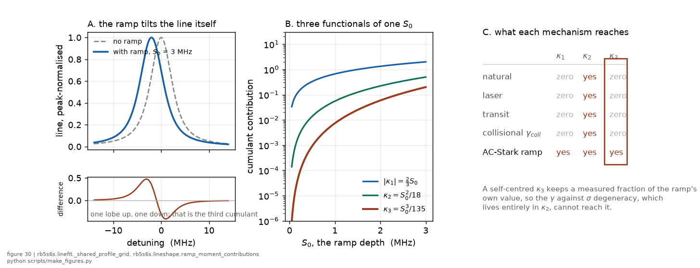
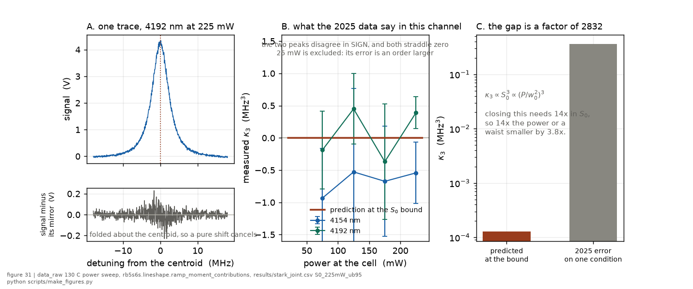

*Chapter 6 of 9 of [the big picture](../BIG_PICTURE.md)*

## 6. What new nanofibre measurements would add

**The question.** What would a guided-atom campaign add that a vapour cell
cannot, and what does it cost the fibre it runs on?
**Takes.** The solved HE11 mode and the guided derivations of
[methods chapter 9](../methods/09_the_guided_geometry.md), and the lever
ranking in `results/onf_lever_ranking.csv`.
**Gives.** What the fibre removes from the width budget, what it measures that
the cell cannot, and the open items the forecast spans instead of assuming.
**Skip if.** You have no fibre. This chapter is the fibre thread's own
surface, declared in [BIG_PICTURE](../BIG_PICTURE.md), and the vapour-cell
result rests on nothing in it.

> **Unfamiliar with the vocabulary?** [GLOSSARY.md](../GLOSSARY.md)
> explains the measurement in six sentences, then defines every term
> and symbol used anywhere in this repository.

> The signal, readout and feasibility budget for running this measurement in a
> guided mode is
> [notes/guided_mode_two_photon_design.md](../notes/guided_mode_two_photon_design.md),
> written for a hollow-core fibre holding either a warm fill or a trapped
> sample, and it is mostly a record of what does not carry over.
>
> **Updated 2026-08-21: the near-surface programme is now budgeted.**
> [The sized candidate](../notes/onf_candidate.md) sizes the optical
> nanofibre platform instrument by instrument, with every number labelled by its
> basis, and the joint forecast in `results/kernel_identifiability.csv`
> computes what a fibre-side laser measurement is worth to the committed
> cell coefficient. [Chapter 9](09_the-campaign-cases.md) states the whole
> case beside the cell-only alternative.

### What the fibre is for, and it is not a better number on the same axis

**The case is identifiability, not precision.** The cell measures one line in
which four channels broaden together, and it separates them only by how each
responds to power, temperature and density. Two of those separations are
weak. The fitted collision-against-laser split is degenerate at **-0.9**, and
the transit-against-laser split runs through the beam waist, which this record
carries as its largest open systematic and which the data bound from below at
38 microns with no ceiling at all.

A nanofibre does not fight those degeneracies. It removes them.

| channel | in the cell | in the evanescent field |
|---|---|---|
| collisional | 0.19 to 0.93 MHz, degenerate with the laser term at -0.9 | **178 Hz** at MOT density. Gone from the budget |
| geometry | w₀ assumed, sets transit and intensity together, no upper bound from the data | no waist. A **diameter**, which is measurable, and a mode that is computable from it |
| transit | cusp, 0.93 MHz, separable by shape | [73 to 98](../../results/onf_candidate.csv "ref:onf_candidate:transit_onf_cold_band:") kHz, and it enters the width at **second order**, contributing a small fraction of itself. A temperature ladder is the only lever that acts on it and it acts weakly |
| residual Gaussian | ~1 MHz unexplained, leading candidate a 0.19 degree retro tilt | no free-space retro to tilt, so the candidate is **testable** and not assumed |
| blackbody | the density lever and the thermal field share one knob | cold atoms against a 300 K room. The two **decouple** |
| atom to surface | absent | Casimir-Polder, a term to **measure** and not avoid |

**Four of those six are the systematics that limit this record now**, which is
why the fibre is not a second opinion on the cell's answer. It is the
instrument that tells you which part of the cell's answer was real.

**The sixth is somebody else's headline.** A group whose main programme is
Rydberg atoms near a nanofibre is limited by the near-surface field, and
[Raj 2026](../lit/raj2026.md) recovers that field as a free parameter of a fit
its own authors call qualitative only. The 5S-6S line is already driven on the
platform and is a low-lying state, so it probes the same environment without
the Rydberg population that complicates it.

### The guided-platform open items

Listed here and not in [the plan's open-items chapter](../plan/12_open-apparatus-items.md),
which stays platform-neutral. Each is spanned by a producer or nothing rests
on it.

| item | what it changes | how the forecast proceeds |
|---|---|---|
| **fibre diameter tolerance** | the mode area, and through it every guided intensity, shift and rate | a stated tolerance propagated through the mode solve in `results/onf_candidate.csv`, worked out with its two cited precisions in the open item further down this page  |
| **two-photon ionisation rate from 6S** | whether the probe perturbs the surface charge it reads | no forecast rests on it. Single-photon ionisation is excluded by [0.433](../../results/campaign_twin_forecast.csv "ref:campaign_twin_forecast:model:photoionisation_margin_from_6S") eV, and the surviving claim is narrower: a 5S-6S probe populates no Rydberg state, so the Rydberg-ground mechanism is absent by construction |
| **the evanescent envelope the transit kernel is built on** | [methods chapter 9](../methods/09_the_guided_geometry.md) section 9.1 states that the exponential approximation is not available at these radii, since $qa$ runs 0.18 to 0.32, and section 9.2 then builds the whole transit kernel on a plain exponential decay in time | **no forecast spans it, and it is the largest known error on the temperature ladder's value.** Carrying the chapter's own solved profile through shortens the effective decay length against the nominal 401 nm, and the kernel enters at second order so the width a ladder reads moves by the square of that factor. **The size depends on which effective length is meant and the definition has to be named.** Matched on the second moment, the quantity the added width depends on, the solved profile gives about 270 nm against the nominal, and about 2.2 on the width. A second evaluation of the same integral, written independently, lands a few nanometres shorter, so the length is good to about the nearest ten and the width factor to the first decimal. A log-linear fit over the first 600 nm gives about 218 nm and 3.3. **The second-moment length must exceed the fitted one**, because the profile's local decay length rises outward, 183 nm at 50 nm from the surface to 340 nm at two microns. **The direction is conservative under every definition**: the fibre lever is stronger than this chapter currently claims, so closing it is a gain and not a retraction. It is derivable and needs no apparatus fact, so it is mathematics and not a question for the group |
| **Rb adsorption against exposure time** | how long the fibre runs before its transmission degrades, which bounds the whole arm and is what the campaign costs the fibre itself | no forecast rests on it. `results/campaign_twin_forecast.csv` reports the integration time so the exposure is visible, but nothing converts exposure into degradation |
| **the trap's azimuth around the fibre** | which field magnitude an atom sees, and so every guided light shift. The field varies by about a third between the polarisation axis and perpendicular to it | spanned by a committed pair in `results/guided_mode_tables.csv`, the azimuthally averaged `stark_fraction` beside the on-axis one. The tensor term vanishes for this transition, both states having $J=1/2$, but the vector term does not, and a guided mode is strongly elliptically polarised near the surface. So the committed pair is a lower bound on how much the azimuth matters |
| **trap position and its thermal spread** | the intensity at the atom, and the atom-surface distance the surface term depends on | the distance-scan lever reaches a fractional [0.2895](../../results/onf_lever_ranking.csv "ref:onf_lever_ranking:distance_scan:sigma_lambda_frac") on the decay length at the 2025 lock, and under a hundredth at the photon floor. The spread itself is unmodelled and no forecast rests on it |

### The mode is now solved, and the assumption it replaces was wrong

`rb5s6s.fibre.solve_he11` solves the HE11 eigenvalue equation for a fibre in
vacuum, checked against two effective-index values standard for this geometry, which no note in this record cites to a paper, and against an independently written solver. The derivation,
with the transit, light-shift and atom-surface terms in the evanescent
geometry, is [methods chapter 9](../methods/09_the_guided_geometry.md). It replaces
`neff_band = 1.08 to 1.25`, which was tagged `assumed_parameter` and which
corresponds at 993 nm to fibres of **485 to 796 nm**. The fibres this group
runs are 350 to 400 nm, so the assumed band did not contain the apparatus.

| fibre | n_eff at 993.4 nm | amplitude 1/e | single mode |
|---|---|---|---|
| 350 nm | [1.01283](../../results/guided_mode_tables.csv "ref:guided_mode_tables:mode_solve_350nm:neff") | [984](../../results/guided_mode_tables.csv "ref:guided_mode_tables:mode_solve_350nm:amplitude_decay_length") nm | yes, V = 1.16 |
| 370 nm ([Raj 2026](../lit/raj2026.md)) | [1.01927](../../results/guided_mode_tables.csv "ref:guided_mode_tables:mode_solve_370nm:neff") | [802](../../results/guided_mode_tables.csv "ref:guided_mode_tables:mode_solve_370nm:amplitude_decay_length") nm | yes, V = 1.23 |
| 400 nm ([Rajasree 2020](../lit/rajasree2020spin.md)) | [1.03164](../../results/guided_mode_tables.csv "ref:guided_mode_tables:mode_solve_400nm:neff") | [624](../../results/guided_mode_tables.csv "ref:guided_mode_tables:mode_solve_400nm:amplitude_decay_length") nm | yes, V = 1.33 |

**Both defects it exposed are now fixed in the producer**, and twenty of
that file's rows moved. The band is computed from the diameter, and the
amplitude and intensity lengths are carried separately after the formula was
found returning one while labelled the other.

**The mode is not in the exponential regime at all**, since `q*a` is [0.231](../../results/guided_mode_tables.csv "ref:guided_mode_tables:mode_solve_370nm:qa") on the 370 nm fibre where the asymptotic form needs it far above one.

**The effective mode area is a convention as much as a number.** It is
**[0.615](../../results/guided_mode_tables.csv "ref:guided_mode_tables:mode_solve_400nm:mode_area_azimuthal_mean") µm²** as power divided by the azimuthally
averaged surface flux, and [0.489](../../results/guided_mode_tables.csv "ref:guided_mode_tables:mode_solve_400nm:mode_area_peak")
on the polarisation axis, so it is not quotable without saying which. Both come
from vector fields checked against their own boundary conditions before
integration. Earlier values are in [HISTORY](../HISTORY.md).

**What is not yet settled, stated so nothing rests on it.** No published
source gives a diameter tolerance for these fibres. Three routes were listed
here, and **the one this chapter recommended has since been costed through the
twin: the route is open, and it is worth about three times less than the
chapter assumed.** Nothing has been measured. Every precision below is an
`ENVELOPE` row from a design calculation, which is the third rung of the
ladder and not the first.

The group has scanning electron microscope access, and the published proximity
to the 352 nm mode cutoff at 480 nm gives a sharp diameter diagnostic. The
third route was sweeping the atom-surface distance and fitting the decay, and
this chapter called it the one the campaign can perform, measuring the quantity
that actually enters rather than a proxy for it.

**It reaches the diameter to about
[30.73](../../results/onf_lever_ranking.csv "ref:onf_lever_ranking:lock_span_0.04:sigma_diameter_nm") nm at the
2025 drifting lock and
[0.67](../../results/onf_lever_ranking.csv "ref:onf_lever_ranking:lock_span_0.0:sigma_diameter_nm") nm at the
photon floor.** The lock was repaired in August 2026 and its residual is
unmeasured, so the campaign sits inside that span.

**The design must marginalise over the drive's own surface shift**, which the
scan cannot know and the power sweep measures. Amplitude against decay length
is the classic degeneracy of a short near-exponential scan, and holding the
amplitude fixed makes the lever look about twice as good as it is. Earlier
values are in [HISTORY](../HISTORY.md).

**The route the campaign can run itself is open, and it is worth less than
this chapter claimed.** A repaired lock is what makes it competitive with the
10 nm the chapter originally assumed. At the 2025 rate it is not. SEM and the
mode-cutoff diagnostic stay as independent cross-checks, and they matter more
than they did.

The evanescent field of an optical nanofibre is, in one sense, the natural
home of the ramp physics: the intensity gradient is steep and exponential,
so the local light-shift distribution is large and strongly shaped. What
carries over is the operation the record is built on, mapping a known
intensity geometry onto a shift distribution and reading its cumulants. The
closed-form ramp weight itself does not. It is derived for atoms **crossing** a
focused beam, and a trapped sample sits concentrated where the intensity is
highest, so its shift distribution has no hard edge and carries the opposite
sign of skewness (section 1.2 of the design note, which computes both).
Carrying the ramp over unchanged would get the sign of the line's asymmetry
wrong, and the self-centred third cumulant is the drift-immune channel this programme
relies on.

*Figure 30. Why this channel is worth the session. The first panel shows what
the ramp does to the observable, and the difference below it is the
antisymmetric one-lobe-up, one-lobe-down signature that the third cumulant
measures. The third panel is the argument: every symmetric kernel contributes
to the variance and nothing to a self-centred κ₃ (the Lorentzian to the truncation fraction
[the condition](../wiki/third-cumulant.md) quantifies), so
the collisional-against-laser
degeneracy that dominates the width budget cannot reach it. The ramp is the
only asymmetric term in the model.*

*Figure 31. And what the 2025 data actually say in it. The folded residual in
the first panel is noise, the measurements in the second straddle zero and the
two peaks disagree in sign, and the third puts the gap at a factor of about
2800 between the prediction at the record's own bound and the error on a single
condition. Because κ₃ goes as the cube of S₀, closing that gap needs about
fourteen times the ramp depth, which is fourteen times the power or a waist
smaller by a factor of 3.8. This measures the instrument's reach in this
channel, not the ramp.*

The group has already demonstrated the hard part. 5S–6S excitation in the
evanescent field of a nanofibre works on cold atoms
([Rajasree 2020](../lit/rajasree2020spin.md)'s count rates are the existence
proof). What does not exist, anywhere, is a **quantitative near-surface
lineshape program**:

- a fitted model of [Gokhroo 2022](../lit/gokhroo2022.md)'s pushing dip (its position, width and
  power dependence), which needs the force and density dynamics *plus* the
  lineshape pieces this repo provides, and the ramp is one ingredient, not
  the whole model
- the atom–surface (Casimir–Polder) shift and distortion that rides on the
  line for atoms within ~100 nm of the glass
- optionally, distance-resolved spectroscopy in a two-colour trap, where
  the red/blue power ratio tunes the atom–surface distance. That is the
  trapped case, so it needs the trapped shift distribution rather than the
  ramp. It is ambitious, and the per-distance signal budget is an open
  question.

**The group's own Rydberg work says the same thing about itself, which is
better evidence than our saying it.**
[Vylegzhanin 2023](../lit/vylegzhanin2023.md) excites Rydberg nS and nD states
through the evanescent field of the same kind of fibre, and fits each spectrum
with an *empirical skewed Gaussian* chosen to absorb the 1064 nm AC Stark shift
and the atom–surface interaction together. That locates a resonance well and
separates two mechanisms badly. The paper is explicit about what it therefore
leaves out: DC Stark shifts *"are not included as we have no experimental
mechanism for quantifying them"*, with stray fields and charging of the fibre
called *"difficult to quantify with no electrodes in the vacuum chamber"*.

A lineshape is not an electrode, and that is the opening. The quantity they set
aside is a field, the 6S line is already driven on this platform, and reading a
shift distribution out of a measured line with a stated prior is what §4–5
does in the cell. Note the scale is state-dependent and the two numbers do not
contradict: the Casimir–Polder shift on a *Rydberg* state is of order GHz
within 300 nm of the fibre, far larger than the ~100 nm scale that matters for
the low-lying states above.

[Vylegzhanin 2025](../lit/vylegzhanin2025.md) is the companion proposal, a trap
holding a ground and a Rydberg state in one potential built on the vector shift
at the 790.2 nm tune-out wavelength and matched by detuning to 788.1 nm. It is
a proposal and says so. What a trap engineered to cancel a differential shift
still needs is a measurement showing it cancelled, and the residual is a
distribution across an evanescent field, which is the same object again.

**A design validation exists for the temperature lever.**
`results/fibre_twin.csv` asks whether a molasses temperature ladder can
separate a guided transit contribution from a temperature-independent
homogeneous one. **That separation is harder than this chapter first stated**:
the guided kernel enters the width at second order and contributes only a few
per cent of its own FWHM, and the width a ladder sees grows as $T$ and not
as $\sqrt T$, so a ladder reading it through the total width has both less
signal and a different shape than an additive treatment implies. Under synthetic worlds calibrated to the
per-condition width precision this record already achieves, it identifies the
common Lorentzian component at [0.9640](../../results/fibre_twin.csv "ref:fibre_twin:O2A_lambda_312nm:coverage_gamma_l") and [0.9580](../../results/fibre_twin.csv "ref:fibre_twin:O2A_lambda_492nm:coverage_gamma_l") coverage at the two
decay-length band edges, and does **not** identify the Gaussian one, at
[0.4040](../../results/fibre_twin.csv "ref:fibre_twin:O2A_lambda_312nm:coverage_sigma_g") and [0.3760](../../results/fibre_twin.csv "ref:fibre_twin:O2A_lambda_492nm:coverage_sigma_g").
A single-rung control fails to split, which is what makes the ladder the lever,
not the fit. **Those worlds inject the transit width into the additive
Lorentzian channel, which the second-order result above shows is not how the
kernel enters**, so the coverage rows describe a design under an assumption the
same chapter now retracts, and re-running them against the correct kernel is
the next item and not a refinement. This is simulation-backed and not a
measurement: it says the design can identify the intended quantities under
stated worlds, not that
the apparatus will.

The cell line of §4–5 is the in-vacuo reference against which every
near-surface effect would be read. That is the connection between
the two halves of the program: the cell work is what makes the nanofibre
lineshapes *interpretable*.

---

*[The next vapour-cell session](05_next-vapour-cell.md) · [Limitations and identifiability](07_limitations-and-identifiability.md)*
