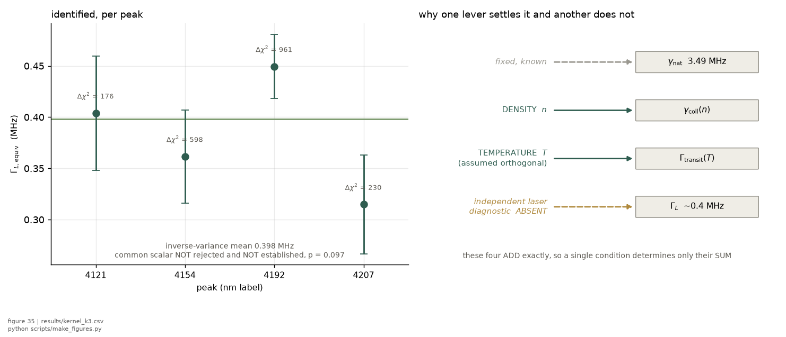

*Chapter 7 of 9 of [the big picture](../BIG_PICTURE.md)*

**The question.** What does this dataset fail to determine, why does each
failure happen, and which measurement fixes which one?
**Takes.** The results of [what the 2025 dataset delivered](04_what-2025-delivered.md).
**Gives.** Six chains from a limitation to the measurement that removes it,
each with what would be learnt if it worked and if it did not.
**Skip if.** You want the summary rather than the argument, in which case
Part III of [the big picture](../BIG_PICTURE.md) is the table this chapter
expands.

> **Unfamiliar with the vocabulary?** [GLOSSARY.md](../GLOSSARY.md)
> explains the measurement in six sentences, then defines every term
> and symbol used anywhere in this repository.

A limitation is only useful when it names its own cure. Each section below runs
from what the data cannot determine, through the physical reason, to the change
that would determine it, the machinery that would read the change, and the
outcome that change targets. THE OUTCOMES ARE TARGETS. None of these sessions
has been run, so every end state is what the design is for and not what the
record holds. Each section closes with both branches, because a design whose
failure teaches nothing is a design worth less than it costs.

## 1. The width split

**The limitation.** The collisional width and the laser width are not
separately determined. The archive fixes the total width to 0.0032 MHz and the
direction that divides it to only 0.0588 MHz, eighteen times worse, at a
condition number of 345 across the three width parameters.

**The physical cause.** A Lorentzian collisional kernel and a Gaussian laser
kernel convolve into a profile whose shape barely distinguishes them at these
widths. The information that would separate them is not weakly present in the
lineshape. It is close to absent, which is why more data of the same kind does
not help. Inside a single condition the two trade at a correlation whose median
across the 32 conditions is -0.90.

**The change.** Measure one of them independently. The repaired cavity lock
makes a beat note against a second laser, a cavity ringdown, or a delayed
self-heterodyne measurement viable, and the 2025 session had none of them.

**The machinery.** Fit with the laser width pinned rather than free.
Simulated on a bright synthetic condition with signal-dependent noise
(`scripts/run_width_pinning.py`), the collisional width scatters by
0.0073 MHz across realisations when both are free and by 0.0021 MHz when the
laser width is known, a ratio of 3.18 with a spread of 0.20 across nine
seeds, in an idealised condition whose ratio, not whose absolutes, transfers
to the real record.

**What the factor actually is.** The simulated 3.18 is one condition's answer
to a question whose general form is arithmetic. Conditioning on one member of
a correlated pair leaves the other with $\sqrt{1-\rho^2}$ of its uncertainty,
so the purchase is $1/\sqrt{1-\rho^2}$ and depends on the correlation alone.
That is 2.29 at the record's median $-0.90$ and 2.97 at the pinning
simulation's own bright condition, whose fitted correlation is $-0.9417$,
against the $3.18 \pm 0.20$ the simulation measures there. The 7 per cent gap
is what a Monte-Carlo scatter ratio carries that a covariance ratio does not. The
comparison lives on
[the identifiability page](../wiki/identifiability.md), and the consequence is
that this row's purchase is a factor between two and three and a half rather
than a single number.

**Whether a design change could do it instead.** It cannot, and this was
tested rather than assumed. Varying the span by a factor of five and the trace
count by a factor of ten moves the correlation from $-0.9177$ to $-0.9166$ and
$-0.881$, which is no movement at all. The degeneracy belongs to the lineshape
rather than to the sample size, so the external measurement is not the
cheapest route to this limitation. It is the only one.

**A second limitation hides inside this one: the laser KERNEL is an
assumption, and its failure mode is a bias rather than an error bar.** Every
fit convolves a Gaussian for the laser, which is what slow frequency noise
produces. Fast noise produces a Lorentzian, and a Lorentzian laser
contribution is absorbed by the collisional width directly. SWITCHING the kernel between two pure
forms leaves the record unable to choose, that comparison being
indistinguishable at its own gate, and nothing measures the laser's
frequency-noise spectrum, the M1 noise law being the detector's. **The form
of the comparison turns out to matter more than its verdict did.** A switch
sets two models of equal dimension against each other. FREEING a second,
Lorentzian component alongside the Gaussian one instead makes the pinned model
a nested special case of the mixed one, and a nested test has power that a
switch does not. What
evidence exists leans the unfavourable way: the comb-clock limit excludes
the slow spectra that would justify the Gaussian by factors of seventeen to
eighty. Two in-situ resolutions are designed and neither has run, the lock's
own error signal and a fast-scan comb block whose tooth clock samples inside
the band the science blocks' widths integrate
([plan chapter 7](../plan/07_acquisition-settings.md)).

**That systematic is now measured, and measuring it did not settle the
question.** A mixed Gaussian-plus-Lorentzian laser kernel was fitted against
the pinned-Gaussian one at every peak. The mixed form wins decisively, by
$\Delta\chi^2$ of 176 to 961 on a nested test with one parameter at its
boundary, so **a non-Gaussian homogeneous component is present**, with
peak-conditioned values from 0.315 to 0.449 MHz
(`results/kernel_k3.csv`). Its size against the statistical error is stated on
a matched footing as $R_\text{kernel} = 3.24$
(`results/kernel_budget.csv`): the choice of kernel moves the collisional
coefficient by more than three times what the noise does, so repetitions of
the current construction no longer buy that coefficient.

*Left, the component identified at each peak with its own likelihood-ratio
gate. Right, why the levers differ: the homogeneous terms add exactly, so one
condition determines only their sum, and each variable moves one term. The
independent laser diagnostic is drawn greyed because no such measurement has
been taken.*

**Four things are true at once here and merging any two of them is the error
this section exists to prevent.** A parameter is identified. Whether the four
peaks share ONE value is neither rejected nor established, at $p = 0.097$, so
the inverse-variance mean of those four values is never quoted bare. The
physical ORIGIN is not identified, and calling the component the laser is a
separate claim that no measurement taken licenses: the one in-situ laser
measurement samples a different band from the one a scanned width integrates
(`results/kernel_k5.csv`). And the model CLASS is not shown adequate, because
$R_\text{kernel}$ is a sensitivity within the two forms tested. The blind
residual atlas that would test the class itself has been built and run.

**The atlas now qualifies, and it detects.** Stacking per-condition residuals
on a common axis and testing against a null that flips each condition's sign, a
common residual structure appears at the permutation floor in both arms, the
synthetic control built from the fitted model returns clean, and **the
detection survives the removal of any single condition**. The tested inference
family leaves **reproducible residual structure** that no member of it produces
(`results/kernel_k4.csv`).

**What that is and is not.** It is named unexplained reproducible residual
structure rather than model inadequacy, because a residual can come from the
physical model, the noise model, preprocessing or the instrument, and this test
separates none of them. **No mechanism is named.** **$R_\text{kernel}$ is
unchanged and remains a sensitivity within the class that was tested**, since
turning this structure into an admissible alternative model and computing its
effect on the collisional coefficient has not been done. And the domain is
stated: the structure is INSIDE the fit window, and its relation to the
reproducible excess OUTSIDE that window is unresolved.

**On the two runs.** An earlier run of the same atlas on the same data was
declared void by its own preregistered check, which had invented a reproduction
threshold twenty times stricter than the one `verify_results_fresh.py` sets for
this repository and voided on a single condition already measured as
environment-sensitive. The criterion was not loosened afterwards: a second run
was preregistered with the repository's own standard plus a leave-one-out test,
and both runs stand in the record.

So the collisional coefficient no longer carries this as an unquantified
systematic. It carries a quantified model-form sensitivity with an
unattributed cause, which is a different and more useful position, and
[CLAIMS.md](../CLAIMS.md) section 2 states it.

**Target outcome.** The collisional width becomes separately identifiable, and
the bound of [Q-BETA-01](../BIG_PICTURE.md) becomes a measurement.

**If it works,** the whole width budget resolves, and the laser-width row stops
being conditional on the split it is part of. **If it does not,** and the
pinned fit's residual scatter fails to fall, that is informative rather than
wasted: it would place the missing information somewhere other than the laser
linewidth, most likely in the transit kernel of chain 4, and it would do so
with an independent measurement in hand rather than by inference.

## 2. The absolute frequency axis

**The limitation.** The archive has no absolute frequencies. Every axis is
differential, so line positions carry no information and only shapes do.

**The physical cause.** The lock drifted through the session and the wavemeter
was photographed rather than logged, so nothing ties the sweep to a known
frequency. This is a construction limit, not a noise limit.

**The change.** Catch two same-isotope pairs inside the sweep and log the
wavemeter to disk. The four components sit at 0, 911.3, 3220.0 and 5225.0 MHz
on the transition axis from the campaign labels. Two of them are both the
heavier isotope and two are both the lighter one, so each pair's separation is
fixed by hyperfine constants alone with no isotope shift in it.

**The machinery.** A same-isotope separation on the transition axis is the
ground hyperfine splitting minus the 6S splitting, and both are measured
quantities held as constants in this repository. The ground splittings are
clock-grade and the 6S constants are known to 2 kHz
([Ayachitula and co-workers](../lit/ayachitula2024.md)), giving 2318.537 MHz
for the lighter pair and 5219.973 MHz for the heavier one. The second of those
spans the entire four-component manifold and fits inside the piezo's measured
full-ramp reach of about 7.4 GHz, so ONE SWEEP CARRIES TWO INDEPENDENT RULERS
over different segments of the same axis.

**Target outcome.** The axis becomes calibratable to the accuracy of those
constants, under a validation ladder that is worth stating in order: the
heavier pair's ruler is validated on real sweeps, the excited-state constant's
uncertainty budget is verified, the scan software's span is confirmed to cover
the manifold, the axis model of the scan is validated, and the sweep-to-sweep
reproducibility is quantified. Until those are done this is a projection.

**If it works,** the two rulers agree within the projected nonlinearity, the
axis is anchored inside every trace rather than transferred from an
instrument, and the cross-isotope separations carry the isotope shift as a
by-product worth a literature check. **If it does not,** and the two rulers
disagree beyond the projected nonlinearity, that disagreement is the useful
result: it would say the axis model is wrong rather than imprecise, and it
would localise the error to the segment where the rulers diverge.

## 3. The baseline

**The limitation.** The Doppler pedestal underneath the line could be neither
measured nor excluded, so the baseline is a modelling choice rather than data.

**The physical cause.** The pedestal is 942 MHz wide and the archive's fit
window is a few tens of megahertz, so across the window the pedestal is almost
flat and the free per-trace background absorbs it entirely.

**The change.** Sweep wide enough that the pedestal curves inside the window,
and fit it as a pedestal rather than as a polynomial. Photon counting helps
here specifically, because the crossover below which counting beats the analog
chain sits at about 1.6 per cent of the peak, and the pedestal and the wings
live below that.

**The machinery.** Simulation of the wide fit at the measured noise law, with
the record length set by points across the line rather than points per trace.

**Target outcome.** The baseline becomes measured, so it stops being a source
of model error in every other quantity that shares the window.

**If it works,** the pedestal also becomes a thermometer of the atoms actually
probed, which is a different quantity from a thermocouple reading of the cell
wall. **If it does not,** and the wide fit fails to recover an injected
pedestal, the span was still too narrow or the baseline is not the assumed
form, and the injection test says which.

One thing this chain does NOT do, stated because an earlier version of this
record assumed it would: the pedestal is not the explanation of the
out-of-window excess. A ceiling test at twelve times the predicted pedestal
amplitude still leaves far less in the band than is measured there, so that
candidate is excluded and chain 6 is the one that addresses the anomaly.

## 4. The transit kernel

**The limitation.** The transit contribution rides on a beam waist that was
never measured on this bench, and the cusp shape of the thermally averaged
transit kernel is untested here.

**The physical cause.** The waist was adopted from the apparatus lineage and
supported by a consistency argument on the transit width. That makes it the
largest open systematic in the record, and every intensity-denominated
quantity inherits it.

**The change.** Profile the beam on the day, by knife edge or camera, and take
one cold and dim condition where the transit term is the largest fraction of
the width.

**The machinery.** The model comparison the record already specifies, plus
injection and recovery to establish what the comparison can actually
discriminate at the achieved precision.

**Target outcome.** A direct experimental handle on the transit model. THE
DISCRIMINATION POWER REMAINS A PROJECTION until the injection tests are run,
so the statement to make is that the measurement becomes possible, while its
verdict stays open.

**If it works,** the geometry stops being an assumption and every bound that
divides by the waist sharpens without any new physics run. **If it does not,**
and the comparison stays inconclusive, that bounds how much of the width budget
the transit kernel can be responsible for, which narrows chain 1's failure
branch in turn.

## 5. The light shift

**The limitation.** The light-shift amplitude is bounded and not measured. The
archive's limit at maximum power already sits below the predicted value, which
makes the absence of a measurement more interesting rather than less.

**The physical cause.** Two reasons compound. At a single drive power the
shift's broadening is degenerate with other terms that grow the same way with
power and with focus. And the asymmetry channel that would break that
degeneracy carries too little signal in one trace: at the archive's own bound
the asymmetry is smaller than the per-point noise.

**The change.** A randomised power ladder with more rungs and per-sweep
normalisation, under a lock that holds the centre still so the first-order
pull is no longer absorbed by a free per-scan centre. That change brings its
own confound, found 2026-08-20. Elliptical light optically pumps the
population through the cascade's own decay, and a biased population no longer
cancels the vector light shift, which then moves the centre by 1.5 kHz per
unit of mean projection on rubidium-87 at the highest power and full
circularity, 1.0 kHz on rubidium-85. Against the 2025 archive's per-trace
centre precision near 420 kHz that is invisible, which is why it has never
mattered. Against a fixed-lock measurement built to resolve kilohertz pulls it
is not, and it is power-proportional, which is the one signature it shares
with the shift being measured. A linear-polarisation purity check, or the
field-reversal diagnostic in `rb5s6s/polarisation.py`, belongs in that
design.

**The machinery.** The joint fit across the ladder, with the projected
precisions recorded as design envelopes rather than derived here.

**Target outcome.** Measured rather than bounded, conditional on the projected
coverage holding in a joint-fit simulation. The projections put the
prediction-to-precision ratio at 1.89 for the smallest session considered and
5.35 for the largest.

**If it works,** the light shift becomes the first absolute coefficient this
line yields by this method. **If it does not,** and the per-sweep normalisation
scatter exceeds the pull it is meant to resolve, the limitation moves from the
lock to the power metrology, which is a cheaper problem to fix and a different
one to fix.

## 6. The band excess

**The limitation.** There is a real, reproducible excess in the residuals
outside the production fit window, between 0.10 and 0.29 per cent of the peak,
and it is not attributed to a specific physical term. A related question at the
same scale was closed by simulation on 2026-08-20. The low-power residual skew
already identified as shot noise could instead have been a structure of fixed
absolute amplitude sized like this excess, and the two are separated by the
exponent of skew against amplitude. Measured at $-0.404 \pm 0.091$ with a
line-to-line scatter of 0.181, the fixed-amplitude reading is disfavoured at
$p = 0.011$ and shot noise stays consistent at $p = 0.08$
(`results/skew_scaling.csv`). The exclusion is by SIMULATION under each
hypothesis rather than from the fit covariance, which describes the spread at
the fitted exponent and not at the one being excluded.

**The physical cause.** There is now a candidate, and it is the lineshape model
rather than the atom. A joint fit over every canonical trace, each granted its
own free polynomial baseline, leaves a shared excess standing at 3.6 sigma under
per-trace CUBIC freedom. Regressed on both competing predictors at once, that
excess tracks the model's own profile height inside the band at 8.65 sigma while
vapour density is a null predictor at -0.75 sigma, and a band re-cut in units of
each trace's own linewidth keeps the trend. A placebo band inside the fitted
window carries structure too, which a general profile mismatch predicts and a
far-wing collisional excess does not.
[The full construction and its controls](../notes/band_excess_is_model_form.md).

**This is a candidate mechanism and not an explanation**, so the limitation
stands. Nothing in `results/` moved on it. What it does settle is what the
excess is NOT: the pedestal is excluded as its source by the ceiling test of
chain 3, and the excess is not evidence for a collisional far wing, which
leaves that question open on theory rather than contaminated.

**The change.** Polarisation isolation. The two-photon rate goes as the squared
degree of linear polarisation and vanishes for circular light, which is
published for this transition in this lineage
([Rajasree and co-workers](../lit/rajasree2020spin.md)) and which falls out
of [the selection rules](../wiki/selection-rules.md) independently: for two
photons from ONE laser the
amplitude is symmetric in their polarisation vectors, so the operator carries
only ranks 0 and 2, and rank 2 has no element between two states of angular
momentum one half. What is left is the scalar, proportional to the dot
product of the two polarisation vectors, which is exactly zero for
co-rotating circular light. The published extinction and the rank argument
are the same statement twice, which is worth knowing because it means the
null has a reason and not only a measurement.

**AND THE SAME ARGUMENT CLOSES THE MAGNETIC CHANNEL**, which is a limitation
this chapter no longer has to carry. Only the zero-change-in-projection
component survives to any useful precision, for any polarisation, any
ellipticity, any imperfection in the retro and any direction of an ambient
field. That component's Zeeman shift cancels between two S states of equal
hyperfine g-factor, leaving under 140 Hz at the Earth's field.

The components that would NOT cancel, at 350 kHz and 700 kHz per unit, are
driven so weakly that the distinction from not at all is academic, and saying
they are not driven AT ALL was an overstatement corrected on 2026-08-20. Each
has exactly one route. The 700 kHz component is reached by a TWO-ATOM
cooperative channel, since a pair can accept the two units of angular
momentum a single J=1/2 atom must refuse, at 1.3e-9 of the line
(`rb5s6s/cooperative.py`). The 350 kHz component is reached only when a
polarisation mismatch and the Doppler-free geometry's own rest-frame energy
split act together, at 2e-13 for a five degree mismatch
(`rb5s6s/polarisation.py`). Both sit six orders or more below the tightest
bound this record carries on an out-of-window feature. A
first pass at this in August 2026 claimed that a polarisation mismatch opened
the first of them and had to be retracted the same day: the mistake was
applying the antisymmetric part of the LIGHT-SHIFT operator, which elliptical
light really does open, to the TRANSITION operator, which it cannot. The
episode is recorded in [magnetic sublevels](../wiki/magnetic-sublevels.md). Orthogonal linear
polarisation kills the cross term that drives the Doppler-free line while the
same-beam terms that drive the pedestal survive, so it is a pedestal-only
block. Circular polarisation removes the whole two-photon signal, which makes
it an extinction null in which everything the detector reports is background.

**The machinery.** The shaped-contaminant fitting already built for the
residual-structure work.

**Target outcome.** The anomaly becomes attributable, which is the projected
outcome and not an assured one.

**If it works,** the one open anomaly in the record acquires a mechanism, or is
shown to be instrumental. **If it does not,** and the isolated blocks carry the
same excess, that moves it out of the optics and into the detection chain,
which is a smaller space to search than the one it lives in now.

## 7. The acquisition itself, found 2026-08-18

The six limitations above are properties of the model and the data. This one
is a property of how the data were TAKEN, and it was found by reading the
quantisation step of the stored samples rather than any recorded setting.

**Power was confounded with time, and the vertical range moved under the
measurement.** In the campaign the power descends monotonically with elapsed
time, so any quantity measured against power is equally a measurement against
drift, and no analysis of that session alone can separate them. Independently,
the oscilloscope's vertical range was changed at every rung of every ladder,
by up to a factor of 596 in quantisation step against a signal spanning only
about 80, so a power ladder is five measurements on five instrument ranges
rather than one measurement at five powers.

**What it cost, precisely.** The concave width against power cannot be
established: it is 1.4 standard deviations under the between-block treatment
and neither independent ladder confirms it. The amplitude's departure from the
square law survives, because the 2025-07-04 rehearsal happens to have run its
ladders in alternating directions and shows the departure to be invariant
under acquisition order, but its ordering across lines follows their
brightness rather than any atomic quantity, which points at the ranging rather
than at the atom.

**Both halves are removable at almost no cost**, which is what makes this a
limitation rather than a fact of life: randomise the rung order and record the
seed, and hold one vertical range across a ladder, which needs a 12-bit
acquisition and is arithmetic rather than preference. The full design is in
[the acquisition-settings chapter](../plan/07_acquisition-settings.md).

**The general lesson the record should keep.** The archive's most informative
control was an accident: the rehearsal's alternating ladders were run that way
for convenience, and they are the only reason one of these two findings could
be adjudicated at all. A design that varies the nuisance on purpose costs
nothing and would not have depended on luck.

## A note on the density design, which is a seventh limitation

The collisional bound has a limitation that is neither degeneracy nor absence
but GEOMETRY. Density rises steeply with temperature, so the three lower
temperature blocks sit close together on the density axis and the highest one
sits far from them. An influence audit of that four-point design puts the
high-temperature anchor at a hat-matrix leverage of 0.996 on all four peaks,
which means a straight line through those points passes very nearly through
the anchor whatever the anchor says. THE CONSTRUCTION CANNOT CHECK ITS OWN
ANCHOR: an outlier planted there leaves almost no residual, and the audit's
power ladder failed to detect one at any size up to a hundred times the
point's own error bar.

The committed diagnostics already show the same thing from the other side.
Dropping one temperature moves the coefficient by up to 0.1338 MHz per 1e12
per cubic centimetre, while dropping one peak moves it by at most 0.0070, a
factor of nineteen between removing a density point and removing a whole
spectral line.

Nothing here says the anchor is wrong. It says the design cannot tell, which
is why the coefficient is published as a bound. The cure is spacing: a density
ladder whose points are spread evenly in DENSITY rather than evenly in
temperature, with the hot points the plan already wants for signal reasons
moving the far end of the lever and giving the fit a second constraint out
there.

## What none of this would fix

Two limits survive every session above, and they belong here so the chapter
does not read as a promise. The density scale that the collisional coefficient
divides by comes from vapour-pressure curves rather than from a measurement of
this cell, so an absorption channel is needed before that coefficient is
absolute rather than relative. And the archive itself cannot be improved: these
chains describe what a NEW session would determine, and the 2025 bounds stand
as bounds whatever happens next.

## A limitation this chapter does not carry

Every chain above is about a quantity the data fail to determine. One limitation
is about the CONSTRUCTION instead: whether the joint fit that produces the
light-shift bound is entitled to share one coefficient across three measurement
sessions, given that the coefficient goes as one over the beam waist squared and
no session measured its own waist. That question has its own chapter, [when a
joint fit is legitimate](08_when-a-joint-fit-is-legitimate.md), which also
generalises it into six questions to ask of any pooled fit.

---

*[The next nanofibre session](06_next-nanofibre.md) · [When a joint fit is legitimate](08_when-a-joint-fit-is-legitimate.md) · [the big picture](../BIG_PICTURE.md)*
