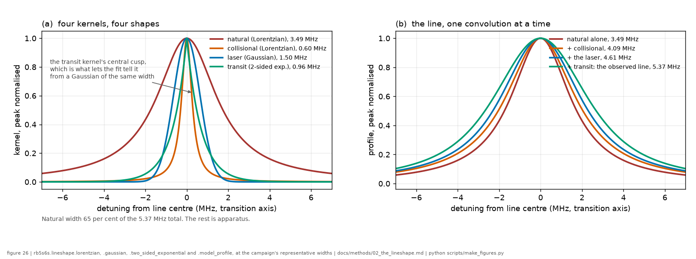
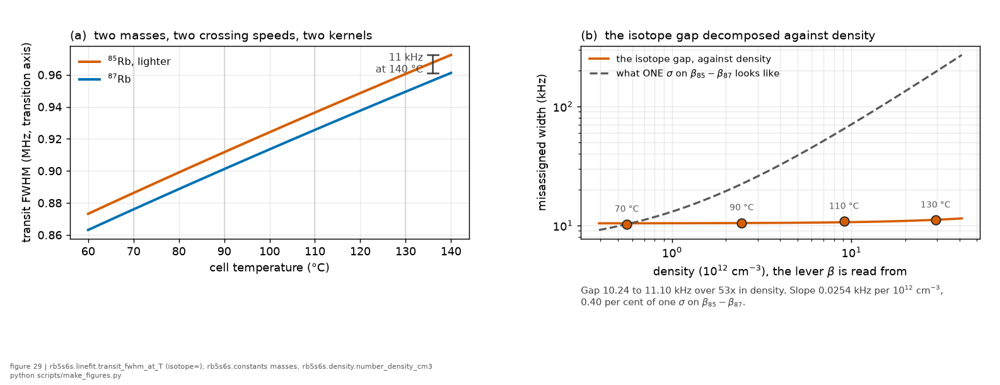

*Chapter 2 of 8 · [methods index](../methods.md)*

**The question.** What sets the width of a line this narrow, mechanism by
mechanism, and which of those mechanisms the dataset can actually separate.
**Takes.** The measurement chapter for the apparatus and the Doppler
cancellation. It forward-references the AC-Stark ramp and the results chapter
inside the transit section.
**Gives.** The four kernels the composite model convolves, the Voigt
degeneracy the statistics chapter has to manage, and the measured waist every
absolute number is conditional on.
**Skip if.** You want the results rather than their derivation. The one thing
to carry away is that transit and laser width trade against each other through
$w_0$.

> **Unfamiliar with the vocabulary?** [GLOSSARY.md](../GLOSSARY.md)
> explains the measurement in six sentences, then defines every term
> and symbol used anywhere in this repository.

## 2. The lineshape, derived mechanism by mechanism

The measured line is a **convolution** ($\otimes$) of independent broadening
mechanisms, because independent random frequency contributions add and the
distribution of a sum is the convolution of the distributions:

$$
I(\nu) = A \Big[
\underbrace{L(\nu;\Gamma_\text{nat}+\gamma_\text{coll})}_{\text{homogeneous}}
 \otimes
\underbrace{G(\nu;\sigma_\text{laser})}_{\text{laser}}
 \otimes
\underbrace{K_\text{transit}(\nu;T,w_0)}_{\text{transit}}
 \otimes
\underbrace{R(\nu;S_0)}_{\text{AC-Stark}}
\Big] + \text{background}
$$

The factorization assumes the four contributions are **statistically independent**,
which holds because each is driven by a physically separate random process with no
coupling between them: spontaneous emission (natural), Rb–Rb collision times
(collisional), the laser's own frequency jitter (laser), and the atom's trajectory
through the beam (transit). The laser's instantaneous frequency does not depend on
which atom is crossing or how fast it moves, and vice versa, so the joint
distribution factorizes and the profiles convolve. (A correlation between, say,
laser frequency and transit *would* break the convolution, but there is no
mechanism here to produce one. A drifting *centre* is separate and is handled
per-trace, §4.2, not as a broadening.)

We now build each factor.

*The whole chapter in advance. On the left the four kernels at the campaign's
own representative widths, drawn together so the point is visible: they differ
in SHAPE and not only in width, and the shapes are the only handle the fit has
for telling them apart. On the right the line assembled one convolution at a
time. The natural width is about two thirds of the observed 5.37 MHz and
everything above it is apparatus, which is why the sections below spend most of
their length on the apparatus terms.*

### 2.1 Natural width: a finite lifetime is a Lorentzian

An excited state that decays with lifetime $\tau$ has a radiating dipole whose
field is a damped oscillation,

$$E(t)=E_0e^{-t/2\tau}e^{-i\omega_0 t}\quad (t\ge 0)$$

where the amplitude decays with $2\tau$ because the *population* (intensity)
decays with $\tau$. The emitted spectrum is the squared Fourier transform,

$$|\tilde E(\omega)|^2  \propto  \frac{1}{(\omega-\omega_0)^2+(1/2\tau)^2}$$

a **Lorentzian** $L(\nu)$. Its FWHM in ordinary frequency is

$$\boxed{ \Gamma_\text{nat}=\frac{1}{2\pi\tau} }
 = \frac{1}{2\pi(45.57\ \text{ns})}=3.4925\ \text{MHz}$$

Two features matter later: the Lorentzian has slowly-decaying **wings**
($\propto 1/\nu^2$, far fatter than a Gaussian), and, as a subtlety worth
stating precisely, the $6S\to5P\to5S$ cascade adds **no** width to *this* line.
The natural linewidth of the $5S\to6S$ transition is set by the lifetime of the
excited $6S$ state, and that measured $6S$ lifetime already includes *all* of its
radiative decay channels ([the measurement chapter](01_the_measurement.md)), so the subsequent $5P\to5S$ decay affects only
the linewidth of the *emitted* 795 nm fluorescence, not that of the excitation
resonance. Put differently: the transition whose frequency is scanned (the
$5S\to6S$ two-photon resonance) determines the measured linewidth, not the
transition used for detection, since the PMT is simply a population monitor for
the excited state ($6S$). *Code:* `lorentzian()` in `rb5s6s/lineshape.py`, with
$\Gamma_\text{nat}$ computed from $\tau$ in `constants.py`.

### 2.2 Collisional broadening: the same Lorentzian, grown by density

In the **impact approximation** ([Baranger](../lit/baranger1958.md), *Phys. Rev.* **112**, 855 (1958)),
a collision with another Rb atom randomizes the optical phase in a time much
shorter than the mean time between collisions.
Random phase interruptions at mean rate $1/\tau_c$ are, statistically,
indistinguishable from an extra decay channel: they add a term $1/\tau_c$ to
the coherence decay rate. The line therefore *stays Lorentzian* and its width
grows linearly with collision rate, i.e. linearly with density:

$$\gamma_\text{coll}=\beta_\text{self}N$$

Baranger's own dilute-gas/binary-collision validity condition (his interaction
volume $U\ll n^{-1}$) holds by a margin of about 140× at our densest point,
130 °C ($2.9\times10^{13}\ \text{cm}^{-3}$), so this Lorentzian, $N$-linear
form is not in question anywhere in our sweep. What remains open is only the
separate, later step from a $-C_6/R^6$ potential to a cross-section
([Lewis 1980](../lit/lewis1980.md), `rb5s6s/vanderwaals.py`, M18), a step
Baranger's theorem does not itself supply.

Because the convolution of two Lorentzians is a Lorentzian whose **widths
add**, the natural and collisional contributions combine analytically into a
single Lorentzian of width $\Gamma_\text{nat}+\gamma_\text{coll}$, which we
exploit in the code rather than convolving numerically. The density itself
follows the saturated-vapour curve, and across our sweep

$$\frac{N(130\ ^\circ\mathrm{C})}{N(70\ ^\circ\mathrm{C})}\approx 50$$

and that large lever arm is what makes $\beta_\text{self}$ accessible.
**$\beta_\text{self}$ for $5S\to6S$ is unpublished, and measuring or bounding it
is paper deliverable C1.** *Code:* $N(T)$ in `density.py` (Nesmeyanov/Steck
correlation), with $\gamma_\text{coll}$ entering the fits in
`linefit.py`/`beta.py`.

### 2.3 Laser linewidth, and why it enters *twice*

Let the instantaneous laser frequency be $\nu_L(t)=\bar\nu_L+\delta(t)$, with
$\delta$ the frequency jitter. Unlike the Doppler shift ([§1.1](01_the_measurement.md)), which has
opposite signs for the two counter-propagating photons and therefore cancels,
the laser-frequency fluctuation is common to both photons, being the same
source retro-reflected onto itself, and therefore adds. For the counter-propagating
pair the two-photon detuning is

$$\big[\nu_L(1+\tfrac{v}{c})\big]+\big[\nu_L(1-\tfrac{v}{c})\big]-\nu_0
=2\nu_L-\nu_0=2\big(\bar\nu_L-\tfrac{\nu_0}{2}\big)+2\delta(t)$$

confirming the jitter appears as $2\delta$: the two-photon detuning is **twice
as sensitive to laser-frequency noise** as a single pass. If $\delta$ is the
sum of many small
independent wander sources, the central-limit theorem makes its distribution
Gaussian, so we model the laser kernel as a **Gaussian** $G(\nu)$ (a Lorentzian
variant is retained as a model-form check, §2.5). **No independent diagnostic
of the laser's jitter exists for either epoch.** No reference-cavity beat
note or self-heterodyne measurement was recorded, so $\sigma_\text{laser}$ is
inferred purely from the fitted lineshape, never benchmarked against a
separate instrument. The closest external anchor is in-house: the group's own
nanofibre study on this same line ([Gokhroo 2022](../lit/gokhroo2022.md), J. Phys. B) describes the
same laser system (M Squared SolsTis) as having sub-MHz linewidth. That is a quoted
figure, not a recorded diagnostic, and it speaks to the laser's intrinsic
linewidth rather than to the 2025 lock's behaviour, but it is consistent with
the shape-based bound $\sigma_\text{laser}$ below 1.2 MHz (laser axis) found
here, and it is the only published number for this laser on this line. The 2025
lock was misconfigured, and one deliverable (C2) is to characterize that epoch's
$\sigma_\text{laser}$, which from the 2025 data is an **upper bound**,
because it is degenerate with the transit width (see §2.5 and
[what we found](07_what_we_found.md)).
A direct beam-profile measurement of $w_0$ turns this into a measurement by
removing the transit degeneracy, not by adding an independent check on the laser
itself, so $\sigma_\text{laser}$ stays a lineshape-fit result throughout.
*Code:* `gaussian()`, and `sigma_laser` in the fits, already carrying the
factor 2.

### 2.4 The Voigt profile: Lorentzian $\otimes$ Gaussian

Convolving the homogeneous Lorentzian with the Gaussian laser kernel gives the
**Voigt profile**,

$$V(\nu)=\int_{-\infty}^{\infty}L(\nu';\Gamma)G(\nu-\nu';\sigma)d\nu'$$

a Gaussian-like core with Lorentzian wings and no closed form (we build it on
a fine grid). For seeds and sanity we use the Olivero–Longbothum FWHM
approximation

$$f_V\approx 0.5346f_L+\sqrt{0.2166f_L^2+f_G^2}$$

**The property that dominates the statistics:** near the line centre, modest
increases in either the Gaussian or Lorentzian width produce very similar
changes in the Voigt profile, so in any real fit $\sigma_\text{laser}$ and
$\gamma_\text{coll}$ are strongly anti-correlated (we measure
$\mathrm{corr}\approx-0.85$). The *total* width is well determined and the
*split between the two* is fragile. Section 4 covers how this split is handled. *Code:* `model_profile()`, `voigt_fwhm()`.

### 2.5 Transit-time broadening: the Lehmann cusp, not a Gaussian

An atom crossing a beam of waist $w_0$ with transverse speed $v$ is
illuminated for only

$$\tau_t\sim \frac{w_0}{v}$$

and a finite interaction time Fourier-broadens the response by
$\Delta\nu_t\sim 1/(2\pi\tau_t)\sim v/(2\pi w_0)$. For a *single* speed the
atom sees a Gaussian intensity envelope in time as it crosses, giving a
roughly Gaussian frequency response of width $\propto v/w_0$. But we must
average over the MB speed distribution. Since the mean speed scales as
$\langle v\rangle\propto\sqrt{T/m}$, the **width scales as**

$$\boxed{ \Delta\nu_\text{transit} \propto \frac{\sqrt{T}}{w_0} }$$

and our estimate is $\sim0.9$ MHz at 110 °C. The **shape** matters as much as
the width. Averaging Gaussians whose widths span the whole thermal range (many
narrow ones from slow atoms, a few broad ones from fast atoms) does *not* give a
Gaussian. Slow atoms pile up sharp, narrow responses at line center → a
**cusp** (a sharp point) at $\nu=0$, and fast atoms contribute broad tails → wings
that fall off **exponentially**, far fatter than a Gaussian's. This is not a
phenomenological guess: [Biraben, Bassini and Cagnac](../lit/biraben1979.md) (*J. Phys. (Paris)* **40**,
445 (1979)) derived the finite-transit Doppler-free two-photon line as exactly
a **Lorentzian convolved with a two-sided exponential** (the general treatment
is [Bordé](../lit/borde1976.md), *C. R. Acad. Sci. B* **282**, 341 (1976), and
the modern closed form in the transit-time limit is
[Lehmann](../lit/lehmann2021.md), *J. Chem. Phys.* **154**, 104105 (2021), hence
"Lehmann lineshape"). So our transit kernel is that established
two-sided exponential,

$$K_\text{transit}(\nu)\propto e^{-|\nu|/b},\qquad \text{FWHM}=2b\ln 2$$

and module **M9** (`transit_mc.py`) computes the kernel for *our* exact
conditions, a Monte-Carlo of 3D Maxwell–Boltzmann atoms crossing the full
$w(z)$ with $I^2$ weighting and the collection profile, i.e. it *builds in*
the two idealizations the analytic forms make. The first is a beam of constant
waist crossed in a plane, where a real atom moves in three dimensions through
the full $w(z)$. The second is an unweighted average over trajectories, where
the two-photon signal weights each atom by $I^2$ and the collection optics see
only part of the beam. Two lessons come out of it. First, the real kernel is *more cusped*
than a Gaussian (excess kurtosis $\sim3$, close to the two-sided exponential's
value), and a **finite** cusp once the crossing-flux weight is included (an
earlier version omitted it, weighting $\propto1/v$ near $v=0$, and produced a
spurious log-divergence, fixed 2026-07-13 and validated against
[Lehmann's](../lit/lehmann2021.md) 41.2 kHz NNO example). We quote the width the kernel *adds to the natural line* once
convolved. Second, the added width is $\sim2.1$ MHz at $w_0=32$ µm and
$\sim0.88$ MHz at 65 µm, the Monte-Carlo grid point beside the adopted
64 µm measured waist (it was $\sim1.2$ MHz at the replaced 50 µm prior). At
32 µm that is large enough that
natural⊗transit already exceeds the observed $\sim5.25$ MHz line, which
is why **$w_0=32$ µm is excluded** and why transit and the laser are degenerate
through $w_0$ ([what we found](07_what_we_found.md)).

**A direct beam measurement, made once.** The same 993 nm beamline was measured
directly by [Nieddu](../lit/nieddu2019.md) (2019, Opt. Express 27, 6528, page
6530), which states the convention in its own words: "The $1/e^2$ beam diameter
is 128 µm", with the same $f=150$ mm focusing lens, so $w_0=64$ µm, with the
same 3 mm EOM aperture truncating the input beam that the naive (untruncated)
estimate misses. The [Rajasree-KP](../lit/rajasree2020.md) 2020 OIST thesis
reports the same number in its section 5.2, but that is the SAME measurement
rather than a second one: the thesis footnote at its section 5.1 says the
section 5.2 data "were collected by T. Nieddu and plotted by K.P. Subramonian
Rajasree", and reprints the paper as its Appendix B.2 (corrected 2026-08-14,
having previously been described here as two independent measurements). That
direct measurement lands at the top of the transit-inferred band and
independently excludes 32 µm, agreeing with the corrected transit physics. The adopted prior
is $w_0=64$ µm with a 62–68 µm band (`constants.W0_BAND_M`, narrowed from
60 and 70 on 2026-08-10), and the wider ranges this section reached on the way
there, 45 to 70 and then 50 to 64 µm, are replaced by it for that purpose.
Those ranges are a different quantity and are left standing where they are
stated as such: they are what this dataset's own line can accommodate with no
external input, while the band here expresses confidence in transferring a
measurement made on the beamline lineage to this bench. Only the band is
read from the constant, and only the band is what any prediction here rides
on.
[Nieddu](../lit/nieddu2019.md) additionally reports the same four two-photon peaks
at 2.43–2.60 MHz FWHM (laser axis, $\approx5$ MHz transition axis) with a
locked laser, consistent with the 2025 $\approx5.25$ MHz line.

The cusp is a *falsifiable prediction*: at the coldest, dimmest condition
(where transit is the largest fraction of a narrow line) a BIC comparison of a
Voigt against a Lorentzian⊗exponential can detect it, and to our
knowledge it is not cleanly resolved as a *cusp* in a thermal two-photon line
anywhere (a target for a fixed-lock session with a narrow laser). Caveat: $w_0$
is not measured on this beam, 64 µm with a 62–68 µm band, adopted from the beamline
lineage measurement above rather than measured on this beam (it was re-centred
from 32 to 50 µm when the transit physics was corrected, then from 50 to 64 µm
when that measurement was adopted, and the beam is clipped by a 3 mm aperture,
so it stays uncertain at the tens-of-% level) **until the
beam-profile measurement** (below), so every *absolute* width built on it is
PRELIMINARY. *Code:* `two_sided_exponential()`, and `transit_fwhm_at_T()`
enforces the $\sqrt T$ law.

#### The two isotopes do not share a transit width

*The effect is real and the reason it is not corrected is the right-hand panel.
Against density, which is the lever the collisional coefficient is read from,
the misassignment is almost all constant offset, and a constant is what the free
per-line core width absorbs. The dashed line is one standard error on the
measured difference between the isotopes, drawn on the same axes.*

The $\sqrt T$ law above is really a law in $\sqrt{T/m}$, and the dataset has two
masses in the same cell. $^{85}\text{Rb}$ is the lighter, so at any temperature it
crosses the beam faster by $\sqrt{m_{87}/m_{85}}=1.011693$ and its transit
kernel is wider by that same 1.169 per cent. Every fit in this record shares one
transit width between the isotopes, which means the shared value misassigns
11.4 kHz at 130 °C.

That is stated rather than corrected, and the reason is worth giving because it
is not "the effect is small". Against density, which is the lever the
collisional coefficient is read from, the misassignment is almost entirely a
constant offset: it runs 10.53 to 11.42 kHz across the 52-fold density range, so
a straight line through it has an intercept of 10.71 kHz and a slope of
$2.61\times10^{-5}$ MHz per $10^{12}\ \text{cm}^{-3}$. The per-peak core width is free
in every construction here, so it absorbs the offset, and only the slope can
reach $\beta$. That slope is 0.41 per cent of one standard error on the measured
$\beta_{85}-\beta_{87}$, so switching the split on would move no collisional
number and would produce a diff with no physics in it.

Three places where the same 1.169 per cent is not negligible, and they are why
`transit_fwhm_at_T()` now takes an optional `isotope` argument rather than
carrying a comment:

* the transit width itself, quoted to 0.01 MHz, against an 11.4 kHz split.
* the crossing **time**, 1.156 per cent shorter for $^{85}\text{Rb}$, which sets the
  hyperfine-pumping depletion of
  [the composite model](04_the_composite_model.md) and is now taken per isotope
  in the script that computes it.
* the one-photon Doppler pedestal a wide scan would measure, 931 MHz on the
  transition axis, where 1.169 per cent is 10.9 MHz and is resolvable. On that
  observable the mass difference stops being a nuisance and becomes a handle,
  because the two pedestals are separable where the two Doppler-free cores are
  not.

The default of `transit_fwhm_at_T()` is the shared behaviour, so no committed
number moves. *Code:* `transit_fwhm_at_T(..., isotope=)`. Check 5 of
`scripts/run_zeeman_depletion.py` produces every number in this subsection.

#### What "the knife-edge $w_0$" means

$w_0$ is the beam waist, the radius at which the intensity falls to $1/e^2$ of
its on-axis value at the focus. A **knife-edge measurement** is the standard
way to measure it: you translate a sharp opaque edge (literally a
razor blade, hence "knife-edge") across the beam, perpendicular to its
propagation, and record the transmitted power $P(x)$ versus the blade position
$x$. For a Gaussian beam the blade integrates a Gaussian, so $P(x)$ traces an
error function, and its derivative is the beam's intensity profile:

$$\frac{dP}{dx} \propto \exp \Big(-\frac{2x^2}{w^2}\Big)$$

whose width gives the local radius $w$. Repeating at several positions along
the propagation axis $z$ near the focus and finding the minimum locates the
waist $w_0$. It is direct, needs no lineshape model, and is good to about a µm.

**Why a knife-edge rather than a camera?** Both are beam-profile measurements
that end in a Gaussian fit, and they differ only in the transducer, so this is a
choice of instrument, not of method. A camera's resolution is set by its pixel
pitch (typically 3–5 µm): at the fixed-lock session's small-waist config ($w_0\approx16$ µm,
so a $1/e^2$ diameter of only $\approx32$ µm) that is 6–9 pixels across the
entire beam, far too few to fit reliably, whereas the knife-edge's resolution
comes from the translation stage (sub-µm) and is indifferent to how tight the
focus is. The knife-edge also reads a power meter, with large dynamic range and
no saturation, where a camera at these powers needs attenuation that can itself
distort the mode. The trade-off is real, though: the knife-edge *assumes* a
Gaussian, returning a best-fit $w$ whether or not the beam is one. A camera
image is the natural complement, since it shows astigmatism, ellipticity, and
any diffraction structure from aperture clipping, which is the very effect that
makes the 2025 $w_0$ uncertain, and [§2.6](03_the_ac_stark_ramp.md) derives the ramp law from a Gaussian
$I(r)$, so confirming Gaussianity would be a useful check rather than an
assumption. The planned $z$-scan (PLAN §4) already covers part of this for
free: fitting the $w(z)$ hyperbola returns $w_0$ and $z_R$ *separately*, and
since $z_R=\pi w_0^2/(M^2\lambda)$, the ratio $(\pi w_0^2/\lambda)/z_R$ is
exactly $M^2$, so the $z_R=\pi w_0^2/\lambda$ consistency test is also a
beam-quality test, albeit one that cannot separate an $M^2$ above 1 from a stage-scale
error without an independent image.

Why $w_0$ matters most here: $w_0$ sets the **transit width**
($\propto 1/w_0$, §2.5) *and* every AC-Stark magnitude ($\propto 1/w_0^2$,
[§2.6](03_the_ac_stark_ramp.md)), and it is **degenerate with $\sigma_\text{laser}$** in the fits (§2.4,
[what we found](07_what_we_found.md)). So as long as $w_0$ is only the clipped-beam prior, the transit/laser
split and all absolute coefficients stay PRELIMINARY. Measuring $w_0$ directly
in a fixed-lock session would collapse that degeneracy: transit becomes fixed, the leftover
Gaussian is then unambiguously the laser (turning the $\sigma_\text{laser}$
*bound* of [what we found](07_what_we_found.md) into a measurement,
retroactively for the 2025 data too), and $\beta_\text{self}$
and the Stark coefficient acquire their absolute scale. It constrains more
downstream numbers than any other single measurement, which is why the
specification in PLAN §3 puts it at the top of the priority order, and why it
is worth doing even on its own: it needs the beam, not the full session, and it
retroactively sharpens the existing record.

---

**Where the numbers live.** Modules M3, M5, M9, M18 · producers
`scripts/run_linefit.py`, `scripts/run_laser_epoch.py`,
`scripts/run_transit_mc.py` · results `results/linefit_conditions.csv`,
`results/laser_epoch.csv`, `results/transit_mc.csv` · figures:
`fig26_lineshape_kernels.png`, which draws the four kernels of this chapter and
assembles them, and the fit panels of later chapters, which show them at work.
Library code:
`rb5s6s/lineshape.py`, `rb5s6s/transit_mc.py`, `rb5s6s/density.py`,
`rb5s6s/vanderwaals.py`.

**What would falsify this.** A direct beam-profile measurement of $w_0$ that
disagreed with the transit width the fits return at the adopted prior. Every
absolute width in this chapter is conditional on that one number, and the
measurement can fall either side of it.

[← The measurement](01_the_measurement.md) · [The AC-Stark ramp →](03_the_ac_stark_ramp.md)
