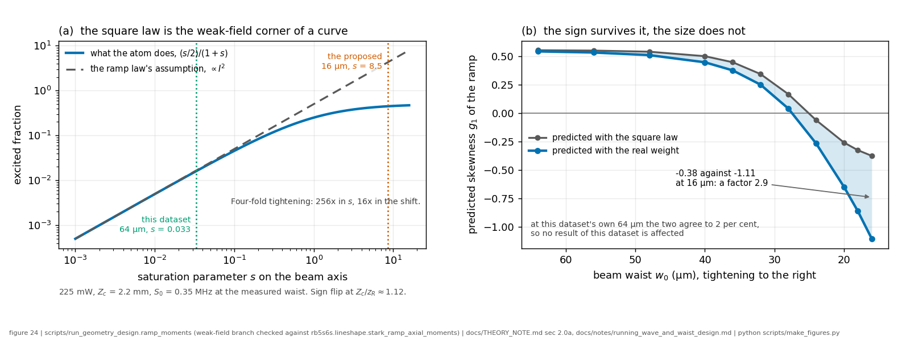
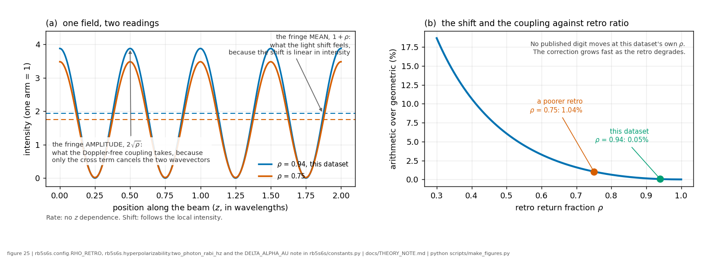

*Chapter 3 of 8 · [methods index](../methods.md)*

**The question.** What does a focused beam do to the light shift, once you
notice that the atoms it shifts sit at every intensity in the beam rather than
at one?
**Takes.** The lineshape chapter, for the symmetric kernels the ramp is
convolved with, and the measurement chapter for the retro geometry.
**Gives.** The triangular ramp law and its cumulants, the diverging-beam closed
form and its sign flip, which the collection geometry sets (the axial window
crossing 1.12 of the Rayleigh range), and the pinned intensity convention
behind $S_0$.
**Skip if.** You want the record's result rather than the physics. The ramp is
not resolved in the 2025 data and its bound is in the results chapter.

> **Unfamiliar with the vocabulary?** [GLOSSARY.md](../GLOSSARY.md)
> explains the measurement in six sentences, then defines every term
> and symbol used anywhere in this repository.

### 2.6 AC-Stark shift: derivation of the triangular "ramp law"

Intense light shifts atomic levels (the AC-Stark or light shift) by an amount
proportional to the local intensity $I$. This chapter takes the shift toward the
**red** (lower frequency), following [Orson *et al.*](../lit/orson2021.md) 2021's
published $\Delta\alpha$ for this line. An independent recompute here
returns the same magnitude but the *opposite* sign, an open question flagged for
adjudication in [`THEORY_NOTE.md`](../THEORY_NOTE.md) §5. Nothing in the record's
results depends on the choice, because the shape below and every bound drawn
from it are sign-immune ("The coefficient", below). Different atoms sit at
different radii in the beam and so feel different shifts. What does the *line*
show? Two facts set it up:

- **Two-photon excitation rate** $\propto I^2$ (each photon contributes one
  power of $I$).
- **Shift** $s = -\kappa I$ for some positive constant $\kappa$ (red $\Rightarrow$
  minus, per the convention fixed above).

Take a Gaussian beam, $I(r)=I_0e^{-2r^2/w_0^2}$, and let $u\equiv I/I_0\in(0,1]$.
The signal contributed by the annulus between $r$ and $r+dr$ is

$$dS  \propto  I^2(2\pi rdr) \propto  u^2rdr$$

Change variables from $r$ to $u$. From $u=e^{-2r^2/w_0^2}$,

$$\frac{du}{u}=-\frac{4r}{w_0^2}dr  \Longrightarrow   rdr=-\frac{w_0^2}{4}\frac{du}{u}$$

so

$$dS \propto  u^2\cdot\frac{du}{u} = udu$$

The shift at intensity $u$ is $s=-\kappa I_0u \equiv -S_0u$, where
the positive quantity $S_0=\kappa I_0$ is the on-axis (maximum) shift magnitude. Substituting
$u=-s/S_0$, the **signal-weighted distribution of shifts** is

$$\boxed{f(s) \propto |s|\quad\text{on}\quad s\in[-S_0,0]}$$

which is a triangular **ramp**. (The same law holds for a nanofibre's
evanescent field, because the intensity is exponential in the flat coordinate
there too, and that shared law is the physics bridge to the nanofibre extension.) Normalizing,
$f(s)=2|s|/S_0^2$, we get the moments by direct integration:

$$\langle s\rangle=\int_{-S_0}^{0}  sf(s)ds=-\tfrac{2}{3}S_0,
\qquad
\mathrm{Var}(s)=\tfrac{1}{18}S_0^2,
\qquad
\kappa_3=\langle(s-\langle s\rangle)^3\rangle=+\tfrac{1}{135}S_0^3$$

So the **mean red pull is $\tfrac23 S_0$**, and the distribution is
positively skewed (peak pulled red, thin tail toward the blue). Here
$\kappa_2\equiv\mathrm{Var}$ and $\kappa_3$ are the second and third
*cumulants*. The ramp's own **standardized** skewness, the scale-free shape
number, is $\kappa_3/\kappa_2^{3/2}=18^{3/2}/135\approx0.566$, independent
of $S_0$ (a property of the triangle, not of the power). That fixed number is
the target of the form test below. What varies with power is the
*observed line's* asymmetry, which we get by folding the ramp into the rest
of the line.

**[Cumulants add under convolution](../wiki/third-cumulant.md)** (the cumulant of a sum of independent
variables is the sum of the cumulants), and the symmetric kernels contribute
nothing asymmetric: the Lorentzian, Gaussian and transit kernels all have
$\kappa_1=\kappa_3=0$. So the ramp's odd cumulants pass through the
convolution untouched, so the *whole line's* first-moment pull is
$-\tfrac23 S_0$ and its third cumulant is $\kappa_3^{\text{tot}}=S_0^3/135$,
**exactly**, independent of the (unknown) laser/transit widths. These two
odd cumulants are the clean, apparatus-independent handles, and the mean
pull is the primary fixed-lock-session observable
([where this can go](08_assumptions_and_outlook.md)).
(The dataset's centre channel supplies no bound of its own. A peak position is
a frequency only within a run of traces taken at one scope horizontal setting,
so each run carries a free offset, and the pull comes out unidentifiable rather
than merely imprecise. The width-and-shape channel is the dataset's only
light-shift channel: see [the results chapter](07_what_we_found.md) and
[`THEORY_NOTE.md`](../THEORY_NOTE.md) §3.)

A literal *standardized* skewness of the full profile is more delicate,
because the homogeneous Lorentzian has divergent second and higher even
moments. $\kappa_2^{\text{tot}}$ is not finite, so one must work at fixed
fit window rather than with whole-line moments. Over the fit window the
symmetric part contributes an effective width $\sigma_\text{eff}$ (a standard
deviation, $\sim 2$ MHz, set mostly by the $\sim 5$ MHz total FWHM and
nearly power-independent), against which the asymmetry reads as

$$g_1^{\text{obs}} \sim \frac{\kappa_3^{\text{tot}}}{\sigma_\text{eff}^3}
=\frac{S_0^3/135}{\sigma_\text{eff}^3} \propto S_0^3 \propto P^3$$

since $S_0\propto$ power $P$. (No contradiction with the fixed $0.566$: that
is the standardized skew of the ramp *alone*, where here the same $\kappa_3$ is
divided by a much larger and nearly fixed symmetric width.)

**Two consequences for the 2025 data.** First, the ramp predicts the FWHM
should move $\lesssim2$% across our power sweep, and the dataset shows no
significant power trend. The observed 3 to 8% spread is non-monotonic block
scatter, an order above the predicted ramp contribution, so the dataset cannot
resolve the ramp term. The old "power null" is therefore a null the ramp law is
*consistent with*, not a confirmation of it. Second, the observed asymmetry
$\propto P^3$ is $\sim10^{-4}$ against a $\sim10^{-3}$ noise floor, which is
unmeasurable, so all AC-Stark *coefficients* move to a fixed-lock session, where
the shift itself ($\propto P$) is measured directly against a stable lock.

*Code:* `stark_ramp()`, built from exact per-cell integrals so the area is
exactly 1 and the mean exactly $-\tfrac23 S_0$ even for shifts far below the
grid step.

#### The general law: the signal exponent sets the ramp shape

*General framing: [the AC-Stark shift](../wiki/ac-stark-shift.md). The
derivation below stays here.*

Nothing in the change of variables above used $n=2$ except the weight
$u^n$. For a signal $\propto I^n$ the same steps give

$$dS  \propto  u^n\frac{du}{u}  =  u^{n-1}du
\qquad\Longrightarrow\qquad
f(s) \propto |s|^{n-1}\ \ \text{on}\ [-S_0,0]$$

For a **one-photon** transition ($n=1$, for instance the Stark-induced
forbidden lines of the parity-violation literature) the distribution is
**uniform**: mean $-S_0/2$ and, being symmetric about its mean, $\kappa_3=0$,
which is **zero skew**. The skewness observable exists at all *only because the two-photon
signal goes as $I^2$*. This one line is the delineation from the nearest
prior art ([Stalnaker *et al.*](../lit/stalnaker2006.md), PRA **73**, 043416 (2006), who extracted an
AC-Stark parameter from asymmetric standing-wave lineshapes numerically, in
the $n=1$, fringe-resolved regime, with the full delineation in
`docs/LITERATURE.md`).

#### $n=2$ is a weak-field statement, and the dataset sits near its edge

*Left, the weight the atom carries against the square law that stands in for
it, with this dataset and the proposed tight focus marked. Right, the
consequence for the observable the tight focus is wanted for. The dataset's own
configuration sits where the two agree to a couple of per cent.*

The $I^2$ weight is the leading term of the excited fraction, not the fraction
itself. What the atom actually contributes goes as $(s/2)/(1+s)$ with
$s=2\Omega^2/\Gamma^2$, which reduces to $I^2$ only while $s\ll1$, since
$\Omega$ itself is two-photon and quadratic in the field. That matters here
because $s$ scales as the *fourth* power of the inverse waist while $S_0$
scales only as the second, so the two do not move together. At the dataset's
measured 64 µm and 225 mW, $s=0.033$ and the weak-field law is safe to well
under a percent. At the 16 µm the small-waist session proposes, $s=8.5$, the
weight is nearly flat in intensity, and re-integrating the moments with the
saturated weight moves the predicted axial skew from $-0.36$ to $-1.07$. The
sign flip survives, the magnitude does not, so the tight-focus prediction is a
factor-of-three statement and the reason is a modelling assumption rather than
an unmeasured input. Computed by `scripts/run_geometry_design.py`, written up
in [`docs/notes/running_wave_and_waist_design.md`](../notes/running_wave_and_waist_design.md).

#### The parameter-free moment hierarchy (the form test)

Dividing out $S_0$, the ramp component predicts *pure numbers*:

$$\frac{\mathrm{Var}(s)}{\langle s\rangle^2}=\frac{1/18}{4/9}=\frac18,
\qquad
g_1\equiv\frac{\kappa_3}{\mathrm{Var}(s)^{3/2}}
=\frac{1/135}{(1/18)^{3/2}}=\frac{18^{3/2}}{135}\approx+0.566$$

A fixed-lock session would test them in order of statistical cost.

1. **Mean pull against $P$.** The first cumulant, exact and
   apparatus-independent (§above), first order in $S_0$, and a fixed lock is
   what makes centres usable at all.
2. **Excess variance against $P^2$.** The symmetric second-moment growth
   $\mathrm{Var}\propto S_0^2$, which is exactly what the Cs 6S to 8S
   literature reported as a growing Gaussian width.
3. **Skewness.** The smallest signal, and the only moment that is *zero unless*
   $n=2$.

The pure numbers above are the ramp *alone*. In the measured line each is
diluted by the symmetric kernels, and read at a fixed fit window per the
divergence caveat above, so the hierarchy is fitted jointly rather than read off
one trace.

#### Diverging-beam collection: the closed form and the sign flip

The triangle assumed a beam of constant waist across the detection region.
Really the fluorescence lens collects from an axial window $|z|\le Z_c$
around the focus while the beam diverges, $w^2(z)=w_0^2(1+\zeta^2)$ with
$\zeta=z/z_R$, $z_R=\pi w_0^2/\lambda$. At each $\zeta$ the transverse law
holds with a *local* maximum shift $S(\zeta)=S_0/(1+\zeta^2)$, and the per-slice
signal weight is $\propto w^2 I_0^{n}\propto(1+\zeta^2)^{1-n}$, which
exactly cancels the local normalization $S(\zeta)^{-n}$ up to one factor
$(1+\zeta^2)$. The $z$-integral then closes for any $n$:

$$f(s) \propto |s|^{n-1}\left[\zeta_m+\frac{\zeta_m^3}{3}\right],
\qquad
\zeta_m(s)=\min \left(\frac{Z_c}{z_R},\ \sqrt{\frac{S_0}{|s|}-1}\right)$$

$Z_c/z_R\to0$ recovers the triangle, and the hard edge at $-S_0$ softens to
zero because only the focal plane reaches the full shift. Numerically, on a
uniform window at $Z_c=2$ mm, which was a placeholder when this table was first
computed and is now supported by the magnification estimate below at 2.0 to
2.4 mm, and which stays OPEN until the fixed-lock session's collection-profile
measurement:

| config | $Z_c/z_R$ | $\text{mean}/S_0$ | $\text{Var}/\text{mean}^2$ | $g_1$ |
|---|---|---|---|---|
| pure triangle | 0 | $-0.667$ | 0.125 | $+0.566$ |
| 60 µm (proposed config L) | 0.18 | $-0.660$ | 0.125 | $+0.564$ |
| 64 µm (2025 dataset) | 0.15 | $-0.661$ | 0.125 | $+0.565$ |
| 16 µm (proposed config S) | 2.47 | $-0.431$ | 0.333 | $-0.354$ * |

\* At 225 mW config S is already saturated (PLAN §3), so the effective
signal exponent $n$ there is below 2: that *strengthens* the negative skew but the
$n=2$ magnitudes in this row are no longer parameter-free. At config S the
sign is the robust observable, and the magnitudes belong to L and M.

An independent derivation reached the same numbers (external review,
2026-07-26, held privately): working the $z$-integration by hand gives the
long-cell weight in closed form, $w(u)\propto\sqrt{(1-u)/u}(1+2u)$ with
mean $S_0/3$, variance $11S_0^2/144$ and $|g_1| = 0.5482$, and its quadrature
matches this module's numerics to every printed digit at every geometry
tested, with the crossover at $Z_c/z_R = 1.1172$. The closed forms are held as
tests (`test_axial_ramp_matches_the_independent_closed_form`).

**The skewness flips sign** (crossover at $Z_c/z_R = 1.1172$): a long
window piles signal into weak out-of-focus shifts, leaving a tail toward
$-S_0$. Whether config S lands past the crossover is a question about the
collection optics, and $Z_c$ is not a free parameter: for the side-viewing
$f=18$ mm lens imaging the beam onto the PMT it is the axial field of view in
object space, $Z_c=L_\parallel/2M$ with magnification $M=v/u$ ($u$ = lens–beam
and $v$ = lens–PMT distances, $1/u+1/v=1/f$), where $L_\parallel$ is the
photocathode's active extent *along the beam image*. The R636-10 cathode, the
tube housed in the Thorlabs PXT1/M module seen in the in-campaign photograph,
is a 3 × 12 mm rectangle, so which of its axes lies along the beam is a ×4
lever on $Z_c$.

It is the 12 mm axis. The cathode was mounted **landscape** through the 2025
campaign (experimenter-confirmed 2026-07-23, [APPARATUS](../APPARATUS.md)) and is not
re-oriented between configurations, so $Z_c = 6/M$ mm is a single fixed number
and $Z_c/z_R$ moves between the two configurations only through $w_0$.
Landscape is the larger of the two cases, so it pushes $Z_c$ *towards* the
crossover rather than away from it, and the two-waist flip survives it across
the whole plausible range of magnification:

| $M$ | $Z_c$ (mm) | $g_1$ at 64 µm | $g_1$ at 16 µm | flips |
|---|---|---|---|---|
| 0.5 | 12.0 | $+0.142$ | $-0.510$ | yes |
| 1.0 | 6.0 | $+0.498$ | $-0.476$ | yes |
| 2.0 | 3.0 | $+0.560$ | $-0.416$ | yes |
| 4.0 | 1.5 | $+0.565$ | $-0.277$ | yes |
| 6.0 | 1.0 | $+0.566$ | $-0.071$ | yes |

So the sign-flip test does not require $M$ to be known: it holds for every $M$
from 0.5 to 6. Portrait would have forfeited it, because $Z_c = 1.5/M$ mm sits
below the 0.90 mm flip threshold for any $M$ above 1.7 (PLAN §6 #4).

**The magnification is roughly known too.** The collection lens was the
$f=18$ mm one and nothing else, with $M$ estimated at 2.5–3 (experimenter,
2026-07-29, an ESTIMATE and not a measurement, with $u$ and $v$ still wanting
a ruler).
That gives $Z_c = 6/M = 2.0$ to $2.4$ mm, and it hangs together: $1/u+1/v=1/f$ with
$M=2.5$–3 puts the lens 24–25 mm from the beam and the photocathode 63–72 mm
behind it, an ordinary side-viewing layout. Three consequences:

1. **The $Z_c = 2$ mm placeholder this chapter has been carrying was right.**
   The estimate lands at 2.0–2.4 mm, so the record's numbers computed with it
   stand rather than needing revision.
2. **The dataset's configuration sits at $\zeta = 0.15$ to $0.19$**, i.e. well
   inside the transverse-only regime, with $g_1 = +0.563$ to $+0.565$ and mean
   $0.659$ to $0.661$ $S_0$, within 1.5% of the pure-triangle values.
3. **The proposed flip is near the best the geometry allows**: $+0.56$ at 64 µm
   against $-0.35$ to $-0.39$ at 16 µm, a swing of $\approx0.92$ to $0.95$ in a
   quantity whose full range is $\pm0.57$.

The remaining measurement is $u$ and $v$ (PLAN §4, §6 #4). The solid-angle
weighting varies by under 2% across any such window, so the top-hat form is
fair and the *width* is the only unknown. Geometry permitting, a proposed
session's skew program is then a **sign-flip test between beam
configurations**, $g_1$ positive at the large waist and negative at the small
one, a signature no instrumental asymmetry can mimic because the instrument
depends on $z_R$. At the measured 64 µm 2025 waist the coefficients above
carry only a few-% geometry caveat: its longer $z_R$ makes the ramp nearly the
pure-triangle $Z_c\to0$ limit at $g_1\approx+0.56$, where it was 10 to 40% at
the old 32 µm nominal, and the wider waist only strengthens the
approximation). *Code:*
`stark_ramp_axial()`, table from `scripts/run_ramp_geometry.py`.

#### Standing-wave fringes: why the shift follows the envelope

*The question this subsection answers, and the one it does not. The shift takes
the fringe mean, $1+\rho$, which is what the paragraphs below establish. The
Doppler-free two-photon coupling takes a different combination of the same two
arms, the fringe amplitude $2\sqrt{\rho}$, because only the term whose
wavevectors cancel is Doppler-free. Their ratio is the fringe contrast, which
at this bench's $\rho$ is a correction in the fourth digit and at a poorer
retro is not.*

The retro-reflected beam makes $\lambda/2$ intensity fringes. Does an atom
feel the fringe *peak* intensity (a coherent $\times2$) or the average? The
frequency-modulation criterion ([Stalnaker *et al.*](../lit/stalnaker2006.md), Sec. IV): as an atom
crosses fringes its AC-Stark shift is modulated with peak deviation
$\xi=S_0\lesssim1$ MHz at modulation frequency
$f_\text{mod}=2v/\lambda\approx0.56$ GHz (axial thermal speed $\sim280$ m/s,
fringe spacing $\lambda/2$). The FM modulation index is
$\xi/f_\text{mod}\sim2\times10^{-3}$:
deep in the narrow-band regime, so the shift response is a pure carrier and
the sidebands are negligible and the atom responds to the **time-averaged**
intensity. The shift is thus $\propto(1+\rho)I_{\text{fwd}}$ with $\rho$ the
retro power ratio, with **no coherent fringe enhancement**. (Atoms with axial
speed $\lesssim5$ m/s, 1 to 2% of the signal, are fringe-resolved, which is a
percent-level correction.) The remaining OPEN quantity in $S_0$ is the
measured $\rho$ per beam configuration (in situ at the cell, in a fixed-lock session).

**Why $\rho$ sits close to 1 by design, and why it is now assumed rather
than asserted.** The 2025 retro is a
self-imaging (lens-based) one: the beam is focused into the cell by L1
($f=150$ mm), and a second lens L2 ($f=150$ mm) after the cell maps the cell
waist onto an intermediate waist behind it, since by the Gaussian f–f property a
waist at a lens's front focal plane becomes a waist at its back focal plane,
here $w_0'=\lambda f/(\pi w_0)\approx0.74$ mm for $w_0=64$ µm. A **flat**
mirror placed at that flat wavefront *time-reverses* the beam, so it retraces
back through L2 and re-forms the original 64 µm cell waist. The forward and
return modes therefore match **by construction**, and $\rho$ falls below 1
through losses (two further L2 passes, two further window passes, mirror
reflectivity) and through whatever superposition imperfection the alignment
leaves. Since v3.0.0 the code assumes $\rho=0.94\pm0.04$ rather than the
design value 1, because the design argument covers mode matching and not
loss. The arrangement is also forgiving:
that intermediate beam has $z_R'\approx2.8$ m, so the "mirror at the waist"
condition holds to within tens of centimetres, and residual sensitivity is
dominated by mirror *tilt*, not longitudinal placement. (The 2019 reference
measurement on this line achieves the same self-imaging with a concave mirror
at $2f$ instead of a lens plus flat mirror, which is a different implementation
of the identical idea, `LITERATURE.md` §6a.) Note the design must be *re-established
per waist* in a fixed-lock session: L2 has to sit a focal length from the new waist, and the
intermediate beam grows to $\approx3$ mm at $w_0=16$ µm, so return-path
clipping is the thing to watch (PLAN §4).

How much would a departure from the assumed $\rho$ actually cost? Less than
one might fear, and the dataset's own signal quality provides indirect
evidence. Since $S_0\propto(1+\rho)$, *any*
$\rho\in[0,1]$ moves the prediction only between 0.18 and 0.36 MHz, a factor
of two end-to-end, and the recorded bound ($S_0(225\ \text{mW})$ below 0.26 MHz,
[what we found](07_what_we_found.md))
brackets the whole range, so no conclusion in the record turns on it. Better, the
Doppler-free *rate* scales as $\rho$ itself (it needs one photon from each
direction, so the signal $\propto I_\text{fwd}I_\text{bwd}$), not as $1+\rho$:
a badly mismatched retro would have destroyed the signal long before it
appreciably moved the shift, so the dataset's strong, clean lines are
evidence that $\rho$ is not small. The asymmetry is worth
remembering: the retro threatens the *signal* far more than the *coefficient*.
It matters for a fixed-lock session precisely because the coefficient is then the point:
$\rho$ is measured in situ, per configuration (return-path clipping differs
with waist), before any $\Delta\alpha$ in physical units is quoted.

#### The coefficient (field-intensity convention, pinned)

The ramp *shape* and its centred moments are convention-free, but the
*magnitude* of $S_0$, which converts a measured centroid pull into the
differential polarizability $\Delta\alpha=\alpha_{6S}-\alpha_{5S}$, needs the
$\langle E^2\rangle$ convention fixed. We adopt the standard AMO one ([Grimm
*et al.*](../lit/grimm2000.md) 2000, [Steck](../lit/steck_rb.md)): for $E(t)=E_0\cos\omega t$, $\langle E^2\rangle=E_0^2/2$,
so $\Delta E_i=-\tfrac14\alpha_i E_0^2=-\alpha_i I/(2\varepsilon_0 c)$ and

$$S_0=\frac{\Delta\alpha\ I_\text{eff}}{2\varepsilon_0 c h},\qquad
I_\text{eff}=(1+\rho)\frac{2P}{\pi w_0^2}$$

With $\Delta\alpha=1093$ a.u. ([Orson *et al.*](../lit/orson2021.md) 2021) this is $S_0=0.35$ MHz (transition) at 225 mW,
$w_0=64$ µm (the adopted prior, where it read 0.59 at the replaced 50 µm and
1.43 at the 32 µm nominal before that) and
$\rho=0.94$, growing to 5.6 MHz at $w_0=16$ µm. The on-axis $\propto S_0^3$
scaling above is the *pure transverse triangle*. At a small waist the axial
average over the collection window changes the third cumulant's magnitude and,
past $Z_c/z_R\approx1.12$, its sign, so the small-waist gain is not the naive
$\times 64$ (see the geometry discussion below and PLAN §6 #4). The **sign** is
convention-independent, set by $\text{sign}(\Delta\alpha)$, red for Orson's
published positive $\Delta\alpha$. That sign is itself under adjudication: an
independent sum-over-states recompute here agrees on magnitude to within 5% but
returns a negative $\Delta\alpha$, which is a **blue** shift
([`THEORY_NOTE.md`](../THEORY_NOTE.md) §5). Every recorded result quoted in this
repository is unaffected, because the asymmetry null is symmetric and both the
$S_0$ bound and its prediction band use $|\Delta\alpha|$. *Code:* `lineshape.stark_shift_S0_mhz()`. The full
theorist-facing derivation, novelty position, and the open diverging-beam
question are in [`docs/THEORY_NOTE.md`](../THEORY_NOTE.md).

---

**Where the numbers live.** Modules M16, M19 · producers
`scripts/run_ramp_geometry.py`, `scripts/run_polarizability.py` · results
`results/polarizability.csv` · figures: `fig24_weak_field_limit.png` for the
regime this law holds in and `fig25_retro_combination.png` for the intensity
convention behind $S_0$. Library code:
`rb5s6s/lineshape.py`, for `stark_ramp()`, `stark_ramp_axial()` and
`stark_shift_S0_mhz()`, with the independent closed forms held as tests.

**What would falsify this.** A measured skewness of the same sign at both beam
configurations. The sign flip is set by $Z_c/z_R$ and by nothing an
experimenter can tune independently, so a sign-preserving pair would refute the
diverging-beam form, and a skew magnitude away from the tabulated one at a
measured $Z_c$ would refute the $n=2$ weighting the whole law rests on.

[← The lineshape, kernel by kernel](02_the_lineshape.md) · [The composite model →](04_the_composite_model.md)
