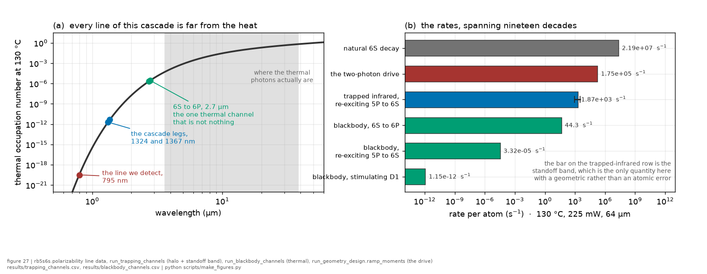
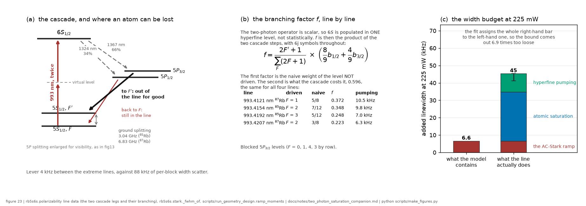
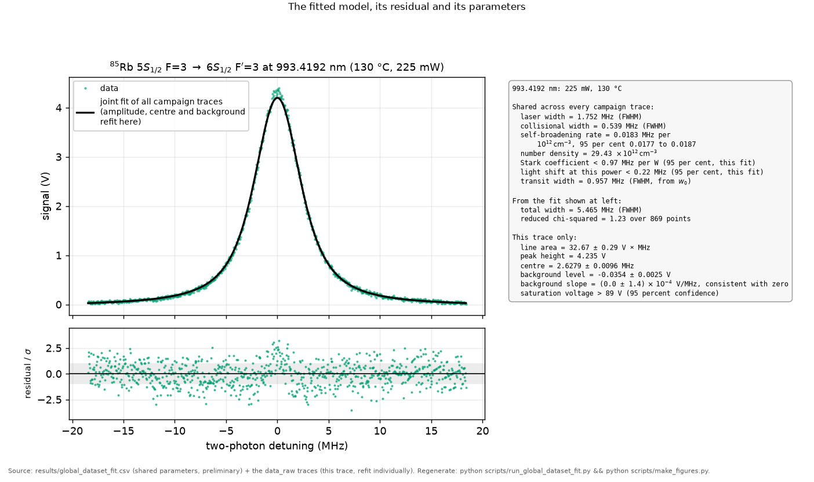

*Chapter 4 of 8 · [methods index](../methods.md)*

**The question.** How do the separate kernels become one profile in code, and
what is deliberately kept out of it?
**Takes.** The lineshape chapter and the AC-Stark chapter, whose kernels it
assembles.
**Gives.** `model_profile()` and `composite_profile()`, the two functions every
fit in the statistics and results chapters calls.
**Skip if.** You are not going to read the code. Most of this chapter is
radiation trapping, the mechanism that moves amplitudes without moving the
lineshape, and the trapping result itself is reported in the results chapter.

> **Unfamiliar with the vocabulary?** [GLOSSARY.md](../GLOSSARY.md)
> explains the measurement in six sentences, then defines every term
> and symbol used anywhere in this repository.

### 2.7 Radiation trapping: why it moves amplitudes, not the lineshape

At high density the cell becomes optically thick to the 795 nm detection
photons: a photon emitted deep inside can be **reabsorbed by a ground-state
atom** and re-emitted, possibly many times, before escaping. The optical depth
governing this is

$$\tau_\text{opt}=n_g\sigma_{795}L$$

with $n_g$ the ground-state density, $\sigma_{795}$ the absorption cross
section, $L$ the path. Here $n_g$ is the *thermal*
ground-state population, essentially the full density $N$, which the weak
two-photon excitation barely perturbs, and it is the **same at every point of
the 993 nm frequency scan**. So the photon escape probability
$\epsilon(\tau_\text{opt})$ is a constant multiplier across the scan: trapping
**rescales the amplitude** (and can alter photon-counting *statistics*) but
does **not** distort the two-photon lineshape. Onset is at
$\tau_\text{opt}\sim1$, i.e. $N\sim1/(\sigma_{795}L)\sim10^{12}$ to $10^{13}$
cm⁻³, straddled by our T-sweep. We tested the statistics route: the
shot-noise coefficient $b$ in the noise law ([§4.4](06_the_statistics.md)) is **flat in temperature**
(no growth of the Fano factor 70→130 °C), so trapping, if it shows anywhere,
shows in *amplitude ratios* versus density (module M7, against [Nieddu's 2019](../lit/nieddu2019.md)
same-channel baseline), never in the width. *Code:* the $b(T)$ table from
`noise.py`, and the M7 finding is below.

There is one further subtlety that connects trapping to the **degeneracy law**
(§ amplitude ratios, module M10). Trapping is scan-constant *for a given peak*,
but it is **not** the same *across* peaks: the emitted 795 nm photon's frequency
is set by which $5P_{1/2}F'$ and $5SF''$ the cascade uses, so different
hyperfine paths and the two isotopes overlap the ground-state D1 absorption
differently. ⁸⁵Rb carries $\sim 2.6\times$ the ground-state
D1 absorbers of ⁸⁷Rb (its 72 % abundance), so at equal density it is
trapped harder. Differential trapping is therefore a candidate mechanism for
breaking the pure population ratios (5/3, 7/5, 2.42), and unlike the
between-block drift, it is **monotonic in density and isotope-ordered**, which
is exactly the discriminator M7 now runs.

#### The other trapped colour, and why it does not re-excite the atoms

Everything above is about the 795 nm photon we detect. The same atoms radiate
on two more lines, the 6S to 5P legs at 1324 and 1367 nm, and those were never
examined. The question is whether trapped infrared light re-drives 5P back up
to 6S and feeds the signal a second time.
`scripts/run_trapping_channels.py` answers it and the answer has two halves.

Three facts first, all computed from this package's own line data rather than
accepted. The two legs' Einstein coefficients sum to 100.33 per cent of the
independently measured 6S decay rate, which is a closure check because 6S has
no allowed decay to 5S, and the branching is 34.09 per cent through $5P_{1/2}$
and 65.91 through $5P_{3/2}$. Their Doppler-broadened peak cross-sections are
$1.41$ and $1.50\times10^{-11}$ cm², which is the same as the D1 cross-section
the argument above uses at 795 nm. So the infrared absorbs as strongly per
lower-state atom as the detection line does, and what separates the two
channels is population and nothing else. That is worth stating because the
infrared is usually set aside on the grounds of its wavelength.

**Inside the driven volume the re-excitation cannot happen, because both
infrared lines are inverted.** 5P empties in 27 ns while the drive keeps
refilling 6S, so the degeneracy-weighted populations run 4.81 to 1 on the
1324 nm line and 5.26 to 1 on 1367 nm. Trapped infrared there stimulates 6S
downward instead of pumping 5P upward.

**Outside it can, and it is about one per cent.** Trapped 795 nm photons
deposit $5P_{1/2}$ population in a halo around the driven column where there is
no 6S at all, and there the infrared absorbs. That halo grows steeply with
density, reaching $1.13\times10^{10}$ cm⁻³ at 130 °C, which is 0.64 of the 5P
density inside the beam, and it re-excites 5P to 6S at **1.07 per cent** of the
primary two-photon rate. At 110 °C it is 0.08 per cent and at 70 °C it is
nothing.

Those are point values at a 2 mm standoff, and the standoff is **not recorded**.
The result is geometry-dominated, so it is carried as a band over the 1 to 5 mm
the record brackets: **0.49 to 1.85 per cent at 130 °C** and 0.04 to 0.12 at
110 °C (`results/trapping_channels.csv`, `err_kind = geometry`). The conclusion
is unchanged across the whole band.

That one per cent lands where the argument above already says trapping lands,
by a second and independent mechanism. The halo is fed by trapped 795 nm
photons, whose number is proportional to the two-photon rate, so the re-excited
population tracks the line rather than adding a pedestal: it rescales the
amplitude and does not distort the shape. Its density dependence is **steeper**
than direct trapping's, though, because it is a product of two density-driven
factors, so it bites the amplitude-versus-density comparisons of M7 and M10
rather than the widths. ENVELOPE throughout: the halo volume and the escape
factor are geometric estimates and the Holstein form assumes a Doppler line in
a cylinder, so the isotope *ratio* is the robust part and the absolute scale is
not.

#### A fourth power-dependent channel, named late: the EOM as a thermal lens

**Demoted 2026-08-18.** This channel was inventoried as a candidate for the
concave width against power, and that concavity has since been withdrawn to
provisional: it is 1.4 standard deviations under the between-block treatment,
is not confirmed by either independent power ladder, and shows
order-dependence where it can be tested. A mechanism for an effect whose
existence is not established is not itself established, so the treatment below
is retained as a physically real channel of the apparatus and is no longer
offered as an explanation of anything measured. See
[the acquisition-settings chapter](../plan/07_acquisition-settings.md) for the
measurement that would settle the concavity.

The mechanism sweep of 2026-08-17 found one channel with no treatment anywhere
in this record, and it came from apparatus knowledge rather than from analysis:
the EOM crystal clips the raw laser beam at its 3 mm aperture
([APPARATUS](../APPARATUS.md), manufacturer-sourced) and sits before the
focusing lens, so power absorbed at the crystal makes a thermal lens and the
cell waist becomes a function of drive power. That candidate matters because it
is the only proposed mechanism whose width signature can be non-monotone in
power, through the focus walking along the cell, and a non-monotone width
against power is what the summary widths show.

What the archive could test, it has. A lens with a thermal time constant
comparable to a block would drift within each five-repeat block as the crystal
re-equilibrates after every power step, and the pooled within-block drift
across all twenty campaign cells is minus 7.7 plus or minus 6.4 kHz per repeat,
a null that kills the slow branch alone. The rehearsal session's
alternating-direction ladders show no coherent direction signature either, so
ladder-scale hysteresis is disfavoured too. **The fast branch, a lens that
equilibrates within one sweep and makes a static w0(P), survives both nulls by
construction** and is discriminated only by measuring the waist against power
with the EOM in the beam, which [the plan](../plan/04_intensity-and-light-shift.md)
now requires, or by the component-resolved power sweep locating the anomalous
power dependence in the transit component. Until one of those runs, w0(P)
stands beside rho(P) as the two open candidates for the width structure, and
the composite model's constant-waist assumption is a stated assumption rather
than a checked one.

#### And the third radiation field: the cell's own blackbody

*All three fields at once, which is the only way the sizes are legible. On the
left, the thermal occupation number against wavelength, with every line of this
cascade marked and the band where the thermal photons actually sit shaded: the
detected line is twenty decades below that band and the infrared legs twelve.
On the right, what follows, over nineteen decades of rate. Only the
trapped-infrared row carries an error bar, because only its dominant unknown is
a distance rather than an atomic quantity.*

The cell's own thermal glow could in principle both re-drive the excited state
and shift it, and [blackbody radiation](../wiki/blackbody-radiation.md) gives
the general theory. Here neither reaches the measurement.

The cell runs at 70 to 130 °C, so it sits inside its own thermal radiation, and
the same two questions apply to it: does blackbody light re-drive 5P to 6S, and
does it touch the 795 nm signal. `scripts/run_blackbody_channels.py` answers
both, and one number decides almost all of it. At 403 K the blackbody **photon**
spectrum peaks near 9.1 µm while every line of this cascade lies between 0.79
and 2.8 µm, and the occupation number falls as $e^{-h\nu/kT}$. (The familiar
Wien figure, 7.2 µm here, is the peak of the energy spectrum. Photon number
peaks a quarter further out, and it is photon number an atomic rate follows.
Nothing below depends on which is quoted, since every rate is computed from
$h\nu/kT$ line by line.)

**It does not re-drive 5P to 6S.** The occupation numbers are
$2.0\times10^{-12}$ at 1324 nm and $4.6\times10^{-12}$ at 1367 nm, giving upward
rates of $7.4\times10^{-6}$ and $3.3\times10^{-5}$ s⁻¹. The trapped-infrared
halo above does the same job at about $1.9\times10^{3}$ s⁻¹, so blackbody light
is $10^{-8}$ of a channel that is itself one per cent.

**It does not touch the signal, and the blocking element is not the filters.**
Stimulated emission on D1 runs at $1.2\times10^{-12}$ s⁻¹ against a 28 ns
lifetime. For the background, the photocathode's own red edge does the blocking,
not the 50 dB of 795 nm filtering: the r636-10 is a GaAs tube whose response
ends near 900 nm (datasheet, not confirmed against the sheet here), and the
conclusion does not depend on that figure, because a cathode with a red edge
anywhere below a couple of µm is blind to a 9.1 µm peak. In the band it can
respond to at all, the whole cell wall emits
$3.0\times10^{3}$ photons per second at 70 °C and $3.6\times10^{6}$ at 130 °C,
before any collection solid angle and before the filters. That background is
flat in laser frequency, so it enters the free per-trace baseline rather than
the lineshape, and M1's shot-noise coefficient was measured **flat** from 70 to
130 °C, which bounds it empirically.

Two things are not negligible and are recorded rather than dismissed with the
rest. The one real blackbody channel is **6S to 6P** at 2.73 and 2.79 µm, where
the occupation number is $2\times10^{-6}$ rather than $10^{-12}$ because those
lines sit near the peak. It transfers out of 6S at 44 s⁻¹, a leak of 2 parts per
million from the detected cascade, negligible here and worth watching at the 150
to 170 °C extension [the outlook](08_assumptions_and_outlook.md) proposes. And
the **blackbody AC-Stark shift is hundreds of hertz**, not the ~1 Hz the ground
state alone would give, because the differential polarizability is 5171 minus
318 a.u. and the 6S resonances sit inside the blackbody band. It runs −79.9 Hz
at 70 °C to −161.0 Hz at 130 °C on the transition axis, $3\times10^{-5}$ of the
observed line. **It shifts and does not broaden**, so it cannot reach
$\beta_\text{self}$, which is read from widths. It is stated for the fixed-lock
session, where the centre is the observable and this is a $T^4$ systematic on
it.

That is a converged **principal value** through the two 6S to 6P poles, which
sit inside the blackbody band. Getting it needed three attempts and the failure
mode is worth knowing: the two poles are only 2.16 per cent apart in frequency,
so any symmetric window wider than about one per cent merges them and pairs the
integrand about the midpoint between them rather than about a pole, which looks
converged while being wrong. Per-pole windows are stable to the last digit from
0.2 to 1.0 per cent. The resonances contribute −0.33 Hz at 70 °C and −2.44 at
130 °C, so an earlier report of a 10 Hz unresolved residue was the grid and not
the physics. The error bar in `results/blackbody_channels.csv` is the committed
`alpha_6s_static` band carried through, about 0.7 Hz at 130 °C.

*One consistency check, and a correction to how it was first reported.* The
integration's long-wavelength limits, 318.3 and 5171.1 a.u., reproduce the
committed `alpha_5s_static` 318.28 and `alpha_6s_static` 5167.0 of
`results/polarizability.csv`. Those rows already carry their own Monte-Carlo
bands and their own validation, against Holmgren 2010 and the Safronova-group
value. This was first written up here as a free check of a module never tested
at DC, which was wrong: the DC check was already in the record, and what the
integration shows is that it agrees with it.

### 2.8 The composite model in code

`model_profile()` assembles every kernel of
[the lineshape chapter](02_the_lineshape.md) and the ramp of
[the AC-Stark chapter](03_the_ac_stark_ramp.md) on a common fine grid (homogeneous
Lorentzians combined analytically, the rest convolved numerically), returns an
area-normalized profile, and `fit_condition()` fits it to data with the
per-trace nuisances of [§4.2](06_the_statistics.md). It uses the pure triangular ramp
(`stark_ramp()`), and the 2025 fits keep it because $S_0$ is fixed per power
and the geometry correction sits far below the 2025 noise. A proposed fixed-lock session's
center-fits would swap in `stark_ramp_axial()` (the diverging-beam kernel of
[§2.6](03_the_ac_stark_ramp.md))
once the collection profile is measured. The no-Stark composite shared by the
$\beta_\text{self}$ and global fits is `composite_profile()` in the same
module.

*What is left out of `model_profile()`, and why it matters. The 5P decay does
not preserve $F$, so an atom that decays while crossing the beam can land in
the other ground state and leave the line for good. The right panel is the
reason this paragraph exists: the AC-Stark ramp, which the light-shift bound is
built on, is the smallest of the three terms that grow as the square of the
power.*

**Two broadeners with the ramp's own power signature are deliberately absent
from it.** Both grow as the square of the drive power, which is the ramp's
signature, so a fit that omits them lets the ramp absorb what they would have
taken and the light-shift bound comes out too loose. The first is atomic
saturation, which widens the homogeneous core by $\sqrt{1+s}$ and is the
larger of the two, about 3.7 times the ramp at the bound's own $S_0$. The
second is hyperfine pumping: every real 6S decay cascades through 5P, whose
decay does not preserve $F$, so a transiting atom can leave the driven ground
state mid-flight and the effective transit width rises. The ratio of the two
widths is exactly the branching fraction $f$, because $\Gamma_{6S}/2\pi$ is
itself the natural width, and $f$ is not resolved here beyond the bracket
$1/3$ to $2/3$. Both are omitted for the same reason: injecting them means
committing to the two-level homogeneous saturation law with a two-photon Rabi
frequency, which is standard practice rather than a derivation for this level
structure. The consequence is measured rather than argued, a factor 2.8 on the
width-only bound and 2.21 on the joint, so the committed bounds stand and are
known to be loose by that much
([`docs/notes/two_photon_saturation_companion.md`](../notes/two_photon_saturation_companion.md),
reproduced by `scripts/run_saturation_probe.py`). The degeneracy is
complete in both of the width channel's knobs, not just in power: all three
terms also grow as the inverse fourth power of the waist, the ramp because its
increment goes as the square of a shift that goes as the inverse square, and
the companions because the saturation parameter carries the two-photon Rabi
frequency squared. So no sweep this channel can run separates them. The
centroid pull does, since the companions broaden the line without moving it,
and that is the fixed lock's job.

*The model of this chapter against one peak at one condition, 130 degrees and
225 mW, with its residual strip and the parameters it was given against the
ones it fitted here. The shared shape comes from the joint fit over every
campaign trace and only the per-trace nuisances are refitted for this panel.
The residual strip is the useful part: a model missing a kernel would leave
structure there rather than noise. The four peaks each have their own figure of
this kind, fig18_single_4121 through fig18_single_4207.*

---

**Where the numbers live.** Modules M3, M7, M10 · producers
`scripts/run_amplitude_trapping.py`, `scripts/run_amplitude_ratios.py`,
`scripts/run_trapping_channels.py` (the infrared legs) and
`scripts/run_blackbody_channels.py` (the thermal field), both run by
`scripts/run_all.sh` and each writing a committed CSV ·
results `results/amplitude_trapping.csv`, `results/amplitude_ratios.csv`,
`results/trapping_channels.csv`, `results/blackbody_channels.csv` ·
figures: `fig23_hyperfine_pumping.png`, for the two broadeners this model
deliberately leaves out. Library code: `rb5s6s/lineshape.py`, for
`model_profile()` and `composite_profile()`, and the $b(T)$ table from
`rb5s6s/noise.py`.

**What would falsify this.** A width that moved with density the way the
amplitudes do. The argument here is that trapping is constant across a scan, so
it can rescale a peak but cannot broaden it, and a density-ordered width change
surviving the between-block drift would break that.

[← The AC-Stark ramp](03_the_ac_stark_ramp.md) · [From volts to a frequency axis →](05_the_frequency_ruler.md)
