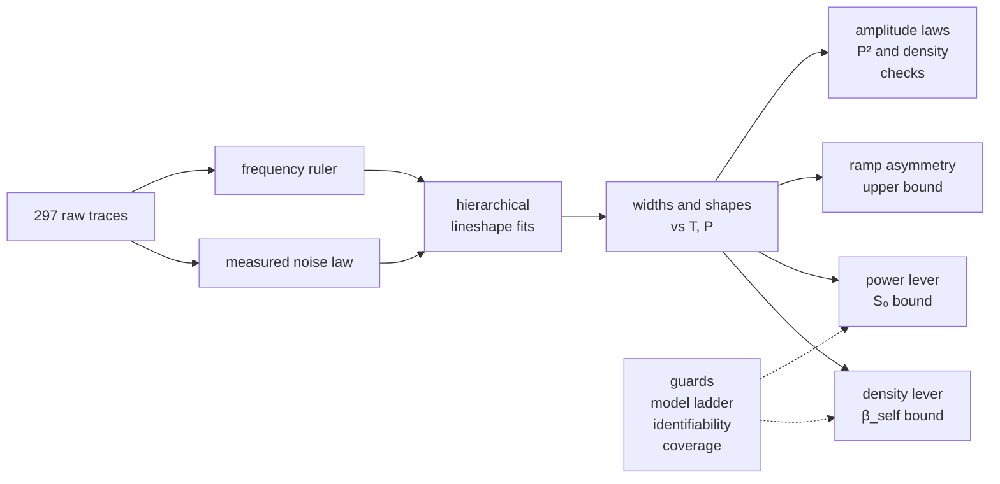

*Chapter 6 of 8 · [methods index](../methods.md)*

What makes a width taken from this dataset an honest number rather than a confident one? This chapter builds on the lineshape, AC-Stark and composite-model chapters, whose parameters are the ones being fitted and sets out the pre-registered rule that decides measurement against bound, and the error budget every result in the next chapter carries. For the physics rather than the inference, it is the wrong page. This is the longest chapter in the set, and §4.5 alone carries the rule the headline results turn on.

> [GLOSSARY.md](../GLOSSARY.md) states the measurement in six sentences and
> defines every term and symbol used anywhere in this repository.

## 4a. The pipeline, end to end

Raw traces enter on the left and the four levers leave on the right. The
guards sit across the two levers that carry a published bound.

This diagram lived on the front page and nowhere else until 2026-08-28, which
made it the only end-to-end map of the analysis and put it on the one surface
a reader has least time for.

## 4. The statistics, from first principles

### 4.1 Weighted least squares with *measured* weights

A fit minimizes $\chi^2=\sum_i \big(d_i-m_i\big)^2/\sigma_i^2$. The correct
$\sigma_i$ is the real per-sample noise, which here is *not* constant: PMT shot
noise grows with signal. The measurement (module M1, §4.4) gives

$$\sigma^2(V)=a^2+bV$$

per condition and use it as the weights. Unweighted fitting would let the
bright peak dominate and would misstate every error bar. Using the measured
$\sigma(V)$ is what makes the reported uncertainties meaningful.

That law also sets the unit of every residual panel in this repository. A
residual strip is plotted in units of each point's own $\sigma(V)$ under its
block's noise law, so a value of one is a one-sigma miss wherever on the trace
it sits.

### 4.2 Hierarchical fitting: share what physics shares, free what drifts

Each condition has five back-to-back repeats of the *same* physical line, but
the drifting 2025 laser moves the line center and the PMT gain wanders, so
fit the repeats **jointly**, sharing the physics and freeing the nuisances:

- **shared** across repeats: the lineshape parameters $\gamma_\text{coll}$,
  $\sigma_\text{laser}$ (and optionally transit),
- **per-trace**: amplitude $A_i$, center $\nu_i$, and a tilted baseline
  $b_{0,i}+b_{1,i}\nu$.

This is what makes drifted 2025 data usable: the drift lives in the per-trace
centers, the physics in the shared shape. The same idea extends across
temperatures, so `fit_beta_self()` ties $\gamma_\text{coll}(T)=\beta_\text{self}N(T)$
with a single shared $\beta_\text{self}$, turning four widths into one slope.
Treating $\beta_\text{self}$ as $T$-independent here is an approximation.
[Lewis 1980](../lit/lewis1980.md) Table 4.1 predicts an additional $T^{0.3}$
coefficient scaling for an $n=6$ potential, a rise of about 5% from 70 to
130 °C, checked directly by refitting each peak's four raw widths with that
scaling folded into the density axis. The result shifts $\chi^2$ by less than 0.4
against a between-block scatter of 140–250 kHz, roughly an order of <!-- other-quantity: a between-block scatter in kilohertz, not the dilute-gas margin of docs/methods/02 -->
magnitude larger than the predicted effect, so today's dataset has no power
to test the exponent. The assumption of a flat $\beta_\text{self}$ is unresolved,
not confirmed.

The full hierarchy (`fit_global()`, module M4b) fits *all* peaks and
temperatures at once, sharing each parameter at the level the physics licenses
and the choice of level is where the physics really enters:

- $\sigma_\text{laser}$ is shared **per temperature, across the four peaks**.
  The four lines are measured within one temperature dwell, so they see the
  *same* laser at that moment and jointly over-constrain $\sigma_\text{laser}(T)$
  which lets its drift across the cooling session be *measured* rather than
  mistaken for collisions. (Sharing one *global* $\sigma_\text{laser}$ across
  all temperatures, as a naive fit does, is exactly what manufactures a false
  detection. See §4.5. For a stable lock, global sharing becomes
  correct.)
- $\beta_\text{self}$ is shared **per isotope**, not globally: collision
  cross-sections need not be equal for ⁸⁵Rb and ⁸⁷Rb, so the record *tests*
  $\beta_{85}$ vs $\beta_{87}$ rather than assume them equal.
- the transit width is shared globally (same beam, same $\sqrt T$ law),
  amplitude, center, baseline stay per-trace.

This breaks the Voigt degeneracy (§4.3) two ways at once, through the density lever
arm *and* the four peaks pinning one $\sigma_\text{laser}(T)$, and it comes with
a leave-one-condition-out check that no single block drives a shared
parameter. *Code:* `fit_condition()`, `fit_beta_self()`, `fit_global()`.

The lever cross-check (`lever_crosscheck_beta()`, module M4d) is the packaged form of
this hierarchy, the value and the *full error budget* the paper quotes. Its
headline is the **internally-consistent 70/90/110 °C cooling sweep** (one
session, monotonic cooling), fit across a model-form grid of transit cusp
(Lehmann) vs no-cusp (Voigt) $\times$ $\sigma_\text{laser}$ shared per $T$
(Model A) vs per-block (Model B). The spread of $\beta$ across those cells *is*
the model-form error bar. With the $w_0$-band and a leave-one-**peak** or
leave-one-**temperature** robustness scan it returns **one $\beta$ per isotope
carrying four separately-sourced error bars** (statistical, model-form, kernel,
$\text{confound}/w_0$). A synthetic-injection closure test (`tests/test_lever_crosscheck`)
recovers a known $\beta$ through the whole 20-trace machinery, so the pipeline
itself is validated by that recovery, not assumed.

The dataset's curated 130 °C anchor (the `serves_t130` traces, 225 mW) would
triple the density lever ($N{\times}15.2\to{\times}48.1$, Alcock), and the lever cross-check
uses it as a **lever test**: adding it pulls the joint $\beta$ far below the
cooling-sweep value. The lesson is not "bad block". It is that
$\gamma_\text{coll}$ **barely grows with density**: it rises only about [2.99](../../results/lever_crosscheck.csv "ref:lever_crosscheck:gamma_rise_factor:70to130")-fold
across a ${\times}48.1$ density span (70→130 °C), and the 130 °C widths sit *on*
that near-flat trend, whereas a real binary-collision width is *linear* in $N$.
So the fitted $\gamma_\text{coll}$ is a residual floor, not resolved collisions,
and $\beta$ is a **lever-dependent bound** and not a value, which is exactly why the
model-independent bound is the headline. (The 130 °C data are the extreme end of the
session, a secondary caveat that cannot be fully separated. Either way a fixed-lock session needs
*same-session* high-density points to resolve any real slope.)
*Run:* `run_lever_crosscheck.py` → `results/lever_crosscheck.csv`, with numbers in the
results ledger (`docs/RESULTS.md`).

### 4.3 The degeneracy and the full covariance

Because of the Voigt near-degeneracy ([§2.4](02_the_lineshape.md)), a single-condition fit returns
$\sigma_\text{laser}$ and $\gamma_\text{coll}$ with correlation
$\approx-0.85$: individually shaky, sum robust. The record therefore (i) always reports
the full covariance, and (ii) design $\beta_\text{self}$ to ride on the
$\gamma_\text{coll}$ **difference** across densities, where the shared laser
contribution cancels. Reported errors are additionally inflated by
$\sqrt{\chi^2_\text{red}}$ (model imperfection) and $\sqrt{\tau_\text{int}}$
(wing-noise correlation, §4.4), conservative by policy. Covariances are
obtained from a singular-value decomposition of the Jacobian rather than
$(J^{\mathsf T}J)^{-1}$, to stay numerically safe when parameters span very
different scales. *Code:* `fitutil.cov_from_jac()`.

### 4.4 The noise model and the second-difference estimator

To measure $\sigma(V)$ without contamination from the signal's slope, this record uses
**second differences**,

$$e_i=\frac{v_{i+1}-2v_i+v_{i-1}}{\sqrt{6}}$$

which annihilate any locally-linear trend exactly (so a bright line's steep
flank contributes nothing) while having unit response to white noise, so for
white noise of standard deviation $\sigma$, $e_i$ also has standard deviation
$\sigma$. Binning $e_i$ by local signal level and fitting the variance law
$\sigma^2=a^2+bV$ then gives $a$ (a floor by construction of the model, though measured on this dataset it is neither a dark term nor a property of the drive alone: it rises with power with a logarithmic slope of [0.85](../../results/detection_budget.csv "ref:detection_budget:floor_power_scaling:p_sweep") and, at one power, differs across the four lines by up to a factor [2.97](../../results/detection_budget.csv "ref:detection_budget:floor_peak_spread:p_sweep_175mW"), and against the condition's own peak height its slope is [0.44](../../results/detection_budget.csv "ref:detection_budget:floor_vs_peak_height:p_sweep") pooled, running from [0.18](../../results/detection_budget.csv "ref:detection_budget:floor_vs_peak_height:p_sweep_25mW") to [0.795](../../results/detection_budget.csv "ref:detection_budget:floor_vs_peak_height:p_sweep_175mW") by rung, so no single term fits it and an electronic component is bounded rather than excluded) and $b$ (the
shot-noise, "Fano", term).

The digitiser is not in this budget and the
measurement is not quantisation-limited: the committed files carry 11.86 <!-- other-quantity: a bit count -->
effective bits across their own swing, so the step at the median peak is about
150 microvolts and its standard deviation about 43, against a fitted floor
between 1.3 and 15.5 millivolts. That is thirty to three hundred and sixty times
below the floor, a hundred-thousandth to a thousandth of the variance, and the
moment study found the same from the other side, the instrument axis moving the
fitted exponent least of the four it varied. Wing-noise **correlation** is measured separately
by the blocking method and summarized as an integrated correlation time
$\tau_\text{int}$, which inflates the fit errors as above. The fitted $b$ is flat in
$T$ (the trapping test of [§2.7](04_the_composite_model.md)) and $\tau_\text{int}$ small.

**What $\tau_\text{int}$ measures is the line, not the noise**, and the
distinction was only made in 2026. The window called signal-free is not: a
Lorentzian wing is still falling through it, and the estimator removes a
straight line before summing the autocorrelation, so the curvature that survives
is read as correlation. Three checks separate them. On pure white noise with no
line at all the estimator returns exactly one at every length, so it is not
biased. On an *analytic* line laid over provably independent samples it returns
the archive's own value, so the line alone accounts for it. And removing a
quadratic instead of a straight line takes the archive to one, a Lorentzian wing
over a short segment being quadratic to that order. **The archive's noise is
white at sample scale**, which this repository's own 2026-07-11 verification had
already said in words and which nothing had reconciled with the committed
column.

The consequence runs toward caution and not against it: a fit that
divides its residuals by $\sqrt{\tau_\text{int}}$ widens every interval it
reports for a correlation the post-fit residuals do not carry.

And every estimator of $\sigma$ here is a high-pass, the one named *direct*
included, being built from first differences. Second differences annihilate a
linear trend, which is what they are for, and they also annihilate the slow
components of the noise itself, so they under-read it whenever the noise is not
white. The whiteness rescale exists to undo that, and it does not close it: the
floor it returns still sits below the wing's own scatter once the baseline is
removed to the order the wing needs. Read $a$ and $b$ as fit weights, which is
what they are for, and not as a measurement of the detection chain. *Code:*
`noise.py`.

### 4.5 Statistics versus systematics: the measurement-vs-bound rule

A large shared fit can return a very small formal error that is
nonetheless *wrong*. Sharing $\sigma_\text{laser}$ across blocks recorded
hours apart and the laser width actually drifted between them, the fit will
absorb that drift into $\gamma_\text{coll}$ and report a confident collisional
signal that is really instrument drift. This record's guard is **pre-registered** and
model-independent:

1. Collisional broadening *must* be monotonic in density. So take **raw**
   line widths (smoothed half-max $\times$ the ruler rate, no fitting) and
   check monotonicity in $N$.
2. Fit $W(N)=W_0+\beta_\text{eff}N$. The RMS scatter of the blocks about this
   line is treated as a **between-block systematic** and added in quadrature
   to each point's error.
3. Claim a **measurement** only if $|\beta_\text{eff}|/\sigma_\text{syst}\ge3$,
   otherwise report a **bound**.

Deciding this rule *before* looking is what separates a supported answer from
the overconfident one (see [what we found](07_what_we_found.md)). *Code:* `beta.collisional_slope()`,
`scripts/run_beta_self.py`.

### 4.6 Validation on synthetic data before real data

No fitter is allowed near real data until it recovers *known* injected truths
from campaign-like synthetics, checking bias, error coverage, and the
degeneracy. Then every headline conclusion is re-derived by
an **independent method** (for instance the sweep rate by FFT and autocorrelation, and the
noise law by differencing sibling repeats). Several of this record's own bugs were caught
exactly this way, and the verification records live in the module docstrings.

**What a same-model closure test does and does not establish.** Generating
synthetic data from the model and recovering the injected truth validates the
*implementation*: the estimator is unbiased, the optimizer converges, the
quoted intervals cover, the degeneracies behave, all of it **under the
simulated generative model**. It cannot validate the model itself: whether
the physical lineshape is the right one, whether a mechanism is missing, or
whether the real noise matches the simulated law. Those questions need
different evidence, and in this analysis they get it
elsewhere. The nested model ladder (§4.9) lets the data reject or demand each
component. The model-form comparison asks whether the dataset can even
distinguish competing kernels, and it cannot, which is reported rather than
resolved by assumption. The noise law is *measured* from sibling repeats
(§4.4) rather than assumed. The residual audits look for structure no fitted
component absorbs. Closure certifies the machinery. The physics has
to earn its place separately.

### 4.7 Choosing between competing lineshapes: the BIC

To ask *which* model form the data prefer, a smooth Gaussian extra-broadening
(a Voigt) against the cusped transit exponential (the Lehmann shape, [§2.5](02_the_lineshape.md)),
compare the **Bayesian information criterion**, $\text{BIC}=\chi^2+k\ln N$,
whose definition and reading scale are in
[information criteria](../wiki/information-criteria.md).

Voigt and Lehmann have the *same* $k$, so their comparison is
essentially which shape fits better. This is the tool for the Lehmann-cusp
test, and [what we found](07_what_we_found.md) reports what it returned.

### 4.7a Choice of criterion and its dependence on $N$

BIC is not the only way to penalise a parameter, and the choice is not a matter of
taste here because $N$ varies by four orders of magnitude across the places
this record makes a complexity decision. The two standard criteria differ only in that penalty,
$\text{AIC}=\chi^2+2k$ against $\text{BIC}=\chi^2+k\ln N$, so which is more
conservative depends entirely on how much data there is
([information criteria](../wiki/information-criteria.md)). In this repository
that means:

| where a complexity decision is made | $N$ | $\ln N$ | BIC penalty / AIC penalty |
|---|---|---|---|
| the noise variance law, over level bins | 10 | 2.30 | 1.15 |
| one condition's line fit | ~4400 | 8.40 | 4.20 |
| the global dataset fit | ~405000 | 12.91 | 6.46 |

So on a single condition BIC demands four times the evidence AIC does before
admitting a parameter, and on the global fit six times. A criterion that
conservative on this much data will decline structure that is really present,
and the cost of that is not neutral: an omitted component does not vanish, it
is absorbed by whichever fitted parameter can imitate it, and the record then
quotes that parameter as physics.

Two consequences bound how much the choice can matter here, and the general
form of both is in [information criteria](../wiki/information-criteria.md). A
comparison between forms with **equal** $k$, such as Voigt against Lehmann in
§4.7, is unaffected by the criterion entirely. And the criterion only decides
an outcome when the fit improvement lands **between** the two penalties.

The nested ladder of §4.9 is in the second category on the rung that matters:
the free AC-Stark parameter buys a summed $\chi^2$ improvement of well under
one unit across twelve conditions, so no penalty scheme can prefer it, and the
"bound, not a measurement" conclusion is criterion-independent. That is worth
knowing, because it is the conclusion a reader is most entitled to be
suspicious of.

A criterion is only as good as the fit it scores, and a violated nesting
inequality measures the optimizer rather than the data.
`rb5s6s.modelform.compare_ic` reports every criterion and
refuses to interpret a comparison whose nesting inequality is violated.

In practice this record reports a panel of four: AIC, AICc (its small-sample
correction, which the drift-settling analysis already uses at $n=26$ with that
stated reason), BIC over raw $N$, and BIC over the effective sample size
$N_\text{eff}=N/\tau_\text{int}$, the last being this repository's own
adjustment for correlated samples (§4.13) and labelled a sensitivity criterion
rather than an established theorem. The four are a robustness check across
selection conventions, not four independent votes, since each pair shares its
motivation. Every comparison quotes the numerical difference under every
member. Where all agree, the selection is robust across the panel. Where they
split, the ranking is convention-sensitive at this sample size, that fact is
itself reported, and a split alone never justifies adopting the richer model:
adoption then needs an independent, predeclared basis.

The one known split in
this record is the $\sigma_\text{laser}$ sharing of §4.13, where the BIC taken
over $N_\text{eff}$ favours sharing by $+61$ and AIC opposes it by $-6.6$, the
record's own "underpowered data" caveat made quantitative.

*Code:* `rb5s6s.modelform.info_criteria` and `compare_ic`, validated against
hand-computed penalties in `tests/test_info_criteria.py`.

### 4.8 Restricting the fit window: the off-center-sweep mirror

The laser is swept by a triangular voltage ramp. When that ramp is not
centered on the transition, its *down-ramp* re-crosses the line and leaves a
**mirror image** of the peak elsewhere in the acquisition window (~40 MHz away
on the transition axis). A single-line fit over the full window would treat
that mirror as unmodelled signal and let it bias the baseline and width. So the
line fits are restricted to a window around each trace's peak, wide enough to
keep the fat Lorentzian wings (where $\gamma_\text{coll}$ lives, since cutting too
tight would bias it) but tight enough to exclude the mirror: $\pm3.5\times$ the
trace's own measured FWHM, clipped to $[9,25]$ MHz.

That choice is no longer
treated as settled: the window scan of §4.14 and
[`results/fit_window_scan.csv`](../../results/fit_window_scan.csv) re-runs
every condition across this multiplier and finds a coherent width drift the
goodness of fit cannot see, so the committed window is a stated convention
with a measured robustness axis, not a solved problem.

The rulers need no such cut
on the same grounds. A symmetric triangle has the same rate magnitude on both
ramps, so a fold preserves the tooth *spacing* of a correctly labelled comb,
while a single line simply appears twice. That argument covers the spacing and
not the labelling. A mirror landing in an outer slot is fitted as a tooth, and
because it lands at a radius smaller than the slot it occupies the rigid grid
contracts to reach it, which is the separate failure the tooth-numbering ladder
and the excision rung address
([the ruler specification](../notes/ruler_validity_and_trim_prereg.md) §1, and
[`DATA.md`](../DATA.md) §7). Its disposition lands with the recompute's
addendum and is not settled here.

The window and the residual-tail trimmer are two guards against the same
contamination, and the window gets there first. The trimmer walks outward only
within the fitted samples, so a trim census reading zero on line fits is a fact
about the order of the guards and not about the data. Line traces with a rising
tail exist: three of the five repeats of the 993.4207 nm line at 130 °C and
25 mW carry an unmistakable one.

Whether the window sits in the right place was
open until it was measured directly: neither clip is active on the dataset (the
25 MHz cap binds on 0 of 159 canonical traces and the 9 MHz floor on 0 of 159),
the recorded crossings sit 7.64 to 8.54 fitted widths out against a window edge
at 3.50 <!-- other-quantity: FIT_HALFWIDTH_FWHM_MULT, the fit half-width multiplier, not a detection-budget gap -->, and the constant that is sensitive to the sweep rate in the widening
direction is the 9 MHz floor rather than the cap
([DATA](../DATA.md) §7, [the ruler specification](../notes/ruler_validity_and_trim_prereg.md)
§G3). *Code:* `linefit.adaptive_halfwidth()`.

### 4.9 The nested model ladder
§4.7's BIC compares two *shapes* with the same parameter count. A stricter
question is whether each physical *component* is warranted, or
whether a simpler model fits as well. So the fit takes a nested ladder of increasing
physics and compare by BIC ($\text{BIC}=\chi^2+k\ln N$, summed over conditions
since BIC is additive over independent data):

$$
\text{A: Voigt} \subset \text{B: +transit} \subset \text{C: +collisional width} \subset \text{D: +AC-Stark ramp}.
$$

On the T-sweep dataset the summed $\Delta\text{BIC}$ per rung is **A→B $\approx +879$** (transit decisively warranted), **B→C $\approx +1091$** (a free
Lorentzian width beyond natural is warranted, and the line genuinely needs both a
Lorentzian and a Gaussian component), and **C→D $\approx -100$**, *the free
AC-Stark parameter is decisively not warranted*. This is the two-epoch design
stated as a model comparison, and it answers "is
your novel AC-Stark component an unnecessary parameter?": on the *drifted*
dataset it **is**, because the free per-scan centres absorb the ramp's pull and
$\sigma_\text{laser}$ its width, so BIC declines to buy it, which is precisely
why the recorded AC-Stark result is a **bound**, not a measurement (§4.5).

Two checks qualify this result. The B→C rung warrants a free
homogeneous *width*, not resolved collisions: that width is separately shown
(M4) to be a **density-independent floor**, so $\beta_\text{self}$ stays a bound
regardless. And the *same* ladder, on synthetic data built with a stable lock
(no per-scan drift), **decisively warrants the AC-Stark rung and recovers the
injected $S_0$**, while on $S_0=0$ data it declines it. So the null on the real
dataset is a property of the drift, not of the method: a fixed-lock session
would flip C→D positive. *Code:* `rb5s6s/model_ladder.py`, `run_model_ladder.py`,
closure `tests/test_model_ladder.py`, numbers `results/model_ladder.csv`.

### 4.10 Identifiability of the decomposition

The degeneracy asserted throughout, that $\gamma_\text{coll}$,
$\sigma_\text{laser}$ and transit all broaden the same line, so the main fit
*fixes* transit and reports $\sigma_\text{laser}$ as a bound, is here made
quantitative in two layers: a local covariance analysis and the global
profile-likelihood map that first corrected and then certified it. Both on one
bright condition (993.4192 nm, 130 °C, 225 mW), all three widths free plus the
per-trace nuisances.

The map found the fit's second local minimum first. A single-start three-width fit
lands in a Gaussian-dominated local minimum ($\sigma_\text{laser}\approx2.4$ MHz,
transit railed at zero, $\chi^2 = 5026$). The profile map exposed a **deeper,
cusp-dominated local minimum**, at $\gamma_\text{coll}\approx0.22$,
$\sigma_\text{laser}\approx0.46$, transit $\approx1.43$ MHz, i.e. the transit
width the $w_0\approx43$ µm geometry predicts, at $\chi^2 = 4551$, a
$\Delta\chi^2\approx472$ preference. The local analysis is therefore anchored
by a **two-start fit** at the deeper branch, and both branches plus their gap
are committed (`branch`, `branch_gap` rows).

Set beside the accepted prior, this
was, until owner order O44 (2026-09-21), a tension the dataset owned rather
than resolved: the shape preferred $w_0\approx43$ µm where the beamline-lineage
measurement had put the accepted prior at **the retired convention**, 1.43 MHz of transit width
against 0.96 MHz at 130 °C. O44 retires that lineage transfer for this bench's own
bore-limited calculation, **42.38 µm**, [1.4459](../../results/transition_ladder.csv "ref:transition_ladder:6S:transit_fwhm") MHz of transit width at 130 °C, within
a few per cent of what the shape alone preferred, so the tension this
section was built around has largely dissolved, not merely shifted.
Taken at face value the shape data
*prefer* the physical decomposition (real transit cusp, narrow laser), and the
calculated prior now agrees with that preference instead of standing against it.

But
$\Delta\chi^2 = 475$ over about 4400 points is a $\chi^2$ change of about 10%
($\chi^2_\text{red}$ 1.15 → 1.04), the territory where transit-kernel
model-form imperfection also lives, a **consistency indication and not a
shape-based $w_0$ measurement**. A direct beam-profile measurement stays the arbiter, and the
C1/C2 upper bounds are unaffected.

At the anchored branch, the covariance (SVD of the Jacobian,
`fitutil.cov_from_jac`), diagonalized over the $3\times3$ width block:

- the strongest trade-off is $\gamma_\text{coll}\leftrightarrow$ transit
  ($\approx-0.97$): the two cusp-generating widths swap almost freely.
- the **condition number** of the width-block *covariance* is $\approx325$,
  which is strongly ill-conditioned.
- the **eigen-directions**: the best-constrained combination (a
  total-width-like sum, mostly $\gamma_\text{coll}$ + transit) is pinned to
  $1\sigma\approx0.003$ MHz, while the worst-constrained direction (dominated
  by $\sigma_\text{laser}$) is $\approx0.06$ MHz, about **20× looser**.

The global map (the standard referee demand: profile, not just covariance)
fixes ($\gamma_\text{coll}$, $\sigma_\text{laser}$) on a grid and re-minimises
$\chi^2$ over transit and every per-trace nuisance at each point (variable
projection, each cell fit from two independent warm-start lineages, with a
fresh-seed audit on every fifth cell). Its certifications, all committed: audit
gains $\le0.05$ (no warm-start trapping) and a **straight** valley floor
(RMS 0.0014 MHz against a 0.019 MHz grid step) whose ridge slope (+0.093) is
compared against the covariance ellipse's prediction (+0.123), since in the
Gaussian limit the profile contours are exactly the marginal covariance
ellipse.

**How much weight that comparison carries, and it is less than the word
agreement suggests.** The two numbers share a sign and an order of magnitude.
The prediction sits 32 per cent above the measurement, and both moved when the
arithmetic environment changed, the slope by 18 per cent and the prediction by
37. A pair that both moves and still tracks to this tolerance certifies the
shape of the valley, not the value of either number.

The whole neighbourhood moves together under an environment change: the
condition number and the valley-floor RMS are now [325.3](../../results/identifiability.csv "ref:identifiability:condition_number:width_block") and 0.0014 against the
pre-migration 389.7 and 0.0032, and the map-minimum certification changed
character, from a free fit that was the map's optimum to a zoom map that finds
a point 0.12 below it. The pre-migration values and the reason they moved are
recorded once, in
the history.
That is what an
ill-conditioned family does, and it is the reason this section exists.

What has not been separated is how much of that movement is the arithmetic
environment and how much is a later change to the lineshape module, since the
committed digits predate both. The record says so rather than attributing it,
and the attribution is left as an open item.

So the agreement is evidence that the profile map and the local covariance are
describing the same geometry, and it is not a precision test: one side of it is
ill-conditioned by exactly the mechanism the section is about. The robust
quantity of the two is the profile measurement, which is the same conclusion
this record reaches everywhere else it sets a profile against an ellipse. The
committed digits here are those of the environment of record
([`results/ENVIRONMENT_OF_RECORD.md`](../../results/ENVIRONMENT_OF_RECORD.md)). The joint-95% region closes inside the physical range **except toward
$\sigma_\text{laser}\to0$**: the line *shape* alone cannot exclude a
near-zero laser width at this condition.

*What the whole chapter is about, at one condition. The total width is pinned
to about a tenth of a per cent, and the split between the two components that
make it is pinned twenty times worse: the valley runs almost along a line of
constant total, so the pair can slide along it at almost no cost in fit
quality. The overlaid ellipse is the marginal covariance, and it agrees with
the profile map, which is the check that the reported error bars mean what they
say. The valley staying open toward zero laser width is the statement that the
line shape alone cannot exclude a narrow laser, and it is why the individual
widths are bounds conditional on the beam waist rather than measurements.*

So the dataset constrains the total width to about 0.1% but the split
twenty-fold worse, now as a certified-global statement rather than a local one: the
individual widths are genuinely $w_0$-conditional bounds, not measurements,
and a measured $w_0$ **collapses** the degeneracy, because it fixes transit to
within that measurement's own precision, so the split becomes identifiable
within that uncertainty rather than removed exactly (a perfectly-known $w_0$
would remove it, and a real one greatly reduces it). This is the formal statement
behind the width correlations quoted in
§2.4.

The same numbers answer *why not fit $w_0$ jointly*: $w_0$ enters the line only
through this width block (transit $\propto 1/w_0$) and the intensity
normalization ($\propto 1/w_0^2$), so freeing it adds a fourth member to the one
subspace the data already cannot split, so the fit would return the prior dressed
as a posterior. $w_0$ is instead measured out of band (knife-edge and/or camera) and
propagated as an explicit band. *Code:* `rb5s6s/identifiability.py`,
`run_identifiability.py`, closure `tests/test_identifiability.py`, numbers
`results/identifiability.csv`.
What a free per-trace centre removes, and why the information for the shift
vanishes at the boundary, is derived once on the
[identifiability wiki page](../wiki/identifiability.md) and not repeated here.

### 4.11 Coverage of the 95 per cent bound

The collisional bound's 95% is built from a between-block scatter estimated on
a small number of residual degrees of freedom, so it uses the Student-t
quantile rather than the Gaussian 2 (§4.5): $t(0.95,2)=2.92$ for the current
four-point headline (70/90/110/130 °C, since 2026-08-02, and the replaced
three-point 70–110 °C headline used $t(0.95,1)=6.31$). A bound is only worth
its coverage, so it is checked by simulation rather than asserted: at a grid
of *known* true $\beta$ the study generates 2000 synthetic four-point cooling+130 °C
sweeps each, with the dataset's own structure, a between-block scatter
mimicking the drift wander plus the small within-block SEM, run the
**shipped** estimator `beta.collisional_slope` on every one, and measure
bias, coverage, and the false-detection rate. The result:

- the point estimate is **unbiased** (bias $\approx-0.0001$ MHz per $10^{12}$
  cm⁻³, well below the bound).
- the Student-t 95% upper bound **covers the true $\beta$ $\approx100$% of the
  time**, valid and, on 2 dof, conservative (the safe direction for a bound, and
  the Gaussian-2 bound this replaced would *under*-cover, which is the whole
  the reason for the t-quantile).
- at $\beta_\text{true}=0$ the pre-registered SNR $\ge3$ "measurement" rule
  alone fires $\approx4$% of the time, a real false-positive rate, which is
  precisely why the analysis does **not** rely on SNR alone: the
  non-monotonic width-vs-density pattern (2/4 real peaks) is the decisive guard
  that forces the BOUND reading regardless (§C1).

So the headline is empirically calibrated: unbiased estimate, a 95%
(conservative) bound, and a documented false-detection rate that the
monotonicity guard suppresses. *Code:* `rb5s6s/coverage.py`, `run_coverage.py`,
closure `tests/test_coverage.py`, numbers `results/coverage.csv`.

### 4.12 The profile likelihood against a posterior

Three features of this dataset drive the choice:

1. **The headline is a bound, and a bound is only worth its frequentist
   coverage**, which §4.11 buys by simulation. A credible interval would need
   the same injection study to earn the same trust, and the profile construction is
   the ones one can, and does, calibrate directly.
2. **The dominant systematic is deliberately OPEN.** A posterior needs a prior
   on $w_0$, and marginalizing folds that prior invisibly into the quoted
   number. Keeping $w_0$ out of the likelihood and quoting an explicit
   $w_0$-band (§C1 of the ledger) keeps the conditionality on the page, and
   when the beam-profile measurement lands, the band collapses without redoing the inference.
3. **Where the data are weakest, a prior would dominate.** Four densities and
   two residual degrees of freedom (§4.5), or a $\chi^2$ flat to first order at
   the $\kappa=0$ rail (C3d): a posterior
   mostly reflects the prior, while the Student-t quantile and the profile scan
   state the data-poverty out loud.

Bayesian machinery is used where it is the right tool, model *selection*, as
the BIC ladder of §4.9.

A profile is only as good as its local minimum. A profile scan inherits every
weakness of the optimizer that walks it: a chain that starts cold and parks
in a false minimum produces a smooth, confident, wrong curve, and nothing
in the profile itself reveals the parking. This analysis learned that twice
on the joint fit, first on a direction variant and then on the primary
itself (a 283,000-unit false direction signal whose excess sat outside the
campaign data, the campaign column moving by only four units of it). The working discipline, now structural in the fitter:
the variant that finds the true local minimum most reliably runs first, every other
variant is seeded from its solution in addition to running cold, the
pointwise minimum over chains is what enters the profile, and no cold-start
profile is quoted without a seeded twin (docs/RESEARCH_DECISIONS.md §11).

### 4.13 Evidence for $\sigma_\text{laser}$ sharing

The hierarchical fit (§4.2) shares one $\sigma_\text{laser}(T)$ across the four
peaks at each temperature (Model A, per $T$). The conservative alternative frees
it per (peak, $T$) block (Model B, per-block, 9 more parameters). §4.5 and the
M4c check argue the sharing is *consistent* but *underpowered*, and this puts a number
on it. Both models are fit with the same machinery (`fit_global`) and scored by
$\text{BIC}=\chi^2+k\ln N$, with $\Delta\text{BIC}=\text{BIC}_\text{block}-\text{BIC}_T$
($\Delta\text{BIC}$ above 0 favours the shared model).

The result depends on how the sample size is counted. Each trace is a smooth
line sampled at about 2000 **correlated** points, so the roughly 49k raw samples are
not 49k independent observations. Counting them as such over-weights the per-block
fit's tiny $\chi^2$ gain and returns $\Delta\text{BIC}\approx-52$ ("per-block
wins"). But the noise model already whitens each residual by $\sqrt{\tau_\text{int}}$
($\tau\approx3.5$). The **matching** effective size $N_\text{eff}=N/\tau$ with the
whitened $\chi^2$ gives $\Delta\text{BIC}\approx+61$ ("shared wins, decisively").
The $N_\text{eff}$ BIC is the statistically correct one, since correlated samples are not
independent, so the shared model is favoured: **the dataset cannot pay for
per-block $\sigma_\text{laser}$ freedom**. Two caveats apply:

- it is **parsimony and not physics**, since four peaks that co-drifted between
  acquisitions would look shared too (§4.2, M4c), and no in-sample score recovers
  the timing. A positive $\Delta\text{BIC}$ means "the alternative is not warranted", not
  "the sharing is real". The recovered clock sharpens this from "unlogged" to
  *dated and unfavourable*: the four peak-blocks of a dwell are **54–76 minutes
  apart**, not minutes ([RESULTS.md](../RESULTS.md) C1). Their widths show no
  correlation with that elapsed time ($r=+0.18$, $p=0.6$, n=12), so sharing is
  not refuted, but the design gave the test no power, which is why the fixed-lock
  session interleaves the peaks within minutes.
- the sign **flips** with the sample-counting, so the dataset does not *robustly*
  resolve shared-vs-independent, which is exactly the M4c reading, now
  quantitative. The headline therefore stays the model-independent width-slope
  bound (C1), not the sharing-dependent hierarchical value.

*Closure* (`tests/test_sharing_bic.py`, clean synthetics where $\tau=1$ so the two
$N$ values coincide): the score correctly favours per $T$ when the peaks truly share one
$\sigma_\text{laser}$ and per-block when they carry grossly different ones, so it
detects real sharing structure when the data carry the power the dataset lacks.
*Code:* `rb5s6s/sharing_bic.py`, `run_sharing_bic.py`, numbers `results/sharing_bic.csv`.

---

### 4.14 Sufficiency, and the one condition it rests on

<!-- C6b: re-measured as a moment (A149) -->
The duel below compares the profile fit against odd cumulants. Its re-run on
the record's central moments is C6b's own work, and what follows still
describes the odd-cumulant version as committed.

**The theorem, and its scope.** The full-profile likelihood is
sufficient, so no statistic computed from the same trace carries information
it lacks. What that buys operationally is asymptotic efficiency among
regular estimators. It does **not** promise the fit the smallest
mean-squared error against a biased competitor at finite samples, and
`results/estimator_duel.csv` reads how the two routes make their errors at
the duel's injected $S_0 = 0.35$ MHz with the model correct: root-mean-square
errors of 0.0999 MHz for the fit and 0.1155 MHz for the cumulant route, both
from the two rows' own notes, with biases of
[-0.0364](../../results/estimator_duel.csv "ref:estimator_duel:bias_profile_mle:S0_0.35_clean") and
[-0.1150](../../results/estimator_duel.csv "ref:estimator_duel:bias_odd_cumulants:S0_0.35_clean") MHz and spreads of
[0.0930](../../results/estimator_duel.csv "ref:estimator_duel:bias_profile_mle:S0_0.35_clean:err") and
[0.0108](../../results/estimator_duel.csv "ref:estimator_duel:bias_odd_cumulants:S0_0.35_clean:err") MHz, so the cumulant route's error
is almost all bias and the fit's mostly spread.
The sharper contrast the theorem leaves room for shows up once the defect is
added, below.

**The condition.** Efficiency claims assume the model is right, and
[`results/fit_window_scan.csv`](../../results/fit_window_scan.csv) is the
record's direct test of it. At the retired waist the test failed: the fitted
collisional width fell as the fit window widened in 30 of 32 canonical
conditions, a tail the model did not carry absorbed by the free width while
the core stayed well described. At the calculated waist it passes. Over the
wing-safe multiplier range the file's `wing_safe_mults` row defines, the width
falls in
[18](../../results/fit_window_scan.csv "ref:fit_window_scan:n_drift_negative:summary") of
[32](../../results/fit_window_scan.csv "ref:fit_window_scan:n_conditions:summary")
conditions (the `sign_test_p` row takes the tail under exchangeable signs),
the mean drift is
[-0.058](../../results/fit_window_scan.csv "ref:fit_window_scan:gamma_drift_sigma_mean:summary") ±
[0.062](../../results/fit_window_scan.csv "ref:fit_window_scan:gamma_drift_sigma_mean:summary:err")
σ, and the per-window median $\chi^2_\nu$ (`chi2_red_median` rows) is flat
to a few parts in a thousand. The test grades the width channel's tail and
nothing else, so its passing licenses no efficiency claim beyond it.

Two structural facts favour the cumulant route, and both carry their limits.
Parity: a symmetric kernel contributes nothing to a **self-centred** third
moment or fifth cumulant, the Lorentzian only a truncation-limited remainder
([the condition](../wiki/third-cumulant.md)). The remainder is a regime,
not a licence, and the `kappa3_sigma_blindness_pct` row reads which regime
the duel sits in: the self-centred third moment moves
[2.0](../../results/estimator_duel.csv "ref:estimator_duel:kappa3_sigma_blindness_pct:S0_3") per cent
when the laser width is taken fourfold, from 0.4745 to 1.898 MHz, against the
same $\pm 8$ MHz window, so a kernel that far inside the window stays inside
what parity protects, and one comparable to the window, which would truncate
past it, is not measured here.

The
earlier lab-frame and mode-centred variants are emitted beside it as
rows, so the earlier values stay reproducible. What the duel's
estimator actually leans on is the joint likelihood over
$(\kappa_3, \kappa_5)$ at two windows with $\gamma$ floated, not
moment-level blindness. And the
incidental parameters: §4.2 frees four per-trace nuisances against two
shared physics parameters, while cumulants of order two and above are
invariant to the centre, normalised ones to the amplitude.

**What decides it is a measurement.** In
[`results/estimator_duel.csv`](../../results/estimator_duel.csv) a twin
injects a known $S_0$ and estimates it both ways, with and without an
asymmetric defect the fitter lacks.

| estimator | model correct | with the defect | shift |
|---|---|---|---|
| profile likelihood | [-0.0139](../../results/estimator_duel.csv "ref:estimator_duel:bias_profile_mle:S0_3_clean") ± [0.0071](../../results/estimator_duel.csv "ref:estimator_duel:bias_profile_mle:S0_3_clean:err") | [0.2166](../../results/estimator_duel.csv "ref:estimator_duel:bias_profile_mle:S0_3_defect") ± [0.0074](../../results/estimator_duel.csv "ref:estimator_duel:bias_profile_mle:S0_3_defect:err") | [0.2305](../../results/estimator_duel.csv "ref:estimator_duel:defect_sensitivity_profile_mle:S0_3") |
| $\kappa_3, \kappa_5$ | [-0.9258](../../results/estimator_duel.csv "ref:estimator_duel:bias_odd_cumulants:S0_3_clean") ± [0.0090](../../results/estimator_duel.csv "ref:estimator_duel:bias_odd_cumulants:S0_3_clean:err") | [-0.832](../../results/estimator_duel.csv "ref:estimator_duel:bias_odd_cumulants:S0_3_defect") ± [0.083](../../results/estimator_duel.csv "ref:estimator_duel:bias_odd_cumulants:S0_3_defect:err") | [0.0934](../../results/estimator_duel.csv "ref:estimator_duel:defect_sensitivity_odd_cumulants:S0_3") |

Bias in MHz, injected $S_0 = 3$ MHz. The $\pm$ is the spread over 120 <!-- other-quantity: a count of simulations -->
realisations, not the bias's own error, which is $\sqrt{120}$ smaller: the <!-- other-quantity: a count of simulations -->
fit's bias is about 21 of its standard errors from zero, small but real.
With the model correct the profile fit is the better estimator at this
$S_0$. With the defect its bias moves by
[0.2305](../../results/estimator_duel.csv "ref:estimator_duel:defect_sensitivity_profile_mle:S0_3") MHz
and the cumulant route's by
[0.0934](../../results/estimator_duel.csv "ref:estimator_duel:defect_sensitivity_odd_cumulants:S0_3"),
a factor of [2.47](../../results/estimator_duel.csv "ref:expr:{estimator_duel:defect_sensitivity_profile_mle:S0_3} / {estimator_duel:defect_sensitivity_odd_cumulants:S0_3}"):
the fit is the more efficient estimator and the more fragile one.

**Three cautions before anyone uses this.** The cumulant route's standing
bias is not the laser width. A control row repeats it with the true
$\sigma$ and gets [-0.7429](../../results/estimator_duel.csv "ref:estimator_duel:bias_odd_cumulants_correct_sigma:S0_3_defect") against [-0.8324](../../results/estimator_duel.csv "ref:estimator_duel:bias_odd_cumulants:S0_3_defect"), and the remainder is
consistent with window placement, though no committed row yet isolates
placement from the $\gamma$ float, so that attribution is plausible rather
than measured. At the duel's other injected point, 0.35 MHz, below the archive's predicted $S_0$ of [0.729](../../results/stark_sweep.csv "ref:stark_sweep:S0_225mW_pred:shared") MHz at the calculated waist (an envelope, not a measurement), the spreads invert:
the fit's grows to [0.0930](../../results/estimator_duel.csv "ref:estimator_duel:bias_profile_mle:S0_0.35_clean:err") where the cumulant route's is [0.0108](../../results/estimator_duel.csv "ref:estimator_duel:bias_odd_cumulants:S0_0.35_clean:err") (the same producer's cells), and the
gap between the defect sensitivities here is a factor of [4.36](../../results/estimator_duel.csv "ref:expr:{estimator_duel:defect_sensitivity_profile_mle:S0_0.35} / {estimator_duel:defect_sensitivity_odd_cumulants:S0_0.35}"), [0.0705](../../results/estimator_duel.csv "ref:estimator_duel:defect_sensitivity_odd_cumulants:S0_0.35") against [0.3074](../../results/estimator_duel.csv "ref:estimator_duel:defect_sensitivity_profile_mle:S0_0.35"). And the twin is
one defect shape with white noise and no baseline, so it speaks to a
mechanism and not to this dataset.

The use that survives all three. The two estimators disagree by one
amount when the model is right and by another when it is not, so their
difference tests the model, at a sensitivity the table's own shift column
measures.

**Where the numbers live.** Modules M1, M4b, M4c, M4d, M8, M11, M12, M13, M14 ·
producers `scripts/run_noise.py`, `scripts/run_global_fit.py`,
`scripts/run_lever_crosscheck.py`, `scripts/run_modelform.py`,
`scripts/run_model_ladder.py`, `scripts/run_identifiability.py`,
`scripts/run_coverage.py`, `scripts/run_sharing_bic.py`,
`scripts/run_fit_window_scan.py`, `scripts/run_estimator_duel.py` · results
`results/noise_model.csv`, `results/global_fit.csv`,
`results/lever_crosscheck.csv`, `results/modelform.csv`,
`results/model_ladder.csv`, `results/identifiability.csv`,
`results/identifiability_profile.csv`, `results/coverage.csv`,
`results/sharing_bic.csv`, `results/fit_window_scan.csv`,
`results/estimator_duel.csv` · figures
`figures/fig7_identifiability_profile.png`. Library code: `rb5s6s/noise.py`,
`rb5s6s/linefit.py`, `rb5s6s/beta.py`, `rb5s6s/fitutil.py`,
`rb5s6s/modelform.py`, `rb5s6s/model_ladder.py`, `rb5s6s/identifiability.py`,
`rb5s6s/coverage.py`, `rb5s6s/sharing_bic.py`.

**What would falsify this.** A coverage study that failed to cover. The bound
this chapter licenses is only worth its frequentist coverage, so a
higher-statistics injection run in which the Student-t upper limit missed the
injected $\beta$ more often than five times in a hundred would retire the rule
rather than qualify it.

### 4.15 The moment block's likelihood

`rb5s6s/moment_coords.py` is the coordinate and likelihood machinery for the windowed-moment programme [chapter 11](11_the_window_limits.md) builds and the fits of this chapter do not yet use. It is designed and tested on its own, against closed forms and synthetic lines (`tests/test_moment_coords.py`, no repository data), and nothing under `rb5s6s/` imports it yet and no `results/` producer calls it. What follows is read off the module as it stands today, checked against the literature it rests on, ahead of the wiring that is C6c's own work.

**Its name.** The block's mean is the forward model's own predicted value of each admitted coordinate, supplied by whatever model is being fit, and its covariance and its bias are read off the twin at a fixed grid of truths, with a bias carried as a function of the parameter only where the twin shows it moving smoothly across that grid. Nothing about the covariance or the bias is re-simulated once a trial parameter is proposed: `moment_block_nll(observed, predicted, cov, ...)` takes the predicted vector as a plain argument and never calls a simulator to obtain it. That structure is a minimum-distance block in the generalised method of moments' sense, and not a synthetic likelihood, and the trial loop is the difference.

Wood's synthetic likelihood assumes the summary vector is Gaussian and, at every trial parameter, simulates fresh replicate data sets to estimate its mean and covariance there before evaluating the likelihood ([wood2010](../lit/wood2010.md), its Eq. 2 and the unnumbered log-likelihood display, p. 1103). The Bayesian form of [price2018](../lit/price2018.md) keeps that same trial-point simulation inside an MCMC step, `mu_n(theta)` and `Sigma_n(theta)` built from `n` replicates drawn at that `theta` on every proposal (its Eq. 2-3, p. 2-3). Only a covariance re-simulated along `theta` would turn this block into one of those two, and their asymptotics are not this block's.

**Its weight.** The covariance is the plain sample covariance of the admitted coordinates over the twin's replicas, needing only more replicas than coordinates. Two corrections from the literature bind it before it is wired. Hartlap, Simon and Schneider's debiased inverse, `alpha = (n_rep - p - 2) / (n_rep - 1)` applied to the naive inverse sample covariance, unbiases the inverse of an unshrunk Wishart sample covariance and nothing else ([hartlap2007](../lit/hartlap2007.md), its Eq. 17 and Sect. 3.1). At this record's own scale, 500 replicas and 50 admitted coordinates, `hartlap_factor(500, 50)` returns 0.898, so the naive inverse over-states the precision by a factor of 1.114 (`rb5s6s.moment_coords.hartlap_factor`).

But Sellentin and Heavens show that debiasing a point estimate of the inverse is not the same as carrying its own randomness. Marginalising the true covariance against its inverse-Wishart posterior given the sample covariance gives a modified multivariate-t likelihood at the same evaluation cost as the Gaussian, needing only `n_rep > p` ([sellentin2016](../lit/sellentin2016.md), its Eq. 12-13), and its own conclusion recommends that form for parameter inference wherever a covariance matrix is estimated from simulations, without a further condition on how large `n_rep` is relative to `p` (its Sect. 5, p. 5). `moment_block_nll`'s default is this multivariate-t form, `form="sellentin_heavens"`, and it takes no Hartlap factor of its own. The Hartlap-scaled Gaussian stays as the named alternative, `form="hartlap"`.

A shrinkage toward the diagonal is available as an explicit opt-in, `shrinkage=True`, for a regime with too many coordinates for the plain sample covariance to invert usefully at all. It borrows Ledoit and Wolf's general argument, that a convex combination of the sample covariance with a lower-variance target has uniformly smaller expected loss and a bounded condition number even where the sample covariance is singular ([ledoit2004](../lit/ledoit2004.md), its Theorem 3.4-3.5), but its actual target in this repository, with no optional dependency installed, is a hand-rolled Schafer-Strimmer-style estimator that keeps the sample diagonal exact and shrinks only the off-diagonal entries, which is not the scaled-identity target Ledoit and Wolf's own theorems are proved for.

So the citation is for the shrinkage principle, and not a claim that those two theorems cover this exact construction. Its precision carries no Hartlap factor at all, since Hartlap's factor unbiases the inverse of an unshrunk Wishart matrix and a shrunk covariance is biased toward its target by construction (`ReplicaCovariance.hartlap` reads `None` under shrinkage). A shrunk precision's coverage is calibrated on the twin's own replicas, never assumed from either paper.

Downstream of the likelihood, `dodelson_schneider_factor` carries a separate, later inflation of a fitted parameter's own covariance, because the data covariance it was fit against is in turn a noisy estimate from a finite number of replicas ([dodelson2013](../lit/dodelson2013.md), its Eq. 27-28). At 500 replicas, 50 coordinates and ten fitted parameters, `dodelson_schneider_factor(500, 50, 10)` returns 1.089, and at five parameters 1.101 (`rb5s6s.moment_coords.dodelson_schneider_factor`), bracketing the paper's own leading-order estimate of 1.10 from either side and sitting inside the 5 to 15 per cent inflation its Table I reports for three real surveys at similarly sized replica-to-coordinate ratios. This factor stacks with whichever of the two likelihood forms above produced the fit, and replaces neither.

**What the twin's bias is, and what it is not.** Newey and Smith split a minimum-distance estimator's own leading bias into a curvature term, from the model's own nonlinearity in its parameters, and a weight term, from the correlation of an estimated weight matrix with the moments it weights, the second vanishing when the weight is estimated independently of the data being fit ([newey2004](../lit/newey2004.md), its Theorem 4.6). The record's covariance comes from twin replicas independent of the trace being fit, the case the weight term vanishes for, and the weight term is driven by the third moments of the coordinates themselves.

A raw windowed moment is linear in the trace, so with Gaussian noise its third moments vanish and the term with them. The ratios and normalised combinations the programme favours are not linear, and for them the term returns and can grow with the number of admitted coordinates, which is the same argument this record already makes for choosing coordinates by their twin bias per window instead of accumulating every one a catalogue can build.

Barlow and Beeston's objection to subtracting a bias measured on a finite Monte Carlo template is a different bias from the one the twin subtracts, and naming the difference is the whole of the answer. Their bias comes from noise in a finite simulated template and shrinks as the simulation grows, so their own worked example argues a simulation large enough to measure and subtract it would be better spent inside the fit itself, a plain binned likelihood biased to a mean of 0.39 against a true 0.333 at about ten Monte Carlo entries per bin ([barlow1993](../lit/barlow1993.md), its Sect. 8).

The twin's bias is the estimator's own finite-sample bias at the data's noise level, present even with a noiseless, infinitely resolved model, which is what rule W1(a) and W1(b) measure per coordinate and what this record's bias-and-subtract convention exists to remove. The two are not in competition. A twin template drawn too thin to trust would add Barlow and Beeston's bias on top of the one already being subtracted, and neither the module nor its tests yet check that the twin's own replica count sits past that floor.

What the fit must add when the block is wired comes from four results of the estimator literature, and each changes a step of the wiring, not a sentence of it. Weights estimated from the same data bias a minimum-distance estimate toward zero, and equal weighting usually has the smaller root-mean-square error ([altonji1996](../lit/altonji1996.md)), so an equal-weight arm runs beside the weighted one and the twin decides between them. When no parameter reproduces the observed summaries, a synthetic likelihood can pile up on a boundary, split, flatten or settle confidently on a wrong value, and inflating each summary's variance separately both repairs it and names the summary at fault ([frazier2024](../lit/frazier2024.md)).

The bias is corrected by inverting the finite-sample binding function on the twin's grid of truths, and not by subtracting it at the fitted point ([gourieroux2000](../lit/gourieroux2000.md)). A moment set is at most as efficient as the likelihood whose score it spans ([gallant1996](../lit/gallant1996.md)), so the score of a fast auxiliary line model is the comparison arm for the list of moments.

One rule the literature does not state binds as well. The trace block and a moment block computed from the same trace are never added as independent terms, because that counts the trace twice and narrows every interval. One likelihood spans independent data: the traces, the sessions and the conditions. Within a trace the choice is one representation, or one synthetic likelihood carrying the twin's covariance between the two blocks, or the two estimates kept apart with their disagreement read as a test of the model ([gourieroux1993](../lit/gourieroux1993.md)).

*Code:* `rb5s6s/moment_coords.py`, closure `tests/test_moment_coords.py`. No producer and no results CSV yet, because the block is not wired into a fit (C6c).

## 5. The estimator's own biases

Everything above concerns what the data can say. This section concerns what the
estimator adds on its own, because two distinct finite-sample biases sit in the
machinery and conflating them has cost this record time.

The record's own vector is central moments, not cumulants: a central moment is
positive at every even order and linear under mixture, and at second and third
order, where the two coincide exactly, the difference below does not arise.

A cumulant estimated from a finite sample is biased, and the bias appears as
structure and not as scatter. The second cumulant's correction is the
familiar Bessel factor. Above second order no such single factor exists, and the
moment-based and cumulant-based formulations, equivalent for an average-free
signal at second and third order, stop being equivalent at fourth
([sifft2026](../lit/sifft2026.md)). The consequence named there is the one to
carry: a moment-based fourth-order spectrum can show an offset or other
structure that is not in the signal, and can do so for white Gaussian noise. The
repair in that literature is the multivariate k-statistics, which are unbiased
and consistent at finite sample size.

Where this record sits. The cumulants here are computed by integrating a
density over the frequency axis, in `rb5s6s/cumulants.py`, not by averaging $m$
samples, so there is no $m$ and no k-statistic analogue to apply directly. The
bias does not vanish for that reason: the conversion from central moments to
cumulants is nonlinear, so $E[\hat\kappa_4] = \kappa_4 - 3\mathrm{Var}(\hat\mu_2)$
to leading order, and centring on the estimated mean adds a second term. Both
are uncorrected at present and both scale as the square of the noise, which is
the property that makes them testable: a bias that grows as $s^2$ up the noise
ladder is of this kind, and one that does not is not.

The second bias belongs to the fit, not to the statistic. A waist, or any
scalar this record quotes out of a joint fit that also carries nuisances, is a
focus parameter in the sense of [benussi2026](../lit/benussi2026.md): a smooth
transformation of a reference parameterisation whose maximum-likelihood estimate
carries a finite-sample median bias of its own. That work gives an explicit
third-order median-unbiased correction requiring only the fit, the
transformation's gradient and Hessian, and expectations of products of
log-likelihood derivatives, and it places itself against the jackknife and the
bootstrap, which is the route this record actually runs, injecting through the
twin and subtracting the measured offset. It also reports near-nominal
finite-sample interval coverage under median bias control, which is the reading
the closure ladder judges its rungs on.

The distinction that matters, and it is how a measured offset is assigned to
one of them. Both biases above decay as the information accumulates, so both
vanish at zero noise and both should grow as the square of the noise scale. An
offset present at the noiseless rung therefore cannot be either, and is evidence
about the model and its kernels instead. An offset absent at the noiseless rung
and appearing with noise is a candidate for exactly these corrections. The test
is the growth law, not the magnitude: a bias tracking $s^2$ up the noise ladder
belongs to this section, and one that does not belongs to the blame ordering
this record keeps, the model and its missing terms first.

Measured on the waist, 2026-09-20, at one condition. The noiseless rung
returns a bias of +0.009 and +0.010 micron on two trees differing only in the
profile grid step, against a fitted bar of 1.81 micron, so there is no offset. At 0.3 of
the archive's noise the same pair returns +0.521 and +0.505 micron against a bar
of 0.585. So the waist offset is absent without noise and appears with it, which
places it in this section and not in the model, and halving the grid step
moves it by 0.016 micron, three per cent of the bias and well inside the bar,
which retires the discretisation hypothesis. An earlier series that appeared to
show a noiseless offset is withdrawn: its cells straddle a whitening repair, so
it was confounded by construction and is evidence of nothing.

And the $s^2$ law is then refused at the archive rung, so the classification
above does not resolve this offset either. Walking the same pair to the
archive's own noise returns +0.796 and +0.831 micron, against the +5.8 micron
that a bias quadratic in the noise scale would give from the 0.3 reading. Four
realisations put a standard error near 1 micron on the archive point, so the
quadratic law is excluded while the exponent itself is not resolved: what is
established is that the growth is far slower than $s^2$, not what power it is.

So the waist offset is neither a model term present without noise nor a
finite-sample bias of the form this section describes, and it is carried as
open. The coverage is the sharper reading and points the same way: zero of four
and one of four at the two noisy levels, against a nominal 0.68, so the
intervals are not covering and the bar is the quantity to interrogate next.

What would falsify this section. A waist bias that fails to grow as $s^2$
between the 0.3 and the 1.0 rungs. Neither correction has a term that survives
at zero noise or that grows in any other power, so a bias flat in the noise, or
one growing faster, would put the cause back in the generator whatever its
magnitude at any single rung.

[← From volts to a frequency axis](05_the_frequency_ruler.md) · [What we found →](07_what_we_found.md)
