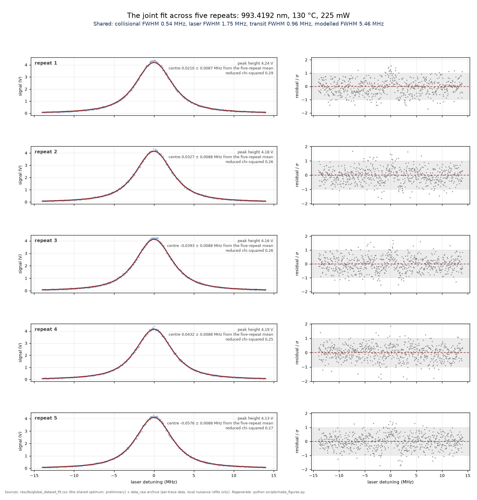
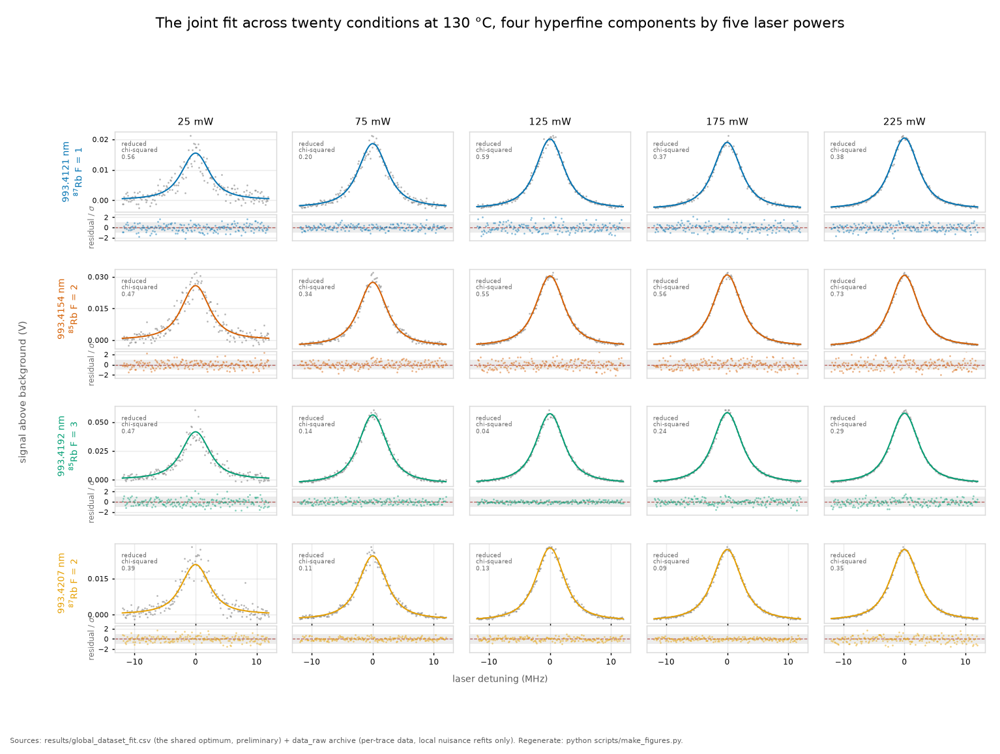

# The cross-campaign full-archive joint fit: specification of record

**Status: pre-registered 2026-08-03, before the code was written and before any
number came out of it.** Nothing below is chosen after seeing a fit. The
thresholds, the grid, the trace census and the stop conditions are fixed here so
that the run can only confirm or fail them.

**The question.** What will the cross-campaign joint fit do, decided before it
was written?
**Takes.** [methods/06_the_statistics.md](../methods/06_the_statistics.md), for
the fitting machinery this specialises.
**Gives.** The trace census, the parameter hierarchy, the priors, the grid, the
QC gates and the stop conditions, each fixed in advance so the run can only
confirm or fail them.
**Skip if.** You want the result rather than the contract it was run under.

> **Unfamiliar with the vocabulary?** [GLOSSARY.md](../GLOSSARY.md)
> explains the measurement in six sentences, then defines every term
> and symbol used anywhere in this repository.

Producer: `scripts/run_full_archive_fit.py`. Output: `results/full_archive_fit.csv`.

## 1. What this module is, and what it is not

It is [M23](../../scripts/run_stark_joint.py)'s construction over
[M25](../../scripts/run_global_dataset_fit.py)'s trace set. M23 profiles the
AC-Stark coefficient kappa with the collisional width held under a Gaussian
prior, and reads only the power-sweep traces of three sessions. M25 reads every
canonical trace and frees `beta_self` alongside kappa, which buys a joint
confidence region and pays for it with a second free coefficient in the same
width budget. M28 takes the third corner: the full archive, the collisional term
under the repo's own four-point measurement as a prior, and one profiled
coefficient.

Three properties are structural from birth rather than retrofitted, because each
of them was retrofitted somewhere else after an incident.

1. The seeding rule of [RESEARCH_DECISIONS §11](../RESEARCH_DECISIONS.md)
   and [methods 06 §4.12](../methods/06_the_statistics.md). The wing variant runs
   first, every family is seeded from a converged solution as well as run cold,
   the profile is the pointwise minimum over chains, and no cold-start profile
   reaches the CSV without a seeded twin. M28 closes the one gap M23 still has,
   which is that M23's own minimum search is quoted from cold chains alone.
2. The QC gates of §5, evaluated mechanically at load time and reported whether
   they fire or not.
3. The rulers stay out (§2), per addendum 22's refusal.

What it is not: it is not a replacement for the M23 bound of record, and it does
not free `beta_self`. Whether it replaces M23, sits beside M25 as a third arm,
or replaces both is left open until after the first full run (§9).

## 2. The trace census

From `data_raw/MANIFEST.csv` (297 rows) plus the two quarantine trees.

| set | role | traces | condition groups | in the fit |
|---|---|---|---|---|
| campaign power ladder, 130 C internal | `p_sweep`, canonical, RF off | 100 | 20 (4 peaks x 5 powers, 5 repeats each) | yes |
| campaign temperature ladder, 225 mW | `t_sweep`, canonical, RF off | 59 | 12 (4 peaks x 70/90/110 C, 5 repeats except 4154 at 70 C which has 4) | yes |
| 2025-07-04 LeCroy rehearsal | quarantine tree | 46 usable of 50 | 10 (4121, 4192, 4207 at 90/180/270 mW, 4154 at 270 mW only) | yes |
| 2025-07-18 morning pilot | quarantine tree | 26 | 4 (peak 4192 at 35/70/105/210 mW) | yes |
| campaign EOM rulers, temperature session | `ruler_t`, canonical, RF on | 61 | 0 | **no** |
| campaign EOM rulers, power session | `ruler_p`, canonical, RF on | 44 | 0 | **no** |
| experimenter-discarded | `p_sweep` 1, `t_sweep` 3 | 4 | 0 | no |
| quarantined | `quarantine` | 29 | 0 | no |

**Total in the fit: 231 traces**, roughly 300,000 points. The number 231 is a
pre-registered gate in its own right (§8, gate B1).

The rehearsal loses 4 files of 50 to 0xff corruption or a missing line, all four
of them in the 4192 at 270 mW group, which therefore enters with a single trace.
That is inherited from M23 unchanged.

**Why the rulers stay out.** Addendum 22 derived the comb's tooth amplitudes and
tested the derivation against the measured ratios. The temperature-session
rulers fit reasonably. The power-session bracket rulers do not fit at all,
consistent with the plan's record that their light path differed from the
science light. A width extracted from a model that demonstrably does not close
on part of its own population is a fabricated number, so ruler traces are not
licensed as lineshape data until an amplitude model exists that closes on both
ruler populations. M25 admits them as seven-tooth combs with free amplitudes and
reports the with-and-without gap as a stated systematic. M28 does not reopen
that. When the amplitude model lands, the ruler arm is added here as a fifth
session with its own block, not as a variant of the existing four.

## 3. The parameter hierarchy

Five levels. The campaign level carries no free parameter today, because the
archive is one campaign. It exists in the code as a key on every trace and as a
grouping in the sigma block, so that a second campaign folds in without
restructuring the model.

| level | parameter | count | shared across |
|---|---|---|---|
| global | `kappa`, the AC-Stark coefficient in S0 = kappa x P | 1 | everything, profiled on the §6 grid |
| campaign x instrument | `Vsat`, detector saturation | 2 | Agilent (campaign and pilot), LeCroy (rehearsal) |
| peak | `beta_self`, the collisional coefficient | 4 | all sessions and all temperatures, under the §4 prior |
| session-block x peak | `sigma_laser_sp` | 21 | the traces of that block and peak |
| session-block | `sigma_laser_s`, the block population mean | 6 | its own sp cells only, through the shrinkage prior |
| session | rehearsal scan rate per peak | 4 | the rehearsal traces of that peak |
| session | `pilot_rate_scale` | 1 | the 26 pilot traces |
| trace | amplitude, centre, baseline offset, baseline slope | 4 x 231 | nothing |

Session blocks are `camp70`, `camp90`, `camp110`, `camp130`, `reh`, `pil`. The
21 realized (block, peak) cells are 4 peaks at each of the four campaign
temperatures, 4 rehearsal peaks, and peak 4192 for the pilot, which never
touches another line.

Shared parameters: 18 fixed slots plus 21 sigma cells, so 39, plus 2 for the
wing families. With the per-trace blocks the primary layout carries 963 free
parameters and the wing layout 965.

The physics enters as

    gamma_coll(peak, T) = beta_self(peak) x N(T) / 1e12
    transit(T)          = transit(110 C) x sqrt(T / 110 C)
    S0(P)               = kappa x P

with `transit(110 C)` computed from the measured waist, which stays OPEN and
which every absolute number here remains conditional on.

**Every centre is free and no centre is interpreted.** M21 established that the
centre channel cannot measure the pull, and the pilot's window starts move with
its power steps in the same direction and size as the expected pull. Shape and
width only, in every session.

## 4. The priors, and where each one comes from

| prior | value | source |
|---|---|---|
| `beta_self` per peak, Gaussian | 0.0155(10), 0.0180(6), 0.0131(7), 0.0179(9) MHz per 1e12 cm^-3 for 4121, 4154, 4192, 4207 | `results/beta_self.csv`, the four-point 70/90/110/130 C construction, dof 2, x52.5 density lever ([RESEARCH_DECISIONS §9 and §10](../RESEARCH_DECISIONS.md)) |
| `sigma_laser_sp` toward its block mean, Gaussian | width 150 kHz | mean absolute pull of the four free-Gaussian-sigma probes at camp130, 147.5 kHz, rounded ([RESEARCH_DECISIONS §10](../RESEARCH_DECISIONS.md)) |
| `pilot_rate_scale`, box | measured 1.0022(12) plus or minus 5 sigma, so [0.9962, 1.0081] | M26, `results/pilot_ruler.csv`, 27 rulers of the pilot's own day |
| rehearsal scan rate per peak, log box | within a factor of 4 of 5.9/470 MHz per ms | M23, anchored by the physical widths the rehearsal shares with the campaign |
| `Vsat` per instrument, log box | exp(-1) to exp(6) V | M23, unchanged |
| `kappa`, one-sided | [0, 60] MHz per W, profiled | the ramp model only broadens red, so negative kappa is flat by construction |

The `beta_self` prior is the one substantive difference from M25, and it cuts
both ways. It imports the four-point measurement's own w0 conditionality into
this fit, and in exchange the temperature ladder is spent on the core width
rather than on a second free coefficient. Gate B4 (§8) reports how hard the data
pull against each prior, so a disagreement is visible rather than absorbed.

## 5. The QC gates, fixed in advance

Physics-blind, as M0 requires. Each gate is evaluated at load and its outcome is
printed and written to the CSV whether it fires or not.

**A1, hard-QC admission.** A canonical RF-off trace whose `hard_flags` cell in
`results/qc_metrics.csv` is non-empty is admitted only if the flag is the
second-structure class and the structure lies outside the fit window. The check
is mechanical: recompute `rb5s6s.qc.trace_metrics` on the windowed data and
require `n_major` at most 1. Any other hard-flag class excludes the trace
outright. Today this gate examines exactly three traces, `4207nm_025mw2`, `3`
and `5`, whose flag reads "second structure in RF-off trace, likely
sweep-retrace crossing, mask at fit time", and all three pass with in-window
`n_major` = 1, which confirms the curator's own remedy mechanically. The gate is
written to fire, not to pass.

**A2, group size.** A condition group with fewer than 3 repeats is dropped
whole, because the M1 noise law is conditioned per group. Today this drops
nothing on the campaign side. The rehearsal's 4192 at 270 mW group is exempt and
enters with its single survivor, exactly as in M23 and M25, because its noise law
comes from the same in-place reduction rather than from the manifest.

**A3, rulers.** All 105 canonical ruler traces are excluded (§2).

**A4, curation.** Experimenter-discarded and quarantined rows never enter.

**A5, sibling outliers are reported and not dropped.** The standing policy is
that only hard-QC failures may exclude a canonical trace. The largest sibling
z-scores are printed so a reader can see them, the largest today being
`t_sweep/4154nm_070c1` at z = 11.7 in height.

## 6. The kappa grid

    0, 0.25, 0.5, 0.75, 1.0, KAPPA_PRED, 1.5, 2.0, 2.62, 3.5, 5.0

Eleven points. `KAPPA_PRED` is computed from the constants at the measured waist
and retro ratio, which currently gives 1.545 MHz per W. The value 2.62 is kept as
a legacy checkpoint so profiles from before the v3.0.0 reprior stay comparable.
The grid is identical to M23's, which is deliberate: the two profiles must be
comparable point by point.

Smoke runs use the three-point grid 0, `KAPPA_PRED`, 5.0, one trace per
condition group, one sample in three from each trace, and short chains. They
exist to exercise every code path in minutes and they quote nothing. A smoke run
fails gate B1 by construction, and reports that as SMOKE rather than as a
failure.

If the 95% crossing does not exist inside the grid, the run says so and the grid
is extended to 10 and 20 before anything is quoted (gate B5).

## 7. The profile families and the seeding order

Five families. The order is load-bearing and is the whole of the local minimum
discipline.

| order | family | wing | rehearsal direction | chains |
|---|---|---|---|---|
| 1 | `W-` | free | -1 | cold forward, cold backward |
| 2 | `P-` | none | -1 | cold forward, cold backward, seeded from `W-` with the wing entries stripped |
| 3 | `W-` twin | free | -1 | seeded from `P-` with the wing entries re-inserted at their seed values |
| 4 | `P+` | none | +1 | cold forward, cold backward, seeded from `P-` |
| 5 | `W+` | free | +1 | cold forward, cold backward, seeded from `W-` |

Every quoted profile is the pointwise minimum over that family's chains, so a
seed can only improve a profile and never inflate one. Step 3 exists because the
rule says no cold-start profile is quoted without a seeded twin, and the
minimum search is a quoted profile too. M23 quotes its wing row from cold chains
alone, which is the one place its own rule is not yet satisfied.

Leave-one-peak-out runs at the primary settings, seeded from the primary
solution, on a six-point grid, except for peak 4192 which gets the full grid
because dropping it removes the entire pilot session.

Two partial chi-squared columns are carried alongside the total at every kappa,
one for the campaign traces and one for the power ladder alone. They answer
whether the bound leans on the rehearsal's soft rate anchor, and whether the
temperature ladder new to this fit is doing the work.

*What "one shared shape" means in practice, at one condition. The line shape is
identical in all five panels and only the centre, the height, the background
and the detector saturation are refitted, because the lock drifts between
repeats and the detector does not sit still either. If the shared shape were
wrong it would be wrong in the same direction in every panel, which is what the
residual strips are there to show.*

*And across the whole power sweep, nothing retuned per panel beyond the same
four per-trace nuisances. Each panel is scaled to its own trace, so the heights
cannot be compared across the grid. The point is that one line shape survives a
ninefold change in drive power, which is the assumption every number in this
note rests on.*

## 8. Acceptance criteria and stop conditions

Fixed here, checked by the code, written to the CSV as `gate_*` rows. A FAIL
means the run's numbers do not go into any document until that failure has been
settled.

| gate | quantity | pass condition | rationale |
|---|---|---|---|
| B1 | trace census | exactly 100 + 59 + 46 + 26 = 231 | a silent loader change is the failure mode this catches |
| B2 | chi2 per point at the profile minimum | between 0.3 and 3.0 | the archive's per-condition fits run 0.84 to 0.98, so anything outside this band means the weights or the model, not the physics |
| B3 | railed shared PHYSICS parameters, meaning `beta_self`, `sigma_laser` and the rehearsal rates (amended, see below) | zero | a railed parameter carries no information and biases everything sharing its budget, which is the lesson the five-tooth ruler truncation taught M25. `beta_self` railed at 0 is a hard stop |
| B4 | prior tension per peak, abs(post minus prior) over prior error | below 3 | above 3 the fit and the four-point measurement disagree about the same quantity, which is reported and not averaged away |
| B5 | 95% crossing inside the grid | present | otherwise the bound is an extrapolation |
| B6 | local minimum gap, best cold chain minus best seeded chain at any kappa | reported always, flagged above 1000 | the M23 incident printed 283,000 here. The pointwise minimum keeps the profile safe either way, so this is a flag rather than a stop |
| B7 | direction indifference, max abs chi2 difference between the two directions | reported, expected order 10 | a value in the thousands means a parked chain, not a physical direction preference |
| B8 | `dchi2` at kappa = 0 | below 9 for bound language | above 9 the profile prefers a positive shift at better than 3 sigma, which is a detection claim and needs a decision before it is written down |

**Amendment 1, 2026-08-03, after the smoke run and before any production
number.** B3 as first written counted every railed shared parameter and made all
of them a stop. The smoke run railed two, and neither is a defect. `Vsat` for
the Agilent sat on the TOP of its box at 403.4 V, which is the same answer M23
reports from the same box at 402.8 V and which means the detector ran linear.
A saturation parameter running to the ceiling is the expected outcome, not a
fault. The pilot rate scale sat on the LOWER edge of M26's measured box, where
M23's own run sat on the upper edge, which is the live open question the M23
docstring already poses about that axis rather than a broken fit. B3 therefore
counts only the physics parameters that carry the widths. The other two classes
are reported in their own CSV rows, `railed_expected` and `railed_flagged`, and
the flagged one is carried as an open question. The amendment is recorded here rather than
made silently because a threshold that moves after seeing a fit is worth exactly
as much as its stated reason.

A sane result, stated in advance: profile minimum at or near kappa = 0 with no
appreciable preference, a 95% upper limit of the same order as M23's 1.192 MHz
per W and plausibly tighter given 59 more traces on the core, all four
leave-one-peak-out rows positive and similar, direction indifference at the tens
of chi-squared, and posterior collisional widths within 3 sigma of their priors.

Stop conditions: B1, B3 or B5 failing. Also any of the following, which are
judgment calls rather than thresholds and are settled case by case: a bound that moves by
more than a factor of two from M23's in either direction, a `beta_self` posterior
that disagrees with the four-point measurement at more than 3 sigma on two or
more peaks, or a local minimum gap that survives seeding.

## 9. Open questions, before the full run

1. **Standing of the result against M23 and M25.** Three overlapping
   constructions on one dataset need a stated hierarchy before any of them is
   quoted, otherwise the reader picks the tightest.
2. **Whether the four-point prior is licensed here at all.** `beta_self.csv` is
   fitted on the campaign traces that this fit also uses, so the prior is not
   independent of the data. M23 has the same circularity at 130 C only. Over the
   full temperature ladder it is larger, and the alternative is M25's free
   `beta_self`.
3. **The pilot's collision width.** M23's run left peak 4192's collisional width
   4.7 prior sigmas above its four-point prior. Gate B4 will meet the same
   tension with more data behind it, and what to do when it fires is a decision,
   not a threshold.
4. **Runtime and cost.** Five families with seeded twins plus leave-one-peak-out
   is more chains than M23's 382 minutes bought.
5. **Documentation on landing.** Done on 2026-08-05: the pipeline line now
   names M27 and M28, and the gloss's upper end moves with every module that
   ships (it stood one lower on the day this step was recorded, and reads M30
   now), so the range quoted in the pre-registered text that follows is
   historical. As written:
   `docs/methods.md`'s pipeline line and the
   `M0-M26` gloss in `docs/methods/08_assumptions_and_outlook.md` both move when
   this module ships. They are deliberately untouched until then, because the
   gloss guard reads the pipeline line and would fail on a module that has not
   run.

---

## Outcome of the first full run, 2026-08-04

The run took 273 minutes over 231 traces and 296,949 points and wrote
`results/full_archive_fit.csv`. Seven of the eight pre-registered gates
passed. What it found, stated against the specification above rather
than against any headline.

**Seeding every family from a converged solution works when it is
structural from birth.** The
worst gap between a cold chain and its seeded twin, across five
families, is 0.78 units of chi square. The same measurement on the
predecessor's uncorrected run was 283,140. Nothing in this run had to
be diagnosed after the fact, which is the whole point of ordering the
families before the first fit rather than after the first surprise.

**The profile minimum sits at zero shift with no preference for any
positive value**, as in the predecessor. The 95% upper limit is
kappa < 0.943 MHz per W, which is S_0(225 mW) < 0.212 MHz. The
campaign rows alone give 0.639, and the power-ladder rows alone, which
are the predecessor's own trace set inside this fit, give 0.696. The
difference between 0.696 and 0.943 is what the temperature ladder adds,
and it loosens rather than tightens, so the temperature rows mildly
prefer a positive shift.

**Three constructions now bound the same quantity** and this note does
not adjudicate between them. The predecessor's three-session fit gives
0.268 MHz, the free-coefficient archive fit gives 0.217, and this run
gives 0.212. (The 0.268 was the committed value when this note was
written. The six-tooth recompute of addendum 26 moved it to 0.258, and
the comparison the paragraph draws is unchanged by the difference.
Noted 2026-08-09.) They differ in trace set, in whether the collisional
coefficient is a prior or free, and in whether the rulers are excluded.
Which is the number of record is a judgement about what the archive
claims, not an outcome of any single fit, and it is left open.

**Gate B4 failed, and the failure is the most interesting result here.**
The gate asks that no peak's posterior collisional coefficient sit more
than three standard deviations from its four-point prior. Peak 4192
sits at 3.77. The other three sit at 2.29, 0.75 and 1.19, and every one
of the four is on the same side: the full archive wants more collisional
width than the model-independent width-slope prior supplies. A single
peak at 3.8 sigma is a fluctuation. Four peaks all high, with a mean
near 2 sigma, is a coherent pull, and the predecessor saw the same sign
on the same peak. Two readings are available and this note does not
choose between them. Either the prior understates the coefficient,
which would matter for the collisional bound, or the fit is absorbing
into the collisional term some broadening that belongs elsewhere, most
plausibly at the hot end where the temperature ladder was added. A
per-temperature decomposition of the tension would separate them, and
that is the next thing this module should be asked.

**The detector saturation nuisances railed at their ceilings for both
instruments**, which the specification anticipated and classified as
expected rather than flagged, because a saturation scale at its upper
bound is what a linear detector looks like.
