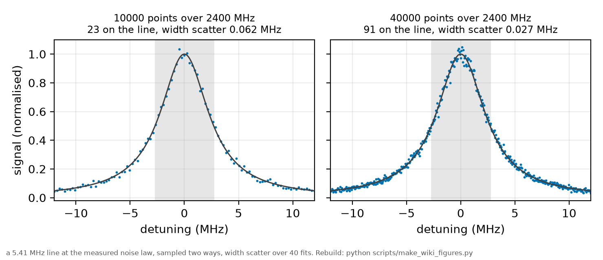

*Chapter 7 of 11 of [the plan](../PLAN.md)*

**The question.** What span, record length and sweep rate does the next session need?
**Takes.** Nothing beyond the block register of chapter 6.
**Gives.** The settings, and the simulations that fix each one.
**Skip if.** You want what was actually logged in 2025, which is chapter 8.

> **Unfamiliar with the vocabulary?** [GLOSSARY.md](../GLOSSARY.md)
> explains the measurement in six sentences, then defines every term
> and symbol used anywhere in this repository.

> **Question.** What span, record length and sweep rate does the next session need?
> **Design.** A span wide enough to curve the pedestal, at a record length set by points across the line.
> **Ambiguity removed.** The baseline absorbed into a free per-trace background.
> **Success.** An injected pedestal is recovered at the stated span and record.
> **Residual uncertainty.** The detection chain's own noise law, which must be re-measured on the day.

## 10a. Acquisition settings, and why 2025's choices bounded what could be learned

Added 2026-08-15, and every number below is derived from the committed
constants rather than recalled. This section exists because a full day of
analysis ended against limits that were set at acquisition time and could not
be undone afterwards. None of them needed new hardware.

### What 2025 actually acquired

| quantity | 2025 value | source |
|---|---|---|
| record length | 2000 points | `constants.TRACE_N_POINTS` |
| sample interval | 0.500 ms | `constants.TRACE_DT_S` |
| window | 1.000 s | the product |
| transition-axis sweep rate | 0.0852 MHz per ms | `linefit_conditions.csv` mean |
| FULL SPAN | 85.2 MHz, plus or minus 42.6 | rate times window |
| resolution | 0.0426 MHz per point | rate times interval |
| line FWHM | 5.41 MHz | `linefit_conditions.csv` at 130 C, 225 mW |
| points across the line | 127 | the ratio |

127 points across the line is generous. THE SPAN IS THE BINDING CONSTRAINT,
not the resolution, and every open question below is a span question.

### The three limits this cost, each measured

**One.** The out-of-window band that carries the ridge-breaking information
was 19 to 36 MHz, seventeen megahertz wide, out of a 43 MHz half-span. The
lower edge is the fit half-width and the upper edge stays clear of the
retrace mirror. That band was enough to show the band PREFERS a lower
collisional width than the core fit assigns, on 11 of 14 fresh conditions
(p = 0.029), and not enough to identify what lives in it.

THE SHAPED-CONTAMINANT INJECTION HAS SINCE RUN, and it settles the reading in
the direction that costs the band its evidential value. Three contaminant
families were injected through the same pipeline at each condition's own
measured band deficit, all three sharing a band-mean so that only their SHAPE
differed and the free per-trace background absorbed the same constant from
each. Both shaped families sit outside two combined standard errors of the flat
control, so THE PREFERENCE IS NOT SHAPE-INDEPENDENT: a contaminant of a shape
the measured deficits allow reproduces the displacement with no change in
collisional width at all. The pooled decision statistic returned PARTIAL rather
than a clean verdict, because it divides by each condition's own displacement
and five of those are comparable to the band's own resolution.

A SECOND MEASUREMENT NARROWS IT FURTHER. Recomputing the band residuals under
the production model form leaves an offset that is positive on 15 of 16
conditions, from +0.04 to +0.29 per cent of peak, with the sixteenth at -0.36.
Retreating the retrace-mirror guard from 36 to 24 MHz fails to bring it below a
third of its value on any of the fourteen conditions where it is significant,
and the background's free SLOPE absorbs none of it. But replacing that
background's line with a QUADRATIC moves the offset from +0.215 to -0.158,
past zero and by more than the offset itself. The window spans 19 MHz of
half-width and the band runs to 36, so a curvature term is amplified by about
3.6 on the way out and the window data do not identify it.

BOTH RESULTS POINT AT THE SAME ACQUISITION FIX, and neither is a reason to
distrust the core fit. The band cannot arbitrate the collisional width while
its own baseline is an extrapolation rather than a measurement, and the span
below is what turns that baseline into data.

**Two.** The co-propagating Doppler pedestal is 942 MHz FWHM at 130 C
(`projections.csv`, `input_pedestal_width`). Across the entire 85 MHz span it
varies by under half a per cent of itself, so within these traces IT IS A
CONSTANT, absorbed by the free per-trace background. It can be neither
measured nor excluded WITHIN THESE TRACES. It is NOT, however, the source of
the unmodelled band excess, and an earlier version of this sentence called it
the standing candidate for it.

The arithmetic that excludes it is geometric rather than delicate. A 942 MHz
Gaussian is very nearly straight across a 36 MHz half-span, and the production
fit already gives every trace a free linear background over its window, so
subtracting a straight line from something almost straight leaves a residual
second order in the ratio of the window to the pedestal width. Carried through,
a pedestal leaves 0.001 per cent of peak in the 19 to 36 MHz band at its
predicted height and 0.010 per cent even at twelve times that, against a
measured band offset of 0.10 to 0.29 per cent. It is short by one to two orders
at every amplitude tested.

That agrees with the shaped-contaminant result above rather than competing with
it: the family that reproduces the displacement is LINEAR IN DETUNING, and a
pedestal is flat-and-quadratic near zero detuning, so it cannot supply a linear
term. THE BAND EXCESS REMAINS UNEXPLAINED, and the next campaign should treat
finding its shape as an open question rather than a confirmation exercise.

WHAT THE PEDESTAL IS GOOD FOR, once a wide span makes it visible, is set out in
section 10c.

**Three.** The retrace mirror. The triangular ramp images the line about its
turning point, so a line sitting OFF CENTRE in the sweep produces a copy at
twice its offset. In 2025 that copy sits near 40 MHz, which is why
`FIT_HALFWIDTH_MAX_MHZ` caps the fit window at 25. Centring the line in the
sweep, or scanning one direction only, returns the whole half-span for free.

### What the next campaign should set, with the arithmetic

Computed by `scripts/run_widescan_design.py` and written up with the
forward-modelled trace and the on-the-day checks in
[the wide-scan block design](../notes/widescan_block_design.md). Run the script
rather than trusting these numbers copied.

**SPAN.** Reach **three Gaussian sigma of the pedestal, so plus or minus 1200
MHz, a 2400 MHz span**, about 28 times the 2025 span. The reason is a
degeneracy and not an appearance: the per-trace background is FREE, so it
absorbs whatever is flat and the pedestal is measured only through its
curvature across the span. The amplitude's retained signal-to-noise is the
Fisher ratio sqrt(1 - <g>^2/<g^2>), which is 0.14 at one sigma of reach and
0.645 at three. A span chosen so the pedestal looks visible is not the span
that makes it measurable. The earlier figure and what replaced it
are recorded in [HISTORY.md](../HISTORY.md).

If the piezo cannot reach three sigma, the schedule in
[the design note](../notes/widescan_block_design.md) is also the fallback: take
the widest reach the hardware allows, since every row still detects the
pedestal in a five-trace block. Only the 2025 span is useless, at a retained
fraction of 0.0013.

**RECORD LENGTH.** **40000 points**, which gives 0.06 MHz per point and 90
points across the line at the 2400 MHz span.

*The whole argument in one picture. A fixed record spread over a wider span
puts fewer samples on the line, and the width is fitted from those. At 10000
points the line carries 23 samples and the fitted width scatters by 0.062 MHz
over repeated draws at the measured noise law. At 40000 it carries 91 and the
scatter is 0.027. The curve is the same in both panels: what changes is how
many noisy samples the fit has to work from.* THE SPAN AND THE RECORD ARE ONE
DECISION AND NOT TWO, because widening the span at a fixed record thins the
sampling of the very line being measured, and the quantity to hold is points
ACROSS THE LINE rather than points per trace. Simulated at this span with the
pedestal fitted correctly, 10000 points is 22 across the line and fails a
frozen recovery criterion, 20000 passes, and 40000 passes with margin. An
earlier version of this bullet specified 10000, which is the failing member
of that set. At the 2025 record of 2000 points the span and shape
requirements are mutually exclusive at any span.
Any modern oscilloscope offers megapoint records, so THIS IS A MENU SETTING
AND NOT A PURCHASE. Set it to the deepest record the export tolerates and the
tradeoff disappears: one trace then carries the Doppler-free line, its near
wings, and the pedestal together.

**Equivalently, if the record length cannot move:** hold the 2025 rate and
lengthen the window. 2400 MHz at 0.0845 MHz per ms is a 28.4 s trace, which
at the 2025 sample interval is about 57,000 points, so the same conclusion
arrives by another route. There is no setting of a 2000-point record that
answers both questions at once, and knowing that in advance is the point of
this section.

**BASELINE IDENTIFICATION, AND THE BASELINE MODEL.** A consequence of the
second measurement in limit one, stated separately so it is not lost if the
span is ever trimmed for an unrelated reason. Two parts, and the second was
established by simulation after the first was written.

THE BASELINE MUST BE FITTED ON DATA THE LINE DOES NOT REACH, never
extrapolated from the fit window. The exclusion is computed rather than
eyeballed: treating the whole 5.41 MHz fitted width as Lorentzian, which
overstates the wing, the line is 1e-3 of peak at 86 MHz and does not fall to
1e-4 until 270 MHz. The offset at issue reaches only a few tenths of a per
cent of peak, so a 100 MHz exclusion would leave line wing inside the region
used to fix the baseline. Exclude 300 MHz, which the 2400 MHz span affords
with 1800 MHz to spare.

AND THE BASELINE MODEL MUST BE THE PEDESTAL, NOT A POLYNOMIAL. A wider span
makes this MORE important rather than less, which is the opposite of what an
earlier version of this paragraph claimed. Simulated at the pedestal's own 942
MHz width and this record length, a straight baseline biases the recovered
collisional width by +0.91 MHz at the 2400 MHz span, against +0.004 MHz at the
2025 span, because a polynomial cannot follow a Gaussian pedestal and the
mismatch lands in the line. A quadratic halves that error and does not remove
it. Fitting the pedestal as a Gaussian of free amplitude and width recovers
the width at every span tested.

THE ON-THE-DAY CHECK, which costs one refit: fit the pedestal as a pedestal
and again as a polynomial, and confirm the recovered width agrees. If it does
not, the polynomial is the wrong model rather than the data being bad.

AN EARLIER VERSION OF THIS PARAGRAPH ADDED A PEDESTAL-AMPLITUDE CAVEAT, that
below about one per cent of line peak the check cannot resolve. It came from a
single realisation and does not survive sampling. Swept ten deep at each
amplitude, the pedestal model recovers the width at a 1200 MHz span for every
amplitude from 0.5 to 10 per cent. What the sweep found instead is in the next
requirement, and it is a sampling limit rather than an amplitude one.

**PIEZO AMPLITUDE.** Set by the span requirement above. Record the amplitude
and the resulting rate PER BLOCK, because the rate is what converts the time
axis to frequency and the archive had to reconstruct it from EOM combs after
the fact.

**PIEZO SCAN SPEED AND SHAPE.** Two independent asks. Prefer a SAWTOOTH or a
one-direction export over a symmetric triangle, which removes the retrace
mirror entirely and returns the excluded band. If the triangle must stay,
CENTRE THE LINE IN THE SWEEP so its mirror lands on top of it rather than at
a resolvable offset, and record which it is. Keep the per-point dwell no
shorter than 2025's 0.5 ms unless the detection bandwidth is checked against
it, since the cusp is a time-domain feature and a fast scan can smear it.

**OSCILLOSCOPE.** The archive is Agilent/Keysight InfiniiVision exports, two
header lines then time and volts, with the empty-voltage quirk
`ingest.load_trace` documents. The 2025-07-04 rehearsal used a Teledyne
LeCroy WaveSurfer 3104z, which is not the archive's instrument. Whichever is
used, the requirements are: a record length in the thousands of points at
minimum, a per-trace timestamp in the export (the archive had to recover the
clock separately, and `docs/RESULTS.md` records that block timing turned out
to be 54 to 76 minutes apart rather than minutes), a spare channel for the
ramp monitor (section 3 item 0), and a horizontal setting that is NOT
touched inside a block, since the 2025 window moved 58 times across the
campaign and line offsets are only meaningful within one scope-knob epoch.

### The two cheap measurements that would collapse a whole degeneracy

Both are session-level, neither is a scan setting, and either one alone
retires a question that cost a full day of analysis on 2026-08-15.

**Laser linewidth, once, by beat note or self-heterodyne.** The fitted
`sigma_laser` is 1.50 to 1.73 MHz on the transition axis. This bench's own
records put the laser at 0.19 to 0.47 MHz there. Of the eight wavemeter
records, only ONE falls inside the 17 to 18 July campaign (`APPARATUS.md`
section 6), and it is the panel reading 100 kHz short-term StdDev, which alone
puts the fit at three to four times the bench. The two scan-stopped records
giving RMS 0.04 to 0.05 MHz are from weeks earlier, and reaching a larger
multiple assumes they describe campaign-time behaviour. The core fit INSISTS on the wide Gaussian, by 378 to 448 score
units. So a Gaussian-like component of about 1.5 MHz is in the data and is
not the laser, and the model has one Gaussian slot to put it in. One direct
linewidth measurement turns that from an inference into a fact.

**Retro alignment, checked and recorded.** Residual Doppler from a tilted retro
supplies the missing Gaussian. Two beams at angle theta to antiparallel carry
`|k1 + k2| = 2k sin(theta/2)`, so the residual width is `theta * v/lambda` =
0.471 MHz per mrad, HALF the co-propagating pedestal's coefficient because the
pedestal already carries `k_eff = 2k`. Closing the budget in quadrature needs
**3.2 to 3.5 mrad**, about 0.19 degrees.

That is large enough to notice on the bench and small enough that the signal
survives it: at 64 micron waist the Rayleigh range is 13.0 mm, a 3.2 mrad tilt
walks the return beam 41 microns over one Rayleigh range, which is 0.64 of a
waist, and the beams stay overlapped over 4.1 cm. So the existence of a
Doppler-free peak does NOT refute this candidate. Measure the tilt, or
deliberately scan it, and the hypothesis is settled either way.

**And while the ruler is out:** measure u and v for the collection lens.
`config.py` derives the axial field of view as Z_c = L_par / 2M and its M is
an estimate, so Z_c is bracketed at 2.0 to 2.4 mm. The experimenter's own
description of the f = 18 mm lens at about 50 mm from the PMT implies
M = 1.78 and Z_c = 3.4 mm, outside that bracket. Two ruler readings replace
an estimate that every ramp-geometry moment depends on.

---

*[Session sizing and spending rules](06_sizing-and-spending-rules.md) · [The acquisition record](08_the-acquisition-record.md)*
