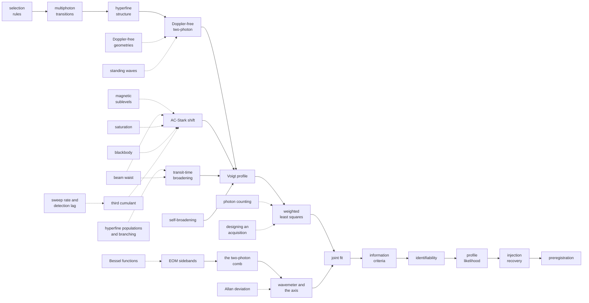

# The wiki: one page per concept, method, effect or technique

This folder is the repository's general-knowledge layer. It abstracts the
reusable scientific concepts from the experiment without replacing the
experiment record, and it is the shared conceptual interface between the
methods chapters, a thesis and any future reusable package. Each page says
what a thing is, what problem it solves, where this repository uses it, what
can go wrong with it, and where to read more.

## A. Atomic structure and selection rules

*What does the atom allow, and why is this transition drivable at all?* The
layer underneath everything else: which transitions exist, what a photon can
change, and the geometry that makes a Doppler-free measurement possible.

| page | type | in one line |
|---|---|---|
| [Selection rules](selection-rules.md) | concept | parity and angular momentum decide what a photon can do, and everything else is a correction |
| [Multiphoton transitions](multiphoton-transitions.md) | concept | parity alternates with photon number, which is why this transition needs two |
| [Hyperfine structure](hyperfine-structure.md) | concept | why one transition is four lines, and why a same-isotope pair is a frequency ruler |
| [Magnetic sublevels](magnetic-sublevels.md) | concept | the structure a hot cell averages away and a trap can hold |
| [Hyperfine populations and branching](hyperfine-populations-and-branching.md) | concept | counting sets the line amplitudes, and decay can remove an atom from the experiment |
| [Doppler-free geometries](doppler-free-geometries.md) | concept | the wavevectors have to close, which two photons manage and three essentially cannot |

## B. Experimental spectroscopy

*What is measured?* Read in order and the sequence is the measurement itself:
how the line is driven, what shape it takes, and what moves or widens it.

| page | type | in one line |
|---|---|---|
| [Doppler-free two-photon spectroscopy](doppler-free-two-photon.md) | technique | why two counter-propagating photons cancel thermal motion, and what that costs in laser-noise sensitivity |
| [Standing waves](standing-waves.md) | physical effect | what a retro-reflected beam really makes, and how the fringes divide the signal from its pedestal |
| [The Voigt profile](voigt-profile.md) | concept | the Lorentzian-Gaussian convolution every real line becomes, and the width degeneracy it carries |
| [Transit-time broadening](transit-time-broadening.md) | physical effect | a finite crossing time broadens the line, and the thermal average makes a cusp, not a Gaussian |
| [The beam waist](the-beam-waist.md) | concept | the one number that turns a power into an intensity, and why every other quantity inherits it |
| [The AC-Stark shift](ac-stark-shift.md) | physical effect | the drive light moves the very levels it probes, and a focused beam turns one shift into a distribution |
| [Saturation](saturation.md) | physical effect | where the square law stops, and why a tighter focus leaves the safe regime faster than it gains signal |
| [Collisional self-broadening](self-broadening.md) | physical effect | collisions keep the line Lorentzian and grow its width linearly with density |

## C. Driving, modulating and detecting

*How is the measurement actually driven and read?* The instrument layer: what
is stamped onto the light, how the axis is established, how fast the line may
be swept, and how the photons are counted.

| page | type | in one line |
|---|---|---|
| [EOM sidebands](eom-sidebands.md) | technique | phase modulation stamps a radio-accurate frequency comb onto the light |
| [The two-photon comb](the-two-photon-comb.md) | technique | the same comb seen by a two-photon transition, where the carrier nulls somewhere else |
| [The wavemeter and the frequency axis](the-wavemeter-and-the-frequency-axis.md) | technique | where a frequency axis comes from, and how a nonlinear scan is calibrated rather than trusted |
| [Sweep rate and detection lag](sweep-rate-and-detection-lag.md) | physical effect | sweeping fast widens the line and forges the asymmetry the experiment reads |
| [Photon counting](photon-counting.md) | technique | when counting beats an analog chain, and the level where they cross |
| [Designing an acquisition](designing-an-acquisition.md) | method | span, resolution and record length are one decision, not three |
| [Bessel functions](bessel-functions.md) | concept, supporting | the amplitudes every phase-modulation problem is written in |
| [Blackbody radiation](blackbody-radiation.md) | physical effect | the cell's own thermal glow, and how to tell when it matters |

## D. Statistical inference

*How is it modelled, what is identifiable, and how do we know the inference is
valid?* The chain this repository actually runs, in order: weight the data by
what the noise actually does, fit jointly, choose the model honestly, ask what
the data determine, carry the uncertainty faithfully, prove the machinery on
known truth, and freeze the criterion before reading the answer.

| page | type | in one line |
|---|---|---|
| [Weighted least squares](weighted-least-squares.md) | method | weights from a measured noise law, not from the residuals |
| [The joint fit](joint-fit.md) | method | share what physics shares, free what drifts |
| [Information criteria](information-criteria.md) | method | when is a better fit worth its extra parameters |
| [Identifiability](identifiability.md) | method | when does the data actually determine the parameter we want |
| [The profile likelihood](profile-likelihood.md) | method | an interval that keeps its shape when nuisance parameters are degenerate |
| [Injection-recovery testing](injection-recovery.md) | method | no fitter touches real data before it recovers known truth from synthetic data |
| [Preregistration](preregistration.md) | method | the criterion, the null test and the ceiling test, frozen before any number is read |

## E. Robustness and influence

*Which observations is the answer resting on, and would it survive their
loss?* Wave 3, and the cluster the repository's own influence audit motivated.

| page | type | in one line |
|---|---|---|
| [Influence diagnostics](influence-diagnostics.md) | method | leverage, case deletion, and why outlying and influential are different words |
| [Robust fitting](robust-fitting.md) | method | losses that stop rewarding a far point, run beside the standard fit rather than in place of it |
| [Resampling](resampling.md) | method | the bootstrap and the jackknife, and when the structure of the data breaks them |
| [Heavy-tailed models](heavy-tailed-models.md) | concept | treating an outlier as evidence about the noise rather than as a point to remove |
| [Sensitivity analysis](sensitivity-analysis.md) | method | which input a projection actually depends on, locally and globally |

## F. Simulation and computation

*How is a number that came from a simulation earned?* Every campaign figure in
this record is a simulation result, and these are the ways such a result goes
wrong.

| page | type | in one line |
|---|---|---|
| [Monte Carlo methods](monte-carlo-methods.md) | method | sampling to answer what an estimator would do, and why precision costs the square of the samples |
| [Grids and discretisation](grids-and-discretisation.md) | method | a grid step means nothing except against the feature it must represent |
| [Optimiser convergence](optimiser-convergence.md) | method | a fit that converged is not a fit that is right |
| [Compute budgets and failure modes](compute-budgets-and-failure-modes.md) | method | the memory arithmetic done before launch, and why a killed run yields no result |

## G. Mathematical descriptors

| page | type | in one line |
|---|---|---|
| [The third cumulant](third-cumulant.md) | concept | the number that isolates a lineshape's asymmetry from its width |
| [Allan deviation](allan-deviation.md) | concept, supporting | the statistic that separates noise types by how they average down |

Bessel functions and the Allan deviation are supporting topics, here because
the design of the next measurement session leans on them rather than because
the committed analysis does.

## How the pages connect

The clusters below are a chain, not a filing system. It runs from the light
the atoms sit in to the question of whether the answer was earned, and each
page is one link.

*Solid arrows carry the measurement: what the atoms are, what drives them,
what shapes the line, how it is weighted and fitted, and what decides whether
the fit determined anything. Dotted arrows are the supporting tools each step
needs. A reader who follows the solid path once has the whole argument of this
repository in order.*

## What governs what

For experimental outcomes the order of authority is:
the committed data and `results/*.csv`, then [RESULTS.md](../RESULTS.md),
then the [methods chapters](../methods.md), then these pages, then the
front-door orientation. A wiki page can never override an authoritative
result. Dated preregistrations are prospective commitments and
[HISTORY.md](../HISTORY.md) is the historical record, and neither is edited
for navigation. For general theory the authority is the cited literature and
established mathematics: these pages explain, they are not sources, and a
claim is only as good as the reference it carries. The general section of a
page may stay valid across model revisions, and only its
repository-specific section is coupled to the current implementation.

## Waves so far

Wave 1 built the first fifteen pages, on the lineshape and the inference. Wave
2 added hyperfine structure, the frequency axis, weighted least squares,
saturation, preregistration, the beam waist and standing waves. Wave 3 added
the robustness cluster, written after the repository ran the influence audit
those pages describe rather than before, so their repository sections report
work done. Wave 4 added the instrument layer, on what is stamped onto the
light and how it is read. Wave 5 added the first cluster, on the atomic
structure that licenses the measurement at all, including the geometric reason
a two-photon transition can be made Doppler-free with one colour while a
three-photon one needs either crossing beams or a second colour. Wave 6 added
the simulation layer, since every campaign number here is a simulation result
and its failure modes were recorded only as incidents.

The next candidates, unordered and none committed: the density scale and the
vapour-pressure curve it comes from, and the transit-time kernel's thermal
average as a page of its own rather than a section of the transit page.

## Conventions

Every page follows one template: What it is (general, a few hundred words, at
most two figures and only where a figure genuinely helps), What problem it
solves, Where this repository uses it (links into chapters, modules and
results, numbers read from the committed CSVs), What can go wrong (the
failure modes, distinguishing model failure, data insufficiency,
implementation failure and experimental limitation), Try it where the package
can demonstrate the idea in a few lines, and Further reading.

**The snippets run.** Every `python` block on these pages is executed by
`tests/test_wiki_snippets_run.py` in a clean subprocess with only the
repository on the path, and it must print something. A block that stops
working fails the suite rather than misleading a reader, and two of the first
six were written with a wrong signature and a wrong dictionary key, which is
why the guard exists. They use only the public API, so they are also a
working introduction to it. Pages
carry no external images. General claims carry references, and
repository-specific claims link to their source of truth.

**Status of the references.** A citation to `../lit/` points at a note in this
repository, which carries its own VERIFIED or REPORTED status. A citation to
anything else is a standard reference given for the reader's benefit and is
NOT held here or checked against its source, so it has the standing of
REPORTED in the same vocabulary. Textbook results on these pages are
verifiable by computation rather than by citation, and the numeric ones were
checked that way: the Bessel zeros, the two carrier nulls, the Voigt width
approximation against a numerical profile, the criterion crossing, the width
conversion factor and both blackbody peaks.
