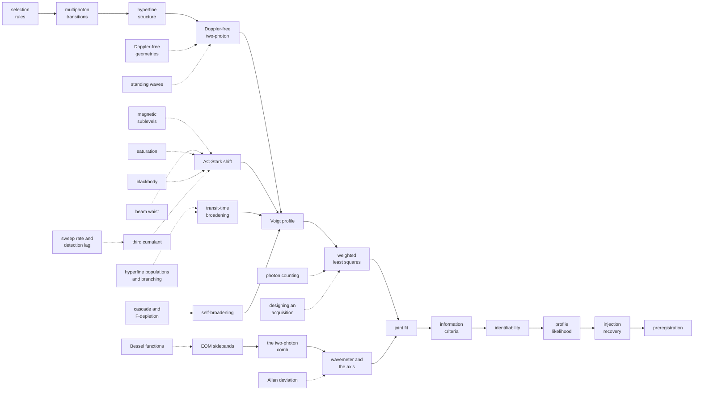

# The wiki: one page per concept, method, effect or technique

**The question.** What does a reader need to understand, concept by concept,
to follow this experiment, and where does each concept live?
**Takes.** Nothing. Every page stands alone and states its own prerequisites.
**Gives.** Fifty-five pages in eight clusters, the routes through them by what
the reader came for, and the connection map between them.
**Skip if.** You want the experiment's own record instead of the concepts,
which is [BIG_PICTURE.md](../BIG_PICTURE.md), or one quantity's complete
position, which is [the quantities layer](../quantities/README.md).

> **Unfamiliar with the vocabulary?** [GLOSSARY.md](../GLOSSARY.md)
> defines every term and symbol used anywhere in this repository.

This folder is the repository's general-knowledge layer, abstracting the
reusable scientific concepts from the experiment without replacing the
experiment record. It is the shared conceptual interface between the methods
chapters, a thesis and any future reusable package. Each page states what a
thing is, what problem it solves, where this repository uses it, what can go
wrong, and where to read more.

## Where to start, by what you came for

The clusters further down group the pages by subject. This table gives
reading orders instead, one per purpose, each in the order its pages build
on one another.

| if you came for | start here, in order |
|---|---|
| **the physics of the transition** | [selection rules](selection-rules.md), [multiphoton transitions](multiphoton-transitions.md), [hyperfine structure](hyperfine-structure.md), [Doppler-free geometries](doppler-free-geometries.md), [magnetic sublevels](magnetic-sublevels.md), [the cascade and F-depletion](the-cascade-and-f-depletion.md) |
| **guided-mode or nanofibre spectroscopy**, where the same atom is driven in an evanescent field | [Doppler-free two-photon](doppler-free-two-photon.md), [standing waves](standing-waves.md), [transit-time broadening](transit-time-broadening.md), [the beam waist](the-beam-waist.md), [saturation](saturation.md) |
| **frequency metrology**, how the axis is built and what it is worth | [the wavemeter and the frequency axis](the-wavemeter-and-the-frequency-axis.md), [hyperfine structure](hyperfine-structure.md), [EOM sidebands](eom-sidebands.md), [the two-photon comb](the-two-photon-comb.md), [Allan deviation](allan-deviation.md) |
| **one particular quantity**, where it stands and what would improve it | the wiki explains the concepts, and [docs/quantities/](../quantities/README.md) assembles them per quantity with the literature benchmark and the next campaign's recipe |
| **reproducing the headline analysis**, page by page in the order the fit consumes them | [the Voigt profile](voigt-profile.md), [transit-time broadening](transit-time-broadening.md), [the inhomogeneous light shift](the-inhomogeneous-light-shift.md), [self-broadening](self-broadening.md), [weighted least squares](weighted-least-squares.md), [the profile likelihood](profile-likelihood.md), then leave the wiki for [the case page](../plan/00_the-case.md) and [RESULTS.md](../RESULTS.md), where every number these concepts produce is ledgered |
| **background for a thesis chapter**, the platform-neutral concept pages written to be citable on their own | any single page stands alone by construction, states its prerequisites in its header, and closes with its literature, so the shortest route is the page for the concept the chapter needs, and the clusters below group them by subject |
| **the decision record behind the analysis** | [preregistration](preregistration.md) for the commitments made before looking, [identifiability](identifiability.md) and [the profile likelihood](profile-likelihood.md) for what the data actually determine, [influence diagnostics](influence-diagnostics.md) for which points the answer rests on, then leave the wiki for [RESEARCH_DECISIONS.md](../RESEARCH_DECISIONS.md), where every rejected alternative is argued, and [CLAIMS.md](../CLAIMS.md), which states what is deliberately not claimed |
| **taking the analysis over, or reproducing it** | [weighted least squares](weighted-least-squares.md), [the joint fit](joint-fit.md), [identifiability](identifiability.md) and [injection recovery](injection-recovery.md) for the methodology the pipeline runs, then [START_HERE.md](../../START_HERE.md) for the code layout, [tests/README.md](../../tests/README.md) for what the guards check and why, and [REPRODUCING.md](../REPRODUCING.md) for what runs from a clone |
| **reusing the code on your own line** | [the Voigt profile](voigt-profile.md), [weighted least squares](weighted-least-squares.md), [identifiability](identifiability.md), [injection recovery](injection-recovery.md), then [the tutorial](../TUTORIAL.md) to build a twin of your own apparatus, and [docs/ADAPTING.md](../ADAPTING.md) for the seams |
| **what the data determine, and how far** | [identifiability](identifiability.md), [profile likelihood](profile-likelihood.md), [preregistration](preregistration.md), [influence diagnostics](influence-diagnostics.md), [sensitivity analysis](sensitivity-analysis.md), [reversal tests](reversal-tests.md) |
| **working out what limits a measurement, and what would help** | [laser frequency noise and the linewidth](laser-frequency-noise-and-the-linewidth.md), [the noise law](the-noise-law.md), [shot noise and technical noise](shot-noise-and-technical-noise.md), [correlated samples and effective sample size](correlated-samples-and-effective-sample-size.md), then [digitisation and dynamic range](digitisation-and-dynamic-range.md) and [photon counting](photon-counting.md) for the two instrument choices |
| **designing the next measurement** | [the digital twin](the-digital-twin.md), [reversal tests](reversal-tests.md), [designing an acquisition](designing-an-acquisition.md), [grids and discretisation](grids-and-discretisation.md), [sweep rate and detection lag](sweep-rate-and-detection-lag.md), [photon counting](photon-counting.md), [digitisation and dynamic range](digitisation-and-dynamic-range.md), [confounding by acquisition order](confounding-by-acquisition-order.md) |

**The platform lane.** The guided-mode row above is the only one that assumes a
nanofibre. Every other row, and every page they list, is platform-neutral: the
kernels, the identifiability machinery, the metrology and the decision record
describe a two-photon line, independent of the apparatus around it. A reader
with a vapour cell and no fibre, or one adapting the pipeline to a different
transition, skips that one row and loses nothing. The fibre
thread in full is [chapter 6](../big_picture/06_next-nanofibre.md), the second
scenario of [chapter 9](../big_picture/09_the-campaign-cases.md), and
[the sized candidate](../notes/onf_candidate.md).

**Every page opens with the same four lines**: the question it answers, what
it assumes, what it gives, and when to skip it. Every page ends with a
"See also".

Nine of these pages record a value that has moved since it was first
published. Eight carry a short "Values that moved" section naming what
changed and why, and linking to [HISTORY.md](../HISTORY.md), which is the
single home of every retired number. The ninth is the digital twin, which
carries its correction in full, because being wrong twice is part of what
the twin is for. No page here prints a retired figure.

## A. Atomic structure and selection rules

The layer underneath everything else: which transitions exist, what a photon
can change, and the geometry that makes a Doppler-free measurement possible.

*The 5S–6S two-photon cascade through the 5P intermediate levels, with the
993 nm drive and the 795/780 nm decay legs the cluster below discusses.*

| page | type | in one line |
|---|---|---|
| [Selection rules](selection-rules.md) | concept | parity and angular momentum decide what a photon can do, though one rank here is suppressed by a different mechanism: both photons come from a single laser |
| [Multiphoton transitions](multiphoton-transitions.md) | concept | parity alternates with photon number, which is why this transition needs two |
| [Hyperfine structure](hyperfine-structure.md) | concept | why one transition is four lines, and why a same-isotope pair is a frequency ruler |
| [Magnetic sublevels](magnetic-sublevels.md) | concept | the structure a hot cell averages away, why this line stays magnetically quiet against any polarisation or mismatch, and what a second atom changes about that |
| [Hyperfine populations and branching](hyperfine-populations-and-branching.md) | concept | counting sets the line amplitudes, and decay can remove an atom from the experiment |
| [The cascade and F-depletion](the-cascade-and-f-depletion.md) | concept | why an observed amplitude is not a transition strength, how the cascade empties the level being probed, and why the decay leg collected carries its own density-growing detection systematic |
| [Doppler-free geometries](doppler-free-geometries.md) | concept | the wavevectors have to close, which two photons manage, three equal-colour photons cannot collinearly, and a fundamental with its own second harmonic can |

## B. Experimental spectroscopy

Read in order: how the line is driven, what shape it takes, and what moves
or widens it.

| page | type | in one line |
|---|---|---|
| [Doppler-free two-photon spectroscopy](doppler-free-two-photon.md) | technique | why two counter-propagating photons cancel thermal motion, and what that costs in laser-noise sensitivity |
| [Standing waves](standing-waves.md) | physical effect | what a retro-reflected beam actually makes, and how the fringes divide the signal from its pedestal |
| [The Voigt profile](voigt-profile.md) | concept | the Lorentzian-Gaussian convolution every real line becomes, and the width degeneracy it carries |
| [Transit-time broadening](transit-time-broadening.md) | physical effect | a finite crossing time broadens the line, and the thermal average makes a cusp, not a Gaussian |
| [The beam waist](the-beam-waist.md) | concept | the one number that turns a power into an intensity, and why every other quantity depends on it |
| [The AC-Stark shift](ac-stark-shift.md) | physical effect | the drive light moves the levels it probes, and a focused beam turns one shift into a distribution |
| [The inhomogeneous light shift](the-inhomogeneous-light-shift.md) | concept | the distribution of shifts a structured beam imposes, the object a lineshape reads and a guided design is graded by |
| [Saturation](saturation.md) | physical effect | where the square law stops, and why a tighter focus leaves the safe regime faster than it gains signal |
| [Collisional self-broadening](self-broadening.md) | physical effect | collisions keep the line Lorentzian and grow its width linearly with density |
| [Vapour density and temperature](vapour-density-and-temperature.md) | concept | how a cell temperature becomes a density, why a set point is not a temperature, and the pedestal that measures it in situ |
| [Guided atoms and nanofibres](guided-atoms-and-nanofibres.md) | concept | what changes when the atoms and the light share a waveguide: the hollow core puts them inside the mode and the nanofibre puts them outside the glass, and each turns transit broadening from a fixed cost into a design knob and introduces a new systematic in its place |

## C. Driving, modulating and detecting

The instrument layer: what is stamped onto the light, how the axis is
established, and how fast the line may be swept. What limits the reading
once the photons arrive is cluster H.

*The source, modulation and detection chain the clusters below describe:
laser, EOM, cell, and the PMT signal path to the scope.*

| page | type | in one line |
|---|---|---|
| [EOM sidebands](eom-sidebands.md) | technique | phase modulation stamps a radio-accurate frequency comb onto the light |
| [The two-photon comb](the-two-photon-comb.md) | technique | the same comb seen by a two-photon transition, where the carrier nulls somewhere else |
| [The wavemeter and the frequency axis](the-wavemeter-and-the-frequency-axis.md) | technique | where a frequency axis comes from, and how a nonlinear scan is calibrated instead of trusted |
| [Laser frequency noise and the linewidth](laser-frequency-noise-and-the-linewidth.md) | concept | the same laser has a different width in every band, and the kernel a fit assigns to it is a physics claim with a bias attached |
| [Sweep rate and detection lag](sweep-rate-and-detection-lag.md) | physical effect | sweeping fast widens the line and creates the asymmetry the experiment reads |
| [Designing an acquisition](designing-an-acquisition.md) | method | span, resolution and record length form one decision |
| [Bessel functions](bessel-functions.md) | concept, supporting | the amplitudes every phase-modulation problem is written in |
| [Blackbody radiation](blackbody-radiation.md) | physical effect | the cell's own thermal glow, and how to tell when it matters |

## D. Statistical inference

The chain this repository actually runs, in order: weight the data by what
the noise actually does, fit jointly, choose the model, ask what the data
determine, carry the uncertainty faithfully, prove the machinery on known
truth, and freeze the criterion before reading the answer.

| page | type | in one line |
|---|---|---|
| [Weighted least squares](weighted-least-squares.md) | method | weights from a measured noise law, not from the residuals |
| [The joint fit](joint-fit.md) | method | share what physics shares, free what drifts |
| [Pooling across groups](pooling-across-groups.md) | method | when combining groups adds information, and when it only adds freedom |
| [Information criteria](information-criteria.md) | method | when is a better fit worth its extra parameters |
| [Identifiability](identifiability.md) | method | when does the data actually determine the parameter we want |
| [Reduced chi-squared](reduced-chi-squared.md) | method | what a misfit does and does not tell you, and what it costs a confidence interval |
| [The profile likelihood](profile-likelihood.md) | method | an interval that keeps its shape when nuisance parameters are degenerate |
| [Injection-recovery testing](injection-recovery.md) | method | no fitter touches real data before it recovers known truth from synthetic data |
| [Preregistration](preregistration.md) | method | the criterion, the null test and the ceiling test, frozen before any number is read |

## E. Robustness and influence

Wave 3, and the cluster the repository's own influence audit motivated.

| page | type | in one line |
|---|---|---|
| [Influence diagnostics](influence-diagnostics.md) | method | leverage, case deletion, and why outlying and influential are different words |
| [Robust fitting](robust-fitting.md) | method | losses that stop rewarding a far point, run beside the standard fit instead of replacing it |
| [Resampling](resampling.md) | method | the bootstrap and the jackknife, and when the structure of the data breaks them |
| [Heavy-tailed models](heavy-tailed-models.md) | concept | treating an outlier as evidence about the noise instead of a point to remove |
| [Sensitivity analysis](sensitivity-analysis.md) | method | which input a projection actually depends on, locally and globally |
| [Confounding by acquisition order](confounding-by-acquisition-order.md) | method | when a swept parameter is entangled with elapsed time, and how to find a control for it |
| [Reversal tests](reversal-tests.md) | method | separating systematics by parity under a flipped knob, and the case where the atom supplies the flip on its own |

## F. Simulation and computation

Every campaign figure in this record is a simulation result, and these are
the ways such a result goes wrong.

| page | type | in one line |
|---|---|---|
| [Monte Carlo methods](monte-carlo-methods.md) | method | sampling to answer what an estimator would do, and why precision costs the square of the samples |
| [The digital twin of an experiment](the-digital-twin.md) | method | run the apparatus in software before building it, and find out which pairs stay degenerate however the design changes |
| [Grids and discretisation](grids-and-discretisation.md) | method | a grid step means nothing except against the feature it must represent |
| [Optimiser convergence](optimiser-convergence.md) | method | a converged fit can still be wrong |
| [Compute budgets and failure modes](compute-budgets-and-failure-modes.md) | method | the memory arithmetic done before launch, and why a killed run yields no result |

## G. Mathematical descriptors

| page | type | in one line |
|---|---|---|
| [The third cumulant](third-cumulant.md) | concept | the number that isolates a lineshape's asymmetry from its width |
| [Allan deviation](allan-deviation.md) | concept, supporting | the statistic that separates noise types by how they average down |

Bessel functions and the Allan deviation are supporting topics: the design of
the next measurement session leans on them, though the committed analysis
does not.

## H. Noise and its management

The layer between the detector and the fit: how large each sample's
uncertainty is, how many of the samples are independent, which part of the
noise is irreducible, and the two instrument choices that decide the rest.

| page | type | in one line |
|---|---|---|
| [The noise law](the-noise-law.md) | method | the measured variance against signal, which supplies every fit's weights |
| [Shot noise and technical noise](shot-noise-and-technical-noise.md) | concept | the scaling test that says which one you have, and what each implies about what to fix |
| [Correlated samples and effective sample size](correlated-samples-and-effective-sample-size.md) | method | how many independent measurements a dataset really holds, and where an uncorrected count inflates a result |
| [Digitisation and dynamic range](digitisation-and-dynamic-range.md) | technique | how many bits a measurement needs, and why a range changed mid-sweep is several measurements |
| [Resolution enhancement and what it costs](resolution-enhancement-and-what-it-costs.md) | technique | where the extra bits come from, why a smoothed screen can export raw eight-bit data, and the one case where smoothing moves a line centre |
| [Photon counting](photon-counting.md) | technique | when counting beats an analog chain, and the level where they cross |

## How the pages connect

*Solid arrows are the measurement path, dotted arrows the supporting tools
each step needs.*

## What governs what

For experimental outcomes the order of authority is:
the committed data and `results/*.csv`, then [RESULTS.md](../RESULTS.md),
then the [methods chapters](../methods.md), then these pages, then the
front-door orientation. A wiki page can never override an authoritative
result, and the mechanism enforcing that is the guard suite documented in
[tests/README.md](../../tests/README.md). Dated preregistrations are prospective commitments and
[HISTORY.md](../HISTORY.md) is the historical record, and neither is edited
for navigation. For general theory the authority is the cited literature and
established mathematics: these pages explain, they are not sources, and a
claim is only as good as the reference it carries. The general section of a
page may stay valid across model revisions, and only its
repository-specific section is coupled to the current implementation.

## Not covered yet

One concept has no page of its own: the transit-time kernel's thermal
average, covered instead as a section of
[transit-time broadening](transit-time-broadening.md).

## Conventions

Every page follows one template: What it is (general, a few hundred words, at
most two figures and only where a figure genuinely helps), What problem it
solves, Where this repository uses it (links into chapters, modules and
results, numbers read from the committed CSVs), What can go wrong (the
failure modes, distinguishing model failure, data insufficiency,
implementation failure and experimental limitation), Try it where the package
can demonstrate the idea in a few lines, and Further reading.

**The snippets run.** Every `python` block on these pages is executed by
`tests/test_wiki_snippets_run.py` in a clean subprocess with only the
repository on the path, and it must print something. A block that stops
working fails the suite. They use only the public API, so they are also a
working introduction to it. General claims carry references, and
repository-specific claims link to their source of truth.

**Status of the references.** A citation to `../lit/` points at a note in this
repository, which carries its own VERIFIED or REPORTED status. A citation to
anything else is a standard reference given for the reader's benefit and is
not held here or checked against its source, so it has the standing of
REPORTED in the same vocabulary. Textbook results on these pages are
verifiable by computation instead of by citation, and the numeric ones were
checked that way: the Bessel zeros, the two carrier nulls, the Voigt width
approximation against a numerical profile, the criterion crossing, the width
conversion factor and both blackbody peaks.
