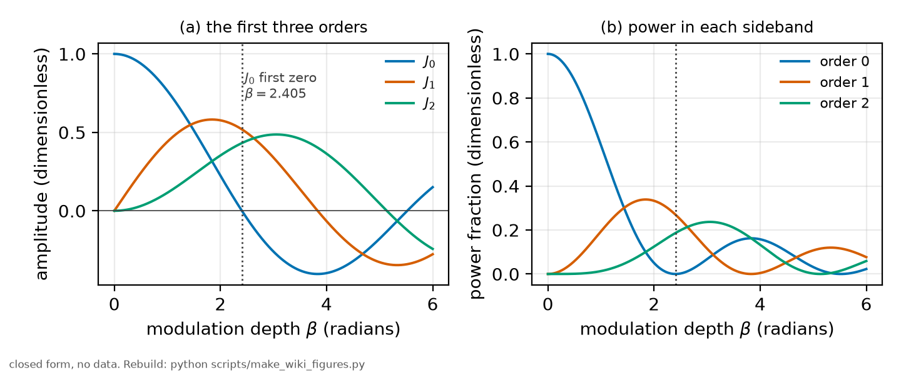

# Bessel functions

*[wiki index](README.md) · concept, supporting topic*

**The question.** How do phase-modulation sideband heights map to Bessel
function values, and why do a one-photon and a two-photon comb null the
carrier at different modulation depths.
**Takes.** Nothing beyond knowing what a phase modulator does. No prior
wiki page is required.
**Gives.** The Jacobi-Anger identity, the $J_n(\beta)$ sideband amplitude
law, and the arithmetic that separates the one-photon carrier null from the
two-photon one.
**Skip if.** The reader wants the full two-photon amplitude law and
derivation on a real bench rather than the identity underneath it. That is
[EOM sidebands](eom-sidebands.md).

> **Unfamiliar with the vocabulary?** [GLOSSARY.md](../GLOSSARY.md)
> defines every term and symbol used anywhere in this repository.

## What it is

Bessel functions of the first kind, written $J_n(x)$, are the solutions of

$$x^2 y'' + x y' + (x^2 - n^2) y = 0$$

that stay finite at the origin. They behave like decaying oscillations: $J_0$
starts at 1, every other order starts at 0, all of them cross zero
repeatedly, and their envelopes fall as $1/\sqrt{x}$.

They reach spectroscopy through one identity. A phase-modulated wave,

$$E(t) = E_0 \cos\big(\omega t + \beta \sin \Omega t\big),$$

can be rewritten as a sum of pure tones at $\omega + n\Omega$ whose
amplitudes are exactly $J_n(\beta)$:

$$e^{i\beta \sin \Omega t} = \sum_{n=-\infty}^{\infty} J_n(\beta) e^{in\Omega t}$$

This is the Jacobi-Anger expansion, and it says that modulating the phase of
a wave at one frequency creates an infinite comb of sidebands spaced by that
frequency, with Bessel amplitudes. The modulation depth $\beta$, in radians,
sets how the power is distributed: at small $\beta$ almost everything stays
in the carrier, and as $\beta$ grows the power moves outward into higher
orders.



*Left, the first three orders against modulation depth. Right, the power
fraction in each sideband, which is the amplitude squared. The dotted line
marks $\beta = 2.405$, the first zero of $J_0$, where a phase modulator puts
no power at all in the carrier.*

A useful pair of facts follows from the identity. The total power is
conserved, $\sum_n J_n^2(\beta) = 1$, so modulation redistributes light
rather than creating or destroying it. And the sidebands are symmetric in
magnitude, $J_{-n} = (-1)^n J_n$, so pure phase modulation gives a symmetric
comb.

## What problem it solves

A frequency axis has to come from somewhere. Phase modulation writes a comb
of copies of any spectral feature onto the light, spaced by a radio frequency
that a laboratory can know to many digits, and the Bessel amplitudes are what
predict how tall each copy will be. That turns "how do I calibrate this
sweep" into "how many teeth can I see, and how big should they be".

## Where this repository uses it

The frequency ruler. An electro-optic modulator puts sidebands on the light,
they pair up in the two-photon transition, and the resulting comb of line
copies converts a time axis into a frequency axis. That is the subject of
[EOM sidebands](eom-sidebands.md), which carries the two-photon amplitude law
and the derivation, and of [methods chapter 3](../methods/05_the_frequency_ruler.md).

The one thing worth carrying here is the arithmetic that connects the two
pages, because it is a genuine trap. In a one-photon spectrum the sideband
amplitude is $J_n(\beta)$ and the carrier vanishes at the first zero of
$J_0$, at $\beta = 2.405$. In the two-photon comb every tooth sums the pairs
of sidebands that reach it, and the addition theorem collapses that sum to
$J_k(2\beta)$. The carrier therefore vanishes at $2\beta = 2.405$, that is at
$\beta = 1.202$. Both numbers are correct and they are not the same number,
because they answer different questions.

## What can go wrong

The failure mode that matters here is implementation, not theory. Reading a
carrier-null depth off a one-photon formula and applying it to a two-photon
comb puts the modulator at twice the intended depth, which is the confusion
the two paragraphs above exist to prevent.

The physical assumption is that the modulation is pure phase modulation. Any
residual amplitude modulation, which a real modulator produces when its
polarisation axis is not aligned to the crystal, breaks the symmetry of the
comb, and the tooth heights then no longer follow the Bessel law at all. That
makes the tooth pattern a diagnostic: an asymmetric comb is telling you about
the modulator rather than about the atom.

Finally, a data-insufficiency limit. The expansion has infinitely many
orders, but only the teeth that rise above the noise can be fitted, so at
small $\beta$ the usable comb is much shorter than the mathematical one.

## Try it

The two carrier nulls, and why they are different numbers.

```python
from scipy.special import jv, jn_zeros

z = jn_zeros(0, 1)[0]
print(f"first zero of J0: {z:.4f}")
print(f"  one-photon carrier null at beta = {z:.4f}")
print(f"  two-photon comb null at beta = {z / 2:.4f}, because the tooth "
      f"amplitude is J_k(2 beta)")
print(f"  check: J0(2 x {z / 2:.4f}) = {jv(0, 2 * (z / 2)):.2e}")
```

Every snippet on these pages is executed by `tests/test_wiki_snippets_run.py`,
so one that stops working fails the suite rather than sitting here misleading
a reader.

## Further reading

- M. Abramowitz and I. Stegun, *Handbook of Mathematical Functions*, chapter
  9, for the definitions, the addition theorems and the zeros.
- [Wikipedia: Jacobi-Anger expansion](https://en.wikipedia.org/wiki/Jacobi%E2%80%93Anger_expansion),
  the identity in one line.
- [EOM sidebands](eom-sidebands.md) for what this becomes on a real bench.

## See also

- [EOM sidebands](eom-sidebands.md), the two-photon amplitude law and
  derivation this page's identity feeds into.
- [The wavemeter and the frequency axis](the-wavemeter-and-the-frequency-axis.md),
  what the resulting sideband comb is used to build, a calibrated frequency
  ruler.
- [Doppler-free two-photon spectroscopy](doppler-free-two-photon.md), the
  transition where sideband pairs combine into the two-photon comb this
  page's addition theorem describes.

---

[← Designing an acquisition](designing-an-acquisition.md) · *Driving, modulating and detecting, 7 of 8* · [Blackbody radiation →](blackbody-radiation.md)
