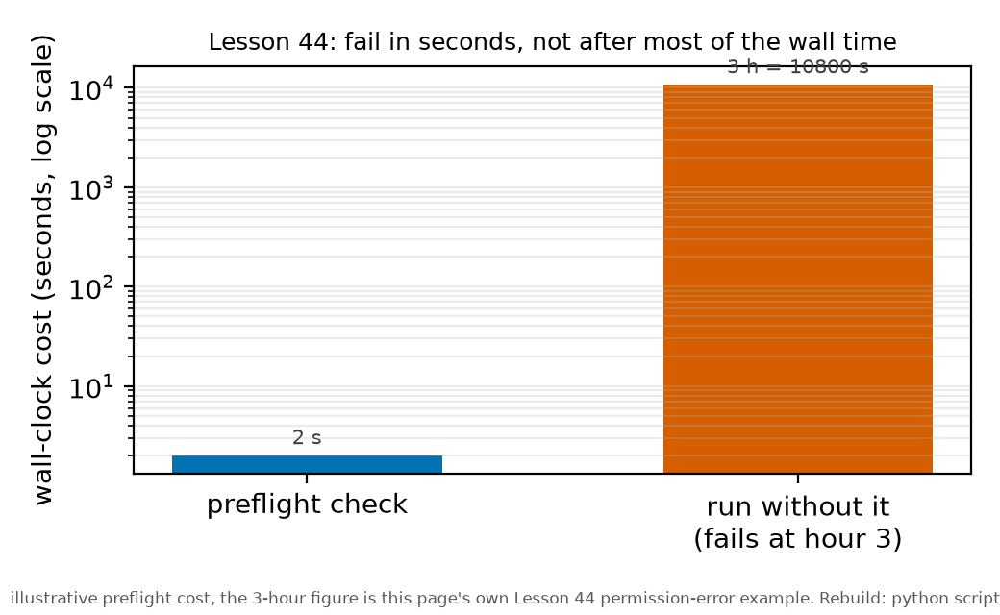
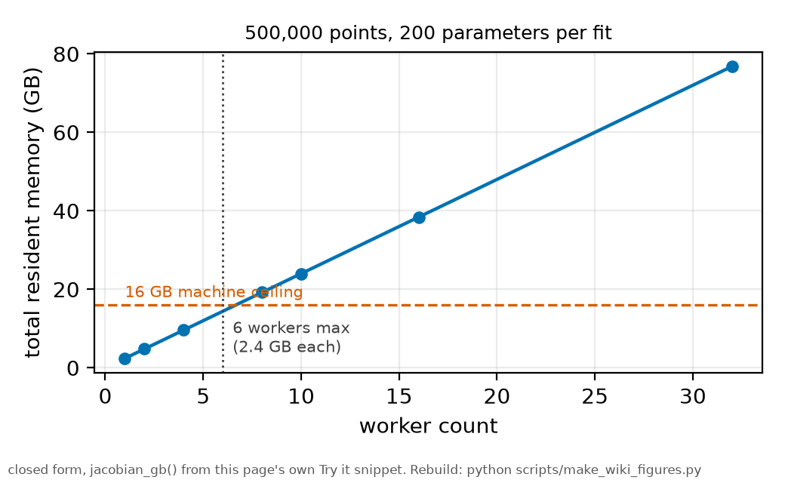

# Compute budgets and failure modes

*[wiki index](README.md) · method*

**The question.** Will a planned parallel fit or scan fit inside the
machine's memory, and can that be known before launch instead of by
watching it crash.
**Takes.** Nothing beyond arithmetic. No prior wiki page is required.
**Gives.** The per-worker memory estimate, the arithmetic that multiplies it
by worker count against a machine budget, and the discipline for what a
killed run's partial output is and is not.
**Skip if.** The reader wants the companion cost that scales with a trial
count instead of a worker count. That is
[Monte Carlo methods](monte-carlo-methods.md).

> **Unfamiliar with the vocabulary?** [GLOSSARY.md](../GLOSSARY.md)
> defines every term and symbol used anywhere in this repository.

## What it is

A scientific computation has a resource profile as real as its physics: how
much memory it needs, how long it runs, and how both change when the same
job is split across several workers to go faster. A few minutes of
arithmetic can establish that profile before launch, without running the
job to find out.

The constraint that most often bites first, and the one this page treats as
the headline case, is memory in a parallel least-squares fit. A least-squares
fit carries a Jacobian, one row per data point and one column per free
parameter, and a solver keeps that matrix resident for as long as the fit
runs, together with a few arrays of comparable size for the residual, the
trust-region step, and a QR or SVD factorization of the Jacobian itself. The
memory a single fit needs scales with the product of the point count and the
parameter count, not their sum. A fit that is modest on ten thousand points
and a dozen parameters can be memory-bound on the same data with several
times as many parameters, or on several times as much data with the same
parameters.

Running many such fits in parallel, one per worker process, turns a long
queue of independent fits into a short one. Each worker is a separate
process with its own copy of everything the fit needs, so a machine's
memory is divided among however many workers run at once, while its core
count sets how much time the parallelism saves. A per-fit footprint that is
modest run alone does not stay modest under multiplication: ten workers
holding the same Jacobian each need ten times the memory one of them needed
alone, and the machine's memory, not its core count, is usually the first
limit the job reaches.

Memory failures and wall-time failures differ in character as well as in
cause. A process that crosses a fixed memory ceiling is usually killed
outright, an abrupt and legible failure. A process that is merely slow
degrades instead: the operating system may start paging memory to disk
instead of refusing it outright, and a run can then appear to progress for
hours while doing almost no useful work.

## What problem it solves

The arithmetic itself is short: estimate one fit's footprint, multiply by
the number of workers planned, and compare the total against the machine's
memory. If the total already exceeds the ceiling, nothing needs to run to
discover that, and the worker count or the size of each fit can be
corrected before any wall time is spent.

The same care applies to what a run is allowed to do when it is stopped
before finishing, by a wall-clock timeout or by exhausting its memory
budget. A killed run produces whatever it had written up to that point, and
that partial output is not a random sample of what the finished run would
have produced: the cells that had already completed are the fast ones, or
the ones queued first, or the ones whose starting point happened to converge
quickly, never a representative draw across the grid. A partial result is a
biased sample of the intended measurement, not a shrunken version of it.

A related discipline covers the run itself once it has failed. A script
whose run did not finish should stay on record instead of being discarded,
because the memory or time it needed is information about the job, not only
about the number the job failed to produce. An instrument that produced
nothing under a given load still has to be repaired before the same job is
attempted again, and deleting it along with its unfinished output removes
the ability to diagnose the failure or size the next attempt correctly.
Checkpointing, writing intermediate state to disk often enough that a
killed run can resume near where it stopped instead of from the beginning,
and simply reducing the worker count so each surviving worker gets a larger
share of memory, are the two standard remedies once the arithmetic shows a
job will not fit as planned.

## Where this repository uses it

The global dataset fit chain in
[`scripts/run_global_dataset_fit.py`](../../scripts/run_global_dataset_fit.py)
has exactly this shape: its kappa profile and waist scan each run a
warm-started least-squares chain holding its own Jacobian and solver state,
and an optional parallel path, controlled by the `RB5S6S_WORKERS`
environment variable and implemented in `n_workers()` and `profile2d()`,
hands one such chain to each worker in a process pool. Every worker rebuilds
its own residual and Jacobian machinery from scratch, so the memory
argument above applies directly: the total footprint scales with worker
count exactly as it does for any other parallel fit built this way.
`n_workers()`'s own docstring gives that as the reason its default worker
count is zero, sequential, described there as "the default and the path of
record," instead of the machine's full core count. The parallel path is
trusted only once
[`scripts/_m25_parallel_smoke.py`](../../scripts/_m25_parallel_smoke.py)
shows it reproduces the sequential chi-squared exactly, cell for cell, on a
small grid, before the same machinery runs at production scale.



*A cheap check run before the expensive step turns an hours-long failure
into a seconds-long one.*

The same file's `_preflight()` function checks every path a run needs
before the expensive part starts, and names the likely cause of a missing
or unreadable path in a sentence a reader can act on. Without it, the same
failure surfaces only deep inside the multiprocessing library's own startup
code, as an unclear permission error, well into the run. With it, the
failure is caught and named in seconds.

A related technique applies when the expensive step is a fit instead of a
launch: find a cheap observable downstream of the change under question and
upstream of the fit itself, and use it to narrow the question before paying
for the fit at every candidate. A sweep across a range of commits needed to
know which commit had changed a joint construction, and a full fit at every
commit would have taken roughly seventeen hours. The construction's point
count is computed in the loading path before any fit starts, depends on the
same code, and resolved the whole range in about four minutes
([`run_commit_sweep.py`](../../scripts/run_commit_sweep.py)). The fits were
then run once, to confirm what the proxy had already located.

## What can go wrong

The bare point-count-times-parameter-count estimate is a lower bound on a
fit's memory, not the actual figure. A solver keeps the Jacobian's residual,
its trust-region step, and a QR or SVD factorization alongside the matrix
itself, so the true footprint runs to a few times the bare estimate, and
budgeting to the bare number under-provisions the real run.

A worker count is not free just because the machine reports that many
cores. Cores and memory are independent resources: a machine can hold far
more of one than the job's own arithmetic allows of the other, so the
binding constraint has to be checked instead of assumed to be whichever one
is easier to name.

Swapping is a quieter failure than an outright kill, and often harder to
diagnose. A run that crosses its memory budget by a little instead of a lot
may not be killed at all. Instead it forces pages to disk, which slows every
worker by orders of magnitude without ending the run, so a job that is
still going long past its estimate may not be making progress. It may only
be paging.

Checkpointing is only a safeguard once a real restart has exercised it. A
checkpoint that is written on schedule but never used to resume an
interrupted run has not actually been tested, and the gap tends to surface
only during the failure it was meant to cover.

## Try it

A hypothetical fit chain, several hundred thousand points combined across
many traces, against a joint model whose few shared physical parameters are
joined by one nuisance parameter per trace, running to a couple of hundred
parameters in total, sized under a rising worker count against a stated
machine budget. The per-worker footprint stays fixed. The total does not,
and it crosses the stated ceiling well before the worker count reaches the
values that would deliver a useful speed-up.



*Total footprint scales with worker count. The ceiling is crossed well
before parallelism pays off.*

```python
def jacobian_gb(n_points, n_params, overhead=3.0, dtype_bytes=8):
    """Rule-of-thumb resident footprint of one running least-squares fit,
    in gigabytes: the dense Jacobian itself (n_points by n_params, one
    float64 entry per point per parameter) times a small multiplier for
    the residual, the trust-region step and the QR or SVD factors a
    solver such as scipy.optimize.least_squares keeps alongside it while
    it runs. `overhead` is a rounded estimate, not an exact accounting."""
    bare_bytes = n_points * n_params * dtype_bytes
    return bare_bytes * overhead / 1e9


n_points, n_params = 500_000, 200
machine_ram_gb = 16.0
per_worker_gb = jacobian_gb(n_points, n_params)

print(f"one fit: {n_points} points, {n_params} parameters")
print(f"estimated footprint per worker: {per_worker_gb:.2f} GB")
print(f"machine budget: {machine_ram_gb:.0f} GB\n")
print(f"{'workers':>8}{'total footprint':>19}{'fits on this machine':>24}")
for n_workers in (1, 2, 4, 8, 10, 16, 32):
    total_gb = per_worker_gb * n_workers
    fits = "yes" if total_gb <= machine_ram_gb else "no"
    print(f"{n_workers:8d}{total_gb:16.2f} GB{fits:>24}")

max_workers = int(machine_ram_gb // per_worker_gb)
print(f"\nmax workers this machine can hold: {max_workers}")
```

Every snippet on these pages is executed by `tests/test_wiki_snippets_run.py`,
so one that stops working fails the suite instead of sitting here misleading
a reader.

## Further reading

- [SciPy: `scipy.optimize.least_squares`](https://docs.scipy.org/doc/scipy/reference/generated/scipy.optimize.least_squares.html),
  for what a trust-region solver keeps resident while it runs and for the
  Jacobian-sparsity option this repository's own fit chain uses to shrink
  it.
- G. H. Golub and C. F. Van Loan, *Matrix Computations*, 4th ed. (Johns
  Hopkins University Press, 2013), for the memory cost of the QR and SVD
  factorizations a least-squares solver builds on.
- [Monte Carlo methods](monte-carlo-methods.md), for the companion case
  where a computation's cost is multiplied by a trial count instead of a
  worker count, and needs the same arithmetic before it is launched.
- [Preregistration](preregistration.md), for the companion discipline of
  committing to what a run's outcome counts as before the run itself decides
  it by exhaustion instead of by design.

## See also

- [Methods chapter 6](../methods/06_the_statistics.md), whose Jacobian and
  SVD memory discussion is the worked version of this page's arithmetic.
- [Optimiser convergence](optimiser-convergence.md), the multi-start and
  bidirectional scans this page's memory arithmetic has to be run against
  before either is launched at scale.
- [Grids and discretisation](grids-and-discretisation.md), the point-count
  side of the same product that sets a fit's Jacobian size.
- [Monte Carlo methods](monte-carlo-methods.md), the companion computation
  whose cost multiplies by a trial count instead of a worker count.
- [Preregistration](preregistration.md), for committing to a run's stopping
  condition before a memory or wall-time ceiling makes that decision by
  exhaustion instead of by design.

---

[← Optimiser convergence](optimiser-convergence.md) · *Simulation and computation, 5 of 5* · [wiki index →](README.md)
