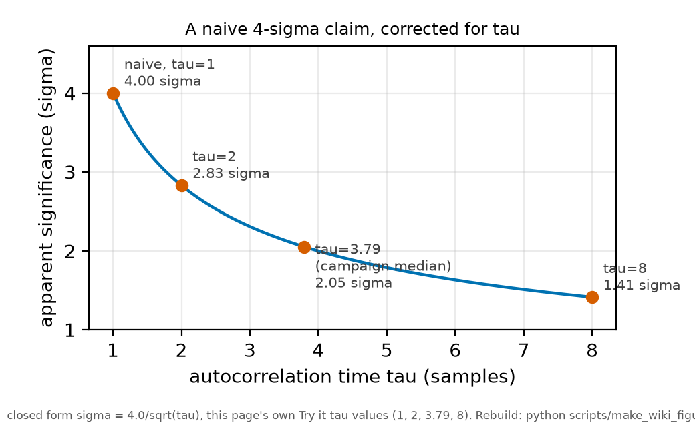

# Correlated samples and effective sample size

*[wiki index](README.md) · method*

**The question.** How many independent measurements a dataset actually
contains, when adjacent points are not independent.
**Takes.** Any series whose points were acquired in order, and its residuals.
**Gives.** The autocorrelation time, the design effect, and the places an
uncorrected sample count inflates a result.
**Skip if.** The question is how large each point's uncertainty is: see
[the noise law](the-noise-law.md). This page is about how many points count.

> **Unfamiliar with the vocabulary?** [GLOSSARY.md](../GLOSSARY.md)
> defines every term and symbol used anywhere in this repository.

## What it is

Almost every statistical formula assumes independent samples. The standard
error of a mean falls as one over the square root of $n$, a
chi-square has as many degrees of freedom as there are points, and an
information criterion penalises parameters against $\log n$. All of them take
$n$ to be a count of independent things.


*Two synthetic noise records with the same standard deviation but different
correlation structure, distinguishable only once averaging time enters the
calculation.*

Real measurements rarely oblige. A detection chain with a finite response time
smooths the noise, so consecutive samples share it, and a drifting apparatus
makes consecutive traces share an offset. Either way, the effective number of
independent samples is smaller than the raw count.

The standard summary is the **integrated autocorrelation time**,

$$\tau = 1 + 2\sum_{k \ge 1} \rho_k,$$

with $\rho_k$ the autocorrelation at lag $k$. It is one for independent
samples and larger otherwise, and it is a divisor:

$$n_{\text{eff}} = n / \tau.$$

In the survey literature the same quantity appears as the **design effect**,
the factor by which a clustered design's variance exceeds an independent
one's. The correction is identical either way.

## What problem it solves

It stops a measurement from claiming precision it does not have. Skipping the
correction leaves the error on a mean, the significance of a trend, the
confidence interval, and the model-comparison verdict wrong by the square root
of $\tau$, or by $\tau$ itself. Since $\tau$ is often between two and ten, the
overstatement is routinely a factor of two or three in significance, enough to
turn a null result into a finding.

## Where this repository uses it

The correlation is measured per condition alongside the noise law, as an
integrated autocorrelation time and a white-noise ratio. The median across the
campaign's conditions is about **3.8 samples**, so a trace's effective sample
count is roughly a quarter of its raw one.

It enters the record in three places, same mechanism, different unit.

  * **Within a trace**, where adjacent samples are not independent. This is
    the 3.8 above, traced to acquisition-side filtering, not the detection
    chain's response time: a filtering setting can be widened for more
    bandwidth, a fixed hardware response cannot. Oversampling beyond the
    correlation length adds points without information.
  * **Within a condition**, where the repeats of one cell share drift and
    alignment. The correction is a cluster or block treatment, not a
    per-sample one. The residual scatter about a fit becomes a between-block
    term.
  * **In model comparison**, where an information criterion's parameter
    penalty must use the effective count, not the raw one. The record carries
    both versions of one comparison. They disagree in verdict, showing the
    correction is not cosmetic.

A trend in one channel that looked significant at better than three standard
deviations became consistent with zero once a block bootstrap accounted for an
intraclass correlation of 0.38 across the repeats of each cell. Five
independent versions of the estimator agreed, so the discrepancy was in the
sample count, not the estimator.

## What can go wrong

**Correcting once and forgetting the other level.** Correlation within a trace
and correlation between traces have different divisors. Fixing one says
nothing about the other.

**Estimating $\tau$ from too short a series.** The sum over lags is noisy and a
naive version diverges. Practical estimators truncate it self-consistently,
and a $\tau$ from a few hundred samples is uncertain by tens of per cent.

**Assuming smoothing is harmless.** Any filter, hardware or software, imposes
correlation. A high-resolution mode that averages adjacent samples gains
effective bits by spending independence, which downstream arithmetic must
account for.

**Confusing correlation with a wrong noise law.** Both inflate a chi-square. A
noise law fitted per condition and checked against a measured scatter
separates them: a mis-scaled law fails that comparison, correlation does not.

## Try it

How badly an uncorrected count overstates a significance, at the measured
correlation length.



*How a claimed significance falls as the measured autocorrelation time is
applied, at the tau values used below.*

```python
import math

n = 2000
for tau in (1.0, 2.0, 3.79, 8.0):
    n_eff = n / tau
    print(f"tau = {tau:4.2f}: n_eff = {n_eff:7.0f}, "
          f"error bars widen by {math.sqrt(tau):.2f}x, "
          f"a naive 4.0 sigma becomes {4.0/math.sqrt(tau):.1f} sigma")
print("\nat the measured 3.79 a four-sigma claim is really about two")
```

Every snippet on these pages runs in `tests/test_wiki_snippets_run.py`, so a
broken one fails the suite instead of misleading a reader here.

## Further reading

- A. Sokal, "Monte Carlo methods in statistical mechanics", in *Functional
  Integration* (Springer, 1997), on the integrated autocorrelation time and
  its self-consistent truncation.
- L. Kish, *Survey Sampling* (Wiley, 1965), which introduced the design effect,
  reached from clustered sampling instead of time series.

## See also

- [The noise law](the-noise-law.md), on each sample's variance, while this
  page counts the samples
- [Resampling](resampling.md), where the block bootstrap applies this
  correction without estimating tau explicitly
- [Information criteria](information-criteria.md), whose penalty depends on
  the effective count
- [Confounding by acquisition order](confounding-by-acquisition-order.md), the
  other way an acquisition's structure enters an inference

---

[← Shot noise and technical noise](shot-noise-and-technical-noise.md) · *Noise and its management, 3 of 6* · [Digitisation and dynamic range →](digitisation-and-dynamic-range.md)
