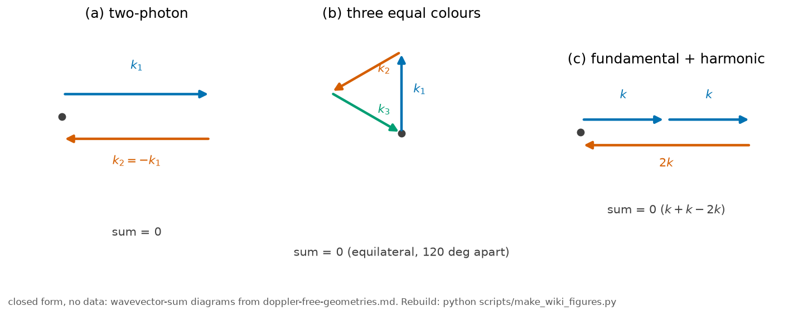
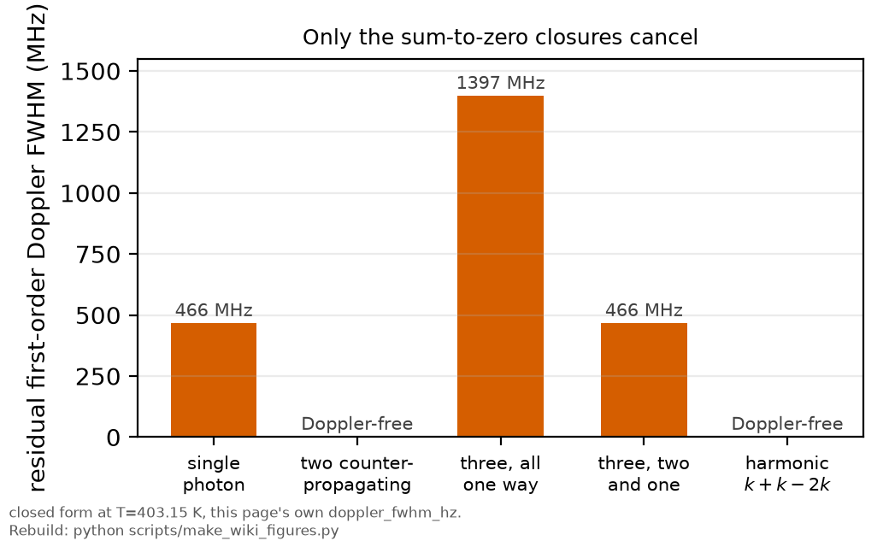

# Doppler-free geometries

*[wiki index](README.md) · concept*

**The question.** Which beam geometries cancel the first-order Doppler shift
for every atom at once, and which only appear to.
**Takes.** A wavevector and a velocity. No fitting, no data.
**Gives.** The summing rule for multiphoton shifts, the two-photon
counter-propagating case, why three equal-colour photons cannot close
collinearly, and the harmonic pair that can.
**Skip if.** You want the frequency axis, not the geometry. That is
[the wavemeter and the frequency axis](the-wavemeter-and-the-frequency-axis.md).

> **Unfamiliar with the vocabulary?** [GLOSSARY.md](../GLOSSARY.md) defines
> every term and symbol used anywhere in this repository.

## What it is

An atom moving with velocity $\vec v$ sees a photon of wavevector $\vec k$
shifted, to first order in $v/c$, by an amount proportional to
$\vec k \cdot \vec v$. That holds however many photons a transition absorbs
at once: each photon contributes its own wavevector to the resonance
condition, and the total first-order shift is proportional to
$\big(\sum_i \vec k_i\big)\cdot \vec v$, the sum dotted into the atom's
velocity, and not any one photon's shift on its own. The shift vanishes
for every atom, at every velocity, exactly when the wavevectors sum to
zero,

$$\sum_i \vec k_i = 0,$$

a statement about beam geometry that holds for the whole velocity
distribution at once.



*The three wavevector closures this page derives: flat for two photons,
triangular for three equal colours, flat again for the
fundamental-plus-harmonic combination.*

For two photons of the same colour from counter-propagating beams,
$\vec k_1=-\vec k_2$ by construction, and the sum is exactly zero for
every atom in the ensemble, not for a selected class. Saturated-absorption
spectroscopy selects instead: a strong pump and a weak probe
counter-propagate through a single-photon transition, and only the slice
of atoms near zero velocity along the beam is resonant with both, so the
narrow feature is carved out of the broad background by discarding the
rest. A retro-reflected two-photon geometry needs no such selection. Every
atom, at every velocity, contributes its cancelled shift to the same
narrow line, so the whole thermal population counts toward the signal.

Two limits apply. The cancellation is exact only to first order in $v/c$,
and a second-order, relativistic term in $(v/c)^2$ survives, small at
vapour-cell speeds but present in principle. The same two beams that
cancel a cross pair also drive an atom taking both photons from one beam
instead of one from each. That same-direction pair does not cancel, since
its wavevector sum is $2\vec k$, and the atoms taking it produce a broad
Doppler pedestal directly under the cancelled line. Both processes come
from the same two beams, so the pedestal is a fixed feature of the
technique and not a removable flaw.

Three photons of the same colour absorbed together all share magnitude
$k$. The condition $\vec k_1+\vec k_2+\vec k_3=0$ with
$|\vec k_1|=|\vec k_2|=|\vec k_3|=k$ has one solution shape: three
equal-length vectors summing to zero close only an equilateral triangle,
120 degrees apart in a plane. No collinear arrangement of three
equal-length vectors satisfies it, so closing the triangle needs a
genuinely non-collinear, three-beam geometry.

Three beams crossing at wide angles overlap only inside a small shared
volume, unlike a retro-reflected beam, whose forward and backward paths
fill the same volume by construction: the interaction region, and the
achievable signal, shrinks relative to the two-photon case. A
three-photon rate is already a high power of the intensity, so the
smaller volume cuts signal from an already weak process. Alignment and
wavefront quality must now be held along three directions instead of one.
A collinear compromise, two photons one way and the third the other,
leaves a residual wavevector $\pm\vec k$, the same order as a single
uncancelled photon, so the residual width stays close to the uncancelled
linewidth.

Drop the equal-colour assumption and the triangle can flatten into a
line, because a closing polygon with unequal sides can be degenerate. The
case that matters is $\vec k+\vec k-2\vec k=0$: two photons of frequency
$\omega$ from one beam and one photon at $2\omega$ from the opposing
beam, magnitudes $k$, $k$, $2k$. The sum vanishes exactly, the transition
sits at $4\omega$, and the cancellation is again exact for every atom.

Two independently tuned lasers holding a $2:1$ ratio would drift, growing the
residual wavevector with the mismatch. Here the second beam is the first
beam's own second harmonic, so the ratio is fixed by the doubling
process and not by tuning: if the fundamental drifts, the harmonic
drifts with it and the closure holds.

The harmonic scheme needs a doubling stage, at some cost in power, and
two colours that must be overlapped and focused together despite
differing diffraction. The transition must sit at $4\omega$, with the
parity a three-photon process reaches, a constraint on the level scheme
and not on the geometry, and the rate remains third order in intensity,
so the underlying low-signal problem persists.

The general pattern concerns wavevector magnitudes, not photon count. A
collinear closure exists whenever the magnitudes can be signed to cancel
along one axis: an even count for equal colours, or one side equal to the
sum of the others for unequal colours. Equal colours at odd photon number
admit no collinear solution, which is why three-photon closure needs
crossing beams, at the cost of interaction volume, alignment tolerance,
and signal, while the fundamental-harmonic pair closes flat and keeps the
full overlap.

## What problem it solves

It answers the geometric question under every Doppler-cancelling scheme:
given a set of photons and colours, which beam arrangement, if any,
cancels the first-order Doppler shift for the whole ensemble instead of
one velocity class. The two-photon case is the practical sweet spot and
not an arbitrary starting point: it is the lowest order at which the
Doppler-cancelling and fully-overlapping geometries coincide, using one
colour. Higher orders can be made collinear only by choosing colours so
the wavevectors cancel along a line, which restores the overlap but
requires a second beam at a different frequency.

## Where this repository uses it

The whole measurement rests on the two-photon instance of this rule: one
beam retro-reflected through the vapour cell, so every atom sees a
forward and backward photon of the same colour and the two-sided polygon
closes trivially. [Doppler-free two-photon spectroscopy](doppler-free-two-photon.md)
works out that cancellation for this apparatus, and
[standing waves](standing-waves.md) works out what the same geometry does
to the uncancelled same-direction pairs.

The resulting Doppler pedestal is treated as a designed observable and
not a nuisance to be modelled away.
[The fixed-lock instrument, section 10c.7](../plan/10_the-fixed-lock-instrument.md)
sets out what a wide enough scan reads from that pedestal once visible: a
consistency check on the atoms being probed, not a density axis.

No committed measurement here uses a three-or-more-photon geometry.
[`docs/FUTURE_TRANSITIONS_titsapph.md`, section 3.5](../FUTURE_TRANSITIONS_titsapph.md)
considers a one-colour three-photon transition out of $5S_{1/2}$: the
equal-magnitude case applies exactly, a collinear geometry leaves too
broad a residual, so the proposal turns to a STAR geometry of three
coplanar beams at 120 degrees. Its other two channels, two photons from
one beam and one from another, leave residual wavevectors of $\sqrt3 k$
and $3k$, the three-beam analogue of the same-beam pedestal above. The
document also meets the different-colour exception above: two photons of
one colour against a doubled-frequency photon the other way close
collinearly with no crossing beams, ruled out there on energy grounds and
not on geometry.

## What can go wrong

The first failure is treating the cancellation as a velocity-class
selection like saturated absorption, instead of a whole-ensemble
cancellation. The two techniques narrow a line by different mechanisms,
and confusing them gives the wrong expectation for how signal scales
with vapour density or cell length, since selection discards population
that cancellation keeps.

The second is forgetting the residual: the first-order cancellation is
exact only to first order, and treating a two-photon line as carrying no
Doppler contribution at all, instead of none to first order, overstates
the geometry's reach at extreme precision.

The third is a design trap and not a modelling one: assuming more
photons automatically gives more resolution or signal for the same
again. Going from two to three photons does not add a photon onto an
existing collinear beam. It forces a non-collinear geometry that gives up
the overlap that made the two-photon signal strong, leaving the
interaction volume, not the atom, to set the achievable signal.

The fourth is assuming any collinear arrangement of more than two photons
is Doppler-free by resemblance to the two-photon geometry. Two photons
one way and one the other along a single axis is collinear and easy to
build, but for equal colours it does not sit on the cancelling polygon,
and its residual width is the same order as an ordinary single-photon
Doppler width, not a small correction.

## Try it

The first-order Doppler width of a multiphoton resonance, from summing
signed wavevectors instead of counting photons, which is what lets the
two-colour case be expressed at all.



*Residual Doppler FWHM for the five signed-wavevector cases above. Only the
sum-to-zero cases collapse the width.*

```python
import math

from rb5s6s.constants import K_B_J_PER_K, LAMBDA_LASER_M, M_RB87_KG

T_K = 403.15  # K, the reference cell temperature used elsewhere in this record
v_sigma = math.sqrt(K_B_J_PER_K * T_K / M_RB87_KG)  # 1D thermal speed
k_fund = 2.0 * math.pi / LAMBDA_LASER_M             # the fundamental wavevector


def doppler_fwhm_hz(signed_k_in_units_of_fundamental):
    """FWHM from the NET wavevector, the signed sum along the beam axis.

    Each entry is a photon's wavevector magnitude in units of the fundamental,
    signed by the direction it travels. Photon COUNT is not enough: a harmonic
    photon carries twice the wavevector of the fundamental it came from.
    """
    net = abs(sum(signed_k_in_units_of_fundamental))
    return net * k_fund * math.sqrt(8.0 * math.log(2.0)) * v_sigma / (2.0 * math.pi)


cases = [
    ("single photon",                              [+1]),
    ("two counter-propagating, one colour",        [+1, -1]),
    ("three collinear, one colour, all one way",   [+1, +1, +1]),
    ("three collinear, one colour, two and one",   [+1, +1, -1]),
    ("three collinear, harmonic: k + k - 2k",      [+1, +1, -2]),
]
for label, ks in cases:
    print(f"{label:<44}{doppler_fwhm_hz(ks) / 1e6:8.1f} MHz")
print()
print("Only the closures summing to zero cancel, and the harmonic case does it")
print("collinearly, which the equal-colour argument cannot reach at odd order.")
```

## Further reading

- G. Grynberg and B. Cagnac, Rep. Prog. Phys. 40, 791 (1977), the general
  $\sum_i \vec k_i \cdot \vec v = 0$ theory of Doppler-free multiphoton
  spectroscopy this page summarises.
- I. I. Ryabtsev and co-workers, Phys. Rev. A 84, 053409 (2011), which
  proposes the three-beam star geometry for a non-collinear three-photon
  excitation.
- [`../lit/biraben1974.md`](../lit/biraben1974.md), the founding experimental
  demonstration of the two-photon case this page generalises from.
- [Doppler-free two-photon spectroscopy](doppler-free-two-photon.md), the
  two-photon instance of the rule stated here, worked out for this
  apparatus.
- [Standing waves](standing-waves.md), for what the same retro-reflected
  geometry does to the uncancelled same-direction pairs.

## See also

- [Doppler-free two-photon spectroscopy](doppler-free-two-photon.md), the
  two-photon instance of the geometry rule stated here, worked out in full
  for this apparatus.
- [Standing waves](standing-waves.md), what the same retro-reflected
  geometry does to the uncancelled same-direction pairs sitting under the
  cancelled line.
- [Multiphoton transitions](multiphoton-transitions.md), the broader
  multiphoton framework this geometry rule sits inside.

---

[← The cascade and F-depletion](the-cascade-and-f-depletion.md) · *Atomic structure and selection rules, 7 of 7* · [wiki index →](README.md)
