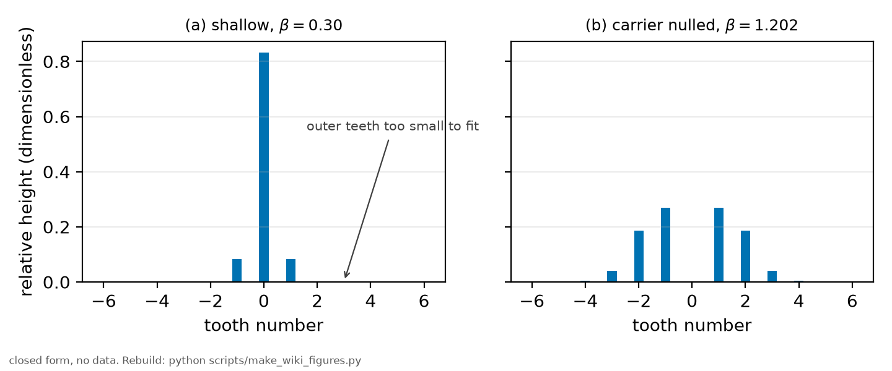

# EOM sidebands

*[wiki index](README.md) · technique*

**The question.** What frequency ruler does a phase-modulated sweep carry,
and how does a two-photon transition change the arithmetic of that ruler.
**Takes.** No prior background, since the sideband picture and the Bessel
amplitudes are introduced from scratch.
**Gives.** The one-photon and two-photon comb laws, the carrier-null depth
for each, and where this repository's frequency ruler and its design
compromise are implemented.
**Skip if.** The sideband derivation is already familiar and only the
two-photon consequences for reach and shape-fitting precision are wanted,
a case covered by [The two-photon comb](the-two-photon-comb.md).

> **Unfamiliar with the vocabulary?** [GLOSSARY.md](../GLOSSARY.md)
> defines every term and symbol used anywhere in this repository.

## What it is

An electro-optic modulator is a crystal whose refractive index follows an
applied voltage. Drive it with a radio-frequency tone and the light passing
through acquires a periodically varying phase, which is equivalent to a comb
of pure tones spaced by the drive frequency. Their amplitudes are
[Bessel functions](bessel-functions.md) of the modulation depth $\beta$, and
the spacing is the drive frequency itself, known as accurately as the
synthesiser that produces it.

The point is that the spacing is a KNOWN frequency interval imposed on the
light. Any spectral feature the laser sweeps across is reproduced once per
sideband, so a single sweep records several copies of the same line at
intervals that are known to many digits. Measuring the separation of those
copies in whatever the raw axis happens to be, typically time, converts that
axis into frequency. The modulator becomes a ruler.

In a two-photon transition the arithmetic changes, and the change is the
useful part. The atom absorbs one photon from each beam, so a tooth appears
wherever a PAIR of sidebands sums to the right total. The tooth at order $k$
therefore collects every pair $m+m'=k$, and by Neumann's addition theorem the
sum collapses:

$$A_k \propto \Big|\sum_m J_m(\beta) J_{k-m}(\beta)\Big|^2 = J_k(2\beta)^2$$

So a two-photon comb has the same form as a one-photon one but at twice the
modulation depth, and its teeth are spaced by HALF the drive frequency on the
transition axis, since a pair of sidebands one step apart shifts the total by
one step.



*The comb at two depths. Shallow modulation leaves almost everything in the
central tooth and the outer teeth are too small to fit. At $\beta = 1.202$
the argument $2\beta$ reaches the first zero of $J_0$ and the central tooth
vanishes, putting the light where it can be measured.*

## What problem it solves

A laser sweep is driven by a voltage ramp, and the relation between that ramp
and the frequency it produces is neither linear nor stable enough to trust.
Without a ruler, every width in a spectrum is quoted in volts or in
milliseconds. The comb supplies the conversion from the same trace that
carries the data, so the calibration cannot drift away from the measurement
it calibrates.

## Where this repository uses it

The frequency axis of every trace comes from this.
[Methods chapter 3](../methods/05_the_frequency_ruler.md) derives the comb,
gives the measured sweep rate with its uncertainty, and explains why the rate
is a clean number: it is a differential measurement across several copies of
the SAME line, so everything that afflicts the line afflicts every copy
equally and cancels. [`rb5s6s/ruler.py`](../../rb5s6s/ruler.py) implements the
simultaneous fit over all the teeth.

The comb shape also drove a design compromise worth reading before repeating
it. The 2025 session ran at small modulation depth, where the outer teeth
drown in the central tooth's tails, and the workaround was to rotate a
half-wave plate to admix amplitude modulation and suppress the carrier. The
fix the record recommends instead is to drive at the depth that nulls the
carrier outright, which for the two-photon comb is $\beta$ near 1.202 rather
than the 2.405 a one-photon calculation would give.

A comb is a pair of islands rather than a carpet. The tooth amplitudes fall
away once the order exceeds the argument, so at a depth near the carrier zero
only the first few orders carry usable power and the comb reaches a few tens
of megahertz around whatever line it is marking. Calibrating a span far wider
than that reach needs something else to carry the scale between the islands.

## What can go wrong

The first failure is the one the 2025 data lived with: at shallow depth only
two or three teeth rise above the noise, and a ruler with three teeth over a
short span constrains the rate far less than the same modulator would at a
better depth. That is data insufficiency created by a setting.

The second is a model failure. The Bessel law above holds for PURE phase
modulation. Admixed amplitude modulation, whether deliberate or from a
misaligned polarisation axis, changes the tooth heights and breaks the
symmetry of the comb, so tooth amplitudes should not be used to infer $\beta$
unless the modulation purity is itself established. The asymmetry is a useful
diagnostic of the modulator in its own right.

The third is an implementation trap that a plausible-looking calculation
walks straight into: using $J_n(\beta)$ where the two-photon comb requires
$J_k(2\beta)$, which puts the carrier null at the wrong drive amplitude by a
factor of two.

A fourth, subtler one is a calibration degeneracy. The rate and the width
enter the analysis as a product, so calibrating the rate by ASSUMING a width
cannot then detect that the width has changed. The ruler has to be measured
from the comb itself, on the same trace, for the calibration to be
independent of what it calibrates.

## Try it

The comb at the two depths the design compromise turns on.

```python
from scipy.special import jv

for beta in (0.30, 1.202):
    amps = [jv(k, 2 * beta) ** 2 for k in range(4)]
    tallest = max(amps)
    print(f"beta = {beta:.3f}: " + "  ".join(
        f"k={k} {a / tallest:.3f}" for k, a in enumerate(amps)))
print("at 1.202 the argument 2 beta reaches the first zero of J0, "
      "so the carrier vanishes")
```

Every snippet on these pages is executed by `tests/test_wiki_snippets_run.py`,
so one that stops working fails the suite rather than sitting here misleading
a reader.

## Further reading

- G. C. Bjorklund, "Frequency-modulation spectroscopy: a new method for
  measuring weak absorptions and dispersions", *Opt. Lett.* **5**, 15 (1980),
  for the sideband formalism in a measurement context.
- [Bessel functions](bessel-functions.md) for the amplitudes and the
  Jacobi-Anger identity behind them.
- [Methods chapter 3](../methods/05_the_frequency_ruler.md) for this bench's
  numbers and its common-mode rejections.

## See also

- [The two-photon comb](the-two-photon-comb.md) for what the doubled
  argument derived here costs in reach and shape-fitting precision.
- [Bessel functions](bessel-functions.md) for the addition theorem and
  power-conservation identity the two-photon collapse above relies on.
- [The wavemeter and the frequency axis](the-wavemeter-and-the-frequency-axis.md)
  for how this differential ruler compares against absolute references and
  fits into the wider calibration stack.

---

[← wiki index](README.md) · *Driving, modulating and detecting, 1 of 9* · [The two-photon comb →](the-two-photon-comb.md)
