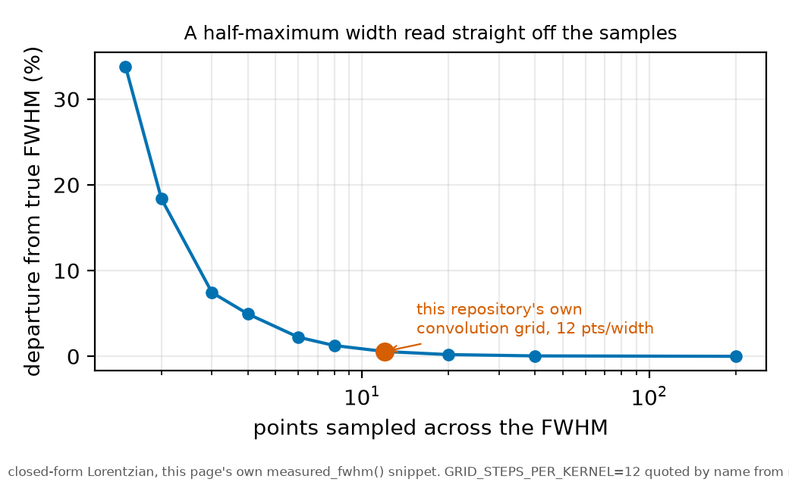

# Grids and discretisation

*[wiki index](README.md) · method*

**The question.** How many grid points across a feature's own width are
enough to recover that feature with a fit, not merely to draw it on a
plot.
**Takes.** A general sense of what a grid and a fit are. No prior wiki
page is required.
**Gives.** The points-per-feature-width ratio that governs a fit's
precision, and the simulation test that checks it instead of assuming it.
**Skip if.** The reader wants the three-setting acquisition design problem
this ratio feeds into: [designing an acquisition](designing-an-acquisition.md).

> **Unfamiliar with the vocabulary?** [GLOSSARY.md](../GLOSSARY.md)
> defines every term and symbol used anywhere in this repository.

## What it is

A spacing of 0.05 MHz says nothing about whether a grid is fine or coarse:
fineness is set by comparison with the narrowest feature the grid
represents, not by the step alone. The only useful measure is how many
points fall across that feature's own width, $n = w / \delta$ for a
feature of width $w$ sampled at step $\delta$. A design decision follows
from that ratio, not from either number alone.

A grid fine enough to draw a curve is not one fine enough to fit it. A
plot interpolates between recorded points, so a display looks smooth
whether the feature sits on a handful of samples or hundreds, because the
eye fills in the curvature the gaps leave out. A fit gets no such help: it
estimates a width, an asymmetry or a centre from the samples on the
feature, so its precision depends on how many independent points are
really there, even when the plotted trace looks convincing.

The same ratio governs a purely numerical grid as much as a physical
acquisition. A model that evaluates a lineshape on its own internal grid,
for instance to convolve two kernels together, meets the identical question
in miniature: how many grid points fall across the narrowest kernel being
convolved, not how many points the grid carries in total.

## What problem it solves

Stating a requirement as a record length, a span, or a sampling rate on
its own treats three coupled quantities as independent, so a design can
satisfy one while starving the feature it exists to measure. Points across
the feature width collapses all three into the ratio that actually sets a
fit's precision, a number tested by simulation, recovering a known truth
at the proposed density, instead of assumed because it sounds generous.

## What can go wrong

Too coarse a step biases a fitted width: samples that miss the peak
understate the sampled maximum, so a half-maximum criterion crosses
further out than the true half-maximum sits, and the recovered width comes
out too wide before a plotted trace looks implausible. The same
undersampling can fold structure to the wrong place instead of only
broadening it, an aliasing failure below a feature's own Nyquist rate.
Span and resolution are exchanged against each other at a fixed record length:
widening a window to reach a companion feature costs points the feature
at the centre no longer gets, so the same record that resolves a line
easily at one span can leave it thinly sampled at another.

A feature near a window's edge carries a further hazard: whatever lies
outside it, a slowly varying background, a wider companion feature, an
instrument offset, must be assumed or extrapolated instead of measured,
because the window holds no data to constrain it. A window fitted right to
a feature's own edge is fitted against a baseline it cannot itself
determine, so the result depends on the assumed form of that baseline as
much as on the data inside the window.

## Where this repository uses it

The wide-scan record length in
[chapter 7 of the plan](../plan/07_acquisition-settings.md) was set by
this ratio. An earlier version fixed the record at 10000 points, set
before any simulation tested it. Simulated later against a frozen recovery
criterion, 10000 points leaves 22 points across the line and fails the
criterion, 20000 points passes, and 40000 points passes with margin, so
the record length rose several times over from a figure nobody had
checked.


*The same 5.41 MHz line at the campaign's measured noise law, sampled at
10000 and 40000 points across the 2400 MHz span, with the fitted-width
scatter over 40 draws at each density.*

The same ratio also governs a grid this repository builds itself, not one
it digitizes. `GRID_STEPS_PER_KERNEL` in
[`rb5s6s/lineshape.py`](../../rb5s6s/lineshape.py) fixes the internal
convolution grid at 12 steps across the narrowest kernel width, named as a
constant instead of a bare literal: a coarsened version, at 4 steps across
the kernel, shifted the composite line width by about 0.1 percent with the
rest of the test suite still green, a change nothing else in the suite was
positioned to catch.

## Try it

A Lorentzian sampled at several densities relative to its own width, its
half-maximum width read straight off the samples, as an unfitted
measurement would read it. The departure from the true width grows as the
grid coarsens: negligible at the hundreds of points a plot would use,
several percent at the handful a thin record leaves.



*The departure this page's own snippet prints, against sampling density.
The repository's convolution grid sits well inside the flat region.*

```python
import numpy as np
from rb5s6s.lineshape import lorentzian, GRID_STEPS_PER_KERNEL


def measured_fwhm(points_per_width, true_fwhm=1.0, phase=0.31):
    """Sample a Lorentzian on a grid of the given density and read its
    half-maximum width straight off the samples, the way an unfitted
    measurement would."""
    step = true_fwhm / points_per_width
    n = int(np.ceil(8 * true_fwhm / step)) + 2
    nu = step * (np.arange(-n, n + 1) + phase)
    y = lorentzian(nu, true_fwhm)
    i_peak = np.argmax(y)
    half = 0.5 * y[i_peak]

    i = i_peak
    while y[i] >= half:
        i -= 1
    x_lo = nu[i] + (half - y[i]) * (nu[i + 1] - nu[i]) / (y[i + 1] - y[i])

    i = i_peak
    while y[i] >= half:
        i += 1
    x_hi = nu[i - 1] + (half - y[i - 1]) * (nu[i] - nu[i - 1]) / (y[i] - y[i - 1])

    return x_hi - x_lo


true_fwhm = 1.0
print(f"true Lorentzian FWHM: {true_fwhm:.3f} MHz")
print(f"{'points/width':>14}{'grid step':>14}{'measured FWHM':>16}{'departure':>13}")
for points_per_width in (200, 40, 20, 12, 8, 6, 4, 3, 2, 1.5):
    fwhm_meas = measured_fwhm(points_per_width, true_fwhm)
    departure_pct = 100.0 * (fwhm_meas - true_fwhm) / true_fwhm
    flag = ("  <- this repository's own convolution-grid density"
             if points_per_width == GRID_STEPS_PER_KERNEL else "")
    print(f"{points_per_width:14.1f}{true_fwhm / points_per_width:14.4f}"
          f"{fwhm_meas:16.5f}{departure_pct:12.2f}%{flag}")
```

Every snippet on these pages is executed by `tests/test_wiki_snippets_run.py`,
so one that stops working fails the suite instead of misleading a reader
here.

## Further reading

- P. R. Bevington and D. K. Robinson, *Data Reduction and Error Analysis for
  the Physical Sciences*, 3rd ed. (McGraw-Hill, 2003), on how a fitted
  parameter's precision depends on the number and placement of samples.
- J. S. Bendat and A. G. Piersol, *Random Data: Analysis and Measurement
  Procedures*, 4th ed. (Wiley, 2010), on sampling, aliasing and record
  length in a digitized measurement.
- [Designing an acquisition](designing-an-acquisition.md), the acquisition
  design problem this ratio resolves.
- [Injection-recovery testing](injection-recovery.md), the technique a
  grid requirement is tested against.
- [Chapter 7 of the plan](../plan/07_acquisition-settings.md), the record
  length case worked through in full.

## See also

- [Designing an acquisition](designing-an-acquisition.md), the acquisition
  problem this ratio resolves for a physical scan.
- [Injection-recovery testing](injection-recovery.md), the technique a
  grid requirement is tested against instead of asserted.
- [Optimiser convergence](optimiser-convergence.md), the next question a
  fit on a well-resolved grid has to survive.
- [Compute budgets and failure modes](compute-budgets-and-failure-modes.md),
  the cost of testing a grid density by simulation before running at scale.

---

[← The digital twin of an experiment](the-digital-twin.md) · *Simulation and computation, 3 of 5* · [Optimiser convergence →](optimiser-convergence.md)
