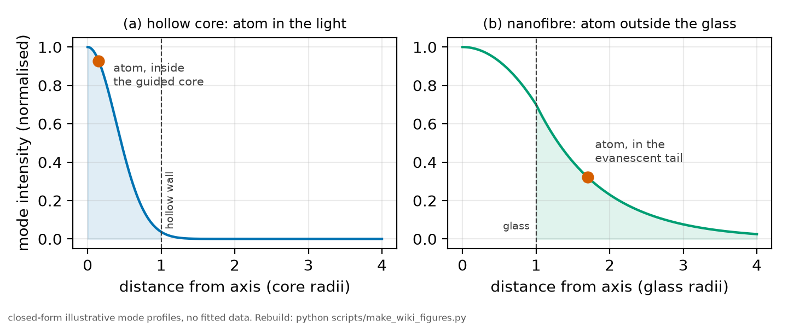
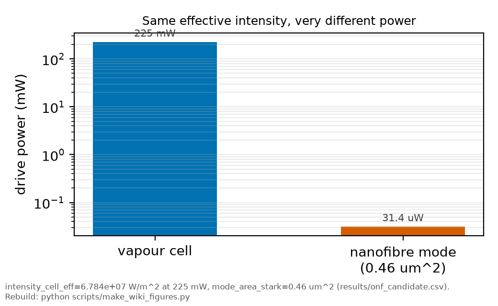

# Guided atoms: hollow cores and nanofibres

*[wiki index](README.md) · concept*

**The question.** What changes when the atoms and the light are held in the
same waveguide instead of crossing in free space, and which of this
measurement's limits that fixes?
**Takes.** [The beam waist](the-beam-waist.md) for what an intensity is,
[transit-time broadening](transit-time-broadening.md) for the width a
crossing costs, and [the AC-Stark shift](ac-stark-shift.md) for what a field
does to the levels.
**Gives.** The two guided geometries, their trade-offs, and why a guided
platform is a different lever on this record's degeneracies.
**Skip if.** You have no fibre. Nothing on the record's main path depends on
it.

> **Unfamiliar with the vocabulary?** [GLOSSARY.md](../GLOSSARY.md)
> defines every term and symbol used anywhere in this repository.

## The two geometries

A hollow-core fibre puts the atoms inside the light: the guided mode runs
down a hollow channel and the atoms sit in it. Interaction length becomes a
design choice, centimetres where a free-space waist gives millimetres.

*Where the atom sits relative to the guided intensity in each geometry: inside the core, or in the evanescent tail outside it.*

A nanofibre puts the atoms outside the light: the glass is drawn below the
wavelength, so much of the mode travels as an evanescent field in the
vacuum around it, and atoms are trapped there, a few hundred nanometres from
the surface.

| | hollow core | nanofibre |
|---|---|---|
| where the atom sits | inside the mode | outside the glass, in the evanescent tail |
| interaction length | centimetres, by design | the taper waist, millimetres |
| what limits coherence | collisions with the wall, guided-mode light shifts | the surface, through van der Waals and its thermal field |
| what it is good at | long interrogation of a dense guided sample | strong coupling of a few atoms to a single mode |

## Where this repository uses it

From [`results/onf_candidate.csv`](../../results/onf_candidate.csv), which
sizes a nanofibre candidate alongside this vapour cell:

*Power needed for the same effective intensity: milliwatts in the cell against microwatts in the nanofibre mode.*

| quantity | value | what it sets |
|---|---|---|
| fibre diameter | 400 nm | below the wavelength, which makes the field evanescent |
| effective index | [1.03164](../../results/guided_mode_tables.csv "ref:guided_mode_tables:mode_solve_400nm:neff") at 400 nm | how tightly the mode is bound. Solved from the diameter. Earlier values in [HISTORY](../HISTORY.md) |
| evanescent decay length | 543 to 732 nm amplitude, 312 nm intensity at the central diameter | the atom-surface distance scale. Solved from the diameter, not assumed |
| effective mode area | [0.615](../../results/guided_mode_tables.csv "ref:guided_mode_tables:mode_solve_400nm:mode_area_azimuthal_mean") µm² | the intensity a given power makes. P divided by the azimuthally averaged flux at the surface. The peak convention gives the smaller area, [0.489](../../results/guided_mode_tables.csv "ref:guided_mode_tables:mode_solve_400nm:mode_area_peak"), so the number is not quotable without its convention. Earlier values in [HISTORY](../HISTORY.md) |

The same file gives the cell's effective intensity as 6.784e7 W per square
metre, with a 0.348 MHz shift at 225 mW. A mode area below a square micron
reaches that intensity at microwatts.

**How the area is settled.** The fields are built in
`rb5s6s.fibre.HE11Field` and validated against their own boundary conditions
before integration: $E_z$ and $H_\phi$ are continuous across the glass surface
to one part in $10^9$, and a fraction [0.231](../../results/guided_mode_tables.csv "ref:guided_mode_tables:mode_solve_400nm:power_fraction_in_glass")
of the power travels inside the glass. That continuity check is what makes the
area checkable instead of asserted. Earlier values are in
[HISTORY](../HISTORY.md).

## A lever on the degeneracy

The total width is well determined. The split between its causes is not
([identifiability](identifiability.md)). More data does not help:
[`results/twin_span_sweep.csv`](../../results/twin_span_sweep.csv) shows ten
times the data moving the width-width correlation by 0.0000.

Transit broadening is set by how long an atom stays in the light: a thermal
velocity crossing the beam waist in a cell, a fixed geometry in a guide. The
cell's contribution at 130 C is 0.9575 MHz and cannot be turned off. In a
guide it becomes a knob, an orthogonal lever on the degeneracy.

The knobs are concrete: a two-colour trap turned on or off with its colour
ratio scanning the atom-surface distance, a red beam run as travelling or
standing wave, the MOT on or off, and molasses temperature stepped along a
ladder. Each moves a different term in the width budget.

## New systematics

The surface introduces a new systematic: at a few hundred nanometres the van
der Waals interaction with the glass shifts and broadens the line, and its
own thermal field adds to it. Removing transit broadening while adding a
surface shift is no improvement until that term is measured.

Two-colour traps impose their own light-shift distribution, the same class
of problem as [the Stark ramp](ac-stark-shift.md) in the cell: atoms see a
spread of shifts, and a measurement that assumes a single number inherits
that spread as a systematic.

A guided measurement is differently conditioned, and its value lies in
combining it with the cell measurement.

## Digital-twin validation

`scripts/run_fibre_twin.py` tests the candidate's molasses ladder with 500
recovery trials per synthetic world, in
[`fibre_twin.csv`](../../results/fibre_twin.csv). It is a design check, not
a measurement of the real fibre: it shows the design can identify the
homogeneous linewidth component in synthetic worlds with a known answer,
with a per-rung scatter of 4.0 kHz against the 3.2 kHz the cell record
achieves per condition. The lever under test and its own calibration
sit at the same scale, so a mismatch means the quantity is unidentifiable,
not that the design is wrong. The real fibre itself still has to be
measured.

## Further reading

* [`docs/notes/onf_candidate.md`](../notes/onf_candidate.md), the sized
  candidate this page summarises.
* [Chapter 6 of the big picture](../big_picture/06_next-nanofibre.md), the
  fibre thread in full.

## See also

* [Identifiability](identifiability.md), the degeneracy a second platform
  breaks.
* [Transit-time broadening](transit-time-broadening.md), the term a guide
  converts to a design choice.
* [The digital twin](the-digital-twin.md), how a design is scored before it
  is built.
* [The beam waist](the-beam-waist.md), the quantity a guide replaces.

---

[← Vapour density and temperature](vapour-density-and-temperature.md) · *Experimental spectroscopy, 11 of 11* · [wiki index →](README.md)
