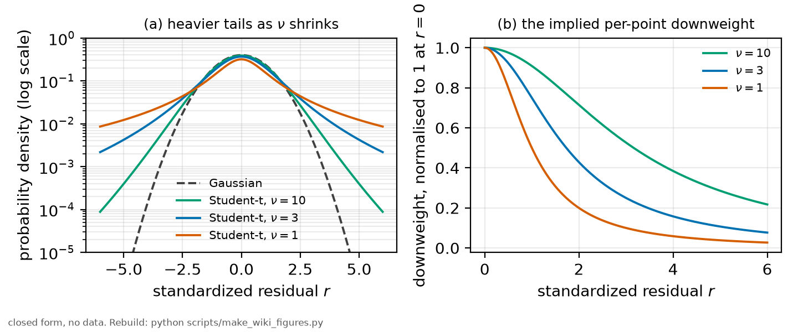
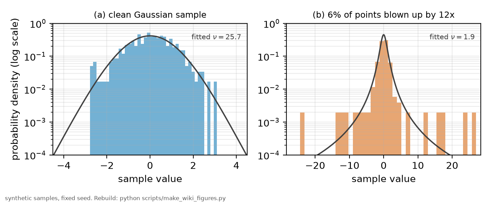

# Heavy-tailed models

*[wiki index](README.md) · concept*

Is a large residual a mistake to remove, real structure the model has not captured, or evidence that the noise has heavier tails than assumed. This page builds on a weighted fit under an assumed noise law, Gaussian in this repository, to serve as the baseline it is compared against and sets out the Student-t likelihood as a continuous, fitted alternative to a hand-chosen loss, and the scale-mixture-of-normals framing behind it. Not covered here: a hand-chosen loss applied by rule instead of a likelihood fitted to the tail shape. That is [robust fitting](robust-fitting.md).

> [GLOSSARY.md](../GLOSSARY.md) states the measurement in six sentences and
> defines every term and symbol used anywhere in this repository.

## Definition

A point that sits far from a fitted curve is usually read as a mistake to
find and remove, or a real feature the model has not yet captured. The noise
generating every point may have heavier tails than a Gaussian, so a
point several sigma away is not rare under the true noise law, only under
the Gaussian one an ordinary weighted fit assumes. Rejecting the point
discards the information that would reveal the noise's actual shape.



*Student-t densities and the residual downweighting they imply, for a few
degrees-of-freedom values against the Gaussian limit.*

The Student-t distribution turns this into a model instead of a judgement
call. Its density carries a degrees-of-freedom parameter, conventionally
$\nu$: large $\nu$ converges to the Gaussian, and $\nu$ near or below one
gives tails heavy enough that the variance can fail to exist. The Gaussian
likelihood is the limiting case of the Student-t one, so a fit can land at
either end or anywhere between.

Maximizing a Student-t likelihood is exactly an iteratively reweighted least
squares. Each point's weight at the maximum falls as its own residual
grows, the same shape a Huber loss or Tukey's biweight imposes by explicit
construction instead of by a likelihood. Because $\nu$ is fitted instead of
fixed in advance, a small recovered $\nu$ is a quantitative statement that
the data prefer heavy tails to a wider Gaussian.

The general framing behind this is the scale mixture of normals: a
Student-t variable is a Gaussian whose own variance is drawn from an
inverse-gamma distribution and averaged over. Each point is Gaussian
conditional on its own variance, and the heavier tail appears once that
variance is integrated out. A different mixing distribution gives a
different tail shape, so the Student-t likelihood is one member of a
family.

None of this explains an outlier. A heavy-tailed likelihood accommodates a
population of large residuals by widening what the model calls plausible.
It does not say whether a given large residual came from a stray spark on a
detector, a mistimed trigger, or real structure the mean model has not
captured. A fitted $\nu$ describes the shape of the residuals in this
dataset, not why they take that shape or whether another dataset would show
the same tail.

## The problem it addresses

A weighted fit under a Gaussian likelihood gives every point exactly the
influence its stated weight implies, with no headroom for a point whose
actual error is larger than its stated one. Both conventional responses
require a decision made outside the fit: reject points past some threshold,
which turns every borderline point into a discrete in-or-out call, or
accept an answer that a handful of large residuals can still pull around. A
heavy-tailed likelihood folds that decision back into the same maximization
the rest of the fit already runs. Down-weighting becomes continuous, set by
the size of a residual instead of by where an analyst drew a line, and
because the degrees-of-freedom parameter is fitted instead of chosen, how
much down-weighting happens is set by the data instead of by a fixed
convention.

It also gives a second, principled fit to compare against the standard one.
Where the two agree, the ordinary weighted fit stands with more confidence
than it had alone. Where they disagree, the disagreement names which points
changed the answer, the same use the closing section of
[weighted least squares](weighted-least-squares.md) recommends for the
whole robust and influence family, instead of a silent substitute for the
weighted fit itself.

## Application in this repository

No fit committed to this repository maximizes a Student-t or any other
heavy-tailed likelihood. The noise law behind every weighted fit is measured
directly from the raw signal instead of assumed, and comes out Gaussian by
construction, with a variance that grows with the signal level instead of a
fixed width. [Weighted least squares](weighted-least-squares.md) sets out
that law, and [`rb5s6s/noise.py`](../../rb5s6s/noise.py) fits its
coefficients per condition into
[`results/noise_model.csv`](../../results/noise_model.csv). Nothing
downstream currently asks whether a heavier tail would describe the same
samples better than that measured Gaussian law does.

A Student-t quantile already appears downstream, in
[`rb5s6s/beta.py`](../../rb5s6s/beta.py) and in
[methods chapter 6](../methods/06_the_statistics.md), but it answers a
different question. There the per-point noise stays Gaussian, and the
Student-t distribution is the small-sample correction for a mean estimated
from only a few blocks, widening an interval whenever the variance going
into it is estimated from limited data instead of known exactly. It is not
a claim that any single measurement's own noise has heavy tails, and the
two uses should not be read as one idea under one name.

The question a heavy-tailed likelihood would answer is left open by the
record. The block-to-block scatter behind the collisional-slope fit
is larger than the within-block errors feeding it, and the current
construction absorbs that gap with a scale factor on the profile threshold
instead of with a different noise shape (see
[`docs/UNCERTAINTY.md`](../UNCERTAINTY.md), section 4). Whether that gap is
better described by a heavier-tailed noise model than by the larger
Gaussian width the scale factor already stands in for has not been tested.

A related check applied [influence diagnostics](influence-diagnostics.md) to
the four-point density construction and the
[power sweep](../../results/power_sweep.csv). The high-temperature anchor of
the density ladder carries leverage close to one on every peak, so an error
there would not show up in the residuals. The 25 mW condition,
which carries the largest stated uncertainty, came back neither outlying
nor influential on any peak, and one other power-sweep point was flagged as
outlying without being influential, at a rate consistent with chance. None
of this moves any committed bound: no single point accounts for the
block-to-block scatter, so a heavier tail, if one is present, is a property
of the whole block population instead of one condition.

## Failure modes

A heavy-tailed fit can paper over a problem that has a specific cause and
deserves to be found instead of absorbed. If a handful of large residuals
come from a single bad block, a detector glitch that struck one session and
not the others, a global $\nu$ describes them as one smooth tail and never
names the block responsible, where a per-condition variance check would
isolate it directly.

A degrees-of-freedom parameter is a fitted quantity like any other, and
with few points it is poorly determined. A handful of large residuals can
come from truly heavy tails or from ordinary Gaussian noise that happened to
produce a few large draws, and a small sample often cannot tell the two
apart. A single recovered $\nu$ reported without its own uncertainty
leaves a noisy estimate looking settled.

The optimization is not always well behaved. Past a certain size of $\nu$
the Student-t likelihood is close to flat, since the distribution has
already converged to the Gaussian in every way the data can detect, so an
unconstrained fit on genuinely Gaussian data can drift to an arbitrarily
large $\nu$ without changing the fit it describes. A large fitted $\nu$ in
that regime reflects the optimizer running out of signal, not a finding
about the physics.

Finally, a heavy tail is a statement about the spread of residuals around
one center. It does nothing for a location shift: points that are
systematically biased instead of merely more scattered do not look like
what this model catches, and folding a biased subset into a heavy-tailed
fit absorbs it as a wider tail, leaving the bias unflagged.

## Try it

A Student-t scale and degrees of freedom fitted by maximum likelihood to a
clean Gaussian sample and to the same construction with a handful of points
blown up, with no point in either sample labelled an outlier by hand.



*The clean and contaminated samples from the worked example, with their
fitted Student-t densities overlaid.*

```python
import numpy as np
from scipy.optimize import minimize
from scipy.stats import t as student_t


def fit_student_t(sample, dof_bounds=(0.5, 100.0)):
    """Maximum-likelihood scale and degrees of freedom, location fixed at 0.

    The dial is bounded above at 100: past that point the Student-t
    likelihood is numerically indistinguishable from the Gaussian one, and
    an unconstrained search on genuinely Gaussian data drifts to arbitrarily
    large values without changing the fit it describes.
    """
    def neg_log_lik(params):
        scale, dof = params
        return (-student_t.logpdf(sample / scale, dof).sum()
                 + sample.size * np.log(scale))

    fit = minimize(neg_log_lik, x0=[sample.std(), 20.0], method="L-BFGS-B",
                    bounds=[(1e-3, None), dof_bounds])
    scale, dof = fit.x
    return scale, dof


rng = np.random.default_rng(1)
n, frac, blowup = 400, 0.06, 12.0

clean = rng.standard_normal(n)
contaminated = clean.copy()
n_out = int(round(frac * n))
idx = rng.choice(n, size=n_out, replace=False)
contaminated[idx] = rng.standard_normal(n_out) * blowup

print(f"{n} points per sample, {n_out} blown up by a factor {blowup:.0f} "
      "in the contaminated case")
for label, sample in [("clean Gaussian sample       ", clean),
                       ("contaminated sample          ", contaminated)]:
    scale, dof = fit_student_t(sample)
    print(f"{label}: fitted scale = {scale:.3f}, fitted dof = {dof:6.1f}")

print("a small fitted dof says the data themselves prefer heavy tails "
      "over a wider Gaussian, decided by the likelihood, not by hand")
```

Every snippet on these pages is executed by
`tests/test_wiki_snippets_run.py`, so one that stops working fails the suite
instead of sitting here misleading a reader.

## Further reading

- K. L. Lange, R. J. A. Little and J. M. G. Taylor, "Robust Statistical
  Modeling Using the t Distribution," *Journal of the American Statistical
  Association* 84(408), 881 (1989), the paper that makes the Student-t and
  iteratively-reweighted-least-squares equivalence this page describes
  explicit and computable.
- D. F. Andrews and C. L. Mallows, "Scale Mixtures of Normal
  Distributions," *Journal of the Royal Statistical Society, Series B*
  36(1), 99 (1974), the origin of the general framing in the closing
  paragraph of What it is above.
- [Weighted least squares](weighted-least-squares.md), whose closing
  section this page answers, and the source of the noise law this
  repository fits instead of a heavy-tailed one.

## Related pages
- [Robust fitting](robust-fitting.md), the hand-chosen-loss version of the
  same continuous downweighting this page gets from a likelihood instead.
- [Influence diagnostics](influence-diagnostics.md), the audit that found no
  single point behind the block-to-block scatter this page's open question
  concerns.
- [Resampling](resampling.md), for building a null distribution directly
  instead of assuming a tail shape at all.


## Reparametrisation of a non-existent moment

A line with Lorentzian wings has no finite second moment: the truncated value grows with the window
without limit. That is not a numerical difficulty to be pushed back with a wider window, it is a
property of the object. Two fields outside spectroscopy have met the same wall.

Financial derivatives met it at the strike range. A call option's value is, up to discounting, a
partial first moment of the underlying distribution, with the strike as its truncation point, so the
machinery that recovers a density from a whole grid of strikes faces this question when only a finite
range is available. Two answers coexist there and they differ on one assumption. One shrinks the
error toward the full-range integral, which presumes that integral converges. The other stops
treating the untruncated quantity as the target at all and studies the truncated object on its own
terms, defining it as the estimand instead of a biased view of something else. **The second answer is
the one available when the first is not**, and it is the one this record's window sweep uses.
Each window carries its own forecast bias, never a correction toward a limit.

And when the moments themselves are the question, the move is to a bounded functional. There is a
result in that same literature relating the asymptotic slope of implied volatility at extreme strikes
to how many moments of the underlying distribution are finite, a number that need not be an integer
and may be infinite. Its strategy is the transferable part: where a raw quantity diverges, find a
bounded, estimable functional of the tail whose value is finite exactly there, and let that carry the
information.

This record's moment ratios are that strategy applied here. A ratio of two windowed moments is
bounded where each member is not, and the drive-free combinations were chosen for their bias
behaviour before this parallel was noticed. The parallel is not a priority claim in either direction.
It is evidence that reparametrising away from a divergent raw quantity, toward a bounded combination,
is the right genre of answer, reached independently in a field whose divergence comes from a
different mechanism entirely.

## Bounded truncation in finance

<!-- term-of-art: option pricing and strike price are the finance literature's own names for their subject, not this record's process vocabulary -->
Option pricing integrates over a strike range it does not choose, so it has had to bound the cost of
a finite range instead of regularising the density. [Jiang and Tian 2005](../lit/jiang2005.md) bound
the truncation error and the discretisation error separately, and state the first in terms of the
local variation in the tails. That is the third distinct response this page now records to one
problem: astrophysics reparametrises into an orthogonal basis, plasma physics regularises the
generating distribution, and finance keeps the tail and **bounds the error of not seeing all of it**.

This repository is closest to the third, and differs from it in one way that is worth stating as a
question and not a claim: their range is imposed by a market and ours is chosen by us, so where
they bound an error they must accept, we can sweep the variable that causes it. Whether that is an
advantage or merely a different problem is not settled by anything on this page.

## The plasma resolution of the same divergence

The Holtsmark distribution of the ion microfield in a classical plasma has a large-field tail falling
as a power slow enough that **its second moment does not exist** either. That community's resolution
is instructive precisely because it is not ours: they regularise the model, screening the Coulomb
potential so the microfield distribution decays fast enough for the moments to exist, or they use the
full functional form and never expand in moments at all. The same move appears in truncated stable
laws elsewhere, where a cutoff is imposed on the underlying process and not on the observation.

So for this record the plasma case is a contrast and not a precedent. Those fields fix the
generating distribution. This one keeps the physical model as it is, wings and all, and treats the
measurement window as the calibrated knob. That is a real difference, and it is worth stating as a
question and not a claim: it is either the gap this work fills, or a reason to understand why the
other fields went the other way.

---

[← Resampling](resampling.md) · *Robustness and influence, 4 of 7* · [Sensitivity analysis →](sensitivity-analysis.md)
