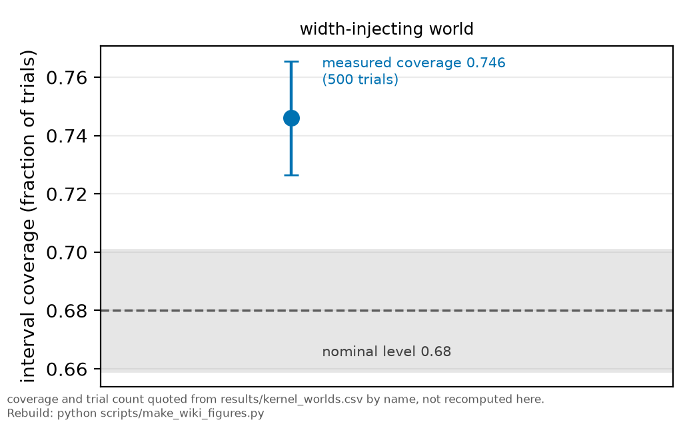
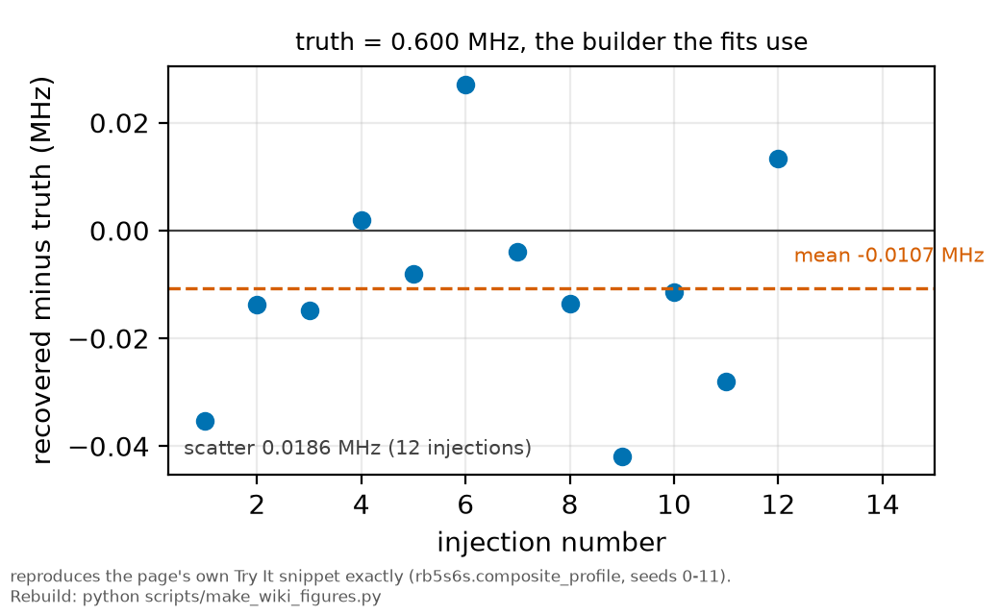

# Injection-recovery testing

*[wiki index](README.md) · method*

**The question.** Can an analysis recover a truth it was handed in advance,
and what does passing that test actually prove.
**Takes.** A complete analysis pipeline, already built and ready to run
start to finish. No other wiki page is required first.
**Gives.** The bias, coverage and pull diagnostics a recovery test produces,
and the boundary between what a closure test validates and what it cannot.
**Skip if.** You want the general Monte Carlo machinery a recovery test is
built from, not the closure test itself:
[Monte Carlo methods](monte-carlo-methods.md).

> **Unfamiliar with the vocabulary?** [GLOSSARY.md](../GLOSSARY.md)
> defines every term and symbol used anywhere in this repository.

## What it is

An injection-recovery test asks whether an analysis can find an answer it
already knows. Choose true parameter values $\theta_\text{true}$, generate
synthetic data from them with realistic noise, run the entire analysis
unchanged, and compare the estimate $\hat\theta$ with the truth. Repeat many
times.

The test produces three diagnostics. The bias, the mean of
$\hat\theta - \theta_\text{true}$, shows whether the estimator
systematically misses. The coverage, the fraction of trials whose quoted
interval contains the truth, should equal the nominal confidence level and
frequently does not. The pull, the error-normalised residual
$(\hat\theta - \theta_\text{true})/\sigma$, should be standard normal: too
wide means the uncertainties are understated, too narrow means they are
inflated.

The recovery must run the actual analysis to be meaningful, including the
window choices, the weighting, the starting values and any automated cuts.
An injection test on a simplified version of the pipeline validates the
simplification.

## What problem it solves

Every analysis rests on assumptions that its machinery is unbiased and its
error bars are accurate, and injection-recovery testing checks those
assumptions at the cost of computer time. It is also the only practical way
to calibrate a bound, since a bound's value depends on its coverage.

## What it cannot establish

Generating synthetic data from the model and recovering the injected truth
validates the implementation: the estimator is unbiased, the optimiser
converges, the intervals cover, the degeneracies behave, all under the
simulated model. It does not validate the model. Whether the physical
lineshape is the right one, whether a mechanism is missing, whether the real
noise resembles the simulated law, none of these is tested by a closure
test, because the same assumption generated the data and analysed it.

Those questions need different evidence: a nested model comparison that lets
the data reject a component, a noise law that is measured instead of
assumed, and residual audits that look for structure no fitted component
absorbs.

## Where this repository uses it

No fitter is allowed near real data here until it recovers known injected
truths from campaign-like synthetics, stated in
[methods chapter 6 section 4.6](../methods/06_the_statistics.md). The
coverage study for the headline bound is section 4.11 of the same chapter.
Several bugs in this repository's history were caught this way.



*Measured interval coverage against the nominal level, from the width-injecting world of `results/kernel_worlds.csv`.*

The largest application is `results/kernel_worlds.csv`, five worlds at 500
preregistered trials each, which decided whether a fitted laser-kernel width
could be read as a measurement. Three of the five inject a true zero
and ask whether the estimator manufactures a width anyway: from a true zero,
from a quadratic baseline the linear model cannot absorb, and from a transit
kernel of the wrong functional form. None produced a single false positive
in 500. A fourth injects a real width and measures interval coverage at
0.746 against a nominal 0.68, recorded as its own number instead of being
rounded to a pass.

The fifth is the ceiling test below, pointed at the instrument and not the
model: it holds an exact symmetry and checks the profile does not move,
because a grid that manufactures a distinction the physics does not have
produces neither a measurement nor a bound.

The package's worked example,
[`examples/synthetic_recovery.py`](../../examples/synthetic_recovery.py),
is an injection-recovery test on data it generates itself: it states its
assumptions before fitting, builds traces from the public line-shape
builder, fits them with the same function the committed results used, and
reports each parameter's pull against its own fit error instead of
asserting the fit looks reasonable. It runs from a bare clone with no
measured data required.

Injection also serves stress tests: known-shape contaminants injected
into real traces show what an unmodelled mechanism would do to the fitted
parameters, bounding a systematic instead of validating an estimator.

## Ceiling tests

A null result needs the same closure a detection does: inject the
hypothesised signal into synthetic data and show the analysis detects it,
before reading its absence in real data as absence in nature.

A periodogram of comb-tooth residuals returned a null at the mains
frequency. The sampling aliased that frequency onto the detrending's own
freedom, so the instrument could not have responded, as one synthetic
injection would have shown quickly. The same week, a residual-skew trend
was read only after the channel passed its ceiling test, a symmetric truth
under the measured noise law returning zero skew at every power. The
difference between the two outcomes was one injection.

The same skew channel produced a third instance: an injection needed to
check an exclusion as well as a null. Separating shot noise from a
fixed-amplitude systematic turns on the exponent of skew against amplitude,
and a first pass read the exclusion straight off the fit's own covariance,
returning 6.6 sigma. Injecting the excluded hypothesis into the dataset's
own amplitudes and errors and refitting recovered $-1.833 \pm 1.214$ against
an injected $-1.0$, a scatter roughly twenty times the covariance's stated
error, because the amplitude lever carries almost no information about the
exponent out at the excluded hypothesis. A fit covariance describes the
sampling distribution at the fitted value, not at a hypothesis being
excluded, and only an injection at that hypothesis does
([`run_skew_scaling.py`](../../scripts/run_skew_scaling.py)). The exclusion
is $p = 0.011$, not 6.6 sigma.

## What can go wrong

The dominant failure is reporting a closure test as evidence the physics is
right. A green injection test on a wrong model is exactly as green as one
on a right model.

Coverage hides a data-insufficiency failure: estimated from a few dozen
trials it carries a binomial uncertainty of several per cent, so "95 per
cent coverage" from 40 trials is consistent with a good deal less, and the
trial count belongs beside the result.

Two implementation traps. Synthetic noise drawn from the same generator
seed as part of the analysis, or injected traces that reuse the real data's
own fitted values as truth, make the test partly circular, and it passes
more easily than it should. A synthetic that omits a feature the real data
have, an uneven sweep, a baseline slope, an occasional bad trace, tests a
pipeline that never meets those, which is how a validated estimator can
still fail on arrival.

## Try it

Twelve injections of a known width, recovered through the same builder the
fits use. The scatter is the number that matters, not any single recovery.



*Recovered width minus the injected truth across twelve synthetic realisations, from this page's worked example.*

```python
import numpy as np
from scipy.optimize import least_squares
from rb5s6s import composite_profile, transit_fwhm_from_w0

t = transit_fwhm_from_w0(64e-6, 130.0)
grid, p = composite_profile(0.60, 1.40, t)
nu = np.linspace(-15, 15, 1200)
shape = np.interp(nu, grid, p / p.max(), left=0, right=0)

errors = []
for seed in range(12):
    data = shape + 0.01 * np.random.default_rng(seed).standard_normal(nu.size)
    def r(q):
        g, pp = composite_profile(abs(q[1]), abs(q[2]), t)
        return q[0] * np.interp(nu, g, pp / pp.max(), left=0, right=0) - data
    errors.append(abs(least_squares(r, [1.0, 0.60, 1.40]).x[1]) - 0.60)
print(f"{len(errors)} injections, truth 0.600 MHz")
print(f"  mean recovery error {np.mean(errors):+.4f} MHz")
print(f"  scatter             {np.std(errors):.4f} MHz")
```

Every snippet on these pages is executed by `tests/test_wiki_snippets_run.py`,
so one that stops working fails the suite instead of sitting here misleading
a reader.

## Holdout cohort correction

A band-holdout replication reported a clean sweep of 7 of 7 held-out
conditions, drawn from what was called the calibration-sound subset of a
sixteen-condition cohort, at a p-value that would have been decisive. Two
of those conditions were the pilot's own traces, regrouped by peak and
counted again as independent evidence. The tally was replaced the same day
by a count from 11 of 14 fresh conditions, at $p = 0.029$.
[HISTORY.md](../HISTORY.md) records both entries.

The same principle applies here: a check built partly from the material
used to produce the result it checks passes too easily, regardless of
whether the result is sound. Applied to the confirmatory cohort, it would
have flagged the two pilot-derived entries before the 7 of 7 count was
reported.

## Further reading

- S. R. Cook, A. Gelman and D. B. Rubin, "Validation of software for
  Bayesian model-fitting using posterior quantiles", *J. Comput. Graph.
  Stat.* **15**, 675 (2006), the standard reference for checking an
  inference pipeline by injecting known truths.
- [Methods chapter 6](../methods/06_the_statistics.md), sections 4.6 and 4.11,
  for this repository's own closure and coverage studies.
- [`examples/synthetic_recovery.py`](../../examples/synthetic_recovery.py),
  a runnable version of everything on this page.
- [Identifiability](identifiability.md) for the case where recovery fails
  because the parameter was never determined and not because the code is
  wrong.

## See also

- [Monte Carlo methods](monte-carlo-methods.md), the general simulation
  technique a recovery test applies to an estimator's bias and coverage.
- [Preregistration](preregistration.md), which freezes the criterion a
  recovery test is later asked to validate.
- [Identifiability](identifiability.md), for the case where recovery fails
  because a parameter was never determined, not because the code is
  wrong.

---

[← The profile likelihood](profile-likelihood.md) · *Statistical inference, 7 of 8* · [Preregistration →](preregistration.md)
