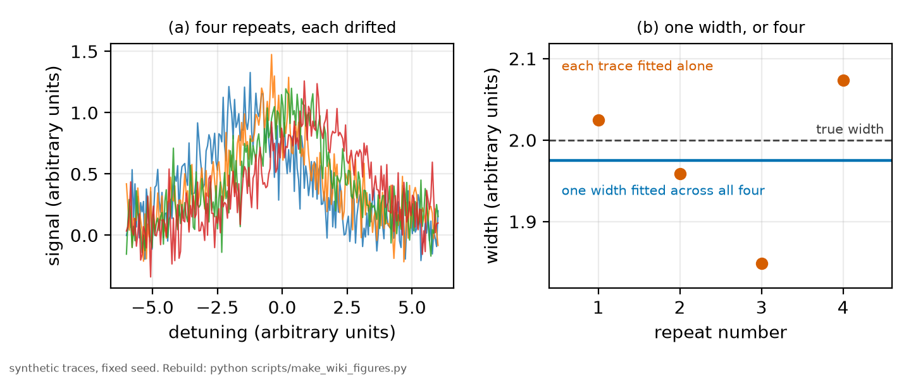

# The joint fit

*[wiki index](README.md) · method*

## What it is

When an experiment records the same physical quantity several times, the
repeats can be fitted one at a time and the answers averaged, or they can be
fitted TOGETHER with the physics shared and the nuisances free. The second is
a joint fit, and the two are not the same operation.

The structure is the useful part. Parameters are divided by what they
describe. A SHARED parameter is one the repeats genuinely have in common,
typically the physics: a linewidth, a cross-section, a shift coefficient. A
PER-TRACE parameter is one that legitimately differs between repeats, such as
an amplitude that follows detector gain, a centre that follows drift, or a
baseline that follows the background at that moment. All of them are fitted
at once, minimising a single objective over the whole dataset.

The gain is that every repeat contributes to the shared parameter with its
full weight, while the things that drifted are absorbed where they belong
instead of inflating the scatter of the quantity of interest. Averaging
independent fits cannot do this, because each independent fit has already
paid for its own nuisances with its own degrees of freedom, and information
about the shared quantity is lost before the averaging starts.



*Four synthetic repeats of one line, each drifted in centre. Fitted
separately the widths scatter. Fitted jointly with one shared width and a
free centre and amplitude per trace, the estimate lands near the truth. Both
estimates in the right panel are real least-squares fits.*

The decision of WHICH level to share at is where the physics enters, and it
is a modelling choice rather than a technical one. Sharing across repeats
taken minutes apart is usually safe. Sharing across conditions recorded hours
apart asserts that the quantity did not change in between, and that assertion
is the substance of the fit.

## What problem it solves

It makes drifting data usable. If an instrument wanders between repeats but
the physics does not, a joint fit puts the wander in the per-trace
parameters and keeps the physics in the shared ones, which is the difference
between discarding a dataset and measuring with it.

## Where this repository uses it

Everywhere the widths are extracted.
[Methods chapter 6 section 4.2](../methods/06_the_statistics.md) sets out the
hierarchy and [`rb5s6s/linefit.py`](../../rb5s6s/linefit.py) implements it.
Each condition has several back-to-back repeats of the same line, and the
2025 laser drifted while the detector gain wandered, so the repeats are
fitted jointly with the line-shape parameters shared and the amplitude,
centre and a tilted baseline free per trace.

The sharing continues upward, and the chapter is explicit that each level is
a physical claim. The laser width is shared per temperature across the four
hyperfine lines, because those four are measured within one dwell and see the
same laser at that moment, which lets its drift across a session be measured
instead of mistaken for collisions. The self-broadening coefficient is shared
per isotope rather than globally, so that the two isotopes can be TESTED
against each other rather than assumed equal. The transit width is shared
globally, since it follows the beam and the temperature law.

## What can go wrong

The characteristic failure of joint fitting is over-sharing, and it is
dangerous precisely because it looks like success. A large shared fit returns
a small formal error, and if the shared quantity actually varied between the
blocks it was shared across, that variation is absorbed by whichever other
parameter can imitate it. The result is a confident number that is
instrument drift wearing the name of physics. Sharing the laser width across
blocks recorded hours apart, in a session where the laser was drifting, is
exactly this failure, and this repository's guard against it is a
model-independent rule fixed before the data were examined.

The second failure is a correlated-data one. A joint fit assumes the repeats
contribute independent information, and repeats that share a systematic do
not. The effective number of independent samples is then smaller than the
number of points, which matters both for the error bars and for any
[information criterion](information-criteria.md) computed from the same fit.

Third, an implementation trap. Adding traces grows the parameter vector, and
a fit with many per-trace nuisances can converge to a local optimum where one
trace's parameters have gone somewhere unphysical while the shared value
compensates. A per-trace residual audit catches this and a global
goodness-of-fit does not, because a joint fit must be good for EVERY trace
and not merely on average.

Finally, sharing does not remove a degeneracy that the whole dataset carries.
If every repeat has the same degenerate pair, sharing improves the precision
of the degenerate combination and leaves the split as poorly determined as
before, which is the subject of [identifiability](identifiability.md).

## Try it

Four drifted repeats of one line, fitted separately and then jointly with a
single shared width. The joint estimate is not the average of the others.

```python
import numpy as np
from scipy.optimize import least_squares

rng = np.random.default_rng(7)
x = np.linspace(-8, 8, 400)
w_true, offs = 2.0, [-1.2, -0.4, 0.5, 1.1]
traces = [1 / (1 + ((x - o) / w_true) ** 2)
          + 0.15 * rng.standard_normal(x.size) for o in offs]
lor = lambda a, c, w: a / (1 + ((x - c) / w) ** 2)

alone = [abs(least_squares(lambda p, y=y: lor(p[0], p[1], abs(p[2])) - y,
                           [1, 0, 1.5]).x[2]) for y in traces]
joint = abs(least_squares(
    lambda p: np.concatenate([lor(p[1 + 2 * i], p[2 + 2 * i], abs(p[0])) - y
                              for i, y in enumerate(traces)]),
    [1.5] + [1.0, 0.0] * len(traces)).x[0])
print("fitted alone: " + ", ".join(f"{v:.3f}" for v in alone))
print(f"fitted jointly: {joint:.3f}   truth: {w_true}")
```

Every snippet on these pages is executed by `tests/test_wiki_snippets_run.py`,
so one that stops working fails the suite rather than sitting here misleading
a reader.

## Further reading

- A. Gelman and J. Hill, *Data Analysis Using Regression and
  Multilevel/Hierarchical Models* (Cambridge, 2006), for the shared-versus-free
  structure in its general form.
- [Methods chapter 6](../methods/06_the_statistics.md) for this repository's
  hierarchy and the leave-one-out checks on it.
- [Identifiability](identifiability.md) for what joint fitting cannot fix.

---

[← Weighted least squares](weighted-least-squares.md) · *Statistical inference, 2 of 7* · [Information criteria →](information-criteria.md)
