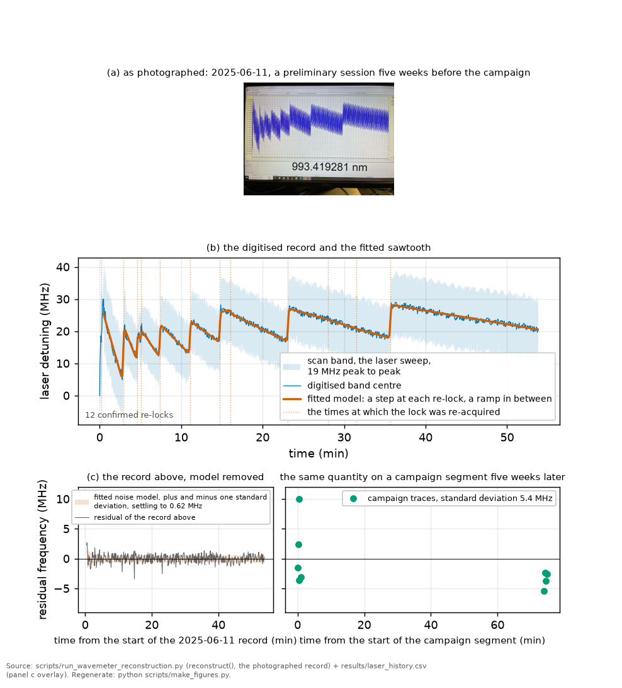

# Laser frequency noise and the linewidth

*[wiki index](README.md) · concept*

**The question.** What does "the laser linewidth" actually mean, and why does
the same laser have different widths in different measurements?
**Takes.** [Shot noise and technical noise](shot-noise-and-technical-noise.md)
for the idea of a noise spectrum. Nothing else.
**Gives.** The map from a frequency-noise spectrum to a lineshape, why the
width depends on the sampled band, and why the kernel a fit assigns the
laser is a physics claim with a bias attached.
**Skip if.** You want the detector's noise instead of the laser's: see
[the noise law](the-noise-law.md). The two are different quantities, easy
to conflate.

> **Unfamiliar with the vocabulary?** [GLOSSARY.md](../GLOSSARY.md)
> defines every term and symbol used anywhere in this repository.

## What it is

A laser's frequency wanders. The complete description is the frequency-noise
spectral density $S_\nu(f)$, its power at each Fourier frequency. Every
statement about "the linewidth" compresses that function into one number,
and which information is lost depends on the noise type.

Two limits organise everything. Fast noise, where $S_\nu$ is flat (white
frequency noise), produces a lorentzian line whose width is set by the noise
level alone. Slow noise, where the power sits at low frequency, produces a
gaussian line: the laser sits at a slowly moving frequency and the line is
the histogram of where it sat. Real lasers sit between the two, and the
useful boundary is the beta-separation line: noise at Fourier frequencies
where $S_\nu(f) \gt 8\ln 2\ f/\pi^2$ contributes Gaussian width, and noise
below that threshold contributes wings.

The Gaussian part depends on how long the measurement looks: an observation
of duration $T$ samples the noise from roughly $1/T$ upward, so lengthening
it admits more slow noise and widens the measured line. A linewidth quoted
without its observation time is not a full specification.

## What problem it solves

A lineshape fit gives the laser a kernel, a physics claim about $S_\nu$,
not a convenience. A gaussian kernel suits slow noise. If the truth is
fast, the fit absorbs the real Lorentzian laser contribution into whatever
other Lorentzian it holds, typically the collisional width: a bias on a
physical coefficient, not an inflated error bar. A lorentzian kernel has
the mirror problem.

The same trap appears in instrument form: an external linewidth measurement
is only usable if its band matches the spectroscopy's. A scanning cavity
watching the laser for seconds samples down to sub-hertz frequencies, while
a line crossed in forty milliseconds samples nothing below twenty hertz.
Under low-frequency-heavy noise the two report different, correct widths
for the same laser, and transplanting one into the other's band is a bias
no averaging removes. The transportable object is $S_\nu(f)$ itself, never
a single width.

```python
import numpy as np

# The same laser at three observation times, under 1/f frequency noise.
# S_nu = h1/f, and the Gaussian FWHM is sqrt(8 ln2 * integral over the band).
h1 = 4.9e10                      # Hz^2, an illustrative flicker coefficient
f_high = 1.5e6                   # Hz, the fast cutoff (inverse transit time)
LN2_8 = 8 * np.log(2)
for T_obs in (4.1e-3, 41e-3, 0.41):
    A = h1 * np.log(f_high * T_obs)          # band integral, 1/T to f_high
    fwhm = np.sqrt(LN2_8 * A) / 1e6
    print(f"observed for {T_obs*1e3:6.1f} ms -> Gaussian FWHM {fwhm:.2f} MHz")
print("one laser, three linewidths, each correct in its own band")
```

## Where this repository uses it

The record fits a Gaussian laser kernel, stated plainly as an assumption
([CLAIMS.md](../CLAIMS.md) section 2). The lineshape data cannot settle the
kernel: M8's model-form comparison puts a Gaussian against a cusped
exponential at $\Delta\text{BIC}$ between -0.1 and +3.7, indistinguishable
at this record's own gate.


*The four kernels this campaign's fit distinguishes: natural, collisional,
laser and transit, each with its own width and shape on the same detuning
axis.*

$S_\nu$ is measured on three rungs, none of which is the rung that broadens
the line. M22's digitised wavemeter record puts 0.62 MHz rms of unmodelled
laser motion below 0.5 Hz, once re-lock kicks and scan ramps are removed.
The comb clock bounds the excursion at 7 Hz below 28 kHz. The width channel
integrates from 24 Hz up, where the only handle is the fitted width,
degenerate with the transit width through the beam waist. Read together the
three rungs say the spectrum falls steeply through the decade below the
width band, which is what a drift-and-kick-dominated laser looks like, and
they leave the width band itself measured by nothing. The measured noise
law of M1 is the detection noise on the photodiode voltage, a different
quantity again.



*The digitised wavemeter record behind the 0.62 MHz rms bound: the
photographed sweep, its fitted sawtooth, and the residual once the drift
model is removed.*

One direct in-situ statement exists, from the comb read as a clock
([the wavemeter page](the-wavemeter-and-the-frequency-axis.md)): the
non-repeating excursion is below 28.3 kHz on the transition axis at 0.15 s
averaging. That bound excludes the low-frequency-heavy spectra by large
factors, seventeen for flicker and eighty for a random walk, weighing
against the Gaussian kernel's justification and ruling out flicker noise as
the source of the scanned linewidth here. The measurement that would
settle the question, the frequency-noise spectrum from the lock's own error
signal, has not been made and costs no cell time.

## Finding a narrow line with the flank slope

Mains hum is a narrow line at a known frequency, best sought by
demodulation, and the lineshape supplies its own demodulator: on a flank,
frequency wobble times the flank slope becomes voltage wobble at the same
frequency, so laser FM appears with opposite sign on the two flanks while
electronic pickup and intensity noise share one sign. That sign flip is the
discriminator, needs no comb or extra hardware, and for a deep line beats a
tooth-position clock by an order of magnitude.

## What can go wrong

**Quoting a linewidth without its band.** The number is not portable. Carry
the observation time, or better, $S_\nu$.

**Reading a converged fit as a validated kernel.** A Voigt fit converges on
a line whose Lorentzian part is mislabelled, and the misfit lands in the
coefficient sharing that shape.

**Estimating slow noise with a statistic that has no limit.** Under $1/f$
noise the variance of a record grows with the record, so the raw scatter of
line centres saturates at a fixed fractional spread however long you
measure: a false convergence plateau. The [Allan deviation](allan-deviation.md)
at fixed averaging time converges as $1/\sqrt{N}$.

**Trusting an instrument's noise floor instead of its band.** A measurement
can be far more precise than the width it reports and still report the
wrong width: a band mismatch is a systematic, not a noise.

## The three separate questions

Measured 2026-08-21, the line excludes a purely Lorentzian laser
contribution at 26 of the 32 canonical conditions above three sigma
([the Voigt profile](voigt-profile.md)). That result and the tooth-scatter
evidence above answer different questions. The lineshape asks which kernel
family fits, answered at one end-member: not a pure Lorentzian. An
independent-linewidth measurement asks how much laser broadening there is,
the identifying quantity under the intercept decomposition, and it is
unmeasured. The comb asks which noise process produces it, and reaching a
kernel from a noise spectrum needs assumptions about stationarity,
observation time and scan rate not validated here.

The two findings are compatible: the Voigt exclusion rules out one
endpoint, a purely Lorentzian laser, and the comb evidence argues against
the other, a purely Gaussian one, leaving the answer between them.

## The laser-equivalent width, measured

Later on 2026-08-21 that width was measured: freeing a Lorentzian-equivalent
component alongside the Gaussian one is preferred at every peak by a nested
likelihood ratio with one parameter on its boundary, and the inverse-variance
mean across peaks is $\Gamma_{L,\text{equiv}} = 0.398$ MHz on the transition
axis (`results/kernel_k3.csv`). The four per-peak values run from 0.315 to
0.449 MHz, and a common scalar is neither rejected nor established, at
$p = 0.097$: an aggregate over four spectral conditions, not a measured
constant.

It is not identifiable at one condition: a Lorentzian laser width and the
collisional width add exactly, so only their sum can be measured there,
and a well-determined split at a single condition is a numerical artefact,
not physics. Density is the lever that separates them, since the
collisional width scales with $N(T)$ and a laser width does not, so the
width above is a property of the whole temperature ladder, not any single
point. It also dominates the coefficient it perturbs: freeing the kernel
moves $\beta_\text{self}$ by 42 to 66 per cent, with a kernel-representation
sensitivity, within the family tested, of 3.24 times the statistical
error, so more repetitions of the current construction do not improve
$\beta_\text{self}$. That factor is a sensitivity within the tested
family, not an uncertainty on the coefficient: the family's own adequacy
is a separate question with its own instrument
([identifiability](identifiability.md)).

Which noise process produces the width is the third question above,
unanswered by this measurement: the transfer from a noise spectrum to a
kernel remains unvalidated, so nothing yet licenses calling this component
the laser.

## The band a scanned width integrates

A free-running laser's Lorentzian wings come from noise at Fourier
frequencies of order the linewidth, but these lines are scanned, so the
observed width integrates noise over the scan's own timescale: from
one over the crossing time up to the per-point sampling rate, 24 Hz to
1.5 MHz for the campaign's science blocks. That band composes across
blocks run at different rates, since the noise spectrum is a fixed
property of the laser, not of any one block: a block at ten times the
campaign rate has its tooth clock sampling at 68 Hz, inside the band the
ordinary-rate blocks integrate, and so measures in situ part of the noise
that broadened the slower blocks' lines
([plan chapter 7](../plan/07_acquisition-settings.md)).

The committed tooth-scatter bound, taken at the campaign rate, is a
different measurement: its clock averages at 6.8 Hz, below the scanned
widths' band, and permits a Lorentzian width some 1800 times the one
measured. It bounds the slow excursion it was built for, not the faster
block's kernel.

## Further reading

Di Domenico, Schilt and Thomann, "Simple approach to the relation between
laser frequency noise and laser line shape" (Applied Optics 49, 4801, 2010),
is the beta-separation-line paper. Any frequency-metrology text carries the
Allan-variance route from $S_\nu$ to a width and back.

## See also

[The noise law](the-noise-law.md), the detector's noise, which this page is
not · [Allan deviation](allan-deviation.md), the statistic that survives
$1/f$ · [The wavemeter and the frequency axis](the-wavemeter-and-the-frequency-axis.md),
where the comb-clock bound lives · [Shot noise and technical noise](shot-noise-and-technical-noise.md),
the same band-thinking on the detection side · [Identifiability](identifiability.md),
what the kernel choice does to the width budget · [The Voigt profile](voigt-profile.md),
the convolution the kernel enters

---

[← The wavemeter and the frequency axis](the-wavemeter-and-the-frequency-axis.md) · *Driving, modulating and detecting, 4 of 8* · [Sweep rate and detection lag →](sweep-rate-and-detection-lag.md)
