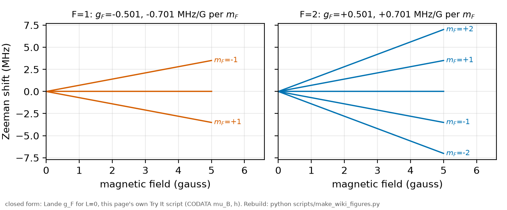
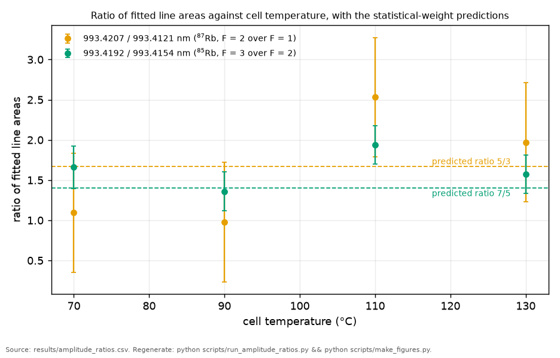

# Magnetic sublevels

*[wiki index](README.md) · concept*

**The question.** What the $2F+1$ magnetic sublevels of a level are, and
when averaging over them versus resolving one individually changes what a
measurement reports.
**Takes.** The $F$ levels [Hyperfine structure](hyperfine-structure.md)
builds, nothing else assumed beyond that.
**Gives.** The Zeeman splitting per sublevel and the scalar, vector and
tensor decomposition of the light shift across them.
**Skip if.** the reader wants the $F$ levels themselves instead of the
$m_F$ structure inside each one, in which case
[Hyperfine structure](hyperfine-structure.md) is the right page.

> **Unfamiliar with the vocabulary?** [GLOSSARY.md](../GLOSSARY.md)
> defines every term and symbol used anywhere in this repository.

## What it is

A level of total angular momentum $F$ consists of $2F+1$ magnetic
sublevels, labelled by the projection $m_F$, running in integer steps
from $-F$ to $F$. In zero field every sublevel carries the same energy. A magnetic field
breaks that symmetry: coupling to the field through the level's magnetic
moment, each sublevel shifts by an amount proportional to $m_F$, to leading
order $\Delta E(m_F) = g_F \mu_B B m_F$, with $\mu_B$ the Bohr magneton and
$g_F$ the level's own g-factor, the Zeeman effect. The adjacent-sublevel
spacing $g_F \mu_B B$ is set entirely by $g_F$, which is built from how the
electronic and nuclear angular momenta compose to make $F$, the subject of
[hyperfine structure](hyperfine-structure.md).



*The magnetic sublevels of a hyperfine level: degenerate at zero field, evenly spaced above it.*

In an unpolarised sample, with no field defining a preferred direction and
no process favouring one sublevel over another, the $2F+1$ sublevels sit
at equal population, weighted only by their own degeneracy. Whatever a
bulk measurement reads off, a rate, a shift, a line strength, is an
average over the whole manifold. Give the sample a defined quantisation
axis and a way to prepare or select a single $m_F$, optical pumping or
state-selective detection, and the average collapses into one number that
belongs to that sublevel alone.

The light shift is where this distinction stops being bookkeeping. The
AC-Stark shift of a level under off-resonant light separates into three
pieces by tensor rank. The scalar part has no $m_F$ dependence and no
sensitivity to polarisation, so it survives any averaging. The vector part
depends linearly on $m_F$ and on the light's degree of circular
polarisation, like a fictitious magnetic field along the propagation
direction, and vanishes for purely linear polarisation. The tensor part
depends quadratically on $m_F$, proportional to $3m_F^2-F(F+1)$, and needs
the level's own angular momentum to be at least one: a rank-2 operator has
no support on an angular momentum of $1/2$, so it is absent for any such
level regardless of polarisation. In an unpolarised sample the vector and
tensor pieces average to zero and only the scalar part survives. In a
trapped, field-defined, prepared sample they become quantities in their
own right.

## What problem it solves

It draws the line between when "the $F$ level" is a sufficient description
and when the finer structure inside it has to be tracked. It also explains
why a light shift that is one unavoidable number in an unprepared sample
turns into several independently informative quantities in a prepared one:
the scalar part is a background to subtract, the vector part reports on the
light's circular character, and the tensor part reports on the level's own
angular structure.

## Where this repository uses it

This repository's two levels, $5S_{1/2}$ and $6S_{1/2}$, are both $J=1/2$,
so their tensor light shift does not exist to find, the same triangle rule
stated for the magic-wavelength crossings in
[BIG_PICTURE, why this line](../big_picture/01_why-this-line.md). The
vector part is not forbidden, only switched off by the apparatus:
[the optics protocol](../plan/03_optics-protocol.md) fixes the precision
path at one shared linear polarisation axis, under which the line is
$m_F$-blind by construction, with the vector channel available only as an
optional circular diagnostic off that path. Between the two,
[`rb5s6s/polarizability.py`](../../rb5s6s/polarizability.py) computes a
single scalar polarizability for each level (`alpha_5s`, `alpha_6s`,
`delta_alpha`), the whole content a $J=1/2$ pair under linear light has to
give.



*Measured line-area ratios for the four hyperfine components against the degeneracy-only prediction (5/3 and 7/5), across the campaign's temperature range.*

The degeneracy weighting above predicts the four measured line strengths
directly: [`rb5s6s/amplitudes.py`](../../rb5s6s/amplitudes.py) derives
each peak's relative area from abundance times $(2F+1)$ over the isotope's
total ground-sublevel count, 8 for $^{87}\text{Rb}$ and 12 for
$^{85}\text{Rb}$ (the same $F$ values
[`constants.PEAKS`](../../rb5s6s/constants.py) carries), with no
preference for any one $m_F$ built in.

[Duspayev and Raithel](../lit/duspayev2023.md) trap $^{85}\text{Rb}$ in an
optical lattice and resolve a $J=3/2$ level's magic wavelength splitting
by $m_J$, a tensor effect with nothing analogous available to a $J=1/2$
pair in a warm cell. The residual this record still carries once the
tensor and vector channels are closed off is a shift proportional to
$\Delta g_J$ alone, at the sub-kilohertz-per-gauss level
([the optics protocol](../plan/03_optics-protocol.md)).

## Immunity to a magnetic field

The 5S to 6S line is protected against a laboratory field by two nearly
exact cancellations. With identical linear photons the two-photon
operator only connects $m_F$ to itself, so the nuclear part of $g_F$
cancels between the two S states exactly and the remaining electronic
$g_J$ difference is a core correction of order $10^{-4}$: under 140 Hz of
spread at Earth's 50 uT against a line millions of hertz wide. A smaller,
quadratic Breit-Rabi term separately shifts a hyperfine pair separation by
one to two kHz, which matters only at the coincidence block that reads
the 6S splitting to a few hundred hertz.

The cancellation holds only for $\Delta m_F=0$. A component with
$\Delta m_F=q$ shifts by $q g_F \mu_B B$, independent of $m_F$, so it sits
as a displaced satellite, not a spread: for $q=2$ that is 700 kHz at
50 uT on either rubidium-87 line and 467 kHz on either rubidium-85 line,
13 and 9 per cent of the 5.37 MHz observed width. Two sigma-plus photons
carry two units of angular momentum, but in an S state the electron's
$m_J$ runs over only $-1/2$ and $+1/2$, the electric dipole operator does
not touch the nucleus, and a sigma-plus sigma-plus pair has nowhere to
put its second unit: the matrix element is zero. Retro-reflection does
not help, since propagation reversal is cancelled by helicity reversal
and a counter-propagating pair still carries two units, offered at
amplitude one half by linear light. The matrix element stays zero
regardless, because the rank-2 reduced element between two $J=1/2$ states
vanishes: the two-photon operator carries ranks 0, 1 and 2, and rank 2
needs $J \ge 1$.

Ellipticity shifts levels through the vector light shift, computed in
`rb5s6s/polarisation.py`, and does not open a transition channel. The
differential vector polarizability is 1.7 per cent of the differential
scalar one at the drive wavelength. `results/stark_joint.csv` gives the
calibrated prediction `S0_225mW_pred` as 0.348 MHz and the joint
three-session bound `S0_225mW_ub95` as 0.258 MHz. Sized against the
larger, the spread is 6.0 kHz at the campaign's highest power for fully
circular light, or 4.5 kHz against the bound, small against
per-condition width errors near 30 kHz, and it cancels in the mean
unless optical pumping biases the population, a concern for a
fixed-lock campaign more than for this one.

Any broadening scaling as $g_F^2$, from any mechanism, appears 2.25
times larger on the rubidium-87 lines. The committed widths put that
difference at $+4 \pm 18$ kHz, consistent with zero
(`scripts/run_polarisation_bound.py`).

## The two-atom dipole-dipole channel

The rank-2 closure above is a single-atom result and fails for two atoms.
A pair of ground-state atoms has four sublevel products and can accept two
units of angular momentum by taking one unit each, which the single-atom
triangle rule says nothing about.
[`rb5s6s/cooperative.py`](../../rb5s6s/cooperative.py) sizes the channel.

Energy conservation is exact: at the two-photon energy the pair has one
resonant configuration, one atom in 6S beside one in the ground state,
with every alternative in the committed level table millions of line
widths away, so the process can only redistribute sublevels inside the
existing resonance, not create a new line. Atom A absorbs one photon and
reaches a virtual state near 5P, and atom B independently absorbs the
other photon into the same virtual state. The pair, in
$|5P,5P\rangle$, sits 5025 reciprocal centimetres above where the
two-photon energy belongs, and the dipole-dipole interaction between the
atoms carries it to $|6S,5S\rangle$ in one step: atom A keeps all the
energy and rises to 6S, atom B keeps none and falls back to the ground
state, and each keeps its own unit of angular momentum. Each atom's own
change is one unit, all a $J=1/2$ atom can take, and the pair's combined
change is two units, what the light delivered.

Both fine-structure legs are carried. $5P_{3/2}$ is E1 allowed at every
vertex, its reduced matrix elements are the larger pair, and its energy
denominators are not much worse, so carrying all four leg combinations
multiplies the amplitude by 2.82 and the rate by 7.97.

The channel is small. Its rate, relative to the ordinary line, is linear
in density and reaches $1.3\times10^{-9}$ at 130 °C
(`results/cooperative_channel.csv`), about eight times the single-atom
hyperfine-mixing leakage computed the same way in
`rb5s6s/polarisation.py`. Both sit far below the tightest bound this
record carries on an out-of-window feature, `f_wing_red_mean` in
`results/wing_check.csv` at 0.0009 of peak, six orders below it for the
pair route and seven for the single-atom one. Laser power leaves the
ratio unchanged, since the channel and the line both scale as intensity
squared, and temperature is the only lever on its size. A field moves the
channel's position, at $2 g_F \mu_B B$ for a matched pair, and leaves its
rate alone, so it cannot be told apart from $\beta_\text{self}$ by a
density sweep, where both scale linearly. Only a field sweep at fixed
density could separate them, since the channel's width contribution
scales as $B^2$ and the collisional term does not.

## What can go wrong

The first failure is a model one: reading a population-averaged
measurement as if it described one sublevel, or the reverse, concluding a
sublevel-dependent effect is absent because an unresolved measurement
washed it out. Averaging over $2F+1$ sublevels describes what the
measurement did, not what any one sublevel would show.

The second is an apparatus limitation: without an applied field of known,
stable direction, $m_F$ is not a meaningful label, and a drifting stray
field only adds uncontrolled scatter on top of the degeneracy-weighted
average already there, not a measured vector or tensor shift.

The third is an implementation trap: writing the Lande g-factor formula
with the fine-structure quantum number $J$ where the hyperfine one $F$
belongs, or the reverse. The two formulas share the same shape and differ
only in which angular momenta enter, so the wrong one returns a plausible
number silently, the same class of slip
[hyperfine structure](hyperfine-structure.md) flags for the
interval-formula multiplier.

The fourth is an experimental limitation: for a pair of $J=1/2$ levels the
tensor channel does not exist, so no trap, field or state preparation
manufactures one, and the magic-wavelength search here uses only the
scalar shift.

## Try it

The $2F+1$ degeneracies and the linear Zeeman splitting per unit field for
the two ground hyperfine levels of one isotope, with the $F$ values read
from this repository's own `PEAKS` table instead of typed from memory.

```python
from rb5s6s.constants import PEAKS, H_PLANCK_JS

# Bohr magneton, CODATA 2018 (a universal constant, not a repository number).
MU_B_J_PER_T = 9.274_010_078_3e-24

# Lande g_J of an L=0 (S-state) level is, to leading order, the free-electron
# spin g-factor: a J=1/2 alkali ground state measures within 0.01% of it, and
# the (much smaller) nuclear contribution is dropped here.
G_J_S_STATE = 2.002_319_304_4


def ground_state_f_values(isotope):
    """The two ground F values this repository's own hyperfine components
    name (PEAKS), read rather than typed from memory."""
    return sorted({p["F"] for p in PEAKS.values() if p["isotope"] == isotope})


def lande_g_f(F, I, J=0.5):
    """Fine-structure-only Lande g_F for a hyperfine level F built from J and I."""
    return G_J_S_STATE * (F * (F + 1) + J * (J + 1) - I * (I + 1)) / (2 * F * (F + 1))


isotope = 87
f_lo, f_hi = ground_state_f_values(isotope)
nuclear_spin_i = f_hi - 0.5  # F_max = I + J, J = 1/2 for an S1/2 level

print(f"{isotope}Rb 5S1/2 ground state, I = {nuclear_spin_i:.1f}, "
      f"from the F values PEAKS already names:")
for F in (f_lo, f_hi):
    degeneracy = int(2 * F + 1)
    g_f = lande_g_f(F, nuclear_spin_i)
    hz_per_tesla = g_f * MU_B_J_PER_T / H_PLANCK_JS
    mhz_per_gauss = hz_per_tesla * 1e-4 / 1e6
    print(f"  F={F}: {degeneracy} sublevels (m_F = {-F:g}..{F:g}), "
          f"g_F = {g_f:+.3f}, Zeeman splitting {mhz_per_gauss:+.4f} MHz/G per unit m_F")
```

Every snippet on these pages runs inside `tests/test_wiki_snippets_run.py`,
so one that stops working fails the suite instead of misleading a reader
here.

## Further reading

- [`../lit/steck_rb.md`](../lit/steck_rb.md), the Rb atomic-structure
  reference for the Lande g-factor and Zeeman formulas above.
- C. Cohen-Tannoudji, J. Dupont-Roc and G. Grynberg, *Atom-Photon
  Interactions: Basic Processes and Applications* (Wiley, 1998), the
  standard treatment of scalar, vector and tensor light shifts.
- [Duspayev and Raithel](../lit/duspayev2023.md), the trapped measurement
  whose tensor polarizability splits a magic wavelength by $m_J$.
- [Hyperfine structure](hyperfine-structure.md), for the $F$ levels a
  field splits further.
- [The AC-Stark shift](ac-stark-shift.md), for the scalar shift a warm
  cell measures.

## See also

- [Hyperfine structure](hyperfine-structure.md), the $F$ levels this
  page's sublevels sit inside.
- [Hyperfine populations and branching](hyperfine-populations-and-branching.md),
  for how atoms distribute among the sublevels.
- [Selection rules](selection-rules.md), for the rule that fixes which
  $J$ combines with nuclear spin to build each $F$.

---

[← Hyperfine structure](hyperfine-structure.md) · *Atomic structure and selection rules, 4 of 7* · [Hyperfine populations and branching →](hyperfine-populations-and-branching.md)
