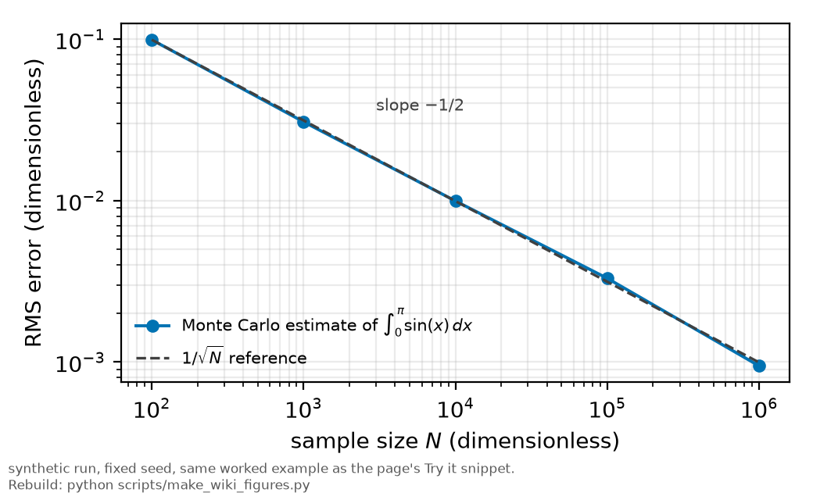

# Monte Carlo methods

*[wiki index](README.md) · method*

**The question.** What does it mean to compute a number by simulation
instead of by a formula, and how fast does that number sharpen as more
samples are drawn.
**Takes.** A basic sense of sampling and averaging. No other wiki page is
required first.
**Gives.** The $1/\sqrt{N}$ convergence law, the distinction between
simulating from a model and resampling data already in hand, and the seed
discipline that makes a simulated result checkable.
**Skip if.** You want to resample data already collected instead of
simulating from a fitted model. That is [resampling](resampling.md).

> **Unfamiliar with the vocabulary?** [GLOSSARY.md](../GLOSSARY.md)
> defines every term and symbol used anywhere in this repository.

## What it is

A Monte Carlo method computes a quantity by simulation instead of by a formula: draw random samples according to some rule, evaluate a function of interest on each one, and average. It is useful where the direct computation is hard, an integral with no closed form, or a distribution with no known shape. Sample enough times from the process that generates the number, and the average of the samples converges to the number itself.



*Root-mean-square error of the worked Monte Carlo integral against sample count, tracking the 1/sqrt(N) law stated in the text.*

How fast it converges matters everywhere the method is used. For an estimate built by averaging $N$ independent draws, the standard error of that average falls as $\sigma/\sqrt{N}$, with $\sigma$ the standard deviation of the single-sample quantity being averaged. Nothing about that rate depends on what is being estimated, only on how many draws went into it. Cutting the error by a factor of ten costs a factor of a hundred in samples, since $\sqrt{100}=10$.

The same $1/\sqrt{N}$ rate holds regardless of the sampled space's dimension, unlike a grid, whose point count multiplies with every added dimension until it becomes impractical past a handful of them. A Monte Carlo estimate needs the same $N$ for the same precision at any dimension, because the draws only have to average, not fill a grid, though the rate starts out slower than a good quadrature rule in one dimension.

Two uses of the idea matter for the methods on this wiki. The parametric use samples from an assumed model, drawing many synthetic datasets from a fitted line or a physical model of the apparatus, at the design's own points and noise law, to see what an estimator does with each one. Nothing about the real data enters except through the model already fitted to it. The other use resamples the observed data instead of a fitted model, the bootstrap and jackknife covered on [resampling](resampling.md). A parametric simulation is only as good as the model it draws from, while a resampling of the data is only as good as the sample's own representativeness of the population.

A pseudo-random generator run from an unrecorded starting state produces a different answer on every run, close to the last one but never identical, so a result that shifts on rerun cannot be checked by anyone. The generator's seed is recorded beside whatever the simulation reports, so a disagreement on a rerun points at a real change in the procedure instead of sampling noise.

Variance reduction changes how the samples are drawn so a given $N$ yields a smaller error than the plain $\sigma/\sqrt{N}$ estimate promises. The most useful case here is common random numbers: when comparing two or more configurations instead of estimating one alone, drive every configuration from the same underlying draws instead of independent ones, so whatever is shared between them cancels out of the difference, leaving the comparison to show only what actually changes.

## What problem it solves

An integral, a null distribution, or an estimator's bias and coverage sometimes has no closed form, or only one under an assumption nobody wants to make. Monte Carlo replaces the derivation with a direct simulation of the process, exchanging an unchecked approximation for the cost of computer time, and replaces a threshold read off an asymptotic table with one built from the actual design and sample size.

## Where this repository uses it

[`rb5s6s/transit_mc.py`](../../rb5s6s/transit_mc.py) computes the transit-broadening lineshape by simulation, an ensemble of atomic trajectories sampled across impact parameter, transverse speed, and beam position, instead of the closed-form approximation on [transit-time broadening](transit-time-broadening.md). [`rb5s6s/config.py`](../../rb5s6s/config.py) carries the seed constant these modules draw on by default, so the ensemble is reproducible run to run.


*Predicted transit-broadening FWHM against beam waist from the trajectory Monte Carlo in transit_mc.py, the parametric simulation this page names.*

[Influence diagnostics](influence-diagnostics.md) needed a null distribution for the largest Cook's distance across the four-point width-against-density fits behind the collisional-broadening bound, one construction per peak, each with only two free parameters left after fitting four points. Instead of a cutoff from a textbook rule built for a larger sample, the audit simulated synthetic datasets from each fitted line at that peak's own design points and measured errors, refit each one, and recorded the resulting maximum Cook's distance. [Resampling](resampling.md) records that construction and what it found.

The coverage study behind the headline bound turns the same idea on an estimator instead of a lineshape: many synthetic datasets drawn from a known truth, recovered through the analysis unchanged, to measure whether a quoted interval covers at the rate it claims. [Injection-recovery testing](injection-recovery.md) records that construction and what it found.

None of these simulations runs cold. [Preregistration](preregistration.md) fixes, before any of them runs, which quantity the simulation is meant to score and at what threshold, so a Monte Carlo built after the real answer is visible cannot be tuned to agree with it.

## What can go wrong

A Monte Carlo estimate carries its own sampling error on top of whatever it estimates, and the two are easy to run together. A rate or bound quoted without the number of trials beside it lets a reader mistake the simulation's noise floor for a real feature. The number of samples belongs beside any figure a simulation produces, for the same reason a measurement's error bar belongs beside it.

A parametric simulation is only as correct as the model it draws from. If the assumed noise law is wrong, or the model omits a mechanism the real process carries, every simulated dataset inherits the same gap, and the resulting null distribution or coverage figure is wrong in the same direction, with no internal sign of it. [Injection-recovery testing](injection-recovery.md) states the general form: closure under the model only tests the implementation.

A generator whose state is shared between the simulation and the code it tests makes the two only partly independent, so the check passes too easily for reasons unrelated to whether the procedure is sound. The same trap sits in feeding an estimator's own fitted values back into a simulation as ground truth, since recovering numbers the estimator itself produced is not a test of it.

A rare event or a tail probability is the sharpest case of this limit. Estimating a probability near the resolution of $1/N$ needs of order $N$ samples just to see the event occur a handful of times, and more to pin its relative error down, so a plain Monte Carlo undersamples where a tail threshold is being read, unless the sampling is redirected toward the tail.

## Try it

An integral with a known value, estimated by plain Monte Carlo sampling at several sample sizes. At each size several independent replicates are run so the root-mean-square error across replicates, instead of a single lucky or unlucky draw, is what is compared with the $1/\sqrt{N}$ law.

```python
import numpy as np

rng = np.random.default_rng(20260816)
true_value = 2.0  # integral of sin(x) dx from 0 to pi, the known analytic value

print("Monte Carlo estimate of the integral of sin(x) from 0 to pi")
print(f"known value: {true_value:.6f}")
print(f"{'N':>9}  {'replicates':>10}  {'rms error':>10}  {'rms * sqrt(N)':>14}")

sizes = [100, 1_000, 10_000, 100_000, 1_000_000]
budget = 20_000_000  # total draws per row stays bounded, so the run stays fast
prev_rms = None
for n in sizes:
    reps = max(30, min(4000, budget // n))
    x = rng.uniform(0.0, np.pi, size=(reps, n))
    estimate = np.pi * np.mean(np.sin(x), axis=1)
    error = estimate - true_value
    rms = float(np.sqrt(np.mean(error**2)))
    scaled = rms * np.sqrt(n)
    step = f"  decade ratio {prev_rms / rms:.2f}" if prev_rms else ""
    print(f"{n:9d}  {reps:10d}  {rms:10.6f}  {scaled:14.4f}{step}")
    prev_rms = rms
```

Every snippet on these pages is executed by `tests/test_wiki_snippets_run.py`, so one that stops working fails the suite instead of sitting here misleading a reader.

## Design-stage simulation

The simulations above answer what an estimator would do with data that already exists. The same machinery run forward answers what an apparatus that does not exist yet would deliver: [the digital twin](the-digital-twin.md). `rb5s6s/forecast.py` samples traces from a proposed design, fits them back with the production fitter, and reports the achievable uncertainty and the correlations that sampling will not improve.

## Correction record

The transit Monte Carlo's crossing-flux weighting was corrected once, and the fitted beam waist moved twice afterwards before a direct measurement replaced it. [HISTORY.md](../HISTORY.md) carries each figure with its date, and [the beam waist](the-beam-waist.md) carries the live one.

## Further reading

- [Wikipedia: Monte Carlo method](https://en.wikipedia.org/wiki/Monte_Carlo_method), for the general history and its variants.
- N. Metropolis and S. Ulam, "The Monte Carlo Method," *J. Amer. Statist. Assoc.* **44**, 335 (1949), the paper that named the method.
- C. P. Robert and G. Casella, *Monte Carlo Statistical Methods*, 2nd ed. (Springer, 2004), the standard reference for the parametric use.
- A. B. Owen, *Monte Carlo theory, methods and examples* (2013), for common random numbers and other variance-reduction techniques.

## See also

- [Resampling](resampling.md), for simulation built from the data already
  collected instead of from a fitted model.
- [Injection-recovery testing](injection-recovery.md), a parametric Monte
  Carlo run on an estimator's bias and coverage instead of on an integral.
- [Preregistration](preregistration.md), the discipline that fixes what a
  simulated null test or ceiling test may claim before it runs.
- [Grids and discretisation](grids-and-discretisation.md), the alternative
  approach that fails once the sampled space grows past a handful of
  dimensions.

---

[← wiki index](README.md) · *Simulation and computation, 1 of 5* · [The digital twin of an experiment →](the-digital-twin.md)
