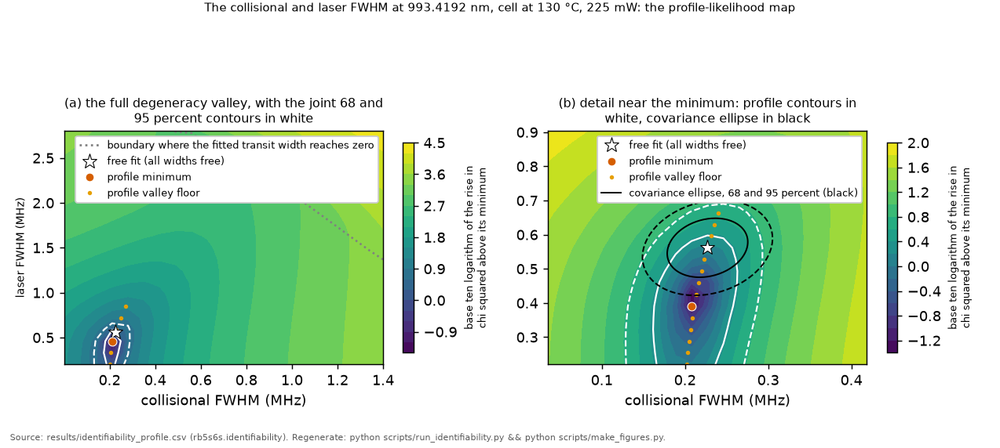
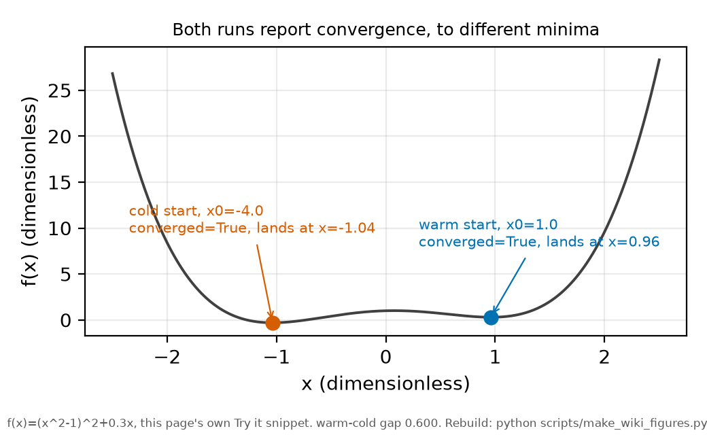

# Optimiser convergence

*[wiki index](README.md) · method*

**The question.** Does a fit's convergence flag mean it found the surface's
true minimum, or only a stationary point nearby.
**Takes.** A parameter fit and its optimiser's stopping report. No prior
wiki page is required.
**Gives.** Three defences against a trapped scan: starting from several
places, chaining in both directions, and a refitted audit, and why only
the audit tests the result itself.
**Skip if.** The reader wants the correlated-parameter valleys a fit gets
trapped inside, ahead of the trapping mechanism itself. That is
[identifiability](identifiability.md).

> **Unfamiliar with the vocabulary?** [GLOSSARY.md](../GLOSSARY.md)
> defines every term and symbol used anywhere in this repository.

## What it is

A fit reports success once its optimiser's stopping rule is satisfied: the
step size or gradient fell below a tolerance, or the objective stopped
improving. That rule is local, asking only whether the neighbourhood
looks flat enough for another step to help, never whether the point
reached is the surface's actual minimum among however many stationary
points it carries.

The gap is sharpest where parameters are exchanged against each other. A
likelihood surface with correlated parameters is rarely a bowl with one
floor: it carries long, shallow valleys where moving one parameter and
compensating with another barely changes the objective. An optimiser
dropped there stops at the nearest stationary point, whether or not a
lower valley exists elsewhere.

Warm starting, seeding a fit from a neighbouring solution, is standard
practice: fast, and usually right, since nearby problems tend to have
nearby solutions. If the first cell of a scan lands in the wrong valley,
every neighbour inherits that seed and reports the same clean convergence
at the same wrong floor: a surface smooth and wrong throughout, from one
accidental decision at the first cell.

Three defences follow. Starting from several places, including one far
from any neighbour's solution, gives the true minimum more than one
chance to be found. Scanning both directions and keeping the better
result at each point turns the first cell into two chains that would have
to fail identically. Refitting a sample from fresh, uncontaminated seeds
and checking that none improves is the only defence that examines the
result itself, not the process that produced it.

## What problem it solves

A converged fit is not automatically a correct one. A smooth run of
results looks like confirmation: nothing jumps, every fit reports
success. That smoothness is exactly what a trapped scan produces, so it
is not evidence the scan is trustworthy. Treating convergence and
correctness as one question removes the one signal that would otherwise
flag it, an isolated fit failing to converge.

## Where this repository uses it

The joint Stark-shift profile in
[`scripts/run_stark_joint.py`](../../scripts/run_stark_joint.py) scans
with a bidirectional, warm-chained construction: a forward chain from a
cold start, a backward chain from the forward chain's far end, and a
chain, for the primary variant, seeded from the wing-robustness variant's
cold-start solution, since that variant reliably locates the true minimum
first. The pointwise minimum across every chain enters the profile, so a
seed can only improve the result.



*The two-width profile-likelihood map this page's warm-started,
bidirectionally-chained scan produces, with the free-fit and
profile-minimum locations marked.*

The two-width profile map behind [identifiability](identifiability.md)
runs its defence per cell. Each cell in
[`rb5s6s/identifiability.py`](../../rb5s6s/identifiability.py) is
warm-started from its neighbour, refit from an independent lineage, and,
at a fixed stride, refit again from a fresh, untouched seed. The largest
improvement any fresh seed finds is committed as `audit_max_gain` in
[`results/identifiability.csv`](../../results/identifiability.csv),
separately for the zoomed grid and the wide grid, and stands as a bound
on how far any warm-started cell could still be sitting from its true
floor.

Both usages sit underneath [the profile likelihood](profile-likelihood.md):
a profile is a chain of fits, one per grid point, and its trustworthiness
reduces to exactly this question.

## What can go wrong

The central failure is a warm-started scan whose first cell fell into
the wrong valley: the resulting surface is smooth, consistent, and wrong
everywhere at once. No single fit's convergence report tells this case
apart from one that found the right valley throughout, because every fit
genuinely did converge, to a real stationary point, by every mechanical
measure the optimiser has.

A second failure is scanning one direction only, so the first point
carries the whole chain uncorrected. Comparing a forward pass against a
backward one turns that single point of failure into two chains that
would have to fail the same way independently, and any disagreement
between them is a direct flag.

A third failure is an audit that never really tested anything: one that
refits nothing, or lands only on cells the warm start already got right,
reports zero improvement for the wrong reason. Multi-start and
bidirectional scanning reduce the chance of trapping but cannot prove a
finished map is free of it.

## Try it

A function with a deep global minimum and a shallower secondary one
nearby: a warm start standing in for a neighbour's seed finds the shallow
minimum, a cold start finds the true one, and both report convergence.

```python
import numpy as np
from scipy.optimize import minimize

def f(x):
    x = x[0]
    return (x ** 2 - 1.0) ** 2 + 0.3 * x

warm = minimize(f, [1.0], method="BFGS")
cold = minimize(f, [-4.0], method="BFGS")

print(f"warm start from x0=1.0: x={warm.x[0]:+.4f} f={warm.fun:+.4f} converged={warm.success}")
print(f"cold start from x0=-4.0: x={cold.x[0]:+.4f} f={cold.fun:+.4f} converged={cold.success}")
gap = warm.fun - cold.fun
print(f"both report convergence, the warm start is worse by {gap:.4f}")
```



*The function from the snippet above: two BFGS runs, two reported
convergences, two different minima.*

Every snippet on these pages is executed by
`tests/test_wiki_snippets_run.py`, so one that stops working fails the
suite instead of misleading a reader.

## Further reading

- *Numerical Optimization* (Springer, 2nd ed., 2006), the standard
  reference on line search and trust region methods, and on multi-start
  as a defence against local convergence.
- [Identifiability](identifiability.md), the correlated-parameter valleys
  a fit can be trapped inside.
- [The profile likelihood](profile-likelihood.md), the construction this
  question reduces to.

## See also

- [Identifiability](identifiability.md), the valleys a fit can be trapped
  inside.
- [The profile likelihood](profile-likelihood.md), the chain of fits this
  question reduces to.
- [Grids and discretisation](grids-and-discretisation.md), whether the
  grid is resolved finely enough to trust.
- [Compute budgets and failure modes](compute-budgets-and-failure-modes.md),
  the resource cost of the defences here.

---

[← Grids and discretisation](grids-and-discretisation.md) · *Simulation and computation, 4 of 5* · [Compute budgets and failure modes →](compute-budgets-and-failure-modes.md)
