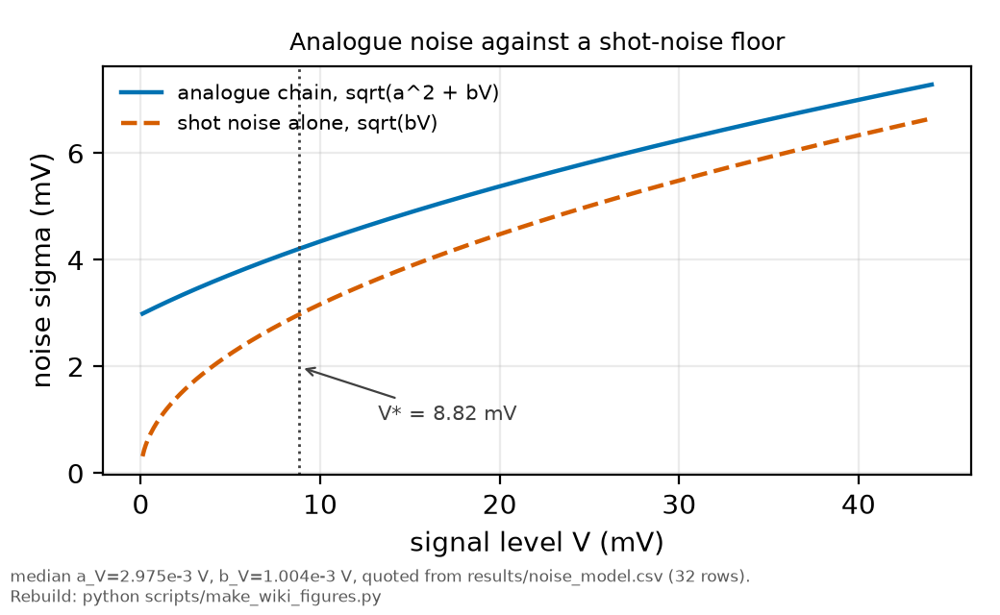

# Photon counting

*[wiki index](README.md) · technique*

**The question.** When does counting individual photons beat an analog
voltage measurement, and when is a counter unavailable regardless of the
crossover.
**Takes.** The additive-plus-multiplicative noise law from
[Weighted least squares](weighted-least-squares.md), restated here instead
of re-derived.
**Gives.** The crossover level computed from measured noise coefficients,
the dead-time pile-up condition, and where this repository's noise law and
planned counter check live.
**Skip if.** The noise law itself, and why it sets a fit's weights, is
wanted instead of the counting decision built on it. See
[Weighted least squares](weighted-least-squares.md).

> **Unfamiliar with the vocabulary?** [GLOSSARY.md](../GLOSSARY.md)
> defines every term and symbol used anywhere in this repository.

## What it is

A detector that turns light into a number can do it two ways. An analog
chain integrates the photocurrent continuously: a photodiode or
photomultiplier feeds a transimpedance amplifier onto a continuously
digitized voltage. A counting chain instead registers each photoelectron
as one discrete event above a fixed threshold and reports a count or a
rate.



*Analogue noise against a pure shot-noise floor, median coefficients from
results/noise_model.csv. Below the marked crossover a counter removes the
dominant term.*

An analog voltage always carries a fixed electronic noise floor, from
Johnson noise, amplifier noise, ADC quantization and dark current, present
even with no light. A counting chain has no such floor: with the light
off it reports zero on average, and the remaining noise is purely the
statistics of the count, growing with the count instead of a fixed
offset.

In the variance language [Weighted least squares](weighted-least-squares.md)
sets out, $\sigma^2(V) = a^2 + bV$ for an analog signal at level $V$, with $a$
the electronic floor and $b$ the shot-noise coefficient, sometimes called a
Fano term. A counting chain carries only the $bV$ part, since it never
inherits $a$. The two variances are equal where $a^2 = bV$, a signal level
fixed by the ratio of the two measured coefficients: below it the floor
dominates and counting wins outright, above it both chains share the same
shot term and the choice stops mattering.

Counting is not available at every rate. Each event needs a minimum
separation from the next, the discriminator's dead time $\tau_d$: two
photons closer than that cannot both register, and for a Poisson process
at rate $R$ the probability of such overlap grows with $R\tau_d$. A
discriminator with $\tau_d$ near a nanosecond keeps that product small out
past hundreds of millions of counts per second, while one near a
microsecond saturates a thousand times sooner: availability depends on the
actual electronics and peak rate.

A threshold discriminator keeps only whether a pulse crossed the line, not
how tall it was, so two photoelectrons close enough to blur into one pulse
register as a single count, while an analog integrator still reports the
extra charge. Below the crossover that lost amplitude usually costs less
than the floor it removes. Above it, the same loss gains nothing.

## Collecting more photons in a scan

At equal total time, a scanned measurement can gain photons three ways,
and they do not deliver equally. Shot-limited means the signal-to-noise
scales as the square root of the signal.

  * **Scan more slowly.** Halving the rate doubles the dwell per bin and
    the photons in it, so the signal-to-noise rises by the square root of
    two.
  * **Take more repeats.** Two traces at the original rate cost the same
    total time and give the same square-root-of-two gain.
  * **Drive harder.** For a one-photon transition the signal is linear in
    intensity, so the signal-to-noise scales as the square root of the
    intensity. For a two-photon transition the signal scales as the square
    of the intensity, so the signal-to-noise scales as the intensity
    itself, and doubling the drive is worth quadrupling the time.

Scanning slowly and repeating are equivalent in photons: the scan rate
only decides how the same time is spread across frequency, so the choice
rests on other grounds. Repeats supply the scatter behind the
per-condition uncertainty, give independent estimates of the line centre,
average over drift a slow scan instead bakes into one trace, and let a
glitch destroy only one short trace instead of the whole record. In
practice, drive harder while the physics allows, add repeats, and set the
scan rate from drift at the slow end and the detection chain's response
time at the fast end.

## What problem it solves

It replaces a habit or an equipment default with a computation. Given a
detection chain's measured noise law and the signal level in use, the
crossover says whether the electronic floor a counter removes is even the
dominant term there, and the dead time says whether a counter can keep up
with the peak rate. Both answers come from the same measured numbers, so
the choice does not rest on which detector happened to be on the bench.

## Where this repository uses it

The committed noise law lives in
[`results/noise_model.csv`](../../results/noise_model.csv), one row per
condition with the fitted $a_V$ and $b_V$ coefficients, produced by
[`rb5s6s/noise.py`](../../rb5s6s/noise.py) as
[Weighted least squares](weighted-least-squares.md) describes.
[`docs/plan/10_the-fixed-lock-instrument.md`](../plan/10_the-fixed-lock-instrument.md),
section 10c.6, inverts that law for the 2025 analog chain: the crossover
sits at a small percentage of a typical line peak, near the Doppler
pedestal and the far line wings, where this record's open questions live.
The same section finds pile-up negligible at a nanosecond dead time for
the implied peak photoelectron rate, so a counter would be available
there. Two day-one measurements in section 10c.8, the single-pulse shape
and peak count rate, and a fresh noise law for the chain on the bench,
check both halves of it instead of carrying the 2025 numbers forward
unmeasured. No counting hardware has been run yet, so this is a planned
instrument, not a result.


*The 2025 analogue detection region: the receiver whose measured noise law
sets the crossover above. No counting hardware has been installed here
yet.*

## What can go wrong

The clearest model failure is treating "below the crossover, counting
wins" as "counting is worth switching to regardless of what it costs,"
which skips the amplitude argument above and can exchange a real
electronic floor for a lost-count problem that is just as large.

Set a discriminator's threshold too low and electronic noise pulses start
crossing it, so the count rate carries its own floor, dark counts and
afterpulses, exactly where the counting law promised none. No single
count rate announces this: a few extra counts per second look like signal
until compared against a light-off measurement.

A noise law belongs to the chain it was measured on, the same caveat
[Weighted least squares](weighted-least-squares.md) states for fit
weights: an old $a_V$ and $b_V$ say nothing about a chain whose tube, gain
or termination has since changed, and reusing them can call the wrong
technology the winner as easily as they can misweight a fit.

Running near or above the dead-time ceiling without correcting for missed
coincident photons produces a rate-dependent shortfall that grows with
signal level much like a real saturation would. An uncorrected pile-up
loss and an actual saturation are easy to mistake for each other unless
the dead time and peak rate are checked first.

A photon count only obeys the shot-noise scaling above where events are
independent, the same condition the dead-time discussion rests on. A
record's own correlation time sets an analogous ceiling, and treating a
correlated record as independent overstates a detectability figure.
[HISTORY.md](../HISTORY.md) records one correction to this repository's
pedestal-detectability estimate that came from exactly that assumption,
and a second, unrelated revision after the record length changed to meet
a separate shape requirement.

## Try it

This computes the signal level where the electronic floor and the shot
term are equal, read from the committed noise law instead of assumed, and
how much quieter counting is than the analog chain a factor of ten below
that level.

```python
import csv
import math

from rb5s6s.noise import sigma_of_v

with open("results/noise_model.csv", newline="") as f:
    rows = list(csv.DictReader(f))

crossover_mv = sorted(float(r["a_V"]) ** 2 / float(r["b_V"]) * 1000.0 for r in rows)
median_mv = crossover_mv[len(crossover_mv) // 2]
print(f"{len(rows)} committed conditions in results/noise_model.csv")
print(f"median crossover level (a^2 = b*V): {median_mv:.2f} mV")
print(f"across all conditions: {crossover_mv[0]:.2f} to {crossover_mv[-1]:.2f} mV")

ratios = []
for r in rows:
    a_v, b_v = float(r["a_V"]), float(r["b_V"])
    v_star = a_v ** 2 / b_v          # the crossover level for this condition
    v = v_star / 10.0                # a factor of ten below it
    law = {"a": a_v, "b": b_v, "c": float(r["c"])}
    analog_sigma = float(sigma_of_v(v, law))   # the shipped law, not a copy
    counting_sigma = math.sqrt(b_v * v)   # counting never carries the a^2 floor
    ratios.append(analog_sigma / counting_sigma)

print(f"analog-to-counting noise ratio at one tenth of the crossover: "
      f"{min(ratios):.3f} to {max(ratios):.3f}")
print(f"(every condition gives the same ratio, sqrt(11) = {math.sqrt(11):.3f}, "
      "because the floor is defined to equal the shot term at the crossover)")
```

Every snippet on these pages is executed by `tests/test_wiki_snippets_run.py`,
so one that stops working fails the suite instead of sitting here misleading
a reader.

## Further reading

- G. F. Knoll, *Radiation Detection and Measurement*, 4th ed. (Wiley, 2010),
  the standard treatment of pulse counting, dead time and the paralyzable and
  nonparalyzable pile-up models used above.
- B. E. A. Saleh and M. C. Teich, *Fundamentals of Photonics*, 2nd ed.
  (Wiley, 2007), the photodetection chapter, for the shot-noise and
  electronic-noise budget of an analog receiver.
- [Weighted least squares](weighted-least-squares.md), the noise law this
  page inverts and the fit the same coefficients ultimately weight.

## See also

- [Weighted least squares](weighted-least-squares.md) for the noise law
  this page inverts and where its coefficients come from.
- [Sweep rate and detection lag](sweep-rate-and-detection-lag.md), the
  previous page, another way a detection chain's own behaviour can be
  mistaken for the atoms'.
- [Designing an acquisition](designing-an-acquisition.md), the next page,
  for how record length and sampling interact with the noise floor here.

---

[← Resolution enhancement and what it costs](resolution-enhancement-and-what-it-costs.md) · *Noise and its management, 6 of 6* · [wiki index →](README.md)
