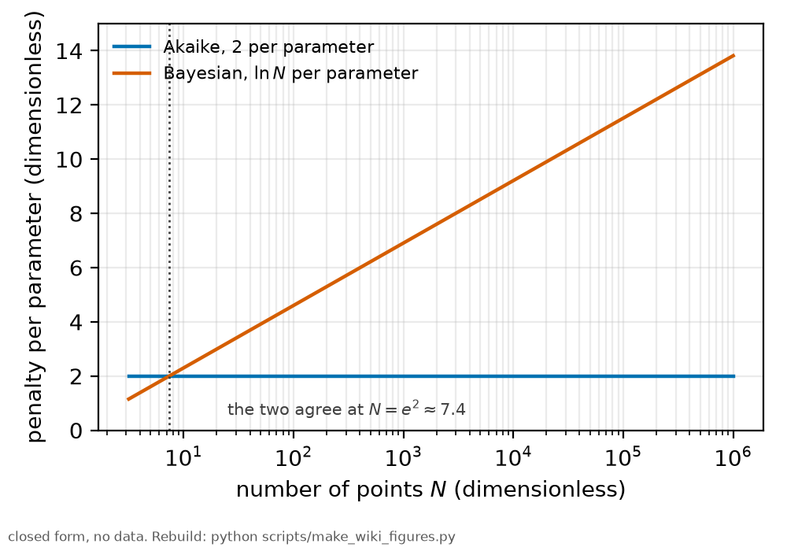
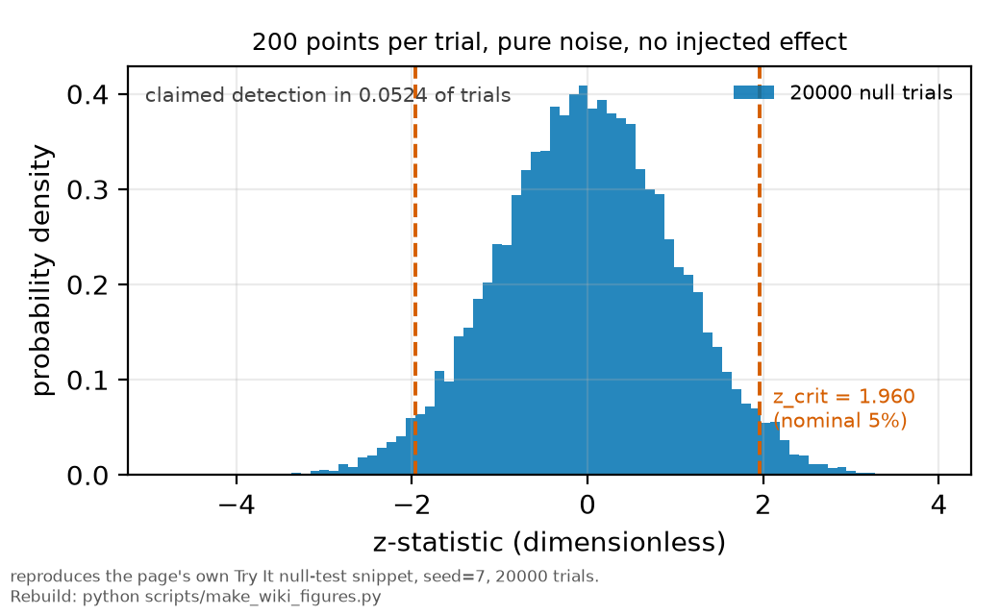

# Preregistration

*[wiki index](README.md) · method*

**The question.** What has to be written down and dated before a result
exists for a criterion to mean anything.
**Takes.** The idea of a statistical threshold and a detection claim. No
other wiki page is required first.
**Gives.** The criterion, census and analysis-chain framework, and the null
test and ceiling test that bracket what a frozen criterion is allowed to
claim.
**Skip if.** You want the test that validates the estimator a criterion is
built on, not the act of freezing the criterion itself. That is
[injection-recovery testing](injection-recovery.md).

> **Unfamiliar with the vocabulary?** [GLOSSARY.md](../GLOSSARY.md)
> defines every term and symbol used anywhere in this repository.

## What it is

Preregistration is a written commitment, made and dated before a result is
available, to the exact quantity a procedure will report, the exclusion
rule that decides which data points enter it, and the analysis that turns
those points into a number. It covers three things: the criterion (what
counts as an effect, a detection, or a preferred model), the census (which
traces, conditions or trials are in scope, and on what grounds one could
be dropped), and the analysis chain (the estimator, the weighting, the
starting values, the stopping rule). The procedure then runs against data
that did not exist when the commitment was made, or against data set
aside and not yet read, and its output is either a confirmation of the
committed prediction or a stated failure of it.

An analysis chosen after the answer is already visible is a selection
among however many procedures could have been tried, whether or not each
was written down. A dataset admits many defensible choices, and each one
moves the answer a little. Freezing the choices first removes that
freedom at the one point it can be exercised, before the numbers are read.

A preregistration is not a promise never to look further. It is a
commitment about what the first look counts as, so that later exploration
is labelled as exploration and does not borrow the standing of a confirmed
result.

## What problem it solves

Preregistration solves the correlation between having many defensible
analysis choices and getting to keep only the ones that flatter the
result. A criterion satisfied by the data at hand cannot be told apart
from one that would be satisfied by almost any data unless the choice was
fixed before the data were read, so a preregistered criterion is scored
once, at a threshold and exclusion rule set while the answer was still
unknown, making the outcome a real test instead of a description of what
was already found.

This repository requires two checks of any procedure it preregisters for
a simulated or synthetic study. A null test runs the procedure many times
on data built to contain no effect, at a stated threshold, and records
how often it claims one anyway: a trustworthy criterion's false-positive
rate matches that threshold, and a rate that is systematically higher
means the criterion is unreliable regardless of what real data later
show.

A ceiling test asks the opposite: whether the procedure recovers a known
answer, usually one injected by hand at a size no reasonable procedure
could miss. Failure here puts the fault in the setup instead of the
physics, and running a criterion on real data before it passes this test
invites reading an experimental limitation as a physical absence.

Together the two tests bracket what a criterion may claim: one that fails
its null test is too loose, since ordinary noise clears it, and one that
fails its ceiling test, or needs a signal far larger than the
experiment's error bars to clear at all, is too tight to be satisfied at
the achievable precision. Either way it decides nothing regardless of the
truth.

## Where this repository uses it

Every dated preregistration in this repository lives under
[`docs/notes/`](../notes/README.md), written and committed before the run
it scores, with the estimator, census and stop conditions fixed while the
outcome was still unknown.



*The per-parameter penalty each criterion in the information-criteria panel
applies. A preregistered model-selection threshold is one vote inside it.*

[`docs/PREREGISTRATION_RESULTS.md`](../PREREGISTRATION_RESULTS.md) is where
each one is scored against what happened, including runs that failed their
own gate outright and not just the ones that went well. A correction
enters as a dated addendum after the original text instead of a silent
edit, and where a number has since been replaced,
[`docs/HISTORY.md`](../HISTORY.md) is the one place licensed to carry the
retired value alongside the current one.

Two dated notes name both tests explicitly.
[`docs/notes/model_selection_prereg.md`](../notes/model_selection_prereg.md)
predicts which of several stated comparisons a change of selection
criterion can and cannot flip, before recomputing anything, and commits
to reporting a null outcome as plainly as a flip.
[`docs/plan/09_the-fixed-lock.md`](../plan/09_the-fixed-lock.md)
preregisters a detection-lag simulation with a named null test and
ceiling test, and
[`docs/big_picture/07_limitations-and-identifiability.md`](../big_picture/07_limitations-and-identifiability.md)
excludes a candidate mechanism for a residual excess by a ceiling test at
many times its predicted size, leaving the excess unexplained.

A frozen criterion still needs the validation
[injection-recovery testing](injection-recovery.md) gives, and a model
comparison scored against a preregistered threshold is one member of the
panel [information criteria](information-criteria.md) describes.

## What can go wrong

The commonest failure is an amendment made after seeing partial results
and folded into the original text instead of added as a dated, visible
correction. This repository's notes are append-only for this reason: a
correction enters as a dated addition after the passage it corrects, and
the original prediction stays exactly as written.

A second failure sits inside the tests themselves: a false-positive rate
measured from a few dozen null-test trials carries a binomial uncertainty
of several percentage points, so a rate missing its nominal threshold by
a little may be sampling noise instead of a loose criterion. A related
trap sits in the test's own machinery, such as a normalisation that does
not actually zero the tested quantity, meaning the check does not measure
what it claims. The ceiling test carries the same trap in reverse, when a
"known regime" is contaminated by an effect the test did not account for
and the failure is attributed to the procedure instead of the regime.

Third, a criterion can pass every check above and still be the wrong one
to have frozen, because the census it was written against does not match
the data that arrive. When an exclusion rule fixed before a session meets
fewer or different points than planned, the correct response is to state
that plainly and score the criterion as attempted, not to quietly relax
the rule to fit what came back.

## Try it

A detection rule with a stated five per cent threshold, run on data
engineered to contain nothing. A trustworthy rule's false-positive rate
should land on that threshold regardless of how the "nothing" is drawn.



*Twenty thousand trials of pure noise. The claimed detection rate lands on
the five percent line the criterion was built to test.*

```python
import numpy as np
from scipy.stats import norm

rng = np.random.default_rng(7)
n_points, n_trials, alpha = 200, 20000, 0.05
z_crit = norm.ppf(1 - alpha / 2)

noise = rng.standard_normal((n_trials, n_points))
z = noise.mean(axis=1) / (noise.std(axis=1, ddof=1) / np.sqrt(n_points))
claims = np.abs(z) > z_crit
rate = claims.mean()

print(f"threshold set for a nominal {alpha:.3f} false-positive rate")
print(f"{n_trials} trials of pure noise, no injected effect, {n_points} points each")
print(f"claimed a detection in {rate:.4f} of trials")
print(f"expected under the null: {alpha:.4f}")
```

Every snippet on these pages is executed by `tests/test_wiki_snippets_run.py`,
so one that stops working fails the suite instead of sitting here
misleading a reader.

## Further reading

- B. A. Nosek et al., "The preregistration revolution", *PNAS* **115**,
  2600 (2018), the canonical statement of the practice this page applies.
- [Wikipedia: Preregistration (science)](https://en.wikipedia.org/wiki/Preregistration_(science)),
  for the general history and the distinction between a preregistration and a
  registered report.
- [Injection-recovery testing](injection-recovery.md), the technique that
  validates the estimator a preregistered criterion is built on.
- [Information criteria](information-criteria.md), the panel a preregistered
  model-selection threshold is usually one member of.
- [`docs/notes/`](../notes/README.md) for this repository's own
  preregistrations, and
  [`docs/PREREGISTRATION_RESULTS.md`](../PREREGISTRATION_RESULTS.md) for how
  each one was scored.

## See also

- [Injection-recovery testing](injection-recovery.md), the estimator
  validation a preregistered criterion still needs after it is frozen.
- [Information criteria](information-criteria.md), the panel a
  preregistered model-selection threshold is usually one vote within.
- [Monte Carlo methods](monte-carlo-methods.md), the simulation technique
  behind a null test's false-positive rate and a ceiling test's known
  regime.

---

[← Injection-recovery testing](injection-recovery.md) · *Statistical inference, 9 of 9* · [wiki index →](README.md)
