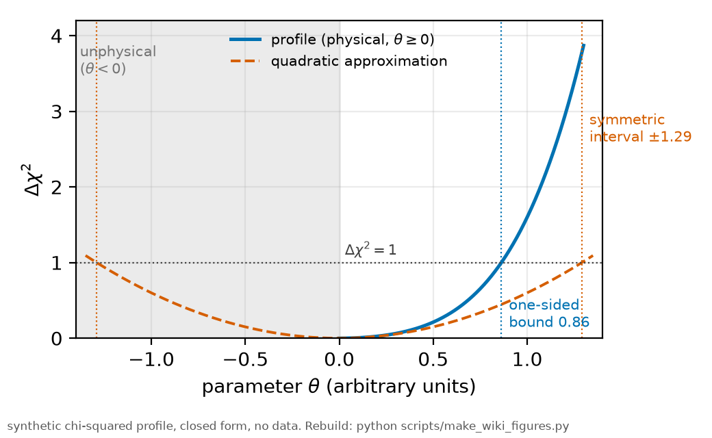

# The profile likelihood

*[wiki index](README.md) · method*

**The question.** How to build a confidence interval for one parameter that
accounts for every nuisance parameter still free in the fit.
**Takes.** A model already fitted by chi-squared minimization, with the
parameter of interest and its nuisances identified. No new data.
**Gives.** The re-optimizing construction itself, why it beats a
fixed-nuisance scan or a quadratic approximation, and what a flat profile
means about the data.
**Skip if.** The question is whether two parameters can be separated at all
before any interval is scanned. That is
[identifiability](identifiability.md).

> **Unfamiliar with the vocabulary?** [GLOSSARY.md](../GLOSSARY.md)
> defines every term and symbol used anywhere in this repository.

## What it is

Most fits have one or two parameters of interest and a crowd of nuisance
parameters that must be there but are not the point. The profile likelihood
handles the crowd by re-optimising every nuisance parameter $\eta$ to its
best value at each candidate value $\theta$ of the parameter of interest:

$$L_p(\theta) = \max_{\eta} L(\theta, \eta)$$

The resulting curve in $\theta$ alone is the profile. An interval is read off
where it drops by a calibrated amount from its maximum, which for a
well-behaved single parameter is the value of $\Delta\chi^2$ that
corresponds to the desired coverage.


*The profile-likelihood curve for the two-width decomposition with the
quadratic covariance ellipse overlaid, showing where the two constructions
diverge.*

Compare this with two cheaper alternatives. Fixing the nuisances at their
best-fit values and scanning $\theta$ pretends the nuisances are known, and
gives an interval that is too narrow, sometimes by a large factor.
Approximating the likelihood by a quadratic at the best fit, which is what a
covariance matrix does, gives a symmetric interval and is exact only if the
surface really is quadratic. The profile makes neither assumption. It costs
a full re-fit per grid point and returns asymmetric intervals when the
problem is asymmetric, which is what the likelihood gives near a physical
boundary.

The profile is also a diagnostic. A profile that is flat over a wide range
is not a wide confidence interval, it is a statement that the data do not
determine the parameter at all. The shape of the curve carries information
the interval alone discards.

## What problem it solves

It produces an interval that accounts for what is not known. When a
systematic is represented by a free nuisance parameter, profiling propagates
the ignorance about that systematic into the quoted uncertainty
automatically, instead of requiring a separate error budget line that is
easy to forget.

## Where this repository uses it

It is the construction behind the intervals quoted here, and
[methods chapter 6 section 4.12](../methods/06_the_statistics.md) gives the
reasoning for choosing it over a Bayesian posterior. Three features of this
dataset drive that choice.

The headline results are bounds, and a bound is only worth its frequentist
coverage, which this repository establishes by simulation (see
[injection-recovery](injection-recovery.md)). The dominant systematic, the
beam waist, is deliberately kept out of the likelihood: marginalising it
would fold a prior invisibly into the number, while quoting an explicit band
keeps the conditionality visible and lets the band collapse without redoing
the inference when a measurement lands. Where the data are thinnest, a prior
would dominate the answer, so this construction states the data poverty
directly.

Profiling is also how the width degeneracy is mapped, the subject of
[identifiability](identifiability.md). Bayesian machinery is used in this
repository where it is the right tool, namely model selection through
[information criteria](information-criteria.md).

## What can go wrong

The most consequential misreading is treating a flat profile as a
conservative interval. A flat direction means non-identifiability, and
quoting its endpoints as a confidence interval only reports where the scan
grid ends.



*A profile against a boundary stays one-sided. The quadratic approximation
from the same curvature does not.*

An implementation failure can look identical. If the nuisance
re-optimisation at each grid point fails to converge, or starts from the
previous point and follows a local branch, the resulting curve is smooth,
plausible and wrong. A profile scan needs its own convergence audit, and
scanning from both directions is the cheap check.

Two calibration traps. The $\Delta\chi^2$ threshold for a given coverage
assumes the asymptotic regime, and with few effective degrees of freedom the
nominal threshold under-covers, so a small-sample quantile is used instead.
Where the maximum sits at a physical boundary, such as a width pinned at
zero, the standard threshold does not apply at all and the interval is
one-sided by construction.

Finally, a grid that is too coarse turns a curved minimum into a piecewise
line and can place an interval edge where the true curve does not lie. This
is a numerical artifact of the grid, caught by refining until the interval
stops moving.

## Try it

Scan the collisional width, re-fitting the laser width at every point, and
watch the profile stay flat. That flatness is the result, not a wide interval.

```python
import numpy as np
from scipy.optimize import least_squares
from rb5s6s import composite_profile, transit_fwhm_from_w0

t = transit_fwhm_from_w0(64e-6, 130.0)
grid, p = composite_profile(0.60, 1.40, t)
nu = np.linspace(-15, 15, 1500)
truth = np.interp(nu, grid, p / p.max(), left=0, right=0)
data = truth + 0.01 * np.random.default_rng(3).standard_normal(nu.size)

def chi2_at(gc):
    def r(q):
        g, pp = composite_profile(gc, abs(q[1]), t)
        return q[0] * np.interp(nu, g, pp / pp.max(), left=0, right=0) - data
    return float(np.sum(least_squares(r, [1.0, 1.40]).fun ** 2))

base = min(chi2_at(g) for g in (0.55, 0.60, 0.65))
for gc in (0.40, 0.60, 0.80):
    print(f"gamma = {gc:.2f} MHz: delta chi2 = {chi2_at(gc) - base:6.2f}")
```

## Values that moved
The AC-Stark bound on this page was once a Wald interval, the linearised
one a covariance matrix gives. The best fit rails at the physical boundary
$\kappa = 0$, and there the width handle broadens as $S_0$ squared, so its
gradient vanishes. A Wald error taken by finite difference at a point of
zero gradient measures numerical noise rather than the likelihood, and
carried no coverage at all. The bound is now the profile bound this page
describes. [HISTORY.md](../HISTORY.md) carries the figures.

## Further reading

- W. A. Rolke, A. M. Lopez and J. Conrad, "Limits and confidence intervals in
  the presence of nuisance parameters", *Nucl. Instrum. Meth. A* **551**, 493
  (2005), for profiling as used for bounds.
- [Identifiability](identifiability.md) for what a flat profile means.
- [Methods chapter 6](../methods/06_the_statistics.md) for this repository's
  own construction and its coverage study.

## See also

- [Identifiability](identifiability.md), for the diagnostic that maps a flat
  profile before an interval is scanned.
- [Information criteria](information-criteria.md), for the model-selection
  question profiling does not answer.
- [Injection-recovery testing](injection-recovery.md), for the simulation
  that checks a profile interval actually covers at the stated rate.

---

[← Identifiability](identifiability.md) · *Statistical inference, 6 of 8* · [Injection-recovery testing →](injection-recovery.md)
