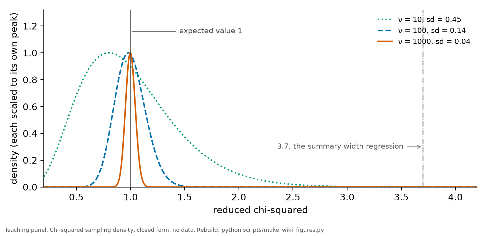
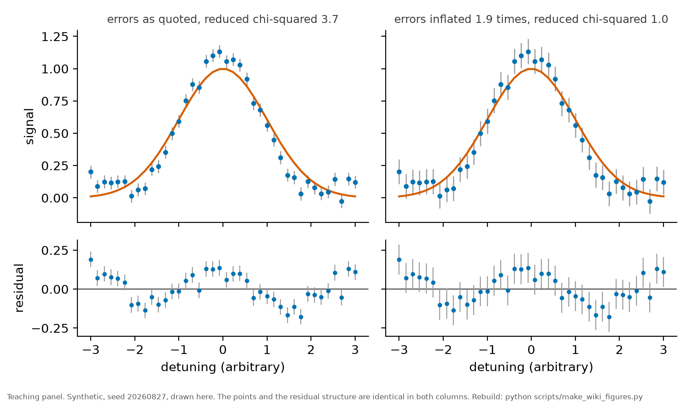

# Reduced chi-squared

*[wiki index](README.md) · method*

**The question.** What a fit's reduced chi-squared tells you, what it cannot
tell you, and what to do when it is not one.
**Takes.** A completed least-squares fit, its chi-squared, and the number of
degrees of freedom that produced it. No new data.
**Gives.** The expected value and the expected spread, the two readings of a
value away from one and why the number alone cannot separate them, what
inflating the errors does and does not repair, and what a misfit costs a
confidence interval.
**Skip if.** The question is how to build the interval itself once the model
is trusted. That is [the profile likelihood](profile-likelihood.md).

> **Unfamiliar with the vocabulary?** [GLOSSARY.md](../GLOSSARY.md)
> defines every term and symbol used anywhere in this repository.

## What it is

For a least-squares fit of $N$ points with $p$ free parameters,

$$\chi^2 = \sum_i \frac{(y_i - m_i)^2}{\sigma_i^2}, \qquad
\chi^2_\nu = \frac{\chi^2}{\nu}, \qquad \nu = N - p$$

If the model is correct **and** the quoted $\sigma_i$ are correct, then
$\chi^2$ follows a chi-squared distribution on $\nu$ degrees of freedom, so

$$\mathbb{E}[\chi^2_\nu] = 1, \qquad
\mathrm{sd}[\chi^2_\nu] = \sqrt{2/\nu}$$

Both conditions are load-bearing, and that is the whole subject of this page.

## A bare value means nothing without its degrees of freedom

The spread collapses as $\sqrt{2/\nu}$, so the same number is unremarkable
in one fit and decisive in another. On ten degrees of freedom the standard
deviation is 0.45, and $\chi^2_\nu = 1.5$ is a routine fluctuation. On a
thousand it is 0.045, and the same 1.5 is eleven standard deviations away.



*The sampling density of reduced chi-squared at three degrees of freedom.
The expected value is one in every case and only the spread changes. A value
quoted without its degrees of freedom cannot be judged, which is why this
repository states both wherever it states either.*

## Two readings, and the number cannot separate them

A value above one says the residuals are larger than the quoted errors
allow. There are exactly two ways for that to happen, and they call for
opposite responses:

* **the model is missing something**, so the residuals carry structure the
  model cannot follow.
* **The errors are underestimated**, so the residuals are ordinary noise
  measured against a bar that is too small.

The conventional response is to inflate every error by $\sqrt{\chi^2_\nu}$,
which sets the number to one by construction. That is a choice about which
of the two readings you believe, not a repair, and it leaves any structure
in the residuals exactly where it was.



*One misfit, two presentations. The points, the model and the residuals are
identical in both columns. The left quotes the original errors and returns
3.7. The right inflates them by the square root of that and returns one. The
oscillation in the residual panel survives untouched, because inflating an
error bar cannot remove a component the model does not have. Reduced
chi-squared alone cannot tell these apart, and the residuals can.*

```python
import numpy as np

rng = np.random.default_rng(11)
n, p = 40, 2
sigma = np.full(n, 0.05)
resid = rng.normal(0.0, sigma, n)          # errors correct, model correct
chi2 = float(np.sum((resid / sigma) ** 2))
nu = n - p
print(f"chi2_red = {chi2 / nu:.3f}, expected 1 +- {np.sqrt(2 / nu):.3f}")

structured = resid + 0.085 * np.cos(2.1 * np.linspace(-3, 3, n))
chi2b = float(np.sum((structured / sigma) ** 2))
print(f"with an unmodelled component: {chi2b / nu:.3f}")
print(f"inflating errors by its square root returns it to 1.000")
```

## Below one is also a statement

A value materially below one means the errors are larger than the scatter
they describe. Over-estimated uncertainties are the usual cause, and a model
flexible enough to follow the noise is the other. Neither is harmless: the
first makes every derived interval too wide, and the second means some of
what the fit calls signal is noise it has absorbed.

## Why it decides what a bound is worth

A confidence interval from a likelihood is a statement **conditional on the
model being correct**. When $\chi^2_\nu$ says the model is not correct, the
interval inherits that, and no amount of care in the interval's construction
repairs it. Two consequences follow, and this repository has met both:

* an interval quoted at 95 per cent has no warranted coverage once the
  likelihood is misspecified, whatever threshold was used to read it off.
* The direction of the resulting bias is **not** determined by
  $\chi^2_\nu$. Adding a missing component can move a limit either way, and
  in this record adding one known missing term moved a light-shift bound by
  a factor of nearly three.

**Where this record stands, and which fit owns which number.** The
per-condition line fits return 0.78 to 1.09 across the 32 fitted conditions,
so within a condition the model describes the data. The **width-against-power
regression** over 20 summary widths returns about
[3.7](../../results/stark_sweep.csv "ref:stark_sweep:chi2_red:fit"). Both come from the same
traces, so the misfit is **between** conditions and not within them:
block-to-block width scatter rather than a defect of the line profile.

That regression's own threshold is scaled by the over-dispersion, which is
the conservative response described above. **The record's quoted light-shift
limit does not come from that fit**, and this page said it did. The quoted
limit comes from the joint fit over every point of every profile, which reads
its bound off an unscaled threshold, with no reduced chi-squared entering
it, and whose own total sits at 0.75. The record's coverage postscript gives the
reason the two can differ so much: the over-dispersion is largely a per-peak
offset, and the joint fit carries per-peak nuisances that absorb exactly
that, while the summary regression has nothing to absorb it with. **Two fits,
two thresholds, and only one of them is the one the headline rests on.**

## Where it is used here

The fit gallery in the [README](../../README.md) states the per-condition
values. [RESULTS.md](../RESULTS.md) states the over-dispersion carried into
the light-shift limit. [The profile likelihood](profile-likelihood.md)
builds the interval this page qualifies, and
[identifiability](identifiability.md) covers the separate question of
whether two parameters can be told apart at all.

---

[← Identifiability](identifiability.md) · *Statistical inference, 6 of 9* · [The profile likelihood →](profile-likelihood.md)
