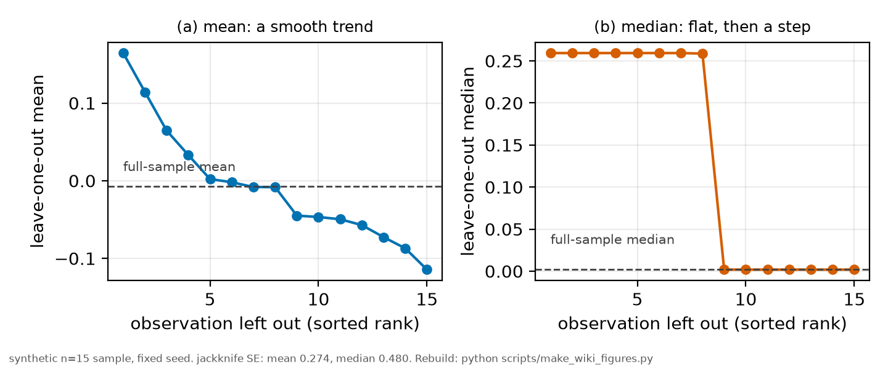
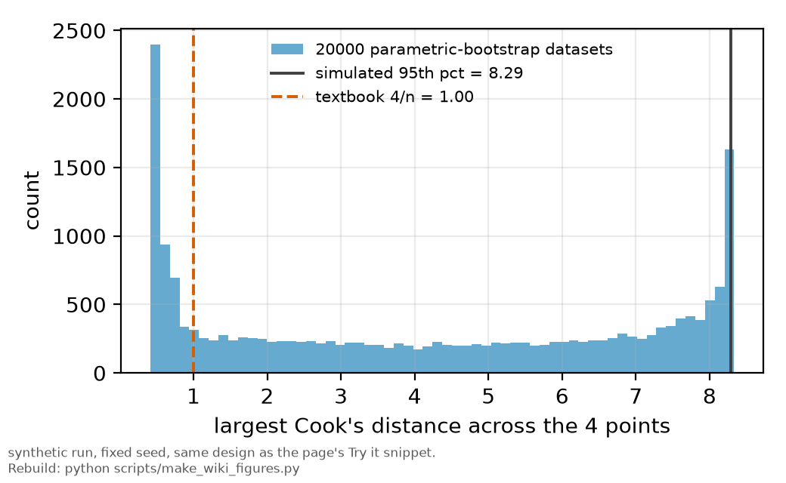

# Resampling

*[wiki index](README.md) · method*

**The question.** How to get a standard error, a bias estimate or a
confidence interval for a statistic that has no closed-form sampling
distribution.
**Takes.** One sample in hand, or a fitted model to simulate from, and no
closed-form formula for the statistic's variance.
**Gives.** The nonparametric and parametric bootstrap, the jackknife,
jackknife-after-bootstrap, and why a block or stratified draw is needed once
the data are not individually exchangeable.
**Skip if.** You want to know whether one observation drives a fit. See
[influence diagnostics](influence-diagnostics.md) instead.

> **Unfamiliar with the vocabulary?** [GLOSSARY.md](../GLOSSARY.md)
> defines every term and symbol used anywhere in this repository.

## What it is

A fitted quantity's standard error usually comes from a textbook formula
assuming Gaussian noise and a closed-form variance expression. Resampling
drops that assumption: treat the sample as a stand-in for its population,
draw new samples from it, recompute the statistic on each draw, and read
its variability off the spread of results. The idea extends from standard
errors to bias, confidence intervals, and the null distribution of almost
any statistic, none of which needs an analytic formula once a computer can
draw resamples and count.

The plain version is the nonparametric, or case-resampling, bootstrap: draw
$n$ of the $n$ observations with replacement, compute the statistic, and
repeat $B$ times. The empirical distribution of the $B$ results stands in
for the true sampling distribution, its standard deviation a bootstrap
standard error and its percentiles a confidence interval, assuming the
sample's empirical distribution fairly pictures the population.

The parametric bootstrap changes what gets resampled: instead of drawing
points from the observed sample, it draws datasets from a model fitted to
that sample, simulating a new observation at each design point from the
fitted curve plus assumed or measured noise, then recomputing the
statistic. The randomness now comes from the model, not the residuals'
empirical spread, so it can be built at design points with no repeat
measurement, and its null distribution asks what the statistic would look
like if the fitted model were the whole truth.

The jackknife is older and simpler: leave one observation out, recompute
the statistic on the remaining $n-1$, and repeat once per observation,
replacing the bootstrap's $B$ random draws with a fixed set of $n$
deletions. Their spread gives a jackknife standard error, and their average
shift from the full-sample estimate gives a jackknife bias estimate. It
needs no random-number generator or choice of $B$, but has only $n$ points
of support, and fails for a statistic not smooth in the sample, the median
chief among them.

Jackknife-after-bootstrap turns the bootstrap's own output into a
diagnostic without a second procedure: each resample happens at random
either to include a given observation or leave it out, so the $B$
resamples already contain something close to a leave-one-out experiment on
the bootstrap distribution. Comparing the resamples that omit one
observation against those that include it attributes uncertainty to
individual observations.

## What problem it solves

Resampling substitutes computation for a derivation. A median, a ratio of
two fitted parameters, or the maximum of several correlated residuals
rarely has a closed-form sampling distribution, or has one only under
assumptions an analyst would rather not make. Deriving a standard error by
hand for every such statistic does not scale, and reaching for the nearest
textbook formula with a known distribution substitutes a convenient
statistic for the one wanted. Resampling answers how a number would vary
if the measurement were repeated, by simulation, regardless of how
complicated the calculation is.

It also supplies a null distribution calibrated to the design actually in
use, not a generic large-sample approximation: a cutoff read from a table
assumes the data resemble the table's asymptotic case, which a small,
unevenly spaced dataset often does not.

## Where this repository uses it

An audit of this repository's own influence diagnostics needed a threshold
for the largest Cook's distance across the four-point width-against-density
fits behind the collisional-broadening bound, one fit per peak with two
free parameters. A textbook rule of thumb exists, but with only two
degrees of design left after fitting four points, it mostly reflects how
uneven the design is. The audit built the threshold instead: it simulated
datasets from each fitted line at the design's own points and errors,
refit each one, and recorded the maximum Cook's distance, against a null
distribution this design itself produces.

The joint fit behind the same coefficient carries a leave-one-out check of
its own, a jackknife in substance.
[`rb5s6s/lever_crosscheck.py`](../../rb5s6s/lever_crosscheck.py) drops one
whole peak at a time, refits, and records the largest shift in
$\beta_\text{self}$, then does the same per temperature block. Both are
leave-one-out at the level of a whole block, not a single point, committed
in
[`results/lever_crosscheck.csv`](../../results/lever_crosscheck.csv):
dropping the single peak whose absence moves the fit most shifts
$\beta_\text{self}$ by at most 0.0070 MHz per $10^{12} \text{cm}^{-3}$ for
$^{85}\text{Rb}$ and 0.0040 for $^{87}\text{Rb}$, while dropping the 110 C
block moves it by up to 0.1338 and 0.0745 respectively, because a
temperature block is also a density point that shortens the fit's density
lever when removed.

A third use is a case-resampling bootstrap of the power-lever grid behind
the AC-Stark bound, preregistered in
[`docs/notes/s0_block_bootstrap_prereg.md`](../notes/s0_block_bootstrap_prereg.md)
before any resample was drawn. The grid is four peaks of five power
settings each, not twenty independent points, and the peaks do not share
their nuisance parameters, so pooling all twenty cells could give one peak
all five of another's and none of its own. The preregistered construction
instead draws five cells with replacement from each peak's own five,
independently: a stratified bootstrap resampling the exchangeable unit, a
whole peak's power sweep, not a smaller one.

## What can go wrong

Resampling cannot manufacture information the sample does not contain, and
a nonparametric bootstrap on a very small sample meets that limit early: a
four-point fit has only $4^4=256$ distinct resamples, most dropping at
least one of the four points entirely, so the distribution is coarse by
construction. The same limit is sharper in the influence audit above,
where one of the four design points sits at leverage near one: the fitted
line passes almost exactly through it whatever value it carries, refit
around it every time with no residual for any diagnostic to catch. That is
a property of the design, not the method, and why the audit reported no
verdict for that point instead of a false clean bill.



*The jackknife behaving well for a smooth statistic and badly for one that is
not.*

A second failure is structural, not a matter of sample size: real data
often form a smaller number of exchangeable blocks, each carrying a
correlation or nuisance parameter no single point carries alone, a whole
peak's power sweep sharing one systematic being the case above.
Resampling individual points instead of whole blocks treats correlated
observations as independent and understates the true uncertainty, exactly
this repository's own block-to-block scatter, one systematic per peak
instead of one per point, and why the S0 construction above stratifies
instead of pooling.

Two narrower failures are worth naming. A parametric bootstrap inherits the
correctness of its model: a wrong noise law puts the same wrong law into
every simulated dataset, so the null distribution ends up wrong in the same
direction as the model. The jackknife fails for statistics that are not
smooth in the sample, the median chief among them, where dropping one
point leaves the leave-one-out estimate unchanged across many draws, then
jumps, producing a standard error unrelated to the statistic's real
variability.

## Try it

A parametric-bootstrap null for a small, unevenly spaced design: three
points close together and one far off, the shape that hands one point most
of the leverage. The threshold below is read off the simulated
distribution, not a textbook rule of thumb.



*The parametric-bootstrap null distribution the Try It snippet builds,
against the textbook rule of thumb it replaces.*

```python
import numpy as np

rng = np.random.default_rng(0)

# A small, unevenly spaced design, the shape a width-against-density fit
# takes when three conditions sit close together and one sits far off at
# the same measured precision: the far point alone then carries most of
# the leverage.
x = np.array([1.0, 1.6, 2.2, 4.0])
sigma = np.full_like(x, 0.05)
n, p = len(x), 2
X = np.column_stack([np.ones(n), x])

w = 1.0 / sigma**2
XtW = X.T * w
cov = np.linalg.inv(XtW @ X)
M = cov @ XtW                 # maps any y onto its fitted (intercept, slope)
H = X @ M
h = np.diag(H)                # leverage h_i, fixed by the design alone
dof = n - p

true_line = 0.30 + 0.05 * x   # the fitted line the null is simulated from

B = 20000
Y = true_line[None, :] + rng.normal(0.0, sigma[None, :], size=(B, n))
resid = Y - (X @ (M @ Y.T)).T
s2 = (w * resid**2).sum(axis=1) / dof
e2 = (w * resid**2) / (s2[:, None] * (1 - h)[None, :])
cooks_d = e2 * h[None, :] / (p * (1 - h)[None, :])
max_d = cooks_d.max(axis=1)

print(f"{B} datasets simulated from the fitted line, at the real design's "
      f"{n} points and measured errors")
print(f"leverage of the far point: {h[-1]:.3f} of a maximum of 1")
print(f"95th percentile of the null max-Cook's-distance distribution: "
      f"{np.percentile(max_d, 95):.2f}")
print(f"textbook rule-of-thumb cutoff 4/n: {4.0 / n:.2f}")
print("the design alone inflates the threshold this far above the rule of "
      "thumb, before any real data are read")
```

Every snippet on these pages runs under `tests/test_wiki_snippets_run.py`,
so a broken one fails the suite instead of misleading a reader.

## Values that moved
An earlier interval on $\beta_\text{self}$ used a hard-coded multiplier
without checking how many degrees of freedom the fit carried, and was
rebuilt on the Student-t quantile those degrees of freedom call for, with
no new data behind the change. Neither figure is a resample as this page
defines the term, both being closed-form quantiles, but the same check
applies: a cutoff must match the degrees of freedom actually available.
[HISTORY.md](../HISTORY.md) carries the before and after.

## Further reading

- [Wikipedia: Bootstrapping (statistics)](https://en.wikipedia.org/wiki/Bootstrapping_(statistics)),
  for the general history and its variants.
- B. Efron, "Bootstrap methods: another look at the jackknife," *Ann.
  Statist.* **7**, 1 (1979), the paper introducing the nonparametric
  bootstrap.
- B. Efron and R. J. Tibshirani, *An Introduction to the Bootstrap* (Chapman
  and Hall/CRC, 1993), the standard reference for the bootstrap and the
  jackknife together.
- J. W. Tukey, "Bias and confidence in not-quite large samples" (abstract),
  *Ann. Math. Statist.* **29**, 614 (1958), the paper the jackknife takes
  its name from, building on M. H. Quenouille's 1949 bias-reduction
  construction.
- B. Efron, "Jackknife-after-bootstrap standard errors and influence
  functions," *J. R. Stat. Soc. B* **54**, 83 (1992), the diagnostic named
  on this page.
- H. R. Kunsch, "The jackknife and the bootstrap for general stationary
  observations," *Ann. Statist.* **17**, 1217 (1989), the origin of the
  block bootstrap.
- [Weighted least squares](weighted-least-squares.md), whose closing
  section is the question this page answers.
- [The joint fit](joint-fit.md), whose leave-one-out checks are the
  jackknife described here.

## See also

- [Methods chapter 6](../methods/06_the_statistics.md), where the
  resampling constructions used on the record are specified.
- [Influence diagnostics](influence-diagnostics.md), the case-deletion idea
  this page's jackknife generalizes.
- [Robust fitting](robust-fitting.md), a loss-based alternative run beside a
  resampled interval, not instead of it.
- [Heavy-tailed models](heavy-tailed-models.md), a likelihood-based
  alternative to a hard threshold.
- [Sensitivity analysis](sensitivity-analysis.md), another Monte Carlo
  construction costed by model evaluations instead of data points.

---

[← Robust fitting](robust-fitting.md) · *Robustness and influence, 3 of 7* · [Heavy-tailed models →](heavy-tailed-models.md)
