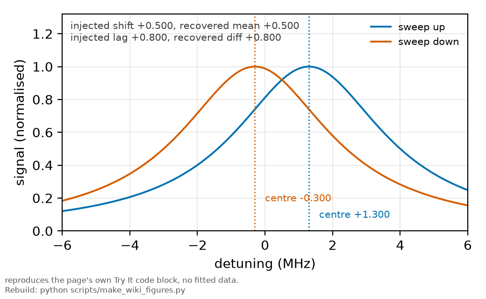

# Reversal tests

*[wiki index](README.md) · method*

**The question.** How are two systematics separated when they produce the
same signature in the data?
**Takes.** Nothing beyond the idea of a systematic. Pairs naturally with
[confounding by acquisition order](confounding-by-acquisition-order.md).
**Gives.** The odd-even decomposition under a flipped knob, the reversal
table as a design discipline, and the case where the atom's structure
supplies it directly.
**Skip if.** You want the statistics of separating parameters inside one
fit, which is [identifiability](identifiability.md). This page separates
effects by symmetry before any fit runs.

> **Unfamiliar with the vocabulary?** [GLOSSARY.md](../GLOSSARY.md)
> defines every term and symbol used anywhere in this repository.

## What it is

A reversal test separates effects by their parity under a knob that can be
flipped. The difference of the flipped and unflipped results isolates
everything odd under the knob, and the sum keeps everything even.

In a triangular sweep, detection lag shifts the apparent line centre one
way on the rising half and the other on the falling half. The
half-difference measures the lag, the half-mean cancels it, and a real
shift survives the mean regardless of sweep direction.

The discipline scales into a table: each candidate mechanism is listed with
the knob that flips it and the scaling that grows it. A mechanism without
an assigned knob or scaling is admitted only if it can be computed exactly.

## What problem it solves

Fitting cannot separate what the data do not distinguish, and two effects
with the same functional signature are one effect to any fit. A reversal
changes the data instead of the model, so after the flip the two effects
are no longer degenerate because only one of them moved.



*The odd and even parts of a triangular sweep: the half-difference recovers the lag, the half-sum recovers the real shift, neither needing the lineshape to be right.*

The decomposition also does not depend on the lineshape: the half-difference
only needs the same shape on both halves, not a correct profile.

```python
import numpy as np

# A line swept up and down, with a detection lag and a REAL shift injected.
nu = np.linspace(-30, 30, 1201)
line = lambda c: 1.0/(1.0 + ((nu - c)/2.7)**2)
lag_shift, real_shift = 0.8, 0.5          # both move the apparent centre
up, down = line(real_shift + lag_shift), line(real_shift - lag_shift)

def centre(v):
    """Midpoint of the half-maximum crossings: window-truncation-proof."""
    half = v.max()/2
    i = np.nonzero(v > half)[0]
    lo = np.interp(half, [v[i[0]-1], v[i[0]]], [nu[i[0]-1], nu[i[0]]])
    hi = np.interp(half, [v[i[-1]+1], v[i[-1]]], [nu[i[-1]+1], nu[i[-1]]])
    return 0.5*(lo + hi)

mean = 0.5*(centre(up) + centre(down))     # even part: the real shift
diff = 0.5*(centre(up) - centre(down))     # odd part: the lag
print(f"injected real shift {real_shift}, recovered from the mean: {mean:+.3f}")
print(f"injected lag        {lag_shift}, recovered from the diff:  {diff:+.3f}")
print("neither number needed the lineshape model to be right")
```

## Where this repository uses it

The measurement plan's asymmetry budget is a reversal table: detection lag
is odd under sweep direction, the AC-Stark ramp's asymmetry follows power,
collisional asymmetry follows density, and a vector light shift reverses
with the ambient field. Each candidate carries the flip that would confirm
or rule it out.


*The two within-isotope line pairs the reversal below relies on: each isotope's higher-F line over its lower-F line, 87Rb F=2/F=1 and 85Rb F=3/F=2.*

One case needed no added hardware: the hyperfine g-factor alternates sign
between each isotope's two F manifolds, giving the four lines built-in
polarity pairs for anything odd in $m_F$. A vector-shift asymmetry would
flip sign between an isotope's two lines, but the committed per-line skew
is the same sign on all four, excluding the mechanism from existing data.

The same approach also finds a null: scanning a knob to minimise an odd
signature locates its zero, as when a coil nulls the ambient field without
a magnetometer.

## What can go wrong

**The flip is not clean.** Reversing a sweep changes the settling transient
the line meets, so the half-difference carries settling along with lag. A
knob that changes two things separates nothing until the second is
controlled.

**The flip is incomplete.** A half-wave plate rotating polarisation by
almost the right angle leaves a suppressed residual of the odd effect in
the even channel. The suppression factor is recorded in the budget.

**The even channel is read as clean.** The decomposition isolates what is
odd under the knob. Effects even under it, including the one under study,
stay superposed and need a different knob or scaling.

**The reversal is run but never checked for closure.** Flipping twice must
reproduce the original within errors. Drift between flips reads as a fake
odd signal, so reversal pairs are taken adjacent in time, not at opposite
session ends.

## Further reading

Reversal and modulation methods appear throughout precision measurement:
parity experiments alternate handedness, electric-dipole-moment searches
reverse fields, and clock evaluations interleave states. Odd signals are
candidate physics, even signals are references, and a claimed effect
carries the flip that would rule it out.

## See also

[Confounding by acquisition order](confounding-by-acquisition-order.md), the
time-ordering member · [Identifiability](identifiability.md), separation
inside the fit · [Sweep rate and detection lag](sweep-rate-and-detection-lag.md),
the triangle-halves reversal · [Magnetic sublevels](magnetic-sublevels.md),
the g-factor structure above · [The digital twin of an
experiment](the-digital-twin.md), where a reversal is rehearsed first

---

[← Confounding by acquisition order](confounding-by-acquisition-order.md) · *Robustness and influence, 7 of 7* · [wiki index →](README.md)
