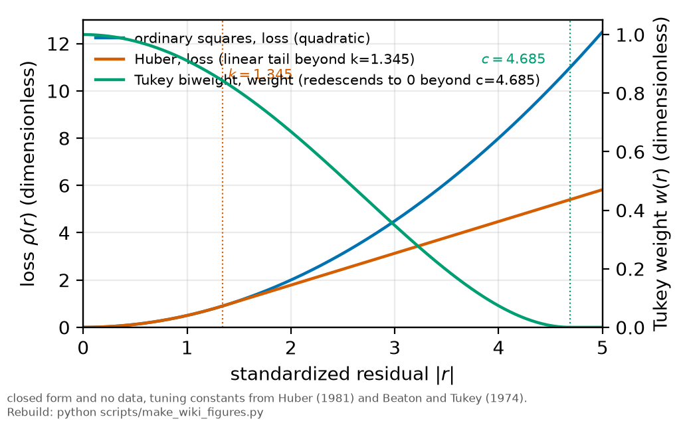

# Robust fitting

*[wiki index](README.md) · method*

**The question.** Once a point is suspected of pulling a fit too far, which
loss functions stop that pull without a person deciding by eye which points
to trust.
**Takes.** An ordinary weighted least-squares fit to compare against, and no
assumption about which points, if any, are contaminated.
**Gives.** Huber and Tukey's biweight losses, the breakdown point that
separates them, and the rule that a robust fit runs beside the standard
fit, not in place of it.
**Skip if.** You want to find which point is doing the pulling before
choosing a loss. That is [influence diagnostics](influence-diagnostics.md).

> **Unfamiliar with the vocabulary?** [GLOSSARY.md](../GLOSSARY.md)
> defines every term and symbol used anywhere in this repository.

## What it is

An ordinary least-squares fit scores every residual by its square, so the
pull a point exerts, the derivative of its loss with respect to the
residual, grows without bound: a point twice as far from the model pulls
four times as hard. The arithmetic cannot tell an ordinary noisy point from
one produced by a stray spark or a mistimed trigger, so one such point with
strong leverage can move the fit further than every other point combined.



*Three loss functions against a standardized residual: unbounded growth,
linear tails, and a return to zero weight.*

M-estimation keeps the same sum-over-residuals structure but replaces the
square with a loss that grows more slowly in the tails. Huber loss stays
quadratic near zero and switches to linear beyond a tuning constant $k$:

$$\rho_k(r) = \tfrac{1}{2}r^2 \text{ for } |r|\le k, \qquad
\rho_k(r) = k|r| - \tfrac{1}{2}k^2 \text{ for } |r| \gt k$$

so a residual beyond $k$ pulls only in proportion to its size, not its
square. Tukey's biweight goes further and redescends: past its own
constant $c$ the pull turns over and returns to zero, written as a weight

$$w(r) = \left(1 - (r/c)^2\right)^2 \text{ for } |r| \le c, \qquad
w(r) = 0 \text{ for } |r| \gt c,$$

so a point beyond $c$ contributes nothing further.

The breakdown point is the largest fraction of contaminated points an
estimator can carry before its answer can be driven arbitrarily far from
the truth. Ordinary least squares breaks down at a single high-leverage
point. Huber's monotone loss bounds each point's pull but never removes it,
so it improves on an unweighted fit only within limits set by how many
bounded pulls can accumulate. A redescending loss reaches a materially
higher breakdown point, since a point past $c$ stops contributing however
far it moves, at the cost of a nonconvex objective that can carry more than
one minimum.

Both constants behave the same way: a small one discounts more contamination
but also discounts genuinely large residuals on clean data, losing
precision, and a large one recovers that precision by approaching the
ordinary answer at the cost of tolerating more contamination. The
conventional choices, $k \approx 1.345$ for Huber and $c \approx 4.685$ for
the biweight, in units of a robust scale estimate, keep about ninety-five
per cent of the efficiency an ordinary fit would have on clean Gaussian
data.

Neither loss has a closed-form minimizer, so both are computed by
iteratively reweighted least squares: fit once ordinarily, convert
residuals into weights through the loss's weight function, solve the
weighted least-squares problem with those weights, and repeat until the
weights stop moving. Each step is an ordinary linear solve that can only
lower the robust objective, which is why it converges.

Trimming and Winsorization are blunter alternatives: trimming discards a
stated number of the largest residuals and refits on the rest, and
Winsorization caps an extreme value at a percentile instead of deleting it,
carrying full weight afterward without the reported uncertainty reflecting
how extreme it was.

## What problem it solves

A measured noise law handles the case where every point is honest about its
own uncertainty. It does nothing for a point that is wrong for a reason the
noise law never modeled, since that same honest weight is exactly what
lets a mismodeled point pull the fit at full strength: the point looks
quiet, so it is trusted. Robust fitting substitutes a rule, a bounded or
redescending loss applied the same way to every point, for a person
deciding after seeing the fit which points look wrong.

A robust fit belongs beside the standard weighted fit, as a diagnostic: the
comparison between the two is the result. Agreement shows the answer does
not depend on the points a robust loss would discount. Disagreement names
which points to check before trusting either number. A robust fit that
silently replaces the standard one discards that comparison, the only
signal for whether an answer rests on the whole dataset or a few points
within it.

## Where this repository uses it

This repository does not use robust fitting in its committed analysis.
Every fit here is
[weighted by a noise law measured directly from the detector](weighted-least-squares.md),
independent of any fit's own residuals, so a point whose true noise is
large already counts for less before fitting, instead of being discounted
afterward.

A case-deletion audit (leverage, Cook's distance, the externally
studentized residual) on the committed lineshape fits found one power-sweep
point far off its peak's trend that does not move the fitted slope:
outlying by residual, not by leverage, the configuration where a robust
fit and the standard fit are expected to agree.


*The four-point width-versus-density fit whose highest-density point sits at
leverage 0.94, the configuration this page's leverage discussion refers to.*

The same audit also shows what it cannot fix. A four-point
width-against-density fit carries one temperature condition at leverage
close to one, since the sweep leaves it far from the other three on the
density axis by design. Leverage depends only on where the points sit, not
on any fitted value: at the campaign's four temperatures the density units
run 0.56, 2.45, 9.10 and 29.43, and the leverages are 0.43, 0.37, 0.25 and
0.94 against a four-point average of 0.5. That same lever puts one
point almost entirely in charge of the fit, forcing the fit through it
regardless of value, so a residual-based diagnostic, a robust loss among
them, finds almost nothing to act on.
[Collisional self-broadening](self-broadening.md) reports its
density-based coefficient as a bound instead of a value for this reason.

## What can go wrong

The clearest failure is a robust fit reported in place of the standard one,
with no comparison shown: it hides whether the two agree, the reason for
running one.

A redescending loss can drive so many points to zero weight that the fit
becomes undefined: on four or five points the biweight can push enough of
them to zero that fewer than two distinct horizontal positions survive,
leaving the normal equations singular, a consequence of a hard rejection
rule run on too little data. The Huber loss never reaches zero weight and
has no such mode. An undefined biweight result should be reported, not
suppressed.

A second failure is data insufficiency that mimics a design flaw. At
leverage near one, a robust loss cannot distinguish a trustworthy point
from a wrong one, since both leave almost the same residual once forced
through.

A third is a choice made after the fact: setting a tuning constant, a
trimming fraction, or a Winsorization percentile once the fit's sensitivity
is visible reopens the freedom [preregistration](preregistration.md) exists
to close.

A fourth is implementation: a redescending loss is nonconvex, so an
iteratively reweighted solver started from different points can converge
to different values, both runs reporting convergence.

Finally, an efficiency failure raises no error: applying a robust loss to
clean data discards the several per cent of precision the tuning constant
is calibrated to give up, for protection the data did not need.

## Try it

A small dataset with one contaminated point, fit by ordinary least squares
and by a Huber M-estimator via iteratively reweighted least squares. The
contaminated point pulls the ordinary slope noticeably and the Huber fit
much less, since by the end of the iteration it carries only a fraction of
an ordinary point's weight.

```python
import numpy as np

rng = np.random.default_rng(3)
x = np.linspace(1.0, 10.0, 10)
true_slope, true_intercept = 2.0, 1.0
y = true_intercept + true_slope * x + rng.normal(scale=0.3, size=x.size)
y[7] += 25.0  # one point wrong for a reason the noise law never modeled

X = np.column_stack([np.ones_like(x), x])


def ols(X, y):
    beta, *_ = np.linalg.lstsq(X, y, rcond=None)
    return beta


def huber_irls(X, y, k=1.345, n_iter=30, tol=1e-10):
    beta = ols(X, y)
    weights = np.ones_like(y)
    for _ in range(n_iter):
        resid = y - X @ beta
        scale = max(np.median(np.abs(resid - np.median(resid))) / 0.6745,
                    1e-12)
        scaled = np.abs(resid) / scale
        weights = np.where(scaled <= k, 1.0, k / scaled)
        beta_new = np.linalg.solve(X.T @ (weights[:, None] * X),
                                    X.T @ (weights * y))
        if np.max(np.abs(beta_new - beta)) < tol:
            beta = beta_new
            break
        beta = beta_new
    return beta, weights


beta_ols = ols(X, y)
beta_huber, weights = huber_irls(X, y)

print(f"true slope: {true_slope:.3f}")
print(f"ordinary least squares slope: {beta_ols[1]:.3f}")
print(f"Huber IRLS slope:             {beta_huber[1]:.3f}")
print(f"contaminated point's converged Huber weight: {weights[7]:.3f} "
      f"(1.0 is fully trusted, near 0 is discounted)")
```

## Further reading

- P. J. Huber, *Robust Statistics* (Wiley, 1981), the origin of this loss
  and its tuning constant.
- A. E. Beaton and J. W. Tukey, "The fitting of power series, meaning
  polynomials, illustrated on band-spectroscopic data," *Technometrics*
  **16**, 147 (1974), the origin of the biweight loss.
- P. J. Rousseeuw and A. M. Leroy, *Robust Regression and Outlier Detection*
  (Wiley, 1987), for the breakdown point and case-deletion diagnostics named
  above.
- [Weighted least squares](weighted-least-squares.md), the fitting principle
  every committed analysis here uses, and where it stops being enough.
- [Preregistration](preregistration.md), for freezing a tuning constant or
  trimming rule before the data are read.
- [Collisional self-broadening](self-broadening.md), for the bound this
  page's leverage discussion explains.

## See also

- [Influence diagnostics](influence-diagnostics.md), for finding which point
  is doing the pulling before a loss is chosen.
- [Resampling](resampling.md), a different way to get an interval with no
  closed form, and the block structure that trips up both.
- [Heavy-tailed models](heavy-tailed-models.md), the same continuous
  downweighting, from a fitted likelihood instead of a hand-chosen loss.

---

[← Influence diagnostics](influence-diagnostics.md) · *Robustness and influence, 2 of 7* · [Resampling →](resampling.md)
