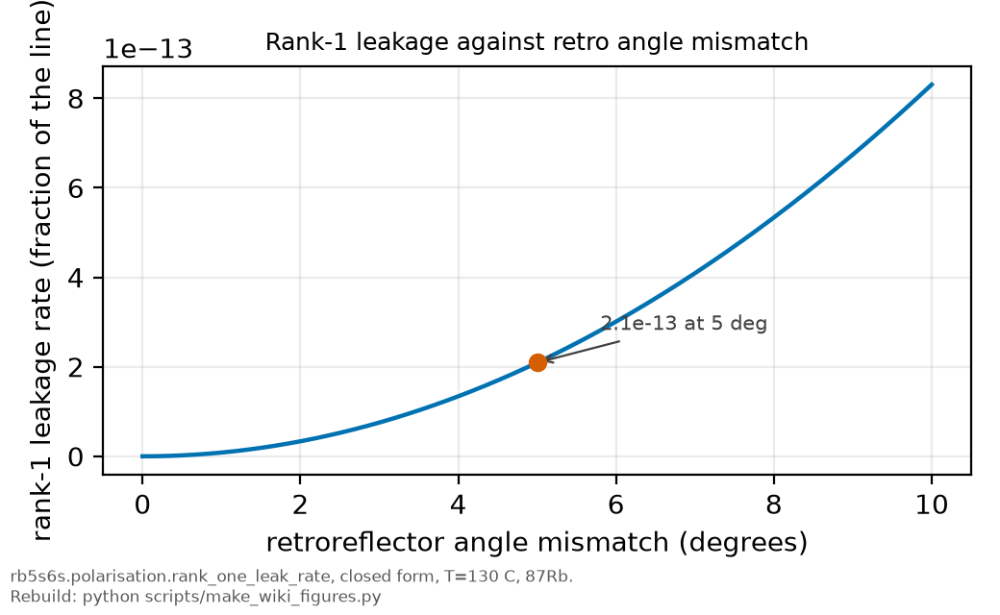

# Selection rules

*[wiki index](README.md) · concept*

**The question.** What fixes which multipole order, and therefore roughly
how strong or weak, connects two given atomic states.
**Takes.** Only parity and total angular momentum $J$ as separate quantum
numbers, nothing else assumed.
**Gives.** The parity and angular-momentum rules that read a state pair's
multipole order and transition strength directly off their quantum numbers.
**Skip if.** the reader wants the two-photon mechanism a parity-forbidden
line proceeds through, not the multipole bookkeeping itself. See
[Multiphoton transitions](multiphoton-transitions.md).

> **Unfamiliar with the vocabulary?** [GLOSSARY.md](../GLOSSARY.md)
> defines every term and symbol used anywhere in this repository.

## What it is

An atom couples to a light field through its charges. The interaction
expands in powers of $k \cdot r$, the atom's own size $r$ measured against
the light's wavevector $k = 2\pi/\lambda$, and each successive term is a
different multipole order. The leading term, independent of $k \cdot r$, is
the electric dipole (E1) interaction, the electron's charge distribution
coupling to the field as if it were a single displaced point charge. The
next term, one power of $k \cdot r$ smaller in amplitude, splits into two
pieces of the same order: the magnetic dipole (M1) interaction, from the
current the moving charge represents, and the electric quadrupole (E2)
interaction, from the charge distribution's departure from a point. Further
terms, octupole and beyond, continue the ladder, each one power of
$k \cdot r$ weaker again.

The dipole term dominates because $k \cdot r$ is tiny for an atom driven by
visible or near-infrared light. The atom's size is set by the Bohr radius, a
fraction of an angstrom, while the wavelength is hundreds of nanometers, so
$k a_0$ itself sits at roughly $10^{-3}$ to $10^{-4}$. Because a transition
rate scales with the square of the coupling amplitude, each step up the
ladder costs a factor of about $(k a_0)^2$ in rate, typically six to eight
orders of magnitude. A transition the dipole term cannot drive still
proceeds through the next term, at a reduced rate. That is why it is
called forbidden, not absent: a statement about speed, not whether it
happens.

Which multipole order actually connects two given states follows from two
properties only. The first is parity. Spatial inversion sends $r \to -r$,
and the electric dipole operator, linear in $r$, is odd under that
operation. A matrix element between states of definite parity vanishes
unless the operator's parity and the two states' parities multiply to an
even result, so an odd operator connects only states of opposite parity.
Every E1 photon absorbed or emitted changes the atom's parity.

The second property is angular momentum. A photon is a spin-1 particle and
carries at least one unit of angular momentum into or out of the atom, so
the atom's own angular momentum has to be able to absorb or supply that
unit. For a dipole photon, the simplest carrier, the total angular momentum
$J$ can change by $0$ or by $\pm 1$, with one exception: $J=0$ to $J=0$ is
forbidden, because a photon always carries at least one unit and a state
with no angular momentum to reorganise has nowhere for that unit to go.

Magnetic dipole and electric quadrupole radiation differ from electric
dipole on both counts. Both operators are even under spatial inversion, the
magnetic dipole because it is built from orbital or spin angular momentum,
unchanged by $r \to -r$, and the electric quadrupole because it is
quadratic in $r$ and $(-r)(-r) = rr$. Both therefore connect states of the
same parity, the opposite of the dipole rule, which is how a
dipole-forbidden transition can still proceed. On angular momentum the two
channels differ: magnetic dipole radiation carries the same single unit
as electric dipole and obeys the same $J$ rule, while electric quadrupole
radiation is a rank-two operator and can carry away up to two units, opening
$J$ changes of $\pm 2$ that neither dipole channel reaches, while still
excluding $J=0$ to $J=0$, $J=0$ to $J=1$, and $J=1/2$ to $J=1/2$, none of
which a two-unit carrier can bridge either.

The nucleus enters only through coupling. [Hyperfine
structure](hyperfine-structure.md) describes how nuclear spin $I$ combines
with the electronic angular momentum $J$ to give the total angular momentum
$F$ a real spectral line is labelled by. The photon interacts with the
electrons, so every rule above is a statement about $J$ and about electronic
parity. What holds for $F$ is the ordinary angular-momentum addition of a
fixed $I$ onto both sides of the $J$ rule: $F$ follows the same shape of
rule $J$ does for a given multipole order, once $I$ is added consistently
to the initial and final state. There is no separate nuclear selection
rule.

## What problem it solves

Selection rules turn a spectrum's structure into something predictable
before any matrix element is computed. Given only the parity and the
angular momentum of two states, they say at a glance which multipole order
connects them, and therefore roughly how strong or how slow the transition
will be, without touching a radial wavefunction or a coupling constant.
That bookkeeping is also what makes a level metastable: a state with no
dipole-allowed path down decays only through the far slower magnetic-dipole
or electric-quadrupole channel, and identifying which states qualify needs
nothing beyond parity and angular momentum.
Because the rules follow from symmetry, they generalise instantly: the
argument that forbids one atom's version of a transition forbids every
atom's.

## Where this repository uses it

The transition this repository measures connects $5S_{1/2}$ and $6S_{1/2}$,
both $l=0$ states, so both share the same even parity. Parity forbids any
electric dipole photon from connecting them directly, at any optical
wavelength. The mismatch is exact, not a matter of degree. The lowest
process parity allows is two dipole steps through a virtual,
far-off-resonance $nP$ state, each step flipping the parity, so the pair
returns the atom to even parity exactly where $6S_{1/2}$ sits. That is the
entire reason this experiment absorbs two photons instead of one, explained
in [multiphoton-transitions.md](multiphoton-transitions.md). Which
multipole channels the parity argument still leaves open for this line, and
how far below the dominant amplitude they sit, is in
[THEORY_NOTE.md, section 5.1](../THEORY_NOTE.md).


*Term diagram of the 5S1/2-6S1/2 two-photon path, the transition parity
forbids in a single step.*



*Rank-1 leakage rate against retroreflector angle mismatch, the geometric
suppression this page's polarisation argument relies on.*

The angular-momentum half of the rule shows up once the nucleus is added.
[Hyperfine structure](hyperfine-structure.md) sets out how nuclear spin $I$
couples to $J$ to give the four labelled components this experiment
resolves, and [`constants.PEAKS`](../../rb5s6s/constants.py) records every
one of them as an $F$ to $F'$ transition with $\Delta F = 0$, consistent
with the same angular-momentum bookkeeping applied to $F$ instead of $J$.

The two-photon operator is a product of two rank-1 dipoles, so it carries
ranks 0, 1 and 2, and each rank moves $m$ by its own amount. For this pair
of states both are removed except the first:

| rank | polarisation factor | $\Delta m_F$ | available here |
|---|---|---|---|
| 0 | $\vec{e}_1 \cdot \vec{e}_2$ | 0 | yes, and it is the whole line |
| 1 | $\vec{e}_1 \times \vec{e}_2$ | $\pm 1$ | no, see below |
| 2 | $\lbrace \vec{e}_1 \vec{e}_2 \rbrace^{(2)}$ | $\pm 2$ | no, the reduced element vanishes |

Rank 2 goes because the triangle rule needs a rank between the difference
and the sum of the two angular momenta, and with both equal to one half
that window runs from zero to one, which excludes two. Rank 1 goes for a
different and less obvious reason. Writing the two time orderings with
denominators $D_1$ and $D_2$, the rank-1 weight is the product

$$(1/D_1 - 1/D_2) \times (\vec\epsilon_1 \times \vec\epsilon_2)$$

so it needs both factors. It vanishes when the two photons carry the same
energy, whatever the polarisations, and it vanishes when the two
polarisation vectors are parallel, whatever the energies.

Both factors are small here and neither is exactly zero. The Doppler-free
geometry makes the energy factor nonzero for every atom that is moving,
which is the whole ensemble: in the rest frame the forward photon is
blue-shifted and the retro photon red-shifted, so the pair the signal is
built from differs by $2\nu v / c$, which is 395 MHz at 130 °C against a
75.3 THz detuning, or $5.2\times10^{-6}$ in amplitude. What holds the
channel shut is the polarisation factor, which an ideal retro sets to zero
exactly. A mismatch of angle $\theta$ reopens rank 1 at $\sin\theta$ times
that, which is $2\times10^{-13}$ in rate at five degrees
(`rb5s6s/polarisation.py`, `rank_one_leak_rate`).

$\Delta m_F = 0$ is the only channel available to any useful precision, for
any polarisation, any ellipticity, any mismatch between the two beams and
any direction of an applied field. A linear beam carries equal circular
components in both directions, so co-rotating pairs arrive at the atom with
full amplitude, but only the scalar (rank 0) operator drives a transition
here. All four observed lines carry no change in F, because that is the
only rank a scalar operator can produce.

The magnetic consequence of that is in
[magnetic sublevels](magnetic-sublevels.md): a $\Delta m_F = 0$ component's
Zeeman shift cancels between two S states of equal $g_F$, and any other
component's would not.

## What can go wrong

The first failure is reading a selection rule as forbidding a transition
outright, when it states only which multipole order carries it. A
forbidden line can still appear, faintly, through the next multipole order,
through a small parity- or angular-momentum-mixing perturbation such as an
external field, or through a nearby hyperfine level borrowing amplitude
from an allowed neighbour. A weak, unexpected feature at a formally
forbidden frequency is ordinarily that small leak, not evidence of a new
mechanism.

The second is a data-insufficiency trap that can look like a clean answer.
A single spectrum cannot usually tell a genuine higher-multipole channel
apart from residual leakage of the nominally forbidden lower one, because
both leave the same signature, a faint line at the same frequency.
Separating them needs a lever the multipole order and the leakage mechanism
respond to differently, such as dependence on an applied field, on
polarization, or, as in this two-photon case, on photon counting and energy
conservation instead of intensity scaling alone.

The third is an implementation trap specific to a many-electron atom.
Reading a state's parity as $(-1)^l$ from the orbital angular momentum of a
single active electron is safe for an alkali like the one this repository
studies, but it is not a general recipe: for a multi-electron configuration
the relevant parity is the sum over every electron's $l$, and using the
total electronic angular momentum $J$ in place of the orbital quantum
number $l$ when checking parity silently gives the wrong answer wherever
the two disagree.

The fourth is an experimental limitation, not an approximation error. The
rules above hold for the free-atom multipole operators to all orders. An
external field strong enough to mix opposite-parity states can partially
unlock a parity-forbidden channel that the field-free rule calls exact.
Such fields exceed anything this apparatus applies, though some atomic
experiments do reach them, which is why any strict use of these rules
should note that none is present here.

## Try it

The suppression one extra step up the multipole ladder costs, for a
hydrogen-like atom probed at a representative optical wavelength.

```python
import math
import scipy.constants as sc

a0_m = sc.physical_constants["Bohr radius"][0]
alpha_fs = sc.physical_constants["fine-structure constant"][0]

# A generic hydrogen-like atom, probed at a representative optical
# wavelength, far from any near-resonant intermediate state.
wavelength_m = 500e-9
k_per_m = 2.0 * math.pi / wavelength_m

ka0 = k_per_m * a0_m
rate_ratio = ka0 ** 2

print(f"Bohr radius a0 = {a0_m * 1e12:.1f} pm, wavelength = {wavelength_m * 1e9:.0f} nm")
print(f"multipole expansion parameter k*a0 = {ka0:.2e}")
print(f"electric quadrupole rate / electric dipole rate ~ (k*a0)^2 = {rate_ratio:.2e}")
print(f"for comparison, the fine-structure constant squared alpha^2 = {alpha_fs**2:.2e}")
print("a forbidden line is weaker by many orders of magnitude, not absent")
```

## Further reading

- C. J. Foot, *Atomic Physics* (Oxford University Press, 2005), chapter 7,
  the interaction of atoms with radiation and the multipole expansion these
  rules come from.
- [Wikipedia: Selection rule](https://en.wikipedia.org/wiki/Selection_rule)
  for the general classification this page summarises.
- [Multiphoton transitions](multiphoton-transitions.md) for the mechanism a
  parity-forbidden line actually proceeds through.
- [Hyperfine structure](hyperfine-structure.md) for how nuclear spin
  combines with the electronic angular momentum these rules constrain.

## See also

- [Methods chapter 1](../methods/01_the_measurement.md), where the same
  parity argument selects this apparatus's four hyperfine lines.
- [Multiphoton transitions](multiphoton-transitions.md), the two-photon
  mechanism a parity-forbidden line proceeds through.
- [Hyperfine structure](hyperfine-structure.md), for how nuclear spin
  extends the angular-momentum rule above from $J$ to $F$.
- [Doppler-free two-photon spectroscopy](doppler-free-two-photon.md), the
  technique that measures the two-photon transition these rules permit.

---

[← wiki index](README.md) · *Atomic structure and selection rules, 1 of 7* · [Multiphoton transitions →](multiphoton-transitions.md)
