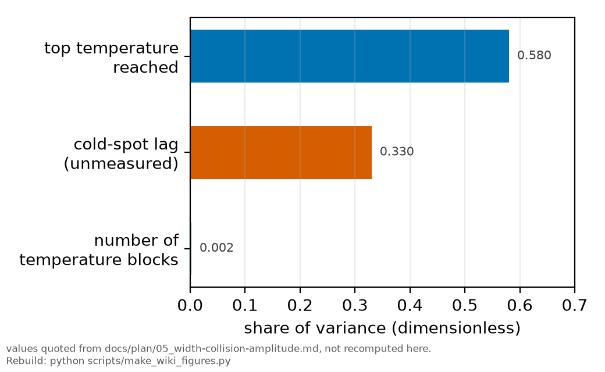
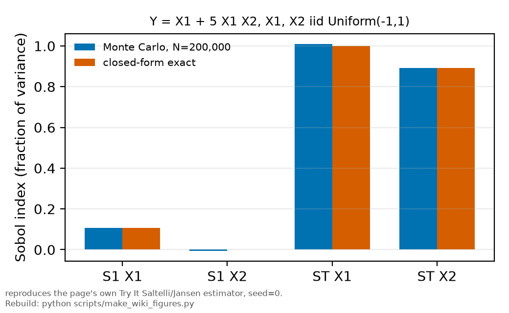

# Sensitivity analysis

*[wiki index](README.md) · method*

**The question.** Which input actually drives an output's variance, at one
point through a derivative or globally across the whole range every input
could plausibly take.
**Takes.** A model or a projection that can be evaluated repeatedly, or a fit
whose Jacobian is already in hand, and no assumption about which input
matters most.
**Gives.** Local sensitivity through error propagation and the Jacobian, why
one-at-a-time sweeps miss interactions, and the Sobol first-order and
total-effect indices that catch them.
**Skip if.** You want to know which single data point drives an
already-fitted result, not which input drives a projection. That is
[influence diagnostics](influence-diagnostics.md).

> **Unfamiliar with the vocabulary?** [GLOSSARY.md](../GLOSSARY.md)
> defines every term and symbol used anywhere in this repository.

## What it is

Sensitivity analysis asks how much an output changes when the inputs that
feed it change, and that question is answered in two different ways depending on how far the inputs are allowed to move.

Local sensitivity is a derivative. It asks how the output responds to an
infinitesimal wiggle of one input around a single point, usually the best
estimate an analysis already has, holding every other input fixed at its own
best estimate. This is exactly the calculation ordinary error propagation
runs: for a quantity $y = f(x_1, \dots, x_k)$,

$$\sigma_y^2 \approx \sum_i \left(\frac{\partial f}{\partial x_i}\right)^2 \sigma_{x_i}^2$$

for independent inputs, with cross terms added when they are not. Every term
in that sum is a local sensitivity, the partial derivative evaluated at one
point, multiplied by that input's own uncertainty. It costs on the order of
$k$ evaluations for $k$ inputs, often one if the derivatives come from a
fit's own Jacobian, and it is exactly right in the regime it is built for:
small deviations around a single realized point.

Global sensitivity gives up the single point. Instead of a derivative it
asks, across the whole plausible range of every input at once, how much of
the output's variance each input accounts for. The two questions coincide
only when the model is linear and every input stays a small perturbation
around the point evaluated, exactly the regime local sensitivity assumes
and global sensitivity does not need.

The cheapest way to approach the global question, one-at-a-time (oat)
variation, sweeps a single input across its range while holding every other
input at a baseline, then repeats for the next input. It costs one sweep per
input and is easy to read, but every other input sits frozen while the sweep
runs, so an effect that depends on two inputs moving together is invisible
to it: the swept input can look unimportant at the baseline and dominate the
output once its partner also moves.

Variance-based sensitivity, the Sobol decomposition, covers that surface.
For independent inputs drawn from stated distributions, the output's total
variance splits into a sum of pieces: a share attributable to each input
alone, a share to each pair acting together, each triple, and so on, all
mutually orthogonal so they add without double counting. Two summaries of
that decomposition matter in practice. The first-order index $S_i$ is the
share of the output's variance explained by input $i$ on its own, averaged
over every other input, so it is close to the reduction in variance expected
from learning input $i$'s true value and nothing else. The total-effect
index $S_{T_i}$ is $S_i$ plus every interaction term $x_i$ takes part in
with any other input, so it is the share of variance that would remain if
every input other than $x_i$ were fixed, the variance still coming from
$x_i$'s own movement including everything it interacts with. Summed over all
inputs, the first-order indices add to at most one, with equality only when
there is no interaction at all, and the total-effect indices add to at least
one whenever interactions exist, since a shared piece of variance counts
once for every input that shares it. A large gap between the two for one
input, $S_{T_i}$ well above $S_i$, means that input matters mainly through
interaction: an oat sweep of it alone, however finely spaced, would report
it as unimportant, because it only matters once a partner input moves too.

Sobol indices carry a real computational cost. Estimating them by the
standard Monte Carlo schemes needs on the order of $N(k+2)$ evaluations of
the model for $k$ inputs and a sample size $N$ typically in the thousands,
so a full run can reach hundreds of thousands of evaluations before the
indices settle down. A model that costs milliseconds to evaluate, a
closed-form projection formula among them, absorbs that easily. A model
that costs seconds, a nonlinear least-squares fit converging on real data,
does not, which is why global sensitivity suits the cheap calculation and
local sensitivity, via the Jacobian a fit already computes, suits the
expensive one.

## What problem it solves

Local sensitivity and one-at-a-time sweeps both rank inputs by how the
output moves at a single point or along single axes, and that ranking can
reverse once an input's own plausible range and its interactions with other
inputs are taken into account. An input with a large derivative can matter
little if its realistic range is narrow, and an input with a small
derivative can dominate if its range is wide or if it acts mainly through
another input, and neither case is visible from the derivative or the oat
sweep alone. Variance-based sensitivity works in the units the question is
actually asked in, the output's own variance, and apportions that variance
across the whole stated range of every input and every interaction among
them, which is what a design or a projection needs to decide where its
uncertainty budget should be spent.

## Where this repository uses it

A variance-based study has been run here, on the projected precision of the
next campaign, not a committed 2025 number. It decomposes the projection's
variance across the plausible range of every design input and ranks them,
and the ranking is in
[plan chapter 5](../plan/05_width-collision-amplitude.md). The top
temperature reached takes the largest share at 0.58 and the unmeasured
cold-spot lag takes 0.33, while the number of temperature blocks takes
0.002. Adding temperature blocks changes the projected precision by almost
nothing, so the case for a next campaign rests on reaching a higher top
temperature and on measuring the cold-spot lag. That is the same fact
[influence diagnostics](influence-diagnostics.md) reports from the other
side, since the lever is the spread of densities about their mean and the
hottest point dominates it.



*Share of the projected next-campaign precision's variance attributable to
three design inputs. Adding temperature blocks barely moves it.*

Local sensitivity is also used, implicitly, every time a
fitted quantity's uncertainty is propagated:
[`rb5s6s/fitutil.py`](../../rb5s6s/fitutil.py)'s `cov_from_jac` turns a
fit's own Jacobian, the matrix of partial derivatives at the point the
optimiser converged to, into a parameter covariance, and every downstream
module that reads that covariance, among them
[`rb5s6s/linefit.py`](../../rb5s6s/linefit.py),
[`rb5s6s/global_fit.py`](../../rb5s6s/global_fit.py),
[`rb5s6s/beta.py`](../../rb5s6s/beta.py) and
[`rb5s6s/ruler.py`](../../rb5s6s/ruler.py), is propagating local
sensitivities in exactly the sense [weighted least squares](weighted-least-squares.md)
describes. That is the right tool where it is used, because a converged fit
is a single point and the covariance is a statement about small deviations
around it.

The natural target for the global version is
[`scripts/run_projections.py`](../../scripts/run_projections.py), which
turns on the order of a dozen stated session parameters, drawn from
`docs/PLAN.md` and named beside their value in the script's own header, into
projected precisions across eight families, the fixed-lock pull channel and
beta_self among them. Every projection currently reads those parameters at
their single stated value, which is a local calculation in the same sense a
covariance is: it says what the projected precision looks like at the
planned session, not how sensitive that precision is to a parameter the plan
could reasonably have set differently. The useful question a variance
decomposition would answer instead is which design input, the beam waist,
the cycle time, the number of powers in the ladder, actually accounts for
most of the projected precision's variance across the range those parameters
could plausibly take, a different ranking than reading the formulas by eye
or nudging one parameter at a time.

## What can go wrong

The indices are a property of the chosen input distributions, not of the
model alone. Widening or narrowing the assumed range of an input changes its
first-order and total-effect indices even though nothing about the model
changed, so quoting a Sobol index without the input ranges it was computed
against reports a number that belongs to the assumption, not to the system
it describes. An unrealistically wide range inflates an input's apparent
importance, and an unrealistically narrow one hides it.

A second failure is data insufficiency that looks like a result. Sobol
indices are estimated by Monte Carlo, not returned exactly, and every
estimator above carries its own sampling error that shrinks with $N$ but
never reaches zero. Common estimators can even print a first-order index
slightly below zero for a genuinely small true index, since the estimator is
unbiased but not everywhere non-negative, so a single run at a modest $N$
can read sampling noise as if it were the answer instead of a sign that more
samples, or a check across more than one seed, are needed before the number
is trusted.

A third is implementation. The estimators mix samples from two independent
input matrices in a specific pattern, one matrix's column swapped into the
other for each input in turn, and swapping the wrong matrix into the wrong
formula, or reusing one base sample where two independent ones are required,
produces indices that look plausible individually while failing the one
cheap internal check the method offers against exactly this mistake, that
the first-order indices cannot sum to more than one.

Finally, the method's cost limits where it can be used. Thousands to
hundreds of thousands of model evaluations are cheap against a closed-form
or vectorized calculation and expensive against a fit that itself takes
seconds to converge, so pointing a global sensitivity study at the wrong
kind of model produces a computation that runs too long to be useful.

## Try it

A test function with a known interaction, so the indices computed below have
an exact answer to check against, not only each other. The function
$Y = X_1 + c X_1 X_2$, with $X_1$ and $X_2$ drawn independently and uniformly
on $[-1, 1]$, has
an exact Sobol decomposition: $X_2$ has no term of its own in the model, so
its first-order index is exactly zero, and every bit of its influence runs
through the interaction term $c X_1 X_2$. The Saltelli (2010) first-order
estimator and the Jansen (1999) total-effect estimator computed below
recover that: $X_2$'s first-order index lands near zero while its
total-effect index lands far above it, entirely from the interaction with
$X_1$ that a one-at-a-time sweep of $X_2$ alone would never see.



*First-order and total-effect Sobol indices for the worked interaction
model on this page. X2 has no first-order effect but a large total effect
through its interaction with X1.*

```python
import numpy as np


def model(x1, x2, c):
    return x1 + c * x1 * x2


def sobol_indices(c, n, seed=0):
    rng = np.random.default_rng(seed)
    a = rng.uniform(-1.0, 1.0, size=(n, 2))
    b = rng.uniform(-1.0, 1.0, size=(n, 2))

    ya = model(a[:, 0], a[:, 1], c)
    yb = model(b[:, 0], b[:, 1], c)
    var_y = np.concatenate([ya, yb]).var()

    s1, st = {}, {}
    for i, name in enumerate(("x1", "x2")):
        ab = a.copy()
        ab[:, i] = b[:, i]
        yab = model(ab[:, 0], ab[:, 1], c)
        # Saltelli (2010) first-order and Jansen (1999) total-effect estimators
        s1[name] = 1.0 - np.mean((yb - yab) ** 2) / (2.0 * var_y)
        st[name] = np.mean((ya - yab) ** 2) / (2.0 * var_y)
    return s1, st


c = 5.0
n = 200_000
s1, st = sobol_indices(c, n)

var_x = 1.0 / 3.0
var_interaction = c ** 2 / 9.0
var_total = var_x + var_interaction
s1_x1_exact = var_x / var_total
s1_x2_exact = 0.0
st_x1_exact = 1.0
st_x2_exact = var_interaction / var_total

print(f"model: Y = X1 + {c:.0f} * X1 * X2, X1, X2 iid Uniform(-1, 1)")
print(f"{n} pairs of Monte Carlo samples, Saltelli/Jansen estimators")
print()
print(f"X1: S1 = {s1['x1']:.3f} (exact {s1_x1_exact:.3f})  "
      f"ST = {st['x1']:.3f} (exact {st_x1_exact:.3f})")
print(f"X2: S1 = {s1['x2']:.3f} (exact {s1_x2_exact:.3f})  "
      f"ST = {st['x2']:.3f} (exact {st_x2_exact:.3f})")
print()
print("X2 has no effect on its own (S1 near zero, exactly zero in the model)")
print("but a large effect through its interaction with X1 (ST far above S1):")
print("varying X2 one at a time, with X1 fixed, would call it unimportant.")
```

Every snippet on these pages is executed by
`tests/test_wiki_snippets_run.py`, so one that stops working fails the suite
instead of sitting here misleading a reader.

## Further reading

- I. M. Sobol', "Global sensitivity indices for nonlinear mathematical
  models and their Monte Carlo estimates," *Mathematics and Computers in
  Simulation* 55, 271-280 (2001), the paper the first-order and total-effect
  variance decomposition used here is named after.
- A. Saltelli, P. Annoni, I. Azzini, F. Campolongo, M. Ratto and S.
  Tarantola, "Variance based sensitivity analysis of model output. Design
  and estimator for the total sensitivity index," *Computer Physics
  Communications* 181, 259-270 (2010), the source of the first-order and
  total-effect estimator pair implemented in the Try it section above.
- A. Saltelli et al., *Global Sensitivity Analysis: The Primer* (Wiley,
  2008), the standard book-length treatment, including one-at-a-time
  variation and why it is not a substitute for a variance decomposition.
- [Weighted least squares](weighted-least-squares.md), whose closing section
  names case-deletion diagnostics, robust fitting and global sensitivity as
  the family this page belongs to, and whose Jacobian-based covariance is
  the local sensitivity this page contrasts against.
- [`scripts/run_projections.py`](../../scripts/run_projections.py), the
  projection machinery a global sensitivity study would be run against.

## See also

- [Influence diagnostics](influence-diagnostics.md), the same which-input-
  matters question, asked locally of a fit already run, not globally
  of a projection.
- [Resampling](resampling.md), another Monte Carlo construction, and the
  cost trade-offs that decide when either one is affordable.
- [Robust fitting](robust-fitting.md), for what to do once local sensitivity
  flags a fit that depends too much on one input.

---

[← Heavy-tailed models](heavy-tailed-models.md) · *Robustness and influence, 5 of 7* · [Confounding by acquisition order →](confounding-by-acquisition-order.md)
