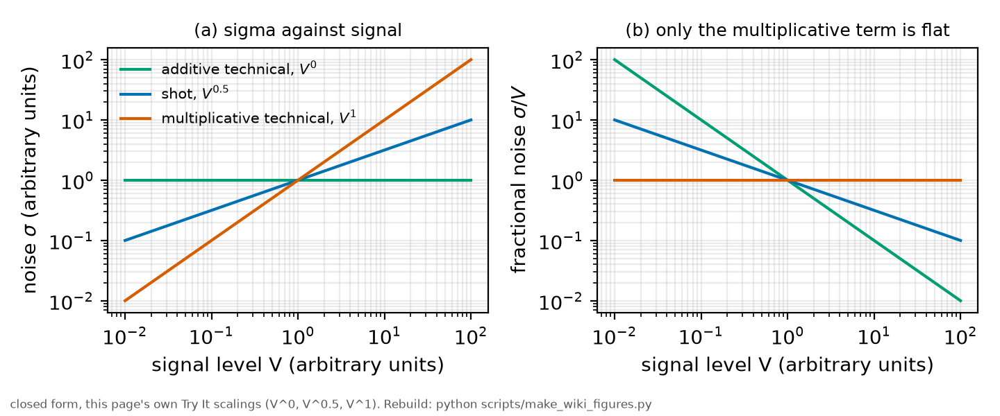

# Shot noise and technical noise

*[wiki index](README.md) · concept*

**The question.** Whether a measurement's noise is the irreducible statistics
of the quanta counted, or something the apparatus adds.
**Takes.** Measurements at several settings of a control an experimentalist
can change.
**Gives.** The scaling test that separates the two, and what to fix once it
does.
**Skip if.** The question is the variance's functional form against signal,
which is [the noise law](the-noise-law.md).

> **Unfamiliar with the vocabulary?** [GLOSSARY.md](../GLOSSARY.md)
> defines every term and symbol used anywhere in this repository.

## What it is

**Shot noise** is the counting statistics of discrete events. Photons arrive
as a Poisson process, so collecting $N$ of them gives a variance of $N$ and a
fractional uncertainty of $1/\sqrt{N}$, a property of the quanta alone,
changed only by collecting more.



*The three noise scalings and their fractional-noise signatures, the test
this page runs on the committed noise law.*

**Technical noise** is everything the apparatus adds: amplifier and Johnson
noise, digitiser quantisation, laser intensity fluctuations, mechanical
drift. It is not fundamental, and its remedy differs by source.

The distinction matters. A shot-limited measurement improves only with more
signal or time. A technically limited one improves only by fixing the
apparatus, and collecting longer may not help.

## The scaling test

What separates them is how each responds when a control changes.


*Allan deviation of a white-noise record and a random-walk record, resolving
by their averaging slope what a plain standard deviation cannot.*

**Against the signal level.** Shot noise grows as the square root of the
signal, so its fractional noise falls as it rises. A multiplicative
technical noise, such as laser intensity fluctuation, grows with the signal,
so its fractional noise stays constant. An additive technical noise does not
grow at all. These are the three terms of
[the noise law](the-noise-law.md), and fitting it runs this test.

**Against averaging.** Shot noise falls as the square root of the sample
count, indefinitely. Technical noise with a long correlation time averages
down only until the window reaches that time, after which longer averaging
does nothing: a measurement whose uncertainty stops improving with time is
technically limited by definition.

**Against a control that moves the signal without moving the apparatus.**
This is the sharpest version: a comparison built for the purpose, not a fit.
If a control changes the number of quanta collected
without touching the chain, the noise must track the square root of the
signal. A departure is technical, and its direction names the class.

## What problem it solves

It decides where work goes, and the two answers are expensive in different
ways.

## Where this repository uses it

The scaling test runs in both directions on the committed noise law.

**The shot term is confirmed as shot.** Its coefficient is flat against laser
power across the four hyperfine lines, with log-log exponents between
$-0.08$ and $+0.10$, a detection-chain property, independent of the
condition.

**The excess term is essentially absent**, needed in one condition of
thirty-two, so it is not limiting here, and stabilising the laser's
amplitude would not help.

**The floor did not pass the test.** A floor is signal-independent by
construction, yet this one rises with laser power on every line: an optical
background that scales with the drive, not instrumental noise. The same
holds for the directly measured off-line noise, which is not fitted at all.

The noise is correlated over several samples, so it averages down more
slowly than the sample count suggests, a correction covered on
[its own page](correlated-samples-and-effective-sample-size.md).

## What can go wrong

**Concluding from one setting.** A single condition cannot separate the
scalings: the control must vary enough that the predicted behaviours differ
by more than the uncertainty.

**Confusing a fitted floor with an instrumental one.** The model's floor is
whatever does not scale with the fitted signal, including optical
backgrounds scaling with something else.

**Assuming shot noise is the best case.** It is the best case only for a
given photon count, and collection efficiency, an apparatus property, remains
open to technical improvement.

**Forgetting the detector's own multiplication noise.** A photomultiplier's
gain process adds excess variance above Poisson by a tube-fixed factor, so a
measurement can be limited by counting statistics and still sit a fixed
factor above the ideal Poisson bound.

## Try it

How the three behaviours separate as signal varies, and how quickly.

```python
import math

for name, exponent in (("additive technical", 0.0),
                       ("shot", 0.5),
                       ("multiplicative technical", 1.0)):
    row = [f"{(V ** exponent):8.3f}" for V in (0.01, 0.1, 1.0, 10.0)]
    print(f"{name:26s} sigma at V=0.01,0.1,1,10: " + " ".join(row))
print("\nfractional noise, which is what a measurement actually feels:")
for name, exponent in (("additive technical", 0.0),
                       ("shot", 0.5),
                       ("multiplicative technical", 1.0)):
    row = [f"{(V ** (exponent - 1)):8.2f}" for V in (0.01, 0.1, 1.0, 10.0)]
    print(f"{name:26s} " + " ".join(row))
print("\nonly the multiplicative one is flat: that is its signature")
```

Every snippet on these pages is executed by `tests/test_wiki_snippets_run.py`,
so one that stops working fails the suite instead of sitting here misleading
a reader.

## Further reading

- A. van der Ziel, *Noise in Solid State Devices and Circuits* (Wiley, 1986),
  for technical noise taxonomy.
- P. R. Bevington and D. K. Robinson, *Data Reduction and Error Analysis for
  the Physical Sciences*, 3rd ed. (McGraw-Hill, 2003), for Poisson
  statistics.

## See also

- [The noise law](the-noise-law.md), parametrising the three behaviours
- [Correlated samples and effective sample size](correlated-samples-and-effective-sample-size.md),
  the averaging half of the test
- [Photon counting](photon-counting.md), where shot noise is counted, not
  inferred
- [Digitisation and dynamic range](digitisation-and-dynamic-range.md), for
  one technical contribution

---

[← The noise law](the-noise-law.md) · *Noise and its management, 2 of 6* · [Correlated samples and effective sample size →](correlated-samples-and-effective-sample-size.md)
