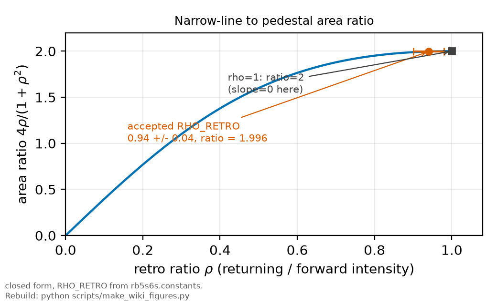

# Standing waves

*[wiki index](README.md) · physical effect*

**The question.** What the same retro-reflected beam that cancels the
Doppler shift does to the intensity pattern the atoms sit in, and how that
splits between the fringe-resolved and fringe-averaged regimes.
**Takes.** The retro-reflected two-photon geometry from
[Doppler-free two-photon spectroscopy](doppler-free-two-photon.md). No
fitting, no data.
**Gives.** The fringe-resolved and fringe-averaged limits, the retro ratio,
and the area ratio between the Doppler-free line and its same-beam pedestal.
**Skip if.** You want the frequency cancellation itself: see
[Doppler-free two-photon spectroscopy](doppler-free-two-photon.md). This
page covers the spatial pattern it rides on.

> **Unfamiliar with the vocabulary?** [GLOSSARY.md](../GLOSSARY.md)
> defines every term and symbol used anywhere in this repository.

## What it is

Retro-reflecting a laser beam back through itself sends two waves of the
same frequency through the same volume in opposite directions. Their
superposition does not travel: the two fields add with a position-dependent
phase, so the intensity is fixed in space, bright antinodes and dark nodes
spaced at half the optical wavelength. The half comes from the round trip,
not the reflection alone: a forward wave has phase $kz$, the returning
wave $-kz$, and their difference advances by $2k$ per unit length, so the
pattern repeats every $\lambda/2$, twice as often as either wave alone.

An atom moving through that pattern falls into one of two regimes, decided
by timescale, not geometry. A slow or nearly transverse atom crosses a
negligible fraction of one fringe during its response time, so it sits at
essentially one point of the standing wave and reads whatever intensity is
there: fringe-resolved, an ensemble of such atoms carrying the fringe's
spatial structure into the signal. A fast axial atom instead sweeps through
many fringes within that same response time, so only the mean intensity
survives to lowest order: fringe-averaged. The two limits bracket every
real ensemble, always a thermal mixture of transverse and axial motion, and
the fraction in each regime is set by the ratio of the fringe-crossing rate
to the atom's response rate.

The retro ratio is the fraction of forward power returned to the atoms after
every loss along the retro path, mirror reflectivity, window and lens
passes, and imperfect overlap between the outgoing and returning modes.
It is a number between zero and one for any real retro-reflector, one
only in the lossless, perfectly mode-matched limit.

A counter-propagating geometry also drives two-photon absorption through
two distinct channels. An atom can take one photon from each beam, a cross
term that cancels the atom's velocity because the two photons carry
opposite first-order Doppler shifts, producing the narrow, Doppler-free
line. Or it can take both photons from the same beam, a same-beam term
whose photons carry the same Doppler shift: nothing cancels, and the
ensemble produces a broad pedestal beneath the narrow line. Both channels
run on the same two beams, so their relative strength is a function of the
retro ratio alone, largest when the two beams are equally strong and
falling away as either one dominates.

Write the forward intensity as $I$ and the backward as $\rho I$. The
same-beam channel runs on each beam separately, so its rate goes as
$I^2 + (\rho I)^2$. The cross channel takes one photon from each beam, and
the two assignments of which photon comes from which beam are
indistinguishable, so they add in the amplitude and the rate carries the
square of that sum, $4 I \cdot \rho I$. The ratio of the narrow line's
area to the pedestal's is the quotient,

$$\frac{4\rho}{1+\rho^2},$$

which is 2 at a perfect retro reflector: with equally strong
counter-propagating beams the Doppler-free line carries twice the area of
the pedestal beneath it, from the interference of two indistinguishable
excitation pathways.

## What problem it solves

A retro-reflected geometry is required for Doppler-free two-photon
spectroscopy: the cancellation needs both counter-propagating beams, so
the standing wave and its same-beam pedestal are unavoidable. What the
fringe-resolved and fringe-averaged limits settle is whether the standing
wave's spatial structure must be carried explicitly through a lineshape
calculation, or safely collapses to its mean, the difference between a
model with one extra parameter distribution and one without. Because the
two absorption channels share the same retro ratio, the pedestal's size
relative to the narrow line is a second observable: a measured departure
from the predicted ratio constrains the retro ratio itself.

## Where this repository uses it

[`rb5s6s.constants.RHO_RETRO`](../../rb5s6s/constants.py) holds the
assumed retro power ratio, 0.94 with an uncertainty of 0.04, a design
assumption with no bench measurement behind it. The retro path is built to
be self-imaging so the forward and returning modes match by construction,
but loss at every extra surface and any residual misalignment push the
real ratio below the ideal value of one. Every absolute AC-Stark
prediction scales with $(1+\rho)$, so this constant enters
[the AC-Stark shift](ac-stark-shift.md) directly.


*The standing wave's intensity pattern, its fringe-averaged mean, and the
fringe amplitude above that mean.*

The fringe-averaging argument is worked out in
[THEORY_NOTE.md](../THEORY_NOTE.md): the coupling that drives the
Doppler-free line is uniform along the standing wave, so only the AC-Stark
shift fringes, and a fast axial atom's modulation index at that shift
depth is small enough to put the effective intensity at the fringe mean,
the fringe-averaged limit applied here. A frozen-fringe simulation of the
weak-excitation amplitude along each trajectory (module
`rb5s6s/ramp_transit.py`) recovers that mean in both
the fast-sweep and frozen-fringe limits to about a tenth of a per cent,
independent of the quasi-static assumption. The fringe-resolved tail left
over from near-transverse atoms does not move that mean, but it suppresses
the line's third moment, a smaller effect documented in the same note.

That tail is in the twin's world since 2026-09-08.
[`fringe_tail.fringe_shift_density`](../../rb5s6s/fringe_tail.py) returns the
fringe-resolved shift density from the same draws the moment calculation
pools, and [`lineshape.ramp_mixture`](../../rb5s6s/lineshape.py) convolves it
as an axial mixture, so a forecast trace carries the line this bench would
produce and not the pure transverse ramp's. Measured on the quiet curve, the
ramp's mean pull falls to
[0.9775](../../results/three_channel_forecast.csv "ref:three_channel_forecast:waist_64um::pull_factor_quiet")
of the pure form at the measured waist and
[0.5752](../../results/three_channel_forecast.csv "ref:three_channel_forecast:base::pull_factor_quiet")
at the 16 micron configuration, the collection window carrying most of that
movement and the fringe tail the rest.

The one open modelling choice travels with the density. The window over which
the excitation amplitude stays coherent is bracketed between the
transit-limited cap and the 6S lifetime and never corrected for, a factor of
eleven in the fraction of atoms slow enough to freeze a fringe, so the density
refuses to be called without naming which end it takes. The sweep-rate
producer carries both ends as end-members of its envelope: at the campaign's
tightest licensed waist that excursion is
[0.0021](../../results/sweep_linearity.csv "ref:sweep_linearity:campaign_40um:rate_variation_tolerance_coherence_err")
per cent of rate variation, most of that case's whole band.

The wide-scan design in the fixed-lock proposal uses the same physics as a
diagnostic. [The fixed cavity lock chapter](../plan/09_the-fixed-lock.md)
checks that the drive depth chosen to null the sideband comb does not also
null the same-beam term, since that would break the wide scan's purpose,
and confirms the two channels share one Bessel law.
[§10c.7](../plan/10_the-fixed-lock-instrument.md) and
[`scripts/run_widescan_design.py`](../../scripts/run_widescan_design.py)
carry the area ratio forward on the same traces as the line itself. That
ratio is stationary in the retro ratio near unity, so it reads the ratio only
under a retro attenuator scan, which the plan's open-items chapter carries.

### A tilt is an offset, and the offset is what the fringes feel

The retro ratio above absorbs "imperfect overlap" into a single number, which is
right for the channel arithmetic and hides the geometry that produces it. A
mirror tilt $\theta$ does not simply reduce a ratio. Through a retro lens it
reaches the atoms as a lateral **offset** as well, and on this bench, a mirror
about 50 mm from an $f = 150$ mm lens, the conversion is **300 mm of offset per
radian of tilt**. The beams therefore walk apart in position three hundred times
faster than they tilt, and it is the walking apart that matters.

Two consequences. The residual two-photon wave-vector $2k\sin(\theta/2)$ returns
a Doppler width to the narrow line, about 0.45 MHz per milliradian at 110 °C.
And the standing wave itself stops being clean, by three mechanisms at once: the
local contrast $2\sqrt{I_1I_2}/(I_1+I_2)$ is unity only on the bisector once the
beams are offset, the fringe planes rotate by $\theta/2$ and gain a transverse
period $\lambda/\sin\theta$, and near the focus the two wavefronts no longer
match.

**The fringe-resolved suppression this page quotes is a contrast-weighted
quantity, so all three reach it, and the Monte Carlo behind it assumes a perfect
retro.** A generalised one, `fullmodel.fringe_survival_mc`, carries the beam
quality, the tilt and the offset, and reduces to the contrast above when all
three are ideal. It separates them: the tilt angle is negligible, since
$k\sin\theta$ is four orders below the axial $2k$ and 0.5 mrad moves the mean
survival by under 2 per cent, while an offset of one waist takes the mean
contrast from 0.9995 to 0.836, both at the bench's retro ratio `RHO_RETRO`. The function's own default is a perfect retro, where the contrast is one by construction and the pair does not reproduce. Beam quality acts through the axial sampling, the
mean radius over the collected region rising from 1.011 to 1.083 waists at
$M^2 = 3$. **A tilt reaches the fringes through the offset it produces and not
through its angle.** The wavefront mismatch remains unmodelled, so these are an
upper bound on the fringe effect at non-zero tilt.

**And the retro ratio cannot supply the bound.** The value this repository
carries is an assumption, recorded as never informed by these data, and the
area ratio that would measure it needs the Doppler pedestal, which is 931 MHz
wide against archive traces spanning under 100. What does bound the tilt is the
narrow line's own presence: at 90 per cent of aligned strength the tilt is under
0.069 mrad, and even at one per cent it stays under 0.46.

## What can go wrong

The most common model failure is a factor-of-two slip in the fringe
period: the pattern's spacing is $\lambda/2$ because it is set by the
round-trip phase, and treating it as $\lambda$ mislabels every fringe and
shifts any node-antinode argument by half a period.

The AC-Stark shift fringes with position because it follows the total
field intensity, but the Doppler-free coupling does not, driven instead by
a cross term that stays uniform along the standing wave. Assuming both are
governed by the same spatial pattern, or that a fringe-averaged treatment
of the shift also settles the coupling, produces conclusions about the
lineshape the underlying physics does not support.

A data-insufficiency limit is built into the area-ratio diagnostic itself.
The ratio is stationary at a retro ratio of one, so its sensitivity to a
change vanishes exactly where a well-aligned retro-reflector is expected
to sit, and a pedestal measured to some fractional precision constrains
the retro ratio far more loosely than the same precision would suggest
away from that point. A small departure from the value of record is the
hardest to catch this way.

Finally, an experimental limitation shared by any pedestal-based
measurement: the same-beam channel must be separated from whatever broad,
non-atomic background sits under it, stray and scattered light in
particular, before its area means anything. A pedestal not isolated from
that background reads as a retro ratio too large, since scattered light
adds area the standing-wave physics did not produce.

## Try it

The narrow-to-pedestal area ratio and its slope, evaluated at a perfect
retro reflector and at the accepted value.



*The area ratio against the retro ratio, with the accepted value and its
rho=1 maximum marked.*

```python
from rb5s6s import RHO_RETRO


def area_ratio(rho):
    return 4.0 * rho / (1.0 + rho ** 2)


def area_ratio_slope(rho):
    return 4.0 * (1.0 - rho ** 2) / (1.0 + rho ** 2) ** 2


for rho, label in ((1.0, "perfect retro"), (RHO_RETRO, "accepted RHO_RETRO")):
    print(f"rho = {rho:.3f} ({label}): area ratio = {area_ratio(rho):.4f}, "
          f"slope = {area_ratio_slope(rho):+.4f} per unit rho")
print("the slope vanishes at rho = 1, so the ratio is a weak monitor near it")
```

## Values that moved
A tilt tolerance for the retro-reflector was once computed from the
same-beam term's coefficient, which carries the wavevector sum $2k$, when
the mechanism is the cross term, whose sum for a small tilt $\theta$ is
$k\theta$, half of it. The tolerance quoted above is the recomputed one.
the private correction record carries the figure that was replaced.

## Further reading

- [`../lit/stalnaker2006.md`](../lit/stalnaker2006.md), which supplies the
  frequency-modulation framework behind the fringe-averaged, small
  modulation-index limit used above.
- [`../lit/biraben1974.md`](../lit/biraben1974.md), the founding
  demonstration of a retro-reflected two-photon geometry, including the
  polarisation control that isolates the same-beam pedestal from the
  Doppler-free line.
- [Doppler-free two-photon spectroscopy](doppler-free-two-photon.md), for
  the cancellation the cross term performs and the pedestal it leaves
  behind.
- [The AC-Stark shift](ac-stark-shift.md), for what the fringe-averaged
  mean feeds into once the standing wave is resolved as a beam geometry.

## See also

- [Doppler-free two-photon spectroscopy](doppler-free-two-photon.md), the
  frequency cancellation the cross term performs, which this page's
  fringes ride on.
- [The AC-Stark shift](ac-stark-shift.md), what the fringe-averaged mean
  feeds once the standing wave is resolved.
- [Doppler-free geometries](doppler-free-geometries.md), the general
  wavevector-closure rule behind the retro-reflected geometry.

---

[← Doppler-free two-photon spectroscopy](doppler-free-two-photon.md) · *Experimental spectroscopy, 2 of 11* · [The Voigt profile →](voigt-profile.md)
