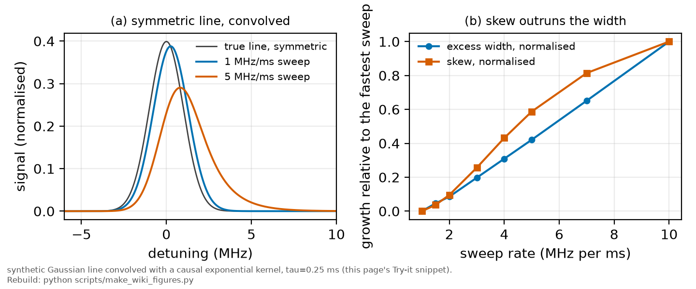

# Sweep rate and detection lag

*[wiki index](README.md) · physical effect*

**The question.** How does a fast continuous sweep forge width and
asymmetry that a slow one would not, and how is that instrumental
component separated from the atoms' own.
**Takes.** That a fit reads skew as light-shift information, established
in [The third cumulant](third-cumulant.md) and assumed here, not
re-argued.
**Gives.** The regression of apparent width against inverse sweep rate,
the causal-kernel argument for why a lag forges asymmetry and not only
width, and the two-rate design this repository specifies.
**Skip if.** The question is how densely a line is sampled, not how
fast it can be crossed, a case covered by
[Designing an acquisition](designing-an-acquisition.md).

> **Unfamiliar with the vocabulary?** [GLOSSARY.md](../GLOSSARY.md)
> defines every term and symbol used anywhere in this repository.

## What it is

A line can be measured two ways. Step and settle parks the laser at one
frequency, waits for the detector to settle, and records a steady reading,
so every point measures the line alone. A continuous sweep instead moves
the frequency throughout the record, so every sample carries a residue of
the detector's response to what the light was doing an instant before:
no real detector reports a change in optical power instantly.



*Simulated effect of a fixed detector time constant at two sweep rates:
skew grows faster than width.*

The trace a continuous sweep records is the true line convolved with the
detector's response, the convolution taken in time because the response is
a property of the electronics reacting moment to moment, not of frequency.
A fit that converts the time axis to a frequency axis through the sweep
rate and reads the convolved trace as the line itself reports a width that
is too large: it is measuring a convolution, not the line.

The scaling follows from timing alone. Crossing a true linewidth $\Delta\nu$
at rate $R$ (frequency per unit time) takes a time $\Delta\nu / R$, the
line's own contribution to how long the feature lasts on the oscilloscope.
The detector adds a further smearing set by its electronics, a rise time
or integration window, call it $\tau$, independent of how fast the laser
moves. The apparent width on the time axis is therefore close to

$$w(R) \approx \frac{\Delta\nu}{R} + \tau$$

linear in $1/R$, with slope $\Delta\nu$ and intercept $\tau$. Regressing the
apparent time-width against $1/R$ at several rates recovers both
quantities from one dataset: the slope is the physical width, and the
intercept is the lag the electronics contribute regardless of speed.

A detector or amplifier responds only to what already happened, so its
impulse response is causal: one-sided in time, zero before the event and
decaying after it. Convolving a symmetric line with a one-sided kernel
smears one side of the trace more, so an asymmetric trace is what a
symmetric line looks like once such a response has acted on it. A
detection lag therefore forges asymmetry, not only width, in the one
observable a light-shift measurement is built to read. The separation
works as for the width: a physical asymmetry belongs to the line
regardless of sweep speed, while an instrumental one belongs to the
response, growing with sweep rate and reversing with sweep direction.
Measuring the same line at several rates separates a real asymmetry from a
manufactured one, and neither a better model nor more averaging at one
rate substitutes for the comparison across rates.

## What problem it solves

A single trace, taken at one sweep rate, cannot tell a physical width and
asymmetry apart from an instrumental one: both a real line and a convolved
one produce a trace some model can fit. Sweeping the same line at more
than one rate resolves the ambiguity: a component that scales with rate is
the acquisition, one that does not is the atoms.

This differs from how densely a line is sampled, covered by
[designing an acquisition](designing-an-acquisition.md): how many points
sit across a feature at a given span and record length. This page asks how
fast those points can be taken before the detection chain's response time
writes itself into their shape, and both questions must be answered before
a scan rate is chosen.

## Where this repository uses it

[Section 10c.3 of the fixed-lock chapter](../plan/09_the-fixed-lock.md)
specifies a two-speed sweep, slow across each line and fast between them:
the slow segment is required because a detection lag degrades the
standardised skew faster than the width, the channel the light-shift
measurement reads, as [the third cumulant](third-cumulant.md) sets out.
[Section 10c.10 of the following
chapter](../plan/10_the-fixed-lock-instrument.md) makes the regression a
design requirement: the two sweep rates run interleaved within each
block, nothing else changed, since the separation needs the same line at
several rates.


*The LeCroy WaveSurfer 3104z used in the 2025 campaign. Its ERes math
function is the zero-phase filter this page's parity argument
distinguishes from a causal one.*

Nothing on this page has been run on real data. The 2025 campaign acquired
at a single sweep rate throughout, so the rate-scaled and rate-independent
components have never been separated. The separation is a design of the
next session, and the paragraph above states a requirement, not a result.

One instrument detail decides whether the rate-scaled component exists at
all. A causal smoothing filter delays the trace by about half its window,
so its lag is rate-scaled and the two halves of a triangular sweep split
symmetrically about the true centre. A zero-phase filter, what the
LeCroy's ERes math function specifies, produces no delay and no splitting,
so the same design measures a lag on one instrument and confirms its
absence on the other, covered further in
[resolution enhancement and what it costs](resolution-enhancement-and-what-it-costs.md).

## Triangle-branch differencing

Everything a causal detection chain does to a swept line changes sign with
the sweep direction. Everything atomic does not care which way the laser
walked. The difference of the two triangle halves reads the lag, their
mean cancels it exactly, and neither number depends on the lineshape
model. The failure modes a dirty flip brings are covered in
[reversal tests](reversal-tests.md).

## What can go wrong

The first failure is a model one. The scaling assumes a single,
first-order response with one timescale, and a real detection chain,
photodiode, transimpedance stage, any following filter, can have more than
one time constant or a non-exponential response. The qualitative
separation holds as long as the instrumental component is
rate-scaled and the physical one is not, but the intercept then no longer
maps onto one clean number the way the formula suggests.

The second failure is data insufficiency. Two rates too close together
barely move the apparent width or skew, and a regression through two
similar points is dominated by noise, not the line, so a fitted slope or
intercept can look plausible without constraining either quantity. A
spread of rates, plus a check that the intercept vanishes when no lag is
present, turns the regression into an actual test, not a curve through too
few points.

The third failure is conflating two different reasons for a second sweep
rate. [Section 10c.3 of the fixed-lock chapter](../plan/09_the-fixed-lock.md)
and this page are about a detection lag that inflates width and forges
skew. [Section 10b.6 of the acquisition record](../plan/08_the-acquisition-record.md)
asks for a second rate for an unrelated reason, that a laser linewidth
accumulates over the time the scan takes to cross the line while a
collisional width does not, so the two rates there separate a laser
contribution from a collisional one. A pair of rates chosen to test one of
these does not automatically test the other.

The fourth failure is a distinct mechanism that mimics this one. A
rate-scaled detection lag is not the only route to a convolution that
fakes an asymmetry: correlated amplitude and frequency noise on the
driving light produces an asymmetric field spectrum of its own, and the
measured line is that spectrum convolved with the atomic response, skewing
the line with no detector involved, documented in
[Camparo and Klimcak](../lit/camparo1992b.md). That route does not scale
with sweep rate, so the multi-rate regression cannot see it, and needs its
own discriminator: it does not scale with the optical power at the atoms
the way a light shift does.

## Try it

A synthetic symmetric line convolved with a one-sided exponential response
at two sweep rates, with a fixed detector time constant. The half-maximum
width and the skew both grow with rate, and the skew, zero for the true
line, grows far faster than the width.

```python
import numpy as np


def gaussian(x, sigma):
    y = np.exp(-0.5 * (x / sigma) ** 2)
    return y / np.trapezoid(y, x)


def causal_exponential(x, scale):
    """A one-sided response kernel: zero for x < 0, decaying for x >= 0."""
    y = np.where(x >= 0, np.exp(-x / scale), 0.0)
    return y / np.trapezoid(y, x)


def fwhm(x, y):
    half = y.max() / 2.0
    above = x[y >= half]
    return above[-1] - above[0]


def skewness(x, y):
    """Third standardised moment of y(x), treated as a density."""
    p = y / np.trapezoid(y, x)
    mean = np.trapezoid(x * p, x)
    var = np.trapezoid((x - mean) ** 2 * p, x)
    m3 = np.trapezoid((x - mean) ** 3 * p, x)
    return m3 / var ** 1.5


dx = 0.01
x = np.arange(-60.0, 60.0, dx)                  # MHz, a synthetic axis
true_line = gaussian(x, sigma=1.0)               # the true, symmetric line
true_fwhm = fwhm(x, true_line)
print(f"true line: FWHM = {true_fwhm:.3f} MHz, skew = "
      f"{skewness(x, true_line):+.4f} (symmetric)")

tau_ms = 0.25                                    # a fixed detector time constant
results = []
for rate in (1.0, 5.0):                          # MHz per ms
    lag_mhz = tau_ms * rate                      # the fixed lag, read on this axis
    kernel = causal_exponential(x, lag_mhz)
    trace = np.convolve(true_line, kernel, mode="same") * dx
    w, s = fwhm(x, trace), skewness(x, trace)
    results.append((rate, w, s))
    print(f"rate {rate:>4.1f} MHz/ms: apparent FWHM = {w:.3f} MHz "
          f"({(w / true_fwhm - 1) * 100:+.1f}% over true), skew = {s:+.4f}")

(r1, w1, s1), (r2, w2, s2) = results
width_growth = (w2 - true_fwhm) / (w1 - true_fwhm)
skew_growth = s2 / s1
print(f"from {r1:.0f} to {r2:.0f} MHz/ms the width excess grew "
      f"{width_growth:.1f}x and the skew grew {skew_growth:.1f}x: "
      "the asymmetry is the more sensitive of the two")
```

Every snippet on these pages runs in `tests/test_wiki_snippets_run.py`, so a
broken one fails the suite instead of misleading a reader here.

## Further reading

- [Camparo and Klimcak](../lit/camparo1992b.md), the correlated
  amplitude-and-frequency-noise mechanism that convolves a driving field's
  own asymmetric spectrum into the line without any detector involved.
- P. Horowitz and W. Hill, *The Art of Electronics*, 3rd ed. (Cambridge
  University Press, 2015), for amplifier bandwidth, rise time, and the
  first-order response this page's lag kernel stands in for.
- [Wikipedia: exponentially modified Gaussian
  distribution](https://en.wikipedia.org/wiki/Exponentially_modified_Gaussian_distribution),
  the closed form for a line convolved with a one-sided exponential.
- [The third cumulant](third-cumulant.md), for the cumulant-additivity
  argument that makes skew a clean channel for an asymmetric mechanism.
- [Designing an acquisition](designing-an-acquisition.md), the raw-storage
  and per-sweep timestamp requirements a multi-rate regression needs to run
  at all.

## See also

- [The third cumulant](third-cumulant.md), for why skew is the channel a
  light-shift fit reads.
- [Designing an acquisition](designing-an-acquisition.md), the companion
  question of point density, not sweep speed.
- [The wavemeter and the frequency axis](the-wavemeter-and-the-frequency-axis.md),
  the previous page, for the calibration this convolution builds on.
- [Photon counting](photon-counting.md), the next page, another
  detection-chain property mistaken for the atoms' own signal.

---

[← Laser frequency noise and the linewidth](laser-frequency-noise-and-the-linewidth.md) · *Driving, modulating and detecting, 5 of 8* · [Designing an acquisition →](designing-an-acquisition.md)
