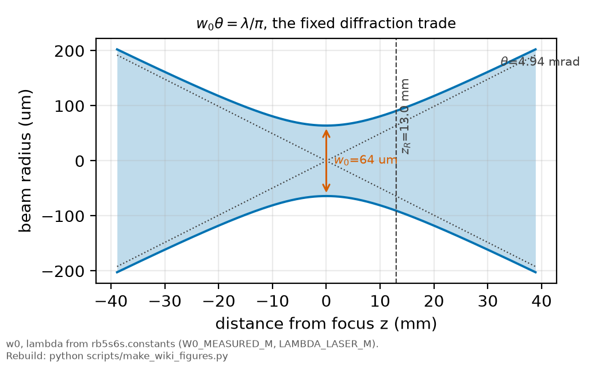

# The beam waist

*[wiki index](README.md) · concept*

**The question.** What the beam waist is, why it stands between a measured
power and the intensity an atom feels, and how confidently this repository
knows its value.
**Takes.** Nothing beyond the idea of a focused beam, and no fitted data of
its own.
**Gives.** The waist's defining relations, its opposite-signed pull on the
light shift and the transit width, and the value of record's provenance.
**Skip if.** You want what the waist does to the line shape, not the length
itself, covered in [the AC-Stark shift](ac-stark-shift.md).

> **Unfamiliar with the vocabulary?** [GLOSSARY.md](../GLOSSARY.md)
> defines every term and symbol used anywhere in this repository.

## What it is

A focused beam narrows to a minimum radius before spreading out again. That
minimum, $w_0$, is the beam waist, the radius at which the on-axis
intensity has fallen to $1/e^2$ of its peak. A bare "beam diameter" leaves a
reader guessing between a radius and a diameter, and among three
definitions of "edge".



*Beam radius about the waist, with the Rayleigh range and far-field divergence angle marked.*

The waist sets two further lengths through diffraction: the Rayleigh range

$$z_R = \frac{\pi w_0^2}{\lambda}$$

over which the beam stays near $w_0$, and the far-field divergence
half-angle $\theta \approx \lambda/(\pi w_0)$ beyond it. Their product
$w_0\theta = \lambda/\pi$ is fixed: a tighter focus shortens the working
distance and widens the divergence angle by the same factor.

The waist converts a power-meter reading into the intensity that governs
light-matter interaction. For a single pass of power $P$, the on-axis peak
intensity at the waist is

$$I_0 = \frac{2P}{\pi w_0^2}$$

Intensity is what an atom responds to, and $w_0$ is the length that stands
between a measured power and it.

Two standard instruments measure it directly. A knife-edge scan translates a
blade across the beam at several axial positions, fitting the
transmitted-power transition at each to recover $w(z)$, $w_0$ and $z_R$ in
absolute power units. A camera scan images the transverse profile over the
same range, also recovering shape: ellipticity, astigmatism, whether the
profile is Gaussian at all. The two check each other.

## What problem it solves

Because $I_0 \propto 1/w_0^2$, the waist multiplies every
intensity-dependent quantity by a different power, so the same fractional
uncertainty on $w_0$ propagates by different amounts, even different
directions.


*Monte Carlo transit width against beam waist in the thin-waist limit, the calculation whose crossing-flux weighting once put the design value at 32 micron before correction.*

The light shift is linear in intensity, so it runs as $1/w_0^2$. The
two-photon signal is quadratic, because it takes two photons acting
together, so it runs as $1/w_0^4$, and the saturation parameter built from
the same coupling carries the same fourth-power dependence: a tighter focus
stops paying off in signal before it stops paying off in shift, since the
safe regime narrows faster than the gain grows. Transit time runs the other
way: an atom crossing a beam of waist $w_0$ at thermal speed $v$ spends a
time of order $w_0/v$ inside it, so a bigger waist gives a longer transit
and a *narrower* width, opposite in sign to intensity.

A five percent error on $w_0$ becomes roughly a ten percent error on the
light shift, a twenty percent error on the two-photon signal or saturation
parameter, and about a five percent shift in the transit width the other
way. An unresolved waist dominates a two-photon campaign's propagated
uncertainty out of proportion to its own fractional size.

## Where this repository uses it

[`rb5s6s/constants.py`](../../rb5s6s/constants.py) holds `W0_MEASURED_M` and
`W0_BAND_M`, the accepted value and working band every $w_0$-dependent
quantity reads from. This waist is measured on this bench, not re-measured
during the campaign: the 64 µm value of record is [Rajasree
2020](../lit/rajasree2020thesis.md)'s measurement, made on the same optical
table, laser and lenses as this campaign, in its $1/e^2$ convention.

The campaign did not read the waist off its own beam at its own time, so
what remains open is drift or realignment since that measurement, and the
focus position inside the cell, which [APPARATUS](../APPARATUS.md) records
as placed near the collection lens with the standoff unrecorded. Residual
clipping at a narrow downstream aperture, and imperfect overlap of the
retro-reflected beam, push the effective waist above the transferred value,
which is why the band leans high of the central number instead of sitting
symmetric. This is the repository's largest open systematic.

[`docs/big_picture/04_what-2025-delivered.md`](../big_picture/04_what-2025-delivered.md)
reports what the 2025 archive did with the value of record and its band.
[`docs/plan/03_optics-protocol.md` section
4.2](../plan/03_optics-protocol.md#42-two-instruments-for-the-waist)
specifies the knife-edge and camera measurements the next session runs to
replace it with a bench measurement, cross-checked against each other and
the geometric relation $z_R = \pi w_0^2/\lambda$. The fourth-power
saturation dependence is in [`docs/GLOSSARY.md`](../GLOSSARY.md) and [the
saturation companion](../notes/two_photon_saturation_companion.md).

## Values that moved
The 64 µm value of record replaced a chain of earlier estimates. First a
design figure, retracted once a missing crossing-flux weighting in the
transit Monte Carlo was found and fixed, which is the same implementation
trap [transit-time broadening](transit-time-broadening.md) names in its
"What can go wrong" section. Then the corrected Monte Carlo figure,
validated against Lehmann's worked example. Then a stand-in used in three
documents before the waist was stated as measured. [HISTORY.md](../HISTORY.md)
carries each with its date.

## What can go wrong

The commonest error is a convention trap, not a measurement error: a bare
"diameter" with no $1/e^2$ stated, a $1/e^2$ diameter halved incorrectly, or
a $1/e$ width read as $1/e^2$, each hiding a factor of two or worse inside
one adjective, costing nothing to check since the source always states it.

A second is a model failure: a value measured once, treated as monitored.
Every quantity computed from it inherits whatever changed since, on top of
the quoted band, understating every downstream result.

A third: the transit width and the laser width broaden the same line and
exchange against each other in a fit, so a spectroscopic line alone
under-determines the waist behind its transit contribution. Only an
external, spatially resolved measurement settles it.

Fourth, an instrument trap, and the reason the two measurements run
together, not singly. A knife-edge integrates away the beam's
two-dimensional shape, so a clipped or structured profile can return a
confidently wrong waist. A camera keeps the shape but struggles at the
opposite end, undersampling a small spot and losing the faint wings a
power-based measurement needs to the same gain that keeps the peak off
saturation. Agreement between the two, and with the geometric $z_R$
relation, is the actual check.

Fifth, a drift trap: a measured waist can move between measurement and
data-taking if a lens position creeps. Intensity depends on the waist
quadratically, so a small mechanical shift moves every intensity-dependent
number more than it moves a caliper reading, so lens separations are worth
checking at setup and teardown, not trusted for a whole campaign.

## Try it

`rb5s6s.constants` holds the waist of record and its working band. Since
intensity runs as $1/w_0^2$, walking across the band shows directly how much
the light-shift prediction moves for a fixed power.

```python
from rb5s6s.constants import W0_MEASURED_M, W0_BAND_M, RHO_RETRO
from rb5s6s import stark_shift_S0_mhz

power_w = 0.225  # 225 mW, the top of the 2025 campaign's power sweep
w0_lo, w0_hi = W0_BAND_M

print("rb5s6s.constants.W0_MEASURED_M and W0_BAND_M:")
for label, w0 in (("band low", w0_lo), ("accepted", W0_MEASURED_M),
                  ("band high", w0_hi)):
    intensity_ratio = (W0_MEASURED_M / w0) ** 2
    s0_mhz = stark_shift_S0_mhz(power_w, w0, rho=RHO_RETRO)
    print(f"  {label:>9}: w0 = {w0 * 1e6:5.1f} um   "
          f"I / I(accepted) = {intensity_ratio:6.3f}   "
          f"S0(225 mW) = {s0_mhz:.4f} MHz")
print("intensity and the light shift both run as 1/w0^2: the same band "
      "moves both by the same fraction")
```

## Further reading

- [`../lit/rajasree2020thesis.md`](../lit/rajasree2020thesis.md), the
  thesis carrying the same-bench measurement this repository's waist of
  record is read from.
- [`../lit/nieddu2019.md`](../lit/nieddu2019.md), the earlier paper on the
  previous laser that quotes the same beam diameter, kept for lineage. The
  source measurement is Rajasree 2020.
- A. E. Siegman, *Lasers*, University Science Books (1986), the standard
  reference for Gaussian-beam propagation, the Rayleigh range and the
  divergence relation used above.
- [The AC-Stark shift](ac-stark-shift.md) for the effect the waist sets the
  scale of.
- [Transit-time broadening](transit-time-broadening.md) for the width that
  depends on the same length with the opposite sign.

## See also

- [The campaign page](../quantities/campaign.md), where the waist is the hub
  of the coupled system.
- [The AC-Stark shift](ac-stark-shift.md) for the shift distribution this
  length's intensity feeds directly.
- [Saturation](saturation.md) for the fourth-power waist dependence that sets
  the safe operating regime.
- [Sensitivity analysis](sensitivity-analysis.md) for how much a projection
  actually moves when an input like the waist is varied.

---

[← Transit-time broadening](transit-time-broadening.md) · *Experimental spectroscopy, 5 of 11* · [The AC-Stark shift →](ac-stark-shift.md)
